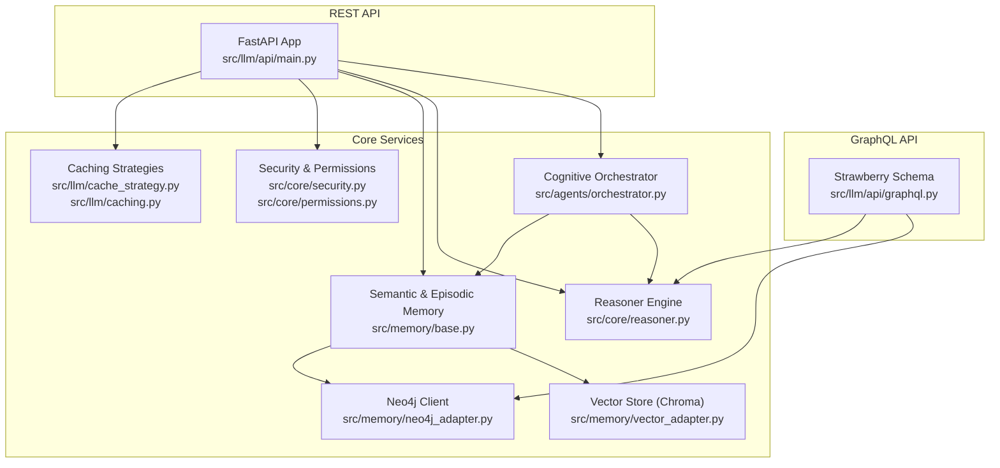
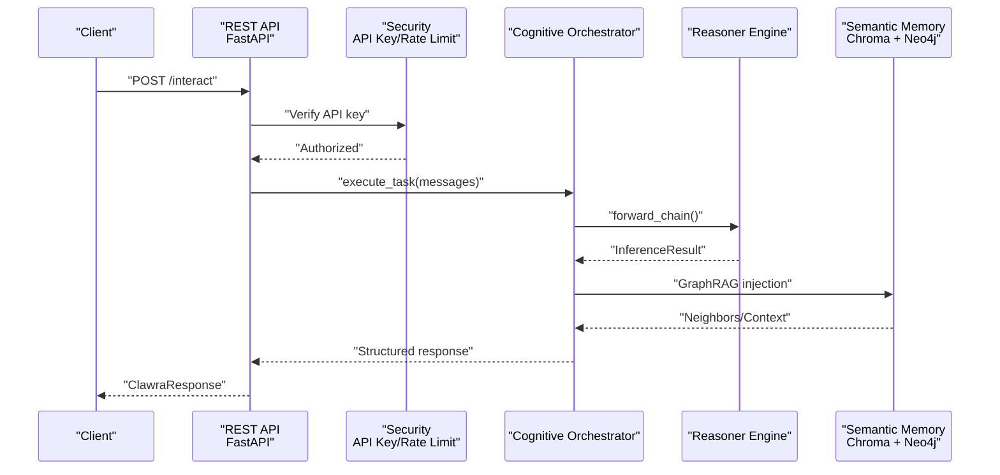
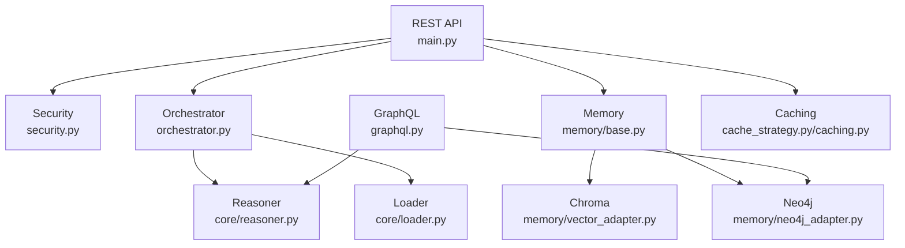

# API Reference

<cite>
**Referenced Files in This Document**
- [main.py](file://src/llm/api/main.py)
- [graphql.py](file://src/llm/api/graphql.py)
- [api.py](file://src/llm/api.py)
- [security.py](file://src/core/security.py)
- [permissions.py](file://src/core/permissions.py)
- [reasoner.py](file://src/core/reasoner.py)
- [loader.py](file://src/core/loader.py)
- [orchestrator.py](file://src/agents/orchestrator.py)
- [base.py](file://src/memory/base.py)
- [vector_adapter.py](file://src/memory/vector_adapter.py)
- [neo4j_adapter.py](file://src/memory/neo4j_adapter.py)
- [cache_strategy.py](file://src/llm/cache_strategy.py)
- [caching.py](file://src/llm/caching.py)
- [pyproject.toml](file://pyproject.toml)
- [requirements.txt](file://requirements.txt)
</cite>

## Table of Contents
1. [Introduction](#introduction)
2. [Project Structure](#project-structure)
3. [Core Components](#core-components)
4. [Architecture Overview](#architecture-overview)
5. [Detailed Component Analysis](#detailed-component-analysis)
6. [Dependency Analysis](#dependency-analysis)
7. [Performance Considerations](#performance-considerations)
8. [Troubleshooting Guide](#troubleshooting-guide)
9. [Conclusion](#conclusion)
10. [Appendices](#appendices)

## Introduction
This document provides comprehensive API documentation for the RESTful and GraphQL interfaces of the Clawra Cognitive Engine. It covers HTTP methods, URL patterns, request/response schemas, authentication, authorization, rate limiting, and security controls. It also includes GraphQL schema definitions, query and mutation patterns, and practical usage examples. Guidance for Python SDK usage and client implementation is included, along with performance optimization tips, error handling strategies, and versioning/migration notes.

## Project Structure
The API surface is implemented using FastAPI for REST and Strawberry GraphQL for graph-oriented queries. Supporting modules include:
- Security and permissions for authentication and access control
- Cognitive orchestration and reasoning engines
- Memory systems integrating vector and graph databases
- Caching strategies for performance

**Diagram sources**
- [main.py:48-64](file://src/llm/api/main.py#L48-L64)
- [graphql.py:498-501](file://src/llm/api/graphql.py#L498-L501)
- [security.py:93-93](file://src/core/security.py#L93-L93)
- [permissions.py:424-424](file://src/core/permissions.py#L424-L424)
- [reasoner.py:145-180](file://src/core/reasoner.py#L145-L180)
- [orchestrator.py:23-42](file://src/agents/orchestrator.py#L23-L42)
- [base.py:9-28](file://src/memory/base.py#L9-L28)
- [vector_adapter.py:31-43](file://src/memory/vector_adapter.py#L31-L43)
- [neo4j_adapter.py:130-178](file://src/memory/neo4j_adapter.py#L130-L178)
- [cache_strategy.py:664-678](file://src/llm/cache_strategy.py#L664-L678)
- [caching.py:463-477](file://src/llm/caching.py#L463-L477)

**Section sources**
- [main.py:48-64](file://src/llm/api/main.py#L48-L64)
- [graphql.py:498-501](file://src/llm/api/graphql.py#L498-L501)

## Core Components
- REST API server built with FastAPI, exposing health, status, knowledge ingestion, querying, reasoning, rule management, interactive tasks, and learning endpoints.
- GraphQL API providing typed queries and mutations for RDF triples, graph nodes/relationships, schema introspection, confidence propagation, inference tracing, and data mutations.
- Security and permissions modules implementing API key management, rate limiting, IP blocking, security headers, input validation, and RBAC.
- Cognitive orchestration coordinating LLM interactions, knowledge extraction, graphRAG, and rule engine gating.
- Memory subsystem integrating Chroma vector store and Neo4j graph database with hybrid retrieval and reasoning.

**Section sources**
- [main.py:133-168](file://src/llm/api/main.py#L133-L168)
- [graphql.py:162-347](file://src/llm/api/graphql.py#L162-L347)
- [security.py:21-93](file://src/core/security.py#L21-L93)
- [permissions.py:166-182](file://src/core/permissions.py#L166-L182)
- [reasoner.py:145-180](file://src/core/reasoner.py#L145-L180)
- [orchestrator.py:23-42](file://src/agents/orchestrator.py#L23-L42)
- [base.py:9-28](file://src/memory/base.py#L9-L28)
- [vector_adapter.py:31-43](file://src/memory/vector_adapter.py#L31-L43)
- [neo4j_adapter.py:130-178](file://src/memory/neo4j_adapter.py#L130-L178)

## Architecture Overview
The REST API is the primary interface for ingestion, querying, reasoning, and rule management. The GraphQL API complements it with graph-centric operations. Both rely on shared security and permission layers, and leverage the reasoning engine and memory systems.

**Diagram sources**
- [main.py:424-439](file://src/llm/api/main.py#L424-L439)
- [security.py:21-31](file://src/core/security.py#L21-L31)
- [orchestrator.py:128-365](file://src/agents/orchestrator.py#L128-L365)
- [reasoner.py:243-349](file://src/core/reasoner.py#L243-L349)
- [base.py:111-120](file://src/memory/base.py#L111-L120)

## Detailed Component Analysis

### REST API Endpoints

- Root and Health
  - GET /
    - Description: Returns API metadata and status.
    - Response: name, version, description, docs, status.
  - GET /health
    - Description: Health check.
    - Response: status, timestamp, service statuses.

- Status
  - GET /status
    - Auth: Optional API key via Authorization Bearer.
    - Response: total_facts, total_rules, graph_connected, vector_store_status, uptime.

- Knowledge Management
  - POST /knowledge/ingest
    - Auth: Optional API key.
    - Body: UserInput (text, context).
    - Response: ClawraResponse (intent, status, message, facts[], confidence, trace[]).
  - POST /knowledge/facts
    - Auth: Optional API key.
    - Body: FactInput (subject, predicate, object, confidence, source).
    - Response: status, message, fact.
  - GET /knowledge/facts
    - Auth: Optional API key.
    - Query: subject, predicate, object, min_confidence, limit.
    - Response: count, facts[] with subject, predicate, object, confidence, source.
  - DELETE /knowledge/facts/clear
    - Auth: Optional API key.
    - Response: status, message.

- Query and Reasoning
  - POST /query
    - Auth: Optional API key.
    - Body: QueryInput (query, top_k, min_confidence).
    - Response: query, vector_results[], fact_count, total_results.
  - POST /reasoning/forward
    - Auth: Optional API key.
    - Body: ReasoningInput (max_depth, direction).
    - Response: conclusions_count, facts_used_count, depth, total_confidence, conclusions[].
  - POST /reasoning/backward
    - Auth: Optional API key.
    - Body: FactInput (subject, predicate, object) + max_depth.
    - Response: goal, conclusions_count, total_confidence, conclusions[].
  - GET /reasoning/explain
    - Auth: Optional API key.
    - Response: explanation, conclusions, confidence.

- Rule Management
  - GET /rules
    - Auth: Optional API key.
    - Response: count, rules[].
  - POST /rules
    - Auth: Optional API key.
    - Body: RuleInput (id, target_object_class, expression, description, version).
    - Response: status, rule_id, warnings[].
  - POST /rules/evaluate
    - Auth: Optional API key.
    - Body: RuleEvaluationInput (rule_id, context{...}).
    - Response: RuleEvaluationResponse (rule_id, status, passed, expression, context_used, message).
  - GET /rules/object/{object_class}
    - Auth: Optional API key.
    - Response: object_class, count, rules[].

- Interactive
  - POST /interact
    - Auth: Optional API key.
    - Body: UserInput (text, context).
    - Response: ClawraResponse (intent, status, message, facts[], confidence, trace[]).

- Learning
  - GET /episodes
    - Auth: Optional API key.
    - Query: limit.
    - Response: count, episodes[].
  - POST /episodes/feedback
    - Auth: Optional API key.
    - Body: task_id, reward, correction.
    - Response: status, message.

- Authentication and Authorization
  - Optional API key via Authorization Bearer header.
  - Global dependency verifies key against environment variable.
  - Rate limiting and IP blocking implemented in security module.

- Request/Response Schemas
  - UserInput, FactInput, RuleInput, QueryInput, ReasoningInput, ClawraResponse, KnowledgeStatus, RuleEvaluationInput, RuleEvaluationResponse.

**Section sources**
- [main.py:133-168](file://src/llm/api/main.py#L133-L168)
- [main.py:172-246](file://src/llm/api/main.py#L172-L246)
- [main.py:250-280](file://src/llm/api/main.py#L250-L280)
- [main.py:282-356](file://src/llm/api/main.py#L282-L356)
- [main.py:360-420](file://src/llm/api/main.py#L360-L420)
- [main.py:424-439](file://src/llm/api/main.py#L424-L439)
- [main.py:443-468](file://src/llm/api/main.py#L443-L468)
- [main.py:21-31](file://src/llm/api/main.py#L21-L31)

### GraphQL API

- Schema Types
  - RDFTripleType, OntologyClassType, OntologyPropertyType, GraphNodeType, GraphRelationshipType, InferenceConclusionType, ConfidenceResultType, InferencePathType, StatsType, HealthStatusType.

- Queries
  - triples(subject?, predicate?, obj?, min_confidence)
  - classes()
  - properties()
  - node(name)
  - neighbors(name, depth)
  - stats()
  - health()
  - confidence_propagation(start_entity, max_depth, method)
  - trace_inference(start_entity, end_entity, max_depth)

- Mutations
  - create_entity(name, label, properties, confidence)
  - create_relationship(start_entity, end_entity, relationship_type, properties, confidence)
  - add_triple(subject, predicate, obj, confidence, source)
  - create_class(uri, label, super_classes, description)
  - calculate_confidence(evidence, method)

- Context
  - QueryContext exposes rdf_adapter, neo4j_client, reasoner, confidence_calculator.

- Notes
  - Requires context wiring to provide adapters and calculators.
  - Uses JSON string properties for Neo4j mutations.

**Section sources**
- [graphql.py:25-138](file://src/llm/api/graphql.py#L25-L138)
- [graphql.py:162-347](file://src/llm/api/graphql.py#L162-L347)
- [graphql.py:352-493](file://src/llm/api/graphql.py#L352-L493)
- [graphql.py:149-158](file://src/llm/api/graphql.py#L149-L158)

### Authentication and Authorization

- API Key Verification
  - Optional bearer token checked against environment variable.
  - Raises 401 Unauthorized on mismatch.

- Rate Limiting
  - Token bucket implementation with configurable requests per minute and burst size.
  - Provides remaining tokens and reset timing.

- IP Blocking
  - Tracks failed attempts and blocks IPs exceeding threshold.

- Security Headers
  - Configurable headers for XSS, frame options, CSP, HSTS, referrer policy, permissions policy.

- Input Validation
  - Sanitization and length limits for queries and URIs.
  - Injection pattern checks.

- Permissions (RBAC)
  - Roles and permissions for read/write/schema/admin/export.
  - Permission manager supports role assignment and checks.

**Section sources**
- [main.py:21-31](file://src/llm/api/main.py#L21-L31)
- [security.py:98-157](file://src/core/security.py#L98-L157)
- [security.py:162-207](file://src/core/security.py#L162-L207)
- [security.py:212-232](file://src/core/security.py#L212-L232)
- [security.py:243-320](file://src/core/security.py#L243-L320)
- [permissions.py:24-52](file://src/core/permissions.py#L24-L52)
- [permissions.py:166-182](file://src/core/permissions.py#L166-L182)

### Cognitive Orchestration and Reasoning

- Orchestrator
  - Executes ReAct loops with tool-calling: ingest_knowledge, query_graph, execute_action.
  - Audits plans and enforces rule engine preconditions.
  - Integrates with extractor, contradiction checker, metacognitive agent, auditor.

- Reasoner
  - Forward and backward chaining with confidence propagation.
  - Rule registration and pattern matching.
  - Query facts with filtering and confidence thresholds.

**Section sources**
- [orchestrator.py:23-42](file://src/agents/orchestrator.py#L23-L42)
- [orchestrator.py:128-365](file://src/agents/orchestrator.py#L128-L365)
- [reasoner.py:145-180](file://src/core/reasoner.py#L145-L180)
- [reasoner.py:243-349](file://src/core/reasoner.py#L243-L349)
- [reasoner.py:673-703](file://src/core/reasoner.py#L673-L703)

### Memory and Storage

- Semantic Memory
  - Hybrid: Chroma vector store + Neo4j graph.
  - Entity normalization, sample triples, neighbor traversal, semantic search.

- Vector Store (Chroma)
  - Persistent client, add_documents, similarity_search.

- Neo4j Client
  - Entity CRUD, relationship management, neighbor queries, shortest path, inference tracing, confidence propagation.

**Section sources**
- [base.py:9-28](file://src/memory/base.py#L9-L28)
- [base.py:91-120](file://src/memory/base.py#L91-L120)
- [vector_adapter.py:31-79](file://src/memory/vector_adapter.py#L31-L79)
- [neo4j_adapter.py:130-178](file://src/memory/neo4j_adapter.py#L130-L178)
- [neo4j_adapter.py:485-561](file://src/memory/neo4j_adapter.py#L485-L561)
- [neo4j_adapter.py:599-709](file://src/memory/neo4j_adapter.py#L599-L709)
- [neo4j_adapter.py:711-774](file://src/memory/neo4j_adapter.py#L711-L774)

### Caching Strategies

- Enhanced LRU Cache with TTL, tags, priority, and periodic cleanup.
- Two-level cache combining in-memory L1 and optional Redis L2.
- Cache decorators for function memoization with automatic key generation.
- Monitored cache with access logs and statistics.

**Section sources**
- [cache_strategy.py:109-281](file://src/llm/cache_strategy.py#L109-L281)
- [cache_strategy.py:424-534](file://src/llm/cache_strategy.py#L424-L534)
- [cache_strategy.py:584-661](file://src/llm/cache_strategy.py#L584-L661)
- [caching.py:76-201](file://src/llm/caching.py#L76-L201)
- [caching.py:205-276](file://src/llm/caching.py#L205-L276)
- [caching.py:352-429](file://src/llm/caching.py#L352-L429)

### Legacy API (Domain Ontology)
- Deprecated in favor of REST and GraphQL.
- Supports domain-specific queries with recommendation outputs.

**Section sources**
- [api.py:24-39](file://src/llm/api.py#L24-L39)
- [api.py:41-312](file://src/llm/api.py#L41-L312)

## Dependency Analysis

**Diagram sources**
- [main.py:34-38](file://src/llm/api/main.py#L34-L38)
- [security.py:93-93](file://src/core/security.py#L93-L93)
- [orchestrator.py:29-41](file://src/agents/orchestrator.py#L29-L41)
- [reasoner.py:162-173](file://src/core/reasoner.py#L162-L173)
- [loader.py:146-151](file://src/core/loader.py#L146-L151)
- [base.py:27-27](file://src/memory/base.py#L27-L27)
- [vector_adapter.py:42-43](file://src/memory/vector_adapter.py#L42-L43)
- [neo4j_adapter.py:166-167](file://src/memory/neo4j_adapter.py#L166-L167)
- [graphql.py:498-501](file://src/llm/api/graphql.py#L498-L501)
- [cache_strategy.py:667-677](file://src/llm/cache_strategy.py#L667-L677)
- [caching.py:466-477](file://src/llm/caching.py#L466-L477)

**Section sources**
- [main.py:34-38](file://src/llm/api/main.py#L34-L38)
- [orchestrator.py:29-41](file://src/agents/orchestrator.py#L29-L41)
- [reasoner.py:162-173](file://src/core/reasoner.py#L162-L173)
- [base.py:27-27](file://src/memory/base.py#L27-L27)
- [vector_adapter.py:42-43](file://src/memory/vector_adapter.py#L42-L43)
- [neo4j_adapter.py:166-167](file://src/memory/neo4j_adapter.py#L166-L167)
- [graphql.py:498-501](file://src/llm/api/graphql.py#L498-L501)
- [cache_strategy.py:667-677](file://src/llm/cache_strategy.py#L667-L677)
- [caching.py:466-477](file://src/llm/caching.py#L466-L477)

## Performance Considerations
- Use forward chaining with bounded max_depth and circuit breaker timeouts to prevent long-running computations.
- Leverage hybrid GraphRAG: vector search for recall, graph traversal for precision.
- Enable caching for repeated queries and inference results; monitor hit rates and eviction patterns.
- Apply rate limiting to protect downstream services; tune burst size and requests per minute.
- Normalize entities to reduce synonym noise and improve graph density.
- Prefer batch operations for bulk imports and updates.

[No sources needed since this section provides general guidance]

## Troubleshooting Guide
- Authentication failures
  - Ensure Authorization Bearer header matches configured API key.
  - Verify environment variable availability and correctness.

- Rate limit exceeded
  - Inspect returned remaining tokens and reset timing.
  - Reduce request frequency or increase quota.

- Graph connectivity issues
  - Confirm Neo4j client connection and credentials.
  - Check inference tracing and confidence propagation results.

- Query timeouts
  - Reduce max_depth or top_k.
  - Validate input sanitization and injection prevention.

- Caching anomalies
  - Review cache stats and tag-based invalidation.
  - Adjust TTL and eviction policies.

**Section sources**
- [main.py:21-31](file://src/llm/api/main.py#L21-L31)
- [security.py:124-145](file://src/core/security.py#L124-L145)
- [neo4j_adapter.py:179-199](file://src/memory/neo4j_adapter.py#L179-L199)
- [reasoner.py:275-277](file://src/core/reasoner.py#L275-L277)
- [cache_strategy.py:259-280](file://src/llm/cache_strategy.py#L259-L280)

## Conclusion
The REST and GraphQL APIs provide a robust foundation for knowledge ingestion, graph-centric queries, reasoning, and rule enforcement. Combined with strong security, permissions, and caching strategies, they enable scalable enterprise-grade cognitive applications. Adopt the recommended patterns for authentication, rate limiting, and performance tuning to ensure reliable operation.

[No sources needed since this section summarizes without analyzing specific files]

## Appendices

### API Versioning and Migration
- REST API versioning is exposed via the FastAPI app metadata.
- GraphQL schema is versioned implicitly by schema changes; maintain backward compatibility by adding new fields and deprecating old ones.
- Migrate from legacy domain API to REST/GraphQL endpoints for continued support.

**Section sources**
- [main.py:48-61](file://src/llm/api/main.py#L48-L61)
- [api.py:6-6](file://src/llm/api.py#L6-L6)

### Python SDK Usage Patterns
- REST client
  - Use an HTTP client library to send requests to REST endpoints.
  - Include Authorization Bearer header with API key.
  - Respect rate limits and retry with exponential backoff on 429.

- GraphQL client
  - Use a GraphQL client to execute typed queries and mutations.
  - Provide context with adapters and calculators.
  - Handle JSON-encoded properties for Neo4j mutations.

- Caching
  - Wrap expensive operations with cache decorators.
  - Invalidate by tags when data changes.

**Section sources**
- [main.py:21-31](file://src/llm/api/main.py#L21-L31)
- [graphql.py:149-158](file://src/llm/api/graphql.py#L149-L158)
- [cache_strategy.py:584-661](file://src/llm/cache_strategy.py#L584-L661)

### Security Considerations
- Enforce HTTPS and secure headers.
- Rotate API keys regularly and revoke unused keys.
- Monitor audit logs for auth and authorization events.
- Validate and sanitize all inputs to prevent injection.

**Section sources**
- [security.py:212-232](file://src/core/security.py#L212-L232)
- [security.py:358-403](file://src/core/security.py#L358-L403)
- [security.py:243-320](file://src/core/security.py#L243-L320)

### Example Workflows

- Ingest and Query
  - POST /knowledge/ingest with raw text.
  - POST /query with top_k and min_confidence.
  - POST /reasoning/forward for derived insights.

- Graph Operations
  - Use GraphQL queries to fetch triples, classes, properties, nodes, neighbors, stats, health.
  - Use mutations to create entities, relationships, and define classes.

- Rule Evaluation
  - POST /rules to register rules.
  - POST /rules/evaluate to validate with context.

**Section sources**
- [main.py:172-186](file://src/llm/api/main.py#L172-L186)
- [main.py:250-280](file://src/llm/api/main.py#L250-L280)
- [main.py:282-309](file://src/llm/api/main.py#L282-L309)
- [graphql.py:162-347](file://src/llm/api/graphql.py#L162-L347)
- [graphql.py:352-493](file://src/llm/api/graphql.py#L352-L493)
- [main.py:368-411](file://src/llm/api/main.py#L368-L411)