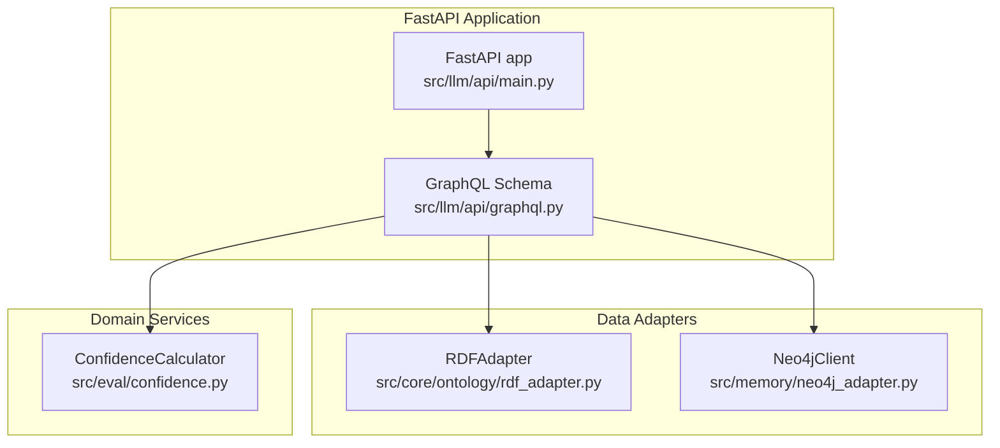
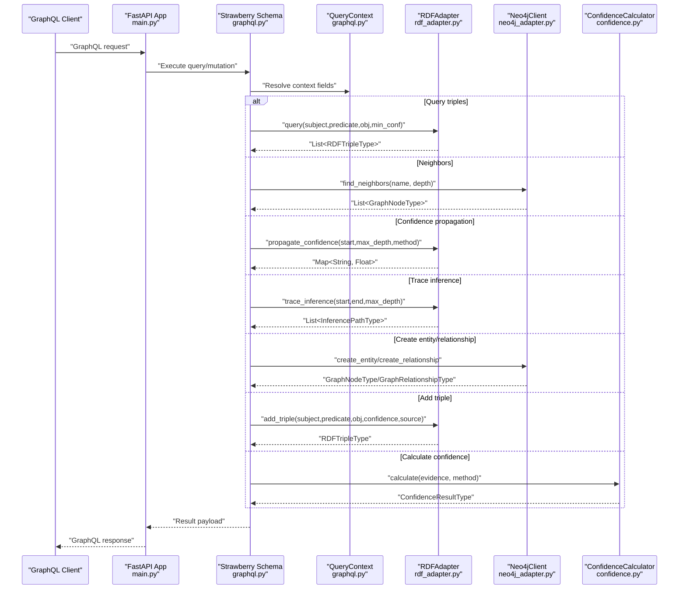
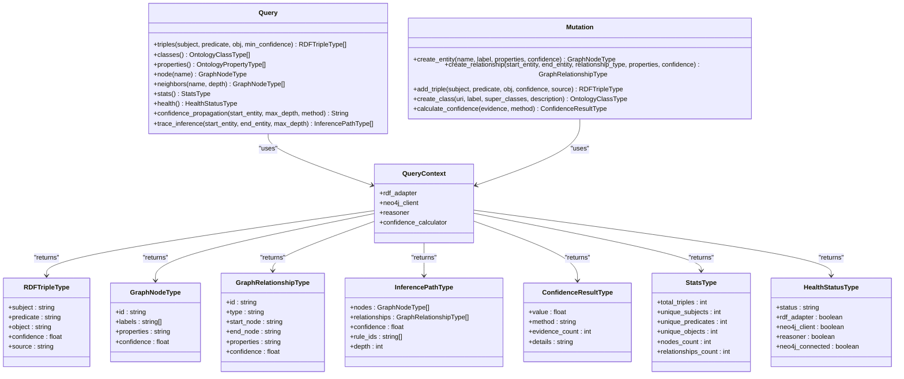
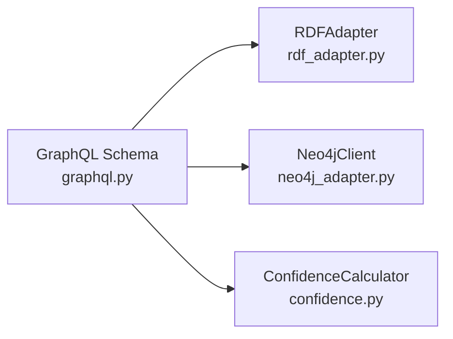

# GraphQL Schema

<cite>
**Referenced Files in This Document**
- [graphql.py](file://src/llm/api/graphql.py)
- [main.py](file://src/llm/api/main.py)
- [rdf_adapter.py](file://src/core/ontology/rdf_adapter.py)
- [neo4j_adapter.py](file://src/memory/neo4j_adapter.py)
- [confidence.py](file://src/eval/confidence.py)
- [README.md](file://src/llm/api/README.md)
</cite>

## Table of Contents
1. [Introduction](#introduction)
2. [Project Structure](#project-structure)
3. [Core Components](#core-components)
4. [Architecture Overview](#architecture-overview)
5. [Detailed Component Analysis](#detailed-component-analysis)
6. [Dependency Analysis](#dependency-analysis)
7. [Performance Considerations](#performance-considerations)
8. [Troubleshooting Guide](#troubleshooting-guide)
9. [Conclusion](#conclusion)
10. [Appendices](#appendices)

## Introduction
This document describes the GraphQL API for the knowledge graph interface. It covers schema definitions, query patterns, mutation operations, and subscription handling. It also documents type definitions for facts, rules, reasoning results, and confidence levels, along with practical query and mutation examples, schema introspection capabilities, error handling patterns, and performance optimization strategies for complex queries.

## Project Structure
The GraphQL API is implemented using Strawberry and exposed via a FastAPI application. The schema integrates RDF triple storage, Neo4j graph storage, and confidence calculation modules.

**Diagram sources**
- [main.py:48-64](file://src/llm/api/main.py#L48-L64)
- [graphql.py:498-501](file://src/llm/api/graphql.py#L498-L501)
- [rdf_adapter.py:145-180](file://src/core/ontology/rdf_adapter.py#L145-L180)
- [neo4j_adapter.py:130-178](file://src/memory/neo4j_adapter.py#L130-L178)
- [confidence.py:32-62](file://src/eval/confidence.py#L32-L62)

**Section sources**
- [README.md:47-56](file://src/llm/api/README.md#L47-L56)
- [main.py:48-64](file://src/llm/api/main.py#L48-L64)
- [graphql.py:498-501](file://src/llm/api/graphql.py#L498-L501)

## Core Components
- GraphQL Schema: Root Query and Mutation types define the API surface.
- Types: Strongly typed representations for RDF triples, graph nodes/relationships, inference paths, confidence results, and statistics.
- Context: Query/Mutation resolvers access adapters and calculators via the GraphQL context.
- Integrations: RDFAdapter for triple storage and queries; Neo4jClient for graph CRUD and traversal; ConfidenceCalculator for confidence computations.

Key capabilities:
- Query RDF triples and schema metadata
- Explore graph nodes and neighbors
- Compute confidence propagation and trace inference paths
- Mutate graph entities and relationships
- Add RDF triples and define classes
- Calculate confidence from evidence

**Section sources**
- [graphql.py:23-147](file://src/llm/api/graphql.py#L23-L147)
- [graphql.py:162-347](file://src/llm/api/graphql.py#L162-L347)
- [graphql.py:352-493](file://src/llm/api/graphql.py#L352-L493)

## Architecture Overview
The GraphQL schema composes resolver functions that delegate to domain adapters and services. The context carries initialized adapters and calculators.

**Diagram sources**
- [graphql.py:162-347](file://src/llm/api/graphql.py#L162-L347)
- [graphql.py:352-493](file://src/llm/api/graphql.py#L352-L493)
- [rdf_adapter.py:537-583](file://src/core/ontology/rdf_adapter.py#L537-L583)
- [rdf_adapter.py:619-685](file://src/core/ontology/rdf_adapter.py#L619-L685)
- [rdf_adapter.py:687-754](file://src/core/ontology/rdf_adapter.py#L687-L754)
- [neo4j_adapter.py:222-277](file://src/memory/neo4j_adapter.py#L222-L277)
- [neo4j_adapter.py:347-412](file://src/memory/neo4j_adapter.py#L347-L412)
- [confidence.py:63-98](file://src/eval/confidence.py#L63-L98)

## Detailed Component Analysis

### GraphQL Schema Definition
The schema defines:
- Root Query: triples, classes, properties, node, neighbors, stats, health, confidence_propagation, trace_inference
- Root Mutation: create_entity, create_relationship, add_triple, create_class, calculate_confidence
- Types: RDFTripleType, OntologyClassType, OntologyPropertyType, GraphNodeType, GraphRelationshipType, InferenceConclusionType, ConfidenceResultType, InferencePathType, StatsType, HealthStatusType
- Context: QueryContext with rdf_adapter, neo4j_client, reasoner, confidence_calculator

**Diagram sources**
- [graphql.py:162-347](file://src/llm/api/graphql.py#L162-L347)
- [graphql.py:352-493](file://src/llm/api/graphql.py#L352-L493)
- [graphql.py:151-158](file://src/llm/api/graphql.py#L151-L158)
- [graphql.py:25-147](file://src/llm/api/graphql.py#L25-L147)

**Section sources**
- [graphql.py:23-147](file://src/llm/api/graphql.py#L23-L147)
- [graphql.py:151-158](file://src/llm/api/graphql.py#L151-L158)
- [graphql.py:162-347](file://src/llm/api/graphql.py#L162-L347)
- [graphql.py:352-493](file://src/llm/api/graphql.py#L352-L493)

### Query Patterns
Representative query patterns supported by the schema:

- Retrieve RDF triples with optional filters and minimum confidence threshold
- Fetch all classes and properties from the ontology schema
- Get a graph node by name and explore neighbors up to a specified depth
- Obtain system statistics combining RDF and Neo4j metrics
- Health status for integrated services
- Confidence propagation from a starting entity with configurable method
- Trace inference paths between two entities with depth limits

Example usage patterns:
- Knowledge exploration: Use triples with filters and min_confidence to discover facts.
- Rule evaluation: Use confidence_propagation to assess reachability confidence.
- Reasoning traces: Use trace_inference to retrieve detailed inference paths with nodes and relationships.

**Section sources**
- [graphql.py:165-179](file://src/llm/api/graphql.py#L165-L179)
- [graphql.py:181-203](file://src/llm/api/graphql.py#L181-L203)
- [graphql.py:205-246](file://src/llm/api/graphql.py#L205-L246)
- [graphql.py:248-269](file://src/llm/api/graphql.py#L248-L269)
- [graphql.py:271-286](file://src/llm/api/graphql.py#L271-L286)
- [graphql.py:288-301](file://src/llm/api/graphql.py#L288-L301)
- [graphql.py:303-347](file://src/llm/api/graphql.py#L303-L347)

### Mutation Operations
Supported mutations:

- Create a graph entity with label, properties, and confidence
- Create a relationship between two entities with type, properties, and confidence
- Add an RDF triple with subject, predicate, object, confidence, and source
- Define an ontology class with URI, label, super classes, and description
- Compute confidence from a list of evidence items using various methods

Example usage patterns:
- Adding facts: Use add_triple to insert RDF triples into the knowledge base.
- Enriching the graph: Use create_entity and create_relationship to model entities and relationships.
- Managing ontologies: Use create_class to extend the schema.

**Section sources**
- [graphql.py:355-378](file://src/llm/api/graphql.py#L355-L378)
- [graphql.py:380-410](file://src/llm/api/graphql.py#L380-L410)
- [graphql.py:410-434](file://src/llm/api/graphql.py#L410-L434)
- [graphql.py:434-455](file://src/llm/api/graphql.py#L434-L455)
- [graphql.py:457-493](file://src/llm/api/graphql.py#L457-L493)

### Subscription Handling
The repository does not include a Subscription definition in the GraphQL schema. The schema currently exposes only Query and Mutation roots. Real-time subscriptions are not implemented in the provided files.

**Section sources**
- [graphql.py:498-501](file://src/llm/api/graphql.py#L498-L501)

### Schema Introspection Capabilities
The GraphQL schema supports introspection. Clients can discover types, fields, arguments, and descriptions at runtime. This enables interactive exploration of the schema and dynamic tooling support.

**Section sources**
- [graphql.py:498-501](file://src/llm/api/graphql.py#L498-L501)

### Error Handling Patterns
- Initialization checks: Resolvers verify the presence of adapters and clients in the context before proceeding.
- Explicit exceptions: Mutations that require initialized adapters raise explicit errors when unavailable.
- Graceful fallbacks: Queries return empty lists or null when dependencies are missing.

Recommended practices:
- Ensure context initialization sets rdf_adapter, neo4j_client, reasoner, and confidence_calculator.
- Wrap external calls with try/catch and log meaningful errors.
- Return structured error responses for failed mutations.

**Section sources**
- [graphql.py:174-176](file://src/llm/api/graphql.py#L174-L176)
- [graphql.py:364-366](file://src/llm/api/graphql.py#L364-L366)
- [graphql.py:421-422](file://src/llm/api/graphql.py#L421-L422)

### Performance Considerations
- Limit traversal depth: Use depth parameters in neighbors and trace_inference to cap computational cost.
- Filter early: Apply min_confidence and pattern filters to reduce result sets.
- Batch operations: Prefer bulk imports for large-scale RDF triple ingestion.
- Caching: Leverage memoization and caching strategies for repeated queries.
- Indexing: Ensure appropriate indexing in Neo4j for frequent traversals.

[No sources needed since this section provides general guidance]

## Dependency Analysis
The GraphQL schema depends on:
- RDFAdapter for triple queries, schema exports, confidence propagation, and inference tracing
- Neo4jClient for graph CRUD and traversal
- ConfidenceCalculator for evidence-based confidence computation

**Diagram sources**
- [graphql.py:162-347](file://src/llm/api/graphql.py#L162-L347)
- [graphql.py:352-493](file://src/llm/api/graphql.py#L352-L493)
- [rdf_adapter.py:145-180](file://src/core/ontology/rdf_adapter.py#L145-L180)
- [neo4j_adapter.py:130-178](file://src/memory/neo4j_adapter.py#L130-L178)
- [confidence.py:32-62](file://src/eval/confidence.py#L32-L62)

**Section sources**
- [graphql.py:162-347](file://src/llm/api/graphql.py#L162-L347)
- [graphql.py:352-493](file://src/llm/api/graphql.py#L352-L493)

## Performance Considerations
- Use pagination and limits for large result sets.
- Prefer indexed lookups and avoid deep traversals when unnecessary.
- Cache frequently accessed schema metadata and confidence computations.
- Monitor query latency and adjust max_depth and top-k parameters accordingly.

[No sources needed since this section provides general guidance]

## Troubleshooting Guide
Common issues and resolutions:
- Missing adapters in context: Ensure the GraphQL context initializes rdf_adapter, neo4j_client, reasoner, and confidence_calculator.
- Neo4j connectivity failures: Verify connection parameters and network access.
- Excessive traversal costs: Reduce depth and refine filters.
- Confidence calculation errors: Validate evidence inputs and method selection.

**Section sources**
- [graphql.py:174-176](file://src/llm/api/graphql.py#L174-L176)
- [graphql.py:364-366](file://src/llm/api/graphql.py#L364-L366)
- [graphql.py:421-422](file://src/llm/api/graphql.py#L421-L422)

## Conclusion
The GraphQL API provides a cohesive interface for exploring and manipulating the knowledge graph. It integrates RDF triple storage, Neo4j graph operations, and confidence computation, enabling robust querying, reasoning, and rule evaluation. While subscriptions are not currently implemented, the schema supports introspection and can be extended to include real-time updates.

## Appendices

### Type Definitions Reference
- RDFTripleType: subject, predicate, object, confidence, source
- OntologyClassType: uri, label, description, super_classes, confidence
- OntologyPropertyType: uri, label, property_type, domain, range, confidence
- GraphNodeType: id, labels, properties, confidence
- GraphRelationshipType: id, type, start_node, end_node, properties, confidence
- InferencePathType: nodes, relationships, confidence, rule_ids, depth
- ConfidenceResultType: value, method, evidence_count, details
- StatsType: total_triples, unique_subjects, unique_predicates, unique_objects, nodes_count, relationships_count
- HealthStatusType: status, rdf_adapter, neo4j_client, reasoner, neo4j_connected

**Section sources**
- [graphql.py:25-147](file://src/llm/api/graphql.py#L25-L147)

### Example Query Patterns
- Knowledge exploration: Query triples with subject/predicate/object filters and min_confidence.
- Rule evaluation: Use confidence_propagation to estimate confidence spread from a seed entity.
- Reasoning traces: Use trace_inference to retrieve inference paths with nodes and relationships.

**Section sources**
- [graphql.py:165-179](file://src/llm/api/graphql.py#L165-L179)
- [graphql.py:288-301](file://src/llm/api/graphql.py#L288-L301)
- [graphql.py:303-347](file://src/llm/api/graphql.py#L303-L347)

### Example Mutation Patterns
- Adding facts: add_triple(subject, predicate, obj, confidence, source)
- Enriching the graph: create_entity(name, label, properties, confidence), create_relationship(start_entity, end_entity, relationship_type, properties, confidence)
- Managing ontologies: create_class(uri, label, super_classes, description)
- Computing confidence: calculate_confidence(evidence JSON, method)

**Section sources**
- [graphql.py:410-434](file://src/llm/api/graphql.py#L410-L434)
- [graphql.py:355-410](file://src/llm/api/graphql.py#L355-L410)
- [graphql.py:434-455](file://src/llm/api/graphql.py#L434-L455)
- [graphql.py:457-493](file://src/llm/api/graphql.py#L457-L493)