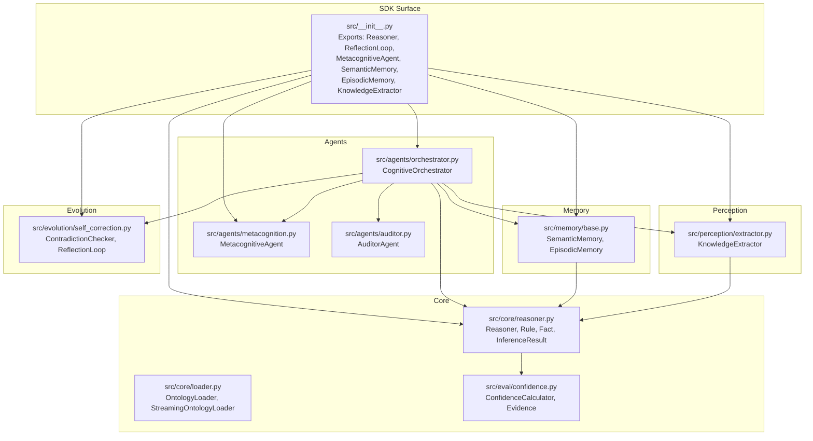
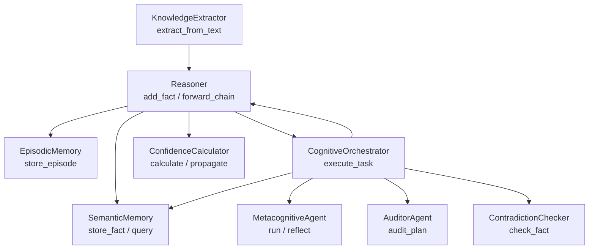
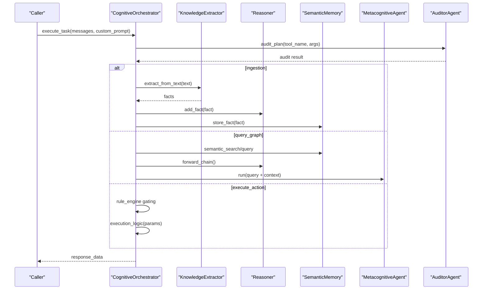
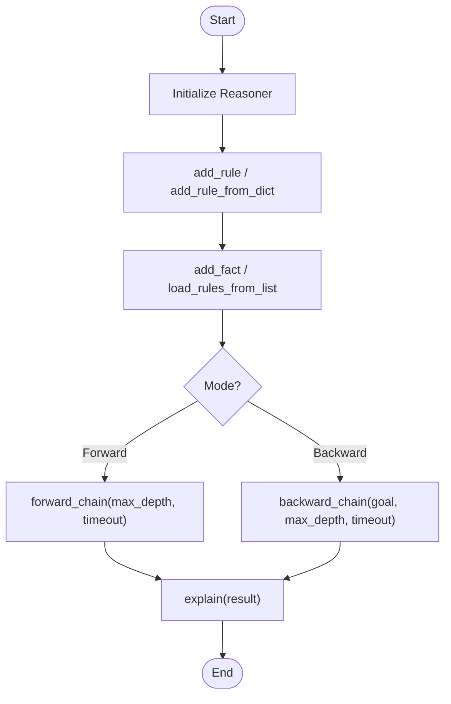
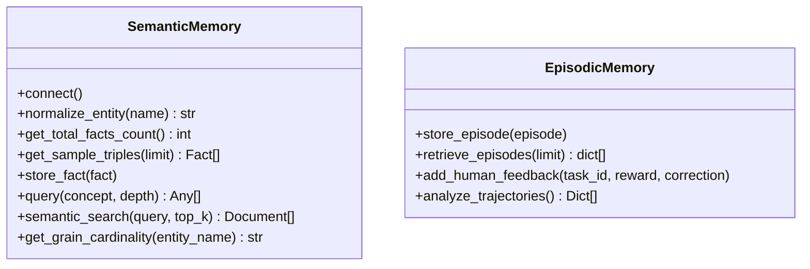
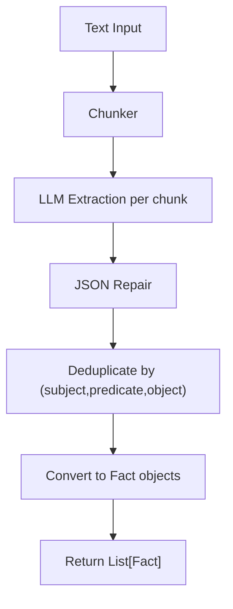
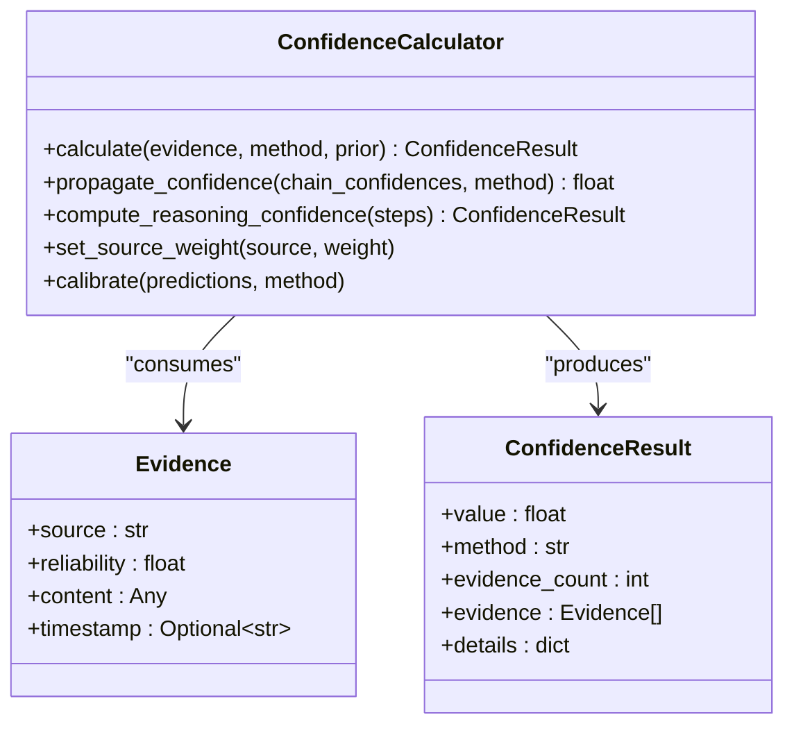
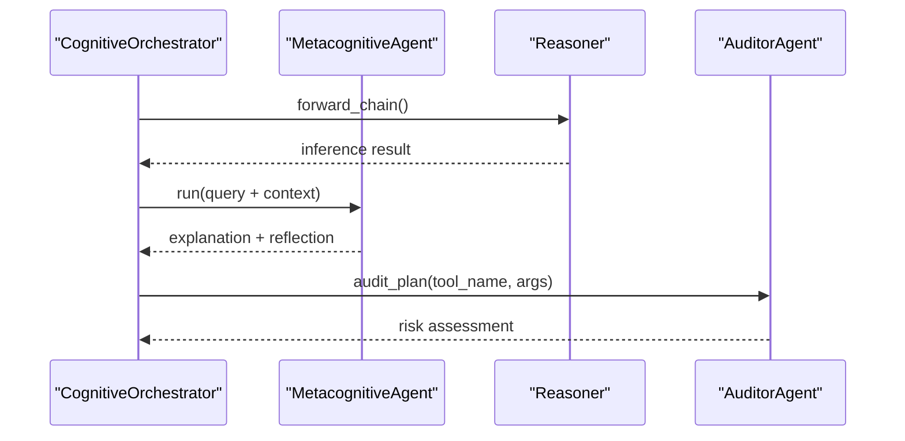
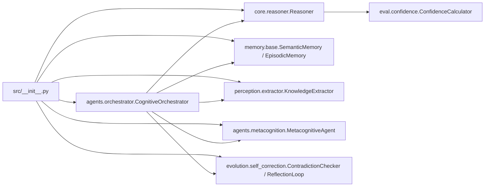

# Python SDK Reference

<cite>
**Referenced Files in This Document**
- [src/__init__.py](file://src/__init__.py)
- [src/core/reasoner.py](file://src/core/reasoner.py)
- [src/agents/orchestrator.py](file://src/agents/orchestrator.py)
- [src/memory/base.py](file://src/memory/base.py)
- [src/perception/extractor.py](file://src/perception/extractor.py)
- [src/evolution/self_correction.py](file://src/evolution/self_correction.py)
- [src/agents/metacognition.py](file://src/agents/metacognition.py)
- [src/agents/auditor.py](file://src/agents/auditor.py)
- [src/core/loader.py](file://src/core/loader.py)
- [src/eval/confidence.py](file://src/eval/confidence.py)
- [examples/clawra_full_stack_demo.py](file://examples/clawra_full_stack_demo.py)
- [examples/demo_confidence_reasoning.py](file://examples/demo_confidence_reasoning.py)
- [pyproject.toml](file://pyproject.toml)
</cite>

## Table of Contents
1. [Introduction](#introduction)
2. [Project Structure](#project-structure)
3. [Core Components](#core-components)
4. [Architecture Overview](#architecture-overview)
5. [Detailed Component Analysis](#detailed-component-analysis)
6. [Dependency Analysis](#dependency-analysis)
7. [Performance Considerations](#performance-considerations)
8. [Troubleshooting Guide](#troubleshooting-guide)
9. [Conclusion](#conclusion)
10. [Appendices](#appendices)

## Introduction
This document provides a comprehensive Python SDK reference for integrating with the Clawra framework. It focuses on client-facing classes, initialization patterns, method signatures, and practical usage examples for knowledge ingestion, reasoning, rule management, confidence calculations, memory management, and orchestration. It also covers error handling, asynchronous operations, configuration, authentication, and production best practices.

## Project Structure
The SDK exposes a concise public surface via the package’s root initializer, while internal modules encapsulate reasoning, memory, perception, agents, and evolution. The examples demonstrate end-to-end usage patterns.

**Diagram sources**
- [src/__init__.py:10-17](file://src/__init__.py#L10-L17)
- [src/core/reasoner.py:145-180](file://src/core/reasoner.py#L145-L180)
- [src/agents/orchestrator.py:23-42](file://src/agents/orchestrator.py#L23-L42)
- [src/memory/base.py:9-28](file://src/memory/base.py#L9-L28)
- [src/perception/extractor.py:83-108](file://src/perception/extractor.py#L83-L108)
- [src/evolution/self_correction.py:7-17](file://src/evolution/self_correction.py#L7-L17)
- [src/agents/metacognition.py:8-16](file://src/agents/metacognition.py#L8-L16)
- [src/agents/auditor.py:8-15](file://src/agents/auditor.py#L8-L15)
- [src/core/loader.py:131-144](file://src/core/loader.py#L131-L144)
- [src/eval/confidence.py:32-49](file://src/eval/confidence.py#L32-L49)

**Section sources**
- [src/__init__.py:10-17](file://src/__init__.py#L10-L17)
- [pyproject.toml:5-37](file://pyproject.toml#L5-L37)

## Core Components
This section documents the primary SDK classes and their initialization and method signatures.

- Reasoner
  - Purpose: Forward/backward reasoning engine with rule and fact management, confidence propagation, and explanation.
  - Initialization: Accepts optional OntologyLoader.
  - Key methods:
    - add_rule(rule)
    - add_fact(fact)
    - clear_facts()
    - forward_chain(initial_facts, max_depth, timeout_seconds, direction)
    - backward_chain(goal, max_depth, timeout_seconds)
    - explain(result) -> str
    - add_rule_from_dict(rule_dict)
    - load_rules_from_list(rules)
    - query(subject, predicate, obj, min_confidence) -> list[Fact]
  - Related types: Rule, Fact, InferenceResult, InferenceStep, ConfidenceResult, Evidence.

- CognitiveOrchestrator
  - Purpose: Orchestration of ingestion, reasoning, and action execution with auditing and memory governance.
  - Initialization: Requires Reasoner, SemanticMemory, EpisodicMemory, optional project_context.
  - Key methods:
    - execute_task(messages, custom_prompt) -> Dict[str, Any] (async)
    - Internal tool wiring and execution for ingest_knowledge, query_graph, execute_action.

- SemanticMemory
  - Purpose: Hybrid memory combining vector similarity and graph storage; supports normalization and sampling.
  - Initialization: Accepts connection parameters and optional mock mode.
  - Key methods:
    - connect()
    - normalize_entity(name) -> str
    - get_total_facts_count() -> int
    - get_sample_triples(limit) -> List[Fact]
    - store_fact(fact)
    - query(concept, depth) -> List[Any]
    - semantic_search(query, top_k) -> List[Document]
    - get_grain_cardinality(entity_name) -> str

- EpisodicMemory
  - Purpose: Persistent SQLite-backed memory for episodes, feedback, and trajectory analysis.
  - Initialization: Accepts db_path.
  - Key methods:
    - store_episode(episode)
    - retrieve_episodes(limit) -> List[dict]
    - add_human_feedback(task_id, reward, correction)
    - analyze_trajectories() -> List[Dict[str, Any]]

- KnowledgeExtractor
  - Purpose: Structured extraction of RDF triples from text with chunking and JSON repair.
  - Initialization: use_mock_llm flag; lazy LLM client creation.
  - Key methods:
    - extract_from_text(text, extra_prompt) -> List[Fact]

- MetacognitiveAgent
  - Purpose: Self-reflection, confidence calibration, knowledge boundary detection.
  - Key methods:
    - reflect(thought, reasoning_steps) -> Dict[str, Any]
    - run(task, context) -> Dict[str, Any]
    - check_knowledge_boundary(query, confidence) -> Dict[str, Any]
    - calibrate_confidence(evidence_count, evidence_quality) -> float

- AuditorAgent
  - Purpose: Audit tool plans and detect risks (e.g., cardinality fan-trap).
  - Key methods:
    - audit_plan(tool_name, args) -> Dict[str, Any]
    - run(task) -> Dict[str, Any]

- ContradictionChecker
  - Purpose: Prevent knowledge poisoning by detecting contradictions before persistence.
  - Key methods:
    - check_fact(proposed_fact) -> bool

- ConfidenceCalculator
  - Purpose: Multi-method confidence computation and propagation.
  - Methods:
    - calculate(evidence, method, prior, ...)
    - propagate_confidence(chain_confidences, method)
    - compute_reasoning_confidence(reasoning_steps)
    - set_source_weight(source, weight)
    - calibrate(predictions, method)

- OntologyLoader and StreamingOntologyLoader
  - Purpose: Load and iterate over RDF/OWL-like ontologies.
  - Methods:
    - load(file_path) -> OntologyLoader
    - stream_entities(entity_type)
    - get_class(uri), get_property(uri), get_individual(uri)
    - get_all_subclasses/class(uri, direct), get_all_superclasses(...)
    - expand_uri(prefixed_uri) -> str

**Section sources**
- [src/core/reasoner.py:145-704](file://src/core/reasoner.py#L145-L704)
- [src/agents/orchestrator.py:23-366](file://src/agents/orchestrator.py#L23-L366)
- [src/memory/base.py:9-249](file://src/memory/base.py#L9-L249)
- [src/perception/extractor.py:83-350](file://src/perception/extractor.py#L83-L350)
- [src/agents/metacognition.py:8-204](file://src/agents/metacognition.py#L8-L204)
- [src/agents/auditor.py:8-72](file://src/agents/auditor.py#L8-L72)
- [src/evolution/self_correction.py:7-90](file://src/evolution/self_correction.py#L7-L90)
- [src/eval/confidence.py:32-334](file://src/eval/confidence.py#L32-L334)
- [src/core/loader.py:131-283](file://src/core/loader.py#L131-L283)

## Architecture Overview
The SDK integrates perception, reasoning, memory, agents, and evolution into a cohesive pipeline. The orchestrator coordinates ingestion, reasoning, and actions, while memory stores and retrieves knowledge, and confidence ensures trustable outcomes.

**Diagram sources**
- [src/perception/extractor.py:278-350](file://src/perception/extractor.py#L278-L350)
- [src/core/reasoner.py:207-349](file://src/core/reasoner.py#L207-L349)
- [src/memory/base.py:91-121](file://src/memory/base.py#L91-L121)
- [src/agents/orchestrator.py:128-366](file://src/agents/orchestrator.py#L128-L366)
- [src/agents/metacognition.py:92-134](file://src/agents/metacognition.py#L92-L134)
- [src/agents/auditor.py:24-65](file://src/agents/auditor.py#L24-L65)
- [src/evolution/self_correction.py:46-73](file://src/evolution/self_correction.py#L46-L73)
- [src/eval/confidence.py:63-260](file://src/eval/confidence.py#L63-L260)

## Detailed Component Analysis

### CognitiveOrchestrator
- Responsibilities:
  - Tool definition and routing for ingestion, graph query, and action execution.
  - Auditing via AuditorAgent and contradiction checks via ContradictionChecker.
  - Memory governance and garbage collection.
  - Asynchronous orchestration with retries and backoff.
- Key flows:
  - Ingestion: extract facts, validate, add to reasoner and semantic memory.
  - Graph query: hybrid retrieval, inject neighbors, run forward chain, metacognition.
  - Action execution: sandbox gating via RuleEngine, then execution logic.

**Diagram sources**
- [src/agents/orchestrator.py:128-366](file://src/agents/orchestrator.py#L128-L366)
- [src/perception/extractor.py:278-350](file://src/perception/extractor.py#L278-L350)
- [src/core/reasoner.py:243-438](file://src/core/reasoner.py#L243-L438)
- [src/memory/base.py:91-121](file://src/memory/base.py#L91-L121)
- [src/agents/metacognition.py:92-134](file://src/agents/metacognition.py#L92-L134)
- [src/agents/auditor.py:24-65](file://src/agents/auditor.py#L24-L65)

**Section sources**
- [src/agents/orchestrator.py:23-366](file://src/agents/orchestrator.py#L23-L366)

### Reasoner
- Features:
  - Built-in rules (transitivity, symmetry).
  - Pattern-matching rule application.
  - Forward/backward chaining with timeouts.
  - Confidence propagation across inference steps.
- Typical usage:
  - Add rules and facts, run forward_chain, inspect explanations and confidence.

**Diagram sources**
- [src/core/reasoner.py:162-180](file://src/core/reasoner.py#L162-L180)
- [src/core/reasoner.py:207-223](file://src/core/reasoner.py#L207-L223)
- [src/core/reasoner.py:224-242](file://src/core/reasoner.py#L224-L242)
- [src/core/reasoner.py:243-438](file://src/core/reasoner.py#L243-L438)
- [src/core/reasoner.py:617-642](file://src/core/reasoner.py#L617-L642)

**Section sources**
- [src/core/reasoner.py:145-704](file://src/core/reasoner.py#L145-L704)

### Memory Management
- SemanticMemory:
  - Stores facts in vector store and graph database (Neo4j).
  - Provides normalization, sampling, and neighbor queries.
- EpisodicMemory:
  - Records episodes, rewards, corrections; supports trajectory analysis.

**Diagram sources**
- [src/memory/base.py:9-249](file://src/memory/base.py#L9-L249)

**Section sources**
- [src/memory/base.py:9-249](file://src/memory/base.py#L9-L249)

### Knowledge Extraction Pipeline
- Chunking, LLM extraction, JSON repair, deduplication, conversion to Fact.

**Diagram sources**
- [src/perception/extractor.py:190-350](file://src/perception/extractor.py#L190-L350)

**Section sources**
- [src/perception/extractor.py:83-350](file://src/perception/extractor.py#L83-L350)

### Confidence System
- Supports multiple methods: weighted, bayesian, multiplicative, Dempster-Shafer.
- Propagates confidence along reasoning chains.
- Calibrates and updates source weights based on feedback.

**Diagram sources**
- [src/eval/confidence.py:32-334](file://src/eval/confidence.py#L32-L334)

**Section sources**
- [src/eval/confidence.py:32-334](file://src/eval/confidence.py#L32-L334)

### Metacognition and Auditing
- MetacognitiveAgent validates reasoning steps and assesses knowledge boundaries.
- AuditorAgent performs cardinality and logic audits for tool plans.

**Diagram sources**
- [src/agents/metacognition.py:92-134](file://src/agents/metacognition.py#L92-L134)
- [src/agents/auditor.py:24-65](file://src/agents/auditor.py#L24-L65)
- [src/agents/orchestrator.py:128-366](file://src/agents/orchestrator.py#L128-L366)

**Section sources**
- [src/agents/metacognition.py:8-204](file://src/agents/metacognition.py#L8-L204)
- [src/agents/auditor.py:8-72](file://src/agents/auditor.py#L8-L72)

## Dependency Analysis
- Public exports: The package initializer exposes the primary SDK classes for direct import.
- Internal dependencies:
  - Reasoner depends on ConfidenceCalculator and optionally OntologyLoader.
  - CognitiveOrchestrator composes Reasoner, SemanticMemory, EpisodicMemory, KnowledgeExtractor, MetacognitiveAgent, AuditorAgent, and ContradictionChecker.
  - Memory components integrate with Neo4j and Chroma vector store abstractions.
  - ConfidenceCalculator is used across reasoning and evaluation.

**Diagram sources**
- [src/__init__.py:10-17](file://src/__init__.py#L10-L17)
- [src/core/reasoner.py:162-174](file://src/core/reasoner.py#L162-L174)
- [src/agents/orchestrator.py:28-42](file://src/agents/orchestrator.py#L28-L42)
- [src/eval/confidence.py:32-49](file://src/eval/confidence.py#L32-L49)

**Section sources**
- [src/__init__.py:10-17](file://src/__init__.py#L10-L17)
- [src/core/reasoner.py:162-174](file://src/core/reasoner.py#L162-L174)
- [src/agents/orchestrator.py:28-42](file://src/agents/orchestrator.py#L28-L42)

## Performance Considerations
- Reasoning timeouts: Both forward and backward chaining include circuit-breaker timeouts to prevent long-running operations.
- Deduplication: Extraction pipeline deduplicates facts by triple identity to reduce redundant storage and reasoning.
- Chunking: Long texts are chunked to manage LLM token limits and improve extraction quality.
- Vector and graph hybrid: SemanticMemory leverages vector similarity for fast retrieval and Neo4j for precise graph traversal.

[No sources needed since this section provides general guidance]

## Troubleshooting Guide
- Missing OPENAI_API_KEY or mock value:
  - The orchestrator logs an error and returns an error intent response when the key is missing or set to a mock sentinel.
- 429 rate limiting:
  - Retries with exponential backoff are applied during LLM calls and extraction.
- Neo4j connectivity:
  - SemanticMemory attempts connection and falls back to a warning when unavailable; operations continue in memory mode.
- Audit blocking:
  - AuditorAgent may block tool execution if cardinality or logic risks are detected, returning a structured risk report.

**Section sources**
- [src/agents/orchestrator.py:129-141](file://src/agents/orchestrator.py#L129-L141)
- [src/perception/extractor.py:212-230](file://src/perception/extractor.py#L212-L230)
- [src/memory/base.py:47-54](file://src/memory/base.py#L47-L54)
- [src/agents/auditor.py:33-65](file://src/agents/auditor.py#L33-L65)

## Conclusion
The Clawra Python SDK offers a modular, production-ready interface for building cognitive agents that ingest knowledge, reason with confidence, manage memories, and execute actions under safety and auditing controls. The provided examples demonstrate end-to-end integration patterns suitable for real-world deployment.

[No sources needed since this section summarizes without analyzing specific files]

## Appendices

### Installation and Setup
- Install the package and dependencies as defined in the project configuration.
- Environment variables:
  - OPENAI_API_KEY: Required for extraction and orchestration.
  - OPENAI_BASE_URL: Optional override for provider endpoint.
  - OPENAI_MODEL: Optional override for model identifier.

**Section sources**
- [pyproject.toml:5-37](file://pyproject.toml#L5-L37)

### Importing the SDK
- Import the primary classes directly from the package initializer.

**Section sources**
- [src/__init__.py:10-17](file://src/__init__.py#L10-L17)

### Usage Examples Index
- Full-stack demo showing ingestion, reasoning, memory, and evolution.
- Confidence reasoning demo showcasing multi-method confidence computation.

**Section sources**
- [examples/clawra_full_stack_demo.py:34-134](file://examples/clawra_full_stack_demo.py#L34-L134)
- [examples/demo_confidence_reasoning.py:22-185](file://examples/demo_confidence_reasoning.py#L22-L185)