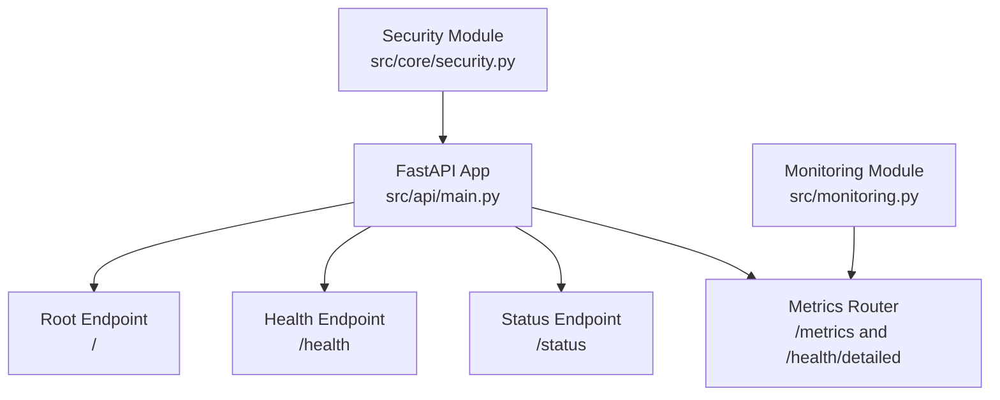
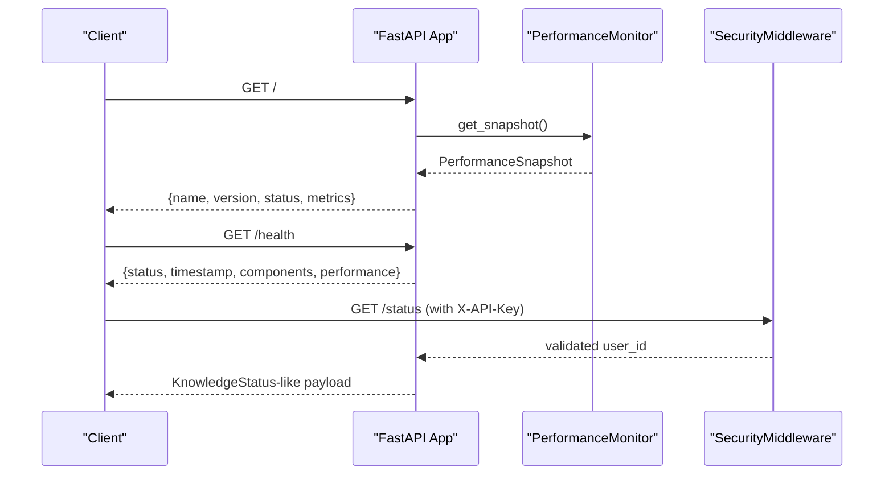
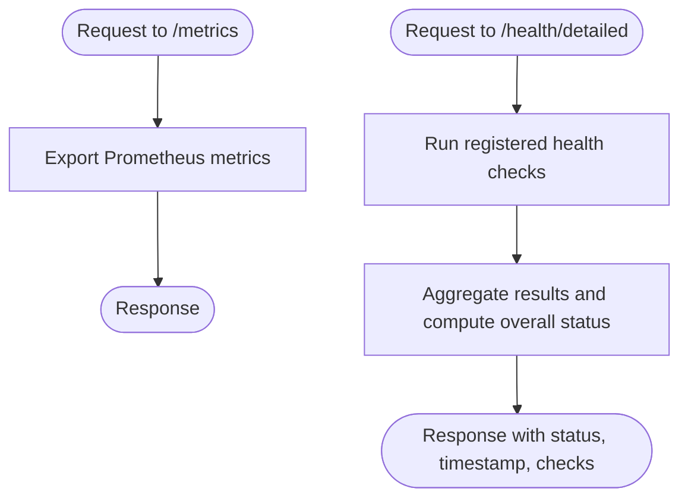
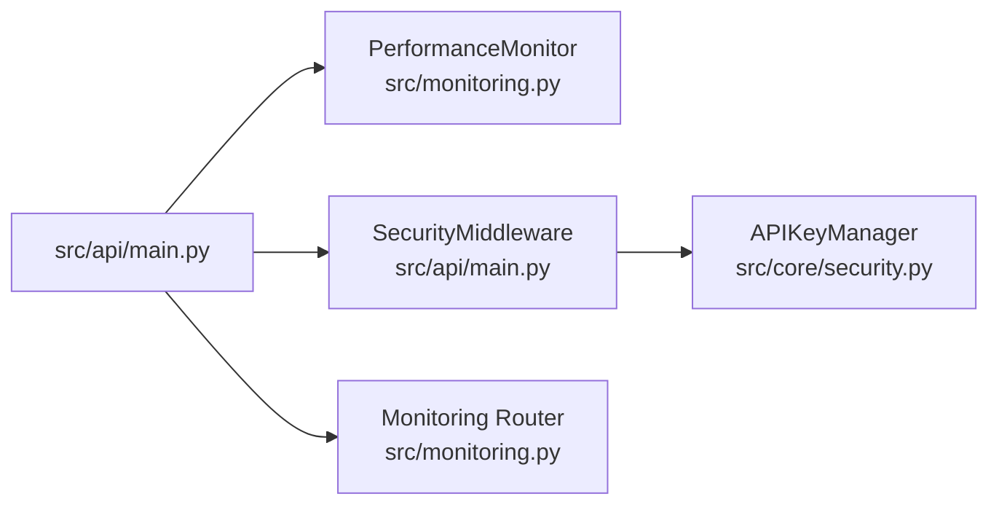

# Health and Status Endpoints

<cite>
**Referenced Files in This Document**
- [src/api/main.py](file://src/api/main.py)
- [src/monitoring.py](file://src/monitoring.py)
- [src/core/security.py](file://src/core/security.py)
</cite>

## Table of Contents
1. [Introduction](#introduction)
2. [Project Structure](#project-structure)
3. [Core Components](#core-components)
4. [Architecture Overview](#architecture-overview)
5. [Detailed Component Analysis](#detailed-component-analysis)
6. [Dependency Analysis](#dependency-analysis)
7. [Performance Considerations](#performance-considerations)
8. [Troubleshooting Guide](#troubleshooting-guide)
9. [Conclusion](#conclusion)

## Introduction
This document describes the health and status monitoring endpoints exposed by the platform’s API. It covers:
- Root endpoint (/) returning API information and current performance metrics
- Health check endpoint (/health) verifying system status and component readiness
- Status endpoint (/status) providing comprehensive system metrics and uptime calculation
It also documents response schemas, timestamp formatting, service availability indicators, uptime calculations, curl examples, error handling, and security considerations for production deployments.

## Project Structure
The monitoring endpoints are implemented in the main API module and supported by a dedicated monitoring module and security utilities.

**Diagram sources**
- [src/api/main.py:576-642](file://src/api/main.py#L576-L642)
- [src/monitoring.py:224-250](file://src/monitoring.py#L224-L250)
- [src/core/security.py:219-231](file://src/core/security.py#L219-L231)

**Section sources**
- [src/api/main.py:576-642](file://src/api/main.py#L576-L642)
- [src/monitoring.py:224-250](file://src/monitoring.py#L224-L250)
- [src/core/security.py:219-231](file://src/core/security.py#L219-L231)

## Core Components
- Root endpoint (/): Returns API metadata and current performance snapshot.
- Health endpoint (/health): Returns health status, component readiness, and performance metrics.
- Status endpoint (/status): Returns a KnowledgeStatus-like payload with system-wide metrics and uptime.
- Monitoring module: Provides metrics export, detailed health checks, and performance snapshots.
- Security module: Implements API key verification and rate limiting middleware.

**Section sources**
- [src/api/main.py:576-642](file://src/api/main.py#L576-L642)
- [src/monitoring.py:224-250](file://src/monitoring.py#L224-L250)
- [src/core/security.py:219-231](file://src/core/security.py#L219-L231)

## Architecture Overview
The API exposes three primary monitoring endpoints:
- /: Returns API metadata and a performance snapshot.
- /health: Returns health status and component readiness.
- /status: Returns a KnowledgeStatus-like payload with system metrics and uptime.

**Diagram sources**
- [src/api/main.py:576-642](file://src/api/main.py#L576-L642)
- [src/monitoring.py:332-352](file://src/monitoring.py#L332-L352)
- [src/core/security.py:219-231](file://src/core/security.py#L219-L231)

## Detailed Component Analysis

### Root Endpoint (/)
- Purpose: Returns API information and current performance metrics.
- Response fields:
  - name: API name
  - version: API version
  - description: Short description
  - docs: Link to Swagger docs
  - redoc: Link to ReDoc docs
  - openapi: Link to OpenAPI JSON
  - status: Service status ("running" or "initializing")
  - metrics: Performance snapshot including:
    - requests_per_second
    - avg_response_time_ms
    - cache_stats: cache statistics
- Timestamp: ISO 8601 string
- Curl example:
  - curl -s http://localhost:8000/

**Section sources**
- [src/api/main.py:576-621](file://src/api/main.py#L576-L621)

### Health Endpoint (/health)
- Purpose: Verifies system status and component readiness.
- Response fields:
  - status: "healthy"
  - timestamp: ISO 8601 string
  - components: Component availability flags
  - performance: Current performance metrics
- Curl example:
  - curl -s http://localhost:8000/health

**Section sources**
- [src/api/main.py:623-642](file://src/api/main.py#L623-L642)

### Status Endpoint (/status)
- Purpose: Returns comprehensive system metrics and uptime.
- Response fields (KnowledgeStatus-like):
  - total_facts: Count of facts in the reasoner
  - total_rules: Count of rules in the rule engine
  - graph_connected: Boolean indicating graph memory connectivity
  - vector_store_status: String indicating vector store status
  - uptime: Uptime string (placeholder; calculate from actual start time in production)
- Authentication: Requires API key via header X-API-Key
- Curl example:
  - curl -s -H "X-API-Key: YOUR_API_KEY" http://localhost:8000/status

**Section sources**
- [src/api/main.py:157-168](file://src/api/main.py#L157-L168)
- [src/core/security.py:219-231](file://src/core/security.py#L219-L231)

### Monitoring Module (Metrics and Health)
- Metrics endpoint (/metrics): Exports Prometheus-compatible metrics.
- Detailed health endpoint (/health/detailed): Aggregates health checks and returns overall status.
- Performance snapshot: Provides requests_per_second, avg_response_time_ms, active_connections, and cache_hit_rate.

**Diagram sources**
- [src/monitoring.py:224-250](file://src/monitoring.py#L224-L250)
- [src/monitoring.py:332-352](file://src/monitoring.py#L332-L352)

**Section sources**
- [src/monitoring.py:224-250](file://src/monitoring.py#L224-L250)
- [src/monitoring.py:332-352](file://src/monitoring.py#L332-L352)

### Security and API Key Verification
- Header: X-API-Key
- Behavior:
  - Missing or invalid API key results in HTTP 401 Unauthorized
  - Rate limiting middleware enforces per-IP limits and returns Retry-After on 429
  - Security headers are applied to all responses
- Curl example:
  - curl -s -H "X-API-Key: YOUR_API_KEY" http://localhost:8000/status

**Section sources**
- [src/core/security.py:219-231](file://src/core/security.py#L219-L231)
- [src/api/main.py:137-179](file://src/api/main.py#L137-L179)

## Dependency Analysis
The monitoring endpoints depend on:
- PerformanceMonitor for runtime metrics
- SecurityMiddleware for API key validation and rate limiting
- Monitoring module for metrics export and detailed health checks

**Diagram sources**
- [src/api/main.py:576-642](file://src/api/main.py#L576-L642)
- [src/monitoring.py:332-352](file://src/monitoring.py#L332-L352)
- [src/core/security.py:219-231](file://src/core/security.py#L219-L231)

**Section sources**
- [src/api/main.py:576-642](file://src/api/main.py#L576-L642)
- [src/monitoring.py:332-352](file://src/monitoring.py#L332-L352)
- [src/core/security.py:219-231](file://src/core/security.py#L219-L231)

## Performance Considerations
- Use /metrics for Prometheus scraping to monitor latency, throughput, and cache hit rates.
- Use /health for quick system health checks and /health/detailed for granular component checks.
- Apply rate limiting and API key authentication to protect endpoints under load.

[No sources needed since this section provides general guidance]

## Troubleshooting Guide
Common issues and resolutions:
- 401 Unauthorized on /status:
  - Cause: Missing or invalid X-API-Key
  - Resolution: Provide a valid API key
- 429 Too Many Requests:
  - Cause: Rate limit exceeded
  - Resolution: Observe Retry-After header and reduce request frequency
- 503 Service Unavailable:
  - Cause: Components not initialized
  - Resolution: Wait until initialization completes or check component readiness

**Section sources**
- [src/core/security.py:219-231](file://src/core/security.py#L219-L231)
- [src/api/main.py:137-179](file://src/api/main.py#L137-L179)

## Conclusion
The platform provides robust monitoring endpoints for operational visibility:
- / returns API metadata and performance snapshot
- /health reports system health and component readiness
- /status delivers comprehensive metrics and uptime for integrations
Security is enforced via API key authentication and rate limiting, ensuring safe production usage.