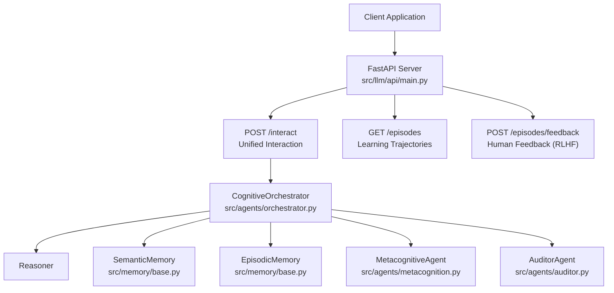
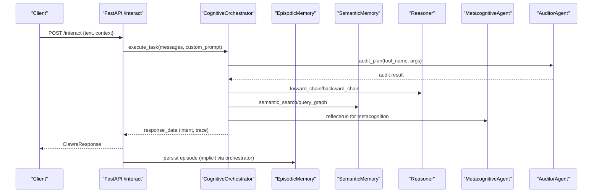
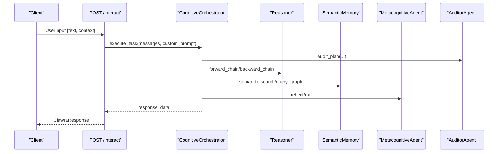
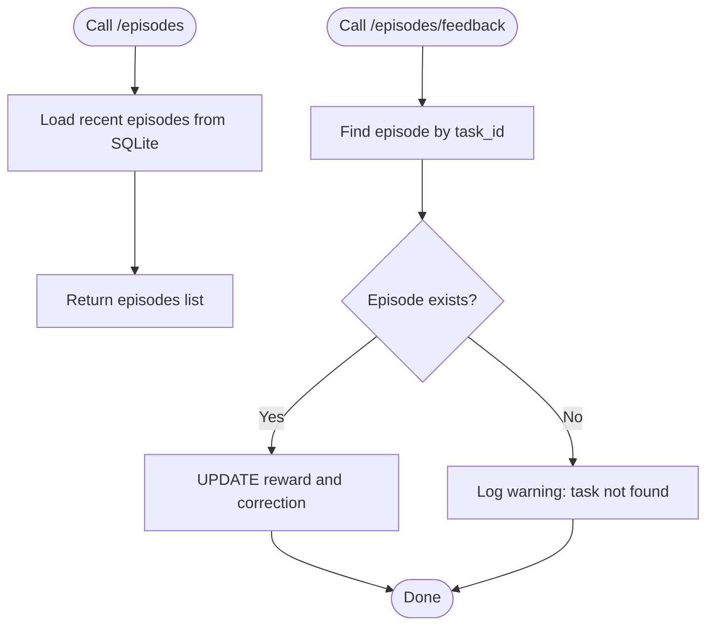
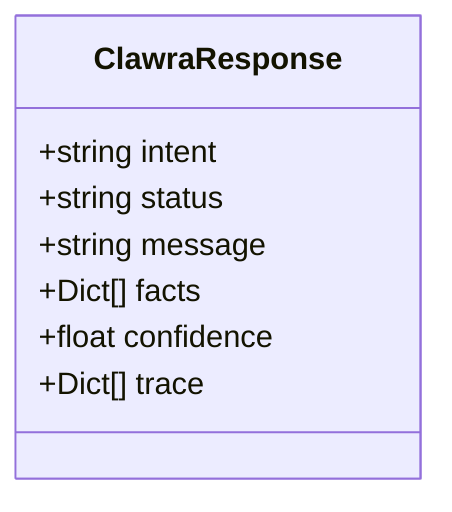
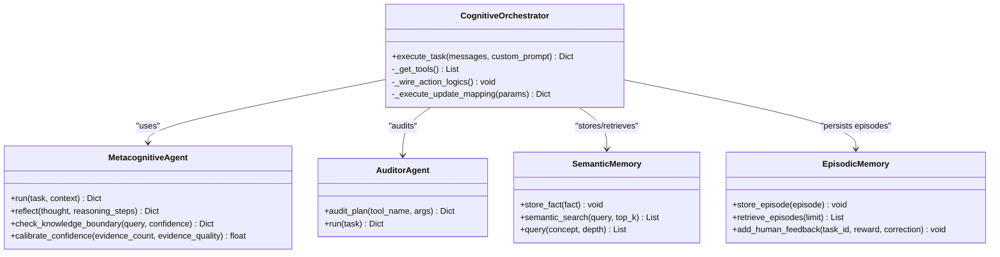
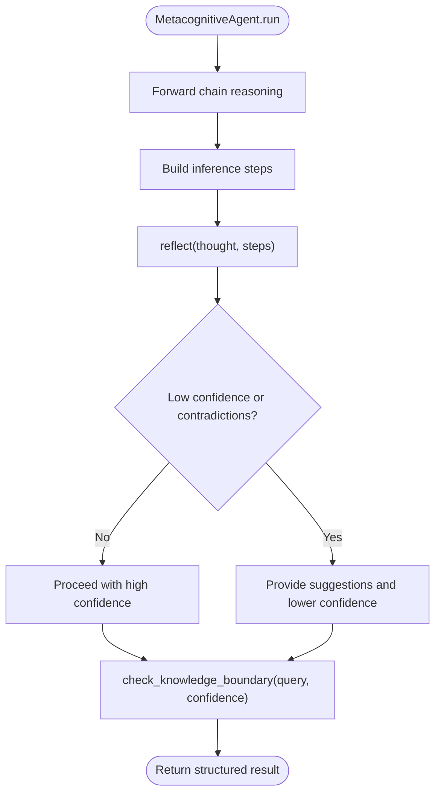
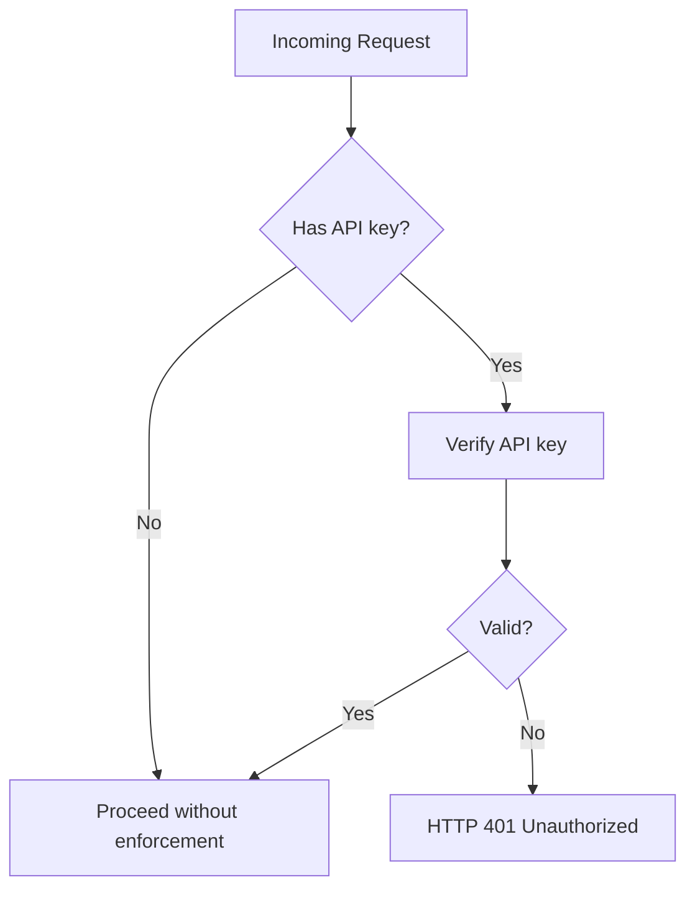
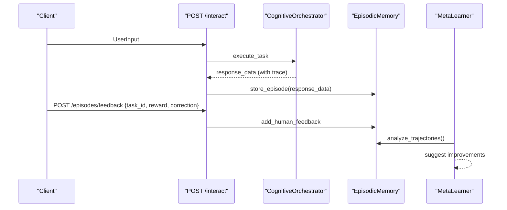
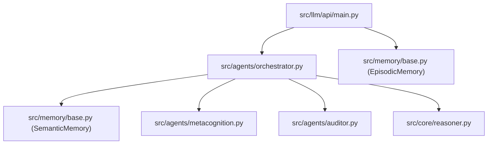

# Interactive and Learning Endpoints

<cite>
**Referenced Files in This Document**
- [main.py](file://src/llm/api/main.py)
- [orchestrator.py](file://src/agents/orchestrator.py)
- [metacognition.py](file://src/agents/metacognition.py)
- [meta_learner.py](file://src/evolution/meta_learner.py)
- [base.py](file://src/memory/base.py)
- [auditor.py](file://src/agents/auditor.py)
- [README.md](file://src/llm/api/README.md)
</cite>

## Table of Contents
1. [Introduction](#introduction)
2. [Project Structure](#project-structure)
3. [Core Components](#core-components)
4. [Architecture Overview](#architecture-overview)
5. [Detailed Component Analysis](#detailed-component-analysis)
6. [Dependency Analysis](#dependency-analysis)
7. [Performance Considerations](#performance-considerations)
8. [Troubleshooting Guide](#troubleshooting-guide)
9. [Conclusion](#conclusion)
10. [Appendices](#appendices)

## Introduction
This document provides comprehensive documentation for the unified interaction endpoint and learning operations in the platform. It covers:
- The unified interaction endpoint (/interact)
- Learning operations via episodes (/episodes) and human feedback (/episodes/feedback)
- The ClawraResponse model
- CognitiveOrchestrator integration and metacognitive agent capabilities
- Examples of conversational AI integration, trajectory tracking, reinforcement learning feedback loops, and continuous learning workflows
- Authentication patterns, session management, and integration examples for chatbot applications and decision support systems

## Project Structure
The API surface relevant to interactive and learning endpoints is implemented in the FastAPI module. The CognitiveOrchestrator coordinates knowledge ingestion, reasoning, and tool-based actions, while EpisodicMemory persists interaction traces and human feedback for reinforcement learning feedback (RLHF) loops.

**Diagram sources**
- [main.py:424-469](file://src/llm/api/main.py#L424-L469)
- [orchestrator.py:23-42](file://src/agents/orchestrator.py#L23-L42)
- [metacognition.py:8-16](file://src/agents/metacognition.py#L8-L16)
- [auditor.py:8-23](file://src/agents/auditor.py#L8-L23)
- [base.py:9-28](file://src/memory/base.py#L9-L28)

**Section sources**
- [README.md:1-66](file://src/llm/api/README.md#L1-L66)
- [main.py:48-73](file://src/llm/api/main.py#L48-L73)

## Core Components
- Unified interaction endpoint (/interact): Accepts user input and routes it through the CognitiveOrchestrator to perform knowledge extraction, reasoning, and tool execution. It returns a standardized response using the ClawraResponse model.
- Learning operations:
  - Episode listing (/episodes): Retrieves recent interaction episodes from EpisodicMemory for inspection and analysis.
  - Human feedback (/episodes/feedback): Records reward and correction for a specific episode to enable RLHF-style learning loops.
- CognitiveOrchestrator: Integrates a ReAct-like tool-calling loop with a metacognitive agent and an auditor to ensure safe, transparent, and high-quality reasoning.
- Metacognitive agent: Provides self-reflection, confidence calibration, and knowledge boundary detection.
- EpisodicMemory: Persists episodes and human feedback for trajectory analysis and continuous learning.

**Section sources**
- [main.py:424-469](file://src/llm/api/main.py#L424-L469)
- [base.py:150-249](file://src/memory/base.py#L150-L249)
- [metacognition.py:8-133](file://src/agents/metacognition.py#L8-L133)
- [orchestrator.py:23-42](file://src/agents/orchestrator.py#L23-L42)

## Architecture Overview
The unified interaction flow integrates conversational AI with knowledge extraction, graph-based reasoning, and safety auditing. The response includes a trace of internal reasoning and tool calls, enabling transparency and continuous improvement.

**Diagram sources**
- [main.py:424-439](file://src/llm/api/main.py#L424-L439)
- [orchestrator.py:128-365](file://src/agents/orchestrator.py#L128-L365)
- [metacognition.py:92-133](file://src/agents/metacognition.py#L92-L133)
- [auditor.py:24-65](file://src/agents/auditor.py#L24-L65)
- [base.py:178-197](file://src/memory/base.py#L178-L197)

## Detailed Component Analysis

### Unified Interaction Endpoint (/interact)
- Purpose: Single entry point for user interactions that automatically routes tasks to knowledge extraction, reasoning, or action execution.
- Input: UserInput model with text and optional context.
- Processing:
  - Calls CognitiveOrchestrator.execute_task with the user’s messages and optional custom prompt.
  - Orchestrator runs a ReAct-style loop with tool calls (ingest_knowledge, query_graph, execute_action), captures reasoning traces, and applies safety audits.
- Output: ClawraResponse model containing intent, status, message, facts, confidence, and trace.

**Diagram sources**
- [main.py:424-439](file://src/llm/api/main.py#L424-L439)
- [orchestrator.py:128-365](file://src/agents/orchestrator.py#L128-L365)
- [metacognition.py:92-133](file://src/agents/metacognition.py#L92-L133)
- [auditor.py:24-65](file://src/agents/auditor.py#L24-L65)

**Section sources**
- [main.py:424-439](file://src/llm/api/main.py#L424-L439)
- [orchestrator.py:128-365](file://src/agents/orchestrator.py#L128-L365)

### Learning Operations: Episodes and Feedback
- Episode listing (/episodes): Retrieves recent episodes from EpisodicMemory for inspection and analysis.
- Human feedback (/episodes/feedback): Adds reward and correction for a specific episode to support RLHF-style learning.

**Diagram sources**
- [main.py:443-469](file://src/llm/api/main.py#L443-L469)
- [base.py:191-215](file://src/memory/base.py#L191-L215)

**Section sources**
- [main.py:443-469](file://src/llm/api/main.py#L443-L469)
- [base.py:191-215](file://src/memory/base.py#L191-L215)

### ClawraResponse Model
- Fields: intent, status, message, facts, confidence, trace.
- Usage: Standardized response returned by /interact and other endpoints to unify client consumption.

**Diagram sources**
- [main.py:104-111](file://src/llm/api/main.py#L104-L111)

**Section sources**
- [main.py:104-111](file://src/llm/api/main.py#L104-L111)

### CognitiveOrchestrator Integration
- Responsibilities:
  - Tool registry and orchestration (ingest_knowledge, query_graph, execute_action).
  - Safety auditing via AuditorAgent.
  - Metacognition via MetacognitiveAgent.
  - Memory governance and garbage collection.
- Behavior:
  - Enforces system prompt and tool usage.
  - Captures internal reasoning traces and tool call results.
  - Applies rule engine gating for actions.
  - Performs dynamic pruning to keep knowledge clean.

**Diagram sources**
- [orchestrator.py:23-42](file://src/agents/orchestrator.py#L23-L42)
- [metacognition.py:8-133](file://src/agents/metacognition.py#L8-L133)
- [auditor.py:8-65](file://src/agents/auditor.py#L8-L65)
- [base.py:9-28](file://src/memory/base.py#L9-L28)

**Section sources**
- [orchestrator.py:23-42](file://src/agents/orchestrator.py#L23-L42)
- [metacognition.py:8-133](file://src/agents/metacognition.py#L8-L133)
- [auditor.py:8-65](file://src/agents/auditor.py#L8-L65)
- [base.py:9-28](file://src/memory/base.py#L9-L28)

### Metacognitive Agent Capabilities
- Self-reflection: Validates reasoning against evidence and detects contradictions.
- Confidence calibration: Computes calibrated confidence based on evidence quantity and quality.
- Knowledge boundary detection: Assesses whether queries fall within the system’s knowledge boundary and recommends actions accordingly.

**Diagram sources**
- [metacognition.py:92-172](file://src/agents/metacognition.py#L92-L172)

**Section sources**
- [metacognition.py:23-172](file://src/agents/metacognition.py#L23-L172)

### Authentication Patterns and Session Management
- API key verification: Optional API key verification via HTTP bearer token. If missing, the endpoint still proceeds but logs warnings.
- Security middleware: CORS enabled for cross-origin requests.
- Session management: No persistent sessions; each request is stateless. Authentication is per-request via the API key.

**Diagram sources**
- [main.py:21-31](file://src/llm/api/main.py#L21-L31)
- [main.py:66-73](file://src/llm/api/main.py#L66-L73)

**Section sources**
- [main.py:21-31](file://src/llm/api/main.py#L21-L31)
- [main.py:66-73](file://src/llm/api/main.py#L66-L73)

### Conversational AI Integration, Trajectory Tracking, RLHF Loops, Continuous Learning
- Conversational AI integration: The orchestrator uses an LLM client to generate tool calls and capture internal reasoning traces, enabling transparent, step-by-step explanations.
- Trajectory tracking: Episodes are persisted in EpisodicMemory with full traces, enabling retrospective analysis and pattern recognition.
- RLHF feedback loops: Human feedback (reward and correction) is stored per episode and can be used to refine future decisions or update policies.
- Continuous learning: Meta-learning components can analyze successful trajectories and suggest improvements to the logic layer and rule discovery engine.

**Diagram sources**
- [main.py:424-469](file://src/llm/api/main.py#L424-L469)
- [base.py:178-247](file://src/memory/base.py#L178-L247)
- [meta_learner.py:17-169](file://src/evolution/meta_learner.py#L17-L169)

**Section sources**
- [main.py:424-469](file://src/llm/api/main.py#L424-L469)
- [base.py:178-247](file://src/memory/base.py#L178-L247)
- [meta_learner.py:17-169](file://src/evolution/meta_learner.py#L17-L169)

## Dependency Analysis
- API depends on:
  - CognitiveOrchestrator for orchestration
  - SemanticMemory and EpisodicMemory for persistence
  - Reasoner for logical inference
  - MetacognitiveAgent and AuditorAgent for safety and reflection
- CognitiveOrchestrator depends on:
  - KnowledgeExtractor, ContradictionChecker, GlossaryEngine, SkillRegistry, ActionRegistry, RuleEngine, MemoryGovernor
- EpisodicMemory depends on SQLite for persistence.

**Diagram sources**
- [main.py:33-38](file://src/llm/api/main.py#L33-L38)
- [orchestrator.py:23-42](file://src/agents/orchestrator.py#L23-L42)
- [base.py:9-28](file://src/memory/base.py#L9-L28)

**Section sources**
- [main.py:33-38](file://src/llm/api/main.py#L33-L38)
- [orchestrator.py:23-42](file://src/agents/orchestrator.py#L23-L42)
- [base.py:9-28](file://src/memory/base.py#L9-L28)

## Performance Considerations
- Tool-call retries: The orchestrator implements exponential backoff for rate-limited LLM calls.
- Garbage collection: Dynamic pruning of low-confidence facts to reduce memory overhead.
- Hybrid retrieval: Combines vector similarity search with graph traversal to balance speed and accuracy.
- Caching: The API module indicates caching strategies and Redis distributed cache support are available.

[No sources needed since this section provides general guidance]

## Troubleshooting Guide
- Missing OPENAI_API_KEY: The orchestrator returns an error response indicating the environment variable is not configured.
- 429 Too Many Requests: The orchestrator retries with exponential backoff; monitor logs for rate-limit warnings.
- API key invalid: Requests with invalid API keys receive HTTP 401 Unauthorized.
- Episode not found for feedback: Adding feedback for a non-existent task_id logs a warning.

**Section sources**
- [orchestrator.py:130-139](file://src/agents/orchestrator.py#L130-L139)
- [orchestrator.py:170-185](file://src/agents/orchestrator.py#L170-L185)
- [main.py:27-30](file://src/llm/api/main.py#L27-L30)
- [base.py:212-214](file://src/memory/base.py#L212-L214)

## Conclusion
The unified interaction endpoint (/interact) provides a cohesive interface for conversational AI, knowledge extraction, reasoning, and action execution, returning a standardized response with rich traces. Learning operations through episodes and human feedback enable RLHF-style feedback loops, while the CognitiveOrchestrator ensures safety, transparency, and continuous improvement via metacognition and auditing. Authentication is per-request via API key, and the system supports scalable deployment with caching and hybrid retrieval.

[No sources needed since this section summarizes without analyzing specific files]

## Appendices
- Example usage patterns:
  - Chatbot integration: Call /interact with natural language queries; consume ClawraResponse for answers and reasoning traces.
  - Decision support: Use /episodes to inspect past decisions and /episodes/feedback to incorporate expert corrections.
  - Continuous learning: Persist episodes and periodically analyze trajectories to improve policies and rules.

[No sources needed since this section provides general guidance]