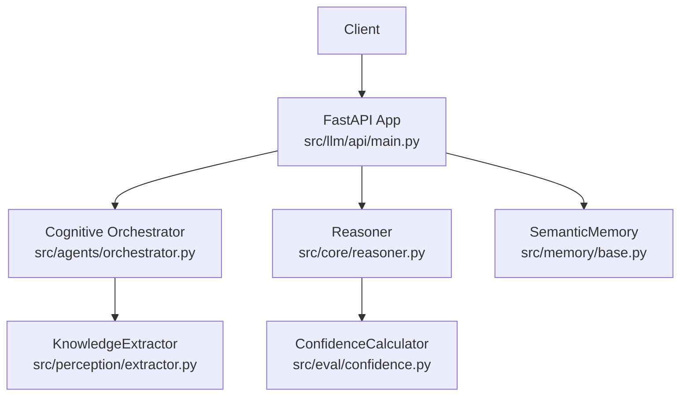
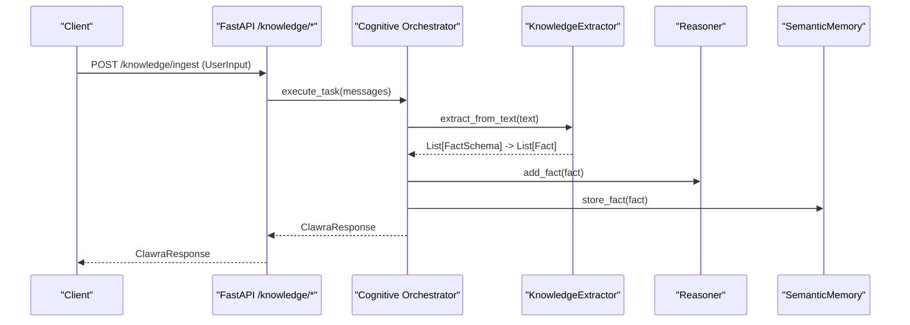
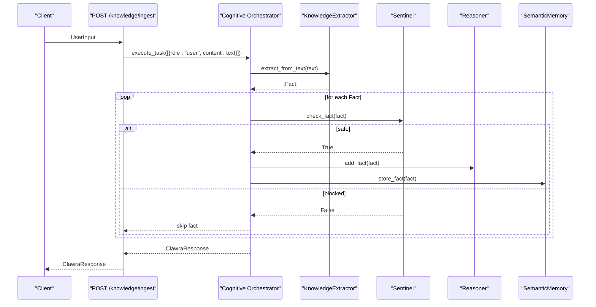
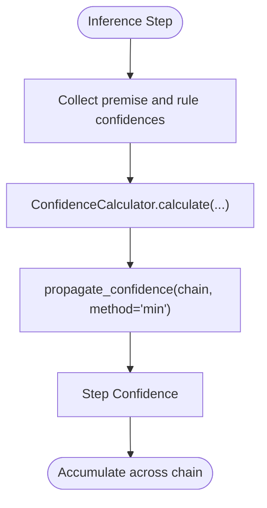
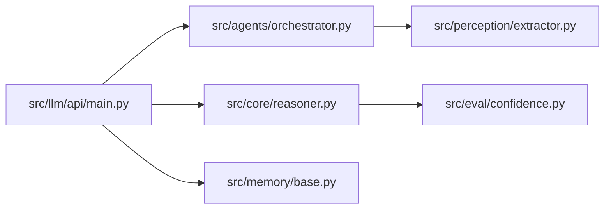

# Knowledge Management Endpoints

<cite>
**Referenced Files in This Document**
- [main.py](file://src/llm/api/main.py)
- [orchestrator.py](file://src/agents/orchestrator.py)
- [reasoner.py](file://src/core/reasoner.py)
- [base.py](file://src/memory/base.py)
- [extractor.py](file://src/perception/extractor.py)
- [confidence.py](file://src/eval/confidence.py)
- [self_correction.py](file://src/evolution/self_correction.py)
</cite>

## Table of Contents
1. [Introduction](#introduction)
2. [Project Structure](#project-structure)
3. [Core Components](#core-components)
4. [Architecture Overview](#architecture-overview)
5. [Detailed Component Analysis](#detailed-component-analysis)
6. [Dependency Analysis](#dependency-analysis)
7. [Performance Considerations](#performance-considerations)
8. [Troubleshooting Guide](#troubleshooting-guide)
9. [Conclusion](#conclusion)

## Introduction
This document describes the knowledge management operations exposed by the API, focusing on:
- Text ingestion via /knowledge/ingest
- Direct fact addition via /knowledge/facts
- Fact listing via /knowledge/facts
- Knowledge clearing via /knowledge/facts/clear

It documents request/response models, error handling patterns, confidence scoring, filtering options, authentication, and best practices for bulk operations.

## Project Structure
The knowledge management endpoints are implemented in the LLM API module and orchestrated by the Cognitive Orchestrator. They integrate with the Reasoner for storage and retrieval, Semantic Memory for persistence and hybrid search, and the Knowledge Extractor for structured fact parsing.

**Diagram sources**
- [main.py:172-246](file://src/llm/api/main.py#L172-L246)
- [orchestrator.py:242-259](file://src/agents/orchestrator.py#L242-L259)
- [reasoner.py:145-703](file://src/core/reasoner.py#L145-L703)
- [base.py:9-121](file://src/memory/base.py#L9-L121)
- [extractor.py:83-350](file://src/perception/extractor.py#L83-L350)
- [confidence.py:32-260](file://src/eval/confidence.py#L32-L260)

**Section sources**
- [main.py:172-246](file://src/llm/api/main.py#L172-L246)

## Core Components
- UserInput: request model for text ingestion.
- FactInput: request model for adding a single fact.
- ClawraResponse: standardized response model for ingestion results.
- KnowledgeStatus: system status response model.

These models define the shape of requests and responses for knowledge management endpoints.

**Section sources**
- [main.py:77-118](file://src/llm/api/main.py#L77-L118)

## Architecture Overview
The knowledge management flow integrates ingestion, extraction, validation, storage, and retrieval.

**Diagram sources**
- [main.py:172-186](file://src/llm/api/main.py#L172-L186)
- [orchestrator.py:242-259](file://src/agents/orchestrator.py#L242-L259)
- [extractor.py:278-350](file://src/perception/extractor.py#L278-L350)
- [reasoner.py:224-231](file://src/core/reasoner.py#L224-L231)
- [base.py:91-110](file://src/memory/base.py#L91-L110)

## Detailed Component Analysis

### Authentication and Security
- API key verification is optional. When present, the Authorization header must match the API_KEY environment variable.
- Endpoints protected by the verify_api_key dependency require a valid key.

Practical guidance:
- Set API_KEY in the environment for mandatory protection.
- Omit Authorization header for optional mode.

**Section sources**
- [main.py:21-31](file://src/llm/api/main.py#L21-L31)
- [main.py:172-186](file://src/llm/api/main.py#L172-L186)
- [main.py:189-209](file://src/llm/api/main.py#L189-L209)
- [main.py:241-246](file://src/llm/api/main.py#L241-L246)

### Text Ingestion: /knowledge/ingest
- Endpoint: POST /knowledge/ingest
- Request: UserInput
  - text: required string
  - context: optional dict
- Response: ClawraResponse
- Behavior:
  - Executes orchestration pipeline to extract facts from text.
  - Applies contradiction checks before storing.
  - Stores validated facts in both Reasoner and SemanticMemory.

**Diagram sources**
- [main.py:172-186](file://src/llm/api/main.py#L172-L186)
- [orchestrator.py:242-259](file://src/agents/orchestrator.py#L242-L259)
- [extractor.py:278-350](file://src/perception/extractor.py#L278-L350)
- [self_correction.py:46-73](file://src/evolution/self_correction.py#L46-L73)
- [reasoner.py:224-231](file://src/core/reasoner.py#L224-L231)
- [base.py:91-110](file://src/memory/base.py#L91-L110)

**Section sources**
- [main.py:172-186](file://src/llm/api/main.py#L172-L186)
- [orchestrator.py:242-259](file://src/agents/orchestrator.py#L242-L259)
- [extractor.py:278-350](file://src/perception/extractor.py#L278-L350)
- [self_correction.py:46-73](file://src/evolution/self_correction.py#L46-L73)

### Direct Fact Addition: /knowledge/facts
- Endpoint: POST /knowledge/facts
- Request: FactInput
  - subject: required
  - predicate: required
  - object: required
  - confidence: optional float [0.0, 1.0], default 1.0
  - source: optional string, default "api_input"
- Response: JSON object with status, message, and fact payload
- Behavior:
  - Converts FactInput to internal Fact.
  - Adds to Reasoner and persists to SemanticMemory.

Validation rules:
- Subject/predicate/object must be non-empty after normalization.
- Confidence clamped to [0.0, 1.0].
- Source defaults to "api_input" if omitted.

**Section sources**
- [main.py:188-209](file://src/llm/api/main.py#L188-L209)
- [main.py:81-87](file://src/llm/api/main.py#L81-L87)
- [reasoner.py:224-231](file://src/core/reasoner.py#L224-L231)
- [base.py:91-110](file://src/memory/base.py#L91-L110)

### Fact Listing: /knowledge/facts
- Endpoint: GET /knowledge/facts
- Query parameters:
  - subject: optional filter
  - predicate: optional filter
  - object: optional filter
  - min_confidence: float threshold [default 0.0]
  - limit: integer limit [default 100]
- Response: JSON object with count and facts array
  - Each fact includes subject, predicate, object, confidence, source

Filtering and pagination:
- Filters are applied server-side.
- Results are sliced to limit.

**Section sources**
- [main.py:211-239](file://src/llm/api/main.py#L211-L239)
- [reasoner.py:673-703](file://src/core/reasoner.py#L673-L703)

### Knowledge Clearing: /knowledge/facts/clear
- Endpoint: DELETE /knowledge/facts/clear
- Behavior: Clears all facts from Reasoner; returns success message with count.

Use with caution.

**Section sources**
- [main.py:241-246](file://src/llm/api/main.py#L241-L246)
- [reasoner.py:239-242](file://src/core/reasoner.py#L239-L242)

### Confidence Scoring Mechanisms
- Ingestion:
  - Extractor produces FactSchema with confidence; orchestrator stores validated facts.
- Forward/backward reasoning:
  - Uses ConfidenceCalculator to combine premise and rule confidences.
  - Propagation method defaults to minimum across steps for conservative estimates.
- Retrieval:
  - min_confidence filter ensures only facts meeting threshold are returned.

**Diagram sources**
- [reasoner.py:294-342](file://src/core/reasoner.py#L294-L342)
- [confidence.py:222-259](file://src/eval/confidence.py#L222-L259)

**Section sources**
- [confidence.py:32-260](file://src/eval/confidence.py#L32-L260)
- [reasoner.py:294-342](file://src/core/reasoner.py#L294-L342)

### Fact Validation Rules
- ContradictionChecker prevents insertion of facts that contradict existing entries with the same subject and predicate but conflicting objects.
- Fallback logic exists when graph backend is unavailable.

**Section sources**
- [self_correction.py:46-73](file://src/evolution/self_correction.py#L46-L73)

### Practical Examples

- Ingestion workflow
  - Client sends UserInput with a long technical document.
  - Orchestrator extracts structured facts, validates each via sentinel, and stores into Reasoner and SemanticMemory.
  - Response includes intent, status, message, facts, confidence, and trace.

- Bulk ingestion
  - Split large texts into chunks to avoid truncation and improve accuracy.
  - Retry on rate-limited responses (HTTP 429) with exponential backoff.

- Adding facts programmatically
  - Use FactInput with explicit confidence and source metadata for traceability.

- Filtering and retrieval
  - Use min_confidence to exclude low-reliability facts.
  - Apply subject/predicate/object filters to narrow results.

**Section sources**
- [orchestrator.py:170-185](file://src/agents/orchestrator.py#L170-L185)
- [extractor.py:212-230](file://src/perception/extractor.py#L212-L230)
- [main.py:211-239](file://src/llm/api/main.py#L211-L239)

## Dependency Analysis
The knowledge management endpoints depend on:
- FastAPI app for routing and dependency injection
- Cognitive Orchestrator for orchestration
- KnowledgeExtractor for structured extraction
- Reasoner for storage and querying
- SemanticMemory for persistence and hybrid search
- ConfidenceCalculator for reasoning confidence propagation

**Diagram sources**
- [main.py:172-246](file://src/llm/api/main.py#L172-L246)
- [orchestrator.py:242-259](file://src/agents/orchestrator.py#L242-L259)
- [extractor.py:278-350](file://src/perception/extractor.py#L278-L350)
- [reasoner.py:145-703](file://src/core/reasoner.py#L145-L703)
- [base.py:9-121](file://src/memory/base.py#L9-L121)
- [confidence.py:32-260](file://src/eval/confidence.py#L32-L260)

**Section sources**
- [main.py:172-246](file://src/llm/api/main.py#L172-L246)

## Performance Considerations
- Rate limiting: Orchestrator and extractor handle HTTP 429 with exponential backoff; clients should implement similar retry policies.
- Chunking: Long documents are split into manageable chunks to improve extraction quality and reduce timeouts.
- Caching: Reasoner maintains an inference cache keyed by rule sets to avoid recomputation.
- Circuit breakers: Forward/backward chaining enforce timeouts to prevent runaway inference.

Best practices:
- Batch small texts to minimize overhead.
- Use min_confidence to filter out low-value facts early.
- Monitor system status endpoint for operational health.

**Section sources**
- [orchestrator.py:170-185](file://src/agents/orchestrator.py#L170-L185)
- [extractor.py:212-230](file://src/perception/extractor.py#L212-L230)
- [reasoner.py:272-277](file://src/core/reasoner.py#L272-L277)
- [reasoner.py:376-382](file://src/core/reasoner.py#L376-L382)

## Troubleshooting Guide
Common issues and resolutions:
- Invalid API key
  - Symptom: 401 Unauthorized
  - Resolution: Provide a valid Authorization header matching API_KEY environment variable.

- Extraction failures
  - Symptom: Empty or partial facts
  - Resolution: Reduce text length, enable chunking, or adjust extraction prompts.

- Rate limits (429)
  - Symptom: Temporary failure during extraction or orchestration
  - Resolution: Implement exponential backoff and retry logic.

- Conflicts detected
  - Symptom: Some facts not stored despite successful ingestion
  - Resolution: Review contradiction checker logs and adjust facts to avoid disallowed combinations.

- Clearing knowledge unexpectedly
  - Symptom: All facts removed
  - Resolution: Confirm intent and use sparingly; back up knowledge before bulk operations.

**Section sources**
- [main.py:21-31](file://src/llm/api/main.py#L21-L31)
- [orchestrator.py:170-185](file://src/agents/orchestrator.py#L170-L185)
- [self_correction.py:66-70](file://src/evolution/self_correction.py#L66-L70)

## Conclusion
The knowledge management endpoints provide a robust pipeline for ingestion, validation, storage, and retrieval of structured facts. By leveraging the Cognitive Orchestrator, Knowledge Extractor, Reasoner, and SemanticMemory, the system supports confident, auditable, and scalable knowledge operations. Follow the documented models, filters, and best practices to ensure reliable and maintainable integrations.