# Query and Reasoning Endpoints

<cite>
**Referenced Files in This Document**
- [src/llm/api/main.py](file://src/llm/api/main.py)
- [src/core/reasoner.py](file://src/core/reasoner.py)
- [src/memory/vector_adapter.py](file://src/memory/vector_adapter.py)
- [src/memory/neo4j_adapter.py](file://src/memory/neo4j_adapter.py)
- [src/core/ontology/reasoner.py](file://src/core/ontology/reasoner.py)
- [src/core/ontology/rule_engine.py](file://src/core/ontology/rule_engine.py)
- [src/llm/api/graphql.py](file://src/llm/api/graphql.py)
</cite>

## Table of Contents
1. [Introduction](#introduction)
2. [Project Structure](#project-structure)
3. [Core Components](#core-components)
4. [Architecture Overview](#architecture-overview)
5. [Detailed Component Analysis](#detailed-component-analysis)
6. [Dependency Analysis](#dependency-analysis)
7. [Performance Considerations](#performance-considerations)
8. [Troubleshooting Guide](#troubleshooting-guide)
9. [Conclusion](#conclusion)
10. [Appendices](#appendices)

## Introduction
This document explains the semantic querying and reasoning capabilities of the platform, focusing on:
- Semantic search and hybrid retrieval via /query
- Forward chaining reasoning via /reasoning/forward
- Backward chaining reasoning via /reasoning/backward
- Explanation generation via /reasoning/explain

It documents the request/response models, confidence propagation mechanisms, reasoning depth controls, and provides examples of hybrid semantic search combining vector similarity with graph traversal, plus forward/backward chaining workflows and explanation generation. It also includes performance optimization tips, tuning parameters, and integration patterns for decision support systems.

## Project Structure
The query and reasoning features are exposed through a FastAPI application with the following key modules:
- API layer: request/response models and endpoint handlers
- Reasoning engine: rule-based forward/backward chaining with confidence propagation
- Memory layer: vector store for semantic search and graph store for structured knowledge
- Ontology reasoning: lightweight rule engine for deterministic checks

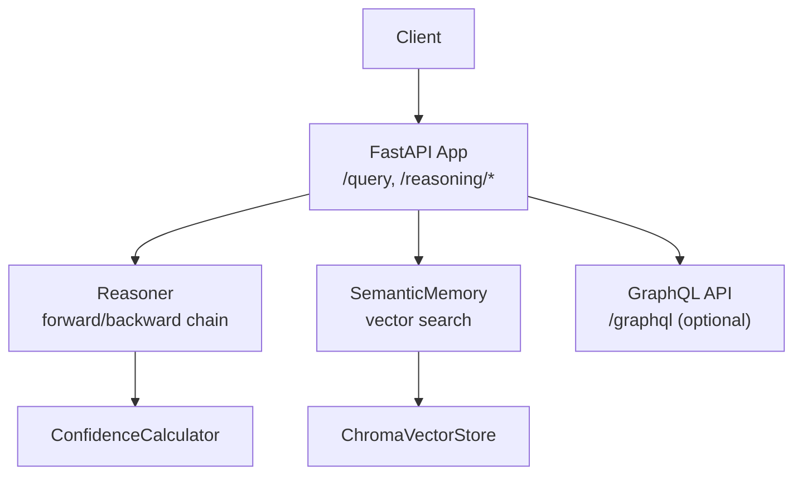

**Diagram sources**
- [src/llm/api/main.py:250-356](file://src/llm/api/main.py#L250-L356)
- [src/core/reasoner.py:145-438](file://src/core/reasoner.py#L145-L438)
- [src/memory/vector_adapter.py:31-97](file://src/memory/vector_adapter.py#L31-L97)
- [src/llm/api/graphql.py:162-347](file://src/llm/api/graphql.py#L162-L347)

**Section sources**
- [src/llm/api/main.py:250-356](file://src/llm/api/main.py#L250-L356)
- [src/core/reasoner.py:145-438](file://src/core/reasoner.py#L145-L438)
- [src/memory/vector_adapter.py:31-97](file://src/memory/vector_adapter.py#L31-L97)
- [src/llm/api/graphql.py:162-347](file://src/llm/api/graphql.py#L162-L347)

## Core Components
- QueryInput model: defines query text, top-k for vector search, and minimum confidence threshold for fact filtering.
- ReasoningInput model: controls reasoning depth and direction (forward, backward, bidirectional).
- Response schemas: compact summaries for reasoning endpoints; hybrid results for /query combine vector and fact results.
- Confidence propagation: multiplicative aggregation during forward chaining; min-based aggregation across steps; optional explanation rendering.

Key implementation references:
- Request/response models and endpoints: [src/llm/api/main.py:77-130](file://src/llm/api/main.py#L77-L130), [src/llm/api/main.py:250-356](file://src/llm/api/main.py#L250-L356)
- Reasoner engine: [src/core/reasoner.py:145-438](file://src/core/reasoner.py#L145-L438)
- Confidence calculator fallback: [src/core/reasoner.py:55-74](file://src/core/reasoner.py#L55-L74)
- Vector store interface and Chroma integration: [src/memory/vector_adapter.py:19-97](file://src/memory/vector_adapter.py#L19-L97)

**Section sources**
- [src/llm/api/main.py:77-130](file://src/llm/api/main.py#L77-L130)
- [src/llm/api/main.py:250-356](file://src/llm/api/main.py#L250-L356)
- [src/core/reasoner.py:55-74](file://src/core/reasoner.py#L55-L74)
- [src/core/reasoner.py:145-438](file://src/core/reasoner.py#L145-L438)
- [src/memory/vector_adapter.py:19-97](file://src/memory/vector_adapter.py#L19-L97)

## Architecture Overview
The system integrates three pillars:
- Vector similarity search for semantic recall
- Rule-based reasoning for logical inference
- Graph traversal for structured knowledge and confidence propagation

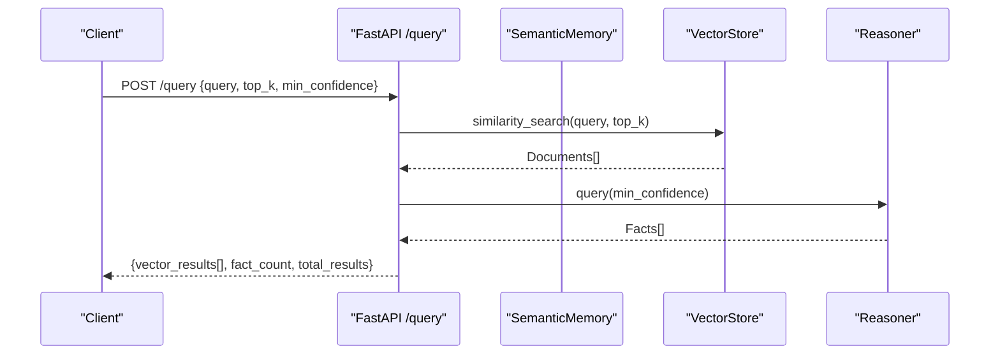

**Diagram sources**
- [src/llm/api/main.py:250-280](file://src/llm/api/main.py#L250-L280)
- [src/memory/vector_adapter.py:78-96](file://src/memory/vector_adapter.py#L78-L96)
- [src/core/reasoner.py:673-703](file://src/core/reasoner.py#L673-L703)

## Detailed Component Analysis

### Query Endpoint (/query)
Purpose: Hybrid semantic search combining vector similarity with explicit fact filtering.
- Input: QueryInput (query, top_k, min_confidence)
- Processing:
  - Vector search via SemanticMemory.vector_store.similarity_search
  - Fact query via Reasoner.query(min_confidence)
- Output: Aggregated summary including vector results and counts

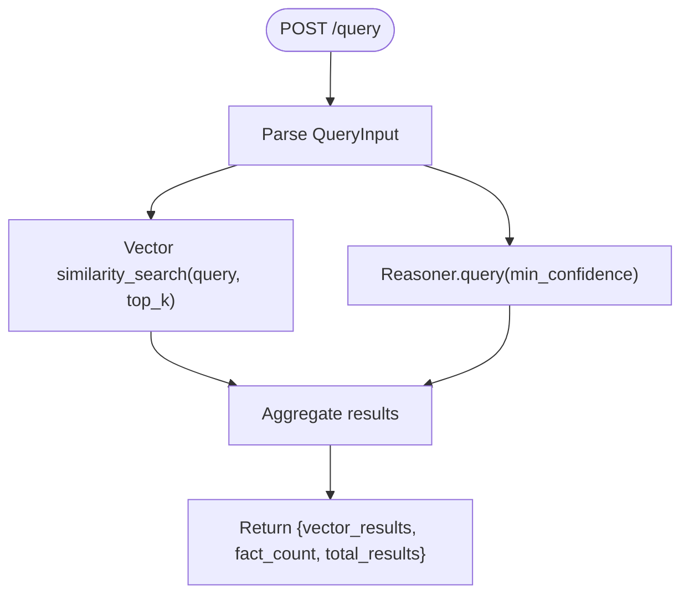

**Diagram sources**
- [src/llm/api/main.py:250-280](file://src/llm/api/main.py#L250-L280)
- [src/memory/vector_adapter.py:78-96](file://src/memory/vector_adapter.py#L78-L96)
- [src/core/reasoner.py:673-703](file://src/core/reasoner.py#L673-L703)

**Section sources**
- [src/llm/api/main.py:250-280](file://src/llm/api/main.py#L250-L280)
- [src/memory/vector_adapter.py:78-96](file://src/memory/vector_adapter.py#L78-L96)
- [src/core/reasoner.py:673-703](file://src/core/reasoner.py#L673-L703)

### Forward Chaining Reasoning (/reasoning/forward)
Purpose: Derive conclusions from existing facts up to a configurable depth.
- Input: ReasoningInput (max_depth, direction)
- Processing:
  - Iteratively match rules against working facts
  - Apply rules to derive new facts
  - Compute per-step confidence via Evidence and ConfidenceCalculator
  - Aggregate total confidence across steps
- Output: Summary of conclusions, facts used, depth, and total confidence

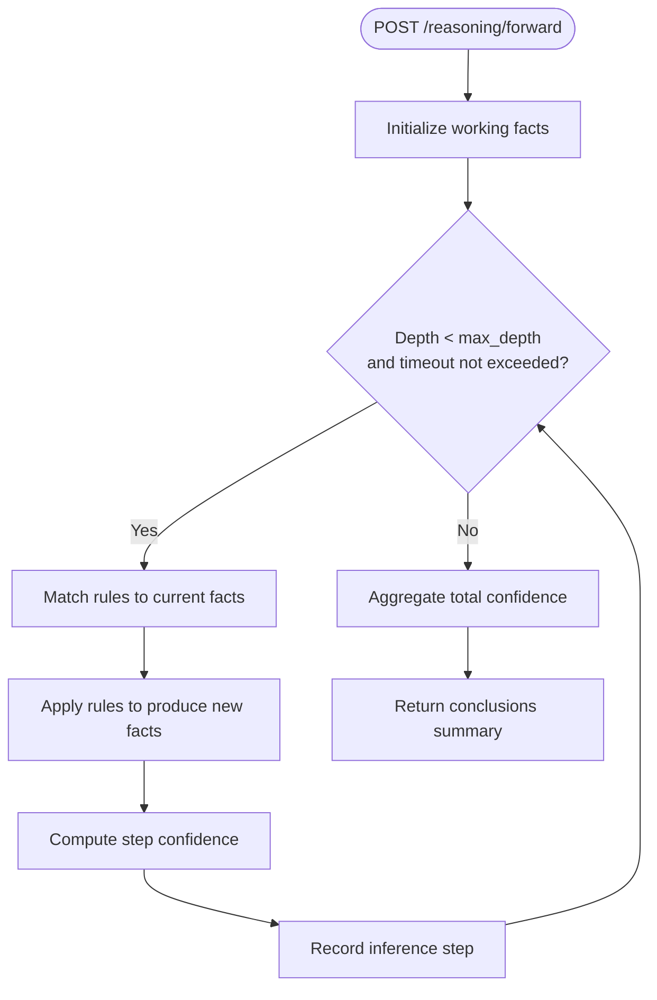

**Diagram sources**
- [src/llm/api/main.py:282-310](file://src/llm/api/main.py#L282-L310)
- [src/core/reasoner.py:243-349](file://src/core/reasoner.py#L243-L349)

**Section sources**
- [src/llm/api/main.py:282-310](file://src/llm/api/main.py#L282-L310)
- [src/core/reasoner.py:243-349](file://src/core/reasoner.py#L243-L349)

### Backward Chaining Reasoning (/reasoning/backward)
Purpose: Given a goal, search backward through rules to find supporting facts.
- Input: Goal Fact (subject, predicate, object) and max_depth
- Processing:
  - BFS-style queue of goals with depth tracking
  - Match facts or find rules whose conclusion can support the goal
  - Recursively expand preconditions
  - Aggregate confidence across paths
- Output: Summary of conclusions and total confidence

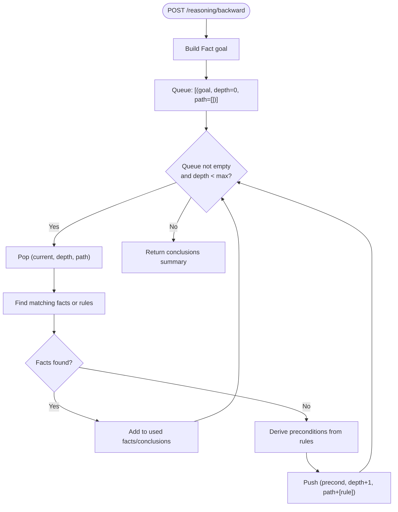

**Diagram sources**
- [src/llm/api/main.py:311-344](file://src/llm/api/main.py#L311-L344)
- [src/core/reasoner.py:351-438](file://src/core/reasoner.py#L351-L438)

**Section sources**
- [src/llm/api/main.py:311-344](file://src/llm/api/main.py#L311-L344)
- [src/core/reasoner.py:351-438](file://src/core/reasoner.py#L351-L438)

### Explanation Generation (/reasoning/explain)
Purpose: Human-readable explanation of reasoning outcomes.
- Input: None (uses last reasoning result)
- Processing: Render number of conclusions, facts used, depth, and overall confidence; enumerate per-step rules, premises, conclusions, and confidence
- Output: Text explanation and summary metrics

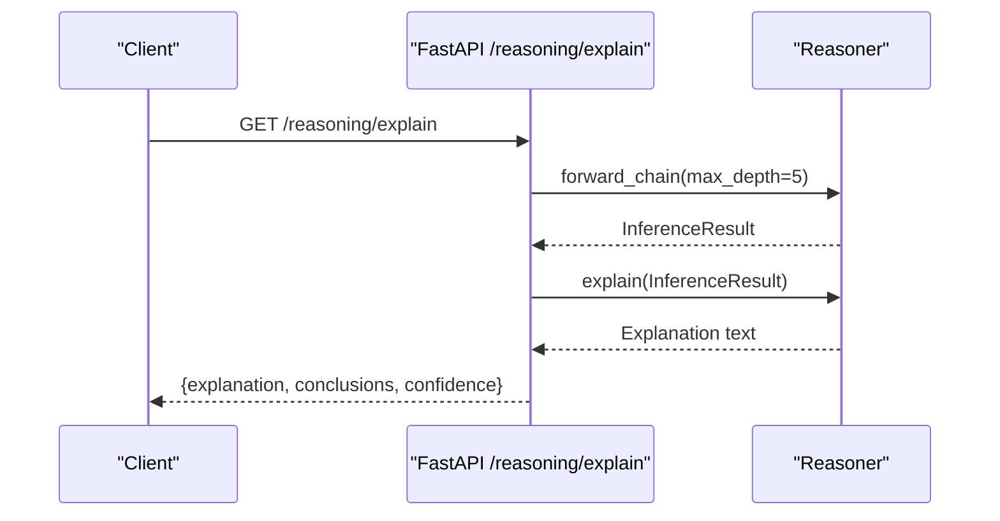

**Diagram sources**
- [src/llm/api/main.py:346-356](file://src/llm/api/main.py#L346-L356)
- [src/core/reasoner.py:617-642](file://src/core/reasoner.py#L617-L642)

**Section sources**
- [src/llm/api/main.py:346-356](file://src/llm/api/main.py#L346-L356)
- [src/core/reasoner.py:617-642](file://src/core/reasoner.py#L617-L642)

### Confidence Propagation Mechanics
- Per-step confidence: Evidence list includes premise(s) and rule reliability; computed via ConfidenceCalculator.calculate(method="multiplicative")
- Total confidence: Aggregated across derived conclusions using ConfidenceCalculator.propagate_confidence(method="min")
- Graph confidence propagation: Neo4j adapter supports path-wise confidence multiplication and breadth-first propagation

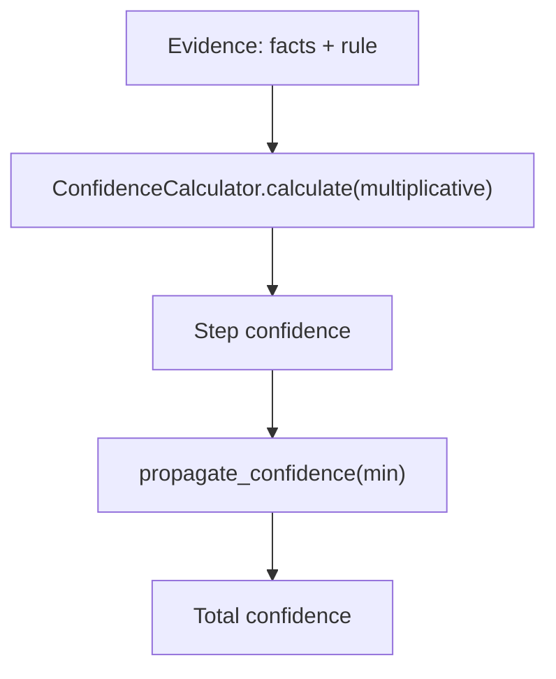

**Diagram sources**
- [src/core/reasoner.py:294-308](file://src/core/reasoner.py#L294-L308)
- [src/core/reasoner.py:332-342](file://src/core/reasoner.py#L332-L342)
- [src/core/reasoner.py:707-74](file://src/core/reasoner.py#L707-L74)
- [src/memory/neo4j_adapter.py:711-774](file://src/memory/neo4j_adapter.py#L711-L774)

**Section sources**
- [src/core/reasoner.py:294-308](file://src/core/reasoner.py#L294-L308)
- [src/core/reasoner.py:332-342](file://src/core/reasoner.py#L332-L342)
- [src/core/reasoner.py:707-74](file://src/core/reasoner.py#L707-L74)
- [src/memory/neo4j_adapter.py:711-774](file://src/memory/neo4j_adapter.py#L711-L774)

### Reasoning Depth Controls
- max_depth: Limits iterative expansion in forward/backward reasoning
- timeout_seconds: Prevents runaway inference loops (enforced in forward/backward)
- top_k: Controls vector search result cardinality
- min_confidence: Filters low-reliability facts in hybrid queries

**Section sources**
- [src/llm/api/main.py:100-103](file://src/llm/api/main.py#L100-L103)
- [src/llm/api/main.py:97-98](file://src/llm/api/main.py#L97-L98)
- [src/core/reasoner.py:246-247](file://src/core/reasoner.py#L246-L247)
- [src/core/reasoner.py:354-355](file://src/core/reasoner.py#L354-L355)

### Example Workflows

#### Hybrid Semantic Search
Combination of vector similarity and explicit facts:
- Client sends QueryInput with query, top_k, min_confidence
- Server performs vector search and fact query
- Returns vector_results[], fact_count, total_results

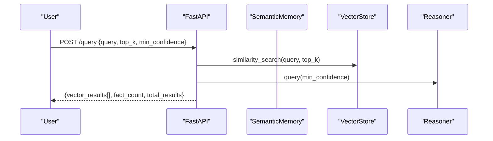

**Diagram sources**
- [src/llm/api/main.py:250-280](file://src/llm/api/main.py#L250-L280)
- [src/memory/vector_adapter.py:78-96](file://src/memory/vector_adapter.py#L78-L96)
- [src/core/reasoner.py:673-703](file://src/core/reasoner.py#L673-L703)

#### Forward Chaining
- Client posts ReasoningInput with max_depth
- Server runs forward_chain and returns conclusions and total confidence

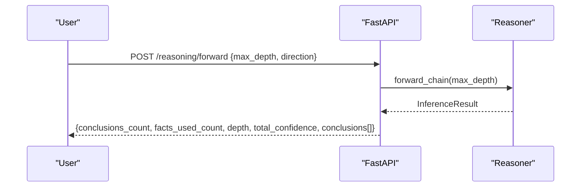

**Diagram sources**
- [src/llm/api/main.py:282-310](file://src/llm/api/main.py#L282-L310)
- [src/core/reasoner.py:243-349](file://src/core/reasoner.py#L243-L349)

#### Backward Chaining
- Client posts a goal Fact and max_depth
- Server traces backward to find supporting facts and returns results

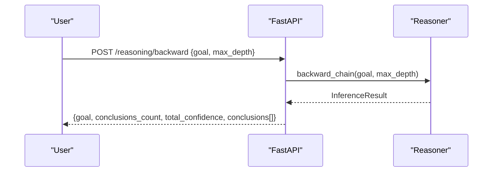

**Diagram sources**
- [src/llm/api/main.py:311-344](file://src/llm/api/main.py#L311-L344)
- [src/core/reasoner.py:351-438](file://src/core/reasoner.py#L351-L438)

#### Explanation Generation
- Client requests /reasoning/explain to render a human-readable explanation

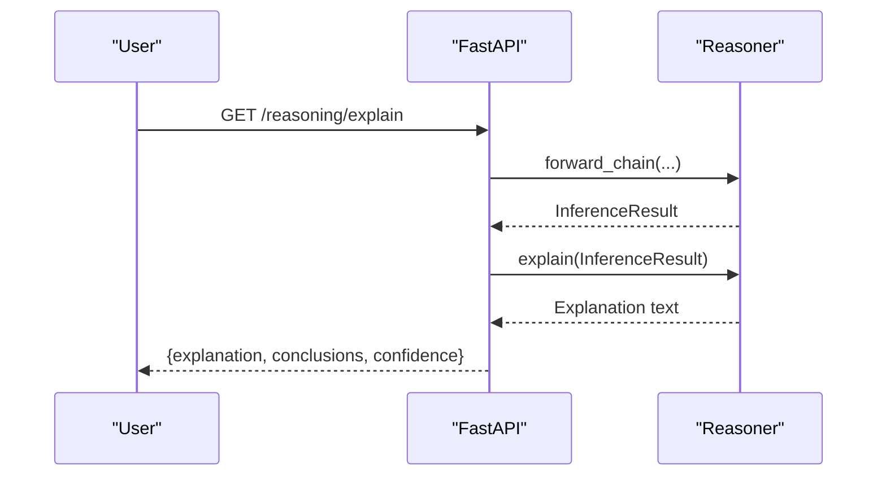

**Diagram sources**
- [src/llm/api/main.py:346-356](file://src/llm/api/main.py#L346-L356)
- [src/core/reasoner.py:617-642](file://src/core/reasoner.py#L617-L642)

### Additional Reasoning Utilities
- OntologyReasoner: Lightweight rule-based reasoning with confidence levels
- RuleEngine: Safe evaluation of mathematical/logical expressions with conflict detection and versioning

**Section sources**
- [src/core/ontology/reasoner.py:24-104](file://src/core/ontology/reasoner.py#L24-L104)
- [src/core/ontology/rule_engine.py:124-331](file://src/core/ontology/rule_engine.py#L124-L331)

## Dependency Analysis
High-level dependencies among components:

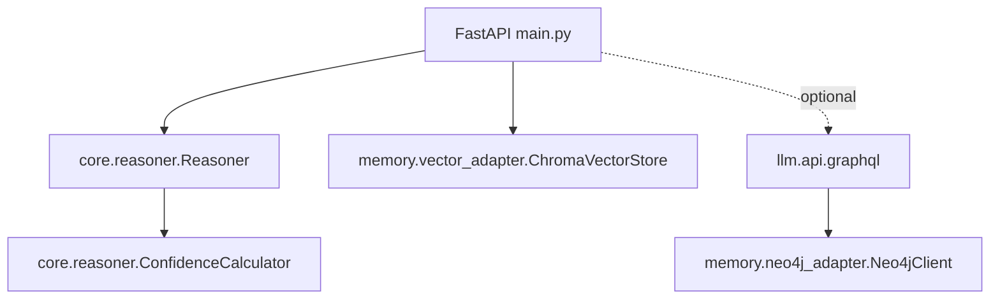

**Diagram sources**
- [src/llm/api/main.py:34-38](file://src/llm/api/main.py#L34-L38)
- [src/core/reasoner.py:173](file://src/core/reasoner.py#L173)
- [src/memory/vector_adapter.py:38-61](file://src/memory/vector_adapter.py#L38-L61)
- [src/llm/api/graphql.py:151-158](file://src/llm/api/graphql.py#L151-L158)
- [src/memory/neo4j_adapter.py:130-178](file://src/memory/neo4j_adapter.py#L130-L178)

**Section sources**
- [src/llm/api/main.py:34-38](file://src/llm/api/main.py#L34-L38)
- [src/core/reasoner.py:173](file://src/core/reasoner.py#L173)
- [src/memory/vector_adapter.py:38-61](file://src/memory/vector_adapter.py#L38-L61)
- [src/llm/api/graphql.py:151-158](file://src/llm/api/graphql.py#L151-L158)
- [src/memory/neo4j_adapter.py:130-178](file://src/memory/neo4j_adapter.py#L130-L178)

## Performance Considerations
- Control vector search cardinality with top_k to balance recall and latency.
- Tune max_depth to cap reasoning cost; use timeouts to avoid long-running chains.
- Filter low-confidence facts early with min_confidence to reduce downstream computation.
- Cache repeated reasoning results where appropriate; leverage inference caches in graph adapters.
- Prefer additive or multiplicative confidence aggregation based on domain needs; min-based propagation conservatively bounds confidence.
- Use bidirectional reasoning judiciously; it increases search space and runtime.

[No sources needed since this section provides general guidance]

## Troubleshooting Guide
Common issues and remedies:
- Missing vector store: Ensure chromadb is installed and collection is initialized.
- No facts returned: Verify min_confidence thresholds and that facts were added via /knowledge/facts.
- Slow reasoning: Reduce max_depth or enable early termination; review rule complexity.
- Timeout exceeded: Adjust timeout_seconds in reasoning calls; simplify rules or restrict search scope.
- API key errors: Confirm API key header matches environment configuration.

**Section sources**
- [src/memory/vector_adapter.py:38-61](file://src/memory/vector_adapter.py#L38-L61)
- [src/llm/api/main.py:21-31](file://src/llm/api/main.py#L21-L31)
- [src/core/reasoner.py:275-277](file://src/core/reasoner.py#L275-L277)
- [src/core/reasoner.py:381](file://src/core/reasoner.py#L381)

## Conclusion
The platform provides a cohesive pipeline for semantic search and rule-based reasoning:
- /query combines vector similarity with explicit facts
- /reasoning/forward and /reasoning/backward offer complementary inference strategies
- /reasoning/explain renders actionable insights
- Confidence propagation ensures reliable aggregation across steps and paths
Adopt the tuning parameters and integration patterns outlined above to build robust decision support systems.

[No sources needed since this section summarizes without analyzing specific files]

## Appendices

### API Definitions

- POST /query
  - Request: QueryInput
    - query: string
    - top_k: integer (1–20)
    - min_confidence: float (0.0–1.0)
  - Response: { query, vector_results[], fact_count, total_results }

- POST /reasoning/forward
  - Request: ReasoningInput
    - max_depth: integer (1–20)
    - direction: string ("forward"|"backward"|"bidirectional")
  - Response: { conclusions_count, facts_used_count, depth, total_confidence, conclusions[] }

- POST /reasoning/backward
  - Request: FactInput (subject, predicate, object) + max_depth
  - Response: { goal, conclusions_count, total_confidence, conclusions[] }

- GET /reasoning/explain
  - Response: { explanation, conclusions, confidence }

- GET /status
  - Response: { total_facts, total_rules, graph_connected, vector_store_status, uptime }

**Section sources**
- [src/llm/api/main.py:95-103](file://src/llm/api/main.py#L95-L103)
- [src/llm/api/main.py:250-356](file://src/llm/api/main.py#L250-L356)
- [src/llm/api/main.py:157-168](file://src/llm/api/main.py#L157-L168)

### Confidence Model Reference
- Evidence: source, reliability, content
- ConfidenceResult: value, method, evidence_count
- Methods:
  - calculate: multiplicative (per step)
  - propagate_confidence: min (across steps)

**Section sources**
- [src/core/reasoner.py:42-74](file://src/core/reasoner.py#L42-L74)