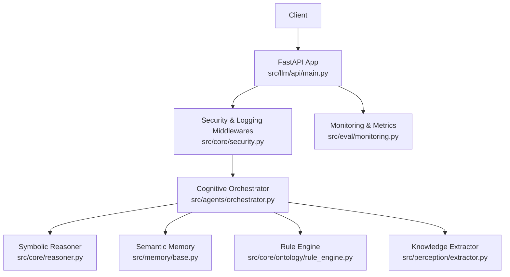
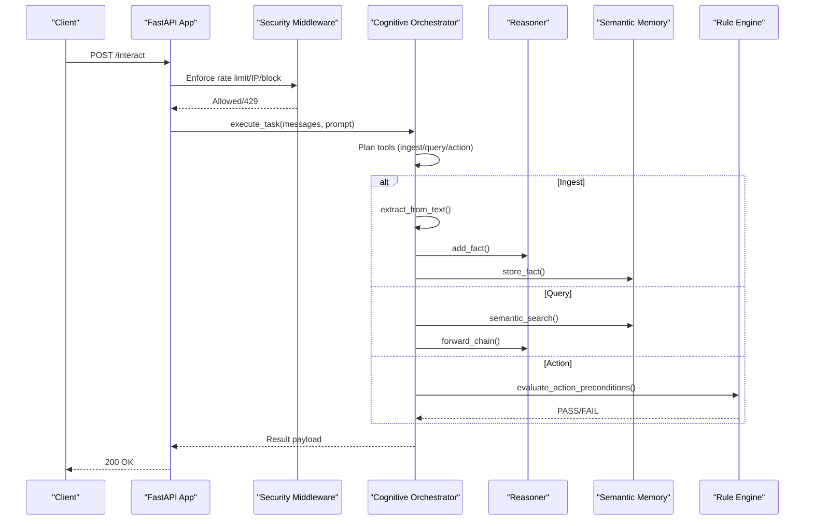
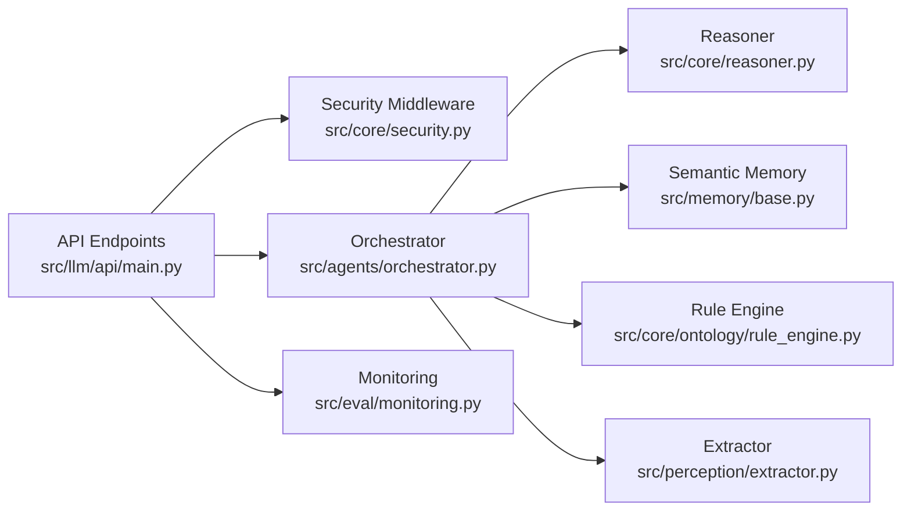
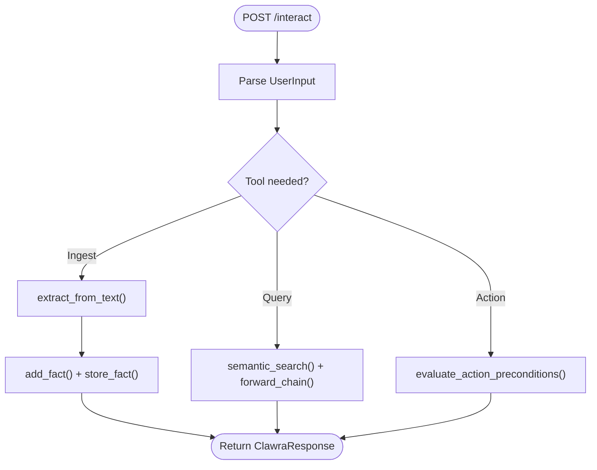

# REST API Endpoints

<cite>
**Referenced Files in This Document**
- [src/llm/api/main.py](file://src/llm/api/main.py)
- [src/core/reasoner.py](file://src/core/reasoner.py)
- [src/memory/base.py](file://src/memory/base.py)
- [src/agents/orchestrator.py](file://src/agents/orchestrator.py)
- [src/core/ontology/rule_engine.py](file://src/core/ontology/rule_engine.py)
- [src/core/security.py](file://src/core/security.py)
- [src/eval/monitoring.py](file://src/eval/monitoring.py)
- [src/perception/extractor.py](file://src/perception/extractor.py)
- [src/errors.py](file://src/errors.py)
- [README.md](file://README.md)
</cite>

## Table of Contents
1. [Introduction](#introduction)
2. [Project Structure](#project-structure)
3. [Core Components](#core-components)
4. [Architecture Overview](#architecture-overview)
5. [Detailed Component Analysis](#detailed-component-analysis)
6. [Dependency Analysis](#dependency-analysis)
7. [Performance Considerations](#performance-considerations)
8. [Troubleshooting Guide](#troubleshooting-guide)
9. [Conclusion](#conclusion)
10. [Appendices](#appendices)

## Introduction
This document provides comprehensive REST API documentation for the Clawra Cognitive Engine. It covers health checks, knowledge management, query and reasoning operations, rule management, and interactive endpoints. It also documents authentication, rate limiting, security headers, and error handling, along with practical curl examples and integration patterns.

## Project Structure
The API surface is implemented as a FastAPI application that orchestrates:
- Knowledge extraction and ingestion via a cognitive orchestrator
- Semantic memory and vector storage for hybrid retrieval
- Symbolic reasoning and rule enforcement
- Monitoring, logging, and security middleware

**Diagram sources**
- [src/llm/api/main.py:133-155](file://src/llm/api/main.py#L133-L155)
- [src/core/security.py:137-214](file://src/core/security.py#L137-L214)
- [src/agents/orchestrator.py:128-366](file://src/agents/orchestrator.py#L128-L366)
- [src/core/reasoner.py:145-703](file://src/core/reasoner.py#L145-L703)
- [src/memory/base.py:9-144](file://src/memory/base.py#L9-L144)
- [src/core/ontology/rule_engine.py:124-331](file://src/core/ontology/rule_engine.py#L124-L331)
- [src/perception/extractor.py:83-350](file://src/perception/extractor.py#L83-L350)
- [src/eval/monitoring.py:224-250](file://src/eval/monitoring.py#L224-L250)

**Section sources**
- [README.md:55-64](file://README.md#L55-L64)
- [src/llm/api/main.py:133-155](file://src/llm/api/main.py#L133-L155)

## Core Components
- FastAPI application with health/status endpoints, knowledge ingestion/query/reasoning, rule management, and interactive endpoint.
- Cognitive orchestrator coordinating extraction, graphRAG, reasoning, and action execution.
- Symbolic reasoner supporting forward/backward inference and confidence propagation.
- Semantic memory with vector similarity search and optional Neo4j graph persistence.
- Rule engine enforcing numeric/mathematical constraints via a safe sandbox.
- Security middleware adding rate limiting, IP blocking, correlation IDs, and security headers.
- Monitoring endpoints for metrics and detailed health.

**Section sources**
- [src/llm/api/main.py:133-155](file://src/llm/api/main.py#L133-L155)
- [src/agents/orchestrator.py:23-42](file://src/agents/orchestrator.py#L23-L42)
- [src/core/reasoner.py:145-703](file://src/core/reasoner.py#L145-L703)
- [src/memory/base.py:9-144](file://src/memory/base.py#L9-L144)
- [src/core/ontology/rule_engine.py:124-331](file://src/core/ontology/rule_engine.py#L124-L331)
- [src/core/security.py:137-214](file://src/core/security.py#L137-L214)
- [src/eval/monitoring.py:224-250](file://src/eval/monitoring.py#L224-L250)

## Architecture Overview
The API exposes unified endpoints that route to specialized engines. Authentication is optional for the LLM API; the orchestrator enforces API key validation.

**Diagram sources**
- [src/llm/api/main.py:424-440](file://src/llm/api/main.py#L424-L440)
- [src/agents/orchestrator.py:128-366](file://src/agents/orchestrator.py#L128-L366)
- [src/core/reasoner.py:243-438](file://src/core/reasoner.py#L243-L438)
- [src/memory/base.py:118-121](file://src/memory/base.py#L118-L121)
- [src/core/ontology/rule_engine.py:320-331](file://src/core/ontology/rule_engine.py#L320-L331)

## Detailed Component Analysis

### Authentication and Security
- API key header: X-API-Key
- Optional API key verification in the LLM API; the orchestrator enforces API key presence.
- Security headers: X-Content-Type-Options, X-Frame-Options, X-XSS-Protection, Strict-Transport-Security, Content-Security-Policy, Referrer-Policy, Permissions-Policy.
- Rate limiting: Token bucket (default 100/min, burst 20).
- IP blocking: Temporary blocks after repeated failed attempts.
- Correlation ID: X-Correlation-ID header for tracing.

Common integration patterns:
- Set X-API-Key for protected endpoints.
- Retry after 429 with Retry-After header.
- Use X-Correlation-ID for support requests.

**Section sources**
- [src/llm/api/main.py:21-31](file://src/llm/api/main.py#L21-L31)
- [src/core/security.py:137-214](file://src/core/security.py#L137-L214)
- [src/core/security.py:212-232](file://src/core/security.py#L212-L232)
- [src/core/security.py:98-157](file://src/core/security.py#L98-L157)
- [src/core/security.py:162-207](file://src/core/security.py#L162-L207)

### Health and Status Endpoints
- GET /
  - Description: Root endpoint with API info.
  - Response: name, version, description, docs, status.
- GET /health
  - Description: Health check.
  - Response: status, timestamp, services (reasoner, memory, vector_store).
- GET /status
  - Description: System status (requires API key).
  - Response: total_facts, total_rules, graph_connected, vector_store_status, uptime.

curl examples:
- curl -s https://host/health
- curl -s -H "X-API-Key: YOUR_KEY" https://host/status

**Section sources**
- [src/llm/api/main.py:133-155](file://src/llm/api/main.py#L133-L155)
- [src/llm/api/main.py:157-168](file://src/llm/api/main.py#L157-L168)

### Knowledge Management Endpoints
- POST /knowledge/ingest
  - Description: Ingest knowledge from text; extracts facts and stores them.
  - Request body: UserInput (text, context).
  - Response: ClawraResponse (intent, status, message, facts, confidence, trace).
  - Authentication: Optional API key.
- POST /knowledge/facts
  - Description: Add a single fact.
  - Request body: FactInput (subject, predicate, object, confidence, source).
  - Response: status, message, fact.
  - Authentication: Optional API key.
- GET /knowledge/facts
  - Description: List facts with optional filters.
  - Query params: subject, predicate, object, min_confidence, limit.
  - Response: count, facts (subject, predicate, object, confidence, source).
  - Authentication: Optional API key.
- DELETE /knowledge/facts/clear
  - Description: Clear all facts (caution advised).
  - Response: status, message.
  - Authentication: Optional API key.

curl examples:
- curl -s -X POST https://host/knowledge/ingest -H "Content-Type: application/json" -d '{"text":"..."}'
- curl -s -X POST https://host/knowledge/facts -H "X-API-Key: YOUR_KEY" -H "Content-Type: application/json" -d '{"subject":"...","predicate":"...","object":"..."}'

Validation rules:
- FactInput.confidence ∈ [0.0, 1.0].
- QueryInput.top_k ∈ [1, 20].

**Section sources**
- [src/llm/api/main.py:172-246](file://src/llm/api/main.py#L172-L246)
- [src/llm/api/main.py:211-239](file://src/llm/api/main.py#L211-L239)
- [src/llm/api/main.py:242-246](file://src/llm/api/main.py#L242-L246)

### Query and Reasoning Endpoints
- POST /query
  - Description: Semantic search plus graph fact query.
  - Request body: QueryInput (query, top_k ∈ [1,20], min_confidence ∈ [0.0,1.0]).
  - Response: query, vector_results (content, metadata), fact_count, total_results.
  - Authentication: Optional API key.
- POST /reasoning/forward
  - Description: Forward chain reasoning.
  - Request body: ReasoningInput (max_depth ∈ [1,20], direction ∈ {"forward","backward","bidirectional"}).
  - Response: conclusions_count, facts_used_count, depth, total_confidence, conclusions (rule, conclusion, confidence).
  - Authentication: Optional API key.
- POST /reasoning/backward
  - Description: Backward chain reasoning toward a goal.
  - Request body: FactInput (goal triple), max_depth (optional).
  - Response: goal, conclusions_count, total_confidence, conclusions.
  - Authentication: Optional API key.
- GET /reasoning/explain
  - Description: Explain last reasoning process.
  - Response: explanation, conclusions, confidence.
  - Authentication: Optional API key.

curl examples:
- curl -s -X POST https://host/query -H "Content-Type: application/json" -d '{"query":"...","top_k":5}'
- curl -s -X POST https://host/reasoning/forward -H "Content-Type: application/json" -d '{"max_depth":10,"direction":"forward"}'

**Section sources**
- [src/llm/api/main.py:250-356](file://src/llm/api/main.py#L250-L356)
- [src/core/reasoner.py:243-438](file://src/core/reasoner.py#L243-L438)

### Rule Management Endpoints
- GET /rules
  - Description: List all registered rules.
  - Response: count, rules (id, target_object_class, expression, description, version, created_at, metadata).
- POST /rules
  - Description: Add a new rule.
  - Request body: RuleInput (id, target_object_class, expression, description, version).
  - Response: status, rule_id, warnings (if any).
- POST /rules/evaluate
  - Description: Evaluate a rule with given context.
  - Request body: RuleEvaluationInput (rule_id, context).
  - Response: RuleEvaluationResponse (rule_id, status ∈ {"PASS","FAIL","ERROR"}, passed, expression, context_used, message).
- GET /rules/object/{object_class}
  - Description: Get all rules for a specific object class.
  - Response: object_class, count, rules.

curl examples:
- curl -s -X POST https://host/rules -H "X-API-Key: YOUR_KEY" -H "Content-Type: application/json" -d '{"id":"rule:...","target_object_class":"...","expression":"..."}'
- curl -s -X POST https://host/rules/evaluate -H "X-API-Key: YOUR_KEY" -H "Content-Type: application/json" -d '{"rule_id":"rule:...","context":{"param":1.0}}'

**Section sources**
- [src/llm/api/main.py:360-421](file://src/llm/api/main.py#L360-L421)
- [src/core/ontology/rule_engine.py:303-331](file://src/core/ontology/rule_engine.py#L303-L331)

### Interactive Endpoint
- POST /interact
  - Description: Unified interaction endpoint; routes to knowledge extraction or metacognitive reasoning.
  - Request body: UserInput (text, context).
  - Response: ClawraResponse (intent, status, message, facts, confidence, trace).
  - Authentication: Optional API key.

curl example:
- curl -s -X POST https://host/interact -H "Content-Type: application/json" -d '{"text":"..."}'

**Section sources**
- [src/llm/api/main.py:424-440](file://src/llm/api/main.py#L424-L440)

### Learning and Episodes
- GET /episodes
  - Description: List recent episodes from episodic memory.
  - Query param: limit.
  - Response: count, episodes.
- POST /episodes/feedback
  - Description: Add RLHF feedback for an episode.
  - Form params: task_id, reward, correction.
  - Response: status, message.
  - Authentication: Optional API key.

curl example:
- curl -s -X POST https://host/episodes/feedback -H "X-API-Key: YOUR_KEY" -d "task_id=...&reward=1.0&correction=..."

**Section sources**
- [src/llm/api/main.py:443-469](file://src/llm/api/main.py#L443-L469)

### Monitoring Endpoints
- GET /metrics
  - Description: Prometheus metrics endpoint.
- GET /health/detailed
  - Description: Detailed health status across components.

**Section sources**
- [src/eval/monitoring.py:224-250](file://src/eval/monitoring.py#L224-L250)

## Dependency Analysis
The API orchestrates multiple subsystems. The following diagram highlights key dependencies among components.

**Diagram sources**
- [src/llm/api/main.py:133-155](file://src/llm/api/main.py#L133-L155)
- [src/agents/orchestrator.py:23-42](file://src/agents/orchestrator.py#L23-L42)
- [src/core/reasoner.py:145-703](file://src/core/reasoner.py#L145-L703)
- [src/memory/base.py:9-144](file://src/memory/base.py#L9-L144)
- [src/core/ontology/rule_engine.py:124-331](file://src/core/ontology/rule_engine.py#L124-L331)
- [src/perception/extractor.py:83-350](file://src/perception/extractor.py#L83-L350)
- [src/eval/monitoring.py:224-250](file://src/eval/monitoring.py#L224-L250)

**Section sources**
- [src/llm/api/main.py:133-155](file://src/llm/api/main.py#L133-L155)
- [src/agents/orchestrator.py:128-366](file://src/agents/orchestrator.py#L128-L366)

## Performance Considerations
- Rate limiting: Default 100 requests per minute per IP; monitor X-RateLimit-Remaining and Retry-After.
- Latency-sensitive operations: forward/backward reasoning and semantic search; consider batching and tuning top_k.
- Vector similarity search: Adjust top_k and filter by min_confidence to reduce payload size.
- Orchestrator retries: Automatic exponential backoff on 429 from upstream LLM provider.

[No sources needed since this section provides general guidance]

## Troubleshooting Guide
Common HTTP errors and causes:
- 401 Unauthorized: Missing or invalid X-API-Key.
- 403 Forbidden: Blocked IP.
- 429 Too Many Requests: Rate limit exceeded; respect Retry-After.
- 422 Unprocessable Entity: Validation errors (e.g., out-of-range fields).
- 500 Internal Server Error: Unexpected runtime errors.

Error response format:
- error: true
- code: error code
- message: human-readable message
- timestamp: ISO timestamp
- path: requested path
- correlation_id: correlation ID for tracing

Audit and diagnostics:
- Use X-Correlation-ID to correlate logs.
- Review detailed health endpoint for component status.
- Inspect monitoring metrics for latency and throughput.

**Section sources**
- [src/errors.py:319-351](file://src/errors.py#L319-L351)
- [src/core/security.py:137-214](file://src/core/security.py#L137-L214)
- [src/eval/monitoring.py:238-247](file://src/eval/monitoring.py#L238-L247)

## Conclusion
The Clawra Cognitive Engine exposes a cohesive REST API for knowledge ingestion, semantic querying, symbolic reasoning, rule enforcement, and interactive orchestration. Security middleware, rate limiting, and monitoring ensure robust operations. Use the provided curl examples and integration patterns to build reliable clients.

[No sources needed since this section summarizes without analyzing specific files]

## Appendices

### Authentication Mechanisms
- Header: X-API-Key
- Optional in the LLM API; enforced by orchestrator.

**Section sources**
- [src/llm/api/main.py:21-31](file://src/llm/api/main.py#L21-L31)
- [src/agents/orchestrator.py:128-140](file://src/agents/orchestrator.py#L128-L140)

### Rate Limiting and Security Headers
- Default: 100 requests/minute per IP, burst 20.
- Security headers include strict transport security, XSS protection, frame options, CSP, and permissions policy.
- Correlation ID: X-Correlation-ID.

**Section sources**
- [src/core/security.py:98-157](file://src/core/security.py#L98-L157)
- [src/core/security.py:212-232](file://src/core/security.py#L212-L232)
- [src/core/security.py:137-214](file://src/core/security.py#L137-L214)

### Unified Interaction Workflow

**Diagram sources**
- [src/llm/api/main.py:424-440](file://src/llm/api/main.py#L424-L440)
- [src/agents/orchestrator.py:243-300](file://src/agents/orchestrator.py#L243-L300)
- [src/perception/extractor.py:278-350](file://src/perception/extractor.py#L278-L350)
- [src/memory/base.py:118-121](file://src/memory/base.py#L118-L121)
- [src/core/reasoner.py:243-438](file://src/core/reasoner.py#L243-L438)
- [src/core/ontology/rule_engine.py:320-331](file://src/core/ontology/rule_engine.py#L320-L331)