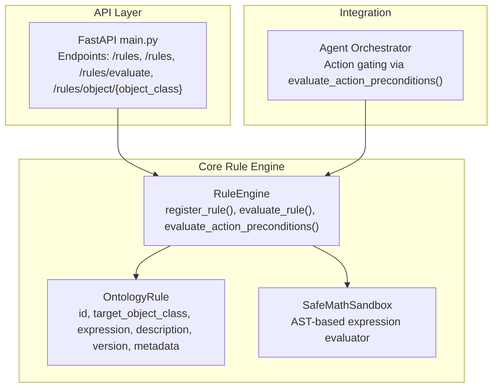
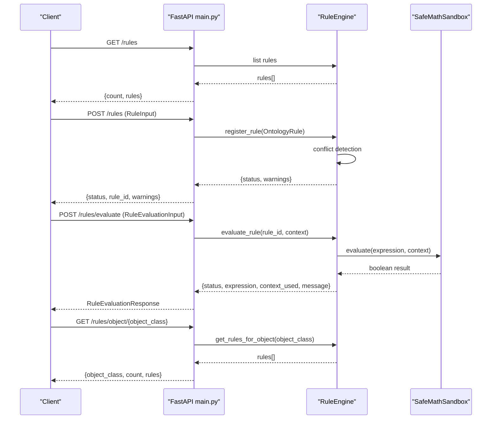
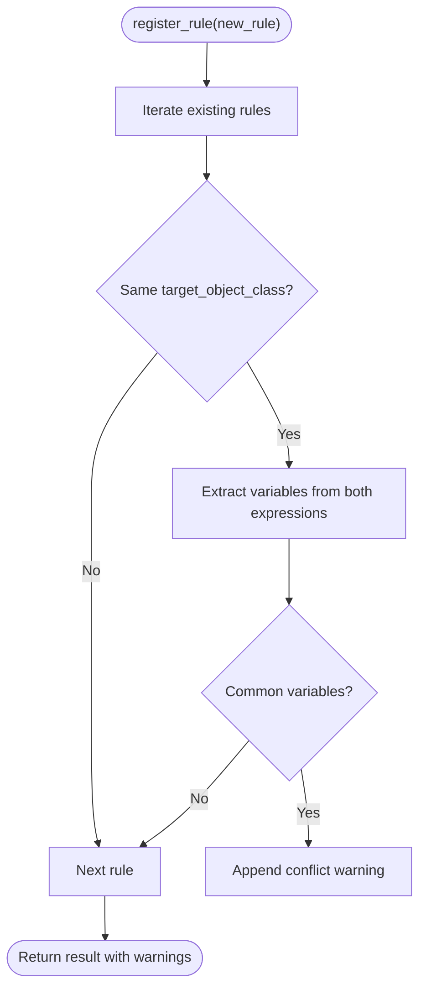
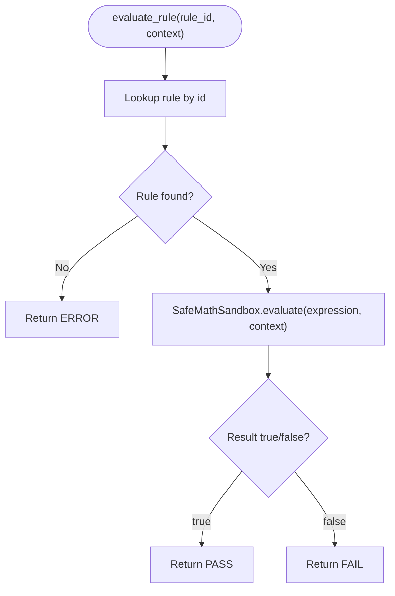
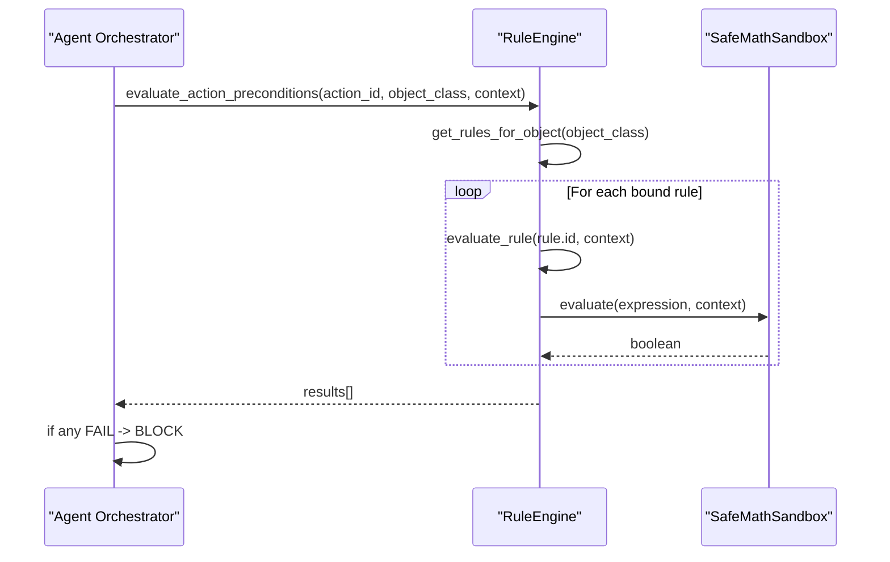
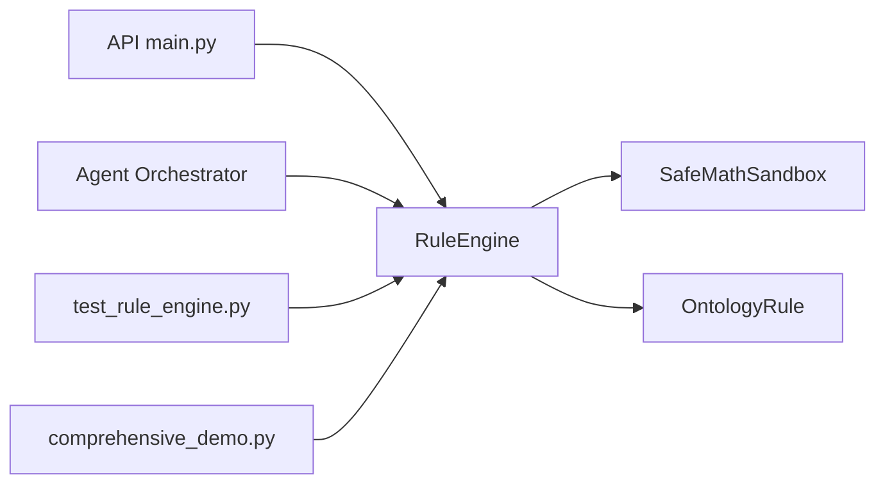

# Rule Management Endpoints

<cite>
**Referenced Files in This Document**
- [rule_engine.py](file://src/core/ontology/rule_engine.py)
- [main.py](file://src/llm/api/main.py)
- [orchestrator.py](file://src/agents/orchestrator.py)
- [test_rule_engine.py](file://tests/test_rule_engine.py)
- [comprehensive_demo.py](file://examples/comprehensive_demo.py)
- [README.md](file://README.md)
</cite>

## Table of Contents
1. [Introduction](#introduction)
2. [Project Structure](#project-structure)
3. [Core Components](#core-components)
4. [Architecture Overview](#architecture-overview)
5. [Detailed Component Analysis](#detailed-component-analysis)
6. [Dependency Analysis](#dependency-analysis)
7. [Performance Considerations](#performance-considerations)
8. [Troubleshooting Guide](#troubleshooting-guide)
9. [Conclusion](#conclusion)
10. [Appendices](#appendices)

## Introduction
This document describes the rule engine operations exposed by the platform, focusing on:
- Listing rules
- Registering rules
- Evaluating rules
- Retrieving object-specific rules

It documents the RuleInput and RuleEvaluationInput models, the OntologyRule integration, conflict detection mechanisms, and evaluation contexts. It also covers expression evaluation, warning systems for conflicting rules, safety-critical validation, best practices for rule development, testing procedures, and integration with safety-critical applications.

## Project Structure
The rule engine is implemented in the core ontology module and exposed via FastAPI endpoints. The orchestrator integrates the rule engine into action gating to enforce safety-critical constraints.



**Diagram sources**
- [main.py:360-420](file://src/llm/api/main.py#L360-L420)
- [rule_engine.py:124-330](file://src/core/ontology/rule_engine.py#L124-L330)
- [orchestrator.py:301-330](file://src/agents/orchestrator.py#L301-L330)

**Section sources**
- [main.py:360-420](file://src/llm/api/main.py#L360-L420)
- [rule_engine.py:124-330](file://src/core/ontology/rule_engine.py#L124-L330)
- [orchestrator.py:301-330](file://src/agents/orchestrator.py#L301-L330)

## Core Components
- RuleInput: Model for rule registration requests.
- RuleEvaluationInput: Model for rule evaluation requests.
- RuleEvaluationResponse: Model for rule evaluation responses.
- OntologyRule: Data model representing a rule with metadata and serialization.
- SafeMathSandbox: Secure expression evaluator using AST parsing.
- RuleEngine: Central service managing rules, conflict detection, persistence, and evaluation.

Key responsibilities:
- Rule registration with conflict warnings and versioning.
- Rule evaluation against a context of numeric variables.
- Object-scoped rule retrieval for action gating.
- Audit trail of rule changes.

**Section sources**
- [main.py:88-129](file://src/llm/api/main.py#L88-L129)
- [rule_engine.py:88-123](file://src/core/ontology/rule_engine.py#L88-L123)
- [rule_engine.py:124-330](file://src/core/ontology/rule_engine.py#L124-L330)

## Architecture Overview
The rule engine endpoints integrate with the broader cognitive framework to prevent unsafe actions and ensure deterministic validation.



**Diagram sources**
- [main.py:360-420](file://src/llm/api/main.py#L360-L420)
- [rule_engine.py:172-202](file://src/core/ontology/rule_engine.py#L172-L202)
- [rule_engine.py:303-318](file://src/core/ontology/rule_engine.py#L303-L318)
- [rule_engine.py:300-301](file://src/core/ontology/rule_engine.py#L300-L301)

## Detailed Component Analysis

### Rule Management Endpoints
- GET /rules
  - Lists all registered rules with counts and serialized rule objects.
- POST /rules
  - Registers a new rule from RuleInput. Returns status, rule_id, and warnings if conflicts are detected.
- POST /rules/evaluate
  - Evaluates a rule by ID with a numeric context. Returns RuleEvaluationResponse with status, expression, context_used, and message.
- GET /rules/object/{object_class}
  - Retrieves all rules targeting a specific object class.

```mermaid
flowchart TD
Start(["Request Received"]) --> Parse["Parse Request Body"]
Parse --> Validate["Validate Inputs"]
Validate --> Decision{"Endpoint?"}
Decision --> |GET /rules| List["Load all rules from RuleEngine"]
Decision --> |POST /rules| Register["Build OntologyRule and register"]
Decision --> |POST /rules/evaluate| Eval["Evaluate rule with SafeMathSandbox"]
Decision --> |GET /rules/object/{object_class}| Filter["Filter rules by target_object_class"]
List --> Serialize["Serialize rules to dicts"]
Register --> Conflict{"Conflict Detected?"}
Conflict --> |Yes| Warn["Attach warnings"]
Conflict --> |No| Success["Success"]
Eval --> BuildResp["Build RuleEvaluationResponse"]
Filter --> Serialize
Serialize --> Respond["Return JSON Response"]
Warn --> Respond
Success --> Respond
BuildResp --> Respond
```

**Diagram sources**
- [main.py:360-420](file://src/llm/api/main.py#L360-L420)
- [rule_engine.py:172-202](file://src/core/ontology/rule_engine.py#L172-L202)
- [rule_engine.py:303-318](file://src/core/ontology/rule_engine.py#L303-L318)
- [rule_engine.py:300-301](file://src/core/ontology/rule_engine.py#L300-L301)

**Section sources**
- [main.py:360-420](file://src/llm/api/main.py#L360-L420)

### RuleInput and RuleEvaluationInput Models
- RuleInput
  - Fields: id, target_object_class, expression, description, version.
  - Used to construct OntologyRule during registration.
- RuleEvaluationInput
  - Fields: rule_id, context (Dict[str, float]).
  - Used to evaluate a specific rule against a numeric context.

These models define the contract for rule registration and evaluation.

**Section sources**
- [main.py:88-129](file://src/llm/api/main.py#L88-L129)

### OntologyRule Integration
- Data fields: id, target_object_class, expression, description, version, created_at, metadata.
- Serialization/deserialization via to_dict/from_dict enables persistence and transport.
- Versioning supports updates with audit trail.

**Section sources**
- [rule_engine.py:88-123](file://src/core/ontology/rule_engine.py#L88-L123)

### Conflict Detection Mechanisms
- During registration, the engine detects potential conflicts by:
  - Comparing target_object_class of existing rules with the new rule.
  - Extracting variables from both expressions and flagging shared variables as potential conflicts.
- Warnings are returned to the caller; the rule is still registered.



**Diagram sources**
- [rule_engine.py:204-231](file://src/core/ontology/rule_engine.py#L204-L231)

**Section sources**
- [rule_engine.py:204-231](file://src/core/ontology/rule_engine.py#L204-L231)

### Evaluation Contexts and Expression Evaluation
- SafeMathSandbox evaluates expressions using Python’s AST parser with a restricted set of operators and functions.
- Allowed operators include arithmetic, comparison, and logical operations.
- Allowed functions include abs, min, max, round, sum, len.
- Variables are resolved from the provided context; missing variables cause errors.
- RuleEngine.evaluate_rule returns PASS/FAIL or ERROR with message.



**Diagram sources**
- [rule_engine.py:303-318](file://src/core/ontology/rule_engine.py#L303-L318)
- [rule_engine.py:14-85](file://src/core/ontology/rule_engine.py#L14-L85)

**Section sources**
- [rule_engine.py:14-85](file://src/core/ontology/rule_engine.py#L14-L85)
- [rule_engine.py:303-318](file://src/core/ontology/rule_engine.py#L303-L318)

### Safety-Critical Rule Validation and Action Gating
- The orchestrator enforces safety by evaluating all rules bound to an action’s target object class before execution.
- If any rule fails, the action is blocked and a summary of violations is returned.



**Diagram sources**
- [orchestrator.py:301-330](file://src/agents/orchestrator.py#L301-L330)
- [rule_engine.py:320-330](file://src/core/ontology/rule_engine.py#L320-L330)

**Section sources**
- [orchestrator.py:301-330](file://src/agents/orchestrator.py#L301-L330)
- [rule_engine.py:320-330](file://src/core/ontology/rule_engine.py#L320-L330)

### Examples of Rule Syntax and Evaluation
- Example expressions:
  - Supply capacity vs flow requirement threshold.
  - Budget vs planned budget limits.
  - Pressure bounds for safe operating range.
  - Positive quantity checks.
- Evaluation examples demonstrate PASS and FAIL outcomes under different contexts.

**Section sources**
- [rule_engine.py:142-166](file://src/core/ontology/rule_engine.py#L142-L166)
- [test_rule_engine.py:163-191](file://tests/test_rule_engine.py#L163-L191)
- [comprehensive_demo.py:118-163](file://examples/comprehensive_demo.py#L118-L163)
- [comprehensive_demo.py:327-360](file://examples/comprehensive_demo.py#L327-L360)

## Dependency Analysis
- API endpoints depend on RuleEngine for all operations.
- RuleEngine depends on SafeMathSandbox for expression evaluation.
- Orchestrator depends on RuleEngine for gating actions.
- Tests validate behavior across sandbox, conflict detection, evaluation, and persistence.



**Diagram sources**
- [main.py:360-420](file://src/llm/api/main.py#L360-L420)
- [rule_engine.py:124-330](file://src/core/ontology/rule_engine.py#L124-L330)
- [orchestrator.py:301-330](file://src/agents/orchestrator.py#L301-L330)
- [test_rule_engine.py:1-296](file://tests/test_rule_engine.py#L1-L296)
- [comprehensive_demo.py:118-163](file://examples/comprehensive_demo.py#L118-L163)

**Section sources**
- [main.py:360-420](file://src/llm/api/main.py#L360-L420)
- [rule_engine.py:124-330](file://src/core/ontology/rule_engine.py#L124-L330)
- [orchestrator.py:301-330](file://src/agents/orchestrator.py#L301-L330)
- [test_rule_engine.py:1-296](file://tests/test_rule_engine.py#L1-L296)
- [comprehensive_demo.py:118-163](file://examples/comprehensive_demo.py#L118-L163)

## Performance Considerations
- Expression evaluation uses AST parsing; keep expressions simple and avoid excessive nesting.
- Conflict detection scans existing rules; minimize the number of rules per object class for large-scale deployments.
- Persist rules to YAML/JSON to avoid repeated registration overhead.
- Use object-scoped retrieval to limit evaluation sets during action gating.

[No sources needed since this section provides general guidance]

## Troubleshooting Guide
Common issues and resolutions:
- Invalid expression syntax or unsupported operators/functions:
  - The sandbox raises errors for invalid syntax or disallowed constructs.
- Undefined variables in context:
  - Ensure all referenced variables are present in the evaluation context.
- Non-existent rule ID:
  - Evaluation returns an error status; verify rule registration.
- Conflicting rules:
  - Review warnings during registration and adjust expressions to avoid shared variables on the same object class.
- Action gating failures:
  - Inspect the returned violation summaries and adjust parameters to satisfy all rules.

**Section sources**
- [rule_engine.py:303-318](file://src/core/ontology/rule_engine.py#L303-L318)
- [rule_engine.py:14-85](file://src/core/ontology/rule_engine.py#L14-L85)
- [test_rule_engine.py:163-191](file://tests/test_rule_engine.py#L163-L191)
- [test_rule_engine.py:138-161](file://tests/test_rule_engine.py#L138-L161)
- [orchestrator.py:301-330](file://src/agents/orchestrator.py#L301-L330)

## Conclusion
The rule engine provides a robust, deterministic mechanism to validate numeric conditions across safety-critical domains. Its integration with the orchestrator ensures that actions are gated by hard constraints derived from the knowledge base. The API exposes straightforward endpoints for listing, registering, evaluating, and scoping rules, while the sandbox guarantees safe expression evaluation.

[No sources needed since this section summarizes without analyzing specific files]

## Appendices

### Best Practices for Rule Development
- Keep expressions simple and readable; use clear variable names aligned with the object class semantics.
- Prefer explicit thresholds and ranges; avoid ambiguous comparisons.
- Use versioning to track rule changes and maintain audit trails.
- Leverage conflict detection warnings to resolve overlapping constraints early.
- Validate rules against representative contexts to ensure PASS/FAIL behavior aligns with expectations.

**Section sources**
- [rule_engine.py:172-202](file://src/core/ontology/rule_engine.py#L172-L202)
- [rule_engine.py:204-231](file://src/core/ontology/rule_engine.py#L204-L231)
- [README.md:67-73](file://README.md#L67-L73)

### Testing Procedures
- Unit tests cover sandbox evaluation, rule serialization, conflict detection, evaluation outcomes, and persistence.
- Integration tests validate action preconditions and audit trail behavior.

**Section sources**
- [test_rule_engine.py:1-296](file://tests/test_rule_engine.py#L1-L296)

### Integration with Safety-Critical Applications
- Enforce action gating via evaluate_action_preconditions to prevent unsafe configurations.
- Use object-scoped rule retrieval to ensure all relevant constraints are evaluated.
- Maintain strict separation between LLM-generated numeric outputs and validated values.

**Section sources**
- [orchestrator.py:301-330](file://src/agents/orchestrator.py#L301-L330)
- [README.md:11-17](file://README.md#L11-L17)