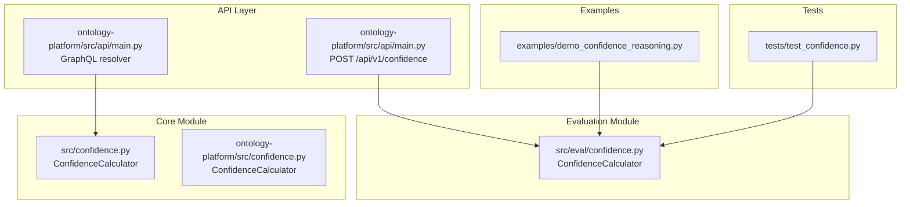
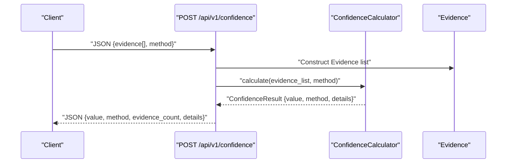
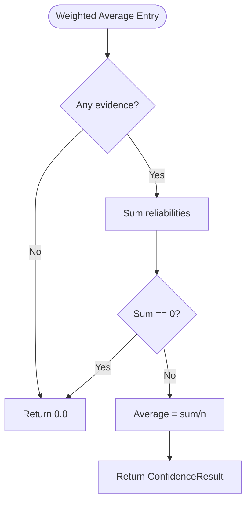
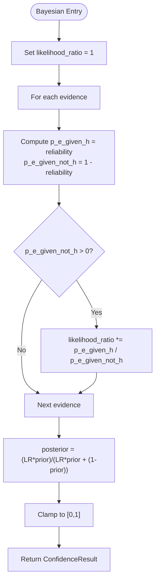
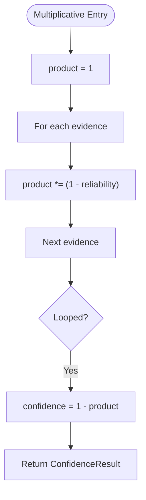
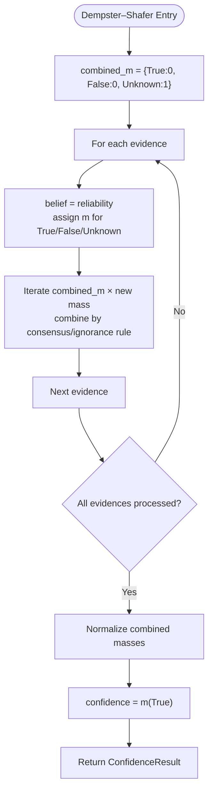
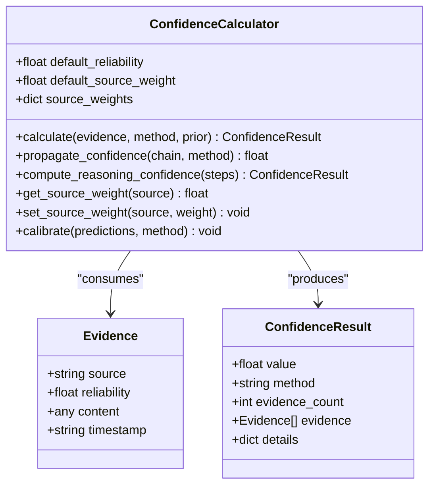
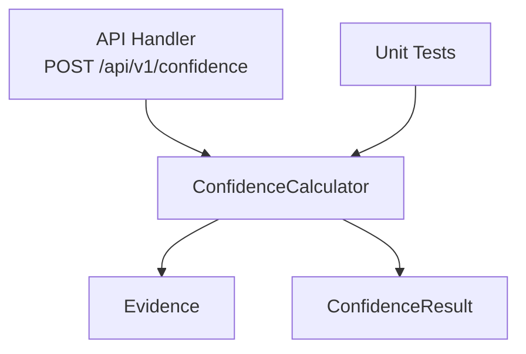

# Confidence Calculation Algorithms

<cite>
**Referenced Files in This Document**
- [confidence.py](file://src/eval/confidence.py)
- [confidence.py](file://src/confidence.py)
- [confidence.py](file://ontology-platform/src/confidence.py)
- [main.py](file://ontology-platform/src/api/main.py)
- [demo_confidence_reasoning.py](file://examples/demo_confidence_reasoning.py)
- [test_confidence.py](file://tests/test_confidence.py)
</cite>

## Table of Contents
1. [Introduction](#introduction)
2. [Project Structure](#project-structure)
3. [Core Components](#core-components)
4. [Architecture Overview](#architecture-overview)
5. [Detailed Component Analysis](#detailed-component-analysis)
6. [Dependency Analysis](#dependency-analysis)
7. [Performance Considerations](#performance-considerations)
8. [Troubleshooting Guide](#troubleshooting-guide)
9. [Conclusion](#conclusion)
10. [Appendices](#appendices)

## Introduction
This document explains the confidence calculation algorithms implemented in the platform’s evaluation and reasoning subsystems. It covers four primary methods:
- Weighted averaging
- Bayesian inference
- Multiplicative synthesis
- Dempster–Shafer evidence theory

It also documents the ConfidenceCalculator class interface, parameter configurations, and the source reliability weighting system. Practical examples illustrate how different methods handle conflicting evidence and produce varying confidence scores, along with trade-offs between computational complexity and accuracy.

## Project Structure
The confidence computation logic is implemented in two locations:
- Evaluation module: src/eval/confidence.py
- Core module: src/confidence.py and ontology-platform/src/confidence.py

The API integrates the calculator via a POST endpoint and exposes a GraphQL resolver for confidence queries. Examples demonstrate usage in real-world scenarios.

**Diagram sources**
- [confidence.py:32-334](file://src/eval/confidence.py#L32-L334)
- [confidence.py:31-331](file://src/confidence.py#L31-L331)
- [confidence.py:31-331](file://ontology-platform/src/confidence.py#L31-L331)
- [main.py:987-1006](file://ontology-platform/src/api/main.py#L987-L1006)
- [demo_confidence_reasoning.py:19-185](file://examples/demo_confidence_reasoning.py#L19-L185)
- [test_confidence.py:8-70](file://tests/test_confidence.py#L8-L70)

**Section sources**
- [confidence.py:1-407](file://src/eval/confidence.py#L1-L407)
- [confidence.py:1-404](file://src/confidence.py#L1-L404)
- [confidence.py:1-404](file://ontology-platform/src/confidence.py#L1-L404)
- [main.py:310-509](file://ontology-platform/src/api/main.py#L310-L509)
- [demo_confidence_reasoning.py:1-185](file://examples/demo_confidence_reasoning.py#L1-L185)
- [test_confidence.py:1-70](file://tests/test_confidence.py#L1-L70)

## Core Components
- Evidence: A typed container representing a single piece of evidence with source, reliability, content, and optional timestamp.
- ConfidenceResult: A typed result wrapper containing the computed confidence value, method used, number of evidences, the evidences themselves, and optional details.
- ConfidenceCalculator: The central class implementing the four methods and supporting propagation and calibration.

Key capabilities:
- Method selection: weighted, bayesian, multiplicative, dempster_shafer
- Source weighting: per-source weight overrides with a default weight
- Propagation: reasoning chain confidence propagation via min, arithmetic mean, geometric mean, or multiplicative combination
- Calibration: placeholder support for Platt and isotonic calibration

**Section sources**
- [confidence.py:13-30](file://src/eval/confidence.py#L13-L30)
- [confidence.py:32-334](file://src/eval/confidence.py#L32-L334)
- [confidence.py:12-30](file://src/confidence.py#L12-L30)
- [confidence.py:31-331](file://src/confidence.py#L31-L331)
- [confidence.py:12-30](file://ontology-platform/src/confidence.py#L12-L30)
- [confidence.py:31-331](file://ontology-platform/src/confidence.py#L31-L331)

## Architecture Overview
The API layer translates incoming requests into Evidence objects and delegates to the ConfidenceCalculator. The calculator applies the chosen method and returns a ConfidenceResult. The example demonstrates end-to-end usage.

**Diagram sources**
- [main.py:987-1006](file://ontology-platform/src/api/main.py#L987-L1006)
- [confidence.py:60-99](file://src/eval/confidence.py#L60-L99)
- [confidence.py:13-30](file://src/eval/confidence.py#L13-L30)

**Section sources**
- [main.py:987-1006](file://ontology-platform/src/api/main.py#L987-L1006)
- [confidence.py:60-99](file://src/eval/confidence.py#L60-L99)

## Detailed Component Analysis

### Weighted Averaging
- Purpose: Aggregate multiple evidences by their reliability, optionally adjusted by per-source weights.
- Implementation highlights:
  - Computes total weight from evidence reliabilities.
  - Returns normalized average reliability across evidences.
  - Stores total weight in details for diagnostics.
- Complexity: O(n) time, O(1) extra space.
- Assumptions:
  - Reliabilities are meaningful probabilities.
  - Evidence count normalization prevents bias toward larger sets.
- Use cases:
  - Quick aggregation across heterogeneous sources.
  - When conflicts are not modeled explicitly.

**Diagram sources**
- [confidence.py:97-112](file://src/eval/confidence.py#L97-L112)
- [confidence.py:97-112](file://src/confidence.py#L97-L112)
- [confidence.py:97-112](file://ontology-platform/src/confidence.py#L97-L112)

**Section sources**
- [confidence.py:97-112](file://src/eval/confidence.py#L97-L112)
- [confidence.py:97-112](file://src/confidence.py#L97-L112)
- [confidence.py:97-112](file://ontology-platform/src/confidence.py#L97-L112)

### Bayesian Inference
- Purpose: Update belief about a hypothesis using Bayes’ rule with likelihood ratios derived from evidence reliabilities.
- Implementation highlights:
  - Converts reliability to likelihood P(E|H) and P(E|¬H).
  - Computes cumulative likelihood ratio across evidences.
  - Applies Bayes’ theorem with a provided prior.
  - Clamps result to [0, 1].
- Complexity: O(n) time, O(1) extra space.
- Assumptions:
  - Likelihood ratio formulation assumes independent-like updates.
  - Prior reflects baseline belief before seeing evidence.
- Use cases:
  - Situations requiring probabilistic updating with explicit priors.
  - When evidences can be interpreted as conditionals.

**Diagram sources**
- [confidence.py:120-150](file://src/eval/confidence.py#L120-L150)
- [confidence.py:114-144](file://src/confidence.py#L114-L144)
- [confidence.py:114-144](file://ontology-platform/src/confidence.py#L114-L144)

**Section sources**
- [confidence.py:120-150](file://src/eval/confidence.py#L120-L150)
- [confidence.py:114-144](file://src/confidence.py#L114-L144)
- [confidence.py:114-144](file://ontology-platform/src/confidence.py#L114-L144)

### Multiplicative Synthesis
- Purpose: Combine multiple evidences multiplicatively to estimate joint confidence.
- Implementation highlights:
  - Uses formula C = 1 − ∏(1 − reliability).
  - Emphasizes increasing confidence with more supporting evidences.
- Complexity: O(n) time, O(1) extra space.
- Assumptions:
  - Evidences are independent or sufficiently weakly dependent.
  - Reliabilities represent success probabilities.
- Use cases:
  - Aggregating multiple independent signals.
  - Conservative growth toward certainty.

**Diagram sources**
- [confidence.py:152-170](file://src/eval/confidence.py#L152-L170)
- [confidence.py:146-164](file://src/confidence.py#L146-L164)
- [confidence.py:146-164](file://ontology-platform/src/confidence.py#L146-L164)

**Section sources**
- [confidence.py:152-170](file://src/eval/confidence.py#L152-L170)
- [confidence.py:146-164](file://src/confidence.py#L146-L164)
- [confidence.py:146-164](file://ontology-platform/src/confidence.py#L146-L164)

### Dempster–Shafer Evidence Theory
- Purpose: Model uncertainty and belief using mass functions and belief/plausibility measures.
- Implementation highlights:
  - Maintains a mass function over {True, False, Unknown}.
  - Combines evidence iteratively using Dempster’s rule approximation.
  - Normalizes combined mass and extracts belief in True.
  - Exposes mass distribution in details.
- Complexity: Exponential in number of hypotheses per iteration; here simplified to three hypotheses.
- Assumptions:
  - Unknown captures lack of discrimination or conflict.
  - Combination rule aggregates support for True while preserving ignorance.
- Use cases:
  - Scenarios requiring explicit uncertainty modeling.
  - Conflict detection and conservative reasoning under partial information.

**Diagram sources**
- [confidence.py:172-220](file://src/eval/confidence.py#L172-L220)
- [confidence.py:166-217](file://src/confidence.py#L166-L217)
- [confidence.py:166-217](file://ontology-platform/src/confidence.py#L166-L217)

**Section sources**
- [confidence.py:172-220](file://src/eval/confidence.py#L172-L220)
- [confidence.py:166-217](file://src/confidence.py#L166-L217)
- [confidence.py:166-217](file://ontology-platform/src/confidence.py#L166-L217)

### ConfidenceCalculator Interface and Parameters
- Constructor parameters:
  - default_reliability: default reliability for unknown sources.
  - default_source_weight: default per-source weight multiplier.
- Methods:
  - calculate(evidence, method, prior, **kwargs): dispatch to specific method.
  - propagate_confidence(chain_confidences, method): reasoning chain propagation.
  - compute_reasoning_confidence(reasoning_steps): end-to-end reasoning confidence.
  - get_source_weight(source), set_source_weight(source, weight): manage per-source weights.
  - calibrate(predictions, method): placeholder for confidence calibration.
- API integration:
  - POST /api/v1/confidence accepts ConfidenceRequest with evidence array and method.
  - GraphQL resolver constructs Evidence objects and calls calculate.

**Diagram sources**
- [confidence.py:13-30](file://src/eval/confidence.py#L13-L30)
- [confidence.py:32-334](file://src/eval/confidence.py#L32-L334)
- [confidence.py:12-30](file://src/confidence.py#L12-L30)
- [confidence.py:31-331](file://src/confidence.py#L31-L331)
- [confidence.py:12-30](file://ontology-platform/src/confidence.py#L12-L30)
- [confidence.py:31-331](file://ontology-platform/src/confidence.py#L31-L331)

**Section sources**
- [confidence.py:50-99](file://src/eval/confidence.py#L50-L99)
- [confidence.py:50-95](file://src/confidence.py#L50-L95)
- [confidence.py:50-95](file://ontology-platform/src/confidence.py#L50-L95)
- [main.py:545-549](file://ontology-platform/src/api/main.py#L545-L549)
- [main.py:987-1006](file://ontology-platform/src/api/main.py#L987-L1006)

### Source Reliability Weighting System
- Per-source weights override default source weight.
- Weights are clamped to [0, 1].
- Used primarily in weighted averaging; other methods rely on evidence reliability directly.

Practical usage:
- Increase weight for trusted sources to amplify their contribution.
- Decrease weight for untrusted sources to suppress their impact.

**Section sources**
- [confidence.py:299-305](file://src/eval/confidence.py#L299-L305)
- [confidence.py:296-302](file://src/confidence.py#L296-L302)
- [confidence.py:296-302](file://ontology-platform/src/confidence.py#L296-L302)

### API and Example Integration
- API endpoint: POST /api/v1/confidence
  - Request body: ConfidenceRequest with evidence list and method.
  - Response: value, method, evidence_count, details.
- Example usage:
  - Demonstrates weighted, bayesian, multiplicative, and reasoning chain propagation.
  - Shows handling of single/multiple evidences and conflicting reports.

**Section sources**
- [main.py:545-549](file://ontology-platform/src/api/main.py#L545-L549)
- [main.py:987-1006](file://ontology-platform/src/api/main.py#L987-L1006)
- [demo_confidence_reasoning.py:22-185](file://examples/demo_confidence_reasoning.py#L22-L185)

## Dependency Analysis
- API depends on ConfidenceCalculator to compute results.
- ConfidenceCalculator depends on Evidence and ConfidenceResult data structures.
- Tests validate core behaviors for weighted and multiplicative methods and source weight management.

**Diagram sources**
- [main.py:987-1006](file://ontology-platform/src/api/main.py#L987-L1006)
- [confidence.py:32-334](file://src/eval/confidence.py#L32-L334)
- [test_confidence.py:8-70](file://tests/test_confidence.py#L8-L70)

**Section sources**
- [main.py:987-1006](file://ontology-platform/src/api/main.py#L987-L1006)
- [confidence.py:32-334](file://src/eval/confidence.py#L32-L334)
- [test_confidence.py:8-70](file://tests/test_confidence.py#L8-L70)

## Performance Considerations
- Weighted averaging: O(n) time, minimal overhead; suitable for large-scale evidence sets.
- Bayesian inference: O(n) time dominated by likelihood ratio accumulation; small constant factors.
- Multiplicative synthesis: O(n) time; numerics may approach 1 quickly, reducing sensitivity to further evidences.
- Dempster–Shafer: O(n × hypotheses²) in general; simplified implementation here remains O(n) due to fixed three-hypothesis space.
- Propagation methods:
  - Min: O(n)
  - Arithmetic/geometric: O(n)
  - Multiplicative: O(n)
- Recommendations:
  - Prefer weighted or multiplicative for large n; use Dempster–Shafer when explicit uncertainty modeling is required.
  - Cache per-source weights to avoid repeated dictionary lookups.

[No sources needed since this section provides general guidance]

## Troubleshooting Guide
Common issues and resolutions:
- Empty evidence list: All methods return zero confidence; ensure evidence is populated.
- Zero total weight (weighted): Returns zero; verify reliability values and per-source weights.
- Division by zero risk (Bayesian): Handled by checking p_e_given_not_h > 0 before ratio computation.
- Unexpected low confidence with conflicting evidences:
  - Bayesian: Likelihood ratio can decrease with contradictory evidence.
  - Dempster–Shafer: Unknown mass increases, lowering belief in True.
  - Weighted/multiplicative: May still reflect average reliability; consider adjusting per-source weights.
- Propagation artifacts:
  - Min propagation is conservative; arithmetic/geometric/multiplicative offer alternatives depending on desired behavior.

Validation references:
- Unit tests cover evidence/result structures, weighted and multiplicative calculations, and source weight behavior.

**Section sources**
- [test_confidence.py:11-70](file://tests/test_confidence.py#L11-L70)
- [confidence.py:79-98](file://src/eval/confidence.py#L79-L98)
- [confidence.py:79-95](file://src/confidence.py#L79-L95)
- [confidence.py:79-95](file://ontology-platform/src/confidence.py#L79-L95)

## Conclusion
The platform provides a robust, extensible confidence calculation framework supporting multiple paradigms:
- Weighted averaging for straightforward aggregation
- Bayesian inference for probabilistic updating
- Multiplicative synthesis for conservative combination
- Dempster–Shafer for explicit uncertainty modeling

The ConfidenceCalculator offers a unified interface, supports per-source weighting, and integrates cleanly with the API and examples. Choose methods based on your needs for interpretability, computational cost, and modeling of uncertainty.

[No sources needed since this section summarizes without analyzing specific files]

## Appendices

### Mathematical Foundations and Use Cases Summary
- Weighted averaging
  - Foundation: Simple average of reliability values.
  - Use case: Fast aggregation across diverse sources.
- Bayesian inference
  - Foundation: P(H|E) ∝ P(E|H)P(H).
  - Use case: Updating beliefs with explicit priors.
- Multiplicative synthesis
  - Foundation: C = 1 − ∏(1 − c_i).
  - Use case: Combining independent signals conservatively.
- Dempster–Shafer
  - Foundation: Belief/plausibility with mass functions and conflict handling.
  - Use case: Explicit uncertainty and conflict modeling.

[No sources needed since this section provides general guidance]