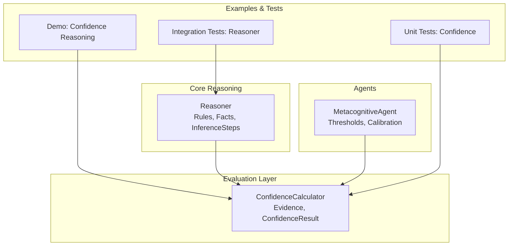
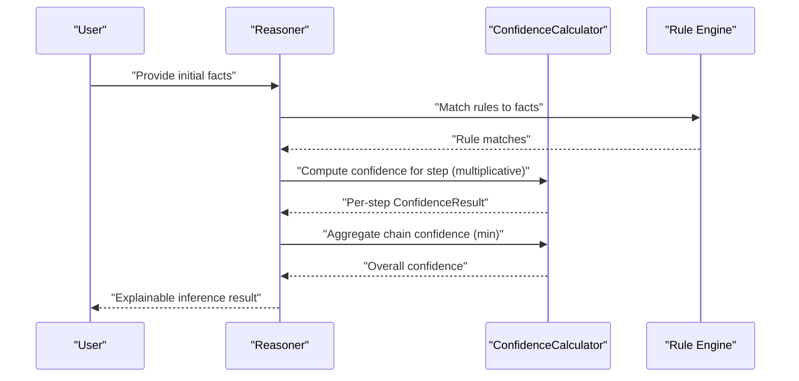
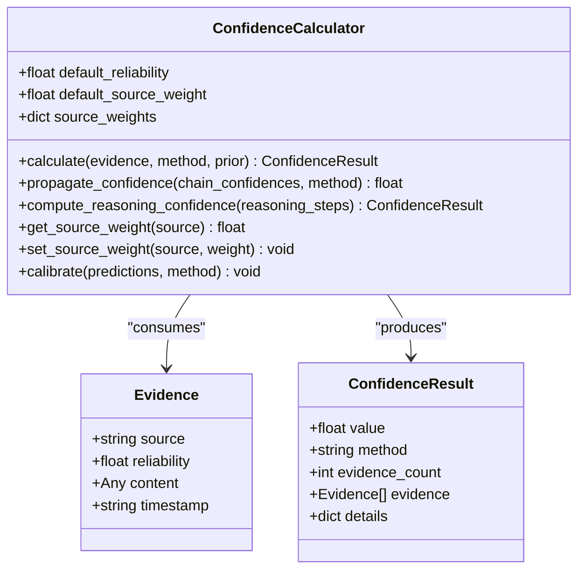
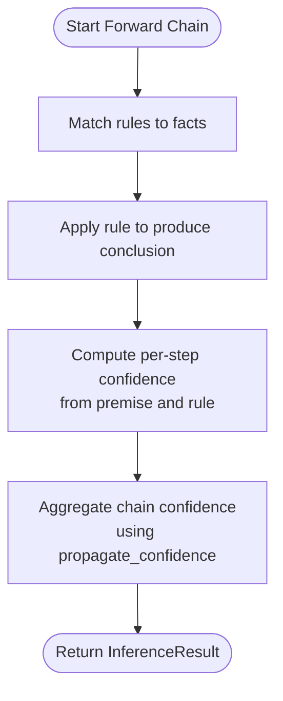
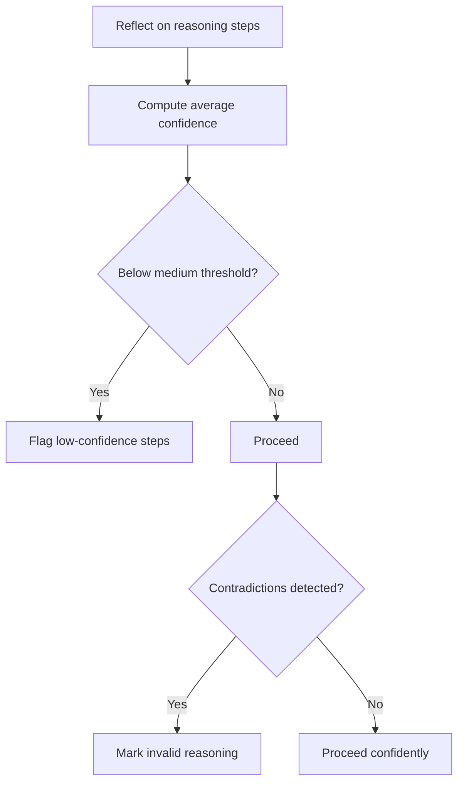
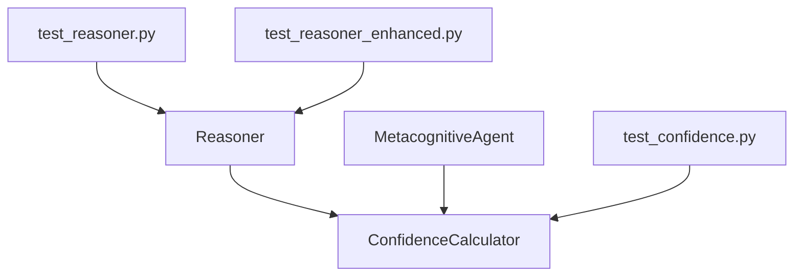

# Confidence Propagation and Chain Reasoning

<cite>
**Referenced Files in This Document**
- [confidence.py](file://src/eval/confidence.py)
- [demo_confidence_reasoning.py](file://examples/demo_confidence_reasoning.py)
- [test_confidence.py](file://tests/test_confidence.py)
- [reasoner.py](file://src/core/reasoner.py)
- [metacognition.py](file://src/agents/metacognition.py)
- [test_reasoner.py](file://tests/test_reasoner.py)
- [test_reasoner_enhanced.py](file://tests/test_reasoner_enhanced.py)
</cite>

## Table of Contents
1. [Introduction](#introduction)
2. [Project Structure](#project-structure)
3. [Core Components](#core-components)
4. [Architecture Overview](#architecture-overview)
5. [Detailed Component Analysis](#detailed-component-analysis)
6. [Dependency Analysis](#dependency-analysis)
7. [Performance Considerations](#performance-considerations)
8. [Troubleshooting Guide](#troubleshooting-guide)
9. [Conclusion](#conclusion)
10. [Appendices](#appendices)

## Introduction
This document explains how confidence values are transmitted and modified as they flow through logical reasoning chains. It documents the four propagation methods—minimum value, arithmetic mean, geometric mean, and multiplicative combination—and demonstrates how premise confidence, rule strength, and conclusion reliability interact. It also covers how contradictory evidence affects confidence propagation and outlines strategies for handling inconsistent logical chains. Finally, it provides guidelines for setting confidence thresholds and determining when reasoning chains become unreliable.

## Project Structure
The confidence propagation and chain reasoning capabilities are implemented across several modules:
- Evaluation and confidence computation: [confidence.py](file://src/eval/confidence.py)
- Example demonstrations: [demo_confidence_reasoning.py](file://examples/demo_confidence_reasoning.py)
- Automated tests: [test_confidence.py](file://tests/test_confidence.py)
- Core reasoning engine integrating confidence: [reasoner.py](file://src/core/reasoner.py)
- Metacognitive agent with confidence calibration and thresholds: [metacognition.py](file://src/agents/metacognition.py)
- Reasoner integration tests: [test_reasoner.py](file://tests/test_reasoner.py), [test_reasoner_enhanced.py](file://tests/test_reasoner_enhanced.py)

**Diagram sources**
- [confidence.py:13-334](file://src/eval/confidence.py#L13-L334)
- [reasoner.py:145-800](file://src/core/reasoner.py#L145-L800)
- [metacognition.py:8-204](file://src/agents/metacognition.py#L8-L204)
- [demo_confidence_reasoning.py:1-185](file://examples/demo_confidence_reasoning.py#L1-L185)
- [test_confidence.py:1-70](file://tests/test_confidence.py#L1-L70)
- [test_reasoner.py:1-200](file://tests/test_reasoner.py#L1-L200)
- [test_reasoner_enhanced.py:149-272](file://tests/test_reasoner_enhanced.py#L149-L272)

**Section sources**
- [confidence.py:1-407](file://src/eval/confidence.py#L1-L407)
- [reasoner.py:1-819](file://src/core/reasoner.py#L1-L819)
- [metacognition.py:1-204](file://src/agents/metacognition.py#L1-L204)
- [demo_confidence_reasoning.py:1-185](file://examples/demo_confidence_reasoning.py#L1-L185)
- [test_confidence.py:1-70](file://tests/test_confidence.py#L1-L70)
- [test_reasoner.py:1-200](file://tests/test_reasoner.py#L1-L200)
- [test_reasoner_enhanced.py:149-272](file://tests/test_reasoner_enhanced.py#L149-L272)

## Core Components
- ConfidenceCalculator: Computes confidence from multiple evidence sources and propagates confidence along reasoning chains. Supports multiple aggregation methods and Dempster–Shafer fusion.
- Reasoner: A rule-based inference engine that computes per-step confidence and aggregates chain-wide confidence using propagation methods.
- MetacognitiveAgent: Provides confidence thresholds and calibration heuristics to assess knowledge boundaries and guide decisions.

Key responsibilities:
- Evidence modeling and aggregation
- Rule-driven confidence updates
- Chain-level confidence propagation
- Threshold-based reliability assessment

**Section sources**
- [confidence.py:32-334](file://src/eval/confidence.py#L32-L334)
- [reasoner.py:145-350](file://src/core/reasoner.py#L145-L350)
- [metacognition.py:8-204](file://src/agents/metacognition.py#L8-L204)

## Architecture Overview
The system integrates confidence computation into the reasoning pipeline. Evidence from facts and rules is transformed into confidence values, which are then propagated through inference steps and aggregated into a final chain confidence.

**Diagram sources**
- [reasoner.py:243-350](file://src/core/reasoner.py#L243-L350)
- [confidence.py:152-170](file://src/eval/confidence.py#L152-L170)
- [confidence.py:222-259](file://src/eval/confidence.py#L222-L259)

## Detailed Component Analysis

### ConfidenceCalculator: Evidence Aggregation and Propagation
- Evidence model: Each piece of evidence carries a source, reliability, and content.
- ConfidenceResult: Encapsulates the computed confidence value, method used, count of evidences, and optional details.
- Methods:
  - Weighted average: Combines reliability with configurable source weights.
  - Multiplicative synthesis: Combines reliability using complement products.
  - Bayes-like update: Computes posterior probability from likelihood ratios.
  - Dempster–Shafer fusion: Combines belief assignments under uncertainty.
- Chain propagation:
  - min: Conservative propagation; worst-case confidence dominates.
  - arithmetic: Averages per-step confidences.
  - geometric: Geometric mean of per-step confidences.
  - multiplicative: Product of per-step confidences.

**Diagram sources**
- [confidence.py:13-334](file://src/eval/confidence.py#L13-L334)

**Section sources**
- [confidence.py:13-334](file://src/eval/confidence.py#L13-L334)

### Reasoner: Rule-Based Inference with Confidence
- Rules and facts carry confidence values.
- Forward chain:
  - Matches rules to facts, applies rules, constructs new facts with confidence computed from:
    - Premise confidence (from facts)
    - Rule confidence (from rule definition)
  - Aggregates chain confidence using propagate_confidence (default min).
- Backward chain:
  - Builds a path from goals to premises, computing confidence along the way and aggregating using propagate_confidence.

**Diagram sources**
- [reasoner.py:243-350](file://src/core/reasoner.py#L243-L350)
- [confidence.py:222-259](file://src/eval/confidence.py#L222-L259)

**Section sources**
- [reasoner.py:243-350](file://src/core/reasoner.py#L243-L350)
- [confidence.py:222-259](file://src/eval/confidence.py#L222-L259)

### MetacognitiveAgent: Thresholds and Calibration
- Defines confidence thresholds for knowledge boundary classification.
- Provides calibration function that combines evidence count and quality into a calibrated confidence score.
- Reflects on reasoning steps and detects contradictions to flag unreliable conclusions.

**Diagram sources**
- [metacognition.py:23-90](file://src/agents/metacognition.py#L23-L90)

**Section sources**
- [metacognition.py:18-204](file://src/agents/metacognition.py#L18-L204)

### Example: Confidence-Based Reasoning Demo
- Demonstrates:
  - Single and multi-evidence confidence calculation
  - Evidence analysis with conflicting sources
  - Business scenario evaluation
  - Auto-learning by adjusting source weights

**Section sources**
- [demo_confidence_reasoning.py:22-151](file://examples/demo_confidence_reasoning.py#L22-L151)

## Dependency Analysis
- ConfidenceCalculator is used by Reasoner during inference to compute per-step and chain-wide confidence.
- MetacognitiveAgent consumes Reasoner outputs and applies thresholds and calibration.
- Tests validate correctness of confidence computations and reasoning chain propagation.

**Diagram sources**
- [confidence.py:32-334](file://src/eval/confidence.py#L32-L334)
- [reasoner.py:145-350](file://src/core/reasoner.py#L145-L350)
- [metacognition.py:8-204](file://src/agents/metacognition.py#L8-L204)
- [test_confidence.py:1-70](file://tests/test_confidence.py#L1-L70)
- [test_reasoner.py:1-200](file://tests/test_reasoner.py#L1-L200)
- [test_reasoner_enhanced.py:149-272](file://tests/test_reasoner_enhanced.py#L149-L272)

**Section sources**
- [confidence.py:32-334](file://src/eval/confidence.py#L32-L334)
- [reasoner.py:145-350](file://src/core/reasoner.py#L145-L350)
- [metacognition.py:8-204](file://src/agents/metacognition.py#L8-L204)
- [test_confidence.py:1-70](file://tests/test_confidence.py#L1-L70)
- [test_reasoner.py:1-200](file://tests/test_reasoner.py#L1-L200)
- [test_reasoner_enhanced.py:149-272](file://tests/test_reasoner_enhanced.py#L149-L272)

## Performance Considerations
- Chain propagation methods:
  - min: Fastest, conservative; suitable for safety-critical chains.
  - arithmetic: Simple averaging; good balance of speed and interpretability.
  - geometric: Emphasizes lower values; useful when small probabilities dominate.
  - multiplicative: Strongly suppresses confidence; appropriate for strict conjunctions.
- Computational complexity:
  - Per-step confidence computation is O(n) in number of evidences.
  - Chain propagation is O(m) in number of steps.
- Practical tips:
  - Prefer min for default chain propagation to avoid optimistic overconfidence.
  - Use geometric or arithmetic when combining heterogeneous evidences with balanced trust.
  - Use multiplicative when each step requires strong support from all previous steps.

[No sources needed since this section provides general guidance]

## Troubleshooting Guide
Common issues and remedies:
- Low overall confidence in long chains:
  - Use min propagation by default; consider switching to arithmetic or geometric for less conservative estimates.
  - Review rule confidences and premise confidences; strengthen weak links.
- Contradictory evidence:
  - Use Dempster–Shafer fusion to combine conflicting beliefs; normalize mass assignments.
  - Adjust source weights to reduce influence of unreliable sources.
- Unstable or oscillating confidence:
  - Calibrate confidence using MetacognitiveAgent’s calibration function to incorporate evidence count and quality.
  - Set explicit thresholds to detect and flag low-confidence reasoning.

Validation references:
- Unit tests for confidence calculator and propagation
- Integration tests for reasoning chain behavior

**Section sources**
- [test_confidence.py:27-61](file://tests/test_confidence.py#L27-L61)
- [test_reasoner.py:151-172](file://tests/test_reasoner.py#L151-L172)
- [test_reasoner_enhanced.py:254-272](file://tests/test_reasoner_enhanced.py#L254-L272)

## Conclusion
Confidence propagation in this system is designed to be transparent, modular, and robust. By separating evidence aggregation from chain propagation, the system supports multiple strategies tailored to different domains and risk tolerances. The integration with the reasoning engine ensures that each inference step carries a quantified confidence, and the overall chain confidence is computed consistently. Thresholds and calibration further enable practical decision-making and self-awareness in uncertain reasoning.

[No sources needed since this section summarizes without analyzing specific files]

## Appendices

### Mathematical Formulations and Step-by-Step Examples
- Weighted average:
  - Formula: \(\bar{c} = \frac{\sum_i w_i r_i}{n}\), where \(w_i\) is the source weight and \(r_i\) is the reliability.
  - Example path: [confidence.py:100-118](file://src/eval/confidence.py#L100-L118)
- Multiplicative synthesis:
  - Formula: \(C = 1 - \prod_i (1 - r_i)\).
  - Example path: [confidence.py:152-170](file://src/eval/confidence.py#L152-L170)
- Bayes-like update:
  - Formula: Posterior proportional to likelihood ratio times prior; normalized to [0,1].
  - Example path: [confidence.py:120-150](file://src/eval/confidence.py#L120-L150)
- Dempster–Shafer fusion:
  - Combines belief assignments and normalizes; handles unknown/contradictory evidence.
  - Example path: [confidence.py:172-220](file://src/eval/confidence.py#L172-L220)
- Chain propagation:
  - min: \(C_{\text{chain}} = \min(c_1, c_2, ..., c_n)\)
  - arithmetic: \(C_{\text{chain}} = \frac{1}{n} \sum_i c_i\)
  - geometric: \(C_{\text{chain}} = \left( \prod_i c_i \right)^{1/n}\)
  - multiplicative: \(C_{\text{chain}} = \prod_i c_i\)
  - Example path: [confidence.py:222-259](file://src/eval/confidence.py#L222-L259)

### Relationship Between Premise Confidence, Rule Strength, and Conclusion Reliability
- Premise confidence: The reliability of the antecedent facts.
- Rule strength: The confidence associated with the rule itself.
- Conclusion reliability: Computed from premise and rule confidences (e.g., minimum of the two in the reasoning chain).
- Chain-wide confidence: Aggregated across steps using propagation methods.

Example path:
- [reasoner.py:294-309](file://src/core/reasoner.py#L294-L309)
- [confidence.py:261-297](file://src/eval/confidence.py#L261-L297)

### Handling Contradictory Evidence and Inconsistent Chains
- Dempster–Shafer fusion: Combines conflicting beliefs and yields normalized plausibility.
- Source weighting: Reduce influence of unreliable sources.
- Threshold-based rejection: Use MetacognitiveAgent thresholds to flag low-confidence or contradictory chains.

Example path:
- [confidence.py:172-220](file://src/eval/confidence.py#L172-L220)
- [metacognition.py:18-22](file://src/agents/metacognition.py#L18-L22)
- [metacognition.py:136-172](file://src/agents/metacognition.py#L136-L172)

### Guidelines for Setting Confidence Thresholds and Determining Unreliability
- Thresholds:
  - High confidence: above 0.85
  - Medium confidence: 0.60–0.85
  - Low confidence: below 0.60
- Decision policy:
  - High: proceed confidently
  - Medium: verify critical facts
  - Low: consult external sources or experts
- Calibration:
  - Increase confidence with more high-quality evidence; cap at a reasonable upper bound to maintain humility.

Example path:
- [metacognition.py:18-22](file://src/agents/metacognition.py#L18-L22)
- [metacognition.py:136-172](file://src/agents/metacognition.py#L136-L172)
- [metacognition.py:175-203](file://src/agents/metacognition.py#L175-L203)