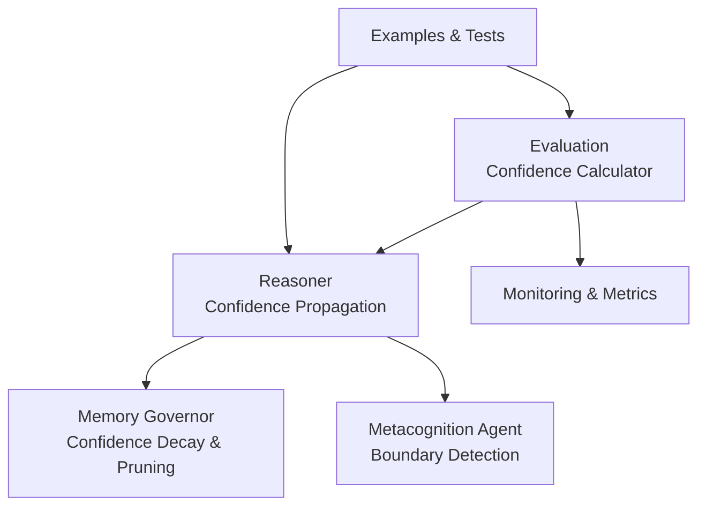
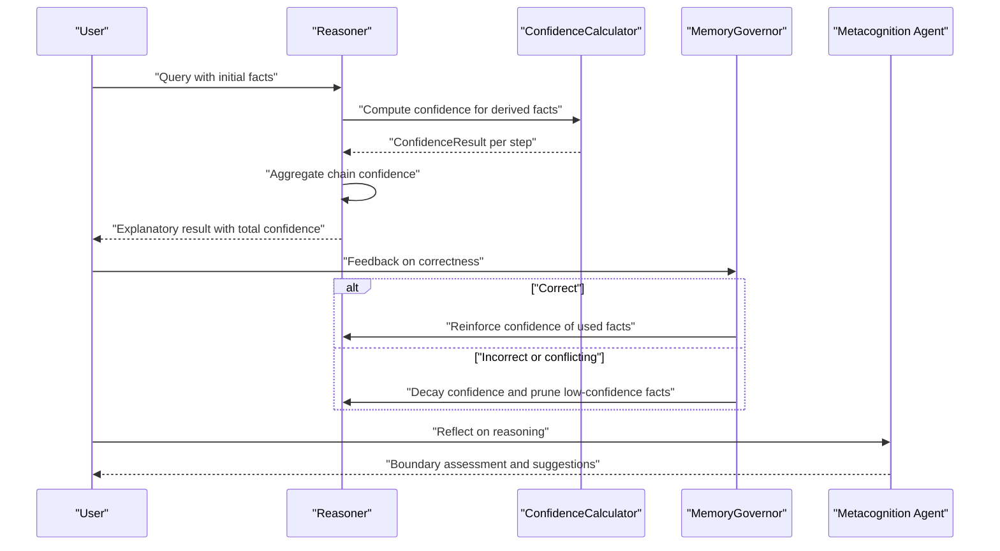
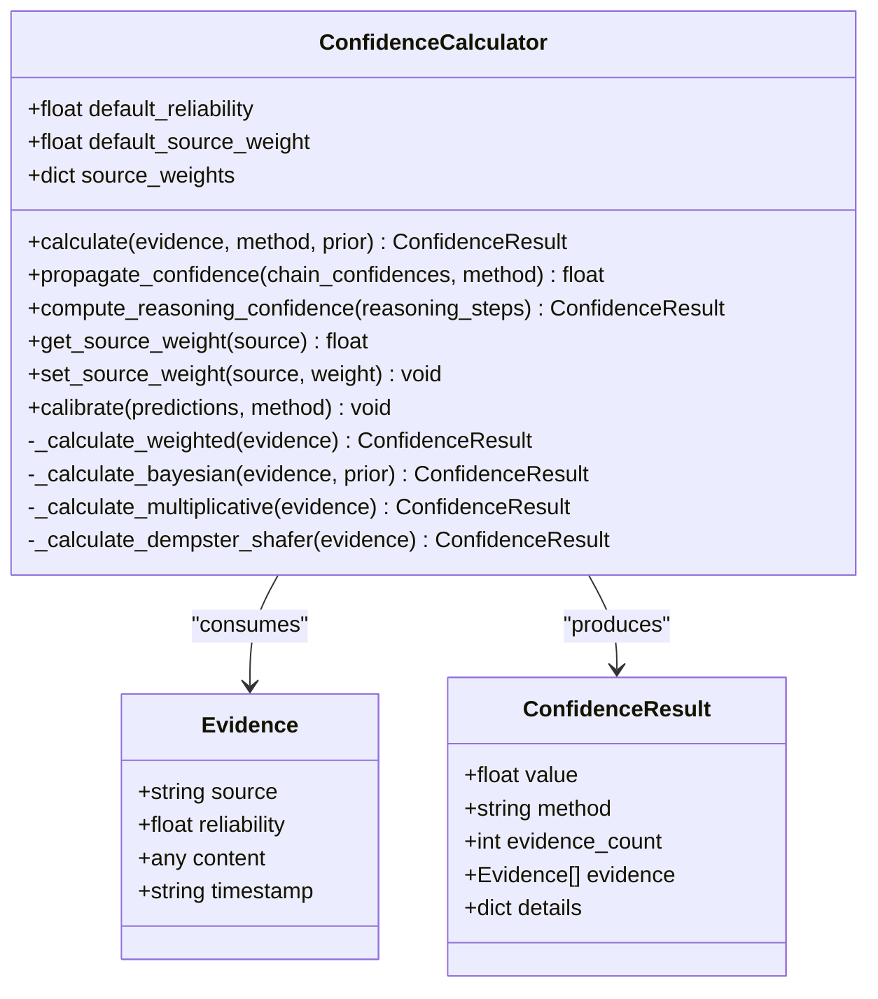
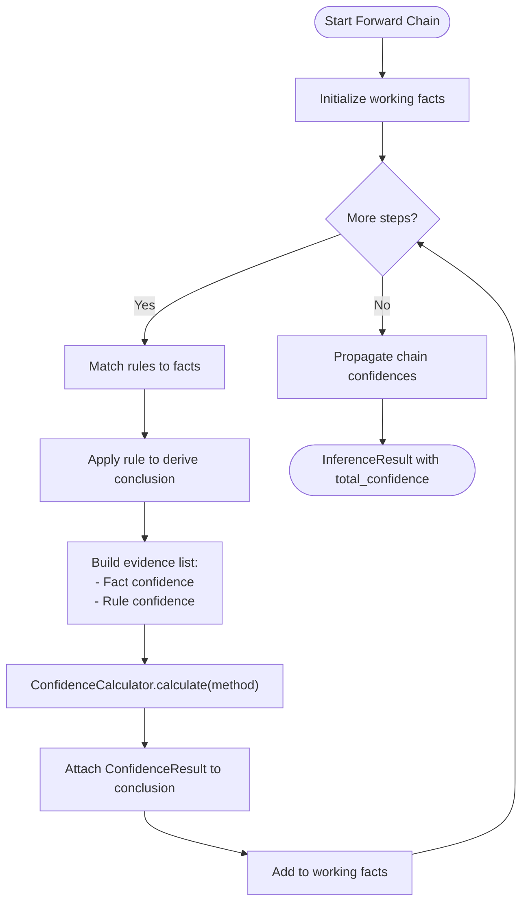
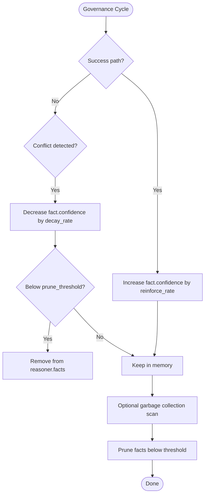
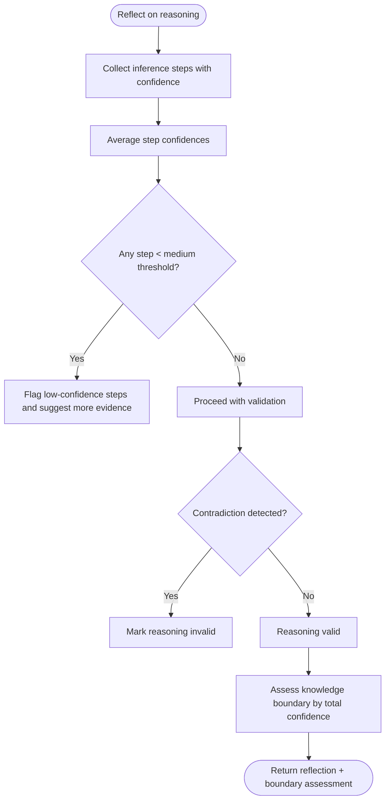
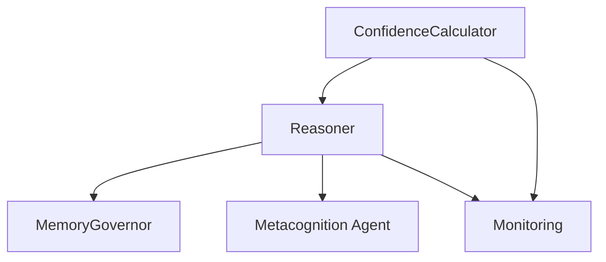

# Confidence and Uncertainty Management

<cite>
**Referenced Files in This Document**
- [confidence.py](file://src/eval/confidence.py)
- [__init__.py](file://src/eval/__init__.py)
- [test_confidence.py](file://tests/test_confidence.py)
- [demo_confidence_reasoning.py](file://examples/demo_confidence_reasoning.py)
- [governance.py](file://src/memory/governance.py)
- [metacognition.py](file://src/agents/metacognition.py)
- [reasoner.py](file://src/core/reasoner.py)
- [monitoring.py](file://src/eval/monitoring.py)
</cite>

## Table of Contents
1. [Introduction](#introduction)
2. [Project Structure](#project-structure)
3. [Core Components](#core-components)
4. [Architecture Overview](#architecture-overview)
5. [Detailed Component Analysis](#detailed-component-analysis)
6. [Dependency Analysis](#dependency-analysis)
7. [Performance Considerations](#performance-considerations)
8. [Troubleshooting Guide](#troubleshooting-guide)
9. [Conclusion](#conclusion)
10. [Appendices](#appendices)

## Introduction
This document explains the confidence and uncertainty management system implemented in the platform. It covers confidence calculation algorithms, uncertainty propagation mathematics, evidence aggregation mechanisms, integration with reasoning results, and confidence-aware decision-making. It also documents the relationship between confidence levels and memory storage decisions, the mathematical foundations of confidence propagation through logical chains, and the impact of contradictory evidence. Finally, it provides guidelines for interpreting confidence scores and making decisions under uncertainty, along with calibration techniques and common challenges.

## Project Structure
The confidence and uncertainty management spans several modules:
- Evaluation and confidence computation: src/eval/confidence.py
- Reasoning engine with confidence propagation: src/core/reasoner.py
- Memory governance integrating confidence decay and pruning: src/memory/governance.py
- Metacognition agent for self-assessment and knowledge boundary detection: src/agents/metacognition.py
- Monitoring and metrics: src/eval/monitoring.py
- Examples and tests validating behavior: examples/demo_confidence_reasoning.py, tests/test_confidence.py

**Diagram sources**
- [confidence.py:32-334](file://src/eval/confidence.py#L32-L334)
- [reasoner.py:145-349](file://src/core/reasoner.py#L145-L349)
- [governance.py:6-62](file://src/memory/governance.py#L6-L62)
- [metacognition.py:8-204](file://src/agents/metacognition.py#L8-L204)
- [monitoring.py:20-110](file://src/eval/monitoring.py#L20-L110)

**Section sources**
- [confidence.py:1-407](file://src/eval/confidence.py#L1-L407)
- [reasoner.py:1-819](file://src/core/reasoner.py#L1-L819)
- [governance.py:1-62](file://src/memory/governance.py#L1-L62)
- [metacognition.py:1-204](file://src/agents/metacognition.py#L1-L204)
- [monitoring.py:1-356](file://src/eval/monitoring.py#L1-L356)

## Core Components
- ConfidenceCalculator: Provides multiple methods to compute confidence from evidence, propagate confidence along reasoning chains, and calibrate predictions.
- Reasoner: Integrates confidence computation into forward/backward chaining, attaching confidence values to derived facts and computing overall confidence.
- MemoryGovernor: Applies confidence-based reinforcement and pruning to long-term memory, aligning retention with confidence dynamics.
- Metacognition Agent: Assesses knowledge boundaries using confidence thresholds and reflects on reasoning quality.
- Monitoring: Exposes metrics and health checks to monitor system performance and reliability.

**Section sources**
- [confidence.py:32-334](file://src/eval/confidence.py#L32-L334)
- [reasoner.py:145-349](file://src/core/reasoner.py#L145-L349)
- [governance.py:6-62](file://src/memory/governance.py#L6-L62)
- [metacognition.py:136-204](file://src/agents/metacognition.py#L136-L204)
- [monitoring.py:20-110](file://src/eval/monitoring.py#L20-L110)

## Architecture Overview
The system integrates confidence computation into the reasoning pipeline and enforces governance policies based on confidence dynamics. Evidence from facts and rules is aggregated using configurable methods, then propagated through logical chains. MemoryGovernor applies reinforcement and pruning based on confidence outcomes, while Metacognition Agent evaluates whether queries fall within the knowledge boundary.

**Diagram sources**
- [reasoner.py:243-349](file://src/core/reasoner.py#L243-L349)
- [confidence.py:100-170](file://src/eval/confidence.py#L100-L170)
- [governance.py:20-62](file://src/memory/governance.py#L20-L62)
- [metacognition.py:136-204](file://src/agents/metacognition.py#L136-L204)

## Detailed Component Analysis

### ConfidenceCalculator
- Evidence model: source, reliability [0,1], content, timestamp.
- ConfidenceResult model: value [0,1], method, evidence_count, evidence list, details dict.
- Methods:
  - weighted: average of reliability weighted by source weights.
  - bayesian: likelihood ratio update from reliability values with prior.
  - multiplicative: synthesis via complement product.
  - dempster_shafer: mass function combination with “unknown” handling.
- Chain propagation: min, arithmetic mean, geometric mean, multiplicative.
- Reasoning chain confidence: minimum of premise and rule confidences per step, then propagated via chosen method.
- Calibration: platt and isotonic placeholders for future extension.

**Diagram sources**
- [confidence.py:13-334](file://src/eval/confidence.py#L13-L334)

**Section sources**
- [confidence.py:13-334](file://src/eval/confidence.py#L13-L334)
- [__init__.py:1-12](file://src/eval/__init__.py#L1-L12)

### Reasoner Integration
- Forward chain: builds inference steps, computes confidence per step by combining fact confidence and rule confidence, then propagates chain confidence using the configured method.
- Backward chain: mirrors forward with similar confidence aggregation.
- ConfidenceResult attached to each inference step and overall result.

**Diagram sources**
- [reasoner.py:243-349](file://src/core/reasoner.py#L243-L349)
- [confidence.py:100-170](file://src/eval/confidence.py#L100-L170)

**Section sources**
- [reasoner.py:243-349](file://src/core/reasoner.py#L243-L349)
- [confidence.py:100-170](file://src/eval/confidence.py#L100-L170)

### MemoryGovernor
- Reinforce path: increase confidence of facts used successfully.
- Penalize conflict: decrease confidence of facts causing conflicts; prune below threshold.
- Garbage collection: remove low-confidence facts from the reasoner’s working memory.

**Diagram sources**
- [governance.py:20-62](file://src/memory/governance.py#L20-L62)

**Section sources**
- [governance.py:6-62](file://src/memory/governance.py#L6-L62)

### Metacognition Agent
- Reflect: validates reasoning steps by averaging step confidences and flagging low-confidence steps.
- Knowledge boundary: categorizes confidence into high/medium/low/unknown with recommendations.
- Calibration helper: provides a Bayesian-inspired calibration function to adjust confidence by evidence count and quality.

**Diagram sources**
- [metacognition.py:23-172](file://src/agents/metacognition.py#L23-L172)

**Section sources**
- [metacognition.py:136-204](file://src/agents/metacognition.py#L136-L204)

### Examples and Tests
- Examples demonstrate multi-source evidence fusion, conflicting evidence handling, business scenarios, and automatic learning via source weight updates.
- Tests validate Evidence/EvidenceResult structures, weighted and multiplicative calculations, and source weight management.

**Section sources**
- [demo_confidence_reasoning.py:1-185](file://examples/demo_confidence_reasoning.py#L1-L185)
- [test_confidence.py:1-70](file://tests/test_confidence.py#L1-L70)

## Dependency Analysis
- ConfidenceCalculator is imported and used by Reasoner to compute and propagate confidence during inference.
- MemoryGovernor interacts with Reasoner’s facts to enforce confidence-based retention policies.
- Metacognition Agent consumes Reasoner outputs to assess confidence and knowledge boundaries.
- Monitoring exposes metrics and health checks for operational oversight.

**Diagram sources**
- [reasoner.py:34-74](file://src/core/reasoner.py#L34-L74)
- [governance.py:13-18](file://src/memory/governance.py#L13-L18)
- [metacognition.py:1-204](file://src/agents/metacognition.py#L1-L204)
- [monitoring.py:20-110](file://src/eval/monitoring.py#L20-L110)

**Section sources**
- [reasoner.py:34-74](file://src/core/reasoner.py#L34-L74)
- [governance.py:13-18](file://src/memory/governance.py#L13-L18)
- [metacognition.py:1-204](file://src/agents/metacognition.py#L1-L204)
- [monitoring.py:20-110](file://src/eval/monitoring.py#L20-L110)

## Performance Considerations
- Confidence computation complexity:
  - Weighted average: O(n) over evidence count.
  - Multiplicative synthesis: O(n).
  - Bayes update: O(n) with ratio accumulation.
  - Dempster-Shafer: exponential in number of propositions; use judiciously.
- Chain propagation:
  - Min propagation: O(n).
  - Geometric mean: O(n) with exponentiation; consider numerical stability.
- Reasoner inference:
  - Forward/backward chains iterate over facts and rules; circuit breakers prevent unbounded expansion.
- MemoryGovernor:
  - Reinforcement/penalty per fact; pruning scans current fact set; keep prune_threshold tuned to avoid excessive churn.

[No sources needed since this section provides general guidance]

## Troubleshooting Guide
- Symptom: Zero or near-zero confidence despite multiple evidences.
  - Cause: Weights sum to zero or all reliabilities are low.
  - Action: Verify source weights and reliability values; ensure default weights are set appropriately.
- Symptom: Confidence does not improve with more evidence.
  - Cause: Diminishing returns or quality factor limiting gains.
  - Action: Improve evidence quality or adjust calibration parameters.
- Symptom: Contradictory evidence leads to unexpected drops.
  - Cause: Conservative propagation (min) or Dempster-Shafer combining unknown mass.
  - Action: Switch to arithmetic/geometric propagation or review evidence reliability.
- Symptom: Memory retains low-confidence facts.
  - Cause: Prune threshold too high or insufficient penalties.
  - Action: Lower prune_threshold or increase decay_rate; trigger garbage collection.

**Section sources**
- [confidence.py:100-170](file://src/eval/confidence.py#L100-L170)
- [governance.py:16-18](file://src/memory/governance.py#L16-L18)
- [reasoner.py:243-349](file://src/core/reasoner.py#L243-L349)

## Conclusion
The platform implements a robust confidence and uncertainty management system that:
- Aggregates evidence using multiple mathematically grounded methods.
- Propagates confidence through logical chains with conservative defaults.
- Integrates feedback loops to reinforce correct reasoning and prune unreliable knowledge.
- Empowers decision-making via explicit confidence scores and knowledge boundary assessments.
Future enhancements can include calibrated confidence outputs, richer uncertainty modeling, and adaptive propagation strategies.

[No sources needed since this section summarizes without analyzing specific files]

## Appendices

### Mathematical Foundations and Algorithms
- Weighted average: combines reliability values with source-specific weights; total weight normalizes contribution.
- Multiplicative synthesis: aggregates confidence as 1 − ∏(1 − c_i), emphasizing agreement among evidences.
- Bayes update: transforms prior odds by likelihood ratios derived from reliability values.
- Dempster-Shafer: assigns belief masses to propositions and combines them via canonical fusion rules; often yields “unknown” when conflict exists.
- Chain propagation:
  - Min: most conservative; ensures worst-case bound.
  - Arithmetic/geometric: balanced estimates; geometric mean favors caution.
  - Multiplicative: cumulative decay; useful for strict conjunctions.

**Section sources**
- [confidence.py:100-220](file://src/eval/confidence.py#L100-L220)

### Quality Assessment Metrics and Calibration
- Metrics collection: counters, gauges, and histograms for request latency, inference duration, and throughput.
- Health checks: centralized health status reporting across components.
- Calibration: placeholders for Platt and isotonic regression; intended to map predicted confidence to calibrated reliability.

**Section sources**
- [monitoring.py:20-110](file://src/eval/monitoring.py#L20-L110)
- [monitoring.py:118-168](file://src/eval/monitoring.py#L118-L168)
- [monitoring.py:180-216](file://src/eval/monitoring.py#L180-L216)
- [confidence.py:307-333](file://src/eval/confidence.py#L307-L333)

### Guidelines for Interpreting Confidence Scores and Decision-Making
- High confidence (> 0.85): Reliable conclusion; suitable for automated actions.
- Medium confidence (~0.60–0.85): Proceed with caution; consider verification for critical decisions.
- Low confidence (< 0.60): Knowledge boundary approached; seek additional evidence or expert input.
- Unknown: Outside knowledge boundary; defer to human expertise.
- Memory storage decisions:
  - Retain high-confidence facts; periodically prune low-confidence ones.
  - Reinforce facts consistently used in correct reasoning paths.

**Section sources**
- [metacognition.py:136-172](file://src/agents/metacognition.py#L136-L172)
- [governance.py:16-18](file://src/memory/governance.py#L16-L18)
- [governance.py:47-62](file://src/memory/governance.py#L47-L62)