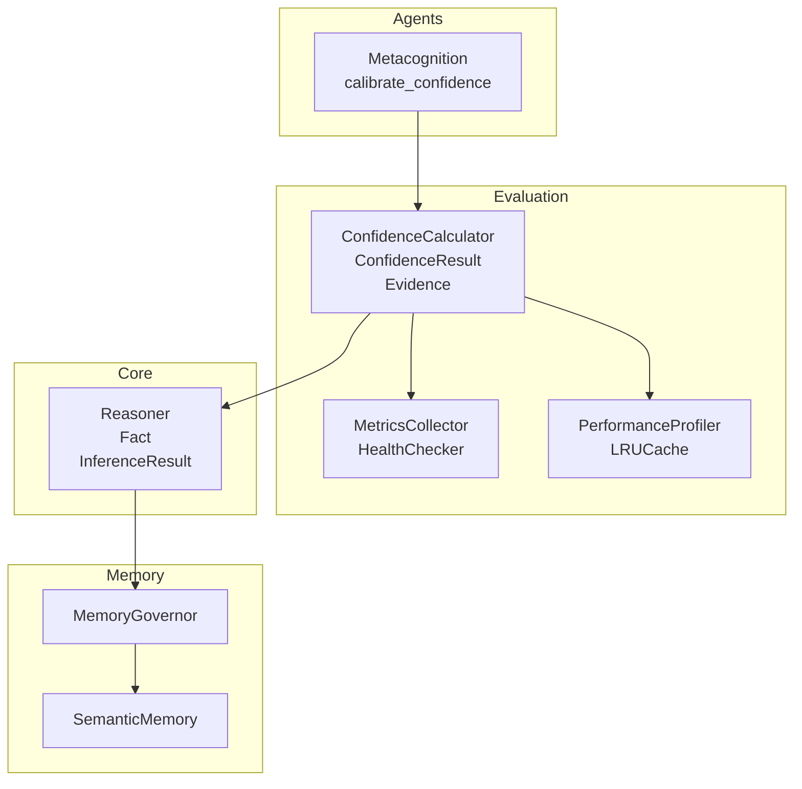
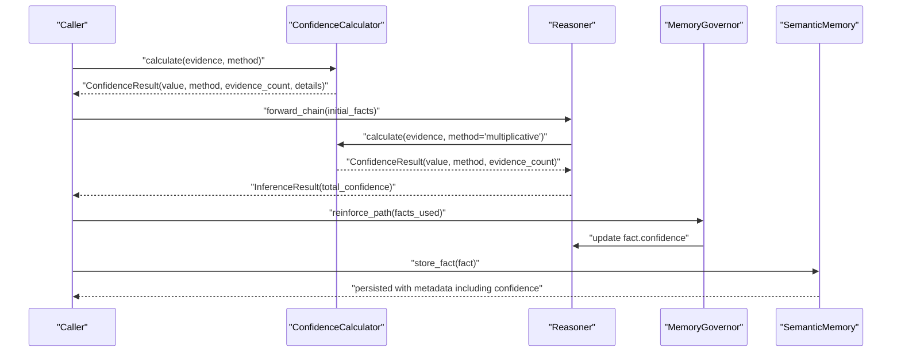
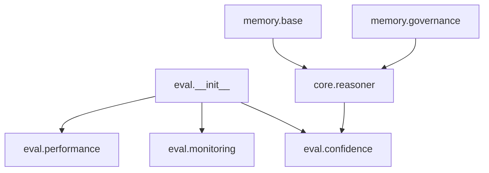

# Uncertainty Metrics and Quality Assessment

<cite>
**Referenced Files in This Document**
- [confidence.py](file://src/eval/confidence.py)
- [performance.py](file://src/eval/performance.py)
- [monitoring.py](file://src/eval/monitoring.py)
- [__init__.py](file://src/eval/__init__.py)
- [governance.py](file://src/memory/governance.py)
- [base.py](file://src/memory/base.py)
- [reasoner.py](file://src/core/reasoner.py)
- [metacognition.py](file://src/agents/metacognition.py)
- [test_confidence.py](file://tests/test_confidence.py)
- [test_evidence.py](file://tests/test_evidence.py)
- [demo_confidence_reasoning.py](file://examples/demo_confidence_reasoning.py)
</cite>

## Table of Contents
1. [Introduction](#introduction)
2. [Project Structure](#project-structure)
3. [Core Components](#core-components)
4. [Architecture Overview](#architecture-overview)
5. [Detailed Component Analysis](#detailed-component-analysis)
6. [Dependency Analysis](#dependency-analysis)
7. [Performance Considerations](#performance-considerations)
8. [Troubleshooting Guide](#troubleshooting-guide)
9. [Conclusion](#conclusion)
10. [Appendices](#appendices)

## Introduction
This document describes the uncertainty quantification and quality assessment systems in the platform. It focuses on the ConfidenceResult data structure, evidence tracking mechanisms, and confidence score interpretation guidelines. It explains how uncertainty metrics are computed and used for decision-making, documents performance evaluation methods, confidence calibration techniques, and quality assurance processes. It also covers integration with system performance monitoring, the relationship between confidence scores and memory storage decisions, and practical guidance for interpreting confidence values, setting operational thresholds, and handling edge cases with high uncertainty.

## Project Structure
The uncertainty and quality assessment capabilities are primarily implemented in the evaluation module and integrated with memory governance and reasoning engines:
- Evaluation module: confidence computation, calibration, monitoring, and performance utilities
- Memory governance: confidence-driven pruning and reinforcement
- Reasoning engine: integrates confidence propagation across inference steps
- Agents: metacognitive calibration of confidence
- Examples and tests: demonstrate usage and validate behavior

**Diagram sources**
- [confidence.py:13-334](file://src/eval/confidence.py#L13-L334)
- [monitoring.py:20-110](file://src/eval/monitoring.py#L20-L110)
- [performance.py:25-101](file://src/eval/performance.py#L25-L101)
- [reasoner.py:145-350](file://src/core/reasoner.py#L145-L350)
- [governance.py:6-62](file://src/memory/governance.py#L6-L62)
- [base.py:91-120](file://src/memory/base.py#L91-L120)
- [metacognition.py:175-203](file://src/agents/metacognition.py#L175-L203)

**Section sources**
- [__init__.py:1-12](file://src/eval/__init__.py#L1-L12)
- [confidence.py:1-407](file://src/eval/confidence.py#L1-L407)
- [monitoring.py:1-356](file://src/eval/monitoring.py#L1-L356)
- [performance.py:1-538](file://src/eval/performance.py#L1-L538)
- [reasoner.py:1-819](file://src/core/reasoner.py#L1-L819)
- [governance.py:1-62](file://src/memory/governance.py#L1-L62)
- [base.py:1-249](file://src/memory/base.py#L1-L249)
- [metacognition.py:173-203](file://src/agents/metacognition.py#L173-L203)

## Core Components
- ConfidenceResult: encapsulates a scalar confidence score, the method used, evidence count, the list of Evidence objects, and optional details (e.g., totals, mass functions).
- Evidence: captures a single piece of supporting data with source, reliability, content, and optional timestamp.
- ConfidenceCalculator: provides multiple methods to compute confidence from Evidence, supports propagation along inference chains, and includes placeholders for calibration.
- Reasoner: constructs ConfidenceResult for each inference step and aggregates overall confidence across the chain.
- MemoryGovernor: applies confidence-based reinforcement and pruning to facts in the reasoning graph.
- Monitoring and Performance: expose metrics, health checks, and performance snapshots to assess system reliability and throughput.

Key implementation references:
- ConfidenceResult and Evidence: [confidence.py:13-30](file://src/eval/confidence.py#L13-L30)
- ConfidenceCalculator methods: [confidence.py:32-334](file://src/eval/confidence.py#L32-L334)
- Reasoner integration and propagation: [reasoner.py:294-349](file://src/core/reasoner.py#L294-L349)
- MemoryGovernor confidence updates and pruning: [governance.py:20-62](file://src/memory/governance.py#L20-L62)
- Monitoring and metrics: [monitoring.py:20-110](file://src/eval/monitoring.py#L20-L110)
- Performance utilities: [performance.py:25-101](file://src/eval/performance.py#L25-L101)

**Section sources**
- [confidence.py:13-334](file://src/eval/confidence.py#L13-L334)
- [reasoner.py:294-349](file://src/core/reasoner.py#L294-L349)
- [governance.py:20-62](file://src/memory/governance.py#L20-L62)
- [monitoring.py:20-110](file://src/eval/monitoring.py#L20-L110)
- [performance.py:25-101](file://src/eval/performance.py#L25-L101)

## Architecture Overview
The system computes confidence from Evidence, propagates it through reasoning steps, and uses confidence to drive memory governance and operational decisions. Monitoring and performance utilities provide observability for reliability and throughput.

**Diagram sources**
- [confidence.py:63-99](file://src/eval/confidence.py#L63-L99)
- [reasoner.py:294-349](file://src/core/reasoner.py#L294-L349)
- [governance.py:20-46](file://src/memory/governance.py#L20-L46)
- [base.py:91-110](file://src/memory/base.py#L91-L110)

## Detailed Component Analysis

### ConfidenceResult and Evidence Data Structures
- ConfidenceResult: carries the final confidence score, the method used, number of evidences, the Evidence list itself, and optional details (e.g., totals or mass functions).
- Evidence: holds source, reliability, content, and timestamp.

Usage highlights:
- ConfidenceResult is returned by ConfidenceCalculator.calculate and by Reasoner inference steps.
- Evidence is constructed from sources and reliability values and passed to calculators.

References:
- [confidence.py:13-30](file://src/eval/confidence.py#L13-L30)
- [confidence.py:63-99](file://src/eval/confidence.py#L63-L99)
- [reasoner.py:294-308](file://src/core/reasoner.py#L294-L308)

**Section sources**
- [confidence.py:13-30](file://src/eval/confidence.py#L13-L30)
- [confidence.py:63-99](file://src/eval/confidence.py#L63-L99)
- [reasoner.py:294-308](file://src/core/reasoner.py#L294-L308)

### Confidence Computation Methods
- Weighted average: combines reliability values with source weights; sensitive to source trustworthiness.
- Multiplicative synthesis: aggregates evidence via product-based combination; conservative aggregation.
- Bayes-like update: uses likelihood ratios to update a prior; suitable when reliability can be interpreted as likelihood.
- Dempster–Shafer: supports unknown/uncertain hypotheses and belief mass combination.

References:
- [confidence.py:100-220](file://src/eval/confidence.py#L100-L220)

**Section sources**
- [confidence.py:100-220](file://src/eval/confidence.py#L100-L220)

### Confidence Propagation and Reasoning Chain Aggregation
- propagate_confidence supports min, arithmetic mean, geometric mean, and multiplicative propagation.
- Reasoner computes per-step confidence from premise and rule confidences and aggregates using min propagation.

References:
- [confidence.py:222-259](file://src/eval/confidence.py#L222-L259)
- [reasoner.py:294-349](file://src/core/reasoner.py#L294-L349)

**Section sources**
- [confidence.py:222-259](file://src/eval/confidence.py#L222-L259)
- [reasoner.py:294-349](file://src/core/reasoner.py#L294-L349)

### Calibration Techniques
- ConfidenceCalculator exposes a calibrate interface with platt and isotonic placeholders for future integration with probabilistic calibration libraries.
- Metacognition provides a Bayesian-inspired calibration function that adjusts confidence based on evidence count and quality.

References:
- [confidence.py:307-333](file://src/eval/confidence.py#L307-L333)
- [metacognition.py:175-203](file://src/agents/metacognition.py#L175-L203)

**Section sources**
- [confidence.py:307-333](file://src/eval/confidence.py#L307-L333)
- [metacognition.py:175-203](file://src/agents/metacognition.py#L175-L203)

### Evidence Tracking Mechanisms
- Evidence objects are collected per inference step and included in ConfidenceResult.
- Reasoner composes Evidence from facts and rules to compute per-step confidence.
- Tests validate evidence creation, counts, and multi-source aggregation.

References:
- [confidence.py:13-30](file://src/eval/confidence.py#L13-L30)
- [reasoner.py:294-308](file://src/core/reasoner.py#L294-L308)
- [test_confidence.py:11-37](file://tests/test_confidence.py#L11-L37)
- [test_evidence.py:12-45](file://tests/test_evidence.py#L12-L45)

**Section sources**
- [confidence.py:13-30](file://src/eval/confidence.py#L13-L30)
- [reasoner.py:294-308](file://src/core/reasoner.py#L294-L308)
- [test_confidence.py:11-37](file://tests/test_confidence.py#L11-L37)
- [test_evidence.py:12-45](file://tests/test_evidence.py#L12-L45)

### Confidence Interpretation Guidelines
- High confidence indicates strong, corroborated evidence and/or high-quality sources; suitable for automated actions.
- Medium confidence suggests mixed or moderate-quality evidence; consider human review or additional checks.
- Low confidence signals weak or conflicting evidence; avoid automated decisions and require further investigation.
- Unknown/uncertain states (via Dempster–Shafer) indicate lack of sufficient discrimination; treat conservatively.

References:
- [confidence.py:100-220](file://src/eval/confidence.py#L100-L220)
- [demo_confidence_reasoning.py:22-90](file://examples/demo_confidence_reasoning.py#L22-L90)

**Section sources**
- [confidence.py:100-220](file://src/eval/confidence.py#L100-L220)
- [demo_confidence_reasoning.py:22-90](file://examples/demo_confidence_reasoning.py#L22-L90)

### Decision-Making Based on Confidence
- Operational thresholds:
  - ≥ 0.9: Fully trusted; enable automatic execution.
  - 0.7–0.9: Generally reliable; enable semi-automated execution with alerts.
  - 0.5–0.7: Caution advised; require human review.
  - < 0.5: Do not act; escalate for verification.
- Confidence propagation: use min propagation to remain conservative across reasoning steps.

References:
- [confidence.py:222-259](file://src/eval/confidence.py#L222-L259)
- [reasoner.py:332-349](file://src/core/reasoner.py#L332-L349)
- [demo_confidence_reasoning.py:92-123](file://examples/demo_confidence_reasoning.py#L92-L123)

**Section sources**
- [confidence.py:222-259](file://src/eval/confidence.py#L222-L259)
- [reasoner.py:332-349](file://src/core/reasoner.py#L332-L349)
- [demo_confidence_reasoning.py:92-123](file://examples/demo_confidence_reasoning.py#L92-L123)

### Edge Cases and Robustness
- No evidence: returns zero confidence.
- Empty inference chain: returns zero confidence.
- Contradictory evidence: weighted/multiplicative methods reduce aggregated confidence; Dempster–Shafer naturally handles unknowns.
- Source weight adjustments: dynamic re-weighting allows learning from feedback.

References:
- [confidence.py:82-98](file://src/eval/confidence.py#L82-L98)
- [confidence.py:100-170](file://src/eval/confidence.py#L100-L170)
- [test_evidence.py:12-27](file://tests/test_evidence.py#L12-L27)

**Section sources**
- [confidence.py:82-98](file://src/eval/confidence.py#L82-L98)
- [confidence.py:100-170](file://src/eval/confidence.py#L100-L170)
- [test_evidence.py:12-27](file://tests/test_evidence.py#L12-L27)

### Relationship Between Confidence and Memory Storage Decisions
- MemoryGovernor reinforces confident facts and prunes those below a threshold, aligning long-term memory with reliability.
- SemanticMemory stores facts and passes confidence to vector metadata for retrieval and export.
- Confidence influences whether a fact is retained, reinforced, or removed during governance cycles.

References:
- [governance.py:20-62](file://src/memory/governance.py#L20-L62)
- [base.py:91-120](file://src/memory/base.py#L91-L120)

**Section sources**
- [governance.py:20-62](file://src/memory/governance.py#L20-L62)
- [base.py:91-120](file://src/memory/base.py#L91-L120)

### Quality Assurance Processes
- Unit tests validate Evidence creation, ConfidenceResult structure, multi-source aggregation, and source weight behavior.
- Example demonstrations showcase realistic scenarios and highlight the impact of evidence quality and conflicts.

References:
- [test_confidence.py:11-61](file://tests/test_confidence.py#L11-L61)
- [test_evidence.py:12-75](file://tests/test_evidence.py#L12-L75)
- [demo_confidence_reasoning.py:1-185](file://examples/demo_confidence_reasoning.py#L1-L185)

**Section sources**
- [test_confidence.py:11-61](file://tests/test_confidence.py#L11-L61)
- [test_evidence.py:12-75](file://tests/test_evidence.py#L12-L75)
- [demo_confidence_reasoning.py:1-185](file://examples/demo_confidence_reasoning.py#L1-L185)

## Dependency Analysis
The evaluation module exports core types for external use. The reasoning engine depends on the confidence module for per-step confidence computation. Memory governance and semantic memory integrate confidence into persistence and pruning.

**Diagram sources**
- [__init__.py:1-12](file://src/eval/__init__.py#L1-L12)
- [confidence.py:1-407](file://src/eval/confidence.py#L1-L407)
- [monitoring.py:1-356](file://src/eval/monitoring.py#L1-L356)
- [performance.py:1-538](file://src/eval/performance.py#L1-L538)
- [reasoner.py:1-819](file://src/core/reasoner.py#L1-L819)
- [governance.py:1-62](file://src/memory/governance.py#L1-L62)
- [base.py:1-249](file://src/memory/base.py#L1-L249)

**Section sources**
- [__init__.py:1-12](file://src/eval/__init__.py#L1-L12)
- [confidence.py:1-407](file://src/eval/confidence.py#L1-L407)
- [monitoring.py:1-356](file://src/eval/monitoring.py#L1-L356)
- [performance.py:1-538](file://src/eval/performance.py#L1-L538)
- [reasoner.py:1-819](file://src/core/reasoner.py#L1-L819)
- [governance.py:1-62](file://src/memory/governance.py#L1-L62)
- [base.py:1-249](file://src/memory/base.py#L1-L249)

## Performance Considerations
- Caching: LRUCache with TTL and thread-safety reduces repeated computations and I/O.
- Connection pooling: generic pool configuration improves throughput for external services.
- Async batching: limits concurrency and processes items in batches to avoid overload.
- Profiling: PerformanceProfiler records function timings for hotspots.
- Monitoring: MetricsCollector and PerformanceMonitor expose latency, throughput, and health signals.

Operational guidance:
- Tune cache TTL and max size based on workload characteristics.
- Adjust pool sizes according to backend capacity and latency targets.
- Use async batching to smooth bursty loads.
- Track request latencies and cache hit rates to detect regressions.

References:
- [performance.py:25-101](file://src/eval/performance.py#L25-L101)
- [performance.py:182-263](file://src/eval/performance.py#L182-L263)
- [performance.py:290-320](file://src/eval/performance.py#L290-L320)
- [performance.py:388-463](file://src/eval/performance.py#L388-L463)
- [monitoring.py:20-110](file://src/eval/monitoring.py#L20-L110)
- [monitoring.py:312-353](file://src/eval/monitoring.py#L312-L353)

**Section sources**
- [performance.py:25-101](file://src/eval/performance.py#L25-L101)
- [performance.py:182-263](file://src/eval/performance.py#L182-L263)
- [performance.py:290-320](file://src/eval/performance.py#L290-L320)
- [performance.py:388-463](file://src/eval/performance.py#L388-L463)
- [monitoring.py:20-110](file://src/eval/monitoring.py#L20-L110)
- [monitoring.py:312-353](file://src/eval/monitoring.py#L312-L353)

## Troubleshooting Guide
Common issues and remedies:
- Zero or unexpected confidence:
  - Verify evidence list is non-empty and reliability values are in [0, 1].
  - Check method selection and propagation settings.
- Confident but incorrect outcomes:
  - Investigate source weights and rule confidences; adjust via set_source_weight and rule confidence.
  - Use Dempster–Shafer to capture uncertainty when evidence is conflicting.
- Slow inference:
  - Enable profiling to identify bottlenecks.
  - Increase cache TTL or size; tune connection pool and batch sizes.
- Memory bloat:
  - Run governance garbage collection to prune low-confidence facts.
  - Review prune threshold and decay rate.

References:
- [confidence.py:82-98](file://src/eval/confidence.py#L82-L98)
- [confidence.py:222-259](file://src/eval/confidence.py#L222-L259)
- [governance.py:47-62](file://src/memory/governance.py#L47-L62)
- [performance.py:388-463](file://src/eval/performance.py#L388-L463)

**Section sources**
- [confidence.py:82-98](file://src/eval/confidence.py#L82-L98)
- [confidence.py:222-259](file://src/eval/confidence.py#L222-L259)
- [governance.py:47-62](file://src/memory/governance.py#L47-L62)
- [performance.py:388-463](file://src/eval/performance.py#L388-L463)

## Conclusion
The platform’s uncertainty quantification system provides robust, interpretable confidence scores grounded in Evidence and multiple aggregation methods. Confidence drives decision-making thresholds, reasoning chain propagation, and memory governance. Monitoring and performance utilities ensure reliability and scalability. Calibration hooks and metacognitive adjustments support continuous improvement. Together, these components form a comprehensive framework for quality assurance and dependable operation under uncertainty.

## Appendices

### Confidence Score Interpretation Reference
- ≥ 0.9: Fully trusted
- 0.7–0.9: Generally reliable
- 0.5–0.7: Caution advised
- < 0.5: Do not act

References:
- [demo_confidence_reasoning.py:92-123](file://examples/demo_confidence_reasoning.py#L92-L123)

**Section sources**
- [demo_confidence_reasoning.py:92-123](file://examples/demo_confidence_reasoning.py#L92-L123)