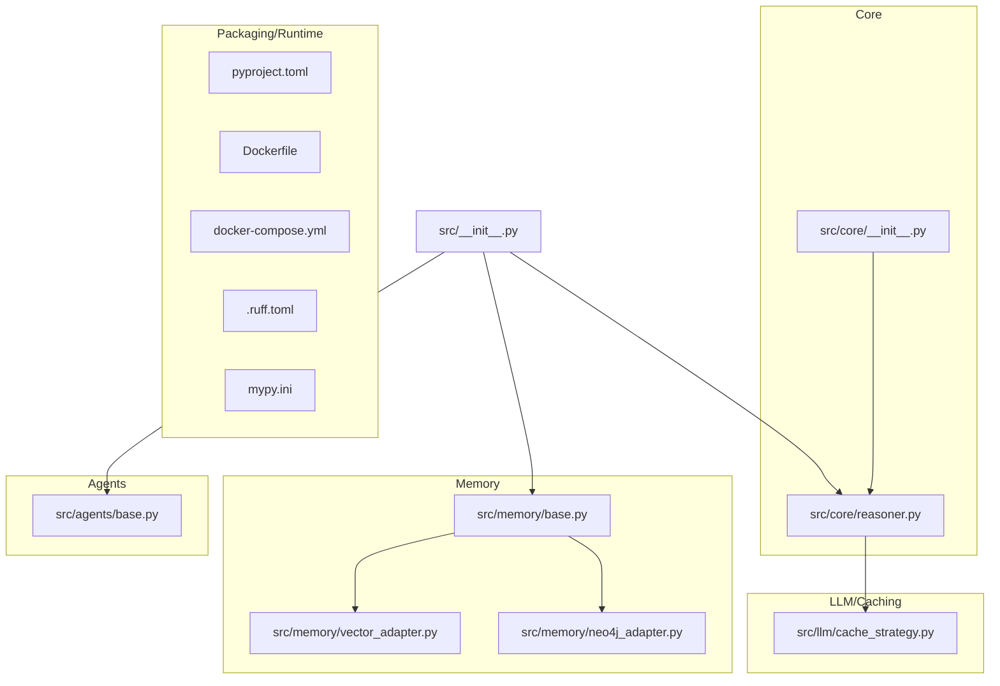
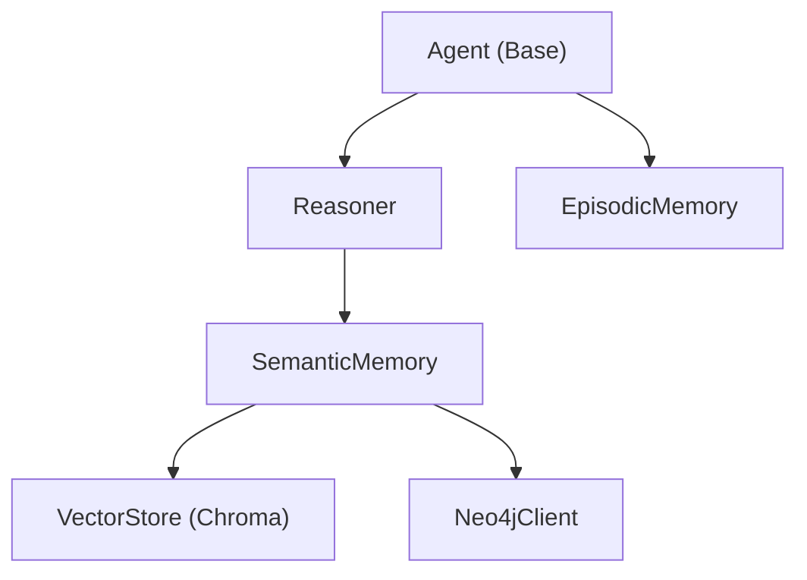
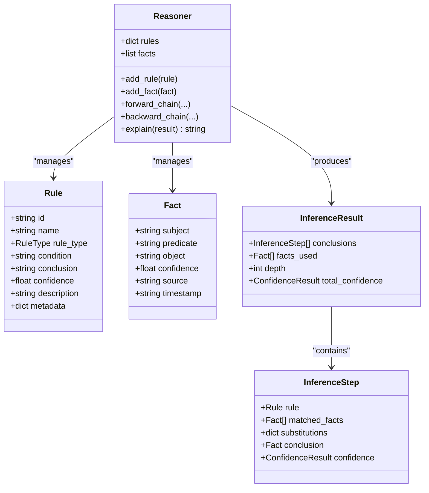
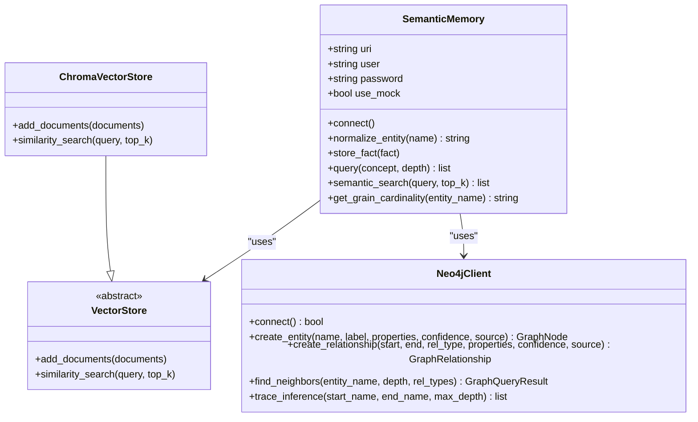
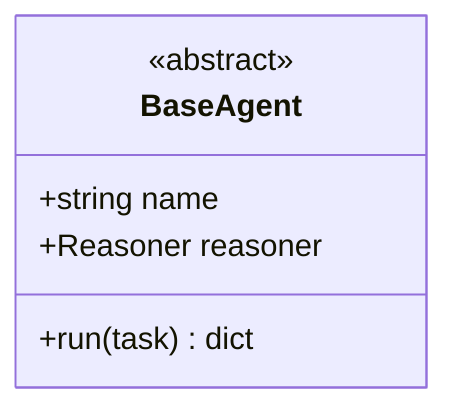
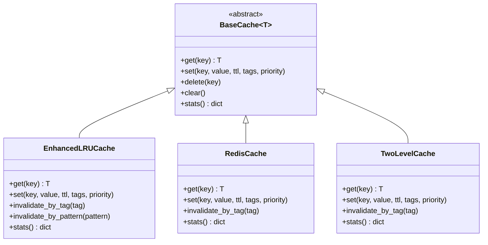
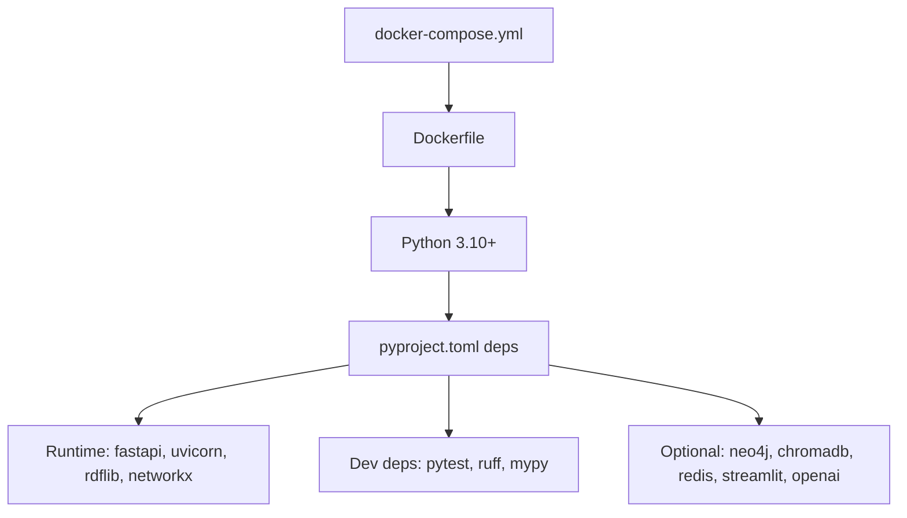
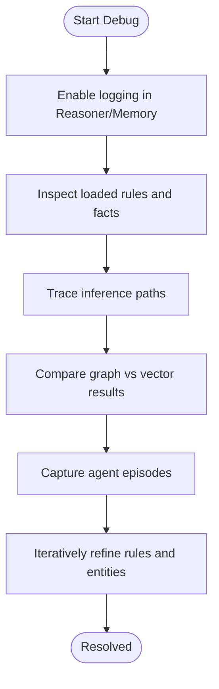

# Contributing and Development

<cite>
**Referenced Files in This Document**
- [CONTRIBUTING.md](file://docs/CONTRIBUTING.md)
- [.github/PULL_REQUEST_TEMPLATE.md](file://.github/PULL_REQUEST_TEMPLATE.md)
- [pyproject.toml](file://pyproject.toml)
- [Dockerfile](file://Dockerfile)
- [docker-compose.yml](file://docker-compose.yml)
- [.ruff.toml](file://.ruff.toml)
- [mypy.ini](file://mypy.ini)
- [requirements.txt](file://requirements.txt)
- [src/__init__.py](file://src/__init__.py)
- [src/core/__init__.py](file://src/core/__init__.py)
- [src/core/reasoner.py](file://src/core/reasoner.py)
- [src/memory/base.py](file://src/memory/base.py)
- [src/memory/vector_adapter.py](file://src/memory/vector_adapter.py)
- [src/memory/neo4j_adapter.py](file://src/memory/neo4j_adapter.py)
- [src/llm/cache_strategy.py](file://src/llm/cache_strategy.py)
- [src/agents/base.py](file://src/agents/base.py)
</cite>

## Table of Contents
1. [Introduction](#introduction)
2. [Project Structure](#project-structure)
3. [Core Components](#core-components)
4. [Architecture Overview](#architecture-overview)
5. [Detailed Component Analysis](#detailed-component-analysis)
6. [Dependency Analysis](#dependency-analysis)
7. [Performance Considerations](#performance-considerations)
8. [Troubleshooting Guide](#troubleshooting-guide)
9. [Contribution Workflow and Review Requirements](#contribution-workflow-and-review-requirements)
10. [Testing Requirements](#testing-requirements)
11. [Documentation Standards](#documentation-standards)
12. [Release Procedures](#release-procedures)
13. [Debugging Complex Neuro-Symbolic Reasoning](#debugging-complex-neuro-symbolic-reasoning)
14. [Conclusion](#conclusion)

## Introduction
This document provides comprehensive guidance for contributing to the project and maintaining high-quality code. It covers development environment setup, coding standards enforced by Ruff and MyPy, contribution workflow, pull request process, code review requirements, architectural principles, testing expectations, documentation standards, release procedures, and practical guidance for debugging complex neuro-symbolic reasoning and performance optimization.

## Project Structure
The repository is organized around a modular Python package layout with clear separation of concerns:
- Core reasoning engine and ontology utilities under src/core
- Memory subsystems (semantic and episodic) under src/memory
- Agent framework under src/agents
- LLM and caching infrastructure under src/llm
- Example applications and demos under examples
- Tests under tests
- Documentation under docs
- CI/CD and linting configurations under .github, .ruff.toml, mypy.ini
- Packaging and runtime under pyproject.toml, Dockerfile, docker-compose.yml

**Diagram sources**
- [src/core/reasoner.py:1-819](file://src/core/reasoner.py#L1-L819)
- [src/memory/base.py:1-249](file://src/memory/base.py#L1-L249)
- [src/memory/vector_adapter.py:1-91](file://src/memory/vector_adapter.py#L1-L91)
- [src/memory/neo4j_adapter.py:1-974](file://src/memory/neo4j_adapter.py#L1-L974)
- [src/agents/base.py:1-20](file://src/agents/base.py#L1-L20)
- [src/core/__init__.py:1-20](file://src/core/__init__.py#L1-L20)
- [src/__init__.py:1-18](file://src/__init__.py#L1-L18)
- [pyproject.toml:1-74](file://pyproject.toml#L1-L74)
- [Dockerfile:1-33](file://Dockerfile#L1-L33)
- [docker-compose.yml:1-91](file://docker-compose.yml#L1-L91)
- [.ruff.toml:1-17](file://.ruff.toml#L1-L17)
- [mypy.ini:1-8](file://mypy.ini#L1-L8)

**Section sources**
- [pyproject.toml:1-74](file://pyproject.toml#L1-L74)
- [Dockerfile:1-33](file://Dockerfile#L1-L33)
- [docker-compose.yml:1-91](file://docker-compose.yml#L1-L91)
- [src/__init__.py:1-18](file://src/__init__.py#L1-L18)
- [src/core/__init__.py:1-20](file://src/core/__init__.py#L1-L20)

## Core Components
- Reasoner: Implements forward/backward/bidirectional rule-based inference with confidence propagation and circuit breaker timeouts.
- Memory: Provides hybrid semantic memory (Neo4j + ChromaDB) and episodic memory persistence.
- Agents: Defines a base agent interface for task execution.
- LLM Caching: Advanced caching strategies with LRU/LFU/FIFO/TTL/Adaptive policies, Redis support, and two-level caching.

Key responsibilities:
- Reasoner: Manage rules, facts, inference steps, and confidence aggregation.
- Memory: Connect to graph/vector stores, normalize entities, and provide hybrid retrieval.
- Agents: Encapsulate task execution logic with a Reasoner dependency.
- Caching: Provide flexible cache strategies with tagging, invalidation, and statistics.

**Section sources**
- [src/core/reasoner.py:145-819](file://src/core/reasoner.py#L145-L819)
- [src/memory/base.py:9-249](file://src/memory/base.py#L9-L249)
- [src/memory/vector_adapter.py:19-91](file://src/memory/vector_adapter.py#L19-L91)
- [src/memory/neo4j_adapter.py:130-974](file://src/memory/neo4j_adapter.py#L130-L974)
- [src/agents/base.py:8-20](file://src/agents/base.py#L8-L20)
- [src/llm/cache_strategy.py:88-751](file://src/llm/cache_strategy.py#L88-L751)

## Architecture Overview
The system integrates a neuro-symbolic reasoning engine with memory and agent orchestration:
- Reasoner drives inference using rules and facts, with confidence propagation.
- Memory subsystem persists and retrieves knowledge via graph and vector stores.
- Agents coordinate tasks and leverage the Reasoner for symbolic reasoning.
- Caching strategies optimize repeated computations and LLM interactions.

**Diagram sources**
- [src/agents/base.py:8-20](file://src/agents/base.py#L8-L20)
- [src/core/reasoner.py:145-819](file://src/core/reasoner.py#L145-L819)
- [src/memory/base.py:9-249](file://src/memory/base.py#L9-L249)
- [src/memory/vector_adapter.py:19-91](file://src/memory/vector_adapter.py#L19-L91)
- [src/memory/neo4j_adapter.py:130-974](file://src/memory/neo4j_adapter.py#L130-L974)

## Detailed Component Analysis

### Reasoner Engine
The Reasoner implements:
- Rule types: if-then, equivalence, transitive, symmetric, inverse
- Inference directions: forward, backward, bidirectional
- Confidence calculator fallback when evaluation module is unavailable
- Circuit breaker timeouts to prevent runaway inference
- Pattern matching and rule application with variable substitution

**Diagram sources**
- [src/core/reasoner.py:77-143](file://src/core/reasoner.py#L77-L143)
- [src/core/reasoner.py:145-819](file://src/core/reasoner.py#L145-L819)

**Section sources**
- [src/core/reasoner.py:145-819](file://src/core/reasoner.py#L145-L819)

### Memory Subsystem
SemanticMemory coordinates:
- Neo4j graph client for persistent knowledge
- ChromaDB vector store for semantic similarity
- Entity normalization for synonym alignment
- Hybrid retrieval combining graph traversal and vector search

**Diagram sources**
- [src/memory/base.py:9-249](file://src/memory/base.py#L9-L249)
- [src/memory/vector_adapter.py:19-91](file://src/memory/vector_adapter.py#L19-L91)
- [src/memory/neo4j_adapter.py:130-974](file://src/memory/neo4j_adapter.py#L130-L974)

**Section sources**
- [src/memory/base.py:9-249](file://src/memory/base.py#L9-L249)
- [src/memory/vector_adapter.py:1-91](file://src/memory/vector_adapter.py#L1-L91)
- [src/memory/neo4j_adapter.py:1-974](file://src/memory/neo4j_adapter.py#L1-L974)

### Agent Framework
BaseAgent defines a minimal interface for agents to implement task execution with a Reasoner dependency.

**Diagram sources**
- [src/agents/base.py:8-20](file://src/agents/base.py#L8-L20)

**Section sources**
- [src/agents/base.py:1-20](file://src/agents/base.py#L1-L20)

### Caching Strategies
Enhanced cache implementations support:
- LRU, LFU, FIFO, TTL, and adaptive strategies
- Tag-based invalidation and pattern-based eviction
- Two-level cache with in-memory L1 and optional Redis L2
- Decorators for transparent caching of synchronous and asynchronous functions

**Diagram sources**
- [src/llm/cache_strategy.py:88-751](file://src/llm/cache_strategy.py#L88-L751)

**Section sources**
- [src/llm/cache_strategy.py:1-751](file://src/llm/cache_strategy.py#L1-L751)

## Dependency Analysis
External dependencies and optional integrations:
- Core: rdflib, owlrl, networkx, fastapi, uvicorn, pydantic, pyyaml, requests
- Dev/test/lint: pytest, pytest-asyncio, httpx, ruff, mypy
- Optional: neo4j, chromadb, redis, streamlit, openai

Runtime and packaging:
- Python 3.10+ supported; project configured for 3.10 target in linting
- Docker image builds with Python 3.11 slim, installs system libs and application code
- docker-compose orchestrates API, Ollama, GraphDB, and Redis

**Diagram sources**
- [pyproject.toml:28-49](file://pyproject.toml#L28-L49)
- [requirements.txt:1-18](file://requirements.txt#L1-L18)
- [Dockerfile:1-33](file://Dockerfile#L1-L33)
- [docker-compose.yml:1-91](file://docker-compose.yml#L1-L91)

**Section sources**
- [pyproject.toml:1-74](file://pyproject.toml#L1-L74)
- [requirements.txt:1-18](file://requirements.txt#L1-L18)
- [Dockerfile:1-33](file://Dockerfile#L1-L33)
- [docker-compose.yml:1-91](file://docker-compose.yml#L1-L91)

## Performance Considerations
- Circuit breakers in inference prevent excessive computation time during forward/backward chains.
- Two-level caching reduces latency for repeated queries and inference results.
- Vector and graph hybrid memory balances semantic similarity with structured reasoning.
- Containerized deployment with GPU exposure for local LLM acceleration.

Recommendations:
- Tune inference timeouts and max depths per workload.
- Monitor cache hit rates and adjust TTL/tagging strategies.
- Use appropriate Neo4j indexing and relationship types for large graphs.
- Profile vector embedding costs and batch operations where possible.

**Section sources**
- [src/core/reasoner.py:243-438](file://src/core/reasoner.py#L243-L438)
- [src/llm/cache_strategy.py:424-534](file://src/llm/cache_strategy.py#L424-L534)
- [docker-compose.yml:35-44](file://docker-compose.yml#L35-L44)

## Troubleshooting Guide
Common issues and resolutions:
- Neo4j connectivity failures: Verify credentials, URI, and service availability; fallback to mock mode for development.
- Missing optional dependencies: Install neo4j, chromadb, redis as needed; code gracefully degrades when unavailable.
- Linting errors: Align with Ruff configuration; check ignored files and per-file exceptions.
- Type-checking warnings: Resolve missing imports or refine types; use typed stubs where necessary.

**Section sources**
- [src/memory/neo4j_adapter.py:176-200](file://src/memory/neo4j_adapter.py#L176-L200)
- [src/memory/base.py:22-28](file://src/memory/base.py#L22-L28)
- [.ruff.toml:10-16](file://.ruff.toml#L10-L16)
- [mypy.ini:1-8](file://mypy.ini#L1-L8)

## Contribution Workflow and Review Requirements
- Fork and branch: Create feature branches from main.
- Style compliance: Follow PEP 8; adhere to Ruff line length and selected rules; address per-file ignores intentionally.
- Type safety: Use MyPy; resolve missing imports and return-any warnings.
- Testing: Add unit tests for new features; ensure existing tests pass.
- Documentation: Update docstrings and inline comments; keep docs consistent.
- PR checklist: Self-review, comment hard-to-understand areas, add tests, ensure no new warnings, update changelog as needed.

Commit message convention:
- feat:, fix:, docs:, test:, refactor:

Review requirements:
- Maintainer approval
- Passing CI checks (tests, lint, type checks)
- Clear description and reproduction steps for bug fixes

**Section sources**
- [docs/CONTRIBUTING.md:48-73](file://docs/CONTRIBUTING.md#L48-L73)
- [.github/PULL_REQUEST_TEMPLATE.md:1-31](file://.github/PULL_REQUEST_TEMPLATE.md#L1-L31)
- [.ruff.toml:1-17](file://.ruff.toml#L1-L17)
- [mypy.ini:1-8](file://mypy.ini#L1-L8)

## Testing Requirements
- Unit tests: pytest with asyncio support; run via pytest tests/
- Test coverage: Aim for high coverage in reasoning, memory, and caching modules
- Integration tests: Validate hybrid memory operations and agent workflows
- Demo verification: Use example scripts to validate end-to-end scenarios

Run tests locally:
- Activate virtual environment
- Install dev dependencies
- Execute pytest tests/

**Section sources**
- [docs/CONTRIBUTING.md:11-23](file://docs/CONTRIBUTING.md#L11-L23)
- [pyproject.toml:40-46](file://pyproject.toml#L40-L46)

## Documentation Standards
- Inline documentation: Docstrings for public modules, classes, and functions
- Examples: Add usage examples in examples/ for new features
- Architecture: Keep docs/architecture.md updated with major changes
- Changelog: Maintain CHANGELOG updates per PR

**Section sources**
- [docs/CONTRIBUTING.md:38-47](file://docs/CONTRIBUTING.md#L38-L47)

## Release Procedures
- Version bump: Update project version in pyproject.toml
- Changelog: Summarize breaking changes, features, fixes
- Build: Use setuptools backend to build distribution
- Publish: Upload to PyPI or internal registry as applicable

**Section sources**
- [pyproject.toml:5-26](file://pyproject.toml#L5-L26)

## Debugging Complex Neuro-Symbolic Reasoning
Recommended approach:
- Enable logging in Reasoner and memory components
- Inspect inference steps and confidence propagation
- Validate rule conditions and variable substitutions
- Cross-check with graph queries and vector similarity results
- Use EpisodicMemory to capture decision traces for reflection

**Diagram sources**
- [src/core/reasoner.py:617-642](file://src/core/reasoner.py#L617-L642)
- [src/memory/base.py:111-120](file://src/memory/base.py#L111-L120)
- [src/memory/neo4j_adapter.py:599-709](file://src/memory/neo4j_adapter.py#L599-L709)

**Section sources**
- [src/core/reasoner.py:145-819](file://src/core/reasoner.py#L145-L819)
- [src/memory/base.py:9-249](file://src/memory/base.py#L9-L249)
- [src/memory/neo4j_adapter.py:130-974](file://src/memory/neo4j_adapter.py#L130-L974)

## Conclusion
This guide consolidates development practices, coding standards, and architectural patterns to support high-quality contributions. By following the outlined workflows, adhering to Ruff and MyPy enforcement, and leveraging the provided components, contributors can extend the reasoning engine, agent framework, and memory adapters while maintaining system stability and performance.