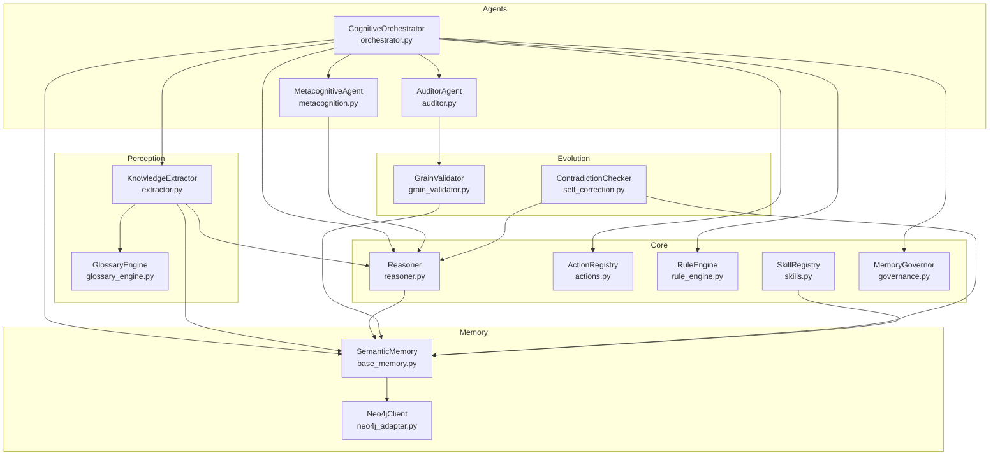
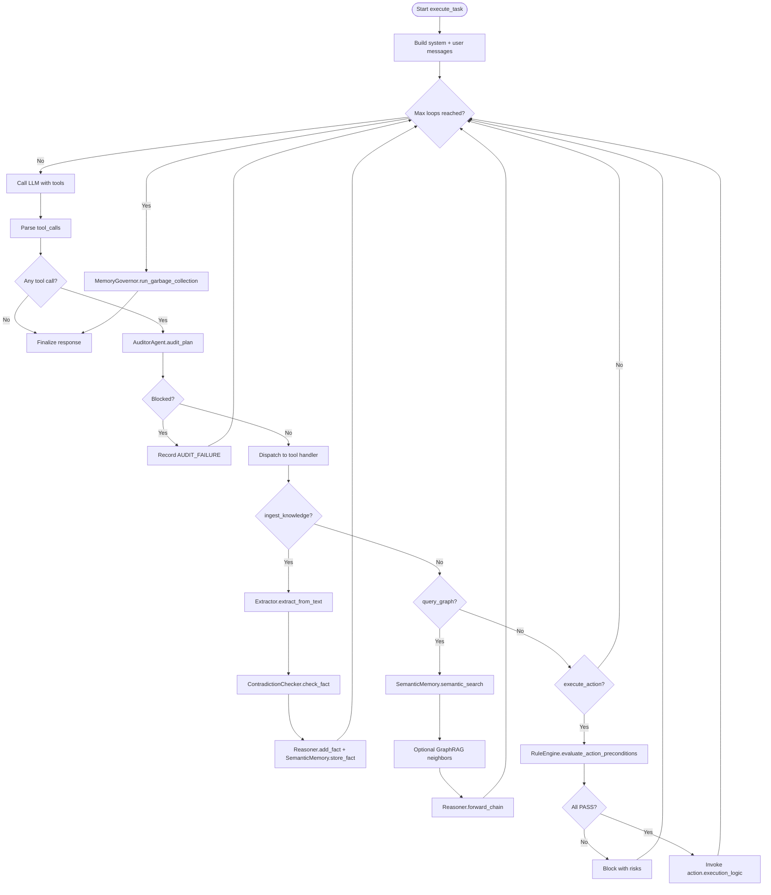
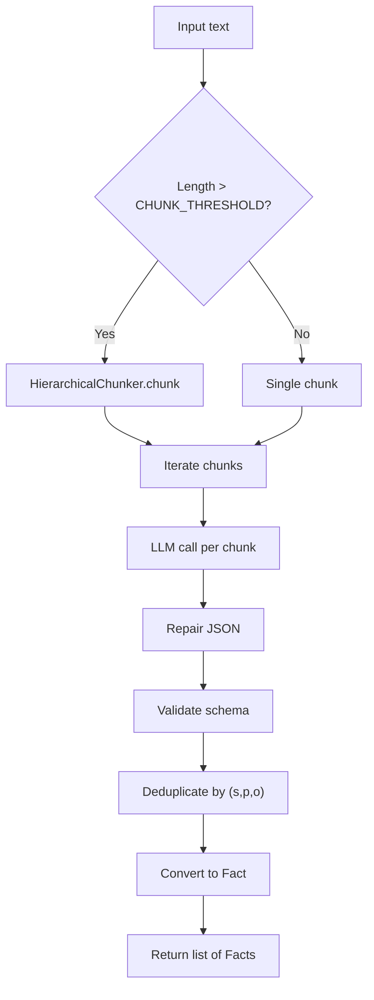
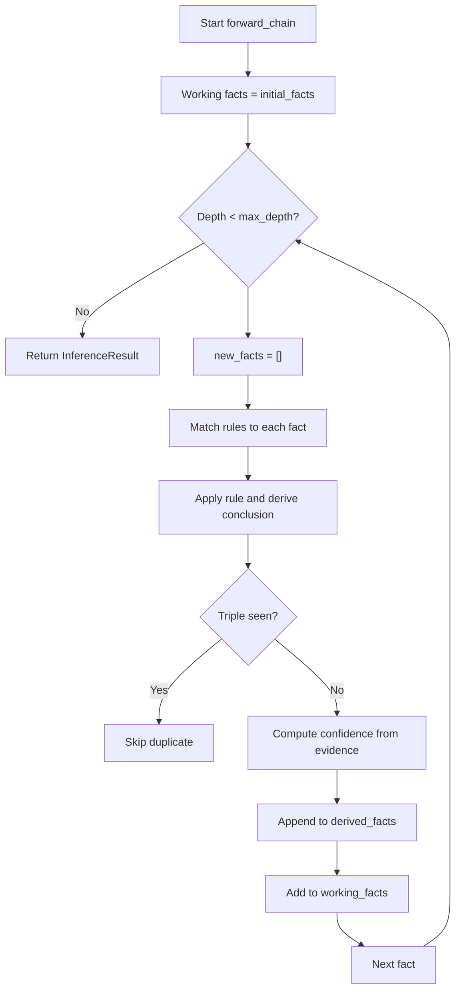
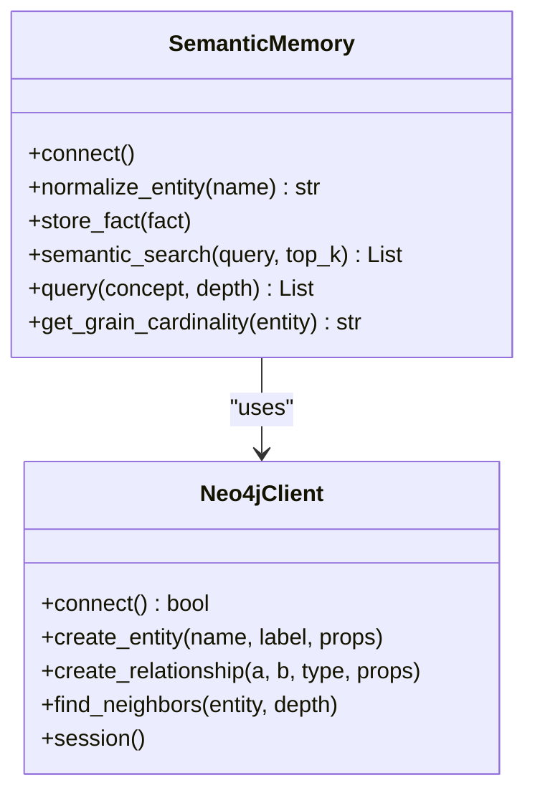
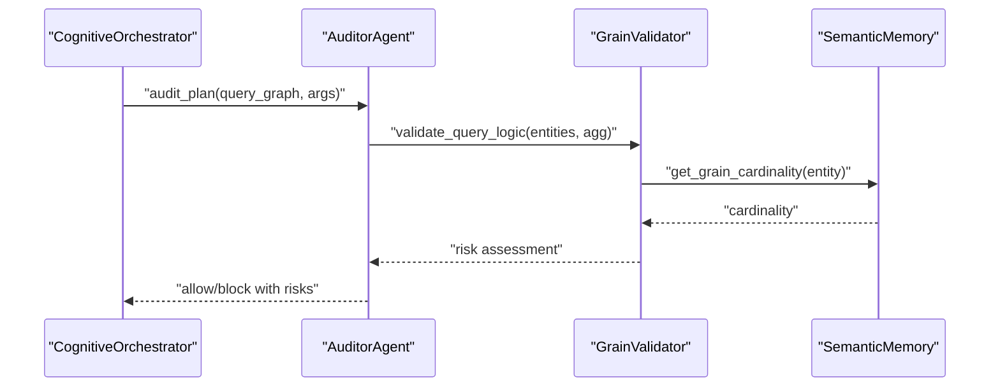
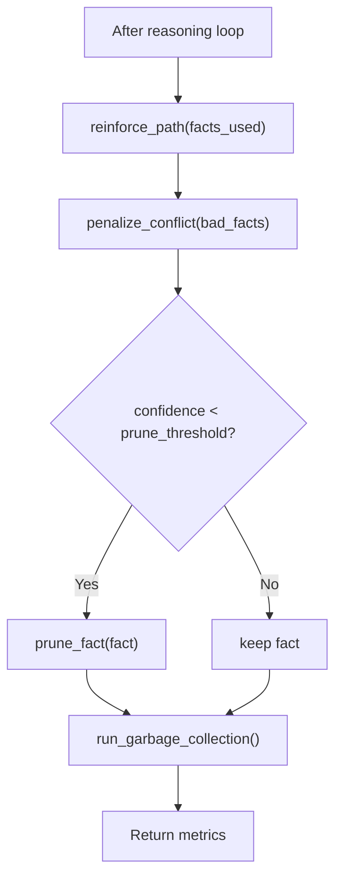
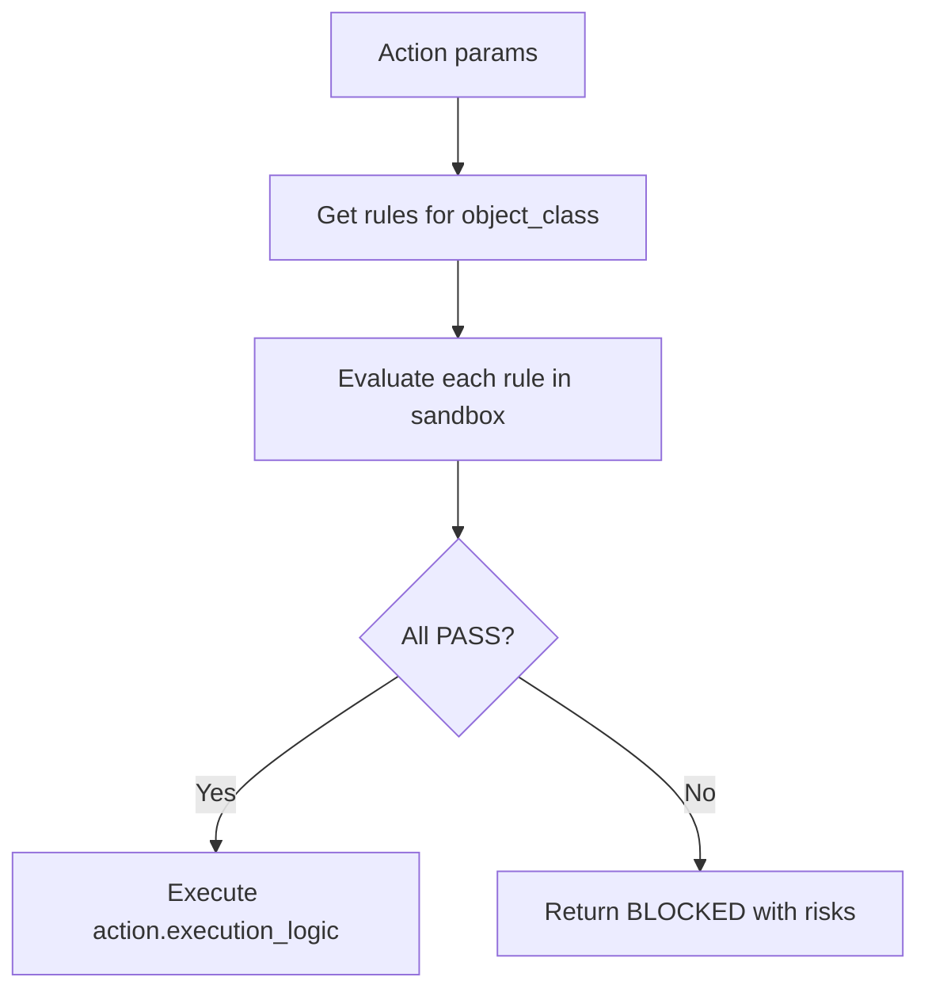
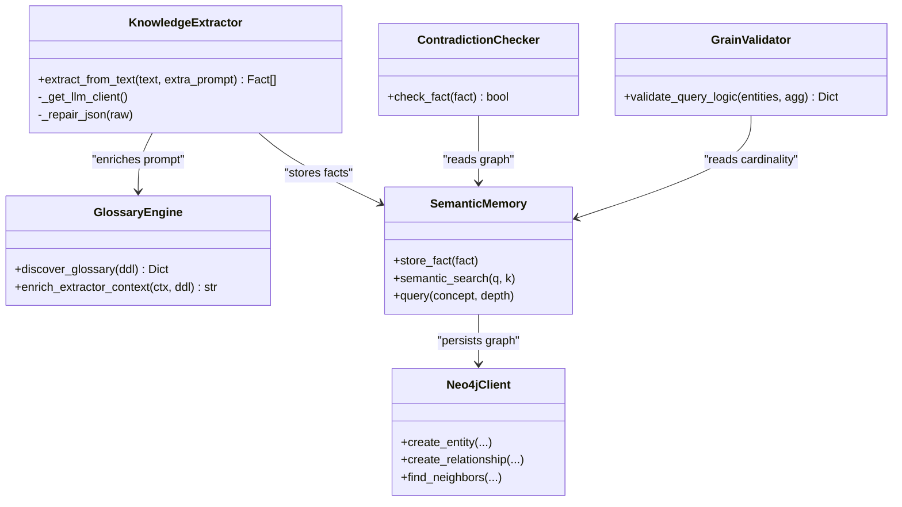
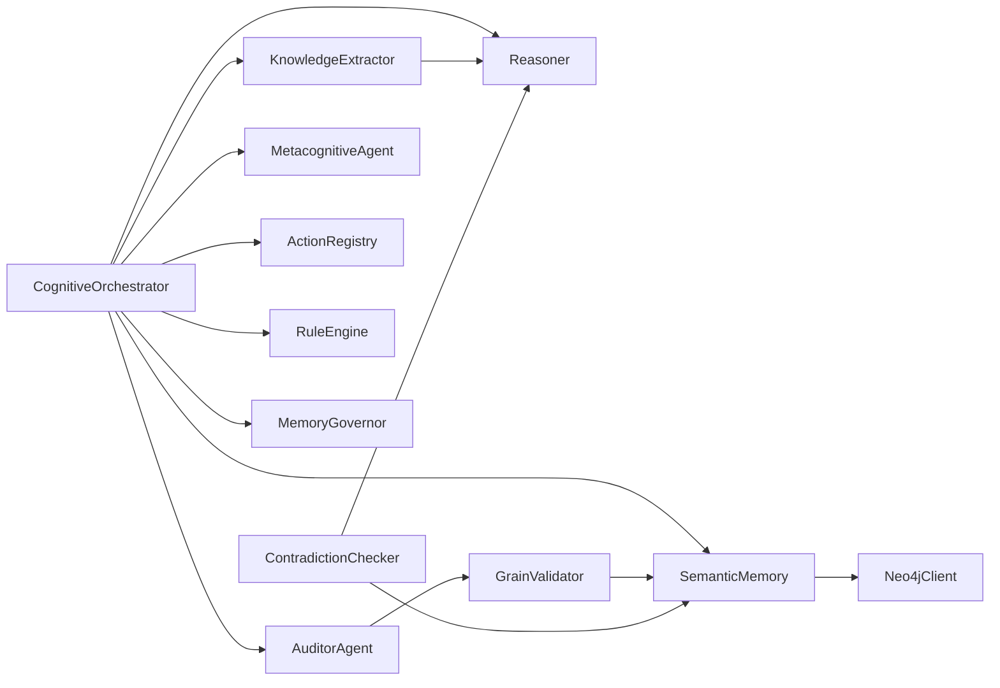

# Component Interactions

<cite>
**Referenced Files in This Document**
- [orchestrator.py](file://src/agents/orchestrator.py)
- [extractor.py](file://src/perception/extractor.py)
- [reasoner.py](file://src/core/reasoner.py)
- [base.py](file://src/agents/base.py)
- [metacognition.py](file://src/agents/metacognition.py)
- [auditor.py](file://src/agents/auditor.py)
- [skills.py](file://src/core/memory/skills.py)
- [actions.py](file://src/core/ontology/actions.py)
- [rule_engine.py](file://src/core/ontology/rule_engine.py)
- [governance.py](file://src/memory/governance.py)
- [glossary_engine.py](file://src/perception/glossary_engine.py)
- [grain_validator.py](file://src/core/ontology/grain_validator.py)
- [neo4j_adapter.py](file://src/memory/neo4j_adapter.py)
- [base_memory.py](file://src/memory/base.py)
- [self_correction.py](file://src/evolution/self_correction.py)
</cite>

## Table of Contents
1. [Introduction](#introduction)
2. [Project Structure](#project-structure)
3. [Core Components](#core-components)
4. [Architecture Overview](#architecture-overview)
5. [Detailed Component Analysis](#detailed-component-analysis)
6. [Dependency Analysis](#dependency-analysis)
7. [Performance Considerations](#performance-considerations)
8. [Troubleshooting Guide](#troubleshooting-guide)
9. [Conclusion](#conclusion)

## Introduction
This document explains the component interaction patterns within the Clawra architecture. It focuses on how KnowledgeExtractor, Reasoner, Memory systems, and Agents coordinate via message passing, event-driven interactions, and hybrid synchronous/asynchronous flows. It also documents the Orchestrator’s role in mediating workflows, the use of safety mechanisms such as auditing, rule gating, and circuit breaker patterns, and how adapters decouple components for pluggable integrations.

## Project Structure
The system is organized around modular layers:
- Perception: Knowledge extraction pipeline and glossary enrichment
- Core: Reasoner engine, rule engine, actions registry, and memory governance
- Memory: Semantic and episodic memory with graph/vector adapters
- Agents: Orchestrator, metacognition, and auditor agents
- Evolution: Contradiction checking and governance



**Diagram sources**
- [orchestrator.py:23-42](file://src/agents/orchestrator.py#L23-L42)
- [extractor.py:83-104](file://src/perception/extractor.py#L83-L104)
- [reasoner.py:145-180](file://src/core/reasoner.py#L145-L180)
- [base_memory.py:9-28](file://src/memory/base.py#L9-L28)
- [neo4j_adapter.py:130-178](file://src/memory/neo4j_adapter.py#L130-L178)
- [metacognition.py:8-16](file://src/agents/metacognition.py#L8-L16)
- [auditor.py:8-23](file://src/agents/auditor.py#L8-L23)
- [actions.py:24-28](file://src/core/ontology/actions.py#L24-L28)
- [rule_engine.py:124-139](file://src/core/ontology/rule_engine.py#L124-L139)
- [governance.py:6-19](file://src/memory/governance.py#L6-L19)
- [glossary_engine.py:9-29](file://src/perception/glossary_engine.py#L9-L29)
- [grain_validator.py:13-23](file://src/core/ontology/grain_validator.py#L13-L23)
- [self_correction.py:7-17](file://src/evolution/self_correction.py#L7-L17)

**Section sources**
- [orchestrator.py:23-42](file://src/agents/orchestrator.py#L23-L42)
- [extractor.py:83-104](file://src/perception/extractor.py#L83-L104)
- [reasoner.py:145-180](file://src/core/reasoner.py#L145-L180)
- [base_memory.py:9-28](file://src/memory/base.py#L9-L28)
- [neo4j_adapter.py:130-178](file://src/memory/neo4j_adapter.py#L130-L178)
- [metacognition.py:8-16](file://src/agents/metacognition.py#L8-L16)
- [auditor.py:8-23](file://src/agents/auditor.py#L8-L23)
- [actions.py:24-28](file://src/core/ontology/actions.py#L24-L28)
- [rule_engine.py:124-139](file://src/core/ontology/rule_engine.py#L124-L139)
- [governance.py:6-19](file://src/memory/governance.py#L6-L19)
- [glossary_engine.py:9-29](file://src/perception/glossary_engine.py#L9-L29)
- [grain_validator.py:13-23](file://src/core/ontology/grain_validator.py#L13-L23)
- [self_correction.py:7-17](file://src/evolution/self_correction.py#L7-L17)

## Core Components
- CognitiveOrchestrator: Central coordinator that manages tool plans, invokes KnowledgeExtractor, Reasoner, and Memory, and enforces auditing and rule gating.
- KnowledgeExtractor: Structured extraction from text with chunking, JSON repair, and optional mock mode.
- Reasoner: Forward/backward chaining with confidence propagation and built-in rules.
- SemanticMemory: Hybrid graph-vector memory with Neo4j and Chroma integration; supports normalization and graph traversal.
- Agents:
  - MetacognitiveAgent: Self-reflection, confidence calibration, and knowledge boundary checks.
  - AuditorAgent: Pre-execution audit for query logic and fan-trap risks.
- Governance: Memory pruning and reinforcement based on confidence thresholds.
- RuleEngine: Deterministic math sandbox for action precondition validation.
- Evolution: Contradiction checking and grain validation for semantic integrity.

**Section sources**
- [orchestrator.py:23-42](file://src/agents/orchestrator.py#L23-L42)
- [extractor.py:83-104](file://src/perception/extractor.py#L83-L104)
- [reasoner.py:145-180](file://src/core/reasoner.py#L145-L180)
- [base_memory.py:9-28](file://src/memory/base.py#L9-L28)
- [metacognition.py:8-16](file://src/agents/metacognition.py#L8-L16)
- [auditor.py:8-23](file://src/agents/auditor.py#L8-L23)
- [governance.py:6-19](file://src/memory/governance.py#L6-L19)
- [rule_engine.py:124-139](file://src/core/ontology/rule_engine.py#L124-L139)
- [self_correction.py:7-17](file://src/evolution/self_correction.py#L7-L17)

## Architecture Overview
The Orchestrator coordinates a ReAct-like loop:
- It receives user messages and builds a system prompt.
- It iteratively calls the LLM with tool definitions (ingest, query, execute).
- For each tool call, it performs:
  - Audit (AuditorAgent)
  - Extraction (KnowledgeExtractor) and contradiction checks (ContradictionChecker)
  - Reasoning (Reasoner) and optional GraphRAG injection from SemanticMemory
  - Rule gating (RuleEngine) for actions
  - Memory updates (SemanticMemory store)
  - Optional metacognition (MetacognitiveAgent) for reflective reasoning
- After the loop, it triggers memory governance (MemoryGovernor) for pruning and reinforcement.

```mermaid
sequenceDiagram
participant U as "User"
participant O as "CognitiveOrchestrator"
participant L as "LLM API"
participant EX as "KnowledgeExtractor"
participant RE as "Reasoner"
participant SM as "SemanticMemory"
participant AU as "AuditorAgent"
participant RL as "RuleEngine"
participant GO as "MemoryGovernor"
U->>O : "messages"
O->>L : "chat.completions.create(tools)"
L-->>O : "tool_calls"
loop For each tool_call
O->>AU : "audit_plan(name, args)"
AU-->>O : "status"
alt BLOCKED
O-->>U : "AUDIT_FAILURE"
else ALLOWED
alt ingest_knowledge
O->>EX : "extract_from_text(text)"
EX-->>O : "facts"
O->>RE : "add_fact(facts)"
O->>SM : "store_fact(facts)"
else query_graph
O->>SM : "semantic_search(query)"
SM-->>O : "vector_context"
O->>RE : "forward_chain()"
RE-->>O : "conclusions"
O->>SM : "find_neighbors(entity)"
SM-->>O : "graph_rag"
O->>RE : "inject inferred triples"
O->>RE : "forward_chain()"
else execute_action
O->>RL : "evaluate_action_preconditions(action_id, class, params)"
RL-->>O : "results"
alt PASS
O->>action.execution_logic(params)
else FAIL
O-->>U : "BLOCKED by math sandbox"
end
end
end
end
O->>GO : "run_garbage_collection()"
GO-->>O : "metrics"
O-->>U : "final response with trace"
```

**Diagram sources**
- [orchestrator.py:128-365](file://src/agents/orchestrator.py#L128-L365)
- [auditor.py:24-65](file://src/agents/auditor.py#L24-L65)
- [extractor.py:278-349](file://src/perception/extractor.py#L278-L349)
- [reasoner.py:243-349](file://src/core/reasoner.py#L243-L349)
- [base_memory.py:118-121](file://src/memory/base.py#L118-L121)
- [rule_engine.py:320-330](file://src/core/ontology/rule_engine.py#L320-L330)
- [governance.py:47-62](file://src/memory/governance.py#L47-L62)

## Detailed Component Analysis

### Orchestrator Mediation and Workflow Coordination
- Tool orchestration: The Orchestrator defines three tools and executes them in a loop with bounded retries and backoff.
- Audit-first policy: Each tool call is audited before execution to prevent unsafe or risky operations.
- GraphRAG fusion: For queries, it augments vector context with explicit graph neighbors and injects inferred facts into the Reasoner.
- Rule gating: Actions are validated against math rules before execution.
- Governance post-loop: Memory pruning and reinforcement improve long-term knowledge quality.



**Diagram sources**
- [orchestrator.py:128-365](file://src/agents/orchestrator.py#L128-L365)
- [auditor.py:24-65](file://src/agents/auditor.py#L24-L65)
- [extractor.py:278-349](file://src/perception/extractor.py#L278-L349)
- [self_correction.py:46-73](file://src/evolution/self_correction.py#L46-L73)
- [base_memory.py:118-121](file://src/memory/base.py#L118-L121)
- [reasoner.py:243-349](file://src/core/reasoner.py#L243-L349)
- [rule_engine.py:320-330](file://src/core/ontology/rule_engine.py#L320-L330)
- [governance.py:47-62](file://src/memory/governance.py#L47-L62)

**Section sources**
- [orchestrator.py:128-365](file://src/agents/orchestrator.py#L128-L365)

### KnowledgeExtractor: Structured Extraction Pipeline
- Chunking: Long texts are split using hierarchical chunking; fallbacks to paragraph and character-based splitting.
- LLM invocation: Calls the LLM with a constrained system prompt aligned to the domain ontology.
- JSON repair: Robust parser handles truncation and fences.
- Deduplication: Fact schemas are deduplicated by triple key before conversion to core Fact objects.
- Mock mode: Enables offline testing and development.



**Diagram sources**
- [extractor.py:278-349](file://src/perception/extractor.py#L278-L349)

**Section sources**
- [extractor.py:83-104](file://src/perception/extractor.py#L83-L104)
- [extractor.py:190-261](file://src/perception/extractor.py#L190-L261)
- [extractor.py:278-349](file://src/perception/extractor.py#L278-L349)

### Reasoner: Forward/Backward Chaining with Confidence
- Built-in rules: Transitivity and symmetry are registered automatically.
- Pattern matching: Rules match facts by predicate and variables.
- Confidence propagation: Evidence from facts and rules is combined to compute conclusion confidence.
- Circuit breaker: Timeouts terminate inference if exceeding limits to avoid long-running chains.



**Diagram sources**
- [reasoner.py:243-349](file://src/core/reasoner.py#L243-L349)

**Section sources**
- [reasoner.py:145-180](file://src/core/reasoner.py#L145-L180)
- [reasoner.py:243-349](file://src/core/reasoner.py#L243-L349)

### SemanticMemory: Hybrid Graph-Vector Memory
- Dual storage: Documents stored in Chroma; entities/relations in Neo4j via Neo4jClient.
- Normalization: Entity synonyms mapped to canonical terms to reduce drift.
- Graph traversal: Neighboring entities retrieved for GraphRAG augmentation.
- Grain cardinality: Heuristics and graph-backed lookup to detect fan-trap risks.



**Diagram sources**
- [base_memory.py:9-28](file://src/memory/base.py#L9-L28)
- [neo4j_adapter.py:130-178](file://src/memory/neo4j_adapter.py#L130-L178)

**Section sources**
- [base_memory.py:9-28](file://src/memory/base.py#L9-L28)
- [neo4j_adapter.py:130-178](file://src/memory/neo4j_adapter.py#L130-L178)

### Agents: Metacognition and Auditing
- MetacognitiveAgent: Runs forward chain, reflects on reasoning steps, assesses confidence, and determines knowledge boundary.
- AuditorAgent: Performs pre-execution audits, especially for query aggregation to prevent fan-trap risks using GrainValidator.



**Diagram sources**
- [auditor.py:24-65](file://src/agents/auditor.py#L24-L65)
- [grain_validator.py:24-55](file://src/core/ontology/grain_validator.py#L24-L55)
- [base_memory.py:122-144](file://src/memory/base.py#L122-L144)

**Section sources**
- [metacognition.py:92-133](file://src/agents/metacognition.py#L92-L133)
- [auditor.py:24-65](file://src/agents/auditor.py#L24-L65)
- [grain_validator.py:24-55](file://src/core/ontology/grain_validator.py#L24-L55)

### Governance: Memory Pruning and Reinforcement
- Reinforce path: Increase confidence of facts used in successful reasoning.
- Penalize conflict: Decrease confidence of facts leading to failures; prune below threshold.
- Garbage collection: Periodic scan and removal of low-confidence facts.



**Diagram sources**
- [governance.py:20-62](file://src/memory/governance.py#L20-L62)

**Section sources**
- [governance.py:6-19](file://src/memory/governance.py#L6-L19)
- [governance.py:47-62](file://src/memory/governance.py#L47-L62)

### RuleEngine: Math Sandbox and Action Gating
- SafeMathSandbox: AST-based evaluator for expressions with allowed operators/functions.
- Rule registration: Default industrial rules plus dynamic loading from YAML/JSON.
- Action gating: Collects all rules bound to the target object class and evaluates them against action parameters.



**Diagram sources**
- [rule_engine.py:320-330](file://src/core/ontology/rule_engine.py#L320-L330)

**Section sources**
- [rule_engine.py:14-86](file://src/core/ontology/rule_engine.py#L14-L86)
- [rule_engine.py:124-139](file://src/core/ontology/rule_engine.py#L124-L139)
- [rule_engine.py:320-330](file://src/core/ontology/rule_engine.py#L320-L330)

### Adapter Pattern and Pluggable Integrations
- KnowledgeExtractor adapter: LLM client abstraction with retry/backoff and mock fallback.
- SemanticMemory adapter: Neo4jClient and ChromaVectorStore decouple storage backends.
- GlossaryEngine adapter: LLM-based business glossary discovery and enrichment injected into extraction prompts.
- Evolution adapters: ContradictionChecker and GrainValidator integrate with graph backend for semantic integrity.



**Diagram sources**
- [extractor.py:101-120](file://src/perception/extractor.py#L101-L120)
- [glossary_engine.py:30-70](file://src/perception/glossary_engine.py#L30-L70)
- [base_memory.py:91-121](file://src/memory/base.py#L91-L121)
- [neo4j_adapter.py:220-277](file://src/memory/neo4j_adapter.py#L220-L277)
- [self_correction.py:46-73](file://src/evolution/self_correction.py#L46-L73)
- [grain_validator.py:24-55](file://src/core/ontology/grain_validator.py#L24-L55)

**Section sources**
- [extractor.py:101-120](file://src/perception/extractor.py#L101-L120)
- [glossary_engine.py:30-70](file://src/perception/glossary_engine.py#L30-L70)
- [base_memory.py:91-121](file://src/memory/base.py#L91-L121)
- [neo4j_adapter.py:220-277](file://src/memory/neo4j_adapter.py#L220-L277)
- [self_correction.py:46-73](file://src/evolution/self_correction.py#L46-L73)
- [grain_validator.py:24-55](file://src/core/ontology/grain_validator.py#L24-L55)

## Dependency Analysis
- Coupling:
  - Orchestrator depends on Reasoner, SemanticMemory, KnowledgeExtractor, MetacognitiveAgent, AuditorAgent, ActionRegistry, RuleEngine, MemoryGovernor.
  - KnowledgeExtractor depends on Reasoner for Fact schema and chunking utilities.
  - SemanticMemory depends on Neo4jClient and Chroma vector store.
  - Agents depend on Reasoner for inference.
- Cohesion:
  - Each component encapsulates a single responsibility (extraction, reasoning, memory, auditing, governance).
- External dependencies:
  - LLM APIs (OpenAI-compatible) for extraction and reasoning.
  - Neo4j driver for graph persistence.
  - Optional YAML/JSON rule files for RuleEngine.



**Diagram sources**
- [orchestrator.py:28-42](file://src/agents/orchestrator.py#L28-L42)
- [base_memory.py:9-28](file://src/memory/base.py#L9-L28)
- [neo4j_adapter.py:130-178](file://src/memory/neo4j_adapter.py#L130-L178)
- [auditor.py:17-22](file://src/agents/auditor.py#L17-L22)
- [grain_validator.py:21-23](file://src/core/ontology/grain_validator.py#L21-L23)
- [self_correction.py:14-16](file://src/evolution/self_correction.py#L14-L16)

**Section sources**
- [orchestrator.py:28-42](file://src/agents/orchestrator.py#L28-L42)
- [base_memory.py:9-28](file://src/memory/base.py#L9-L28)
- [neo4j_adapter.py:130-178](file://src/memory/neo4j_adapter.py#L130-L178)
- [auditor.py:17-22](file://src/agents/auditor.py#L17-L22)
- [grain_validator.py:21-23](file://src/core/ontology/grain_validator.py#L21-L23)
- [self_correction.py:14-16](file://src/evolution/self_correction.py#L14-L16)

## Performance Considerations
- Circuit breaker: Reasoner enforces timeouts for forward/backward chains to prevent runaway computation.
- Retry/backoff: Both Orchestrator and KnowledgeExtractor implement exponential backoff for rate-limited LLM calls.
- Chunking: Large documents are processed in chunks to keep LLM calls within token limits.
- Hybrid retrieval: Vector similarity search complements graph traversal to balance recall and precision.
- Governance pruning: Periodic garbage collection keeps the knowledge base lean and improves inference speed.

[No sources needed since this section provides general guidance]

## Troubleshooting Guide
- Rate limiting (HTTP 429): Orchestrator and extractor apply exponential backoff; monitor logs for retry attempts.
- JSON repair failures: Extraction falls back to conservative parsing; verify LLM output format and constraints.
- Audit blocking: Review risks reported by AuditorAgent and adjust query intent or parameters.
- Rule gating failures: Inspect RuleEngine evaluation results and adjust action parameters to meet bounds.
- Graph connectivity: If Neo4j is unavailable, SemanticMemory operates in memory mode; verify credentials and network.
- Contradiction detection: If proposed facts are rejected, review existing facts and predicate/object semantics.

**Section sources**
- [orchestrator.py:170-185](file://src/agents/orchestrator.py#L170-L185)
- [extractor.py:212-230](file://src/perception/extractor.py#L212-L230)
- [auditor.py:24-65](file://src/agents/auditor.py#L24-L65)
- [rule_engine.py:303-318](file://src/core/ontology/rule_engine.py#L303-L318)
- [base_memory.py:47-54](file://src/memory/base.py#L47-L54)
- [self_correction.py:46-73](file://src/evolution/self_correction.py#L46-L73)

## Conclusion
The Clawra architecture coordinates heterogeneous components through a robust Orchestrator that enforces safety and quality via auditing, rule gating, and governance. KnowledgeExtractor and Reasoner form the core extraction and inference engines, while SemanticMemory provides scalable, graph-backed storage. Agents contribute metacognition and auditing, and adapters enable pluggable integrations across LLMs, graph databases, and vector stores. Circuit breaker patterns and retry/backoff ensure resilience under varying loads and external constraints.