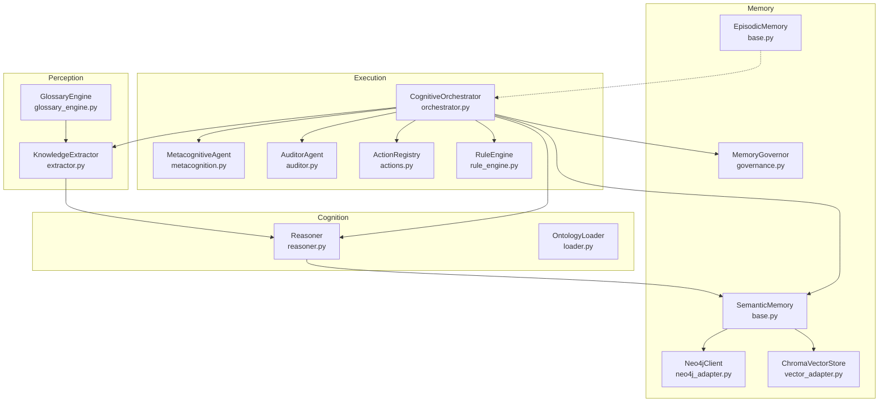
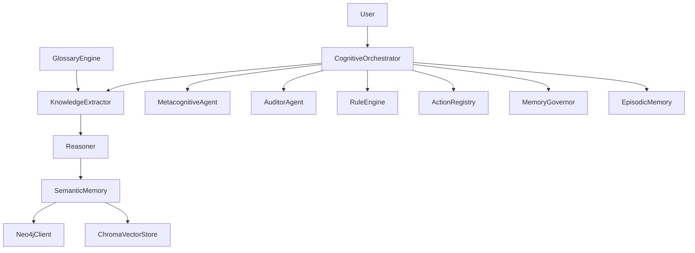
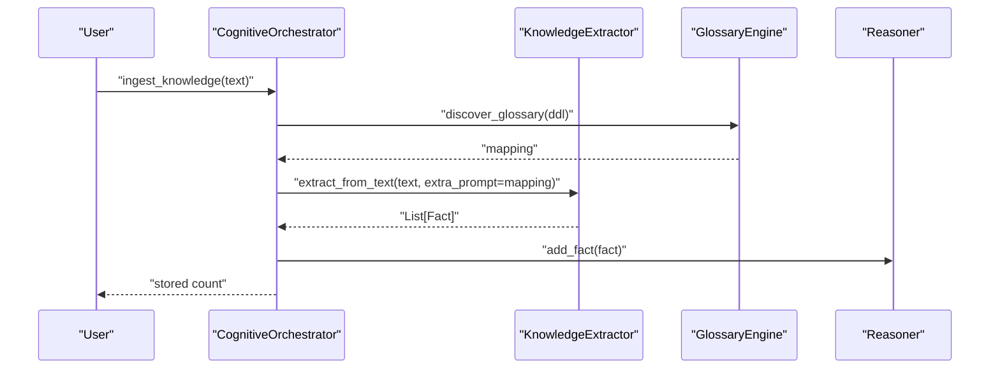
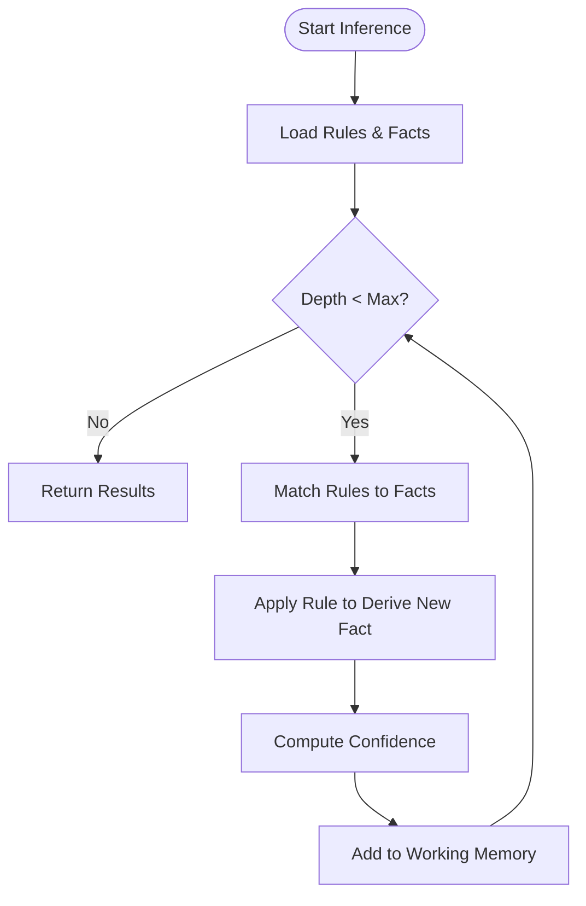
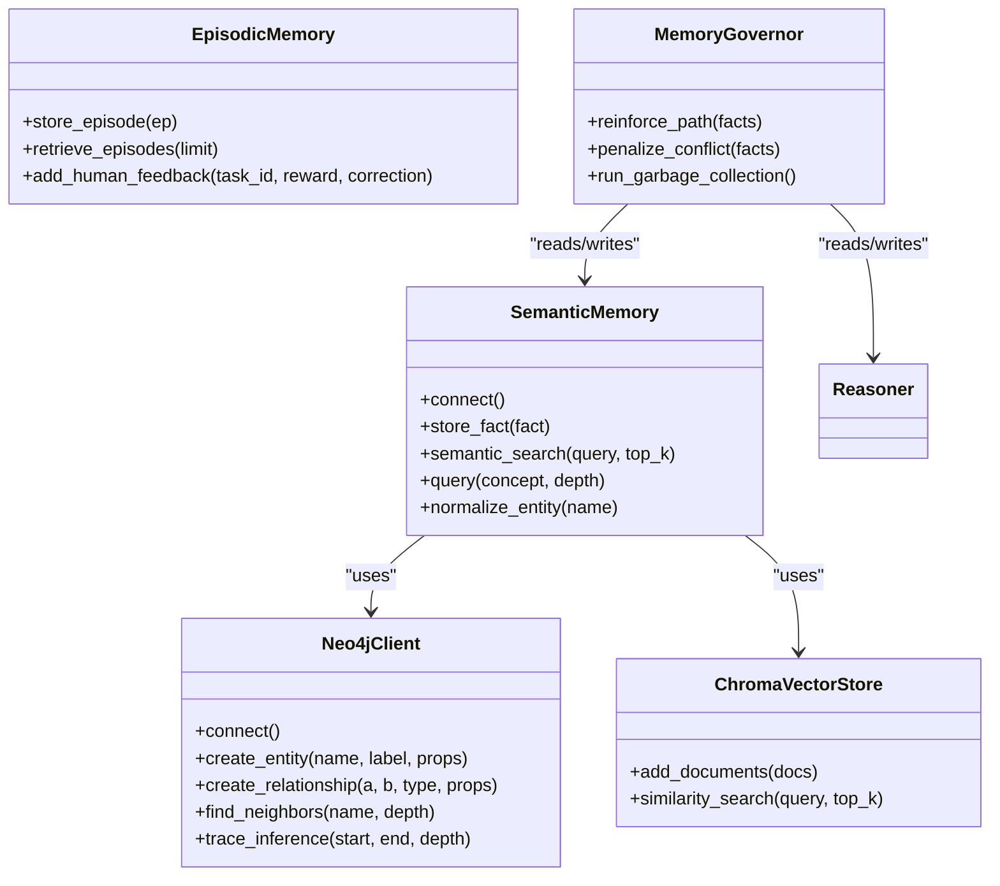
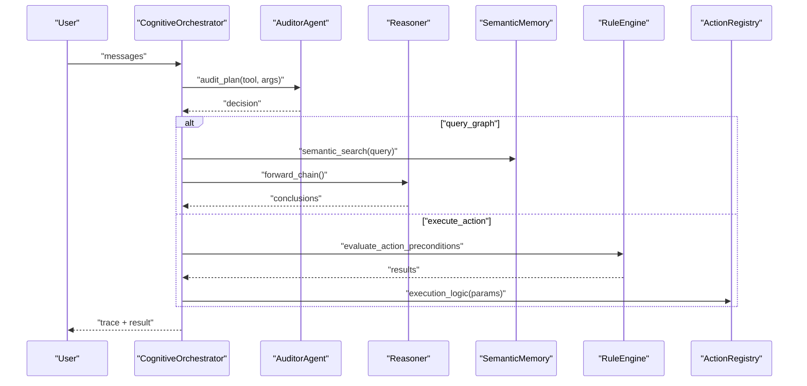
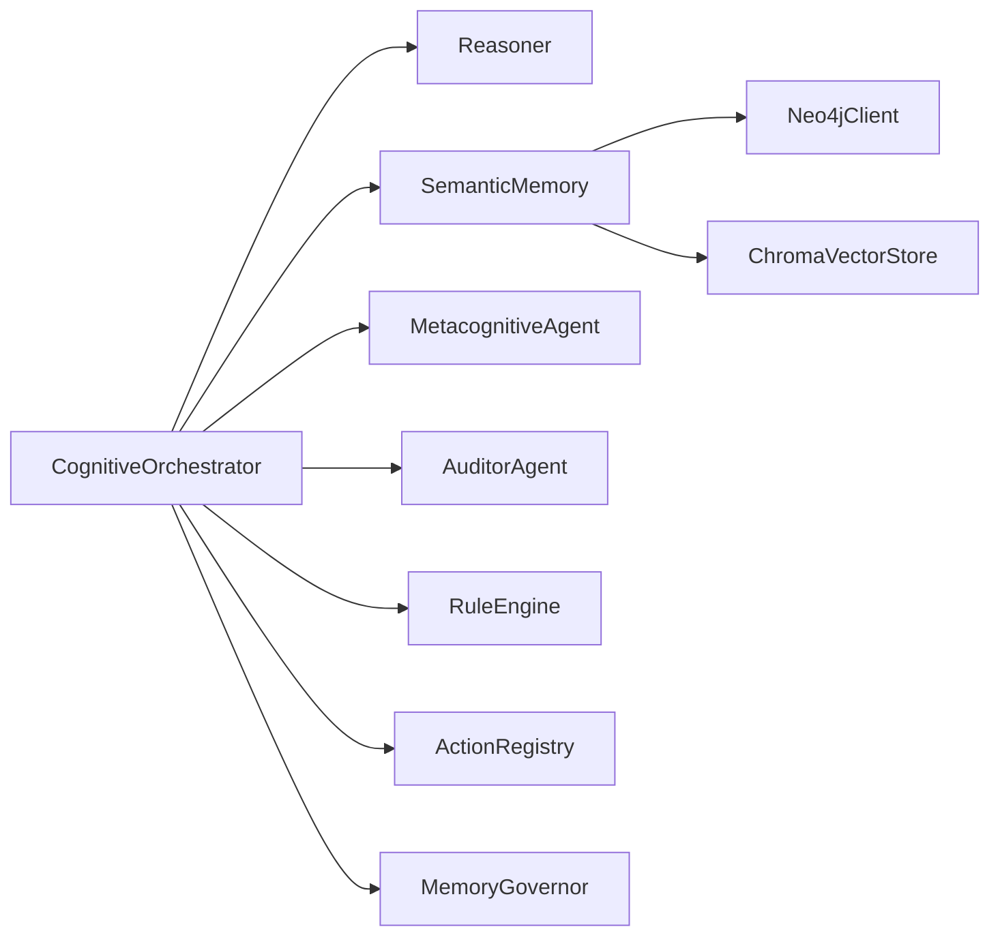
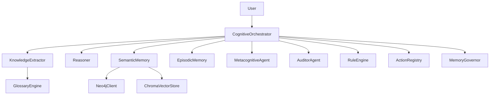
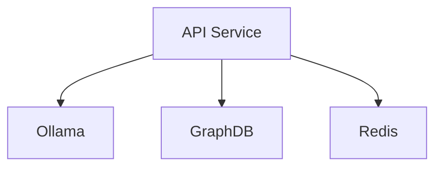
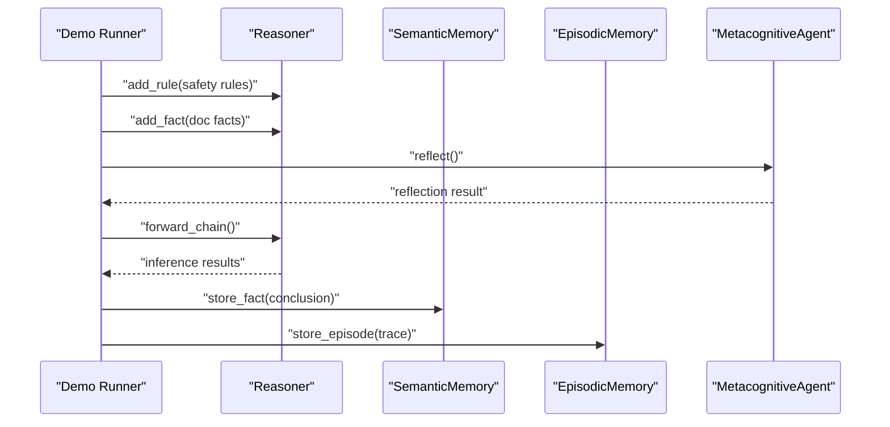

# Core Architecture

<cite>
**Referenced Files in This Document**
- [extractor.py](file://src/perception/extractor.py)
- [orchestrator.py](file://src/agents/orchestrator.py)
- [reasoner.py](file://src/core/reasoner.py)
- [base.py](file://src/memory/base.py)
- [neo4j_adapter.py](file://src/memory/neo4j_adapter.py)
- [vector_adapter.py](file://src/memory/vector_adapter.py)
- [loader.py](file://src/core/loader.py)
- [glossary_engine.py](file://src/perception/glossary_engine.py)
- [metacognition.py](file://src/agents/metacognition.py)
- [auditor.py](file://src/agents/auditor.py)
- [actions.py](file://src/core/ontology/actions.py)
- [rule_engine.py](file://src/core/ontology/rule_engine.py)
- [governance.py](file://src/memory/governance.py)
- [clawra_full_stack_demo.py](file://examples/clawra_full_stack_demo.py)
- [docker-compose.yml](file://docker-compose.yml)
</cite>

## Table of Contents
1. [Introduction](#introduction)
2. [Project Structure](#project-structure)
3. [Core Components](#core-components)
4. [Architecture Overview](#architecture-overview)
5. [Detailed Component Analysis](#detailed-component-analysis)
6. [Dependency Analysis](#dependency-analysis)
7. [Performance Considerations](#performance-considerations)
8. [Troubleshooting Guide](#troubleshooting-guide)
9. [Conclusion](#conclusion)
10. [Appendices](#appendices)

## Introduction
This document describes the core system design of Clawra, a neuro-symbolic cognitive platform integrating perception, cognition, memory, and execution layers. It explains the layered architecture, component interactions, hybrid memory design (Neo4j graph + ChromaDB vector), the Orchestrator as the cognitive central nervous system, and the technical decisions underpinning the neuro-symbolic integration. It also covers infrastructure requirements, scalability, and deployment topology.

## Project Structure
Clawra organizes functionality into distinct layers:
- Perception: Knowledge extraction from unstructured text into structured facts.
- Cognition: Symbolic reasoning engine with forward/backward chaining and confidence propagation.
- Memory: Hybrid memory combining Neo4j graph storage and ChromaDB vector storage, plus episodic memory.
- Execution: Orchestrator coordinating tools (ingest, query, action) with auditing and governance.

**Diagram sources**
- [extractor.py:1-350](file://src/perception/extractor.py#L1-L350)
- [glossary_engine.py:1-71](file://src/perception/glossary_engine.py#L1-L71)
- [reasoner.py:1-819](file://src/core/reasoner.py#L1-L819)
- [loader.py:1-444](file://src/core/loader.py#L1-L444)
- [base.py:1-249](file://src/memory/base.py#L1-L249)
- [neo4j_adapter.py:1-974](file://src/memory/neo4j_adapter.py#L1-L974)
- [vector_adapter.py:1-79](file://src/memory/vector_adapter.py#L1-L79)
- [governance.py:1-62](file://src/memory/governance.py#L1-L62)
- [orchestrator.py:1-366](file://src/agents/orchestrator.py#L1-L366)
- [metacognition.py:1-204](file://src/agents/metacognition.py#L1-L204)
- [auditor.py:1-72](file://src/agents/auditor.py#L1-L72)
- [actions.py:1-70](file://src/core/ontology/actions.py#L1-L70)
- [rule_engine.py:1-331](file://src/core/ontology/rule_engine.py#L1-L331)

**Section sources**
- [extractor.py:1-350](file://src/perception/extractor.py#L1-L350)
- [orchestrator.py:1-366](file://src/agents/orchestrator.py#L1-L366)
- [reasoner.py:1-819](file://src/core/reasoner.py#L1-L819)
- [base.py:1-249](file://src/memory/base.py#L1-L249)
- [neo4j_adapter.py:1-974](file://src/memory/neo4j_adapter.py#L1-L974)
- [vector_adapter.py:1-79](file://src/memory/vector_adapter.py#L1-L79)
- [loader.py:1-444](file://src/core/loader.py#L1-L444)
- [glossary_engine.py:1-71](file://src/perception/glossary_engine.py#L1-L71)
- [metacognition.py:1-204](file://src/agents/metacognition.py#L1-L204)
- [auditor.py:1-72](file://src/agents/auditor.py#L1-L72)
- [actions.py:1-70](file://src/core/ontology/actions.py#L1-L70)
- [rule_engine.py:1-331](file://src/core/ontology/rule_engine.py#L1-L331)
- [governance.py:1-62](file://src/memory/governance.py#L1-L62)
- [clawra_full_stack_demo.py:1-134](file://examples/clawra_full_stack_demo.py#L1-L134)

## Core Components
- KnowledgeExtractor: Structured extraction of RDF triples from long-form texts with chunking, JSON repair, and deduplication.
- Reasoner: Forward/backward chaining with confidence propagation and rule registry.
- SemanticMemory: Hybrid memory with Neo4j graph and ChromaDB vector; supports normalization and semantic search.
- EpisodicMemory: SQLite-backed persistence of agent episodes and feedback for future RLHF-like refinement.
- CognitiveOrchestrator: Central coordinator implementing a ReAct-style tool loop with ingestion, graph querying, and action execution.
- MetacognitiveAgent: Self-reflection and knowledge boundary assessment.
- AuditorAgent: Pre-execution gating for query logic and cardinality risks.
- RuleEngine: Deterministic math/logic sandbox for action preconditions.
- ActionRegistry: Palantir-style action types with validation and execution hooks.
- MemoryGovernor: Confidence-based pruning and reinforcement for long-term memory hygiene.

**Section sources**
- [extractor.py:83-350](file://src/perception/extractor.py#L83-L350)
- [reasoner.py:145-800](file://src/core/reasoner.py#L145-L800)
- [base.py:9-249](file://src/memory/base.py#L9-L249)
- [orchestrator.py:23-366](file://src/agents/orchestrator.py#L23-L366)
- [metacognition.py:8-204](file://src/agents/metacognition.py#L8-L204)
- [auditor.py:8-72](file://src/agents/auditor.py#L8-L72)
- [rule_engine.py:124-331](file://src/core/ontology/rule_engine.py#L124-L331)
- [actions.py:24-70](file://src/core/ontology/actions.py#L24-L70)
- [governance.py:6-62](file://src/memory/governance.py#L6-L62)

## Architecture Overview
Clawra follows a layered architecture:
- Perception ingests unstructured data and produces structured facts.
- Cognition applies symbolic reasoning over the facts and rules.
- Memory persists and retrieves knowledge in both graph and vector forms.
- Execution orchestrates tool use, audits, and governance.

**Diagram sources**
- [extractor.py:83-350](file://src/perception/extractor.py#L83-L350)
- [glossary_engine.py:9-71](file://src/perception/glossary_engine.py#L9-L71)
- [reasoner.py:145-800](file://src/core/reasoner.py#L145-L800)
- [base.py:9-249](file://src/memory/base.py#L9-L249)
- [neo4j_adapter.py:130-974](file://src/memory/neo4j_adapter.py#L130-L974)
- [vector_adapter.py:19-79](file://src/memory/vector_adapter.py#L19-L79)
- [orchestrator.py:23-366](file://src/agents/orchestrator.py#L23-L366)
- [metacognition.py:8-204](file://src/agents/metacognition.py#L8-L204)
- [auditor.py:8-72](file://src/agents/auditor.py#L8-L72)
- [rule_engine.py:124-331](file://src/core/ontology/rule_engine.py#L124-L331)
- [actions.py:24-70](file://src/core/ontology/actions.py#L24-L70)
- [governance.py:6-62](file://src/memory/governance.py#L6-L62)

## Detailed Component Analysis

### Perception Layer
- KnowledgeExtractor: Hierarchical chunking, constrained LLM extraction, JSON repair, deduplication, and conversion to core Fact objects.
- GlossaryEngine: Generates physical-to-business term mappings to align extraction outputs with domain vocabulary.

**Diagram sources**
- [orchestrator.py:243-258](file://src/agents/orchestrator.py#L243-L258)
- [glossary_engine.py:30-71](file://src/perception/glossary_engine.py#L30-L71)
- [extractor.py:278-350](file://src/perception/extractor.py#L278-L350)
- [reasoner.py:224-231](file://src/core/reasoner.py#L224-L231)

**Section sources**
- [extractor.py:83-350](file://src/perception/extractor.py#L83-L350)
- [glossary_engine.py:9-71](file://src/perception/glossary_engine.py#L9-L71)
- [orchestrator.py:243-258](file://src/agents/orchestrator.py#L243-L258)

### Cognition Layer
- Reasoner: Forward/backward chaining with confidence propagation, rule indexing, and circuit-breaker timeouts.
- OntologyLoader: Loads JSON/TTL/OWL-like structures for class/property/individual definitions.

**Diagram sources**
- [reasoner.py:243-350](file://src/core/reasoner.py#L243-L350)
- [reasoner.py:440-560](file://src/core/reasoner.py#L440-L560)

**Section sources**
- [reasoner.py:145-800](file://src/core/reasoner.py#L145-L800)
- [loader.py:131-444](file://src/core/loader.py#L131-L444)

### Memory Layer
- SemanticMemory: Integrates Neo4j graph and ChromaDB vector; normalizes entities and supports semantic search and graph traversal.
- EpisodicMemory: SQLite-backed persistence of agent episodes and human feedback.
- MemoryGovernor: Reinforces confident facts and prunes low-confidence ones.

**Diagram sources**
- [base.py:9-249](file://src/memory/base.py#L9-L249)
- [neo4j_adapter.py:130-974](file://src/memory/neo4j_adapter.py#L130-L974)
- [vector_adapter.py:19-79](file://src/memory/vector_adapter.py#L19-L79)
- [governance.py:6-62](file://src/memory/governance.py#L6-L62)

**Section sources**
- [base.py:9-249](file://src/memory/base.py#L9-L249)
- [neo4j_adapter.py:130-974](file://src/memory/neo4j_adapter.py#L130-L974)
- [vector_adapter.py:19-79](file://src/memory/vector_adapter.py#L19-L79)
- [governance.py:6-62](file://src/memory/governance.py#L6-L62)

### Execution Layer
- CognitiveOrchestrator: Tool loop with ingestion, graph querying (GraphRAG), and action execution; integrates auditing and governance.
- MetacognitiveAgent: Reflection and knowledge boundary checks.
- AuditorAgent: Validates query aggregation and cardinality risks.
- RuleEngine: Secure math sandbox for action preconditions.
- ActionRegistry: Defines action types and execution hooks.

**Diagram sources**
- [orchestrator.py:261-342](file://src/agents/orchestrator.py#L261-L342)
- [auditor.py:24-65](file://src/agents/auditor.py#L24-L65)
- [reasoner.py:243-438](file://src/core/reasoner.py#L243-L438)
- [base.py:118-120](file://src/memory/base.py#L118-L120)
- [rule_engine.py:320-331](file://src/core/ontology/rule_engine.py#L320-L331)
- [actions.py:50-57](file://src/core/ontology/actions.py#L50-L57)

**Section sources**
- [orchestrator.py:23-366](file://src/agents/orchestrator.py#L23-L366)
- [auditor.py:8-72](file://src/agents/auditor.py#L8-L72)
- [metacognition.py:8-204](file://src/agents/metacognition.py#L8-L204)
- [rule_engine.py:124-331](file://src/core/ontology/rule_engine.py#L124-L331)
- [actions.py:24-70](file://src/core/ontology/actions.py#L24-L70)

## Dependency Analysis
- Low coupling: Orchestrator depends on abstractions (Reasoner, SemanticMemory, Agents) rather than concrete implementations.
- High cohesion: Each module encapsulates a single responsibility (extraction, reasoning, memory, orchestration).
- Hybrid memory decouples retrieval (vector) from structural reasoning (graph), enabling GraphRAG.

**Diagram sources**
- [orchestrator.py:23-42](file://src/agents/orchestrator.py#L23-L42)
- [base.py:9-27](file://src/memory/base.py#L9-L27)
- [neo4j_adapter.py:130-135](file://src/memory/neo4j_adapter.py#L130-L135)
- [vector_adapter.py:19-44](file://src/memory/vector_adapter.py#L19-L44)

**Section sources**
- [orchestrator.py:23-42](file://src/agents/orchestrator.py#L23-L42)
- [base.py:9-27](file://src/memory/base.py#L9-L27)

## Performance Considerations
- Chunking and JSON repair reduce LLM overhead and improve robustness during extraction.
- Forward/backward chaining includes timeouts to avoid runaway inference.
- Vector search bounds (top_k) and graph traversal depths cap resource usage.
- Confidence decay and pruning keep memory lean and relevant.
- Neo4j and ChromaDB enable scalable hybrid retrieval and reasoning.

[No sources needed since this section provides general guidance]

## Troubleshooting Guide
Common issues and mitigations:
- Extraction failures: Verify environment variables for LLM access and retry logic on rate limits.
- Graph connectivity: Confirm Neo4j availability; fallback to in-memory mode when unavailable.
- Audit rejections: Review aggregation queries and cardinality assumptions flagged by the AuditorAgent.
- Rule violations: Inspect math sandbox expressions and context variable bindings.
- Memory growth: Monitor garbage collection metrics and adjust prune thresholds.

**Section sources**
- [extractor.py:212-231](file://src/perception/extractor.py#L212-L231)
- [neo4j_adapter.py:179-200](file://src/memory/neo4j_adapter.py#L179-L200)
- [auditor.py:33-65](file://src/agents/auditor.py#L33-L65)
- [rule_engine.py:320-331](file://src/core/ontology/rule_engine.py#L320-L331)
- [governance.py:47-62](file://src/memory/governance.py#L47-L62)

## Conclusion
Clawra’s layered, neuro-symbolic architecture couples precise symbolic reasoning with flexible, scalable memory and perception. The Orchestrator coordinates heterogeneous tools while enforcing safety via auditing and rule engines. The hybrid memory stack enables both precise graph traversal and approximate semantic search. This design balances expressiveness, safety, and performance for enterprise-grade knowledge-intensive tasks.

[No sources needed since this section summarizes without analyzing specific files]

## Appendices

### System Context Diagram

**Diagram sources**
- [orchestrator.py:23-366](file://src/agents/orchestrator.py#L23-L366)
- [extractor.py:83-350](file://src/perception/extractor.py#L83-L350)
- [glossary_engine.py:9-71](file://src/perception/glossary_engine.py#L9-L71)
- [reasoner.py:145-800](file://src/core/reasoner.py#L145-L800)
- [base.py:9-249](file://src/memory/base.py#L9-L249)
- [neo4j_adapter.py:130-974](file://src/memory/neo4j_adapter.py#L130-L974)
- [vector_adapter.py:19-79](file://src/memory/vector_adapter.py#L19-L79)
- [metacognition.py:8-204](file://src/agents/metacognition.py#L8-L204)
- [auditor.py:8-72](file://src/agents/auditor.py#L8-L72)
- [rule_engine.py:124-331](file://src/core/ontology/rule_engine.py#L124-L331)
- [actions.py:24-70](file://src/core/ontology/actions.py#L24-L70)
- [governance.py:6-62](file://src/memory/governance.py#L6-L62)

### Infrastructure Requirements and Deployment Topology
- Services: API server, local LLM (Ollama), GraphDB, Redis cache.
- Ports: API exposes 8000; Ollama 11434; GraphDB 7200; Redis 6379.
- Volumes: Persistent storage for LLM, GraphDB, and Redis.
- Networks: Bridge network for service communication.

**Diagram sources**
- [docker-compose.yml:1-91](file://docker-compose.yml#L1-L91)

**Section sources**
- [docker-compose.yml:1-91](file://docker-compose.yml#L1-L91)

### Example End-to-End Workflow
- Initialize components, inject guardrails, ingest documents, reflect and reason, store traces, evolve rules, and summarize.

**Diagram sources**
- [clawra_full_stack_demo.py:34-134](file://examples/clawra_full_stack_demo.py#L34-L134)
- [reasoner.py:224-350](file://src/core/reasoner.py#L224-L350)
- [base.py:91-120](file://src/memory/base.py#L91-L120)
- [metacognition.py:92-134](file://src/agents/metacognition.py#L92-L134)

**Section sources**
- [clawra_full_stack_demo.py:1-134](file://examples/clawra_full_stack_demo.py#L1-L134)