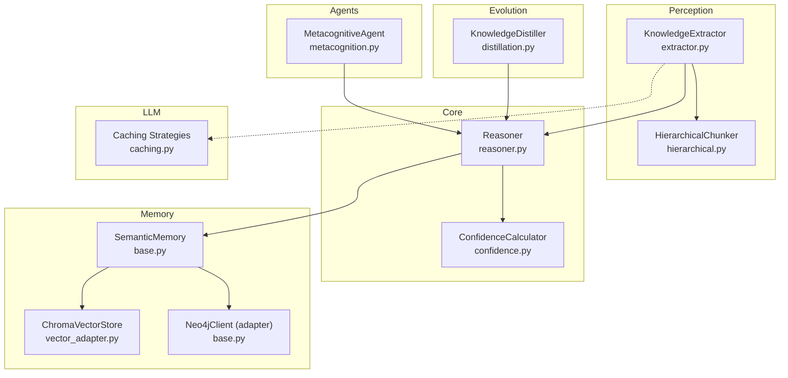
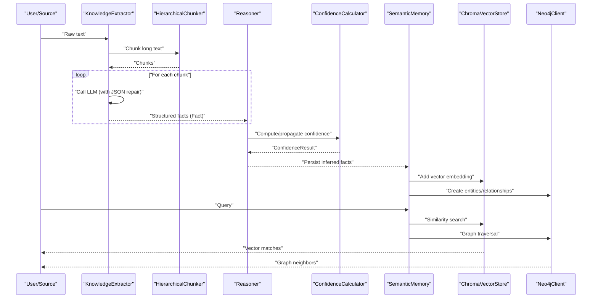
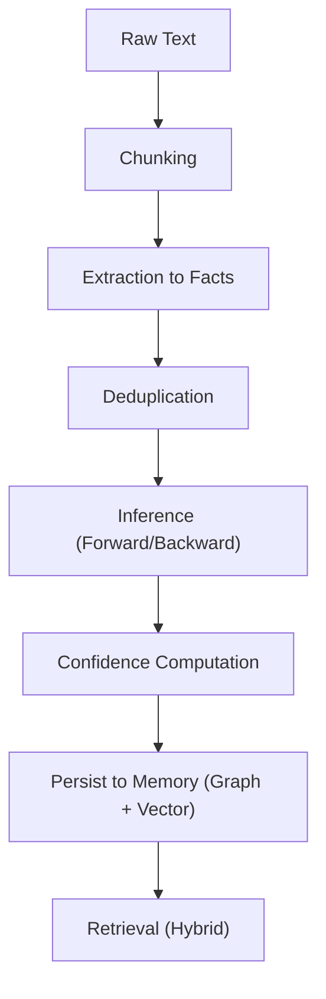
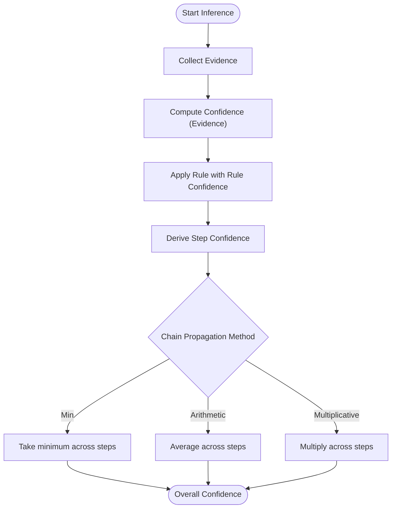
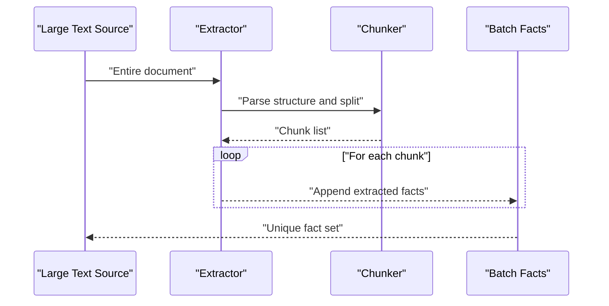
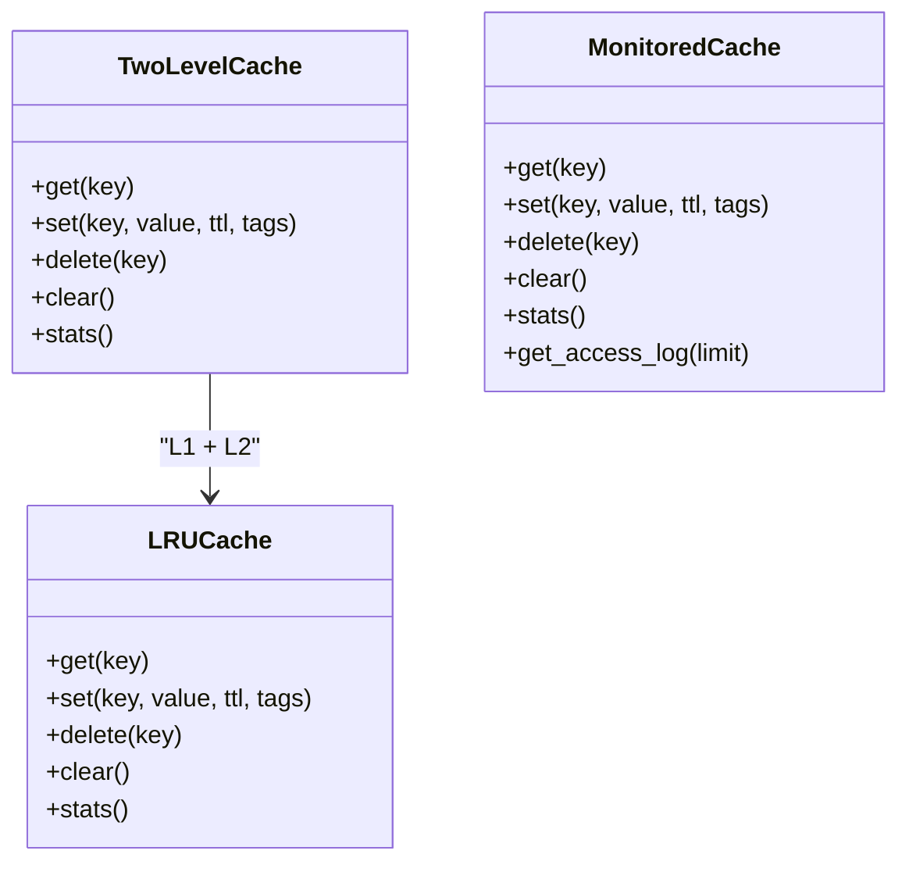
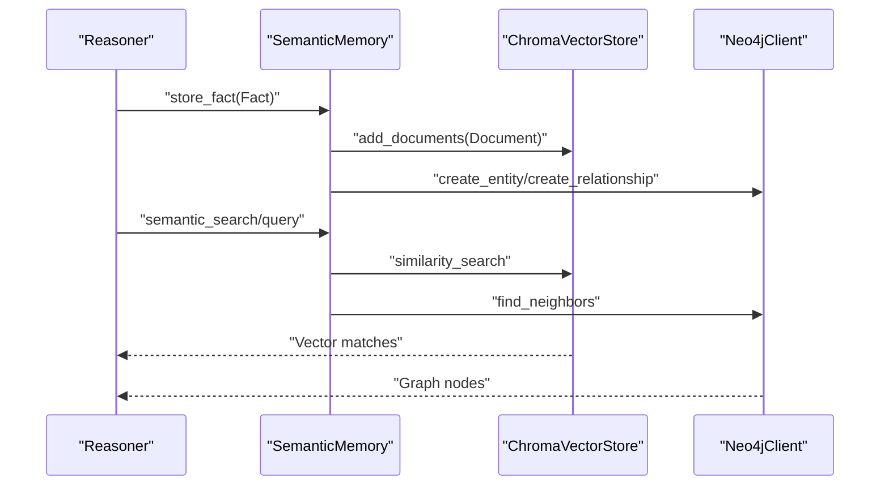
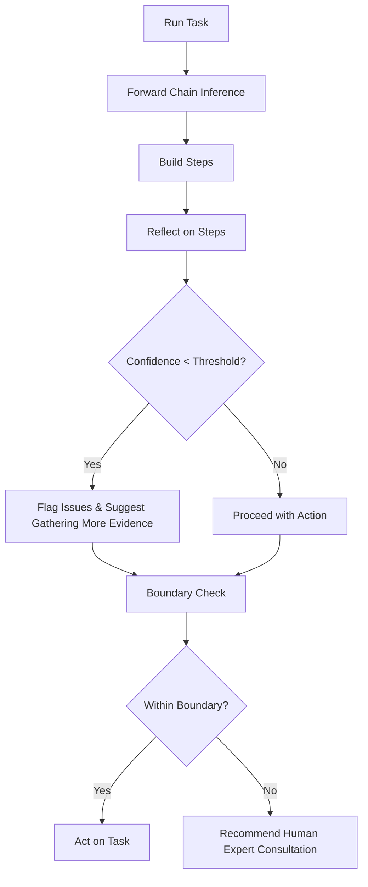
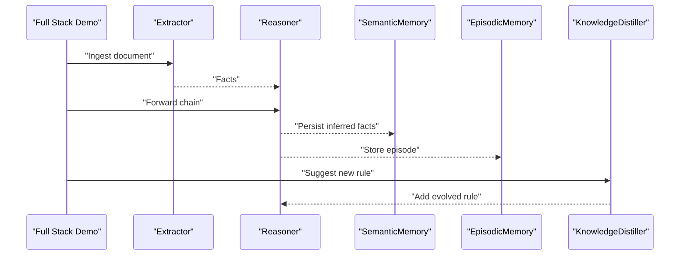
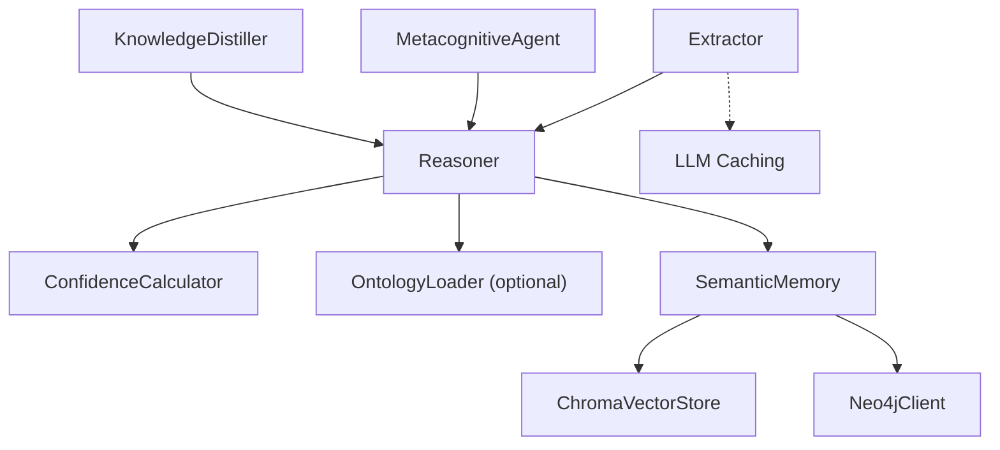

# Data Flow Patterns

<cite>
**Referenced Files in This Document**
- [extractor.py](file://src/perception/extractor.py)
- [reasoner.py](file://src/core/reasoner.py)
- [vector_adapter.py](file://src/memory/vector_adapter.py)
- [loader.py](file://src/core/loader.py)
- [caching.py](file://src/llm/caching.py)
- [confidence.py](file://src/eval/confidence.py)
- [hierarchical.py](file://src/chunking/hierarchical.py)
- [base.py](file://src/memory/base.py)
- [metacognition.py](file://src/agents/metacognition.py)
- [distillation.py](file://src/evolution/distillation.py)
- [clawra_full_stack_demo.py](file://examples/clawra_full_stack_demo.py)
- [test_streaming_loader.py](file://tests/test_streaming_loader.py)
</cite>

## Table of Contents
1. [Introduction](#introduction)
2. [Project Structure](#project-structure)
3. [Core Components](#core-components)
4. [Architecture Overview](#architecture-overview)
5. [Detailed Component Analysis](#detailed-component-analysis)
6. [Dependency Analysis](#dependency-analysis)
7. [Performance Considerations](#performance-considerations)
8. [Troubleshooting Guide](#troubleshooting-guide)
9. [Conclusion](#conclusion)
10. [Appendices](#appendices)

## Introduction
This document explains the data flow patterns across the Clawra system, tracing information from raw text ingestion through extraction, reasoning, memory storage, and retrieval. It details the transformation of data types along the pipeline (raw text → structured facts → reasoned conclusions → stored knowledge), the confidence propagation mechanism, and how uncertainty flows through the system. It also covers batch and streaming processing modes, caching strategies, and data consistency guarantees.

## Project Structure
The Clawra system organizes functionality into modular layers:
- Perception: Text ingestion and structured extraction
- Core: Ontology-aware reasoning and confidence computation
- Memory: Persistent storage (graph and vector) with normalization and hybrid retrieval
- Agents: Metacognitive reflection and knowledge boundary checks
- Evolution: Knowledge distillation and schema updates
- LLM: Caching strategies for inference and query performance
- Utilities: Chunking, streaming loaders, and evaluation helpers

**Diagram sources**
- [extractor.py:83-350](file://src/perception/extractor.py#L83-L350)
- [hierarchical.py:29-256](file://src/chunking/hierarchical.py#L29-L256)
- [reasoner.py:145-800](file://src/core/reasoner.py#L145-L800)
- [confidence.py:32-407](file://src/eval/confidence.py#L32-L407)
- [base.py:9-249](file://src/memory/base.py#L9-L249)
- [vector_adapter.py:31-97](file://src/memory/vector_adapter.py#L31-L97)
- [metacognition.py:8-204](file://src/agents/metacognition.py#L8-L204)
- [distillation.py:7-27](file://src/evolution/distillation.py#L7-L27)
- [caching.py:55-502](file://src/llm/caching.py#L55-L502)

**Section sources**
- [extractor.py:1-350](file://src/perception/extractor.py#L1-L350)
- [reasoner.py:1-819](file://src/core/reasoner.py#L1-L819)
- [base.py:1-249](file://src/memory/base.py#L1-L249)
- [metacognition.py:1-204](file://src/agents/metacognition.py#L1-L204)
- [distillation.py:1-27](file://src/evolution/distillation.py#L1-L27)
- [caching.py:1-502](file://src/llm/caching.py#L1-L502)
- [hierarchical.py:1-256](file://src/chunking/hierarchical.py#L1-L256)
- [confidence.py:1-407](file://src/eval/confidence.py#L1-L407)

## Core Components
- KnowledgeExtractor: Converts raw text into structured facts using domain-guided extraction, chunking long texts, and deduplicating extracted triples.
- HierarchicalChunker: Parses document structure and splits text into semantically coherent chunks respecting token limits and overlaps.
- Reasoner: Applies forward/backward chaining over facts and rules, computes confidence propagation, and produces reasoned conclusions.
- ConfidenceCalculator: Computes and propagates confidence across evidence and reasoning chains using multiple methods.
- SemanticMemory: Persists facts into both a graph (Neo4j) and a vector store (Chroma), enabling hybrid retrieval.
- ChromaVectorStore: Dense vector storage and similarity search for semantic recall.
- MetacognitiveAgent: Reflects on reasoning, validates logical consistency, and assesses knowledge boundaries based on confidence.
- KnowledgeDistiller: Suggests schema updates and extracts structured knowledge from unstructured logs (placeholder).
- LLM Caching: Provides multi-level caching (LRU/TTL) and decorators to optimize repeated LLM calls.

**Section sources**
- [extractor.py:83-350](file://src/perception/extractor.py#L83-L350)
- [hierarchical.py:29-256](file://src/chunking/hierarchical.py#L29-L256)
- [reasoner.py:145-800](file://src/core/reasoner.py#L145-L800)
- [confidence.py:32-407](file://src/eval/confidence.py#L32-L407)
- [base.py:9-249](file://src/memory/base.py#L9-L249)
- [vector_adapter.py:31-97](file://src/memory/vector_adapter.py#L31-L97)
- [metacognition.py:8-204](file://src/agents/metacognition.py#L8-L204)
- [distillation.py:7-27](file://src/evolution/distillation.py#L7-L27)
- [caching.py:55-502](file://src/llm/caching.py#L55-L502)

## Architecture Overview
The system follows a layered pipeline:
- Ingestion: Long-form text is chunked and sent to the extractor.
- Extraction: Domain-aligned JSON is repaired and normalized into Fact objects.
- Reasoning: Facts are fed into the Reasoner with confidence propagation.
- Memory: Structured facts are persisted to graph and vector stores.
- Retrieval: Hybrid retrieval combines graph traversal and vector similarity.
- Reflection: MetacognitiveAgent evaluates confidence and logical consistency.
- Evolution: KnowledgeDistiller suggests schema updates and distilled rules.

**Diagram sources**
- [extractor.py:190-350](file://src/perception/extractor.py#L190-L350)
- [hierarchical.py:141-222](file://src/chunking/hierarchical.py#L141-L222)
- [reasoner.py:243-349](file://src/core/reasoner.py#L243-L349)
- [confidence.py:63-170](file://src/eval/confidence.py#L63-L170)
- [base.py:91-121](file://src/memory/base.py#L91-L121)
- [vector_adapter.py:63-97](file://src/memory/vector_adapter.py#L63-L97)

## Detailed Component Analysis

### Data Transformation Lifecycle
- Raw text → Structured facts: Extraction enforces domain alignment and JSON repair; duplicates are removed; facts are normalized.
- Structured facts → Reasoned conclusions: Forward/backward chaining applies rules; confidence is computed per step and propagated across the chain.
- Stored knowledge → Hybrid retrieval: Persisted to graph and vector stores; retrieval uses both semantic similarity and graph traversal.

**Diagram sources**
- [hierarchical.py:141-222](file://src/chunking/hierarchical.py#L141-L222)
- [extractor.py:278-350](file://src/perception/extractor.py#L278-L350)
- [reasoner.py:243-349](file://src/core/reasoner.py#L243-L349)
- [confidence.py:63-170](file://src/eval/confidence.py#L63-L170)
- [base.py:91-121](file://src/memory/base.py#L91-L121)

**Section sources**
- [hierarchical.py:29-256](file://src/chunking/hierarchical.py#L29-L256)
- [extractor.py:83-350](file://src/perception/extractor.py#L83-L350)
- [reasoner.py:145-800](file://src/core/reasoner.py#L145-L800)
- [confidence.py:32-407](file://src/eval/confidence.py#L32-L407)
- [base.py:9-249](file://src/memory/base.py#L9-L249)

### Confidence Propagation Mechanism
- Evidence-based calculation: ConfidenceCalculator aggregates reliability from multiple sources/evidence using methods like weighted average, multiplicative synthesis, Bayesian update, and Dempster–Shafer theory.
- Rule confidence: Each rule contributes a confidence factor during inference; the conclusion’s confidence reflects both premise and rule reliability.
- Chain propagation: The overall confidence of a derivation chain is propagated using conservative methods (e.g., minimum) to avoid overconfidence accumulation.

**Diagram sources**
- [confidence.py:63-170](file://src/eval/confidence.py#L63-L170)
- [reasoner.py:294-342](file://src/core/reasoner.py#L294-L342)

**Section sources**
- [confidence.py:32-407](file://src/eval/confidence.py#L32-L407)
- [reasoner.py:243-349](file://src/core/reasoner.py#L243-L349)

### Batch vs Streaming Data Flows
- Batch processing: The extractor supports long-document chunking and iterates over chunks to produce a consolidated list of unique facts. This is suitable for offline ingestion and large-scale processing.
- Streaming: The StreamingOntologyLoader reads JSON/JSONL entities incrementally, reducing memory footprint for large ontologies. This enables streaming ingestion of domain knowledge.

**Diagram sources**
- [extractor.py:296-350](file://src/perception/extractor.py#L296-L350)
- [hierarchical.py:141-222](file://src/chunking/hierarchical.py#L141-L222)

**Section sources**
- [extractor.py:278-350](file://src/perception/extractor.py#L278-L350)
- [hierarchical.py:29-256](file://src/chunking/hierarchical.py#L29-L256)
- [loader.py:43-129](file://src/core/loader.py#L43-L129)
- [test_streaming_loader.py:14-72](file://tests/test_streaming_loader.py#L14-L72)

### Caching Strategies
- LRU cache with TTL: Used for frequent inference results and query responses.
- Two-level cache: L1 (fast memory) + L2 (persistent) to balance latency and persistence.
- Monitored cache: Tracks access logs for debugging and tuning.
- Decorators: Transparent caching around expensive operations with customizable TTL and tags.

**Diagram sources**
- [caching.py:76-276](file://src/llm/caching.py#L76-L276)

**Section sources**
- [caching.py:55-502](file://src/llm/caching.py#L55-L502)

### Memory Storage and Retrieval
- SemanticMemory persists facts to both Neo4j (graph) and Chroma (vectors). It normalizes entities to align synonyms and supports hybrid retrieval.
- ChromaVectorStore adds documents with metadata and performs similarity search.
- EpisodicMemory records agent episodes locally for trajectory analysis and future reinforcement learning.

**Diagram sources**
- [base.py:91-121](file://src/memory/base.py#L91-L121)
- [vector_adapter.py:63-97](file://src/memory/vector_adapter.py#L63-L97)

**Section sources**
- [base.py:9-249](file://src/memory/base.py#L9-L249)
- [vector_adapter.py:31-97](file://src/memory/vector_adapter.py#L31-L97)

### Metacognition and Knowledge Boundary
- MetacognitiveAgent validates reasoning steps, detects contradictions, and assesses confidence thresholds to determine whether a query is within the knowledge boundary.
- It provides structured reflection results and recommendations for low-confidence reasoning.

**Diagram sources**
- [metacognition.py:92-173](file://src/agents/metacognition.py#L92-L173)

**Section sources**
- [metacognition.py:8-204](file://src/agents/metacognition.py#L8-L204)

### End-to-End Demo Walkthrough
The full-stack demo illustrates the pipeline from perception to evolution:
- Injects initial facts into the Reasoner.
- Performs forward chaining and stores reasoning traces in memory.
- Evolves the system by adding new rules based on insights.

**Diagram sources**
- [clawra_full_stack_demo.py:34-134](file://examples/clawra_full_stack_demo.py#L34-L134)

**Section sources**
- [clawra_full_stack_demo.py:1-134](file://examples/clawra_full_stack_demo.py#L1-L134)
- [distillation.py:7-27](file://src/evolution/distillation.py#L7-L27)

## Dependency Analysis
Key dependencies and coupling:
- Extraction depends on chunking and LLM clients; it outputs Fact objects consumed by the Reasoner.
- Reasoner depends on ConfidenceCalculator for confidence propagation and optionally on an OntologyLoader for richer semantics.
- Memory components depend on adapters for Neo4j and Chroma; they are loosely coupled to the rest of the system.
- Agents introspect the Reasoner and can influence rule addition via evolution.

**Diagram sources**
- [extractor.py:101-120](file://src/perception/extractor.py#L101-L120)
- [reasoner.py:162-180](file://src/core/reasoner.py#L162-L180)
- [base.py:9-28](file://src/memory/base.py#L9-L28)
- [metacognition.py:1-204](file://src/agents/metacognition.py#L1-L204)
- [distillation.py:1-27](file://src/evolution/distillation.py#L1-L27)
- [caching.py:55-502](file://src/llm/caching.py#L55-L502)

**Section sources**
- [extractor.py:83-120](file://src/perception/extractor.py#L83-L120)
- [reasoner.py:145-180](file://src/core/reasoner.py#L145-L180)
- [base.py:9-28](file://src/memory/base.py#L9-L28)
- [metacognition.py:1-204](file://src/agents/metacognition.py#L1-L204)
- [distillation.py:1-27](file://src/evolution/distillation.py#L1-L27)
- [caching.py:55-502](file://src/llm/caching.py#L55-L502)

## Performance Considerations
- Chunking and token limits: HierarchicalChunker estimates tokens and respects effective limits to prevent truncation and reduce retries.
- JSON repair: Extraction includes robust JSON repair to minimize parsing failures and retries.
- Caching: Two-level cache and monitored cache improve latency and observability; TTL prevents stale data.
- Inference timeouts: Reasoner enforces circuit-breaker timeouts to avoid long-running chains.
- Vector indexing: Chroma persistence and collection creation enable scalable similarity search.

[No sources needed since this section provides general guidance]

## Troubleshooting Guide
- Extraction failures: Check JSON repair logic and chunk sizes; verify LLM client initialization and rate limits.
- Reasoning timeouts: Reduce max_depth or increase timeout; inspect rule complexity and working memory growth.
- Memory connectivity: Verify Neo4j availability and credentials; fallback to mock mode for development.
- Confidence anomalies: Review evidence reliability and rule confidence values; adjust propagation method if needed.
- Streaming loader issues: Ensure JSON/JSONL format correctness and entity type filtering.

**Section sources**
- [extractor.py:122-188](file://src/perception/extractor.py#L122-L188)
- [reasoner.py:274-277](file://src/core/reasoner.py#L274-L277)
- [base.py:47-54](file://src/memory/base.py#L47-L54)
- [test_streaming_loader.py:14-72](file://tests/test_streaming_loader.py#L14-L72)

## Conclusion
The Clawra system implements a robust, layered data flow from raw text to actionable knowledge. By enforcing domain-aligned extraction, applying rigorous reasoning with confidence propagation, persisting knowledge in hybrid memory, and incorporating metacognition and evolution, the system achieves both accuracy and interpretability. Caching and streaming capabilities ensure scalability, while explicit confidence modeling and boundary checks help manage uncertainty.

[No sources needed since this section summarizes without analyzing specific files]

## Appendices
- Example end-to-end run: See the full-stack demo for a practical walkthrough of the pipeline.

**Section sources**
- [clawra_full_stack_demo.py:1-134](file://examples/clawra_full_stack_demo.py#L1-L134)