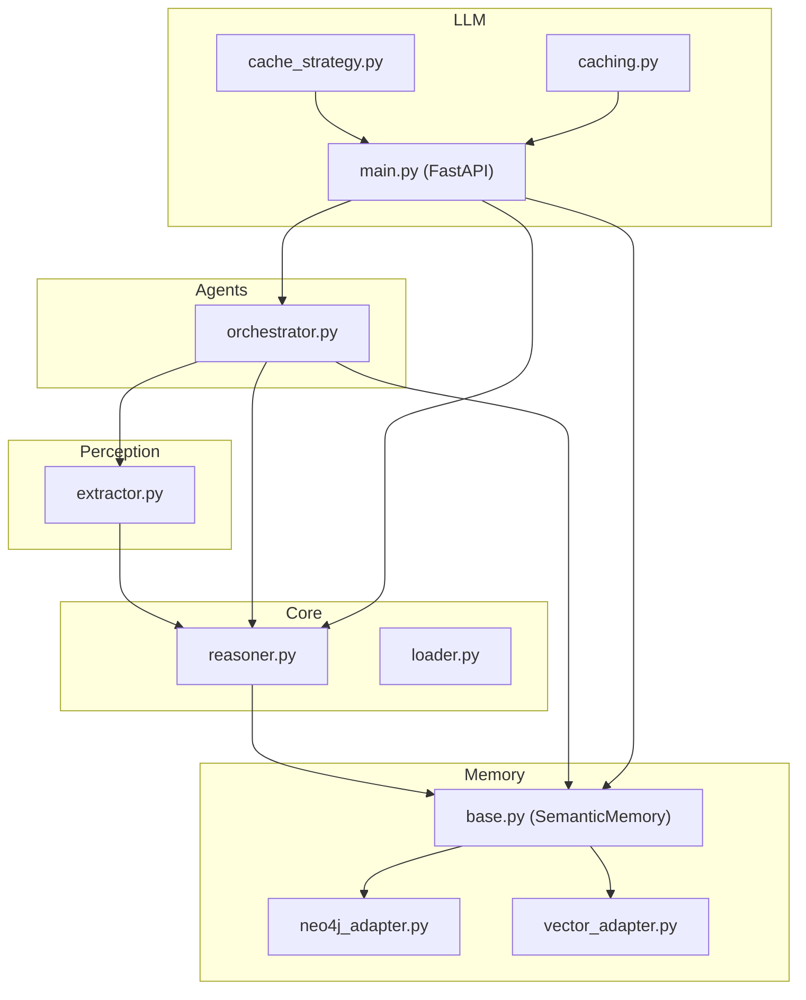
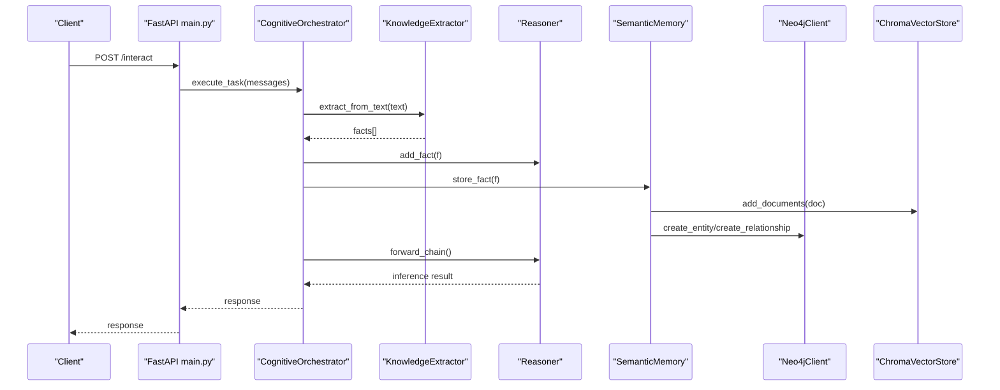
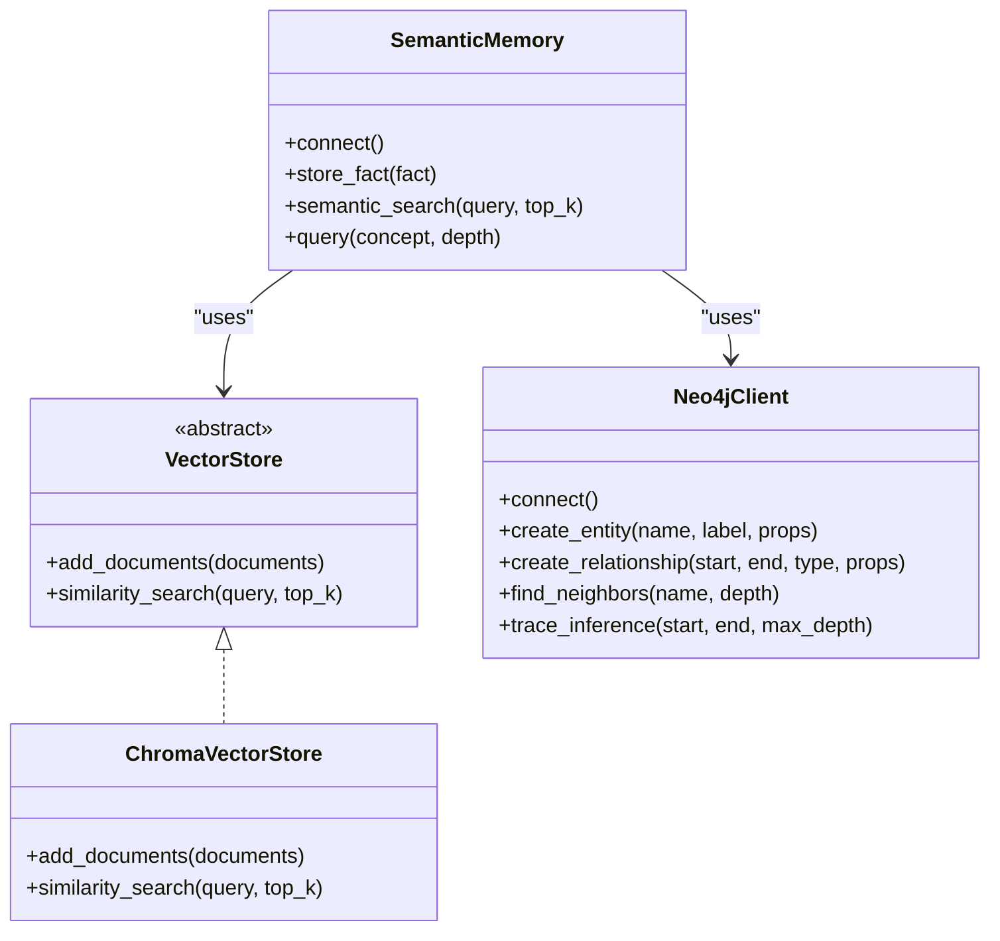
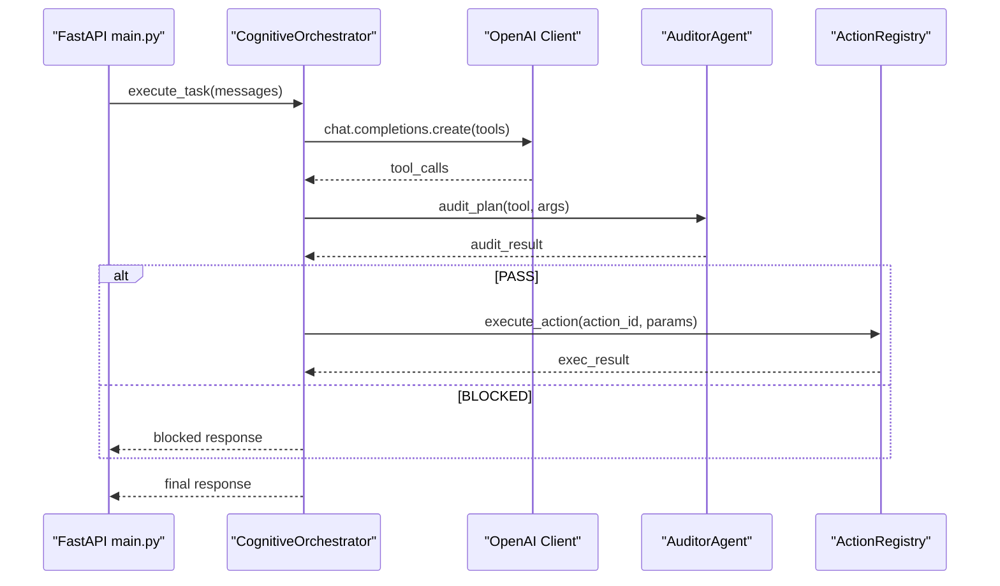
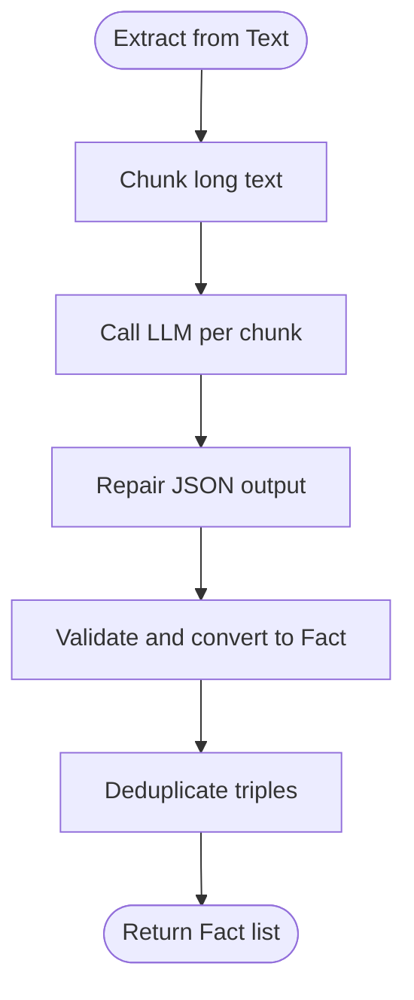
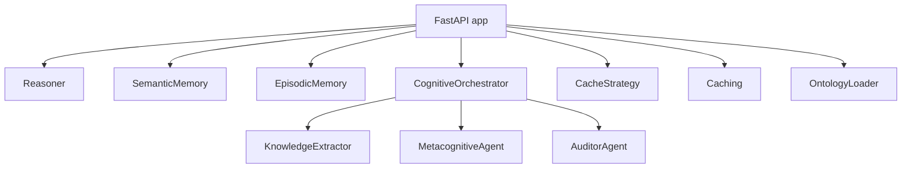
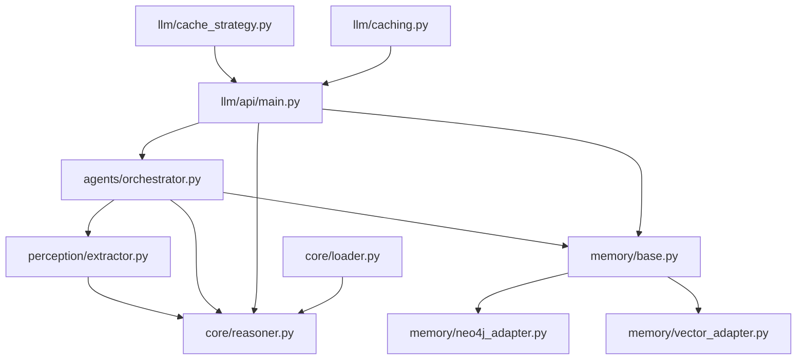

# Integration Patterns

<cite>
**Referenced Files in This Document**
- [neo4j_adapter.py](file://src/memory/neo4j_adapter.py)
- [vector_adapter.py](file://src/memory/vector_adapter.py)
- [base.py](file://src/memory/base.py)
- [extractor.py](file://src/perception/extractor.py)
- [reasoner.py](file://src/core/reasoner.py)
- [main.py](file://src/llm/api/main.py)
- [cache_strategy.py](file://src/llm/cache_strategy.py)
- [caching.py](file://src/llm/caching.py)
- [orchestrator.py](file://src/agents/orchestrator.py)
- [loader.py](file://src/core/loader.py)
- [__init__.py](file://src/llm/__init__.py)
</cite>

## Table of Contents
1. [Introduction](#introduction)
2. [Project Structure](#project-structure)
3. [Core Components](#core-components)
4. [Architecture Overview](#architecture-overview)
5. [Detailed Component Analysis](#detailed-component-analysis)
6. [Dependency Analysis](#dependency-analysis)
7. [Performance Considerations](#performance-considerations)
8. [Troubleshooting Guide](#troubleshooting-guide)
9. [Conclusion](#conclusion)
10. [Appendices](#appendices)

## Introduction
This document explains the integration patterns that unify heterogeneous systems in the Clawra architecture. It focuses on:
- Adapter pattern for database abstraction (Neo4j and ChromaDB unified under a common interface)
- Plugin architecture for LLM integrations and external service connections
- Strategy pattern usage for pluggable extraction methods and reasoning algorithms
- Dependency injection, service locator, and modular loading mechanisms
- Extensibility examples for custom adapters/plugins
- Configuration management and environment-specific adaptations

## Project Structure
The integration patterns span several layers:
- Perception: Extraction pipeline for structured knowledge from unstructured text
- Core: Ontology loader, reasoning engine, and confidence propagation
- Memory: Hybrid semantic memory combining graph and vector stores
- Agents: Orchestrator coordinating tools and policies
- LLM: API server, caching strategies, and plugin-style integrations
- Configuration: Environment variables and runtime configuration

**Diagram sources**
- [extractor.py:1-350](file://src/perception/extractor.py#L1-L350)
- [reasoner.py:1-819](file://src/core/reasoner.py#L1-L819)
- [loader.py:1-444](file://src/core/loader.py#L1-L444)
- [base.py:1-249](file://src/memory/base.py#L1-L249)
- [neo4j_adapter.py:1-974](file://src/memory/neo4j_adapter.py#L1-L974)
- [vector_adapter.py:1-97](file://src/memory/vector_adapter.py#L1-L97)
- [orchestrator.py:1-366](file://src/agents/orchestrator.py#L1-L366)
- [main.py:1-469](file://src/llm/api/main.py#L1-L469)
- [cache_strategy.py:1-751](file://src/llm/cache_strategy.py#L1-L751)
- [caching.py:1-502](file://src/llm/caching.py#L1-L502)

**Section sources**
- [extractor.py:1-350](file://src/perception/extractor.py#L1-L350)
- [reasoner.py:1-819](file://src/core/reasoner.py#L1-L819)
- [loader.py:1-444](file://src/core/loader.py#L1-L444)
- [base.py:1-249](file://src/memory/base.py#L1-L249)
- [neo4j_adapter.py:1-974](file://src/memory/neo4j_adapter.py#L1-L974)
- [vector_adapter.py:1-97](file://src/memory/vector_adapter.py#L1-L97)
- [orchestrator.py:1-366](file://src/agents/orchestrator.py#L1-L366)
- [main.py:1-469](file://src/llm/api/main.py#L1-L469)
- [cache_strategy.py:1-751](file://src/llm/cache_strategy.py#L1-L751)
- [caching.py:1-502](file://src/llm/caching.py#L1-L502)

## Core Components
- Adapter pattern for memory:
  - Graph store: Neo4jClient encapsulates Cypher operations and provides CRUD, graph traversal, and inference tracing
  - Vector store: ChromaVectorStore implements a common VectorStore interface for semantic similarity search
  - Hybrid memory: SemanticMemory composes both stores and normalizes entities for consistent persistence
- Plugin architecture for LLM:
  - FastAPI app initializes global services (Reasoner, SemanticMemory, EpisodicMemory, CognitiveOrchestrator)
  - LLM clients are lazily created with environment-driven configuration
- Strategy pattern for reasoning:
  - Forward/backward/bidirectional inference directions supported by Reasoner
  - Pluggable rule types (transitivity, symmetry, equivalence, etc.) and rule engines
- Caching strategies:
  - Multiple cache implementations (LRU, TTL, two-level, Redis-backed) with decorators and factories
- Modular loading:
  - OntologyLoader supports JSON/Turtle/RDF/XML formats and streaming loaders

**Section sources**
- [base.py:1-249](file://src/memory/base.py#L1-L249)
- [neo4j_adapter.py:130-974](file://src/memory/neo4j_adapter.py#L130-L974)
- [vector_adapter.py:19-97](file://src/memory/vector_adapter.py#L19-L97)
- [main.py:33-64](file://src/llm/api/main.py#L33-L64)
- [reasoner.py:145-819](file://src/core/reasoner.py#L145-L819)
- [cache_strategy.py:88-751](file://src/llm/cache_strategy.py#L88-L751)
- [caching.py:55-502](file://src/llm/caching.py#L55-L502)
- [loader.py:43-444](file://src/core/loader.py#L43-L444)

## Architecture Overview
The system integrates extraction, reasoning, memory, and orchestration into a cohesive pipeline. The API layer exposes endpoints that route to orchestrator tasks, which coordinate extraction, graph/vector memory, and reasoning.

**Diagram sources**
- [main.py:424-469](file://src/llm/api/main.py#L424-L469)
- [orchestrator.py:128-366](file://src/agents/orchestrator.py#L128-L366)
- [extractor.py:278-350](file://src/perception/extractor.py#L278-L350)
- [reasoner.py:243-438](file://src/core/reasoner.py#L243-L438)
- [base.py:91-121](file://src/memory/base.py#L91-L121)
- [neo4j_adapter.py:222-482](file://src/memory/neo4j_adapter.py#L222-L482)
- [vector_adapter.py:63-97](file://src/memory/vector_adapter.py#L63-L97)

## Detailed Component Analysis

### Adapter Pattern: Database Abstraction (Neo4j and ChromaDB)
- Vector store abstraction:
  - VectorStore defines add_documents and similarity_search
  - ChromaVectorStore implements VectorStore and handles initialization, collection creation, and similarity search
- Graph store abstraction:
  - Neo4jClient encapsulates connection, CRUD, graph traversal, and inference tracing
  - Provides in-memory fallback when driver is unavailable
- Hybrid memory:
  - SemanticMemory composes Neo4jClient and ChromaVectorStore
  - Normalizes entity names and persists facts to both stores

**Diagram sources**
- [vector_adapter.py:19-97](file://src/memory/vector_adapter.py#L19-L97)
- [base.py:9-145](file://src/memory/base.py#L9-L145)
- [neo4j_adapter.py:130-974](file://src/memory/neo4j_adapter.py#L130-L974)

**Section sources**
- [vector_adapter.py:19-97](file://src/memory/vector_adapter.py#L19-L97)
- [neo4j_adapter.py:130-974](file://src/memory/neo4j_adapter.py#L130-L974)
- [base.py:9-145](file://src/memory/base.py#L9-L145)

### Plugin Architecture: LLM Integrations and External Services
- FastAPI app initializes global services and exposes endpoints
- LLM clients are created lazily with environment-driven configuration (API key, base URL, model)
- Orchestrator coordinates tools (ingest, query_graph, execute_action) and audits plans
- Plugins can be extended by adding new tools/actions and wiring execution logic

**Diagram sources**
- [main.py:424-469](file://src/llm/api/main.py#L424-L469)
- [orchestrator.py:128-366](file://src/agents/orchestrator.py#L128-L366)

**Section sources**
- [main.py:33-64](file://src/llm/api/main.py#L33-L64)
- [orchestrator.py:28-102](file://src/agents/orchestrator.py#L28-L102)
- [orchestrator.py:128-366](file://src/agents/orchestrator.py#L128-L366)

### Strategy Pattern: Pluggable Extraction Methods and Reasoning Algorithms
- Extraction:
  - KnowledgeExtractor uses a chunking strategy and a pluggable LLM client
  - Supports mock mode for testing and JSON repair logic for robust parsing
- Reasoning:
  - Reasoner supports forward/backward/bidirectional inference
  - Pluggable rule types and built-in rules for transitivity/symmetry
  - ConfidenceCalculator integrated for evidence-based confidence propagation

**Diagram sources**
- [extractor.py:190-350](file://src/perception/extractor.py#L190-L350)

**Section sources**
- [extractor.py:83-350](file://src/perception/extractor.py#L83-L350)
- [reasoner.py:145-438](file://src/core/reasoner.py#L145-L438)

### Dependency Injection, Service Locator, and Modular Loading
- Global services in FastAPI app act as a service locator for Reasoner, SemanticMemory, EpisodicMemory, and CognitiveOrchestrator
- Lazy initialization of LLM clients and optional Redis cache
- Modular loading via OntologyLoader supporting multiple formats and streaming

**Diagram sources**
- [main.py:33-64](file://src/llm/api/main.py#L33-L64)
- [orchestrator.py:28-42](file://src/agents/orchestrator.py#L28-L42)
- [cache_strategy.py:682-751](file://src/llm/cache_strategy.py#L682-L751)
- [caching.py:482-502](file://src/llm/caching.py#L482-L502)
- [loader.py:131-444](file://src/core/loader.py#L131-L444)

**Section sources**
- [main.py:33-64](file://src/llm/api/main.py#L33-L64)
- [orchestrator.py:28-42](file://src/agents/orchestrator.py#L28-L42)
- [cache_strategy.py:682-751](file://src/llm/cache_strategy.py#L682-L751)
- [caching.py:482-502](file://src/llm/caching.py#L482-L502)
- [loader.py:131-444](file://src/core/loader.py#L131-L444)

### Extending the System: Custom Adapters and Plugins
- Custom vector adapter:
  - Implement VectorStore interface and integrate via SemanticMemory
- Custom graph adapter:
  - Implement graph operations similar to Neo4jClient and swap in SemanticMemory
- Custom LLM plugin:
  - Add a new tool to Orchestrator._get_tools and wire execution logic
  - Configure environment variables for endpoint and model selection
- Custom caching strategy:
  - Use factory functions or decorators to plug in new cache implementations

**Section sources**
- [vector_adapter.py:19-97](file://src/memory/vector_adapter.py#L19-L97)
- [neo4j_adapter.py:130-974](file://src/memory/neo4j_adapter.py#L130-L974)
- [orchestrator.py:54-102](file://src/agents/orchestrator.py#L54-L102)
- [cache_strategy.py:682-751](file://src/llm/cache_strategy.py#L682-L751)

### Configuration Management and Environment Adaptations
- Environment variables:
  - OPENAI_API_KEY, OPENAI_BASE_URL, OPENAI_MODEL for LLM clients
  - API_KEY for FastAPI endpoints
  - Neo4j connection parameters in SemanticMemory constructor
- Configuration patterns:
  - Optional Redis cache support with fallbacks
  - Cache factory and configuration dataclass for centralized tuning
  - Streaming and format-agnostic ontology loading

**Section sources**
- [main.py:21-31](file://src/llm/api/main.py#L21-L31)
- [main.py:130-139](file://src/llm/api/main.py#L130-L139)
- [base.py:16-28](file://src/memory/base.py#L16-L28)
- [cache_strategy.py:716-751](file://src/llm/cache_strategy.py#L716-L751)
- [caching.py:482-502](file://src/llm/caching.py#L482-L502)
- [loader.py:152-231](file://src/core/loader.py#L152-L231)

## Dependency Analysis
The following diagram highlights key dependencies among core modules:

**Diagram sources**
- [extractor.py:1-350](file://src/perception/extractor.py#L1-L350)
- [reasoner.py:1-819](file://src/core/reasoner.py#L1-L819)
- [base.py:1-249](file://src/memory/base.py#L1-L249)
- [neo4j_adapter.py:1-974](file://src/memory/neo4j_adapter.py#L1-L974)
- [vector_adapter.py:1-97](file://src/memory/vector_adapter.py#L1-L97)
- [orchestrator.py:1-366](file://src/agents/orchestrator.py#L1-L366)
- [main.py:1-469](file://src/llm/api/main.py#L1-L469)
- [cache_strategy.py:1-751](file://src/llm/cache_strategy.py#L1-L751)
- [caching.py:1-502](file://src/llm/caching.py#L1-L502)
- [loader.py:1-444](file://src/core/loader.py#L1-L444)

**Section sources**
- [extractor.py:1-350](file://src/perception/extractor.py#L1-L350)
- [reasoner.py:1-819](file://src/core/reasoner.py#L1-L819)
- [base.py:1-249](file://src/memory/base.py#L1-L249)
- [neo4j_adapter.py:1-974](file://src/memory/neo4j_adapter.py#L1-L974)
- [vector_adapter.py:1-97](file://src/memory/vector_adapter.py#L1-L97)
- [orchestrator.py:1-366](file://src/agents/orchestrator.py#L1-L366)
- [main.py:1-469](file://src/llm/api/main.py#L1-L469)
- [cache_strategy.py:1-751](file://src/llm/cache_strategy.py#L1-L751)
- [caching.py:1-502](file://src/llm/caching.py#L1-L502)
- [loader.py:1-444](file://src/core/loader.py#L1-L444)

## Performance Considerations
- Hybrid GraphRAG:
  - Vector similarity search followed by graph traversal reduces expensive graph scans
  - Entity normalization minimizes duplication and improves retrieval
- Caching:
  - Two-level cache (L1/L2) reduces repeated computation and network calls
  - TTL and eviction strategies balance freshness and memory usage
- Inference limits:
  - Circuit breaker timeouts prevent runaway reasoning loops
- Streaming loaders:
  - Reduce memory footprint for large ontologies

[No sources needed since this section provides general guidance]

## Troubleshooting Guide
- Neo4j connectivity:
  - If driver is missing, SemanticMemory falls back to in-memory mode; verify environment and installation
- LLM rate limits:
  - Automatic retry with exponential backoff on 429 errors
- Cache issues:
  - Redis availability is optional; fallback to in-memory cache is automatic
- Ontology loading:
  - Unsupported formats raise explicit errors; ensure JSON/Turtle/RDF/XML compliance

**Section sources**
- [neo4j_adapter.py:176-200](file://src/memory/neo4j_adapter.py#L176-L200)
- [main.py:179-185](file://src/llm/api/main.py#L179-L185)
- [cache_strategy.py:29-36](file://src/llm/cache_strategy.py#L29-L36)
- [loader.py:163-164](file://src/core/loader.py#L163-L164)

## Conclusion
Clawra’s integration patterns demonstrate a cohesive approach to unifying heterogeneous systems:
- Adapters abstract graph and vector stores behind common interfaces
- Plugins enable flexible LLM integrations and external service connections
- Strategies support extensible extraction and reasoning capabilities
- Dependency injection and modular loading simplify composition and configuration
These patterns collectively enable scalable, maintainable, and extensible cognitive architectures.

## Appendices
- Example environment variables:
  - OPENAI_API_KEY, OPENAI_BASE_URL, OPENAI_MODEL
  - API_KEY
  - Neo4j connection parameters in SemanticMemory
- API endpoints:
  - /interact, /knowledge/*, /query, /reasoning/*
- Cache configuration:
  - Strategy, max_size, default_ttl, Redis enablement, cleanup interval

[No sources needed since this section summarizes without analyzing specific files]