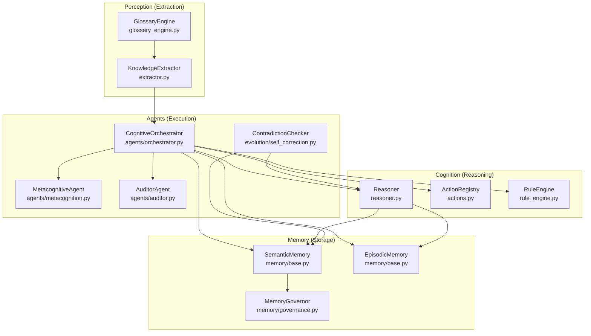
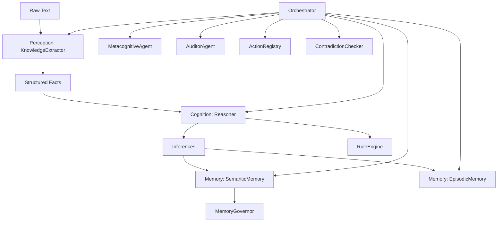
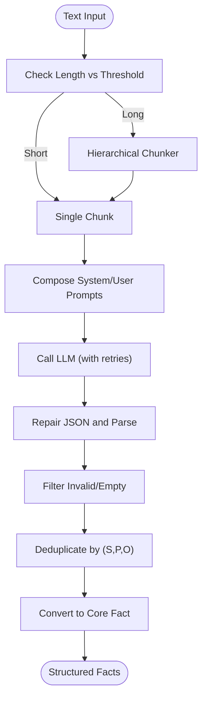
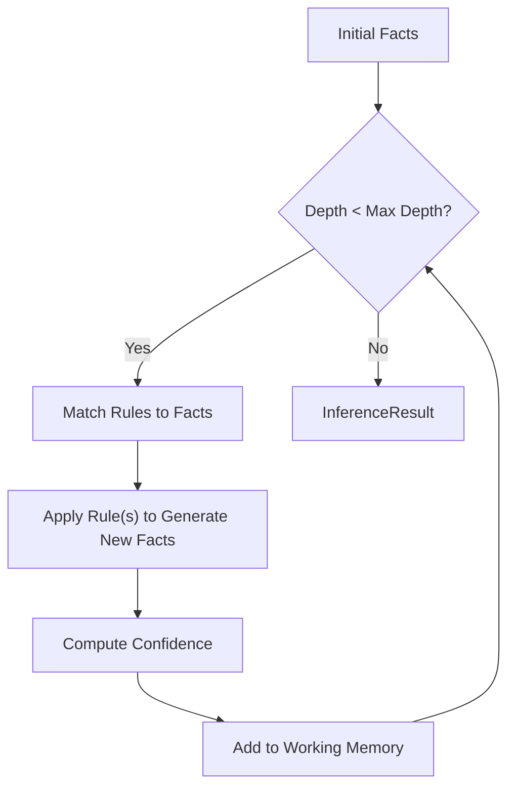
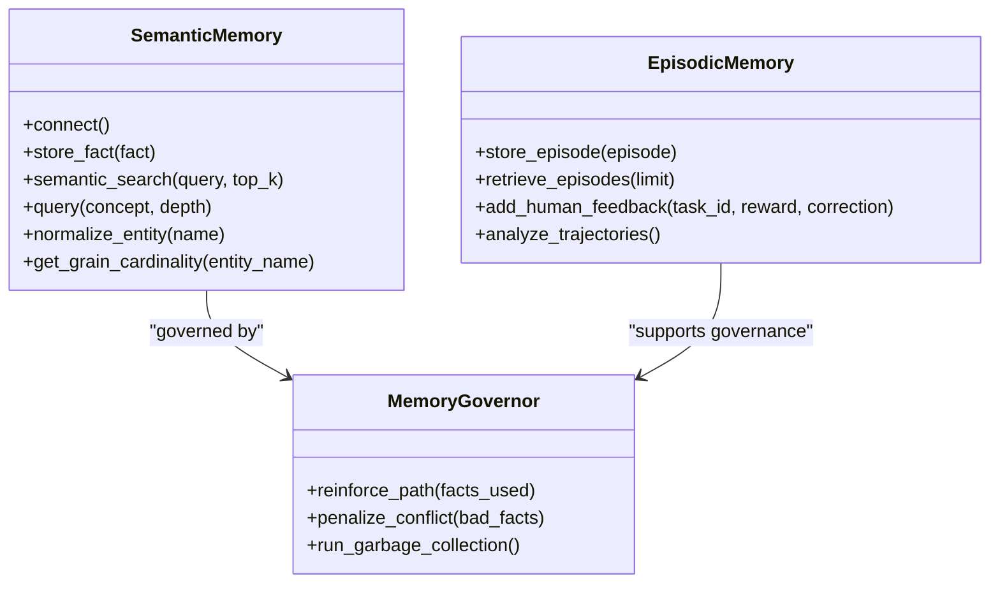
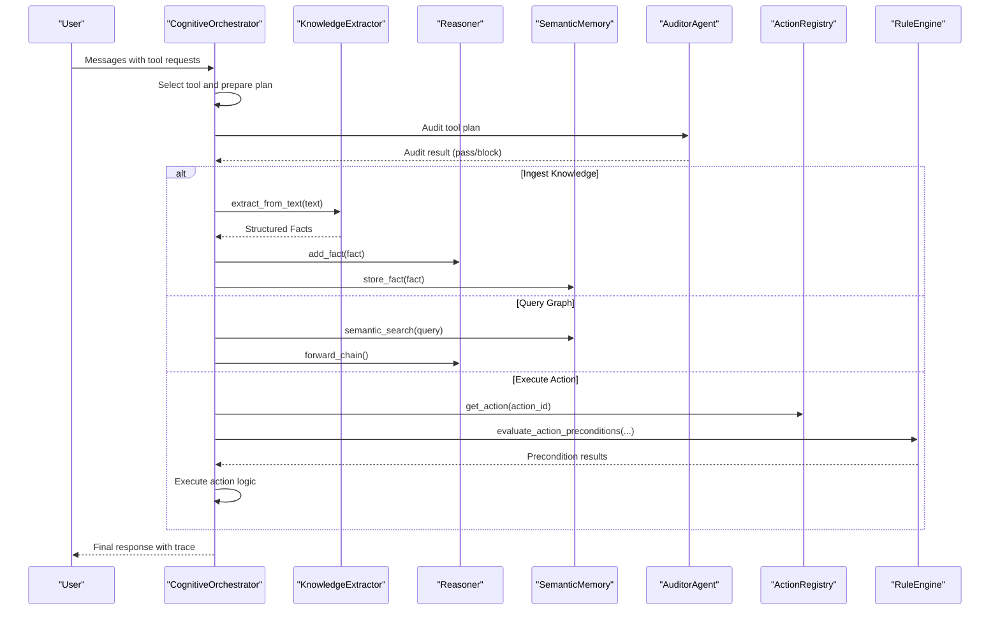
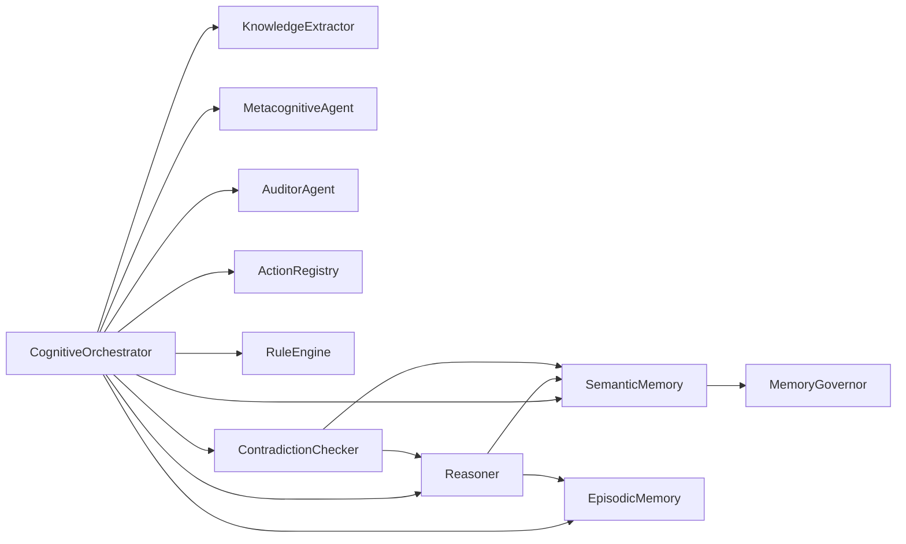

# Layered Architecture

<cite>
**Referenced Files in This Document**
- [architecture.md](file://docs/architecture.md)
- [orchestrator.py](file://src/agents/orchestrator.py)
- [metacognition.py](file://src/agents/metacognition.py)
- [auditor.py](file://src/agents/auditor.py)
- [reasoner.py](file://src/core/reasoner.py)
- [actions.py](file://src/core/ontology/actions.py)
- [rule_engine.py](file://src/core/ontology/rule_engine.py)
- [glossary_engine.py](file://src/perception/glossary_engine.py)
- [extractor.py](file://src/perception/extractor.py)
- [base.py](file://src/memory/base.py)
- [governance.py](file://src/memory/governance.py)
- [self_correction.py](file://src/evolution/self_correction.py)
- [clawra_full_stack_demo.py](file://examples/clawra_full_stack_demo.py)
</cite>

## Table of Contents
1. [Introduction](#introduction)
2. [Project Structure](#project-structure)
3. [Core Components](#core-components)
4. [Architecture Overview](#architecture-overview)
5. [Detailed Component Analysis](#detailed-component-analysis)
6. [Dependency Analysis](#dependency-analysis)
7. [Performance Considerations](#performance-considerations)
8. [Troubleshooting Guide](#troubleshooting-guide)
9. [Conclusion](#conclusion)

## Introduction
This document explains the layered architecture of Clawra, a neuro-symbolic cognitive platform designed around four distinct layers: Perception (Extraction), Cognition (Reasoning), Memory (Storage), and Execution (Action). The Orchestrator acts as the cognitive central nervous system, coordinating between layers and enforcing safety gates. The data transformation pipeline moves from raw text through extraction, reasoning, memory storage, and finally to action execution. We describe responsibilities, interactions, and design rationale, and illustrate the system with code-mapped diagrams.

## Project Structure
The repository organizes functionality by cognitive layer:
- Perception: Extraction and glossary enrichment
- Cognition: Reasoner and rule engine
- Memory: Semantic and episodic memory
- Agents: Orchestrator, metacognition, auditing
- Evolution: Self-correction and governance

**Diagram sources**
- [extractor.py:1-350](file://src/perception/extractor.py#L1-L350)
- [glossary_engine.py:1-71](file://src/perception/glossary_engine.py#L1-L71)
- [reasoner.py:145-800](file://src/core/reasoner.py#L145-L800)
- [actions.py:24-70](file://src/core/ontology/actions.py#L24-L70)
- [rule_engine.py:124-331](file://src/core/ontology/rule_engine.py#L124-L331)
- [base.py:9-249](file://src/memory/base.py#L9-L249)
- [governance.py:6-62](file://src/memory/governance.py#L6-L62)
- [orchestrator.py:23-366](file://src/agents/orchestrator.py#L23-L366)
- [metacognition.py:8-204](file://src/agents/metacognition.py#L8-L204)
- [auditor.py:8-72](file://src/agents/auditor.py#L8-L72)
- [self_correction.py:7-90](file://src/evolution/self_correction.py#L7-L90)

**Section sources**
- [architecture.md:1-35](file://docs/architecture.md#L1-L35)

## Core Components
- Perception (Extraction): Converts unstructured text into structured facts using a KnowledgeExtractor with hierarchical chunking and JSON repair.
- Cognition (Reasoning): A forward/backward chaining reasoner with confidence propagation and rule registry.
- Memory (Storage): Hybrid semantic memory backed by a graph database and vector store, plus episodic memory for trajectories.
- Execution (Action): Orchestrator coordinates ingestion, reasoning, and action execution with auditing and safety gates.

**Section sources**
- [extractor.py:83-350](file://src/perception/extractor.py#L83-L350)
- [reasoner.py:145-800](file://src/core/reasoner.py#L145-L800)
- [base.py:9-249](file://src/memory/base.py#L9-L249)
- [orchestrator.py:23-366](file://src/agents/orchestrator.py#L23-L366)

## Architecture Overview
The four-layer system enforces strict separation of concerns:
- Perception: Extract structured facts from raw text.
- Cognition: Derive conclusions and validate with rules.
- Memory: Persist and retrieve knowledge with governance.
- Execution: Orchestrate tool calls, enforce safety, and execute actions.

**Diagram sources**
- [extractor.py:278-350](file://src/perception/extractor.py#L278-L350)
- [reasoner.py:243-350](file://src/core/reasoner.py#L243-L350)
- [base.py:91-144](file://src/memory/base.py#L91-L144)
- [governance.py:47-62](file://src/memory/governance.py#L47-L62)
- [orchestrator.py:128-366](file://src/agents/orchestrator.py#L128-L366)
- [metacognition.py:92-134](file://src/agents/metacognition.py#L92-L134)
- [auditor.py:24-65](file://src/agents/auditor.py#L24-L65)
- [actions.py:24-70](file://src/core/ontology/actions.py#L24-L70)
- [self_correction.py:46-73](file://src/evolution/self_correction.py#L46-L73)

## Detailed Component Analysis

### Perception (Extraction)
Responsibilities:
- Split long documents into manageable chunks.
- Call LLM to extract structured facts aligned to a core domain ontology.
- Repair and validate JSON outputs.
- Enrich prompts with glossary mappings.

Key behaviors:
- Hierarchical chunking with fallback strategies.
- JSON repair with bracket scanning and truncation recovery.
- Mock LLM mode for testing.
- Deduplication and conversion to core Fact objects.

**Diagram sources**
- [extractor.py:296-350](file://src/perception/extractor.py#L296-L350)
- [extractor.py:190-261](file://src/perception/extractor.py#L190-L261)
- [extractor.py:122-189](file://src/perception/extractor.py#L122-L189)

**Section sources**
- [extractor.py:83-350](file://src/perception/extractor.py#L83-L350)
- [glossary_engine.py:30-71](file://src/perception/glossary_engine.py#L30-L71)

### Cognition (Reasoning)
Responsibilities:
- Forward and backward chaining inference.
- Confidence propagation across derivations.
- Rule registration and evaluation.
- Built-in symmetry and transitivity rules.

Processing logic:
- Pattern matching for rule conditions.
- Applying rules to derive new facts.
- Circuit breaker timeouts to prevent runaway inference.

**Diagram sources**
- [reasoner.py:243-350](file://src/core/reasoner.py#L243-L350)
- [reasoner.py:440-560](file://src/core/reasoner.py#L440-L560)

**Section sources**
- [reasoner.py:145-800](file://src/core/reasoner.py#L145-L800)

### Memory (Storage)
Responsibilities:
- Persist facts to both graph and vector stores.
- Provide semantic search and neighbor traversal.
- Normalize entities and manage grain cardinality heuristics.
- Store and retrieve episodic traces for reinforcement learning feedback.

**Diagram sources**
- [base.py:9-249](file://src/memory/base.py#L9-L249)
- [governance.py:6-62](file://src/memory/governance.py#L6-L62)

**Section sources**
- [base.py:9-249](file://src/memory/base.py#L9-L249)
- [governance.py:6-62](file://src/memory/governance.py#L6-L62)

### Execution (Action)
Responsibilities:
- Tool orchestration: ingest knowledge, query graph, execute action.
- Safety gating: audit tool plans, enforce rule engine preconditions.
- Metacognition: validate reasoning and assess knowledge boundaries.
- Self-correction: detect contradictions and gate unsafe facts.

**Diagram sources**
- [orchestrator.py:128-366](file://src/agents/orchestrator.py#L128-L366)
- [auditor.py:24-65](file://src/agents/auditor.py#L24-L65)
- [actions.py:24-70](file://src/core/ontology/actions.py#L24-L70)
- [rule_engine.py:320-331](file://src/core/ontology/rule_engine.py#L320-L331)

**Section sources**
- [orchestrator.py:23-366](file://src/agents/orchestrator.py#L23-L366)
- [auditor.py:8-72](file://src/agents/auditor.py#L8-L72)
- [metacognition.py:92-134](file://src/agents/metacognition.py#L92-L134)
- [self_correction.py:46-73](file://src/evolution/self_correction.py#L46-L73)

## Dependency Analysis
The Orchestrator composes all subsystems and mediates their interactions. It depends on:
- Perception: KnowledgeExtractor for ingestion.
- Cognition: Reasoner, RuleEngine, ActionRegistry.
- Memory: SemanticMemory, EpisodicMemory, MemoryGovernor.
- Agents: MetacognitiveAgent, AuditorAgent, ContradictionChecker.

**Diagram sources**
- [orchestrator.py:28-42](file://src/agents/orchestrator.py#L28-L42)
- [reasoner.py:162-180](file://src/core/reasoner.py#L162-L180)
- [base.py:91-144](file://src/memory/base.py#L91-L144)
- [governance.py:13-18](file://src/memory/governance.py#L13-L18)
- [self_correction.py:14-16](file://src/evolution/self_correction.py#L14-L16)

**Section sources**
- [orchestrator.py:28-42](file://src/agents/orchestrator.py#L28-L42)
- [reasoner.py:162-180](file://src/core/reasoner.py#L162-L180)
- [base.py:91-144](file://src/memory/base.py#L91-L144)
- [governance.py:13-18](file://src/memory/governance.py#L13-L18)
- [self_correction.py:14-16](file://src/evolution/self_correction.py#L14-L16)

## Performance Considerations
- Inference circuit breakers: Both forward and backward chaining include timeout safeguards to avoid long-running computations.
- Chunking and deduplication: Extraction reduces LLM call volume and avoids redundant facts.
- Vector search and hybrid retrieval: SemanticMemory uses vector similarity to reduce graph traversal scope.
- Async-friendly design: Agents and memory components are structured to support asynchronous operations for scalability.

[No sources needed since this section provides general guidance]

## Troubleshooting Guide
Common issues and mitigations:
- LLM rate limits: Extraction and Orchestrator implement exponential backoff on 429 errors.
- JSON repair failures: Extraction attempts bracket scanning and truncation recovery; logs warnings on failure.
- Knowledge conflicts: ContradictionChecker blocks facts that contradict existing knowledge; falls back to local antonym lists when disconnected.
- Rule engine failures: RuleEngine evaluates expressions in a sandbox; syntax and evaluation errors are surfaced with detailed messages.
- Memory governance pruning: Low-confidence facts are pruned automatically; review governance metrics to tune thresholds.

**Section sources**
- [extractor.py:212-231](file://src/perception/extractor.py#L212-L231)
- [extractor.py:122-189](file://src/perception/extractor.py#L122-L189)
- [self_correction.py:46-73](file://src/evolution/self_correction.py#L46-L73)
- [rule_engine.py:320-331](file://src/core/ontology/rule_engine.py#L320-L331)
- [governance.py:47-62](file://src/memory/governance.py#L47-L62)

## Conclusion
Clawra’s layered architecture cleanly separates perception, cognition, memory, and execution, with the Orchestrator as the central coordinator. This design enables modularity, safety, and maintainability by:
- Enforcing strict data transformations at each layer boundary.
- Using explicit safety gates (auditing, rule engine, contradiction checker).
- Persisting knowledge with governance and episodic memory for continuous improvement.
- Supporting scalable inference and retrieval through hybrid memory and chunking.

[No sources needed since this section summarizes without analyzing specific files]