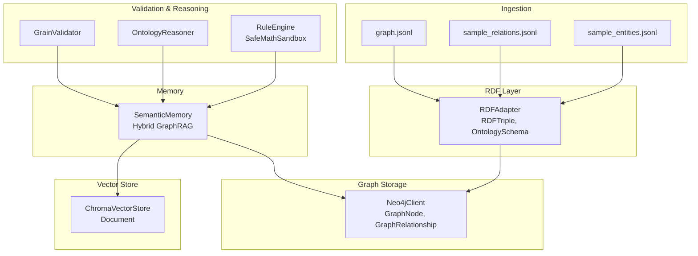
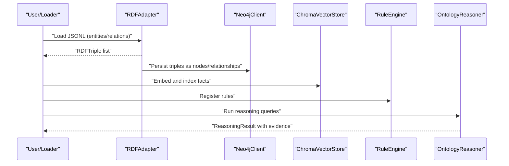
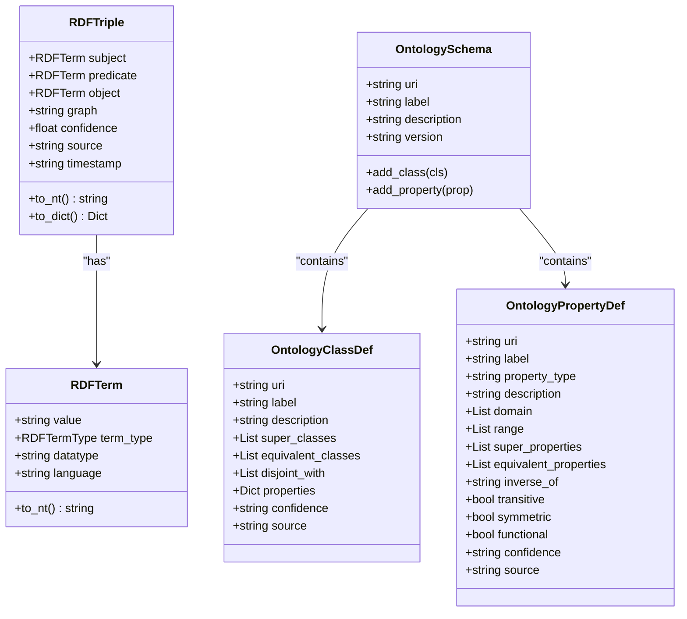
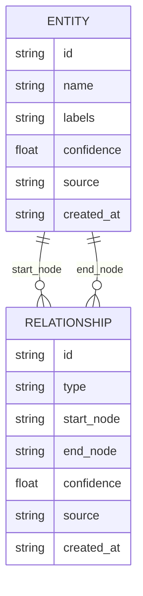
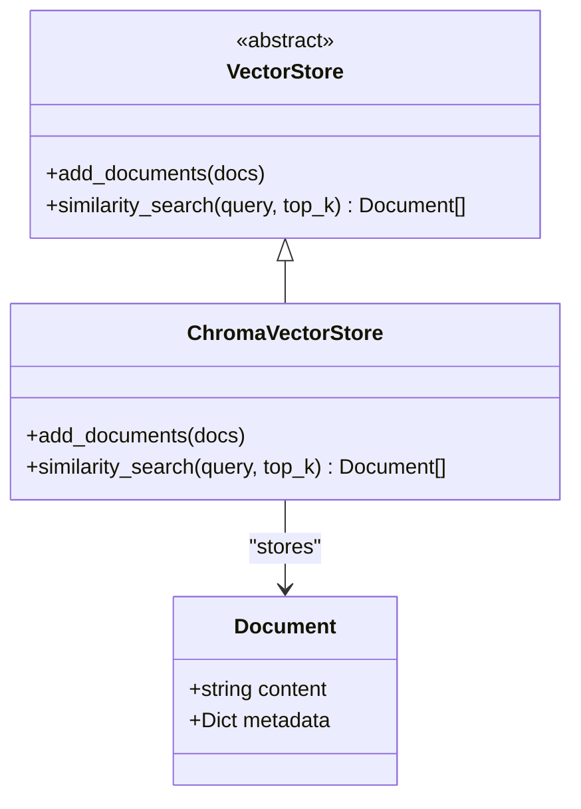
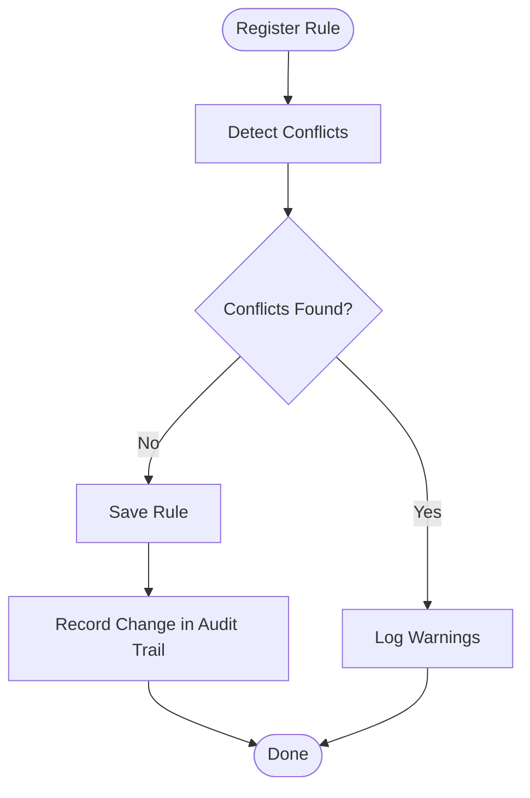
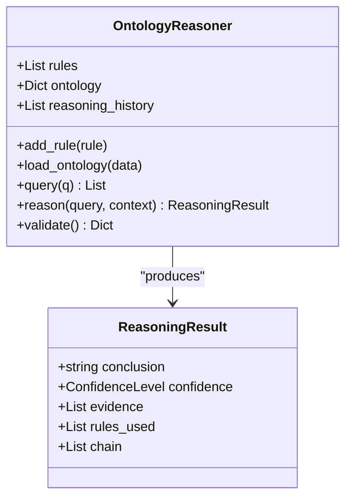
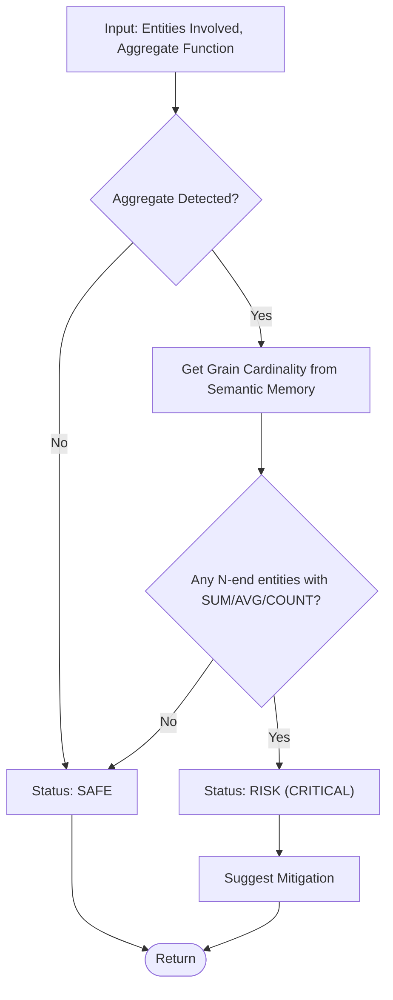
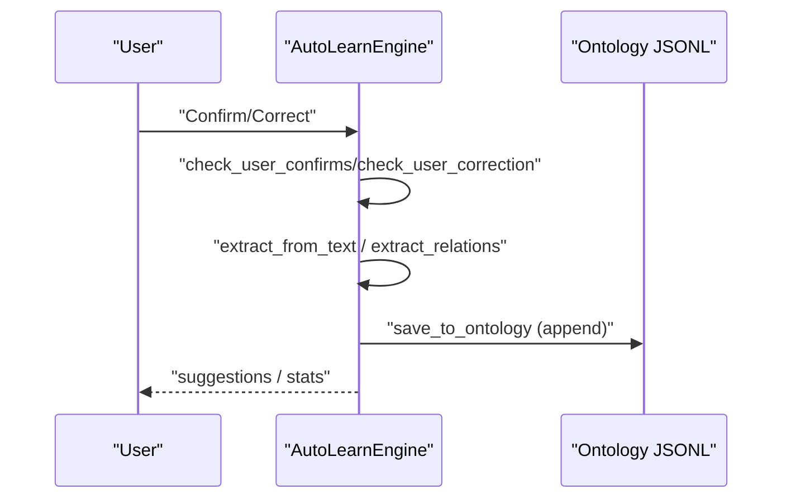
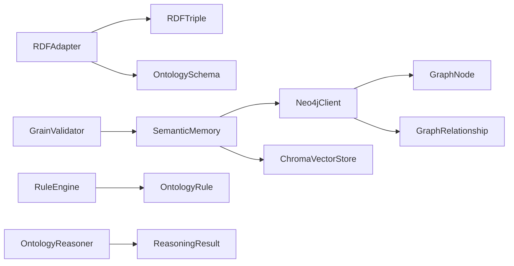

# Data Models and Schema

<cite>
**Referenced Files in This Document**
- [sample_entities.jsonl](file://data/sample_entities.jsonl)
- [sample_relations.jsonl](file://data/sample_relations.jsonl)
- [graph.jsonl](file://data/legacy_memory/ontology/graph.jsonl)
- [rdf_adapter.py](file://src/core/ontology/rdf_adapter.py)
- [reasoner.py](file://src/core/ontology/reasoner.py)
- [rule_engine.py](file://src/core/ontology/rule_engine.py)
- [grain_validator.py](file://src/core/ontology/grain_validator.py)
- [neo4j_adapter.py](file://src/memory/neo4j_adapter.py)
- [vector_adapter.py](file://src/memory/vector_adapter.py)
- [base.py](file://src/memory/base.py)
- [auto_learn.py](file://src/core/ontology/auto_learn.py)
</cite>

## Table of Contents
1. [Introduction](#introduction)
2. [Project Structure](#project-structure)
3. [Core Components](#core-components)
4. [Architecture Overview](#architecture-overview)
5. [Detailed Component Analysis](#detailed-component-analysis)
6. [Dependency Analysis](#dependency-analysis)
7. [Performance Considerations](#performance-considerations)
8. [Troubleshooting Guide](#troubleshooting-guide)
9. [Conclusion](#conclusion)
10. [Appendices](#appendices)

## Introduction
This document specifies the data models and schemas used across the knowledge representation systems. It covers entity and relationship schemas, field definitions, and data types; the RDF triple format and confidence scoring mechanisms; evidence chain structures; graph database modeling (Neo4j); indexing strategies and constraints; validation rules and business logic; lifecycle management and archival strategies; and security and privacy controls for sensitive knowledge bases.

## Project Structure
The knowledge representation stack integrates:
- JSONL ingestion for entities and relations
- RDF/OWL conversion and serialization
- Neo4j graph storage with confidence-aware relationships
- Vector store for semantic similarity search
- Rule engine for deterministic validation
- Active learning for incremental knowledge growth

**Diagram sources**
- [sample_entities.jsonl:1-6](file://data/sample_entities.jsonl#L1-L6)
- [sample_relations.jsonl:1-5](file://data/sample_relations.jsonl#L1-L5)
- [graph.jsonl:1-22](file://data/legacy_memory/ontology/graph.jsonl#L1-L22)
- [rdf_adapter.py:145-616](file://src/core/ontology/rdf_adapter.py#L145-L616)
- [neo4j_adapter.py:130-974](file://src/memory/neo4j_adapter.py#L130-L974)
- [vector_adapter.py:19-91](file://src/memory/vector_adapter.py#L19-L91)
- [rule_engine.py:124-331](file://src/core/ontology/rule_engine.py#L124-L331)
- [reasoner.py:24-104](file://src/core/ontology/reasoner.py#L24-L104)
- [grain_validator.py:13-61](file://src/core/ontology/grain_validator.py#L13-L61)
- [base.py:9-249](file://src/memory/base.py#L9-L249)

**Section sources**
- [sample_entities.jsonl:1-6](file://data/sample_entities.jsonl#L1-L6)
- [sample_relations.jsonl:1-5](file://data/sample_relations.jsonl#L1-L5)
- [graph.jsonl:1-22](file://data/legacy_memory/ontology/graph.jsonl#L1-L22)

## Core Components
This section defines the core data structures and their roles in the knowledge representation pipeline.

- RDF Triple Model
  - Subject, Predicate, Object terms with type URIs, blank nodes, or literals
  - Confidence score per triple
  - Optional graph name, source, and timestamp
  - Serialization to N-Triples, Turtle, and JSON-LD

- Neo4j Graph Model
  - Nodes represent entities with labels and properties; include confidence, source, created_at
  - Relationships represent typed edges with properties; include confidence, source, created_at
  - Inference paths track nodes, relationships, cumulative confidence, and rule IDs

- Vector Store Model
  - Documents carry content and metadata (including source and confidence)
  - ChromaDB-backed persistent collection for semantic similarity search

- Rule Engine Model
  - OntologyRule with expression, target class, description, version, created_at, metadata
  - SafeMathSandbox evaluates expressions securely
  - Conflict detection across rules targeting the same class

- Reasoning Model
  - Confidence levels: CONFIRMED, ASSUMED, SPECULATIVE, UNKNOWN
  - ReasoningResult captures conclusion, confidence, evidence, rules used, and chain

- Grain Validator Model
  - Validates query logic against entity grain cardinality to prevent fan-trap risks

- Auto Learn Model
  - ExtractedEntity and ExtractedRelation with confidence and source
  - LearningEvent logs extraction and suggestion actions
  - Confidence level upgrades and callbacks

**Section sources**
- [rdf_adapter.py:33-84](file://src/core/ontology/rdf_adapter.py#L33-L84)
- [neo4j_adapter.py:56-128](file://src/memory/neo4j_adapter.py#L56-L128)
- [vector_adapter.py:13-91](file://src/memory/vector_adapter.py#L13-L91)
- [rule_engine.py:88-123](file://src/core/ontology/rule_engine.py#L88-L123)
- [reasoner.py:10-23](file://src/core/ontology/reasoner.py#L10-L23)
- [grain_validator.py:7-12](file://src/core/ontology/grain_validator.py#L7-L12)
- [auto_learn.py:46-75](file://src/core/ontology/auto_learn.py#L46-L75)

## Architecture Overview
The system transforms unstructured or semi-structured knowledge into a structured RDF graph, persists it in Neo4j, and augments retrieval with vector embeddings. Validation and reasoning enforce business rules and confidence propagation.

**Diagram sources**
- [rdf_adapter.py:282-355](file://src/core/ontology/rdf_adapter.py#L282-L355)
- [neo4j_adapter.py:220-413](file://src/memory/neo4j_adapter.py#L220-L413)
- [vector_adapter.py:57-91](file://src/memory/vector_adapter.py#L57-L91)
- [rule_engine.py:124-331](file://src/core/ontology/rule_engine.py#L124-L331)
- [reasoner.py:55-86](file://src/core/ontology/reasoner.py#L55-L86)

## Detailed Component Analysis

### RDF Triple Model and Confidence Scoring
- Data model
  - RDFTerm supports URI, blank node, and literal with datatype/language
  - RDFTriple stores subject/predicate/object, plus graph, confidence, source, timestamp
  - OntologySchema, OntologyClassDef, OntologyPropertyDef define OWL constructs with confidence/source
- Confidence scoring
  - Confidence is a float per triple and propagated along inference paths
  - Propagation supports min, arithmetic mean, geometric mean, and multiplicative strategies
- Evidence chains
  - Inference tracing returns ordered nodes, relationships, and cumulative confidence
- Serialization
  - N-Triples, Turtle, JSON-LD export supported

**Diagram sources**
- [rdf_adapter.py:26-143](file://src/core/ontology/rdf_adapter.py#L26-L143)

**Section sources**
- [rdf_adapter.py:617-778](file://src/core/ontology/rdf_adapter.py#L617-L778)

### Neo4j Graph Model and Indexing
- Node model
  - GraphNode: id, labels, properties, confidence, source, created_at
- Relationship model
  - GraphRelationship: id, type, start_node, end_node, properties, confidence, source, created_at
- Inference path model
  - InferencePath: nodes, relationships, confidence, rule_ids, depth
- Indexing
  - Entity name, labels, and confidence indexes created for performance
- Constraints and integrity
  - Relationship types sanitized to Cypher-safe identifiers
  - Batch import merges entities and creates relationships with confidence/source

**Diagram sources**
- [neo4j_adapter.py:56-128](file://src/memory/neo4j_adapter.py#L56-L128)
- [neo4j_adapter.py:824-837](file://src/memory/neo4j_adapter.py#L824-L837)

**Section sources**
- [neo4j_adapter.py:130-974](file://src/memory/neo4j_adapter.py#L130-L974)

### Vector Store Model
- Document carries content and metadata
- ChromaVectorStore persists and retrieves semantically similar documents
- Used alongside Neo4j for hybrid retrieval

**Diagram sources**
- [vector_adapter.py:13-91](file://src/memory/vector_adapter.py#L13-L91)

**Section sources**
- [vector_adapter.py:31-91](file://src/memory/vector_adapter.py#L31-L91)

### Rule Engine and Business Logic
- OntologyRule encapsulates target class, expression, description, version, created_at, metadata
- SafeMathSandbox evaluates expressions safely using AST
- Conflict detection identifies contradictory rules targeting the same class
- Audit trail records rule creation/update/delete events

**Diagram sources**
- [rule_engine.py:172-250](file://src/core/ontology/rule_engine.py#L172-L250)

**Section sources**
- [rule_engine.py:124-331](file://src/core/ontology/rule_engine.py#L124-L331)

### Reasoning and Confidence Tracking
- Confidence levels classify assertions
- ReasoningResult aggregates evidence, rules used, and chain steps
- OntologyReasoner performs rule-based inference and confidence assignment

**Diagram sources**
- [reasoner.py:16-104](file://src/core/ontology/reasoner.py#L16-L104)

**Section sources**
- [reasoner.py:24-104](file://src/core/ontology/reasoner.py#L24-L104)

### Grain Validator and Fan-trap Prevention
- Validates whether aggregations on 1:N relationships risk fan-trap
- Uses dynamic grain cardinality from semantic memory
- Suggests mitigations (e.g., pre-aggregation or distinct handling)

**Diagram sources**
- [grain_validator.py:24-55](file://src/core/ontology/grain_validator.py#L24-L55)

**Section sources**
- [grain_validator.py:13-61](file://src/core/ontology/grain_validator.py#L13-L61)

### Active Learning and Knowledge Growth
- ExtractedEntity and ExtractedRelation capture inferred knowledge with confidence and source
- AutoLearnEngine detects user confirmation/correction, suggests supplements, and writes to ontology
- Confidence upgrades and callbacks enable iterative refinement

**Diagram sources**
- [auto_learn.py:151-188](file://src/core/ontology/auto_learn.py#L151-L188)
- [auto_learn.py:260-329](file://src/core/ontology/auto_learn.py#L260-L329)

**Section sources**
- [auto_learn.py:77-405](file://src/core/ontology/auto_learn.py#L77-L405)

## Dependency Analysis
Key dependencies and relationships:
- RDFAdapter depends on RDFTerm/RDFTriple/OntologySchema for serialization and schema definition
- Neo4jClient depends on GraphNode/GraphRelationship/InferencePath for persistence and traversal
- SemanticMemory composes Neo4jClient and ChromaVectorStore for hybrid retrieval
- RuleEngine validates facts against business rules
- OntologyReasoner consumes rules and ontology data for inference
- GrainValidator enforces query-time integrity checks

**Diagram sources**
- [rdf_adapter.py:145-616](file://src/core/ontology/rdf_adapter.py#L145-L616)
- [neo4j_adapter.py:130-974](file://src/memory/neo4j_adapter.py#L130-L974)
- [base.py:9-249](file://src/memory/base.py#L9-L249)
- [rule_engine.py:124-331](file://src/core/ontology/rule_engine.py#L124-L331)
- [reasoner.py:24-104](file://src/core/ontology/reasoner.py#L24-L104)
- [grain_validator.py:13-61](file://src/core/ontology/grain_validator.py#L13-L61)

**Section sources**
- [rdf_adapter.py:145-616](file://src/core/ontology/rdf_adapter.py#L145-L616)
- [neo4j_adapter.py:130-974](file://src/memory/neo4j_adapter.py#L130-L974)
- [base.py:9-249](file://src/memory/base.py#L9-L249)
- [rule_engine.py:124-331](file://src/core/ontology/rule_engine.py#L124-L331)
- [reasoner.py:24-104](file://src/core/ontology/reasoner.py#L24-L104)
- [grain_validator.py:13-61](file://src/core/ontology/grain_validator.py#L13-L61)

## Performance Considerations
- Graph traversal and inference
  - Use indexes on entity name, labels, and confidence to accelerate lookups
  - Prefer breadth-first traversal with depth limits to cap inference cost
- Vector similarity
  - Tune top_k and embedding quality to balance recall and latency
- Batch operations
  - Use batch import for large-scale triple ingestion
- Confidence propagation
  - Limit max_depth to control computational overhead

[No sources needed since this section provides general guidance]

## Troubleshooting Guide
- RDF serialization issues
  - Verify term types and datatype/language tags for literals
  - Confirm prefix expansion and base URI handling
- Neo4j connectivity
  - Ensure driver availability and credentials; fall back to memory mode when unavailable
  - Check relationship type sanitization to avoid Cypher errors
- Rule evaluation failures
  - Inspect SafeMathSandbox exceptions and variable resolution
  - Review conflict warnings during rule registration
- Fan-trap detection
  - Validate entity grain cardinality and adjust aggregation strategy

**Section sources**
- [rdf_adapter.py:200-278](file://src/core/ontology/rdf_adapter.py#L200-L278)
- [neo4j_adapter.py:176-200](file://src/memory/neo4j_adapter.py#L176-L200)
- [rule_engine.py:33-86](file://src/core/ontology/rule_engine.py#L33-L86)
- [grain_validator.py:24-55](file://src/core/ontology/grain_validator.py#L24-L55)

## Conclusion
The knowledge representation system combines RDF triples, Neo4j graph storage, vector embeddings, and rule-based validation to form a robust, confidence-aware knowledge platform. Clear data models, explicit confidence scoring, and evidence chains enable transparent reasoning. Indexing and traversal strategies ensure scalability, while active learning and grain validation maintain data integrity and prevent common pitfalls.

[No sources needed since this section summarizes without analyzing specific files]

## Appendices

### Data Model Definitions and Field Specifications

- RDF Triple Fields
  - subject: RDFTerm (URI/blank/literal)
  - predicate: RDFTerm (URI)
  - object: RDFTerm (URI/blank/literal)
  - graph: string (optional)
  - confidence: float (default 1.0)
  - source: string (default unknown)
  - timestamp: ISO string (optional)

- Neo4j Node Fields
  - id: string
  - labels: list of strings
  - properties: dict
  - confidence: float
  - source: string
  - created_at: ISO string

- Neo4j Relationship Fields
  - id: string
  - type: string (sanitized)
  - start_node: string
  - end_node: string
  - properties: dict
  - confidence: float
  - source: string
  - created_at: ISO string

- Document Fields
  - content: string
  - metadata: dict (e.g., source, confidence)

- OntologyRule Fields
  - id: string
  - target_object_class: string
  - expression: string
  - description: string
  - version: string
  - created_at: ISO string
  - metadata: dict

- ReasoningResult Fields
  - conclusion: string
  - confidence: enum (CONFIRMED, ASSUMED, SPECULATIVE, UNKNOWN)
  - evidence: list of dicts
  - rules_used: list of strings
  - chain: list of dicts

- GrainValidator Inputs
  - entities_involved: list of strings
  - aggregate_func: string (optional)

**Section sources**
- [rdf_adapter.py:33-84](file://src/core/ontology/rdf_adapter.py#L33-L84)
- [neo4j_adapter.py:56-99](file://src/memory/neo4j_adapter.py#L56-L99)
- [vector_adapter.py:13-18](file://src/memory/vector_adapter.py#L13-L18)
- [rule_engine.py:88-123](file://src/core/ontology/rule_engine.py#L88-L123)
- [reasoner.py:16-23](file://src/core/ontology/reasoner.py#L16-L23)
- [grain_validator.py:24-29](file://src/core/ontology/grain_validator.py#L24-L29)

### Sample Data Examples

- Entities (sample_entities.jsonl)
  - Example fields: id, type, name, role, properties (e.g., skill list, experience_years)

- Relations (sample_relations.jsonl)
  - Example fields: id, type, start_node, end_node, properties, confidence

- Legacy Graph (graph.jsonl)
  - Example fields: op (create/relate), entity (with id, type, properties, timestamps), timestamp; or from/to with rel and properties

**Section sources**
- [sample_entities.jsonl:1-6](file://data/sample_entities.jsonl#L1-L6)
- [sample_relations.jsonl:1-5](file://data/sample_relations.jsonl#L1-L5)
- [graph.jsonl:1-22](file://data/legacy_memory/ontology/graph.jsonl#L1-L22)

### Data Lifecycle Management and Archival
- Persistence
  - Neo4j: nodes and relationships persisted with confidence/source/timestamp
  - Vector store: documents indexed for semantic search
  - Episodic memory: SQLite-based episode storage for trajectory analysis and human feedback
- Archival
  - Consider exporting RDF/Turtle/JSON-LD snapshots for long-term archival
  - Maintain audit trails for rules and learning events
- Retention
  - Define retention policies for episodes and temporary facts; archive or prune as needed

**Section sources**
- [neo4j_adapter.py:220-413](file://src/memory/neo4j_adapter.py#L220-L413)
- [vector_adapter.py:57-91](file://src/memory/vector_adapter.py#L57-L91)
- [base.py:150-249](file://src/memory/base.py#L150-L249)

### Security, Access Control, and Privacy
- Access control
  - Enforce Neo4j authentication and least-privilege roles
  - Restrict write access to trusted clients and validated rules
- Privacy
  - Avoid ingesting sensitive personal data; sanitize or anonymize where necessary
  - Respect data minimization and purpose limitation
- Integrity
  - Use rule engine to gate critical actions and prevent invalid state transitions
  - Track provenance via source fields and timestamps

**Section sources**
- [neo4j_adapter.py:150-200](file://src/memory/neo4j_adapter.py#L150-L200)
- [rule_engine.py:124-171](file://src/core/ontology/rule_engine.py#L124-L171)
- [base.py:150-249](file://src/memory/base.py#L150-L249)