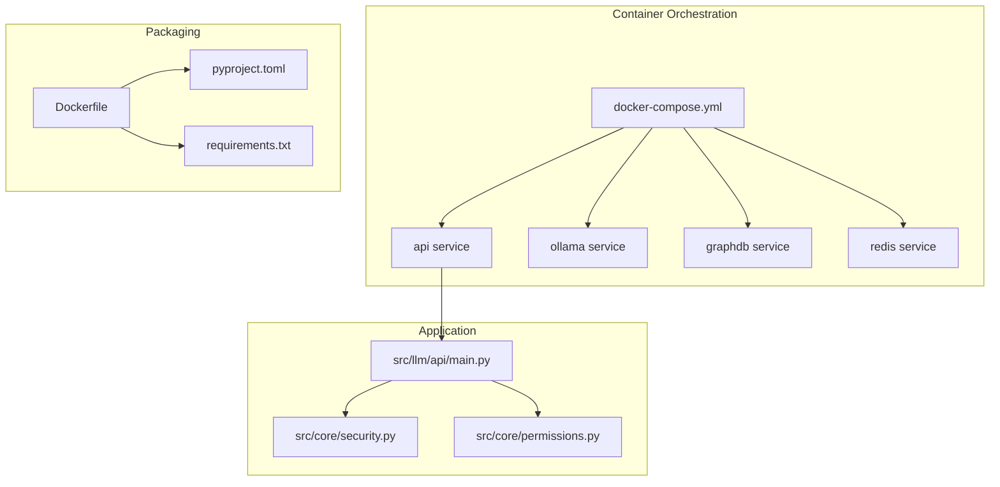
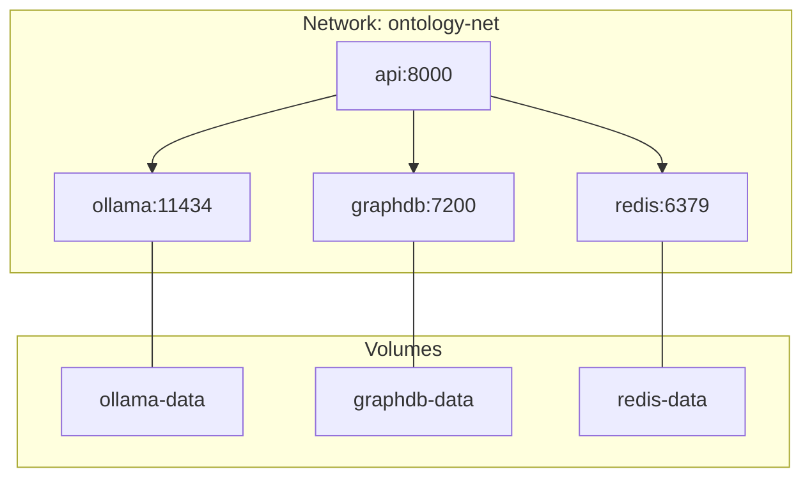
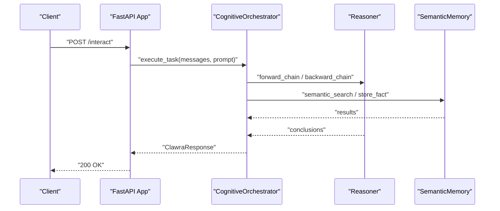
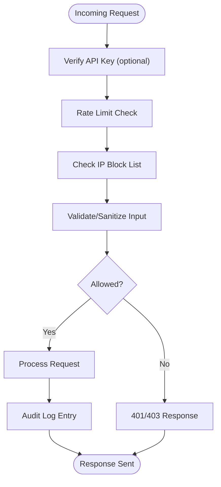
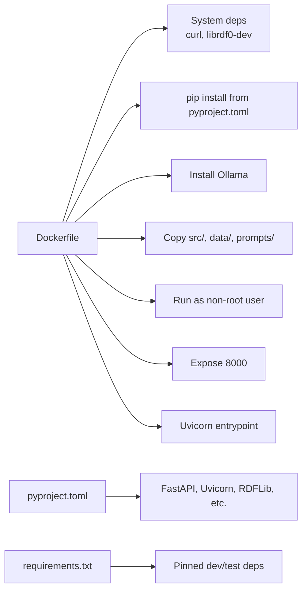

# Deployment and Operations

<cite>
**Referenced Files in This Document**
- [Dockerfile](file://Dockerfile)
- [docker-compose.yml](file://docker-compose.yml)
- [pyproject.toml](file://pyproject.toml)
- [requirements.txt](file://requirements.txt)
- [src/llm/api/main.py](file://src/llm/api/main.py)
- [src/core/security.py](file://src/core/security.py)
- [src/core/permissions.py](file://src/core/permissions.py)
- [.github/workflows/ci.yml](file://.github/workflows/ci.yml)
- [.github/workflows/ontology-validate.yml](file://.github/workflows/ontology-validate.yml)
</cite>

## Table of Contents
1. [Introduction](#introduction)
2. [Project Structure](#project-structure)
3. [Core Components](#core-components)
4. [Architecture Overview](#architecture-overview)
5. [Detailed Component Analysis](#detailed-component-analysis)
6. [Dependency Analysis](#dependency-analysis)
7. [Performance Considerations](#performance-considerations)
8. [Monitoring and Logging](#monitoring-and-logging)
9. [Backup and Recovery](#backup-and-recovery)
10. [Security and Access Control](#security-and-access-control)
11. [Scaling and Resource Management](#scaling-and-resource-management)
12. [CI/CD and Automated Testing](#cicd-and-automated-testing)
13. [Troubleshooting Guide](#troubleshooting-guide)
14. [Conclusion](#conclusion)

## Introduction
This document provides production-grade deployment and operations guidance for the Ontology Platform. It covers containerization with Docker, orchestration via docker-compose, environment configuration, security controls, observability, performance tuning, backup/recovery, and CI/CD integration. The goal is to enable reliable, scalable, and secure operations for the neuro-symbolic cognitive platform built on FastAPI, supporting knowledge ingestion, reasoning, and rule management.

## Project Structure
The repository includes:
- Containerization artifacts: Dockerfile and docker-compose.yml
- Application packaging and dependencies: pyproject.toml and requirements.txt
- API entrypoint and core services: src/llm/api/main.py
- Security and permissions modules: src/core/security.py and src/core/permissions.py
- CI/CD workflows: .github/workflows/*.yml

**Diagram sources**
- [docker-compose.yml](file://docker-compose.yml)
- [Dockerfile](file://Dockerfile)
- [pyproject.toml](file://pyproject.toml)
- [requirements.txt](file://requirements.txt)
- [src/llm/api/main.py](file://src/llm/api/main.py)
- [src/core/security.py](file://src/core/security.py)
- [src/core/permissions.py](file://src/core/permissions.py)

**Section sources**
- [Dockerfile](file://Dockerfile)
- [docker-compose.yml](file://docker-compose.yml)
- [pyproject.toml](file://pyproject.toml)
- [requirements.txt](file://requirements.txt)
- [src/llm/api/main.py](file://src/llm/api/main.py)
- [src/core/security.py](file://src/core/security.py)
- [src/core/permissions.py](file://src/core/permissions.py)

## Core Components
- API service: FastAPI application exposing endpoints for knowledge ingestion, querying, reasoning, rule management, and learning.
- Security module: Provides API key verification, rate limiting, IP blocking, input validation, and audit logging.
- Permissions module: Implements RBAC with roles, permissions, and resource-level access checks.
- Supporting services: Local LLM (Ollama), GraphDB (RDF knowledge graph), and Redis (caching).

Operational highlights:
- Health and status endpoints support monitoring.
- Environment-driven configuration for external services and logging level.
- Non-root container user and minimal base image for security.

**Section sources**
- [src/llm/api/main.py](file://src/llm/api/main.py)
- [src/core/security.py](file://src/core/security.py)
- [src/core/permissions.py](file://src/core/permissions.py)
- [docker-compose.yml](file://docker-compose.yml)

## Architecture Overview
The platform runs as a multi-container application:
- API service depends on Ollama (LLM), GraphDB (RDF storage), and Redis (cache).
- Volumes persist data for LLM models, GraphDB, and Redis.
- Networking isolates services on a dedicated bridge network.
- Restart policies ensure resilience.

**Diagram sources**
- [docker-compose.yml](file://docker-compose.yml)

**Section sources**
- [docker-compose.yml](file://docker-compose.yml)

## Detailed Component Analysis

### API Service and Endpoints
The API exposes:
- Root and health/status endpoints
- Knowledge ingestion and fact management
- Query and reasoning endpoints (forward/backward)
- Rule management and evaluation
- Interactive endpoint for unified tasks
- Episode and feedback endpoints for learning

Security and middleware:
- Optional API key verification via bearer token
- CORS configured for broad compatibility
- Lifecycle hooks for initialization and shutdown

**Diagram sources**
- [src/llm/api/main.py](file://src/llm/api/main.py)

**Section sources**
- [src/llm/api/main.py](file://src/llm/api/main.py)

### Security and Access Control
- API key verification: Optional bearer token authentication; invalid keys rejected.
- Rate limiting: Token-bucket rate limiter configurable per minute and burst size.
- IP blocking: Tracks failed attempts and blocks IPs exceeding thresholds.
- Input validation: Sanitization and pattern checks for queries and URIs.
- Audit logging: Structured logs for auth attempts, authorization failures, rate limit events, and sensitive operations.
- RBAC: Roles and permissions for read/write/admin operations; resource ownership checks.

**Diagram sources**
- [src/core/security.py](file://src/core/security.py)
- [src/core/permissions.py](file://src/core/permissions.py)
- [src/llm/api/main.py](file://src/llm/api/main.py)

**Section sources**
- [src/core/security.py](file://src/core/security.py)
- [src/core/permissions.py](file://src/core/permissions.py)
- [src/llm/api/main.py](file://src/llm/api/main.py)

## Dependency Analysis
- Packaging: pyproject.toml defines core dependencies and optional extras; requirements.txt lists pinned packages for reproducibility.
- Container build: Dockerfile installs system dependencies, Python dependencies, sets up Ollama, copies application code, creates a non-root user, exposes port 8000, and starts Uvicorn.

**Diagram sources**
- [Dockerfile](file://Dockerfile)
- [pyproject.toml](file://pyproject.toml)
- [requirements.txt](file://requirements.txt)

**Section sources**
- [Dockerfile](file://Dockerfile)
- [pyproject.toml](file://pyproject.toml)
- [requirements.txt](file://requirements.txt)

## Performance Considerations
- Container sizing: docker-compose sets GPU device reservations for Ollama; tune memory limits according to workload.
- Service isolation: Separate containers for LLM, GraphDB, and Redis reduce contention.
- Caching: Redis volume persists AOF data; configure appropriate memory and persistence for production.
- Logging: Adjust LOG_LEVEL to balance verbosity and overhead.
- Concurrency: Uvicorn workers and application-level batching should be tuned for throughput and latency targets.

[No sources needed since this section provides general guidance]

## Monitoring and Logging
- Health endpoint: Use GET /health for liveness/readiness checks.
- Status endpoint: GET /status provides counts and connectivity status.
- Logs: Configure application log level via environment variable; ensure stdout/stderr capture in container runtime.
- Metrics: Consider integrating metrics collection (e.g., Prometheus) and tracing for production deployments.

**Section sources**
- [src/llm/api/main.py](file://src/llm/api/main.py)
- [docker-compose.yml](file://docker-compose.yml)

## Backup and Recovery
- Data volumes:
  - ollama-data: Persist local LLM models and cache.
  - graphdb-data: Persist GraphDB RDF store.
  - redis-data: Persist Redis AOF snapshots.
- Backup strategy:
  - Schedule periodic tar/zstd backups of the three volumes.
  - Store offsite and encrypt backups.
  - Test restoration procedures regularly.
- Disaster recovery:
  - Document restore steps for each volume.
  - Maintain immutable snapshots for rollback.
  - Automate recovery drills quarterly.

**Section sources**
- [docker-compose.yml](file://docker-compose.yml)

## Security and Access Control
- API keys: Enable optional bearer token authentication; rotate keys periodically.
- Network: Services communicate within a dedicated bridge network; restrict host exposure.
- Secrets: Manage API keys and service credentials via environment variables or secret managers.
- Hardening:
  - Run as non-root user inside the container.
  - Minimize installed packages and OS surface area.
  - Apply least privilege to mounted volumes.
- Auditing: Enable structured audit logs for security events.

**Section sources**
- [src/llm/api/main.py](file://src/llm/api/main.py)
- [src/core/security.py](file://src/core/security.py)
- [src/core/permissions.py](file://src/core/permissions.py)
- [Dockerfile](file://Dockerfile)
- [docker-compose.yml](file://docker-compose.yml)

## Scaling and Resource Management
- Horizontal scaling: Deploy multiple API replicas behind a load balancer; ensure shared state is externalized (GraphDB/Redis).
- Vertical scaling: Increase CPU/memory limits for API and Ollama based on observed utilization.
- GPU acceleration: Leverage NVIDIA device reservations for Ollama where applicable.
- Queueing: Offload long-running tasks to a queue/job system if needed.
- Connection pooling: Tune GraphDB and Redis connection pools to service concurrency.

**Section sources**
- [docker-compose.yml](file://docker-compose.yml)

## CI/CD and Automated Testing
- CI workflow: Runs linting and tests across multiple Python versions; sets PYTHONPATH for tests.
- Ontology validation: Validates RDF/Turtle/XML files and uploads a report artifact.
- Recommendations:
  - Add automated container build and push on tagged releases.
  - Integrate security scanning for images and dependencies.
  - Gate deployments with pre-flight checks (health, schema validation).
  - Use blue/green or rolling updates for zero-downtime deployments.

**Section sources**
- [.github/workflows/ci.yml](file://.github/workflows/ci.yml)
- [.github/workflows/ontology-validate.yml](file://.github/workflows/ontology-validate.yml)

## Troubleshooting Guide
Common issues and resolutions:
- API fails to start:
  - Verify port 8000 is free and accessible.
  - Confirm environment variables for external services are set.
- Ollama connectivity:
  - Ensure Ollama service is healthy and reachable on port 11434.
  - Check GPU device reservations if using accelerated inference.
- GraphDB connectivity:
  - Validate GraphDB heap size and data volume mounts.
- Redis connectivity:
  - Confirm Redis persistence and exposed port.
- Authentication failures:
  - Check API key correctness and expiration.
  - Review rate limiting and IP blocking logs.
- Slow queries or reasoning:
  - Inspect logs for errors and adjust concurrency.
  - Scale Ollama/GraphDB/Redis resources as needed.

**Section sources**
- [src/llm/api/main.py](file://src/llm/api/main.py)
- [src/core/security.py](file://src/core/security.py)
- [docker-compose.yml](file://docker-compose.yml)

## Conclusion
This guide outlines a production-ready deployment model for the Ontology Platform using Docker and docker-compose, with robust security, observability, and operational practices. By following the recommendations here—container hardening, resource planning, backup/recovery, CI/CD automation, and monitoring—you can achieve reliable, scalable, and secure operations for the cognitive reasoning platform.