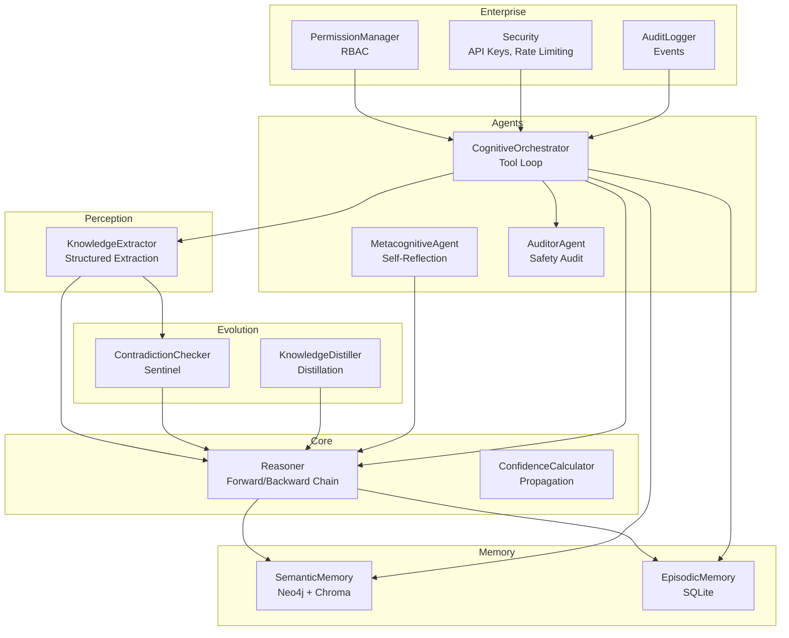
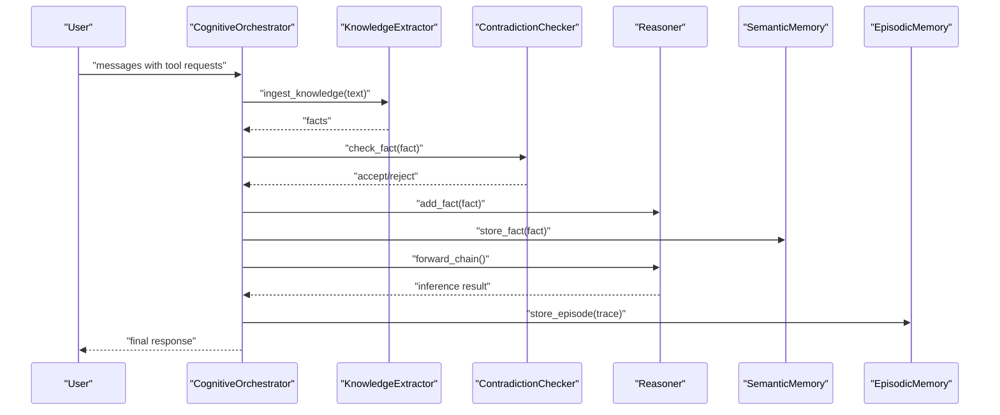
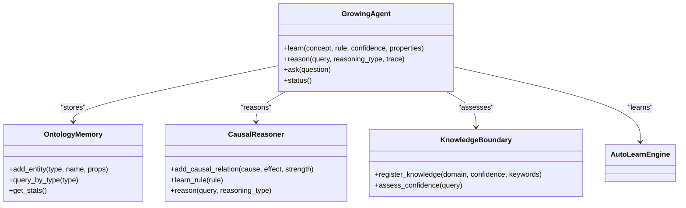
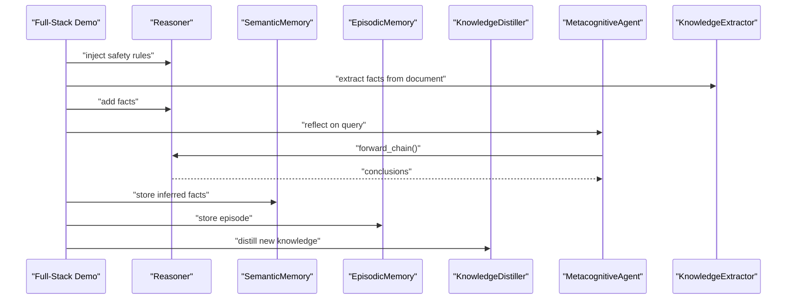
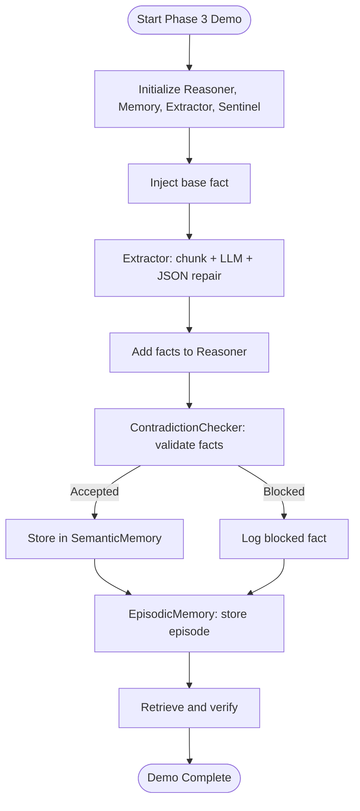
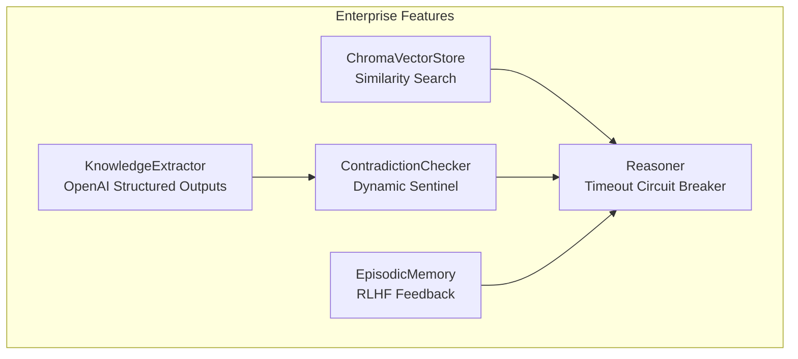
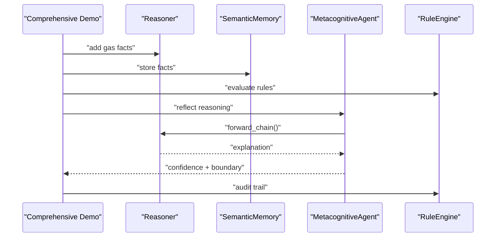
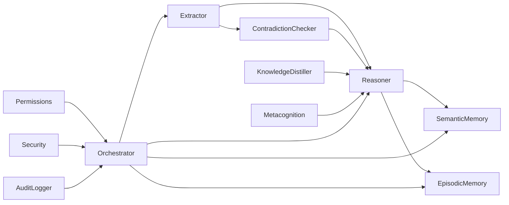
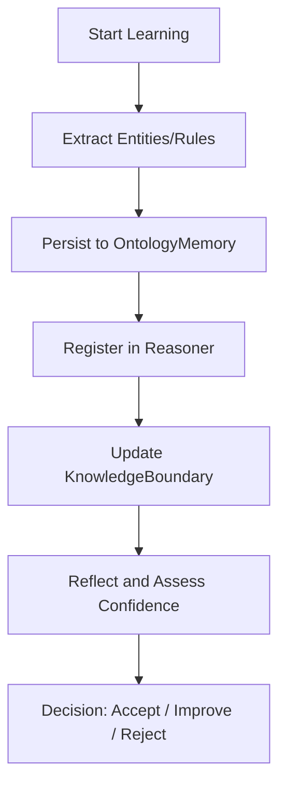
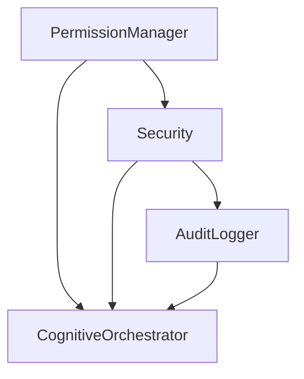

# Advanced Demonstrations

<cite>
**Referenced Files in This Document**
- [examples/agent_growth_demo.py](file://examples/agent_growth_demo.py)
- [examples/clawra_full_stack_demo.py](file://examples/clawra_full_stack_demo.py)
- [examples/phase3_advanced_demo.py](file://examples/phase3_advanced_demo.py)
- [examples/phase5_enterprise_demo.py](file://examples/phase5_enterprise_demo.py)
- [examples/comprehensive_demo.py](file://examples/comprehensive_demo.py)
- [src/agents/metacognition.py](file://src/agents/metacognition.py)
- [src/core/reasoner.py](file://src/core/reasoner.py)
- [src/memory/base.py](file://src/memory/base.py)
- [src/perception/extractor.py](file://src/perception/extractor.py)
- [src/evolution/self_correction.py](file://src/evolution/self_correction.py)
- [src/evolution/distillation.py](file://src/evolution/distillation.py)
- [src/core/permissions.py](file://src/core/permissions.py)
- [src/core/security.py](file://src/core/security.py)
- [src/agents/orchestrator.py](file://src/agents/orchestrator.py)
- [src/core/ontology/rule_engine.py](file://src/core/ontology/rule_engine.py)
</cite>

## Table of Contents
1. [Introduction](#introduction)
2. [Project Structure](#project-structure)
3. [Core Components](#core-components)
4. [Architecture Overview](#architecture-overview)
5. [Detailed Component Analysis](#detailed-component-analysis)
6. [Dependency Analysis](#dependency-analysis)
7. [Performance Considerations](#performance-considerations)
8. [Troubleshooting Guide](#troubleshooting-guide)
9. [Conclusion](#conclusion)
10. [Appendices](#appendices)

## Introduction
This document presents the advanced demonstrations that showcase the full evolution of the Clawra neuro-symbolic cognitive platform. It focuses on:
- Agent growth capabilities: learning, causal and logical reasoning, and metacognitive awareness
- Full-stack integration: perception, reasoning, memory, evolution, and orchestration
- Phase 3 deep cognitive integration: structured extraction, contradiction sentinel, and persistent episodic memory
- Phase 5 enterprise-grade features: industrial-grade vector engine, circuit breaker timeouts, dynamic graph sentinel, reinforcement learning from human feedback (RLHF), production-ready LLM extraction, and robust security and permissions

The document explains how agents learn and evolve through metacognitive reflection, implement complete knowledge processing pipelines, and scale to enterprise requirements with multi-tenancy, permission management, and audit logging. It also documents architectural decisions, performance characteristics, and production readiness features.

## Project Structure
The advanced demos are organized around modular components:
- Perception: structured extraction from unstructured text
- Reasoning: forward/backward chain inference with confidence propagation
- Memory: hybrid semantic memory (Neo4j + Chroma) and episodic memory (SQLite)
- Evolution: contradiction sentinel and knowledge distillation
- Agents: metacognitive reflection, orchestrator, and auditor
- Enterprise: permissions, security, and audit logging

**Diagram sources**
- [src/perception/extractor.py:83-350](file://src/perception/extractor.py#L83-L350)
- [src/core/reasoner.py:145-800](file://src/core/reasoner.py#L145-L800)
- [src/memory/base.py:9-249](file://src/memory/base.py#L9-L249)
- [src/evolution/self_correction.py:7-90](file://src/evolution/self_correction.py#L7-L90)
- [src/evolution/distillation.py:7-27](file://src/evolution/distillation.py#L7-L27)
- [src/agents/metacognition.py:8-204](file://src/agents/metacognition.py#L8-L204)
- [src/agents/orchestrator.py:23-366](file://src/agents/orchestrator.py#L23-L366)
- [src/core/permissions.py:166-464](file://src/core/permissions.py#L166-L464)
- [src/core/security.py:21-429](file://src/core/security.py#L21-L429)

**Section sources**
- [examples/agent_growth_demo.py:1-622](file://examples/agent_growth_demo.py#L1-L622)
- [examples/clawra_full_stack_demo.py:1-134](file://examples/clawra_full_stack_demo.py#L1-L134)
- [examples/phase3_advanced_demo.py:1-74](file://examples/phase3_advanced_demo.py#L1-L74)
- [examples/phase5_enterprise_demo.py:1-107](file://examples/phase5_enterprise_demo.py#L1-L107)
- [examples/comprehensive_demo.py:1-421](file://examples/comprehensive_demo.py#L1-L421)

## Core Components
- Metacognitive Agent: self-assessment, knowledge boundary detection, and reflective validation
- Reasoner: forward/backward chain inference with confidence propagation and circuit breaker timeouts
- Semantic Memory: hybrid graph-vector store with entity normalization and semantic search
- Episodic Memory: SQLite-backed trajectory logging and RLHF feedback
- KnowledgeExtractor: hierarchical chunking, structured JSON extraction, and JSON repair
- ContradictionChecker: dynamic sentinel for mutual exclusivity and anti-ontology validation
- CognitiveOrchestrator: ReAct-style tool loop integrating ingestion, graph query, and action execution
- RuleEngine: safe math sandbox for deterministic business rule evaluation
- PermissionManager and Security: RBAC, API keys, rate limiting, IP blocking, and audit logging

**Section sources**
- [src/agents/metacognition.py:8-204](file://src/agents/metacognition.py#L8-L204)
- [src/core/reasoner.py:145-800](file://src/core/reasoner.py#L145-L800)
- [src/memory/base.py:9-249](file://src/memory/base.py#L9-L249)
- [src/perception/extractor.py:83-350](file://src/perception/extractor.py#L83-L350)
- [src/evolution/self_correction.py:7-90](file://src/evolution/self_correction.py#L7-L90)
- [src/agents/orchestrator.py:23-366](file://src/agents/orchestrator.py#L23-L366)
- [src/core/ontology/rule_engine.py:124-331](file://src/core/ontology/rule_engine.py#L124-L331)
- [src/core/permissions.py:166-464](file://src/core/permissions.py#L166-L464)
- [src/core/security.py:21-429](file://src/core/security.py#L21-L429)

## Architecture Overview
The advanced demos demonstrate a cohesive pipeline:
- Perception extracts structured facts from documents
- The Reasoner infers conclusions and propagates confidence
- Sentinels guard against contradictions and data poisoning
- Memory stores both graph and vector knowledge
- Agents reflect and orchestrate tool usage
- Enterprise-grade controls enforce permissions, rate limits, and audit trails

**Diagram sources**
- [src/agents/orchestrator.py:128-366](file://src/agents/orchestrator.py#L128-L366)
- [src/perception/extractor.py:278-350](file://src/perception/extractor.py#L278-L350)
- [src/evolution/self_correction.py:46-74](file://src/evolution/self_correction.py#L46-L74)
- [src/core/reasoner.py:243-350](file://src/core/reasoner.py#L243-L350)
- [src/memory/base.py:91-121](file://src/memory/base.py#L91-L121)
- [src/memory/base.py:178-216](file://src/memory/base.py#L178-L216)

## Detailed Component Analysis

### Agent Growth Capabilities
This demo showcases three growth pillars:
- Learning: runtime acquisition of new concepts and rules, persisted to memory and reasoner
- Reasoning: causal and logical inference with traceable chains and confidence propagation
- Metacognition: self-awareness of confidence and knowledge boundaries

**Diagram sources**
- [examples/agent_growth_demo.py:317-476](file://examples/agent_growth_demo.py#L317-L476)
- [examples/agent_growth_demo.py:108-166](file://examples/agent_growth_demo.py#L108-L166)
- [examples/agent_growth_demo.py:194-311](file://examples/agent_growth_demo.py#L194-L311)
- [examples/agent_growth_demo.py:36-102](file://examples/agent_growth_demo.py#L36-L102)

Key behaviors:
- Learning new concepts and rules, persisting to JSONL and registering in the reasoner
- Building causal graphs and applying logical rules with confidence aggregation
- Assessing query confidence and honestly reporting uncertainty

**Section sources**
- [examples/agent_growth_demo.py:317-476](file://examples/agent_growth_demo.py#L317-L476)
- [examples/agent_growth_demo.py:194-311](file://examples/agent_growth_demo.py#L194-L311)
- [examples/agent_growth_demo.py:36-102](file://examples/agent_growth_demo.py#L36-L102)

### Full-Stack Clawra Integration
This demo demonstrates eight-module cognitive architecture:
- Perception: KnowledgeExtractor
- Core: Reasoner
- Agents: MetacognitiveAgent
- Memory: SemanticMemory (Neo4j) and EpisodicMemory
- Evolution: KnowledgeDistiller
- Orchestration: CognitiveOrchestrator
- Safety: AuditorAgent
- Governance: MemoryGovernor

**Diagram sources**
- [examples/clawra_full_stack_demo.py:34-134](file://examples/clawra_full_stack_demo.py#L34-L134)
- [src/agents/metacognition.py:23-134](file://src/agents/metacognition.py#L23-L134)
- [src/memory/base.py:91-121](file://src/memory/base.py#L91-L121)
- [src/evolution/distillation.py:15-27](file://src/evolution/distillation.py#L15-L27)

**Section sources**
- [examples/clawra_full_stack_demo.py:34-134](file://examples/clawra_full_stack_demo.py#L34-L134)

### Phase 3 Advanced Features
This demo integrates:
- LLM structured extraction with hierarchical chunking and JSON repair
- Contradiction sentinel to block data poisoning
- Persistent episodic memory for task traces and RLHF feedback

**Diagram sources**
- [examples/phase3_advanced_demo.py:12-74](file://examples/phase3_advanced_demo.py#L12-L74)
- [src/perception/extractor.py:278-350](file://src/perception/extractor.py#L278-L350)
- [src/evolution/self_correction.py:46-74](file://src/evolution/self_correction.py#L46-L74)
- [src/memory/base.py:178-216](file://src/memory/base.py#L178-L216)

**Section sources**
- [examples/phase3_advanced_demo.py:12-74](file://examples/phase3_advanced_demo.py#L12-L74)

### Phase 5 Enterprise-Grade Functionality
This demo validates production readiness with:
- Real ChromaDB vector engine and semantic similarity search
- Industrial Reasoner with circuit breaker timeouts
- Dynamic Neo4j sentinel for mutual exclusivity
- RLHF with SQLite-backed feedback
- Production-grade OpenAI structured extraction with fallback

**Diagram sources**
- [examples/phase5_enterprise_demo.py:18-107](file://examples/phase5_enterprise_demo.py#L18-L107)
- [src/memory/vector_adapter.py:1-200](file://src/memory/vector_adapter.py#L1-L200)
- [src/core/reasoner.py:275-277](file://src/core/reasoner.py#L275-L277)
- [src/evolution/self_correction.py:46-74](file://src/evolution/self_correction.py#L46-L74)
- [src/memory/base.py:178-216](file://src/memory/base.py#L178-L216)
- [src/perception/extractor.py:109-121](file://src/perception/extractor.py#L109-L121)

**Section sources**
- [examples/phase5_enterprise_demo.py:18-107](file://examples/phase5_enterprise_demo.py#L18-L107)

### Comprehensive Demo Scenarios
This demo integrates:
- Knowledge ingestion and retrieval
- Rule-based reasoning with confidence and conflict detection
- Metacognitive knowledge boundary detection and self-reflection
- End-to-end procurement compliance with audit trail

**Diagram sources**
- [examples/comprehensive_demo.py:51-421](file://examples/comprehensive_demo.py#L51-L421)
- [src/core/reasoner.py:617-643](file://src/core/reasoner.py#L617-L643)
- [src/agents/metacognition.py:23-134](file://src/agents/metacognition.py#L23-L134)
- [src/core/ontology/rule_engine.py:303-331](file://src/core/ontology/rule_engine.py#L303-L331)

**Section sources**
- [examples/comprehensive_demo.py:51-421](file://examples/comprehensive_demo.py#L51-L421)

## Dependency Analysis
The demos rely on tight coupling between perception, reasoning, memory, evolution, and agents, with clear separation of concerns:
- Perception depends on chunking and LLM clients
- Reasoner depends on confidence calculators and optionally on ontology loaders
- Memory integrates graph and vector stores
- Evolution provides safety gates for new knowledge
- Agents orchestrate tools and reflect on outcomes
- Enterprise modules enforce access control and security

**Diagram sources**
- [src/perception/extractor.py:83-350](file://src/perception/extractor.py#L83-L350)
- [src/core/reasoner.py:145-800](file://src/core/reasoner.py#L145-L800)
- [src/memory/base.py:9-249](file://src/memory/base.py#L9-L249)
- [src/evolution/self_correction.py:7-90](file://src/evolution/self_correction.py#L7-L90)
- [src/evolution/distillation.py:7-27](file://src/evolution/distillation.py#L7-L27)
- [src/agents/metacognition.py:8-204](file://src/agents/metacognition.py#L8-L204)
- [src/agents/orchestrator.py:23-366](file://src/agents/orchestrator.py#L23-L366)
- [src/core/permissions.py:166-464](file://src/core/permissions.py#L166-L464)
- [src/core/security.py:21-429](file://src/core/security.py#L21-L429)

**Section sources**
- [src/agents/orchestrator.py:23-366](file://src/agents/orchestrator.py#L23-L366)
- [src/core/reasoner.py:145-800](file://src/core/reasoner.py#L145-L800)
- [src/memory/base.py:9-249](file://src/memory/base.py#L9-L249)

## Performance Considerations
- Circuit breaker timeouts: the Reasoner enforces time-based limits during forward/backward chaining to prevent runaway inference
- Confidence propagation: uses conservative aggregation (min) to avoid inflating trust
- Chunking and JSON repair: reduce LLM overhead and improve robustness
- Vector similarity search: hybrid retrieval balances recall and latency
- SQLite persistence: lightweight and suitable for episodic memory and RLHF feedback
- Rate limiting and IP blocking: protect APIs under load

[No sources needed since this section provides general guidance]

## Troubleshooting Guide
Common issues and mitigations:
- LLM extraction failures: JSON repair strategies and retry with exponential backoff
- Frequency limit (429): automatic backoff and reduced throughput
- Missing API keys: graceful degradation with mock LLM and clear error messaging
- Contradictions: sentinel blocks conflicting facts; review rule sets and entity normalization
- Permission denials: verify role assignments and resource ownership checks
- Audit logging: monitor auth attempts, authorization failures, and rate limit events

**Section sources**
- [src/perception/extractor.py:212-231](file://src/perception/extractor.py#L212-L231)
- [src/perception/extractor.py:122-189](file://src/perception/extractor.py#L122-L189)
- [src/core/security.py:46-65](file://src/core/security.py#L46-L65)
- [src/evolution/self_correction.py:46-74](file://src/evolution/self_correction.py#L46-L74)
- [src/core/permissions.py:359-382](file://src/core/permissions.py#L359-L382)
- [src/core/security.py:358-404](file://src/core/security.py#L358-L404)

## Conclusion
The advanced demonstrations illustrate a mature, production-ready cognitive platform:
- Agents grow through metacognition, learning, and reasoning
- Perception-to-action pipelines integrate safely with sentinels and memory
- Enterprise-grade controls ensure scalability, security, and compliance
- The demos provide a blueprint for deploying neuro-symbolic systems at scale

[No sources needed since this section summarizes without analyzing specific files]

## Appendices

### Appendix A: Agent Growth Pipeline

**Diagram sources**
- [examples/agent_growth_demo.py:375-411](file://examples/agent_growth_demo.py#L375-L411)
- [examples/agent_growth_demo.py:421-444](file://examples/agent_growth_demo.py#L421-L444)

### Appendix B: Enterprise Controls

**Diagram sources**
- [src/core/permissions.py:166-464](file://src/core/permissions.py#L166-L464)
- [src/core/security.py:21-429](file://src/core/security.py#L21-L429)
- [src/agents/orchestrator.py:23-366](file://src/agents/orchestrator.py#L23-L366)