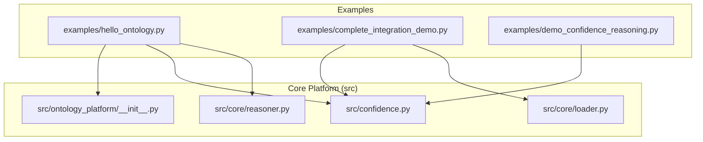
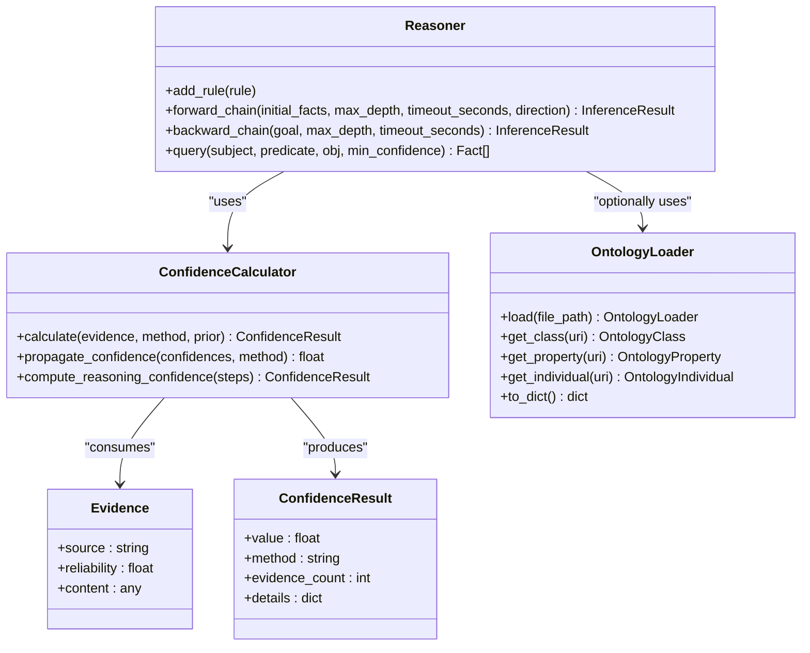
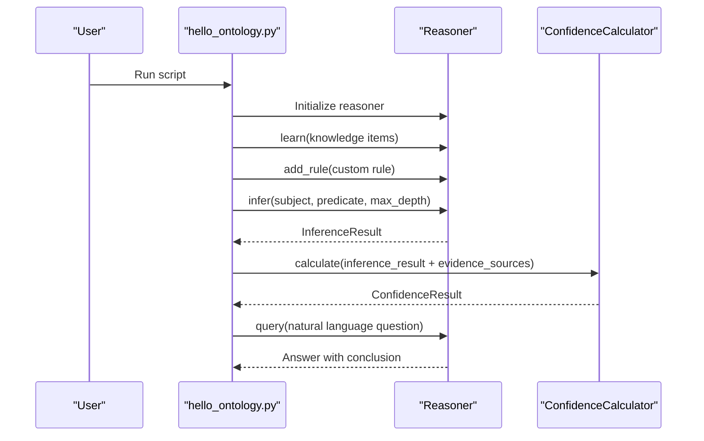
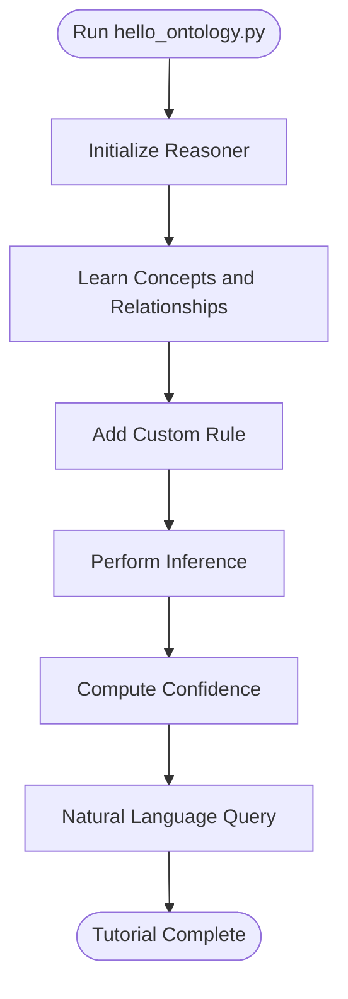
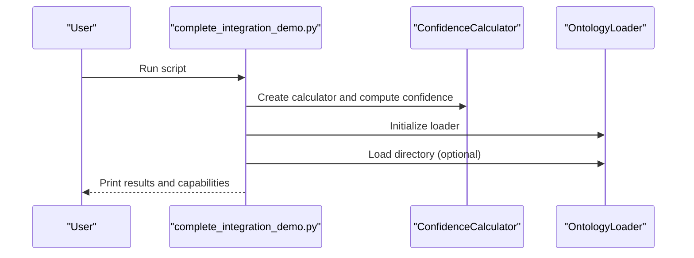
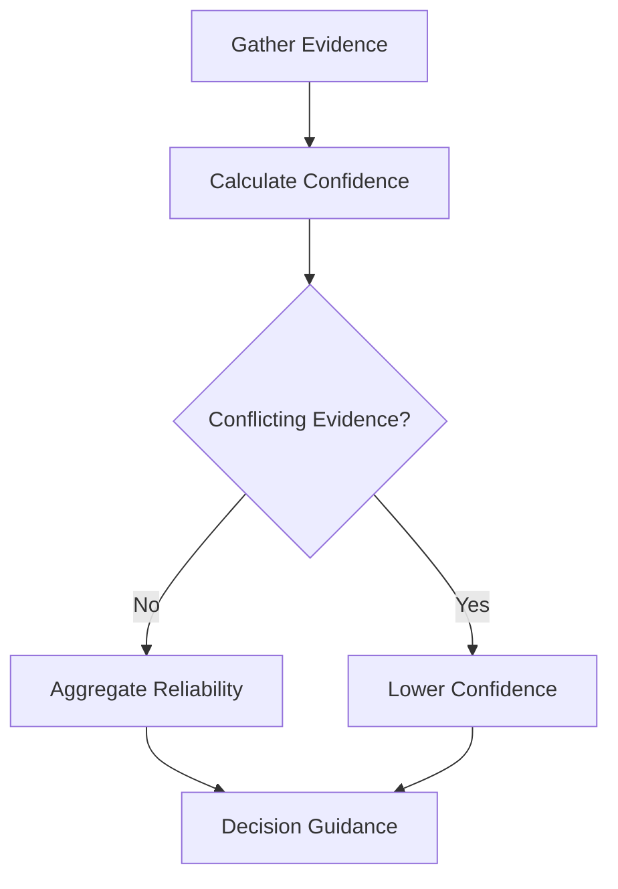
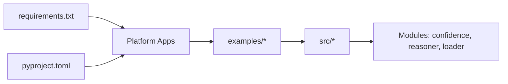

# Basic Tutorials

<cite>
**Referenced Files in This Document**
- [hello_ontology.py](file://examples/hello_ontology.py)
- [complete_integration_demo.py](file://examples/complete_integration_demo.py)
- [examples/README.md](file://examples/README.md)
- [requirements.txt](file://requirements.txt)
- [pyproject.toml](file://pyproject.toml)
- [README.md](file://README.md)
- [src/ontology_platform/__init__.py](file://src/ontology_platform/__init__.py)
- [src/confidence.py](file://src/confidence.py)
- [src/core/reasoner.py](file://src/core/reasoner.py)
- [src/core/loader.py](file://src/core/loader.py)
- [examples/demo_confidence_reasoning.py](file://examples/demo_confidence_reasoning.py)
</cite>

## Table of Contents
1. [Introduction](#introduction)
2. [Project Structure](#project-structure)
3. [Core Components](#core-components)
4. [Architecture Overview](#architecture-overview)
5. [Detailed Component Analysis](#detailed-component-analysis)
6. [Dependency Analysis](#dependency-analysis)
7. [Performance Considerations](#performance-considerations)
8. [Troubleshooting Guide](#troubleshooting-guide)
9. [Conclusion](#conclusion)
10. [Appendices](#appendices)

## Introduction
This guide introduces two foundational tutorials to help you get started with the ontology platform:
- Hello Ontology: a minimal “Hello World” example that demonstrates the basic pipeline of learning knowledge, adding rules, performing reasoning, computing confidence, and querying.
- Complete Integration Demo: a quick walkthrough showing how confidence calculation, ontology loading, and data export work together.

These tutorials are designed for absolute beginners and developers with some experience in knowledge graphs. They explain each step, show how components fit together, and provide troubleshooting tips for common setup issues.

## Project Structure
The tutorials live under examples/, and the core platform APIs are exposed via src/ontology_platform/__init__.py. The platform also includes dedicated modules for confidence computation, reasoning, and ontology loading.

**Diagram sources**
- [hello_ontology.py:1-144](file://examples/hello_ontology.py#L1-L144)
- [complete_integration_demo.py:1-73](file://examples/complete_integration_demo.py#L1-L73)
- [src/ontology_platform/__init__.py:1-15](file://src/ontology_platform/__init__.py#L1-L15)
- [src/confidence.py:1-404](file://src/confidence.py#L1-L404)
- [src/core/reasoner.py:1-819](file://src/core/reasoner.py#L1-L819)
- [src/core/loader.py:1-444](file://src/core/loader.py#L1-L444)

**Section sources**
- [examples/README.md:1-121](file://examples/README.md#L1-L121)
- [README.md:1-86](file://README.md#L1-L86)

## Core Components
This section outlines the building blocks used in the tutorials and how they relate to each other.

- Confidence Calculator: Computes confidence from multiple evidence sources and supports propagation along reasoning chains.
- Ontology Loader: Loads structured ontologies (JSON/Turtle/RDF/XML) and exposes classes, properties, and individuals.
- Ontology Reasoner: Performs forward/backward reasoning, applies rules, tracks confidence, and supports queries.

**Diagram sources**
- [src/confidence.py:31-331](file://src/confidence.py#L31-L331)
- [src/core/reasoner.py:145-704](file://src/core/reasoner.py#L145-L704)
- [src/core/loader.py:131-330](file://src/core/loader.py#L131-L330)

**Section sources**
- [src/ontology_platform/__init__.py:1-15](file://src/ontology_platform/__init__.py#L1-L15)
- [src/confidence.py:1-404](file://src/confidence.py#L1-L404)
- [src/core/reasoner.py:1-819](file://src/core/reasoner.py#L1-L819)
- [src/core/loader.py:1-444](file://src/core/loader.py#L1-L444)

## Architecture Overview
The tutorials demonstrate a knowledge processing pipeline:
- Data ingestion: Add concepts and relationships (or load an external ontology).
- Rule authoring: Define rules that capture domain logic.
- Reasoning: Apply rules to derive new facts and track confidence.
- Confidence aggregation: Combine evidence reliability and rule confidence.
- Querying: Retrieve answers grounded in the knowledge graph and reasoning chain.

**Diagram sources**
- [hello_ontology.py:17-128](file://examples/hello_ontology.py#L17-L128)
- [src/core/reasoner.py:243-438](file://src/core/reasoner.py#L243-L438)
- [src/confidence.py:60-96](file://src/confidence.py#L60-L96)

## Detailed Component Analysis

### Hello Ontology Tutorial Walkthrough
This tutorial introduces the minimal workflow to build and reason over a small knowledge base.

- Environment setup and execution
  - The script adjusts the Python path to import from src and prints the platform version.
  - It initializes the reasoner and demonstrates learning basic concepts and relationships.
  - It adds a custom rule and executes reasoning to infer categories.
  - It computes confidence using the ConfidenceCalculator and performs a natural language query.

**Diagram sources**
- [hello_ontology.py:17-128](file://examples/hello_ontology.py#L17-L128)

**Section sources**
- [hello_ontology.py:17-144](file://examples/hello_ontology.py#L17-L144)

### Complete Integration Demo Walkthrough
This demo shows how confidence calculation, ontology loading, and data export capabilities integrate.

- Confidence calculation: Demonstrates combining multiple evidence sources into a single confidence score.
- Ontology loading: Attempts to load a domain-specific ontology from a directory (if present).
- Data export: Highlights available export methods for entities, schema, and triples.

**Diagram sources**
- [complete_integration_demo.py:24-62](file://examples/complete_integration_demo.py#L24-L62)
- [src/confidence.py:31-96](file://src/confidence.py#L31-L96)
- [src/core/loader.py:131-207](file://src/core/loader.py#L131-L207)

**Section sources**
- [complete_integration_demo.py:24-73](file://examples/complete_integration_demo.py#L24-L73)

### Confidence Reasoning Deep Dive
The confidence reasoning demo illustrates:
- Computing confidence from single and multiple evidence sources.
- Detecting conflicting evidence and observing reduced confidence.
- Applying confidence in business scenarios (e.g., supplier evaluation).
- Learning from feedback by adjusting source weights.

**Diagram sources**
- [examples/demo_confidence_reasoning.py:22-151](file://examples/demo_confidence_reasoning.py#L22-L151)
- [src/confidence.py:60-96](file://src/confidence.py#L60-L96)

**Section sources**
- [examples/demo_confidence_reasoning.py:1-185](file://examples/demo_confidence_reasoning.py#L1-L185)
- [src/confidence.py:1-404](file://src/confidence.py#L1-L404)

## Dependency Analysis
- Runtime dependencies are declared in requirements.txt and pyproject.toml.
- The examples rely on src modules via PYTHONPATH manipulation.
- The platform exposes core APIs through src/ontology_platform/__init__.py.

**Diagram sources**
- [requirements.txt:1-18](file://requirements.txt#L1-L18)
- [pyproject.toml:28-37](file://pyproject.toml#L28-L37)
- [hello_ontology.py:14](file://examples/hello_ontology.py#L14)
- [complete_integration_demo.py:18](file://examples/complete_integration_demo.py#L18)

**Section sources**
- [requirements.txt:1-18](file://requirements.txt#L1-L18)
- [pyproject.toml:1-74](file://pyproject.toml#L1-L74)
- [examples/README.md:89-100](file://examples/README.md#L89-L100)

## Performance Considerations
- Forward chaining can grow exponentially; use bounded max_depth and timeouts to prevent long runs.
- Confidence propagation methods (min, arithmetic, geometric, multiplicative) impact overall confidence; choose conservative defaults for safety.
- Loading large ontologies incrementally (streaming) reduces memory footprint when working with big datasets.

[No sources needed since this section provides general guidance]

## Troubleshooting Guide
Common setup and runtime issues:

- Module import errors
  - Symptom: Cannot import platform modules from examples.
  - Fix: Ensure PYTHONPATH includes src so imports resolve correctly.
  - Reference: Both hello_ontology.py and complete_integration_demo.py adjust sys.path to include src.

- Missing dependencies
  - Symptom: ImportErrors for missing packages.
  - Fix: Install dependencies from requirements.txt or pyproject.toml dev groups as needed.

- Neo4j/OpenAI configuration
  - Symptom: Authentication or connectivity failures when connecting to Neo4j or invoking LLM APIs.
  - Fix: Set environment variables for Neo4j credentials and OpenAI API keys as shown in the project README.

- Running examples
  - Symptom: Example fails to run from wrong directory or with incorrect command.
  - Fix: Follow the commands in examples/README.md to run each example from the correct working directory.

**Section sources**
- [hello_ontology.py:14, 136-143:14-143](file://examples/hello_ontology.py#L14-L143)
- [complete_integration_demo.py:18](file://examples/complete_integration_demo.py#L18)
- [examples/README.md:89-100](file://examples/README.md#L89-L100)
- [README.md:32-44](file://README.md#L32-L44)

## Conclusion
You now have the essentials to run your first tutorials:
- Use Hello Ontology to learn the reasoning and confidence pipeline.
- Use Complete Integration Demo to see confidence, loading, and export in action.
- Keep dependencies aligned and environment variables configured for smooth execution.

[No sources needed since this section summarizes without analyzing specific files]

## Appendices

### Quick Setup Checklist
- Clone the repository and install dependencies.
- Configure environment variables for Neo4j and OpenAI.
- Run the Hello Ontology tutorial to validate your setup.
- Explore the Complete Integration Demo to see the broader capabilities.

**Section sources**
- [README.md:21-44](file://README.md#L21-L44)
- [examples/README.md:89-100](file://examples/README.md#L89-L100)