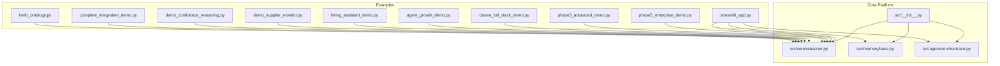
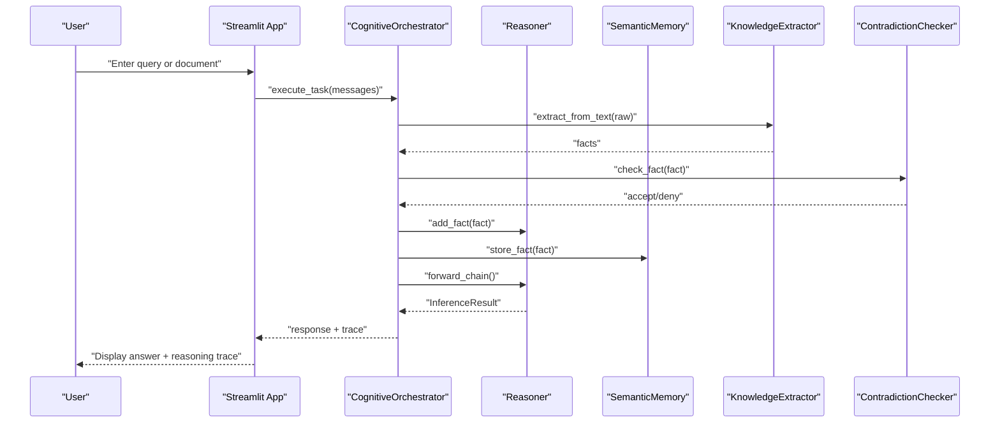
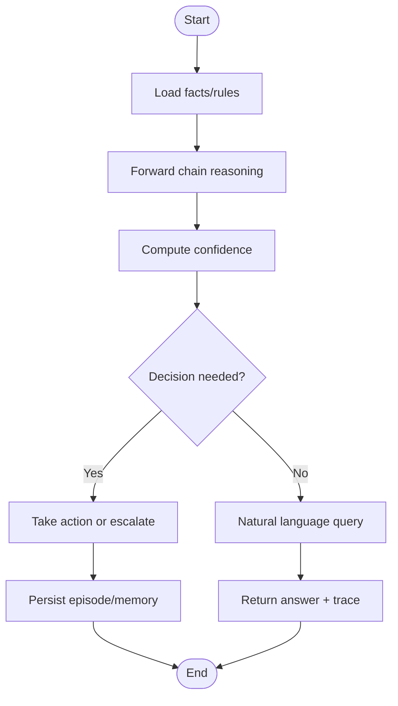
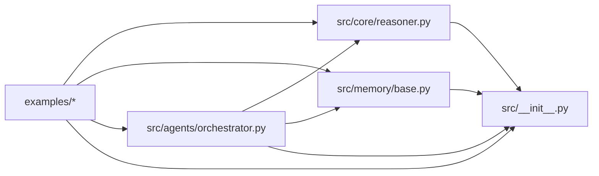

# Examples and Tutorials

<cite>
**Referenced Files in This Document**
- [examples/README.md](file://examples/README.md)
- [examples/hello_ontology.py](file://examples/hello_ontology.py)
- [examples/complete_integration_demo.py](file://examples/complete_integration_demo.py)
- [examples/demo_confidence_reasoning.py](file://examples/demo_confidence_reasoning.py)
- [examples/demo_supplier_monitor.py](file://examples/demo_supplier_monitor.py)
- [examples/hiring_assistant_demo.py](file://examples/hiring_assistant_demo.py)
- [examples/agent_growth_demo.py](file://examples/agent_growth_demo.py)
- [examples/clawra_full_stack_demo.py](file://examples/clawra_full_stack_demo.py)
- [examples/phase3_advanced_demo.py](file://examples/phase3_advanced_demo.py)
- [examples/phase5_enterprise_demo.py](file://examples/phase5_enterprise_demo.py)
- [examples/streamlit_app.py](file://examples/streamlit_app.py)
- [src/__init__.py](file://src/__init__.py)
- [src/core/reasoner.py](file://src/core/reasoner.py)
- [src/agents/orchestrator.py](file://src/agents/orchestrator.py)
- [src/memory/base.py](file://src/memory/base.py)
</cite>

## Table of Contents
1. [Introduction](#introduction)
2. [Project Structure](#project-structure)
3. [Core Components](#core-components)
4. [Architecture Overview](#architecture-overview)
5. [Detailed Component Analysis](#detailed-component-analysis)
6. [Dependency Analysis](#dependency-analysis)
7. [Performance Considerations](#performance-considerations)
8. [Troubleshooting Guide](#troubleshooting-guide)
9. [Conclusion](#conclusion)
10. [Appendices](#appendices)

## Introduction
This document presents a comprehensive examples and tutorials guide for the ontology platform. It covers a wide spectrum of demonstrations—from basic knowledge ingestion and simple reasoning to full-stack integrations and enterprise-grade deployments. Each tutorial includes step-by-step walkthroughs, code snippet paths, and explanations of how components collaborate in real-world workflows. You will find beginner-friendly introductions alongside advanced patterns for custom agent development, reasoning orchestration, and production-ready integrations.

## Project Structure
The examples directory organizes runnable demos by skill level and capability area. Each script demonstrates a specific aspect of the platform and can be executed independently. The tutorials below reference these scripts and map their workflows to core platform components.

**Diagram sources**
- [examples/hello_ontology.py:1-144](file://examples/hello_ontology.py#L1-L144)
- [examples/complete_integration_demo.py:1-73](file://examples/complete_integration_demo.py#L1-L73)
- [examples/demo_confidence_reasoning.py:1-185](file://examples/demo_confidence_reasoning.py#L1-L185)
- [examples/demo_supplier_monitor.py:1-96](file://examples/demo_supplier_monitor.py#L1-L96)
- [examples/hiring_assistant_demo.py:1-391](file://examples/hiring_assistant_demo.py#L1-L391)
- [examples/agent_growth_demo.py:1-622](file://examples/agent_growth_demo.py#L1-L622)
- [examples/clawra_full_stack_demo.py:1-134](file://examples/clawra_full_stack_demo.py#L1-L134)
- [examples/phase3_advanced_demo.py:1-74](file://examples/phase3_advanced_demo.py#L1-L74)
- [examples/phase5_enterprise_demo.py:1-107](file://examples/phase5_enterprise_demo.py#L1-L107)
- [examples/streamlit_app.py:1-327](file://examples/streamlit_app.py#L1-L327)
- [src/core/reasoner.py:1-200](file://src/core/reasoner.py#L1-L200)
- [src/memory/base.py:1-200](file://src/memory/base.py#L1-L200)
- [src/agents/orchestrator.py:1-200](file://src/agents/orchestrator.py#L1-L200)
- [src/__init__.py:1-18](file://src/__init__.py#L1-L18)

**Section sources**
- [examples/README.md:1-110](file://examples/README.md#L1-L110)

## Core Components
This section introduces the foundational building blocks used across the examples. Understanding these components helps you adapt the demos to your own use cases.

- Reasoner: Central inference engine supporting forward/backward/bidirectional reasoning, rule evaluation, and confidence propagation.
- Memory: Hybrid semantic memory combining graph storage (Neo4j) and vector similarity search (Chroma), plus episodic memory for persistent traces.
- Orchestrator: Cognitive orchestrator coordinating perception, reasoning, memory, and action execution with tool-calling loops.
- Confidence Calculator: Evidence aggregation and confidence computation with propagation strategies.

Key capabilities demonstrated in examples:
- Basic learning and inference
- Confidence-aware reasoning
- Supplier risk monitoring
- Hiring assistant with structured rules
- Agent growth with meta-cognition
- Full-stack orchestration
- Advanced integration (sentinel, contradiction checker)
- Enterprise-grade features (vector engine, circuit breakers, RLHF)

**Section sources**
- [src/core/reasoner.py:145-200](file://src/core/reasoner.py#L145-L200)
- [src/memory/base.py:9-200](file://src/memory/base.py#L9-L200)
- [src/agents/orchestrator.py:23-200](file://src/agents/orchestrator.py#L23-L200)
- [src/__init__.py:1-18](file://src/__init__.py#L1-L18)

## Architecture Overview
The examples showcase modular collaboration among perception, reasoning, memory, and orchestration layers. The following diagram maps the end-to-end flow used in web and CLI demos.

**Diagram sources**
- [examples/streamlit_app.py:280-327](file://examples/streamlit_app.py#L280-L327)
- [src/agents/orchestrator.py:128-200](file://src/agents/orchestrator.py#L128-L200)
- [src/core/reasoner.py:145-200](file://src/core/reasoner.py#L145-L200)
- [src/memory/base.py:91-121](file://src/memory/base.py#L91-L121)

## Detailed Component Analysis

### Beginner Tutorial: Hello Ontology Platform
Goal: Learn the minimal workflow to create knowledge, define rules, infer conclusions, compute confidence, and query.

Steps:
1. Import core components from the platform interface.
2. Initialize the reasoner and optionally load a simple built-in ontology.
3. Teach basic facts and relationships.
4. Add domain rules with confidence.
5. Perform inference and inspect the reasoning chain.
6. Compute confidence for the inference outcome.
7. Execute natural-language queries and interpret results.

Code snippet path:
- [examples/hello_ontology.py:17-128](file://examples/hello_ontology.py#L17-L128)

What you learn:
- How to bootstrap a reasoning session.
- How to encode knowledge as facts and relationships.
- How to express rules and evaluate them.
- How confidence is computed and propagated.

Best practices:
- Keep initial rules simple and explicit.
- Use descriptive rule names and conditions.
- Track reasoning chains for transparency.

**Section sources**
- [examples/hello_ontology.py:17-128](file://examples/hello_ontology.py#L17-L128)

### Intermediate Tutorial: Complete Integration Demo
Goal: See how confidence calculation, ontology loading, and data export work together.

Steps:
1. Instantiate a confidence calculator and compute scores from multiple evidence sources.
2. Load an ontology from a domain directory (if present).
3. Export entities, schema, and triples for downstream use.

Code snippet path:
- [examples/complete_integration_demo.py:24-62](file://examples/complete_integration_demo.py#L24-L62)

What you learn:
- Confidence aggregation across heterogeneous sources.
- Ontology ingestion from structured directories.
- Data export capabilities for interoperability.

**Section sources**
- [examples/complete_integration_demo.py:24-62](file://examples/complete_integration_demo.py#L24-L62)

### Intermediate Tutorial: Confidence-Based Reasoning
Goal: Understand how to combine multiple evidence sources, detect conflicts, and iteratively refine confidence.

Steps:
1. Compute baseline confidence from single and multiple sources.
2. Analyze scenarios with conflicting evidence.
3. Evaluate business decisions under uncertainty.
4. Demonstrate auto-learning by adjusting source weights based on feedback.

Code snippet path:
- [examples/demo_confidence_reasoning.py:22-174](file://examples/demo_confidence_reasoning.py#L22-L174)

What you learn:
- Weighted confidence calculation.
- Conflict detection and resolution.
- Practical supplier evaluation patterns.
- Continuous improvement via feedback.

**Section sources**
- [examples/demo_confidence_reasoning.py:22-174](file://examples/demo_confidence_reasoning.py#L22-L174)

### Intermediate Tutorial: Supplier Risk Monitoring
Goal: Build an autonomous monitor that reasons about supplier performance, detects risks, and tracks confidence.

Steps:
1. Initialize the reasoning engine.
2. Load mock supplier data into the ontology.
3. Define domain rules for delivery and quality risks.
4. Query and reason about specific suppliers.
5. Interpret confidence levels and act accordingly.

Code snippet path:
- [examples/demo_supplier_monitor.py:26-91](file://examples/demo_supplier_monitor.py#L26-L91)

What you learn:
- Domain-specific rule engineering.
- Confidence-aware decision-making.
- Automated risk scoring and reporting.

**Section sources**
- [examples/demo_supplier_monitor.py:26-91](file://examples/demo_supplier_monitor.py#L26-L91)

### Intermediate Tutorial: AI Hiring Assistant
Goal: Develop a confidence-aware assistant for candidate assessment with structured rules, reasoning traces, and actionable next steps.

Steps:
1. Create a domain-specific agent with an internal ontology and rules.
2. Encode candidate and job requirements as facts.
3. Ask targeted questions and receive conclusions with confidence and reasoning chains.
4. Identify knowledge gaps and suggest follow-up actions.

Code snippet path:
- [examples/hiring_assistant_demo.py:36-197](file://examples/hiring_assistant_demo.py#L36-L197)

What you learn:
- Structured rule authoring for domain tasks.
- Transparent reasoning with confidence levels.
- Knowledge gap detection and remediation suggestions.

**Section sources**
- [examples/hiring_assistant_demo.py:36-197](file://examples/hiring_assistant_demo.py#L36-L197)

### Advanced Tutorial: Agent Growth and Meta-Cognition
Goal: Implement an agent that learns new rules at runtime, performs causal and logical reasoning, and reflects on its own confidence and knowledge boundaries.

Steps:
1. Design a memory layer backed by a lightweight JSONL store.
2. Implement a causal reasoner with confidence propagation.
3. Integrate a meta-cognition layer to assess query confidence and declare uncertainty.
4. Combine learning, reasoning, and meta-cognition into a cohesive agent.
5. Demonstrate end-to-end growth scenarios.

Code snippet path:
- [examples/agent_growth_demo.py:317-476](file://examples/agent_growth_demo.py#L317-L476)

What you learn:
- Runtime rule learning and persistence.
- Causal and logical reasoning with traceability.
- Meta-cognition for honest uncertainty reporting.
- Confidence propagation strategies across reasoning steps.

**Section sources**
- [examples/agent_growth_demo.py:317-476](file://examples/agent_growth_demo.py#L317-L476)

### Advanced Tutorial: Full-Stack Clawra Demo
Goal: Observe cross-module collaboration across perception, reasoning, memory, and evolution.

Steps:
1. Initialize the architecture: reasoner, semantic memory, episodic memory, extractor, and metacognitive agent.
2. Inject guardrail rules and simulate perception-layer data ingestion.
3. Execute agent reflection, forward-chain reasoning, and memory persistence.
4. Evolve the system by adding new rules discovered during reasoning.

Code snippet path:
- [examples/clawra_full_stack_demo.py:34-131](file://examples/clawra_full_stack_demo.py#L34-L131)

What you learn:
- Modular orchestration of cognitive components.
- Real-time knowledge ingestion and evolution.
- Persistent reasoning traces across sessions.

**Section sources**
- [examples/clawra_full_stack_demo.py:34-131](file://examples/clawra_full_stack_demo.py#L34-L131)

### Advanced Tutorial: Phase 3 Deep Integration
Goal: Combine perception, evolution sentinel, and episodic memory for robust, poisoned-data-resistant cognition.

Steps:
1. Initialize reasoner, semantic memory, episodic memory, extractor, and contradiction checker.
2. Inject base facts and parse unstructured text into strict facts.
3. Route new facts through the sentinel to prevent contradictions.
4. Persist episodes for auditability and future reinforcement learning.

Code snippet path:
- [examples/phase3_advanced_demo.py:12-70](file://examples/phase3_advanced_demo.py#L12-L70)

What you learn:
- Structured extraction from LLM outputs.
- Contradiction detection and blocking.
- Persistent task logging for traceability.

**Section sources**
- [examples/phase3_advanced_demo.py:12-70](file://examples/phase3_advanced_demo.py#L12-L70)

### Advanced Tutorial: Phase 5 Enterprise Features
Goal: Validate production-grade capabilities including industrial vector engines, circuit breakers, dynamic sentinels, RLHF, and real LLM integration.

Steps:
1. Initialize Chroma vector engine and perform semantic similarity search.
2. Exercise the reasoner with a timeout circuit breaker to avoid runaway inference.
3. Use a dynamic sentinel to validate facts against the graph.
4. Persist RLHF traces and human feedback in SQLite.
5. Optionally integrate a real OpenAI-compatible endpoint for structured extraction.

Code snippet path:
- [examples/phase5_enterprise_demo.py:18-103](file://examples/phase5_enterprise_demo.py#L18-L103)

What you learn:
- Industrial-strength vector search and retrieval.
- Safety mechanisms (timeouts, sentinels).
- Human-in-the-loop reinforcement learning traces.
- Production-ready LLM integration patterns.

**Section sources**
- [examples/phase5_enterprise_demo.py:18-103](file://examples/phase5_enterprise_demo.py#L18-L103)

### Web Application Tutorial: Streamlit Cognitive Console
Goal: Build an interactive dashboard that ingests knowledge, reasons over hybrid memory, and displays reasoning traces.

Steps:
1. Initialize the orchestrator with reasoner, semantic memory, and episodic memory.
2. Render a sidebar with metrics and an interactive knowledge graph.
3. Accept user prompts, execute reasoning, and display trace nodes.
4. Visualize reasoning chains and vector context.

Code snippet path:
- [examples/streamlit_app.py:58-327](file://examples/streamlit_app.py#L58-L327)

What you learn:
- Building a cognitive console with Streamlit.
- Hybrid graph-vector search and reasoning.
- Tool-based orchestration with traceability.

**Section sources**
- [examples/streamlit_app.py:58-327](file://examples/streamlit_app.py#L58-L327)

### Conceptual Overview: End-to-End Workflows
The following flowcharts illustrate typical workflows across the examples.

[No sources needed since this diagram shows conceptual workflow, not actual code structure]

## Dependency Analysis
The examples depend on core platform modules. The diagram below highlights import relationships and coupling.

**Diagram sources**
- [examples/streamlit_app.py:12-15](file://examples/streamlit_app.py#L12-L15)
- [src/agents/orchestrator.py:10-22](file://src/agents/orchestrator.py#L10-L22)
- [src/core/reasoner.py:24-32](file://src/core/reasoner.py#L24-L32)
- [src/memory/base.py:3-6](file://src/memory/base.py#L3-L6)
- [src/__init__.py:4-17](file://src/__init__.py#L4-L17)

**Section sources**
- [examples/streamlit_app.py:12-15](file://examples/streamlit_app.py#L12-L15)
- [src/agents/orchestrator.py:10-22](file://src/agents/orchestrator.py#L10-L22)
- [src/core/reasoner.py:24-32](file://src/core/reasoner.py#L24-L32)
- [src/memory/base.py:3-6](file://src/memory/base.py#L3-L6)
- [src/__init__.py:4-17](file://src/__init__.py#L4-L17)

## Performance Considerations
- Use forward chaining judiciously; set depth and timeout limits to avoid long-running computations.
- Prefer vector similarity search for broad discovery, then narrow with graph traversal.
- Normalize entities to reduce duplication and improve recall.
- Persist reasoning traces to SQLite for auditability and future refinement.
- Apply contradiction checks before storing facts to maintain knowledge integrity.
- For web apps, batch rendering and caching can improve responsiveness.

[No sources needed since this section provides general guidance]

## Troubleshooting Guide
Common issues and remedies:
- Missing environment variables for LLM or graph databases:
  - Ensure API keys and connection strings are set before running demos.
  - Verify Neo4j connectivity and credentials.
- Import path issues:
  - Set the Python path to include the src directory when executing examples.
- Timeout or excessive inference:
  - Use circuit breakers and timeouts in reasoning to prevent hangs.
- Data poisoning:
  - Route new facts through the contradiction checker before ingestion.
- Web app rendering failures:
  - Confirm optional dependencies (e.g., pyvis) are installed for graph visualization.

**Section sources**
- [examples/hello_ontology.py:135-144](file://examples/hello_ontology.py#L135-L144)
- [examples/phase5_enterprise_demo.py:94-100](file://examples/phase5_enterprise_demo.py#L94-L100)
- [examples/phase3_advanced_demo.py:46-52](file://examples/phase3_advanced_demo.py#L46-L52)
- [examples/streamlit_app.py:129-139](file://examples/streamlit_app.py#L129-L139)

## Conclusion
These examples and tutorials demonstrate a full spectrum of capabilities in the ontology platform, from simple knowledge extraction to enterprise-grade orchestration. By following the step-by-step workflows and understanding the roles of each component, you can adapt the demos to build custom agents, implement reasoning pipelines, and deploy production-ready systems.

[No sources needed since this section summarizes without analyzing specific files]

## Appendices

### Quick Start Checklist
- Install dependencies and configure environment variables.
- Run individual demos to explore capabilities.
- Adapt scripts to your domain data and rules.
- Integrate with web frameworks or APIs for broader deployment.

**Section sources**
- [examples/README.md:79-90](file://examples/README.md#L79-L90)