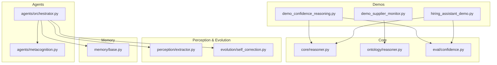
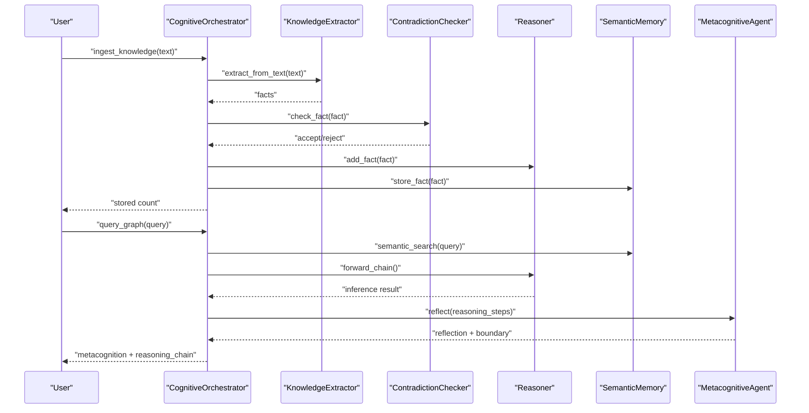
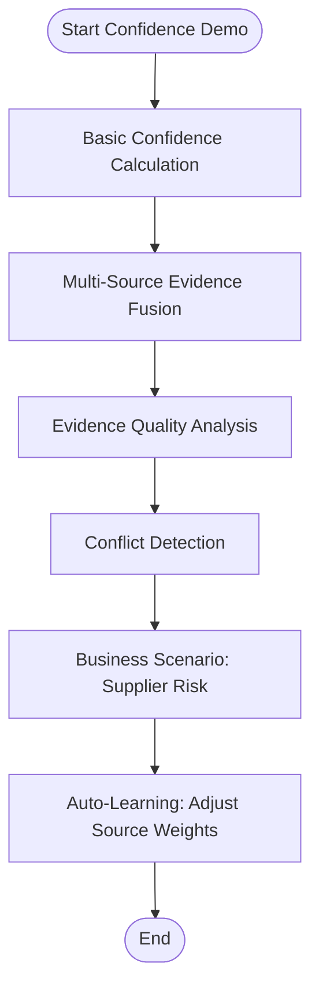
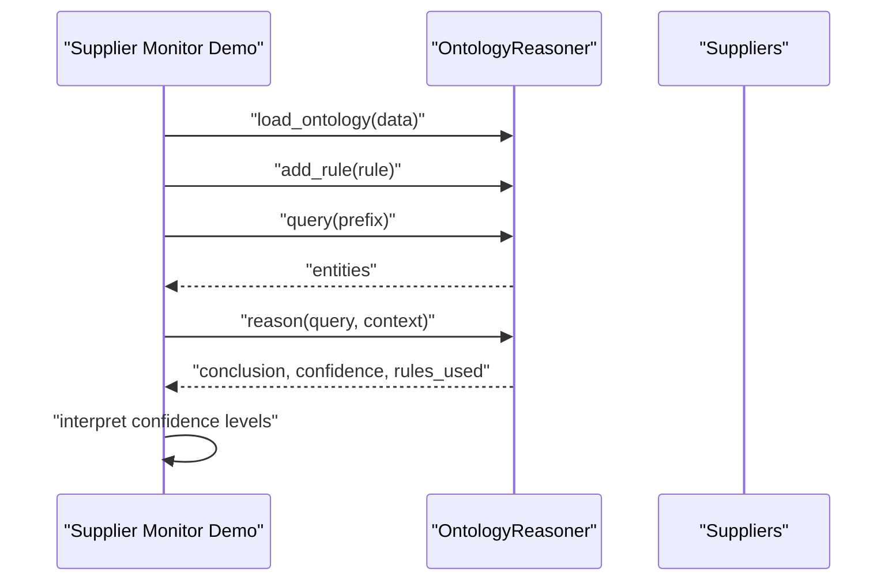
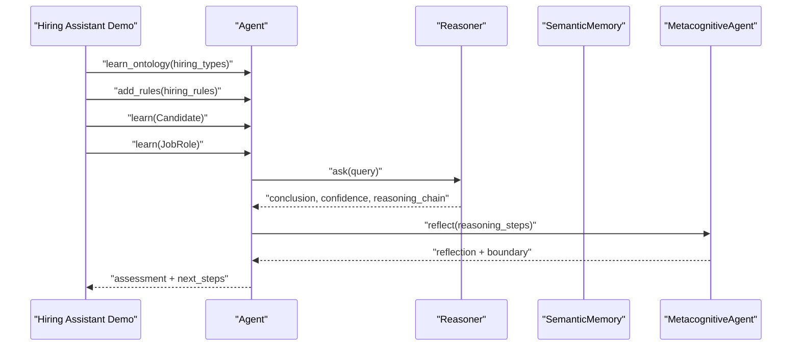
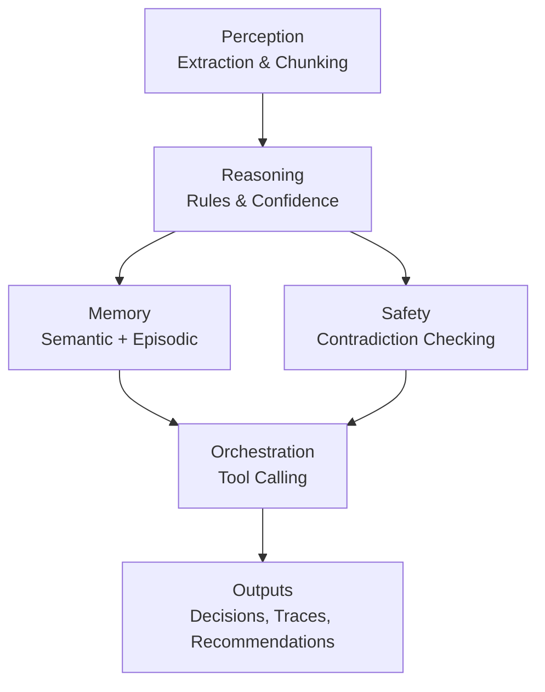
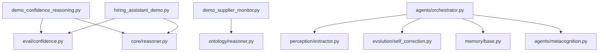

# Intermediate Demonstrations

<cite>
**Referenced Files in This Document**
- [examples/demo_confidence_reasoning.py](file://examples/demo_confidence_reasoning.py)
- [examples/demo_supplier_monitor.py](file://examples/demo_supplier_monitor.py)
- [examples/hiring_assistant_demo.py](file://examples/hiring_assistant_demo.py)
- [src/eval/confidence.py](file://src/eval/confidence.py)
- [src/ontology/reasoner.py](file://src/ontology/reasoner.py)
- [src/core/reasoner.py](file://src/core/reasoner.py)
- [src/perception/extractor.py](file://src/perception/extractor.py)
- [src/evolution/self_correction.py](file://src/evolution/self_correction.py)
- [src/memory/base.py](file://src/memory/base.py)
- [src/agents/orchestrator.py](file://src/agents/orchestrator.py)
- [src/agents/metacognition.py](file://src/agents/metacognition.py)
- [examples/comprehensive_demo.py](file://examples/comprehensive_demo.py)
- [examples/phase3_advanced_demo.py](file://examples/phase3_advanced_demo.py)
</cite>

## Table of Contents
1. [Introduction](#introduction)
2. [Project Structure](#project-structure)
3. [Core Components](#core-components)
4. [Architecture Overview](#architecture-overview)
5. [Detailed Component Analysis](#detailed-component-analysis)
6. [Dependency Analysis](#dependency-analysis)
7. [Performance Considerations](#performance-considerations)
8. [Troubleshooting Guide](#troubleshooting-guide)
9. [Conclusion](#conclusion)
10. [Appendices](#appendices)

## Introduction
This document presents intermediate demonstrations showcasing confidence-aware reasoning, supplier monitoring, and a comprehensive hiring assistant. It explains how to implement confidence-aware reasoning, handle real-world business scenarios like supplier risk assessment, and build complete applications with multiple integrated components. Guidance is provided on adapting these patterns for other domains and integrating with external systems.

## Project Structure
The demonstrations are organized around three primary example scripts:
- Confidence reasoning examples
- Supplier monitoring scenarios
- Hiring assistant demo

These demos integrate with core modules for reasoning, confidence computation, perception (extraction), evolution (self-correction), and memory.

**Diagram sources**
- [examples/demo_confidence_reasoning.py:1-185](file://examples/demo_confidence_reasoning.py#L1-L185)
- [examples/demo_supplier_monitor.py:1-96](file://examples/demo_supplier_monitor.py#L1-L96)
- [examples/hiring_assistant_demo.py:1-391](file://examples/hiring_assistant_demo.py#L1-L391)
- [src/eval/confidence.py:1-407](file://src/eval/confidence.py#L1-L407)
- [src/core/reasoner.py:1-819](file://src/core/reasoner.py#L1-L819)
- [src/ontology/reasoner.py:1-105](file://src/ontology/reasoner.py#L1-L105)
- [src/perception/extractor.py:1-350](file://src/perception/extractor.py#L1-L350)
- [src/evolution/self_correction.py:1-90](file://src/evolution/self_correction.py#L1-L90)
- [src/memory/base.py:1-249](file://src/memory/base.py#L1-L249)
- [src/agents/orchestrator.py:1-366](file://src/agents/orchestrator.py#L1-L366)
- [src/agents/metacognition.py:1-204](file://src/agents/metacognition.py#L1-L204)

**Section sources**
- [examples/demo_confidence_reasoning.py:1-185](file://examples/demo_confidence_reasoning.py#L1-L185)
- [examples/demo_supplier_monitor.py:1-96](file://examples/demo_supplier_monitor.py#L1-L96)
- [examples/hiring_assistant_demo.py:1-391](file://examples/hiring_assistant_demo.py#L1-L391)

## Core Components
- Confidence calculator and confidence-aware reasoning:
  - Evidence modeling and multiple aggregation methods (weighted, Bayesian, multiplicative, Dempster–Shafer)
  - Propagation of confidence along reasoning chains
  - Automatic learning by adjusting source weights based on feedback
- Ontology-based reasoning:
  - Rule-based inference with confidence levels
  - Query and causal reasoning with confidence-aware results
- Perception and extraction:
  - Structured extraction of facts from unstructured text with JSON repair and chunking
  - Glossary alignment and domain-specific prompts
- Evolution and safety:
  - Contradiction checking to prevent data poisoning
  - Reflection loops for validating reasoning traces
- Memory:
  - Semantic memory with hybrid retrieval (vector + graph)
  - Episodic memory for persistent trajectories and feedback
- Agents:
  - Orchestrator coordinating ingestion, querying, and actions
  - Metacognitive agent for self-reflection, boundary detection, and confidence calibration

**Section sources**
- [src/eval/confidence.py:1-407](file://src/eval/confidence.py#L1-L407)
- [src/ontology/reasoner.py:1-105](file://src/ontology/reasoner.py#L1-L105)
- [src/core/reasoner.py:1-819](file://src/core/reasoner.py#L1-L819)
- [src/perception/extractor.py:1-350](file://src/perception/extractor.py#L1-L350)
- [src/evolution/self_correction.py:1-90](file://src/evolution/self_correction.py#L1-L90)
- [src/memory/base.py:1-249](file://src/memory/base.py#L1-L249)
- [src/agents/orchestrator.py:1-366](file://src/agents/orchestrator.py#L1-L366)
- [src/agents/metacognition.py:1-204](file://src/agents/metacognition.py#L1-L204)

## Architecture Overview
The intermediate demos demonstrate end-to-end workflows integrating perception, reasoning, confidence tracking, and memory. The orchestrator coordinates tool calls for knowledge ingestion, graph queries, and controlled actions, while metacognition ensures reflective validation and boundary detection.

**Diagram sources**
- [src/agents/orchestrator.py:128-366](file://src/agents/orchestrator.py#L128-L366)
- [src/perception/extractor.py:278-350](file://src/perception/extractor.py#L278-L350)
- [src/evolution/self_correction.py:46-74](file://src/evolution/self_correction.py#L46-L74)
- [src/core/reasoner.py:243-349](file://src/core/reasoner.py#L243-L349)
- [src/memory/base.py:91-121](file://src/memory/base.py#L91-L121)
- [src/agents/metacognition.py:23-134](file://src/agents/metacognition.py#L23-L134)

## Detailed Component Analysis

### Confidence Reasoning Examples
This demo illustrates multi-source evidence fusion, reasoning chain confidence propagation, fact validation, and automatic learning from feedback. It demonstrates practical patterns for building confidence-aware systems.

**Diagram sources**
- [examples/demo_confidence_reasoning.py:22-171](file://examples/demo_confidence_reasoning.py#L22-L171)
- [src/eval/confidence.py:63-297](file://src/eval/confidence.py#L63-L297)

Implementation highlights:
- Evidence aggregation using weighted, Bayesian, multiplicative, and Dempster–Shafer methods
- Confidence propagation along reasoning chains
- Automatic learning by updating source weights based on user feedback

Practical guidance:
- Choose aggregation method based on domain needs (robustness vs. sensitivity)
- Use automatic learning to adapt to feedback and improve long-term accuracy
- Track reasoning chains to explain and audit decisions

**Section sources**
- [examples/demo_confidence_reasoning.py:22-171](file://examples/demo_confidence_reasoning.py#L22-L171)
- [src/eval/confidence.py:63-297](file://src/eval/confidence.py#L63-L297)

### Supplier Monitoring Scenarios
This demo shows autonomous supplier monitoring using rule-based reasoning, confidence-aware conclusions, and causal reasoning. It demonstrates how to define rules, load data into an ontology, and interpret confidence levels.

**Diagram sources**
- [examples/demo_supplier_monitor.py:26-91](file://examples/demo_supplier_monitor.py#L26-L91)
- [src/ontology/reasoner.py:56-87](file://src/ontology/reasoner.py#L56-L87)

Real-world business patterns:
- Define clear rules for risk thresholds (delivery, quality)
- Combine multiple signals to detect combined risks
- Interpret confidence levels to decide whether further investigation is needed

**Section sources**
- [examples/demo_supplier_monitor.py:26-91](file://examples/demo_supplier_monitor.py#L26-L91)
- [src/ontology/reasoner.py:56-87](file://src/ontology/reasoner.py#L56-L87)

### Hiring Assistant Demo: Resume Parsing, Candidate Matching, Interview Question Generation
The hiring assistant integrates confidence-aware reasoning, explicit reasoning traces, knowledge gap identification, and actionable recommendations. It demonstrates a complete pipeline from candidate data ingestion to hiring decisions.

**Diagram sources**
- [examples/hiring_assistant_demo.py:36-197](file://examples/hiring_assistant_demo.py#L36-L197)
- [src/core/reasoner.py:243-349](file://src/core/reasoner.py#L243-L349)
- [src/agents/metacognition.py:92-134](file://src/agents/metacognition.py#L92-L134)

Workflow breakdown:
- Resume parsing and ingestion:
  - Use structured extraction to parse resumes into facts
  - Apply glossary mapping and JSON repair for robustness
- Candidate matching:
  - Define rules for experience, skills, ML requirements, leadership, gaps, and references
  - Compute confidence-aware recommendations
- Interview question generation:
  - Use reasoning traces and knowledge gaps to suggest targeted questions
  - Provide next steps based on confidence levels and gaps

Adapting patterns:
- Replace domain-specific types and rules with your own (e.g., legal, finance, healthcare)
- Integrate external APIs for background checks, certifications, or scoring
- Extend reasoning chains with domain experts’ inputs

**Section sources**
- [examples/hiring_assistant_demo.py:36-391](file://examples/hiring_assistant_demo.py#L36-L391)
- [src/perception/extractor.py:278-350](file://src/perception/extractor.py#L278-L350)
- [src/core/reasoner.py:243-349](file://src/core/reasoner.py#L243-L349)
- [src/agents/metacognition.py:92-134](file://src/agents/metacognition.py#L92-L134)

### Conceptual Overview
The demos illustrate how to combine perception, reasoning, confidence tracking, and memory into cohesive applications. They emphasize transparency (reasoning traces), accountability (confidence levels), and safety (self-correction and boundary detection).

[No sources needed since this diagram shows conceptual workflow, not actual code structure]

[No sources needed since this section doesn't analyze specific files]

## Dependency Analysis
The intermediate demos depend on core modules for reasoning, confidence, perception, evolution, memory, and agents. The orchestrator coordinates these components to deliver end-to-end workflows.

**Diagram sources**
- [examples/demo_confidence_reasoning.py:19-185](file://examples/demo_confidence_reasoning.py#L19-L185)
- [examples/demo_supplier_monitor.py:12-96](file://examples/demo_supplier_monitor.py#L12-L96)
- [examples/hiring_assistant_demo.py:24-391](file://examples/hiring_assistant_demo.py#L24-L391)
- [src/eval/confidence.py:32-407](file://src/eval/confidence.py#L32-L407)
- [src/core/reasoner.py:145-819](file://src/core/reasoner.py#L145-L819)
- [src/ontology/reasoner.py:25-105](file://src/ontology/reasoner.py#L25-L105)
- [src/agents/orchestrator.py:23-366](file://src/agents/orchestrator.py#L23-L366)
- [src/perception/extractor.py:83-350](file://src/perception/extractor.py#L83-L350)
- [src/evolution/self_correction.py:7-90](file://src/evolution/self_correction.py#L7-L90)
- [src/memory/base.py:9-249](file://src/memory/base.py#L9-L249)
- [src/agents/metacognition.py:8-204](file://src/agents/metacognition.py#L8-L204)

**Section sources**
- [examples/comprehensive_demo.py:17-421](file://examples/comprehensive_demo.py#L17-L421)
- [examples/phase3_advanced_demo.py:12-74](file://examples/phase3_advanced_demo.py#L12-L74)

## Performance Considerations
- Use confidence-aware pruning: lower-confidence facts can be deprioritized in reasoning chains to reduce computational overhead.
- Leverage semantic search to narrow down relevant knowledge before forward chaining.
- Employ chunking and JSON repair to avoid repeated retries and improve throughput in extraction.
- Monitor inference latency and request durations using built-in metrics collectors and decorators.

[No sources needed since this section provides general guidance]

## Troubleshooting Guide
Common issues and resolutions:
- Extraction failures:
  - Verify environment variables for LLM access and retry with exponential backoff.
  - Use mock LLM mode for unit testing and offline development.
- Contradictions and data poisoning:
  - Apply the contradiction checker before storing new facts.
  - Review conflicting objects and reconcile with domain experts.
- Low confidence reasoning:
  - Increase evidence quality and quantity; adjust rule confidences.
  - Use metacognitive reflection to identify weak links and suggest remediation.
- Memory connectivity:
  - Fallback to in-memory mode if graph database is unavailable.
  - Normalize entity names to align synonyms with canonical terms.

**Section sources**
- [src/perception/extractor.py:109-120](file://src/perception/extractor.py#L109-L120)
- [src/evolution/self_correction.py:46-74](file://src/evolution/self_correction.py#L46-L74)
- [src/memory/base.py:47-67](file://src/memory/base.py#L47-L67)
- [src/agents/metacognition.py:136-172](file://src/agents/metacognition.py#L136-L172)

## Conclusion
The intermediate demonstrations showcase how to build confidence-aware, reasoning-driven applications. By combining structured extraction, rule-based reasoning, confidence propagation, and safety mechanisms, teams can develop robust systems for supplier monitoring and hiring, and adapt these patterns to other domains with minimal friction.

[No sources needed since this section summarizes without analyzing specific files]

## Appendices
- Related demos for broader capabilities:
  - Comprehensive demo covering knowledge ingestion, rule-based reasoning, knowledge boundary detection, and end-to-end compliance checks
  - Phase 3 advanced demo integrating perception, evolution, and persistent memory

**Section sources**
- [examples/comprehensive_demo.py:51-421](file://examples/comprehensive_demo.py#L51-L421)
- [examples/phase3_advanced_demo.py:12-74](file://examples/phase3_advanced_demo.py#L12-L74)