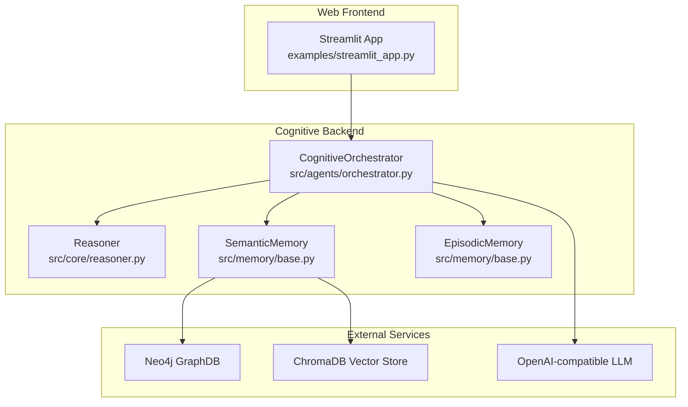
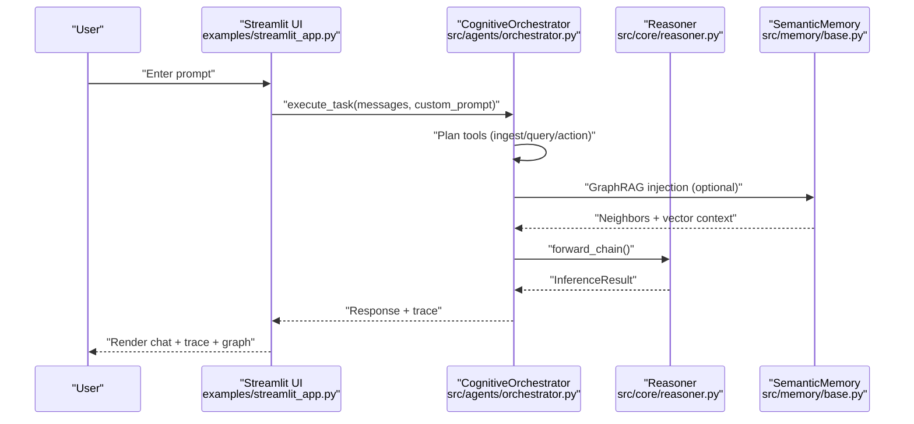
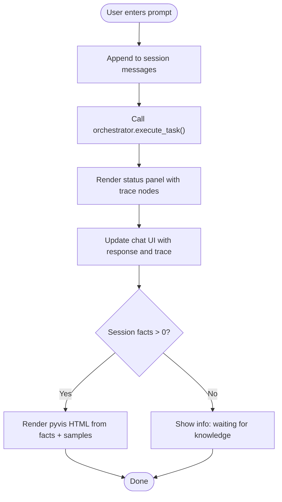
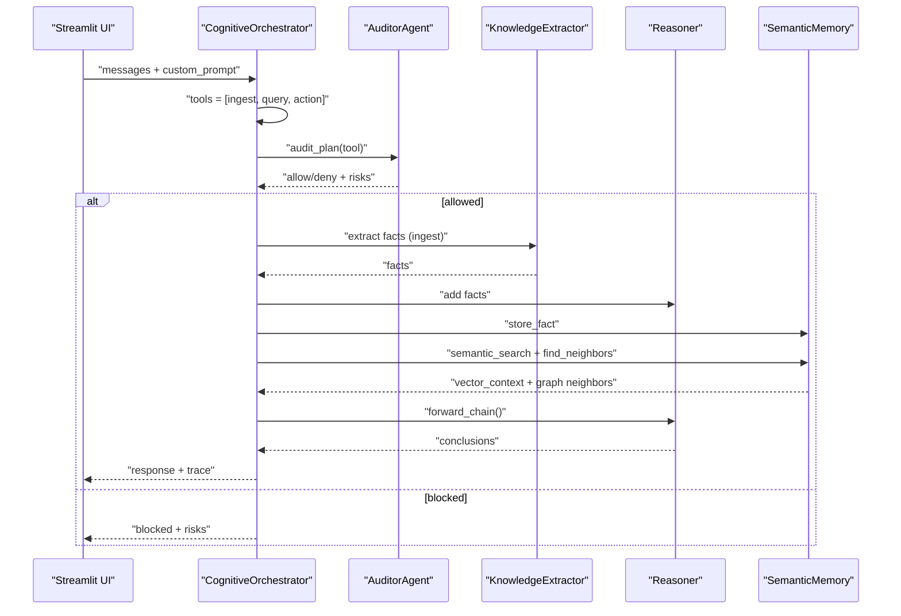
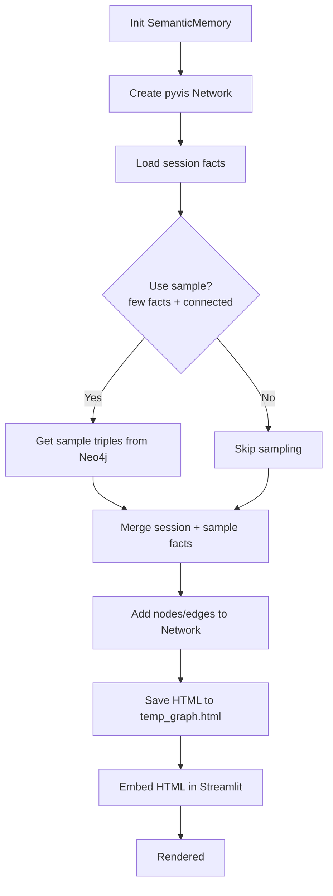
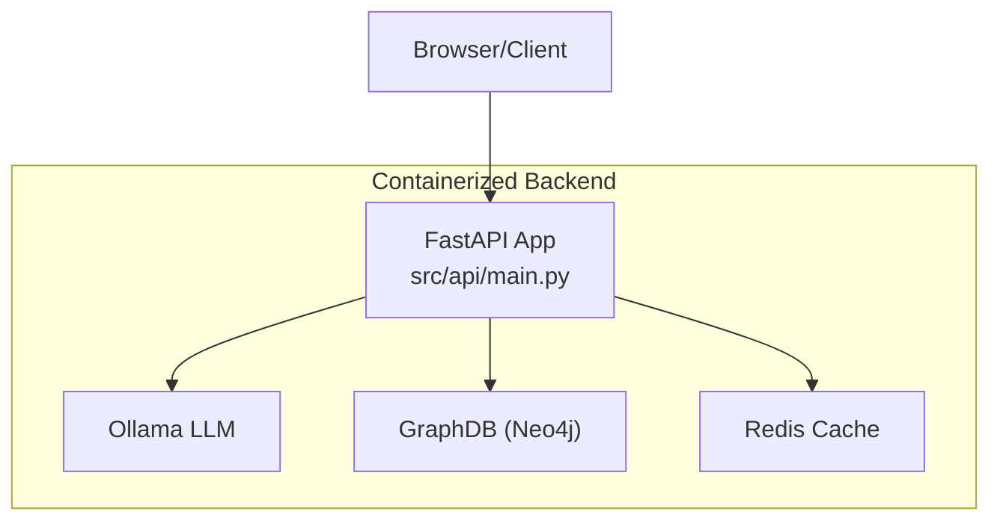
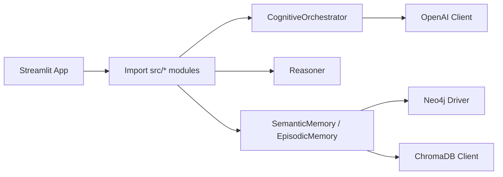

# Web Applications

<cite>
**Referenced Files in This Document**
- [streamlit_app.py](file://examples/streamlit_app.py)
- [README.md](file://README.md)
- [examples/README.md](file://examples/README.md)
- [requirements.txt](file://requirements.txt)
- [Dockerfile](file://Dockerfile)
- [docker-compose.yml](file://docker-compose.yml)
- [reasoner.py](file://src/core/reasoner.py)
- [base.py](file://src/memory/base.py)
- [orchestrator.py](file://src/agents/orchestrator.py)
- [main.py](file://src/api/main.py)
- [persona.md](file://clawra.persona.md)
</cite>

## Table of Contents
1. [Introduction](#introduction)
2. [Project Structure](#project-structure)
3. [Core Components](#core-components)
4. [Architecture Overview](#architecture-overview)
5. [Detailed Component Analysis](#detailed-component-analysis)
6. [Dependency Analysis](#dependency-analysis)
7. [Performance Considerations](#performance-considerations)
8. [Troubleshooting Guide](#troubleshooting-guide)
9. [Conclusion](#conclusion)
10. [Appendices](#appendices)

## Introduction
This section documents the Streamlit-based interactive web application that visualizes the platform’s cognitive orchestration and knowledge graph capabilities. It explains how to deploy and customize the web app, integrate it with backend services, and extend it for custom visualization needs. Guidance is provided on modifying UI components, adding new visualization features, deploying in production, and ensuring accessibility and usability for diverse users.

## Project Structure
The web application is implemented as a single-page Streamlit app that embeds the cognitive orchestration pipeline and renders live knowledge graph visualizations. Supporting backend services include a FastAPI server, Neo4j graph database, and ChromaDB vector store. The following diagram maps the runtime components and their relationships.

**Diagram sources**
- [streamlit_app.py:1-323](file://examples/streamlit_app.py#L1-L323)
- [orchestrator.py:1-366](file://src/agents/orchestrator.py#L1-L366)
- [reasoner.py:1-819](file://src/core/reasoner.py#L1-L819)
- [base.py:1-249](file://src/memory/base.py#L1-L249)

**Section sources**
- [streamlit_app.py:1-323](file://examples/streamlit_app.py#L1-L323)
- [README.md:46-51](file://README.md#L46-L51)
- [examples/README.md:81-87](file://examples/README.md#L81-L87)

## Core Components
- Streamlit App: Provides a dark-mode, wide-layout UI with sidebar controls, chat interface, and interactive knowledge graph visualization.
- CognitiveOrchestrator: Coordinates tool-use loops, integrates extraction, graph queries, and action execution, and returns structured traces.
- Reasoner: Performs forward/backward inference over facts and rules, computing confidence and deriving conclusions.
- SemanticMemory: Bridges persistent knowledge storage (Neo4j) and retrieval (ChromaDB), normalizes entities, and supports hybrid GraphRAG.
- EpisodicMemory: Stores agent episodes and feedback for trajectory reflection and future learning.

**Section sources**
- [streamlit_app.py:58-78](file://examples/streamlit_app.py#L58-L78)
- [orchestrator.py:23-42](file://src/agents/orchestrator.py#L23-L42)
- [reasoner.py:145-180](file://src/core/reasoner.py#L145-L180)
- [base.py:9-28](file://src/memory/base.py#L9-L28)
- [base.py:150-198](file://src/memory/base.py#L150-L198)

## Architecture Overview
The Streamlit app initializes a CognitiveOrchestrator once per session, maintains a chat history, and executes tasks asynchronously. The orchestrator calls out to external services (LLM, Neo4j, ChromaDB) and returns a structured trace for rendering. The sidebar displays real-time metrics and an interactive knowledge graph built from session facts and sampled graph triples.

**Diagram sources**
- [streamlit_app.py:272-323](file://examples/streamlit_app.py#L272-L323)
- [orchestrator.py:128-366](file://src/agents/orchestrator.py#L128-L366)
- [reasoner.py:243-349](file://src/core/reasoner.py#L243-L349)
- [base.py:84-89](file://src/memory/base.py#L84-L89)

## Detailed Component Analysis

### Streamlit Application UI and Interaction Patterns
- Page configuration: Dark theme, wide layout, expanded sidebar.
- Sidebar controls: Persona override persistence, real-time metrics, interactive knowledge graph.
- Chat interface: Messages stored in session state; assistant responses include reasoning traces.
- Knowledge graph visualization: pyvis network rendered from session facts and sampled graph triples.

**Diagram sources**
- [streamlit_app.py:260-323](file://examples/streamlit_app.py#L260-L323)
- [streamlit_app.py:143-186](file://examples/streamlit_app.py#L143-L186)

**Section sources**
- [streamlit_app.py:19-56](file://examples/streamlit_app.py#L19-L56)
- [streamlit_app.py:100-192](file://examples/streamlit_app.py#L100-L192)
- [streamlit_app.py:260-323](file://examples/streamlit_app.py#L260-L323)

### CognitiveOrchestrator Execution Loop
- Tool definitions: ingest_knowledge, query_graph, execute_action.
- Audit and safety: AuditorAgent inspects tool plans; blocks risky actions.
- GraphRAG: Injects neighbors into Reasoner; combines vector context and symbolic inference.
- Trace recording: Captures tool calls, latency, and results for UI rendering.

**Diagram sources**
- [orchestrator.py:54-102](file://src/agents/orchestrator.py#L54-L102)
- [orchestrator.py:227-354](file://src/agents/orchestrator.py#L227-L354)
- [reasoner.py:243-349](file://src/core/reasoner.py#L243-L349)
- [base.py:84-121](file://src/memory/base.py#L84-L121)

**Section sources**
- [orchestrator.py:128-366](file://src/agents/orchestrator.py#L128-L366)
- [reasoner.py:145-180](file://src/core/reasoner.py#L145-L180)
- [base.py:9-28](file://src/memory/base.py#L9-L28)

### Knowledge Graph Rendering Pipeline
- Data sources: Session facts and sampled triples from Neo4j.
- Visualization: pyvis network with node/edge styling; saved HTML embedded via streamlit.components.v1.
- Expandable viewer: Full-size graph in an expander for detailed inspection.

**Diagram sources**
- [streamlit_app.py:143-186](file://examples/streamlit_app.py#L143-L186)
- [base.py:84-89](file://src/memory/base.py#L84-L89)

**Section sources**
- [streamlit_app.py:143-186](file://examples/streamlit_app.py#L143-L186)
- [base.py:84-89](file://src/memory/base.py#L84-L89)

### Backend Services and Production Deployment
- FastAPI server: Provides REST endpoints for reasoning, confidence computation, and export; includes GraphQL support, security middleware, and metrics.
- Dockerfile and docker-compose: Define container images, expose port 8000, and orchestrate API, Ollama, GraphDB, and Redis.
- Environment variables: OPENAI_API_KEY, OPENAI_BASE_URL, OPENAI_MODEL, NEO4J_URI, NEO4J_USER, NEO4J_PASSWORD.

**Diagram sources**
- [main.py:1-17](file://src/api/main.py#L1-L17)
- [docker-compose.yml:1-91](file://docker-compose.yml#L1-L91)
- [Dockerfile:1-33](file://Dockerfile#L1-L33)

**Section sources**
- [main.py:1-17](file://src/api/main.py#L1-L17)
- [docker-compose.yml:1-91](file://docker-compose.yml#L1-L91)
- [Dockerfile:1-33](file://Dockerfile#L1-L33)
- [examples/README.md:95-100](file://examples/README.md#L95-L100)

## Dependency Analysis
- Runtime dependencies include Streamlit, OpenAI client, Neo4j driver, ChromaDB, and related libraries.
- The Streamlit app dynamically imports core modules from src/, enabling tight integration with the orchestrator and memory layers.

**Diagram sources**
- [requirements.txt:1-18](file://requirements.txt#L1-L18)
- [streamlit_app.py:9-14](file://examples/streamlit_app.py#L9-L14)

**Section sources**
- [requirements.txt:1-18](file://requirements.txt#L1-L18)
- [streamlit_app.py:9-14](file://examples/streamlit_app.py#L9-L14)

## Performance Considerations
- Asynchronous orchestration: The Streamlit app wraps async orchestrator calls to avoid blocking the UI.
- Circuit breakers: Reasoner enforces timeouts during forward/backward inference to prevent long-running operations.
- Caching and pruning: MemoryGovernor performs garbage collection to remove low-confidence or outdated facts.
- GraphRAG efficiency: Sampling and neighbor queries limit payload sizes; vector similarity reduces full-text scans.

Recommendations:
- Tune max_depth and timeout parameters in Reasoner for large knowledge bases.
- Pre-warm vector store and graph indices for faster query performance.
- Use pagination and limits in graph queries to keep UI responsive.

**Section sources**
- [streamlit_app.py:290-294](file://examples/streamlit_app.py#L290-L294)
- [reasoner.py:274-277](file://src/core/reasoner.py#L274-L277)
- [reasoner.py:380-382](file://src/core/reasoner.py#L380-L382)
- [orchestrator.py:355-364](file://src/agents/orchestrator.py#L355-L364)

## Troubleshooting Guide
Common issues and resolutions:
- Missing environment variables: Ensure OPENAI_API_KEY and Neo4j credentials are set; otherwise, orchestrator returns an error response.
- GraphDB connectivity: If Neo4j is unreachable, SemanticMemory operates in a degraded mode; the UI shows “Local” and sampling is disabled.
- Streamlit async loop conflicts: The app uses asyncio.run inside Streamlit to execute async tasks safely.
- Persona persistence: Changes to the persona file are saved automatically; verify file write permissions.

Operational checks:
- Health endpoints: Use the API’s health check to confirm service readiness and component status.
- Metrics and logs: Enable logging and monitor performance metrics exposed by the backend.

**Section sources**
- [streamlit_app.py:129-136](file://examples/streamlit_app.py#L129-L136)
- [streamlit_app.py:315-322](file://examples/streamlit_app.py#L315-L322)
- [base.py:47-54](file://src/memory/base.py#L47-L54)
- [README.md:35-44](file://README.md#L35-L44)

## Conclusion
The Streamlit web application provides an accessible, interactive interface to the platform’s cognitive orchestration and knowledge graph systems. By integrating the orchestrator, reasoner, and memory layers, it enables users to ingest knowledge, query the graph, and observe reasoning traces with a live visualization. The backend services and deployment artifacts support scalable production operation, while the UI remains extensible for custom visualizations and workflows.

## Appendices

### Deploying the Streamlit App
- Install dependencies: pip install -r requirements.txt
- Set environment variables for Neo4j and LLM access.
- Run the app: streamlit run examples/streamlit_app.py

**Section sources**
- [examples/README.md:81-87](file://examples/README.md#L81-L87)
- [examples/README.md:95-100](file://examples/README.md#L95-L100)

### Customizing the UI and Adding Visualizations
- Modify page configuration and styles in the Streamlit app header.
- Extend sidebar controls to expose additional runtime toggles or personas.
- Add new visualization panels by generating HTML/JS from backend data and embedding via streamlit.components.v1.
- Persist user preferences using session state or local files.

**Section sources**
- [streamlit_app.py:19-56](file://examples/streamlit_app.py#L19-L56)
- [streamlit_app.py:100-118](file://examples/streamlit_app.py#L100-L118)

### Integrating with Backend Services
- The orchestrator exposes a unified execute_task method; wrap it in Streamlit callbacks to handle user inputs.
- Use environment variables to configure LLM provider and Neo4j connection.
- For production, deploy the FastAPI server behind a reverse proxy and enable authentication and rate limiting.

**Section sources**
- [streamlit_app.py:272-323](file://examples/streamlit_app.py#L272-L323)
- [orchestrator.py:128-139](file://src/agents/orchestrator.py#L128-L139)
- [docker-compose.yml:1-91](file://docker-compose.yml#L1-L91)

### Accessibility Considerations
- Use Streamlit’s built-in accessibility features and ensure sufficient color contrast for dark mode.
- Provide keyboard navigation and screen reader-friendly labels for interactive elements.
- Keep visualizations responsive and avoid relying solely on color to encode meaning.

[No sources needed since this section provides general guidance]