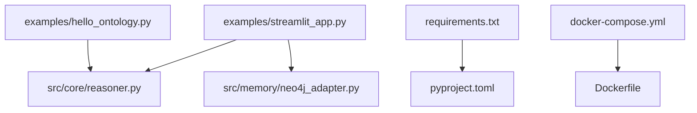
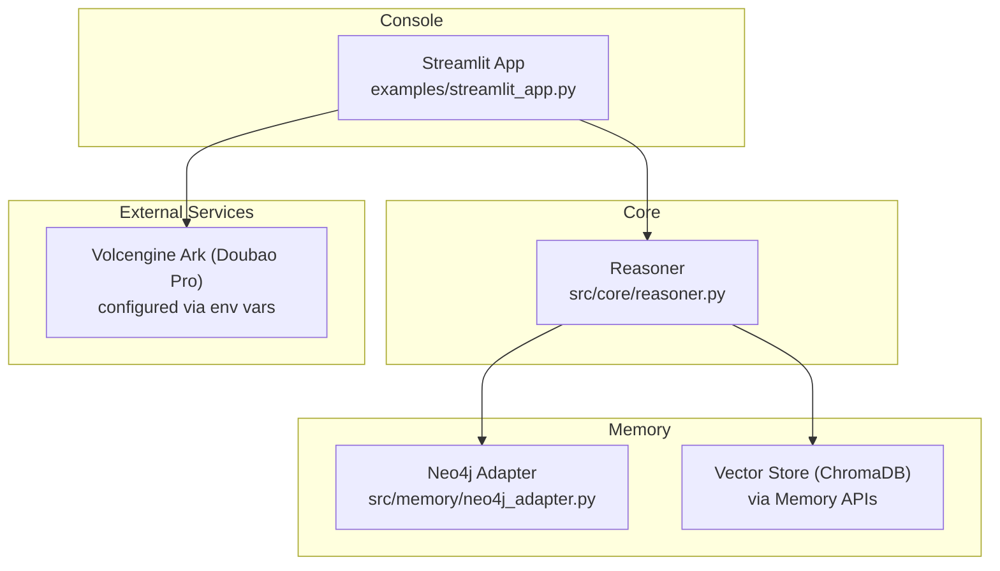
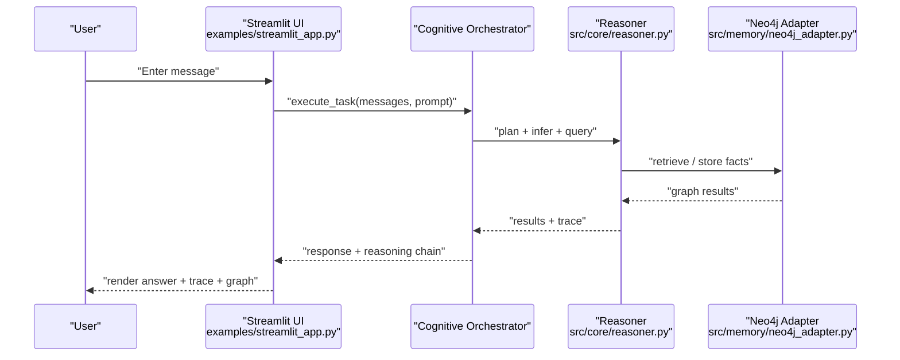
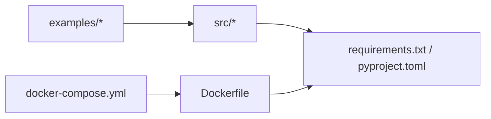

# Getting Started

<cite>
**Referenced Files in This Document**
- [README.md](file://README.md)
- [requirements.txt](file://requirements.txt)
- [pyproject.toml](file://pyproject.toml)
- [examples/hello_ontology.py](file://examples/hello_ontology.py)
- [examples/streamlit_app.py](file://examples/streamlit_app.py)
- [src/core/reasoner.py](file://src/core/reasoner.py)
- [src/memory/neo4j_adapter.py](file://src/memory/neo4j_adapter.py)
- [docker-compose.yml](file://docker-compose.yml)
- [Dockerfile](file://Dockerfile)
</cite>

## Table of Contents
1. [Introduction](#introduction)
2. [Project Structure](#project-structure)
3. [Core Components](#core-components)
4. [Architecture Overview](#architecture-overview)
5. [Detailed Component Analysis](#detailed-component-analysis)
6. [Dependency Analysis](#dependency-analysis)
7. [Performance Considerations](#performance-considerations)
8. [Troubleshooting Guide](#troubleshooting-guide)
9. [Conclusion](#conclusion)
10. [Appendices](#appendices)

## Introduction
This guide helps you rapidly onboard to the Clawra framework, a neuro-symbolic cognitive agent platform. You will install prerequisites, configure environment variables, run the quick-start example, and explore the Streamlit console for visualizing reasoning. The guide also covers Neo4j setup, dependency management, and troubleshooting.

## Project Structure
Key areas of the repository relevant to onboarding:
- examples: runnable demos including hello_ontology.py and streamlit_app.py
- src: core modules for reasoning, memory, perception, and orchestration
- requirements.txt and pyproject.toml: dependency definitions
- docker-compose.yml and Dockerfile: containerized setup
- README.md: high-level overview and quick start

**Diagram sources**
- [examples/hello_ontology.py:1-144](file://examples/hello_ontology.py#L1-L144)
- [examples/streamlit_app.py:1-327](file://examples/streamlit_app.py#L1-L327)
- [src/core/reasoner.py:1-200](file://src/core/reasoner.py#L1-L200)
- [src/memory/neo4j_adapter.py:1-200](file://src/memory/neo4j_adapter.py#L1-L200)
- [requirements.txt:1-18](file://requirements.txt#L1-L18)
- [pyproject.toml:1-74](file://pyproject.toml#L1-L74)
- [docker-compose.yml:1-91](file://docker-compose.yml#L1-L91)
- [Dockerfile:1-33](file://Dockerfile#L1-L33)

**Section sources**
- [README.md:1-86](file://README.md#L1-L86)
- [examples/hello_ontology.py:1-144](file://examples/hello_ontology.py#L1-L144)
- [examples/streamlit_app.py:1-327](file://examples/streamlit_app.py#L1-L327)
- [src/core/reasoner.py:1-200](file://src/core/reasoner.py#L1-L200)
- [src/memory/neo4j_adapter.py:1-200](file://src/memory/neo4j_adapter.py#L1-L200)
- [requirements.txt:1-18](file://requirements.txt#L1-L18)
- [pyproject.toml:1-74](file://pyproject.toml#L1-L74)
- [docker-compose.yml:1-91](file://docker-compose.yml#L1-L91)
- [Dockerfile:1-33](file://Dockerfile#L1-L33)

## Core Components
- Reasoner: symbolic reasoning engine supporting forward/backward inference and confidence propagation
- Neo4j adapter: persistent storage and retrieval of knowledge graphs
- Streamlit console: interactive UI for ingestion, reasoning, and trace visualization
- Example demos: minimal walkthrough and full console

What you will use first:
- Run hello_ontology.py to learn basic usage of the reasoning pipeline
- Launch streamlit_app.py to visualize reasoning traces and interact with the system

**Section sources**
- [src/core/reasoner.py:145-200](file://src/core/reasoner.py#L145-L200)
- [src/memory/neo4j_adapter.py:130-200](file://src/memory/neo4j_adapter.py#L130-L200)
- [examples/hello_ontology.py:17-144](file://examples/hello_ontology.py#L17-L144)
- [examples/streamlit_app.py:1-327](file://examples/streamlit_app.py#L1-L327)

## Architecture Overview
The framework integrates:
- Symbolic reasoning via the Reasoner
- Persistent knowledge graph via Neo4j
- Vector search and retrieval-augmented generation via ChromaDB
- An orchestration layer for planning and tool use
- A Streamlit console for interactive exploration

**Diagram sources**
- [examples/streamlit_app.py:1-327](file://examples/streamlit_app.py#L1-L327)
- [src/core/reasoner.py:1-200](file://src/core/reasoner.py#L1-L200)
- [src/memory/neo4j_adapter.py:1-200](file://src/memory/neo4j_adapter.py#L1-L200)
- [README.md:32-51](file://README.md#L32-L51)

## Detailed Component Analysis

### Quick Start Tutorial: hello_ontology.py
Follow this step-by-step to run the minimal example:
1. Prepare environment
   - Ensure Python 3.10+ is installed
   - Install dependencies from requirements.txt
2. Set PYTHONPATH so the src package is importable
3. Run the script to see:
   - Initialization of the reasoning engine
   - Learning basic facts
   - Adding rules
   - Executing inference and computing confidence
   - Performing natural language queries

Verification steps:
- Confirm the printed version and successful initialization messages
- Verify learned facts and inferred conclusions appear in the output
- Check that confidence scores and reasoning chains are displayed

Next steps:
- Explore demo_confidence_reasoning.py for advanced confidence computation
- Review complete_integration_demo.py for end-to-end workflows
- Consult src/api/README.md for API usage

**Section sources**
- [examples/hello_ontology.py:17-144](file://examples/hello_ontology.py#L17-L144)
- [README.md:21-31](file://README.md#L21-L31)

### Streamlit Console Application
The Streamlit console provides:
- A chat interface for ingesting knowledge and querying
- Real-time metrics for session facts and graph facts
- Interactive visualization of the knowledge graph
- Detailed reasoning traces per tool invocation

Setup:
- Ensure dependencies are installed (including streamlit)
- Configure environment variables for Volcengine Ark and Neo4j
- Launch the app with streamlit run

Operational flow:
- Initialize orchestrator with Reasoner and memory backends
- Accept user prompts and execute tasks asynchronously
- Render structured reasoning traces and vector context
- Allow graph sampling and inspection when connected to Neo4j

**Diagram sources**
- [examples/streamlit_app.py:280-327](file://examples/streamlit_app.py#L280-L327)
- [src/core/reasoner.py:145-200](file://src/core/reasoner.py#L145-L200)
- [src/memory/neo4j_adapter.py:130-200](file://src/memory/neo4j_adapter.py#L130-L200)

**Section sources**
- [examples/streamlit_app.py:1-327](file://examples/streamlit_app.py#L1-L327)
- [src/core/reasoner.py:145-200](file://src/core/reasoner.py#L145-L200)
- [src/memory/neo4j_adapter.py:130-200](file://src/memory/neo4j_adapter.py#L130-L200)

### Environment Configuration and .env Setup
Configure the following environment variables in your environment or .env file:
- Volcengine Ark (Doubao Pro) API:
  - OPENAI_API_KEY: your API key
  - OPENAI_BASE_URL: endpoint URL
  - OPENAI_MODEL: model identifier
- Neo4j:
  - NEO4J_URI: bolt connection URI
  - NEO4J_USER: username
  - NEO4J_PASSWORD: password

Notes:
- The framework reads these variables from the environment
- The Streamlit app demonstrates reading Neo4j credentials from environment variables
- The README provides a template for .env configuration

**Section sources**
- [README.md:32-51](file://README.md#L32-L51)
- [examples/streamlit_app.py:64-73](file://examples/streamlit_app.py#L64-L73)

### Neo4j Setup
Two recommended approaches:
- Local installation: run a Neo4j instance and set NEO4J_URI/USER/PASSWORD accordingly
- Containerized setup: use docker-compose to launch a GraphDB service (alternative to Neo4j) or adapt to your Neo4j deployment

The Streamlit app connects to Neo4j using environment variables and renders a sampled knowledge graph when connected.

**Section sources**
- [README.md:23-31](file://README.md#L23-L31)
- [docker-compose.yml:45-70](file://docker-compose.yml#L45-L70)
- [examples/streamlit_app.py:64-73](file://examples/streamlit_app.py#L64-L73)
- [src/memory/neo4j_adapter.py:179-200](file://src/memory/neo4j_adapter.py#L179-L200)

### Dependency Management
- Python version: >= 3.10
- Core dependencies include RDFLib, OWL-RL, NetworkX, FastAPI, Uvicorn, Pydantic, PyYAML, Requests, Neo4j, ChromaDB, OpenAI, and Streamlit
- Optional development dependencies include pytest, ruff, mypy
- Install with pip using requirements.txt or via pyproject.toml

**Section sources**
- [pyproject.toml:27-37](file://pyproject.toml#L27-L37)
- [requirements.txt:1-18](file://requirements.txt#L1-L18)

## Dependency Analysis
High-level dependency relationships:
- examples depend on src modules
- Streamlit console depends on core reasoning and memory adapters
- Dockerfile installs dependencies from pyproject.toml and copies example assets

**Diagram sources**
- [examples/hello_ontology.py:1-144](file://examples/hello_ontology.py#L1-L144)
- [examples/streamlit_app.py:1-327](file://examples/streamlit_app.py#L1-L327)
- [src/core/reasoner.py:1-200](file://src/core/reasoner.py#L1-L200)
- [src/memory/neo4j_adapter.py:1-200](file://src/memory/neo4j_adapter.py#L1-L200)
- [requirements.txt:1-18](file://requirements.txt#L1-L18)
- [pyproject.toml:1-74](file://pyproject.toml#L1-L74)
- [docker-compose.yml:1-91](file://docker-compose.yml#L1-L91)
- [Dockerfile:1-33](file://Dockerfile#L1-L33)

**Section sources**
- [requirements.txt:1-18](file://requirements.txt#L1-L18)
- [pyproject.toml:1-74](file://pyproject.toml#L1-L74)
- [docker-compose.yml:1-91](file://docker-compose.yml#L1-L91)
- [Dockerfile:1-33](file://Dockerfile#L1-L33)

## Performance Considerations
- Keep PYTHONPATH pointing to src during local runs to avoid import issues
- Prefer vector-backed retrieval for large-scale knowledge to reduce graph traversal costs
- Limit graph sampling in the Streamlit console when working with large graphs
- Use containerized deployments for consistent resource allocation and reproducibility

## Troubleshooting Guide
Common setup issues and resolutions:
- Python version mismatch
  - Ensure Python 3.10+ is installed
- Missing dependencies
  - Install dependencies from requirements.txt
- Import path issues
  - Set PYTHONPATH to include src before running examples
- Neo4j connectivity
  - Verify NEO4J_URI/USER/PASSWORD
  - Confirm the database is reachable and credentials are correct
- Volcengine Ark configuration
  - Ensure OPENAI_API_KEY, OPENAI_BASE_URL, and OPENAI_MODEL are set
- Streamlit app fails to render graph
  - Confirm pyvis is available and Neo4j is connected
- Docker build/run issues
  - Review Dockerfile and docker-compose.yml for correct environment variables and exposed ports

Verification checklist:
- hello_ontology.py runs to completion and prints expected outputs
- Streamlit console starts and shows assistant message
- Metrics sidebar displays Neo4j connection status
- Graph renders when facts are present or when sampling from Neo4j

**Section sources**
- [examples/hello_ontology.py:135-144](file://examples/hello_ontology.py#L135-L144)
- [examples/streamlit_app.py:64-73](file://examples/streamlit_app.py#L64-L73)
- [src/memory/neo4j_adapter.py:179-200](file://src/memory/neo4j_adapter.py#L179-L200)
- [README.md:32-51](file://README.md#L32-L51)

## Conclusion
You are now ready to explore the Clawra framework. Start with hello_ontology.py to understand the reasoning pipeline, then use the Streamlit console to visualize and interact with the system. Configure environment variables for Volcengine Ark and Neo4j, and leverage the provided examples and documentation to deepen your understanding.

## Appendices

### Appendix A: Step-by-Step Onboarding Checklist
- Install Python 3.10+
- Clone the repository and install dependencies
- Create and populate .env with Volcengine Ark and Neo4j settings
- Run hello_ontology.py to validate the setup
- Launch the Streamlit console and inspect the reasoning traces
- Verify Neo4j connection and graph rendering

**Section sources**
- [README.md:21-51](file://README.md#L21-L51)
- [examples/hello_ontology.py:6-8](file://examples/hello_ontology.py#L6-L8)
- [examples/streamlit_app.py:49-51](file://examples/streamlit_app.py#L49-L51)