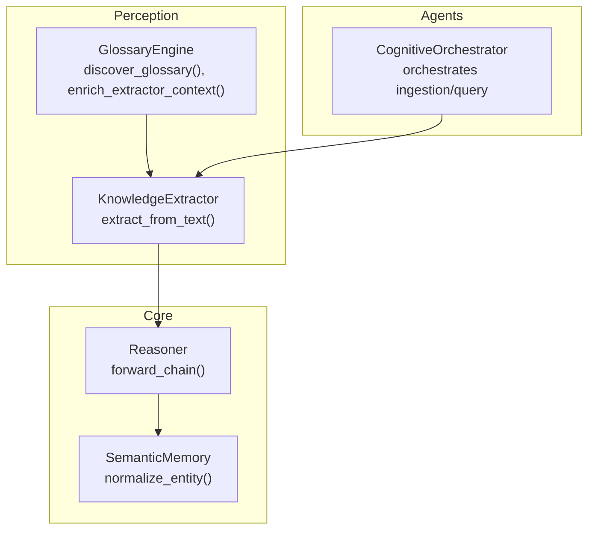
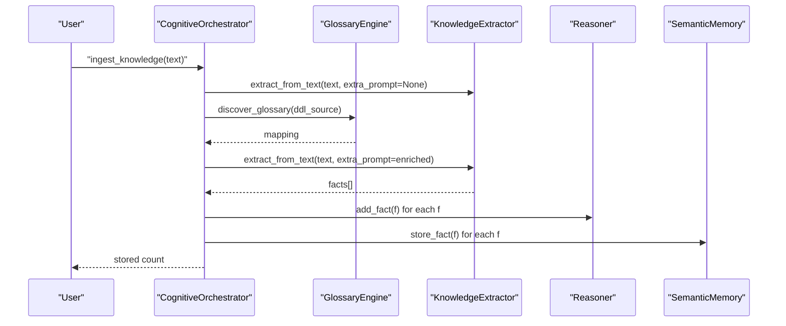
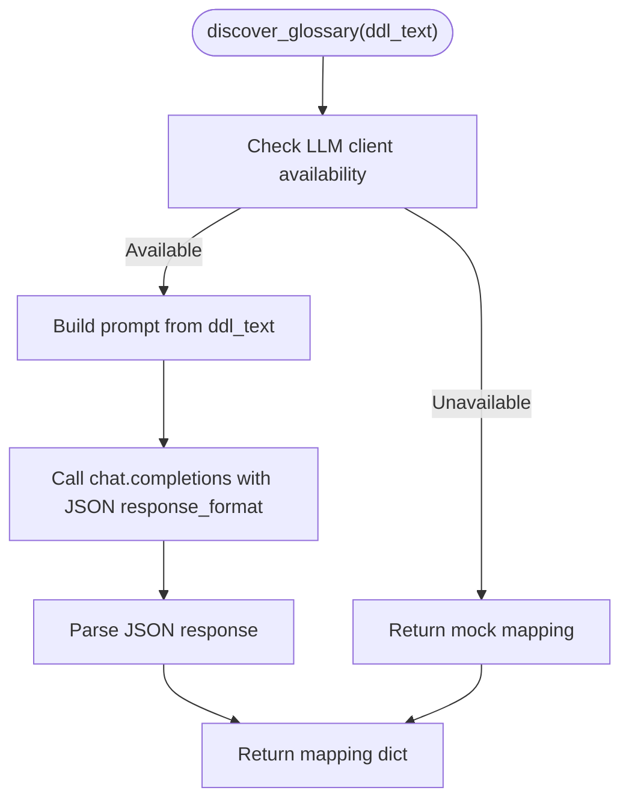
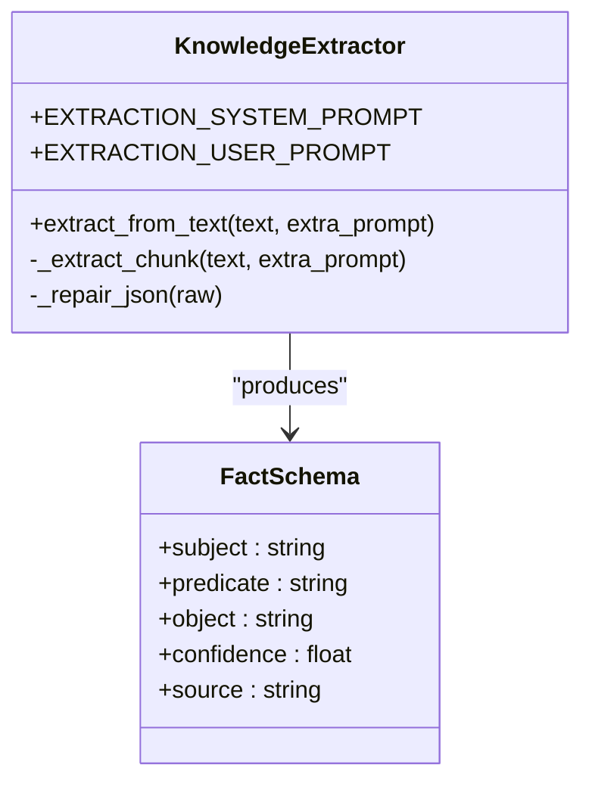
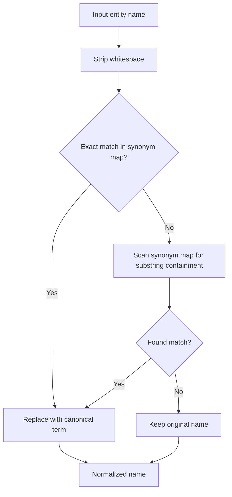
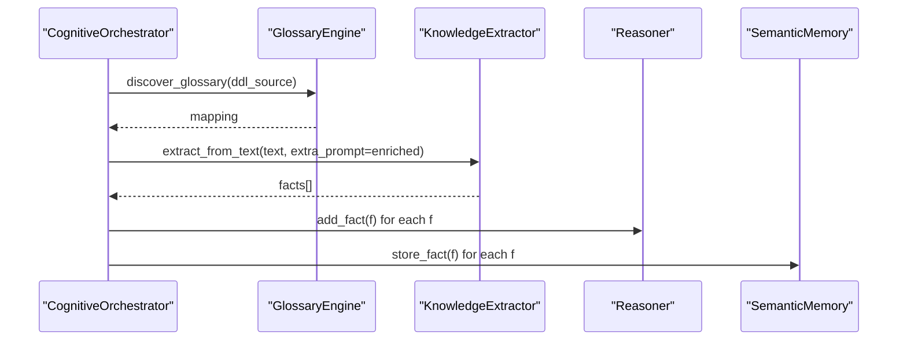
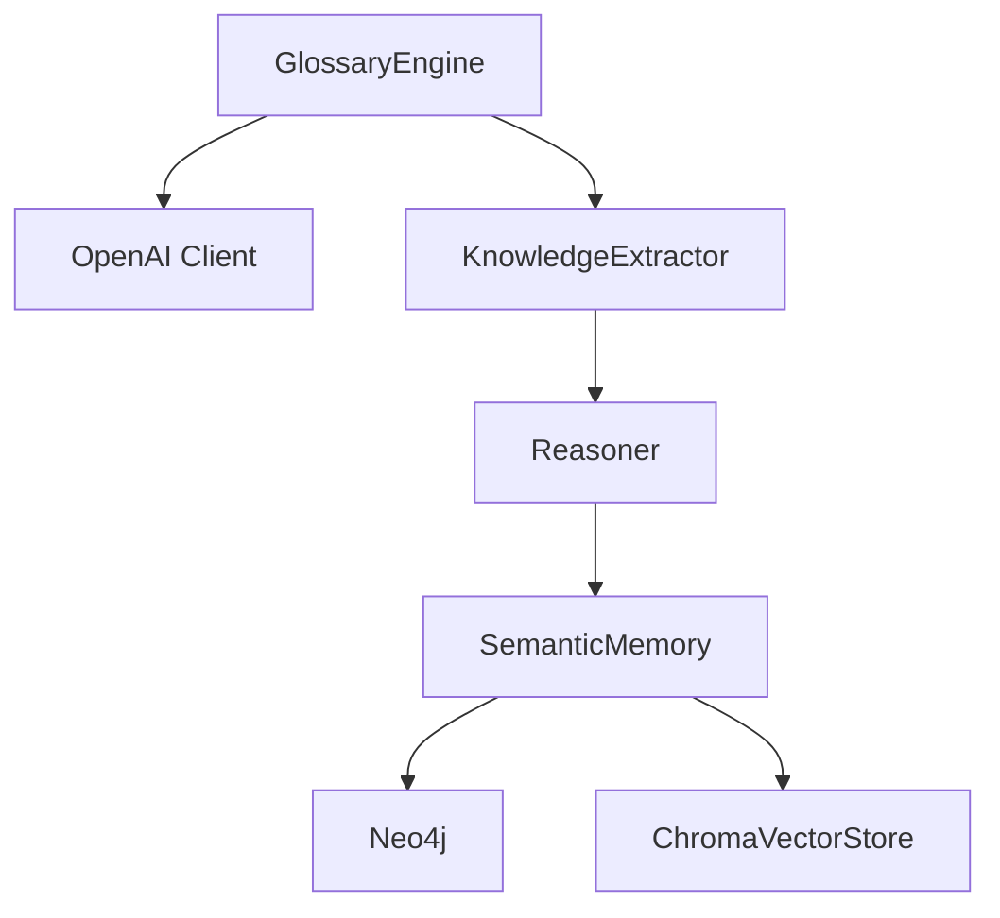

# Glossary Engine and Domain Mapping

<cite>
**Referenced Files in This Document**
- [glossary_engine.py](file://src/perception/glossary_engine.py)
- [extractor.py](file://src/perception/extractor.py)
- [orchestrator.py](file://src/agents/orchestrator.py)
- [reasoner.py](file://src/core/reasoner.py)
- [base.py](file://src/memory/base.py)
- [rdf_adapter.py](file://src/core/ontology/rdf_adapter.py)
- [test_deep_integration.py](file://tests/test_deep_integration.py)
- [ingest_gas_ontology.py](file://scripts/ingest_gas_ontology.py)
- [graph.jsonl](file://data/legacy_memory/ontology/graph.jsonl)
- [demo_supplier_monitor.py](file://examples/demo_supplier_monitor.py)
</cite>

## Table of Contents
1. [Introduction](#introduction)
2. [Project Structure](#project-structure)
3. [Core Components](#core-components)
4. [Architecture Overview](#architecture-overview)
5. [Detailed Component Analysis](#detailed-component-analysis)
6. [Dependency Analysis](#dependency-analysis)
7. [Performance Considerations](#performance-considerations)
8. [Troubleshooting Guide](#troubleshooting-guide)
9. [Conclusion](#conclusion)
10. [Appendices](#appendices)

## Introduction
This document explains the glossary engine and domain-specific terminology mapping system that normalizes domain-specific terms, resolves synonyms and variations, and ensures consistency across extracted facts. It covers:
- How the glossary engine discovers physical-to-business term mappings from DDL/comment sources
- How discovered mappings are injected into the extraction pipeline via extra_prompt parameters
- The domain ontology schema guiding extractions, including core classes, predicates, and quality requirements
- Examples of glossary configurations across industries and strategies for term expansion
- Impact on extraction accuracy and maintenance procedures for domain-specific knowledge engineering

## Project Structure
The glossary engine integrates with the knowledge extraction pipeline and the reasoning layer:
- Glossary discovery extracts mappings from DDL/comment sources
- Extraction pipeline receives enriched prompts with overrides
- Extracted facts are normalized and persisted into semantic memory and graph storage
- Reasoner consumes facts for downstream inference

**Diagram sources**
- [glossary_engine.py:30-70](file://src/perception/glossary_engine.py#L30-L70)
- [extractor.py:278-350](file://src/perception/extractor.py#L278-L350)
- [orchestrator.py:243-258](file://src/agents/orchestrator.py#L243-L258)
- [reasoner.py:243-350](file://src/core/reasoner.py#L243-L350)
- [base.py:55-67](file://src/memory/base.py#L55-L67)

**Section sources**
- [glossary_engine.py:1-71](file://src/perception/glossary_engine.py#L1-L71)
- [extractor.py:39-76](file://src/perception/extractor.py#L39-L76)
- [orchestrator.py:28-42](file://src/agents/orchestrator.py#L28-L42)
- [base.py:9-46](file://src/memory/base.py#L9-L46)

## Core Components
- GlossaryEngine: Discovers physical-to-business term mappings from DDL/comment sources and injects them into extraction prompts.
- KnowledgeExtractor: Uses a core domain ontology schema and extraction rules to produce structured facts, accepting extra_prompt overrides.
- CognitiveOrchestrator: Coordinates ingestion, applies glossary enrichment, and stores facts into the reasoning and memory systems.
- SemanticMemory: Provides entity normalization and persistence of facts into vector and graph stores.
- Reasoner: Maintains a fact base and supports forward/backward chaining with confidence propagation.

**Section sources**
- [glossary_engine.py:9-70](file://src/perception/glossary_engine.py#L9-L70)
- [extractor.py:83-350](file://src/perception/extractor.py#L83-L350)
- [orchestrator.py:23-42](file://src/agents/orchestrator.py#L23-L42)
- [base.py:9-145](file://src/memory/base.py#L9-L145)
- [reasoner.py:145-350](file://src/core/reasoner.py#L145-L350)

## Architecture Overview
The glossary engine participates in the ingestion loop by generating a mapping dictionary and appending it to the extraction prompt as an override section. The extractor enforces the domain ontology schema and quality rules, and the resulting facts are normalized and persisted.

**Diagram sources**
- [orchestrator.py:243-258](file://src/agents/orchestrator.py#L243-L258)
- [glossary_engine.py:30-70](file://src/perception/glossary_engine.py#L30-L70)
- [extractor.py:190-261](file://src/perception/extractor.py#L190-L261)
- [reasoner.py:224-231](file://src/core/reasoner.py#L224-L231)
- [base.py:91-110](file://src/memory/base.py#L91-L110)

## Detailed Component Analysis

### Glossary Engine
- Purpose: Automatically discover mappings from physical identifiers (e.g., database column names) to business terms using LLMs.
- Discovery mechanism: Builds a prompt from DDL/comment text and requests a JSON mapping of physical keys to business terms.
- Enrichment: Converts the mapping into a human-readable override block appended to the extraction prompt.
- Fallback: If no API key is present, returns a small mock mapping for testing.

**Diagram sources**
- [glossary_engine.py:30-55](file://src/perception/glossary_engine.py#L30-L55)

**Section sources**
- [glossary_engine.py:30-70](file://src/perception/glossary_engine.py#L30-L70)
- [test_deep_integration.py:9-22](file://tests/test_deep_integration.py#L9-L22)

### Extraction Pipeline and Domain Ontology Schema
- Extraction prompt composition: The extractor composes a system prompt containing the core domain ontology schema and strict output rules.
- Extra prompt injection: The orchestrator passes the glossary override as extra_prompt, which the extractor appends to the system prompt.
- Output constraints: Enforces class/predicate alignment, density, quality requirement capture, and JSON schema compliance.

**Diagram sources**
- [extractor.py:18-33](file://src/perception/extractor.py#L18-L33)
- [extractor.py:83-350](file://src/perception/extractor.py#L83-L350)

**Section sources**
- [extractor.py:39-76](file://src/perception/extractor.py#L39-L76)
- [extractor.py:190-261](file://src/perception/extractor.py#L190-L261)
- [extractor.py:278-350](file://src/perception/extractor.py#L278-L350)

### Entity Normalization and Consistency
- SemanticMemory provides entity normalization to align synonyms and variations to canonical terms.
- Normalization logic:
  - Exact match against a synonym map
  - Substring containment checks
- This ensures extracted facts consistently refer to standardized entities.

**Diagram sources**
- [base.py:55-67](file://src/memory/base.py#L55-L67)

**Section sources**
- [base.py:29-45](file://src/memory/base.py#L29-L45)
- [base.py:55-67](file://src/memory/base.py#L55-L67)

### Integration with the Extraction Pipeline
- The orchestrator calls KnowledgeExtractor.extract_from_text and passes the enriched prompt containing glossary overrides.
- Extracted facts are validated, de-duplicated, and stored into both the reasoner and semantic memory.

**Diagram sources**
- [orchestrator.py:243-258](file://src/agents/orchestrator.py#L243-L258)
- [glossary_engine.py:57-70](file://src/perception/glossary_engine.py#L57-L70)
- [extractor.py:278-350](file://src/perception/extractor.py#L278-L350)
- [reasoner.py:224-231](file://src/core/reasoner.py#L224-L231)
- [base.py:91-110](file://src/memory/base.py#L91-L110)

**Section sources**
- [orchestrator.py:243-258](file://src/agents/orchestrator.py#L243-L258)
- [extractor.py:190-261](file://src/perception/extractor.py#L190-L261)

### Domain Ontology Schema and Quality Requirements
- Core classes: products/devices, components, technical parameters, quality indicators, business scenarios, standards, brands.
- Core predicates: has_component, has_parameter, applicable_to, complies_with, subClassOf, quality_requirement, technical_feature.
- Extraction rules emphasize:
  - Aligning to defined classes and predicates
  - Capturing quality requirements (e.g., red lines)
  - Including numeric ranges and standards
  - Limiting output density and ensuring JSON validity

**Section sources**
- [extractor.py:39-58](file://src/perception/extractor.py#L39-L58)
- [extractor.py:60-71](file://src/perception/extractor.py#L60-L71)

### Examples of Glossary Configurations Across Industries
- Gas Engineering: Physical-to-business mappings for pressure parameters, flow rates, and device types.
- Procurement: Supplier attributes, standards, and evaluation criteria.
- Consulting: Types, service modes, industry verticals, competencies.
- Energy: Power generation, grid, renewables, carbon management.
- Advertising: DSP, SSP, RTB, attribution metrics.
- Pharmaceuticals: GMP, GCP, QA/QC, regulatory terms.

These examples illustrate how glossaries align domain jargon to canonical terms and guide extraction accuracy.

**Section sources**
- [extractor.py:39-58](file://src/perception/extractor.py#L39-L58)
- [graph.jsonl:1-22](file://data/legacy_memory/ontology/graph.jsonl#L1-L22)

### Term Expansion Strategies
- Manual curation: Maintain and extend synonym maps in semantic memory.
- Automated discovery: Use GlossaryEngine to derive mappings from DDL/comment sources.
- Ontology-driven expansion: Define classes and properties in RDF/OWL adapters to expand schema breadth.
- Iterative refinement: Use reasoning traces and confidence propagation to identify missing mappings.

**Section sources**
- [base.py:29-45](file://src/memory/base.py#L29-L45)
- [glossary_engine.py:30-55](file://src/perception/glossary_engine.py#L30-L55)
- [rdf_adapter.py:88-145](file://src/core/ontology/rdf_adapter.py#L88-L145)

### Impact on Extraction Accuracy
- Consistency: Normalized entities reduce ambiguity and improve recall.
- Guidance: Ontology schema and quality rules constrain extraction to domain-relevant forms.
- Overrides: Glossary mappings correct known aliases and physical abbreviations.
- Validation: Deduplication and schema validation reduce noise.

Empirical validation is demonstrated by tests asserting that glossary mappings influence extraction outcomes.

**Section sources**
- [test_deep_integration.py:9-22](file://tests/test_deep_integration.py#L9-L22)
- [demo_supplier_monitor.py:41-58](file://examples/demo_supplier_monitor.py#L41-L58)

### Maintenance and Best Practices
- Maintain glossary mappings as part of domain knowledge engineering.
- Periodically review extraction outputs and reasoning traces to identify missing mappings.
- Use confidence-aware reasoning to prioritize updates and expansions.
- Persist knowledge using RDF/OWL adapters and graph storage for traceability.

**Section sources**
- [reasoner.py:243-350](file://src/core/reasoner.py#L243-L350)
- [rdf_adapter.py:617-685](file://src/core/ontology/rdf_adapter.py#L617-L685)
- [ingest_gas_ontology.py:17-60](file://scripts/ingest_gas_ontology.py#L17-L60)

## Dependency Analysis
The glossary engine depends on LLM APIs for discovery and integrates with the extractor through extra_prompt. The extractor depends on the domain ontology schema and outputs structured facts consumed by the reasoner and memory systems.

**Diagram sources**
- [glossary_engine.py:17-28](file://src/perception/glossary_engine.py#L17-L28)
- [extractor.py:109-120](file://src/perception/extractor.py#L109-L120)
- [reasoner.py:162-173](file://src/core/reasoner.py#L162-L173)
- [base.py:16-28](file://src/memory/base.py#L16-L28)

**Section sources**
- [glossary_engine.py:17-28](file://src/perception/glossary_engine.py#L17-L28)
- [extractor.py:109-120](file://src/perception/extractor.py#L109-L120)
- [reasoner.py:162-173](file://src/core/reasoner.py#L162-L173)
- [base.py:16-28](file://src/memory/base.py#L16-L28)

## Performance Considerations
- Prompt size: Glossary overrides increase prompt length; keep mappings concise and targeted.
- Chunking: Long documents are chunked to manage token limits during extraction.
- Retry/backoff: Extraction handles rate limits gracefully.
- Normalization cost: Entity normalization is O(n) over the synonym map size; keep maps reasonably sized.

[No sources needed since this section provides general guidance]

## Troubleshooting Guide
- Missing API key: GlossaryEngine falls back to mock mappings; extraction proceeds but may miss domain-specific corrections.
- Extraction failures: The extractor’s JSON repair logic attempts to salvage partial outputs; review logs for parsing errors.
- Normalization mismatches: Verify synonym maps and ensure consistent capitalization and punctuation.
- Reasoning inconsistencies: Use reasoning traces and confidence propagation to identify conflicting facts.

**Section sources**
- [glossary_engine.py:34-36](file://src/perception/glossary_engine.py#L34-L36)
- [extractor.py:122-188](file://src/perception/extractor.py#L122-L188)
- [base.py:55-67](file://src/memory/base.py#L55-L67)
- [reasoner.py:617-642](file://src/core/reasoner.py#L617-L642)

## Conclusion
The glossary engine and domain mapping system provide a robust foundation for aligning physical identifiers with business terms, guiding extraction accuracy, and maintaining consistency across facts. By combining automated discovery, explicit domain schemas, and normalization, the platform improves both precision and interpretability of extracted knowledge.

[No sources needed since this section summarizes without analyzing specific files]

## Appendices

### Appendix A: Glossary Loading Mechanisms
- Environment-driven initialization of LLM client
- Mock fallback for offline development
- Prompt construction tailored to DDL/comment inputs

**Section sources**
- [glossary_engine.py:17-28](file://src/perception/glossary_engine.py#L17-L28)
- [glossary_engine.py:38-43](file://src/perception/glossary_engine.py#L38-L43)

### Appendix B: Term Resolution Algorithms
- Exact match lookup
- Substring containment scanning
- Canonical replacement

**Section sources**
- [base.py:55-67](file://src/memory/base.py#L55-L67)

### Appendix C: Ontology Schema Export and Propagation
- RDF/OWL schema definitions
- Confidence propagation across triples
- Inference tracing and explanation

**Section sources**
- [rdf_adapter.py:88-145](file://src/core/ontology/rdf_adapter.py#L88-L145)
- [rdf_adapter.py:617-754](file://src/core/ontology/rdf_adapter.py#L617-L754)