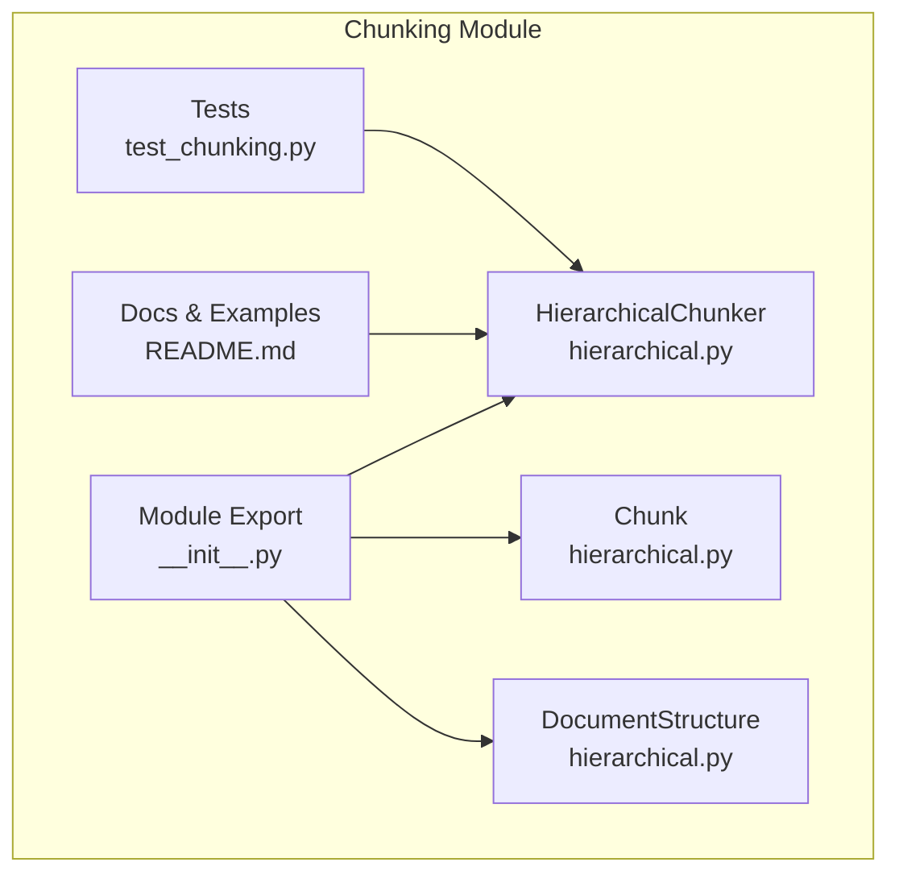
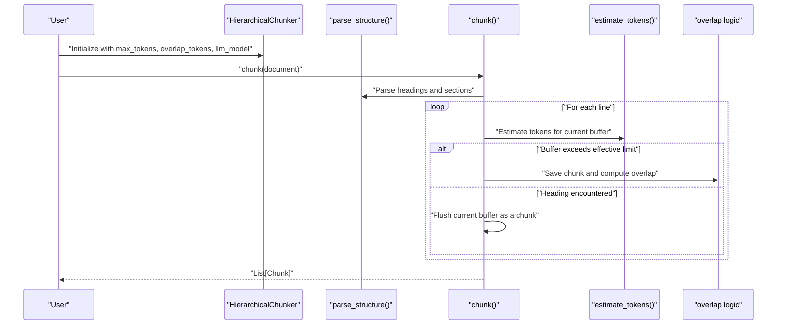
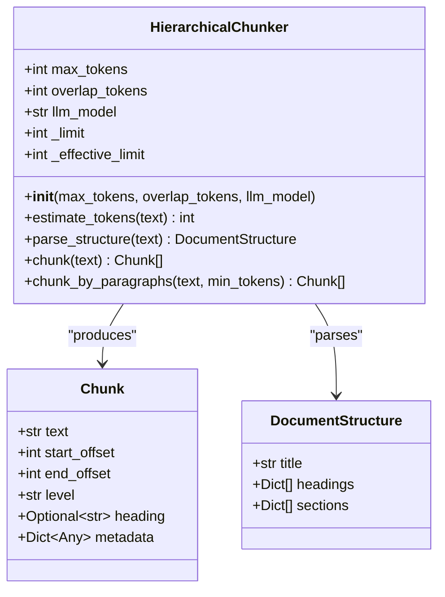
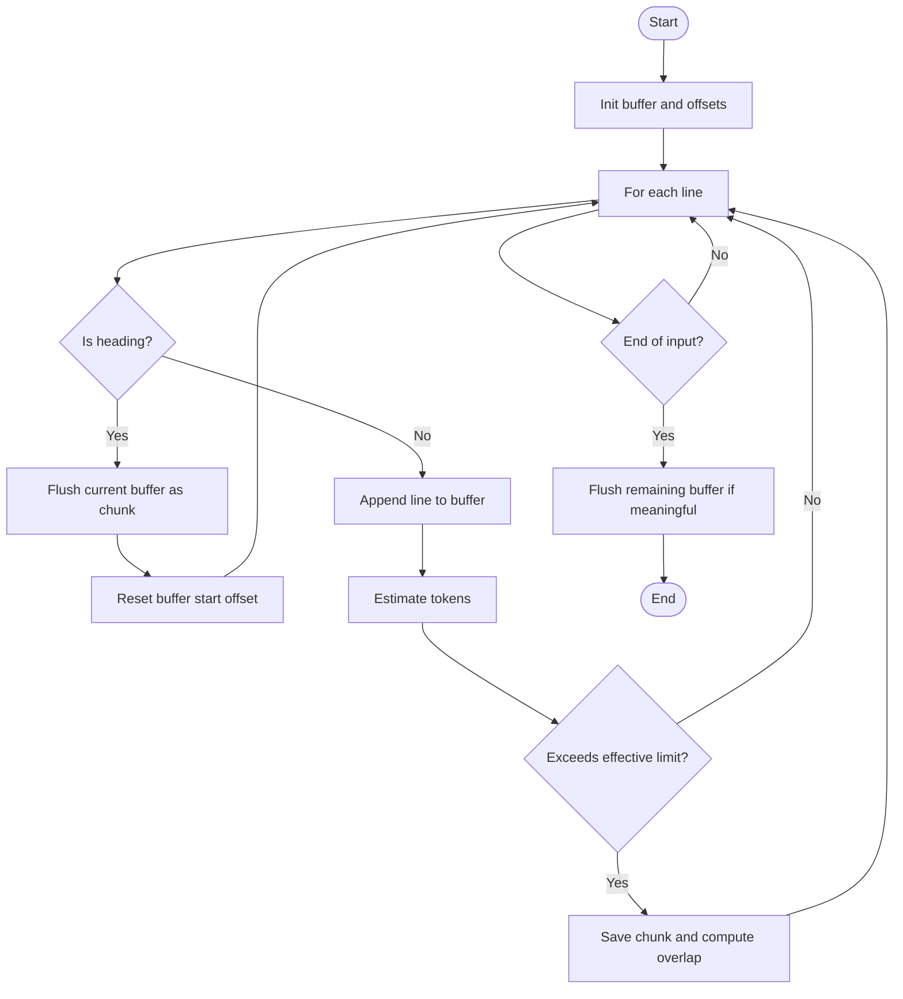
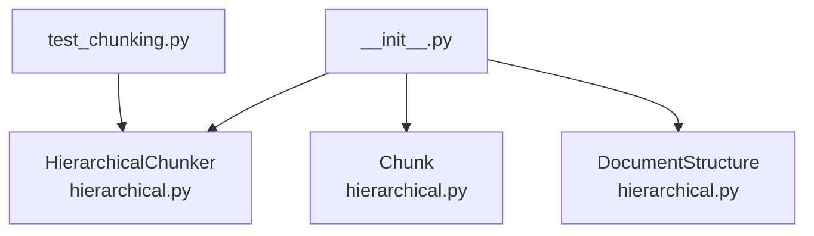

# Hierarchical Document Chunking

<cite>
**Referenced Files in This Document**
- [hierarchical.py](file://src/chunking/hierarchical.py)
- [__init__.py](file://src/chunking/__init__.py)
- [README.md](file://src/chunking/README.md)
- [test_chunking.py](file://tests/test_chunking.py)
- [Clawra_Comprehensive_Analysis_Report.md](file://docs/Clawra_Comprehensive_Analysis_Report.md)
- [contract_review.py](file://scripts/ontology-clawra/contract_review.py)
</cite>

## Table of Contents
1. [Introduction](#introduction)
2. [Project Structure](#project-structure)
3. [Core Components](#core-components)
4. [Architecture Overview](#architecture-overview)
5. [Detailed Component Analysis](#detailed-component-analysis)
6. [Dependency Analysis](#dependency-analysis)
7. [Performance Considerations](#performance-considerations)
8. [Troubleshooting Guide](#troubleshooting-guide)
9. [Conclusion](#conclusion)
10. [Appendices](#appendices)

## Introduction
This document explains the hierarchical document chunking subsystem that intelligently segments long documents into manageable pieces while preserving semantic coherence. It focuses on the HierarchicalChunker class, its token-based sizing, overlap strategies, and fallback mechanisms. The system targets structured content such as technical manuals, research reports, and legal contracts, and it adapts to different LLM context windows to optimize chunk sizes for downstream tasks like retrieval-augmented generation (RAG) and summarization.

## Project Structure
The chunking module resides under src/chunking and exposes a public API via __init__.py. The core implementation is in hierarchical.py, with comprehensive documentation and examples in README.md. Unit tests in tests/test_chunking.py validate correctness and performance.

**Diagram sources**
- [hierarchical.py:1-256](file://src/chunking/hierarchical.py#L1-L256)
- [__init__.py:1-26](file://src/chunking/__init__.py#L1-L26)
- [README.md:1-219](file://src/chunking/README.md#L1-L219)
- [test_chunking.py:1-234](file://tests/test_chunking.py#L1-L234)

**Section sources**
- [hierarchical.py:1-256](file://src/chunking/hierarchical.py#L1-L256)
- [__init__.py:1-26](file://src/chunking/__init__.py#L1-L26)
- [README.md:1-219](file://src/chunking/README.md#L1-L219)
- [test_chunking.py:1-234](file://tests/test_chunking.py#L1-L234)

## Core Components
- HierarchicalChunker: The primary class that parses document structure, estimates token counts, and produces overlapping chunks aligned with headings.
- Chunk: A dataclass representing a chunk with text, offsets, level, heading, and metadata.
- DocumentStructure: A dataclass capturing parsed headings and sections.

Key configuration parameters:
- max_tokens: Upper bound for chunk size in tokens.
- overlap_tokens: Number of tokens to overlap between adjacent chunks to preserve continuity.
- llm_model: Model identifier used to select a context window limit; the effective processing limit is set to 80% of the selected limit.

Token estimation:
- A heuristic estimator is used to approximate token counts for both Chinese and English text, enabling dynamic chunk sizing.

Fallback mechanisms:
- Minimal chunk filtering: Chunks below a small token threshold are ignored.
- Paragraph fallback: A paragraph-based chunking method is available as a secondary strategy.

**Section sources**
- [hierarchical.py:29-256](file://src/chunking/hierarchical.py#L29-L256)
- [README.md:28-87](file://src/chunking/README.md#L28-L87)
- [test_chunking.py:19-51](file://tests/test_chunking.py#L19-L51)

## Architecture Overview
The chunking pipeline follows a deterministic, line-by-line pass over the input text. It identifies headings across multiple formats, maintains a current chunk buffer, and splits when the effective token limit is reached. Overlaps are preserved by carrying forward a portion of the previous chunk’s tokens into the next chunk.

**Diagram sources**
- [hierarchical.py:86-222](file://src/chunking/hierarchical.py#L86-L222)

**Section sources**
- [hierarchical.py:86-222](file://src/chunking/hierarchical.py#L86-L222)

## Detailed Component Analysis

### HierarchicalChunker
Responsibilities:
- Parse document structure to detect headings across Markdown, HTML, and numeric outlines.
- Estimate tokens per line and buffer content until the effective limit is exceeded.
- Emit chunks with metadata including offsets, heading, and line count.
- Manage overlap between consecutive chunks to preserve continuity.

Token-based sizing:
- Effective limit is derived from llm_model and reduced to 80% to reserve headroom for generation.
- estimate_tokens uses a heuristic that distinguishes Chinese-heavy vs. English-heavy content.

Overlap strategy:
- When splitting, the last overlap_tokens words from the current buffer are carried forward to the next chunk’s start.

Fallback mechanisms:
- Minimal chunk suppression: chunks shorter than a small threshold are omitted.
- chunk_by_paragraphs: A paragraph-based fallback for unstructured or minimal-structure documents.

**Diagram sources**
- [hierarchical.py:10-256](file://src/chunking/hierarchical.py#L10-L256)

**Section sources**
- [hierarchical.py:29-256](file://src/chunking/hierarchical.py#L29-L256)

### Token Estimation Heuristic
Behavior:
- Detects whether the text is predominantly Chinese or English and applies a tailored approximation.
- Returns an integer token estimate suitable for chunk boundary decisions.

Edge cases:
- Very short or empty inputs are handled gracefully; the chunker filters out tiny chunks.

**Section sources**
- [hierarchical.py:77-84](file://src/chunking/hierarchical.py#L77-L84)
- [test_chunking.py:53-68](file://tests/test_chunking.py#L53-L68)

### Structure Parsing
Supported heading formats:
- Markdown (# to ######)
- HTML (<h1> to <h6>)
- Numeric outlines (e.g., “1.”, “1.1”, “1.1.1”)

Output:
- DocumentStructure with title, headings, and an empty sections list (sections are not populated in the current implementation).

**Section sources**
- [hierarchical.py:86-139](file://src/chunking/hierarchical.py#L86-L139)

### Chunk Emission and Overlap
Processing logic:
- Lines are scanned sequentially; non-heading lines are accumulated into a buffer.
- When the effective token limit is exceeded, the buffer is emitted as a chunk and the process continues.
- Overlap is computed by taking the last overlap_tokens words from the emitted buffer and placing them at the start of the next buffer.

Finalization:
- After the loop, any remaining buffer content is emitted as the last chunk (filtered if too small).

**Diagram sources**
- [hierarchical.py:141-222](file://src/chunking/hierarchical.py#L141-L222)

**Section sources**
- [hierarchical.py:141-222](file://src/chunking/hierarchical.py#L141-L222)

### Paragraph Fallback
Purpose:
- Provide a simple paragraph-based chunking strategy when structure parsing yields minimal or no headings.

Behavior:
- Splits on blank-line boundaries and filters out chunks below a minimum token threshold.

**Section sources**
- [hierarchical.py:224-256](file://src/chunking/hierarchical.py#L224-L256)

## Dependency Analysis
- Public API exposure: __init__.py exports HierarchicalChunker, Chunk, and DocumentStructure.
- Internal dependencies: hierarchical.py is self-contained with no external imports aside from standard library modules.
- Tests: test_chunking.py validates initialization, limits, token estimation, overlap behavior, structure preservation, and performance.

**Diagram sources**
- [__init__.py:19-25](file://src/chunking/__init__.py#L19-L25)
- [hierarchical.py:10-256](file://src/chunking/hierarchical.py#L10-L256)
- [test_chunking.py:12-13](file://tests/test_chunking.py#L12-L13)

**Section sources**
- [__init__.py:19-25](file://src/chunking/__init__.py#L19-L25)
- [hierarchical.py:10-256](file://src/chunking/hierarchical.py#L10-L256)
- [test_chunking.py:12-13](file://tests/test_chunking.py#L12-L13)

## Performance Considerations
- Complexity: Linear in the number of lines in the input document.
- Memory: Buffer grows incrementally; overlap carries a fixed-size token window from the previous chunk.
- Throughput: Tests confirm sub-second processing for medium-sized documents.
- Tuning:
  - overlap_tokens: Recommended range is 256–512 tokens to balance continuity and overhead.
  - llm_model: Choose a model with a larger context window for longer documents; the effective limit is automatically adjusted to 80% of the selected model’s limit.

**Section sources**
- [README.md:191-207](file://src/chunking/README.md#L191-L207)
- [test_chunking.py:212-229](file://tests/test_chunking.py#L212-L229)

## Troubleshooting Guide
Common issues and resolutions:
- Empty or whitespace-only documents: The chunker emits zero or a single empty chunk; adjust preprocessing to remove leading/trailing whitespace.
- Malformed headings: The parser supports Markdown, HTML, and numeric outlines; ensure headings follow one of these formats for reliable chunking.
- Very short chunks: The system suppresses chunks below a small token threshold; increase max_tokens or reduce overlap_tokens to produce larger chunks.
- Mixed content formats: The parser recognizes headings across formats; if headings are missing, consider using the paragraph fallback method.
- Extremely long documents: Increase max_tokens or select a model with a larger context window to reduce the number of splits.

Validation references:
- Initialization and model limits: [test_chunking.py:19-44](file://tests/test_chunking.py#L19-L44)
- Token estimation correctness: [test_chunking.py:53-68](file://tests/test_chunking.py#L53-L68)
- Overlap behavior: [test_chunking.py:97-116](file://tests/test_chunking.py#L97-L116)
- Structure preservation: [test_chunking.py:117-142](file://tests/test_chunking.py#L117-L142)
- Empty document handling: [test_chunking.py:144-154](file://tests/test_chunking.py#L144-L154)
- Long document behavior: [test_chunking.py:156-171](file://tests/test_chunking.py#L156-L171)

**Section sources**
- [test_chunking.py:19-171](file://tests/test_chunking.py#L19-L171)

## Conclusion
The hierarchical chunking subsystem provides a robust, structure-aware approach to segmenting long documents for LLM consumption. By aligning chunk boundaries with headings, estimating tokens dynamically, and applying controlled overlaps, it preserves semantic coherence while respecting model context windows. The design offers clear configuration knobs and fallback strategies to handle diverse document types and edge cases.

## Appendices

### Configuration Parameters
- max_tokens: Upper bound for chunk size in tokens.
- overlap_tokens: Number of tokens to overlap between adjacent chunks.
- llm_model: Model identifier used to select a context window limit; effective processing limit is 80% of the selected model’s limit.

**Section sources**
- [hierarchical.py:56-76](file://src/chunking/hierarchical.py#L56-L76)
- [README.md:28-87](file://src/chunking/README.md#L28-L87)

### Example Workflows

#### Technical Manual
- Typical structure: Markdown headings, code blocks, tables, and figures.
- Strategy: Rely on parse_structure to split at headings; adjust overlap_tokens to keep procedural context across steps.

**Section sources**
- [README.md:155-189](file://src/chunking/README.md#L155-L189)

#### Research Report
- Typical structure: Executive summary, sections, subsections, figures, tables.
- Strategy: Use default settings; rely on structure parsing to align chunks with sections and subsections.

**Section sources**
- [Clawra_Comprehensive_Analysis_Report.md:1-78](file://docs/Clawra_Comprehensive_Analysis_Report.md#L1-L78)
- [README.md:155-189](file://src/chunking/README.md#L155-L189)

#### Legal Contract
- Typical structure: Articles, clauses, recitals, schedules.
- Strategy: Use higher overlap_tokens for continuity across clause boundaries; consider paragraph fallback if headings are sparse.

**Section sources**
- [contract_review.py:1-417](file://scripts/ontology-clawra/contract_review.py#L1-L417)
- [README.md:155-189](file://src/chunking/README.md#L155-L189)

### Edge Cases and Recommendations
- Malformed documents: Ensure headings conform to supported formats; otherwise, use chunk_by_paragraphs.
- Very short texts: Increase max_tokens or reduce overlap_tokens to avoid excessive fragmentation.
- Mixed content formats: Prefer Markdown or HTML headings; numeric outlines are supported but less precise.

**Section sources**
- [hierarchical.py:86-139](file://src/chunking/hierarchical.py#L86-L139)
- [hierarchical.py:224-256](file://src/chunking/hierarchical.py#L224-L256)