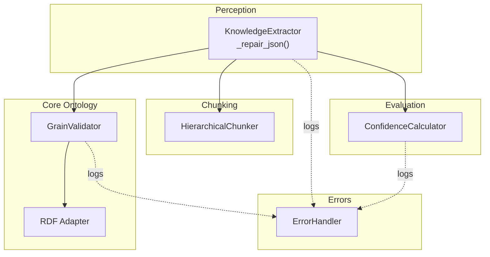
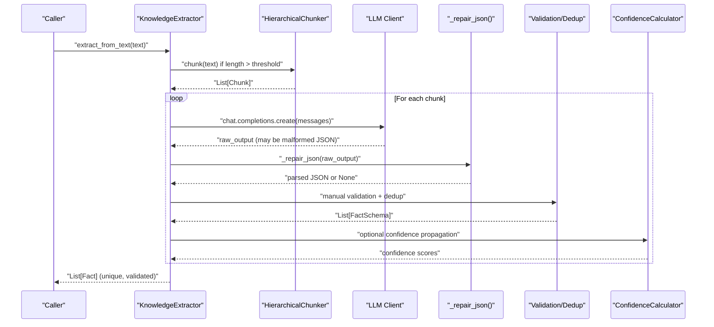
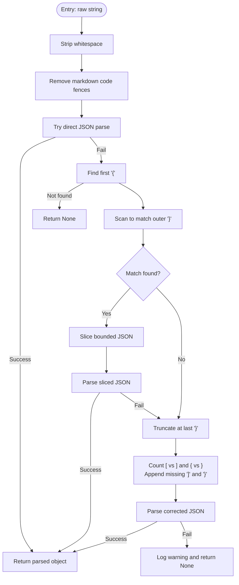
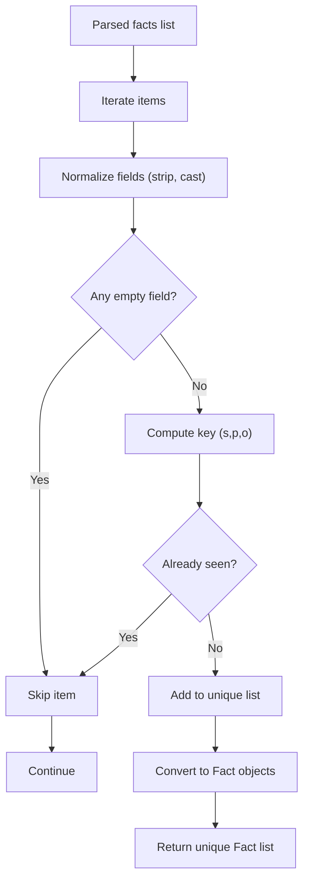
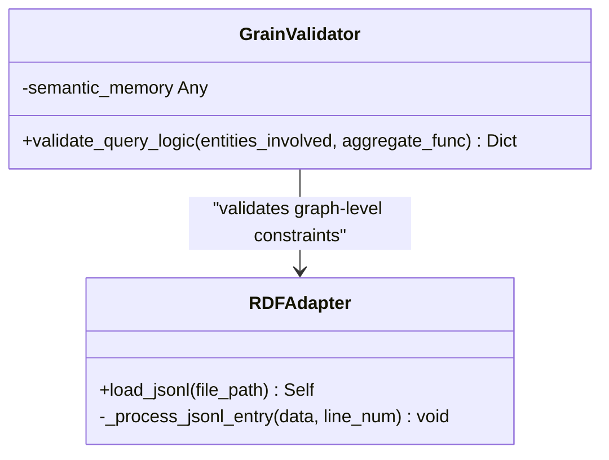
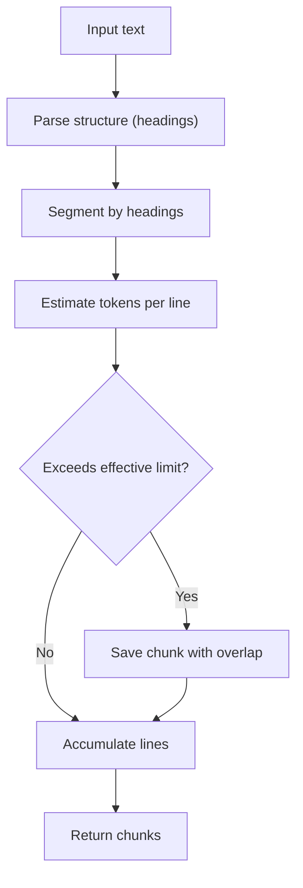
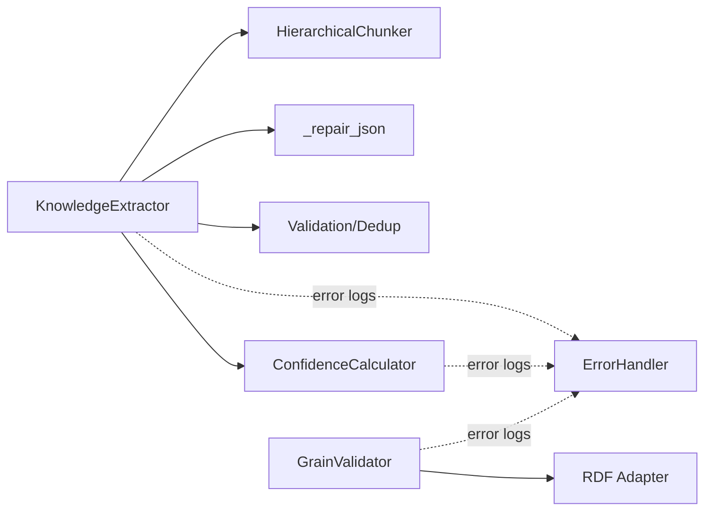

# JSON Repair and Validation

<cite>
**Referenced Files in This Document**
- [extractor.py](file://src/perception/extractor.py)
- [grain_validator.py](file://src/core/ontology/grain_validator.py)
- [rdf_adapter.py](file://src/core/ontology/rdf_adapter.py)
- [confidence.py](file://src/eval/confidence.py)
- [hierarchical.py](file://src/chunking/hierarchical.py)
- [errors.py](file://src/errors.py)
</cite>

## Table of Contents
1. [Introduction](#introduction)
2. [Project Structure](#project-structure)
3. [Core Components](#core-components)
4. [Architecture Overview](#architecture-overview)
5. [Detailed Component Analysis](#detailed-component-analysis)
6. [Dependency Analysis](#dependency-analysis)
7. [Performance Considerations](#performance-considerations)
8. [Troubleshooting Guide](#troubleshooting-guide)
9. [Conclusion](#conclusion)

## Introduction
This document explains the JSON repair and validation system used to process LLM outputs into structured, validated knowledge triples. It focuses on:
- The _repair_json method’s multi-strategy approach to fixing malformed JSON produced by LLMs
- The validation logic ensuring extracted facts meet schema requirements (confidence ranges, empty value filtering, duplicate detection)
- Robustness against common parsing failures and edge cases
- Practical examples of repair scenarios and validation outcomes

## Project Structure
The JSON repair and validation pipeline spans several modules:
- Perception layer: LLM-driven extraction and JSON repair
- Chunking layer: Long-document segmentation to keep LLM prompts manageable
- Evaluation layer: Confidence computation and propagation
- Core Ontology layer: Graph-level validation and schema enforcement
- Error handling: Centralized logging and diagnostics



**Diagram sources**
- [extractor.py:122-188](file://src/perception/extractor.py#L122-L188)
- [hierarchical.py:29-222](file://src/chunking/hierarchical.py#L29-L222)
- [confidence.py:32-260](file://src/eval/confidence.py#L32-L260)
- [grain_validator.py:13-55](file://src/core/ontology/grain_validator.py#L13-L55)
- [rdf_adapter.py:290-328](file://src/core/ontology/rdf_adapter.py#L290-L328)
- [errors.py:276-316](file://src/errors.py#L276-L316)

**Section sources**
- [extractor.py:122-188](file://src/perception/extractor.py#L122-L188)
- [hierarchical.py:29-222](file://src/chunking/hierarchical.py#L29-L222)
- [confidence.py:32-260](file://src/eval/confidence.py#L32-L260)
- [grain_validator.py:13-55](file://src/core/ontology/grain_validator.py#L13-L55)
- [rdf_adapter.py:290-328](file://src/core/ontology/rdf_adapter.py#L290-L328)
- [errors.py:276-316](file://src/errors.py#L276-L316)

## Core Components
- KnowledgeExtractor: Orchestrates long-document chunking, LLM calls, JSON repair, manual validation, deduplication, and conversion to core Fact objects.
- _repair_json: Multi-strategy JSON repair to handle markdown fences, partial objects, and truncated arrays/objects.
- HierarchicalChunker: Intelligent segmentation preserving document structure and token budgets.
- ConfidenceCalculator: Computes and propagates confidence across evidence and reasoning steps.
- GrainValidator: Detects fan-trap risks in graph-level aggregations via dynamic grain cardinality checks.
- RDF Adapter: Loads and validates JSONL triples with minimal schema checks.
- ErrorHandler: Centralized logging and error statistics for diagnostics.

**Section sources**
- [extractor.py:83-350](file://src/perception/extractor.py#L83-L350)
- [hierarchical.py:29-222](file://src/chunking/hierarchical.py#L29-L222)
- [confidence.py:32-260](file://src/eval/confidence.py#L32-L260)
- [grain_validator.py:13-55](file://src/core/ontology/grain_validator.py#L13-L55)
- [rdf_adapter.py:290-328](file://src/core/ontology/rdf_adapter.py#L290-L328)
- [errors.py:276-316](file://src/errors.py#L276-L316)

## Architecture Overview
End-to-end flow from raw LLM output to validated knowledge:



**Diagram sources**
- [extractor.py:190-350](file://src/perception/extractor.py#L190-L350)
- [hierarchical.py:141-222](file://src/chunking/hierarchical.py#L141-L222)
- [confidence.py:222-260](file://src/eval/confidence.py#L222-L260)

## Detailed Component Analysis

### JSON Repair Strategy (_repair_json)
The _repair_json method applies a layered repair approach to recover valid JSON from LLM outputs:

- Strategy 1: Direct parse after trimming
  - Attempt to parse the stripped raw string directly.
  - If successful, return the parsed object.

- Strategy 2: Remove markdown code fence markers
  - Strip leading and trailing markdown fences (including language hints) before attempting to parse.

- Strategy 3: Locate outermost balanced object boundaries
  - Find the first opening brace and scan forward to match the outermost closing brace.
  - Parse the substring bounded by these indices.

- Strategy 4: Truncation recovery
  - If parsing fails, truncate at the last complete closing brace.
  - Count unmatched brackets and append missing closing brackets to balance arrays and objects.
  - Attempt to parse the corrected candidate.



**Diagram sources**
- [extractor.py:122-188](file://src/perception/extractor.py#L122-L188)

Examples of transformations:
- Before: "```json\n{\"facts\": []}\n```"
  - After: {"facts": []}
- Before: "{\"facts\": [{... incomplete ..."
  - After: {"facts": [...]} (with appended closing brackets)

Edge cases handled:
- Empty or whitespace-only inputs
- No opening brace present
- Unbalanced brackets at the end

**Section sources**
- [extractor.py](file://src/perception/extractor.py#L122-L188)

### Validation Logic for Extracted Facts
After repair and parsing, the extractor performs manual validation and deduplication:

- Manual schema conversion using Pydantic-like constraints:
  - subject, predicate, object are strings; confidence is float constrained to [0.0, 1.0].
  - source defaults to a constant; values are normalized and stripped.
- Empty value filtering:
  - Skip facts where any of subject, predicate, or object is empty after normalization.
- Duplicate detection:
  - Deduplicate by constructing a tuple key (subject, predicate, object) and keeping the first occurrence.



**Diagram sources**
- [extractor.py](file://src/perception/extractor.py#L239-L342)

Confidence handling:
- Confidence values are converted to float and constrained to [0.0, 1.0] during schema conversion.
- ConfidenceCalculator supports multiple propagation methods (min, arithmetic mean, geometric mean, multiplicative) for reasoning chains.

**Section sources**
- [extractor.py](file://src/perception/extractor.py#L239-L342)
- [confidence.py](file://src/eval/confidence.py#L222-L260)

### Graph-Level Validation and Schema Enforcement
While the extraction pipeline validates per-triple constraints, higher-level graph validation ensures schema compliance:

- GrainValidator dynamically inspects entity grain cardinalities from semantic memory to detect fan-trap risks in aggregations.
- RDF Adapter loads JSONL triples and logs warnings for missing fields or parse errors.



**Diagram sources**
- [grain_validator.py](file://src/core/ontology/grain_validator.py#L13-L55)
- [rdf_adapter.py](file://src/core/ontology/rdf_adapter.py#L290-L328)

**Section sources**
- [grain_validator.py](file://src/core/ontology/grain_validator.py#L13-L55)
- [rdf_adapter.py](file://src/core/ontology/rdf_adapter.py#L290-L328)

### Document Chunking and Prompt Management
To reduce malformed outputs, long documents are segmented intelligently:

- HierarchicalChunker parses document structure (Markdown, HTML, numbered headings) and segments while estimating token counts.
- Overlap tokens preserve continuity across chunk boundaries.
- Fallbacks include paragraph-based chunking and character-based fallback when structural cues are absent.



**Diagram sources**
- [hierarchical.py](file://src/chunking/hierarchical.py#L141-L222)

**Section sources**
- [hierarchical.py](file://src/chunking/hierarchical.py#L29-L222)

## Dependency Analysis
- KnowledgeExtractor depends on:
  - HierarchicalChunker for segmentation
  - _repair_json for JSON recovery
  - Manual validation/dedup for schema compliance
  - ConfidenceCalculator for optional confidence propagation
- GrainValidator relies on semantic memory to fetch entity grain cardinalities.
- ErrorHandler centralizes logging for diagnostics across modules.



**Diagram sources**
- [extractor.py:122-350](file://src/perception/extractor.py#L122-L350)
- [hierarchical.py:29-222](file://src/chunking/hierarchical.py#L29-L222)
- [confidence.py:32-260](file://src/eval/confidence.py#L32-L260)
- [grain_validator.py:13-55](file://src/core/ontology/grain_validator.py#L13-L55)
- [errors.py:276-316](file://src/errors.py#L276-L316)

**Section sources**
- [extractor.py:122-350](file://src/perception/extractor.py#L122-L350)
- [hierarchical.py:29-222](file://src/chunking/hierarchical.py#L29-L222)
- [confidence.py:32-260](file://src/eval/confidence.py#L32-L260)
- [grain_validator.py:13-55](file://src/core/ontology/grain_validator.py#L13-L55)
- [errors.py:276-316](file://src/errors.py#L276-L316)

## Performance Considerations
- Token estimation: Using heuristic ratios for Chinese and English text helps avoid oversized prompts.
- Chunk overlap: Retaining overlap tokens improves contextual coherence across chunk boundaries.
- Repair cost: The four-stage repair avoids expensive parsing retries by prioritizing fast checks first.
- Deduplication: Set-based uniqueness check scales linearly with number of facts.

[No sources needed since this section provides general guidance]

## Troubleshooting Guide
Common issues and resolutions:

- JSON repair failure
  - Symptom: _repair_json returns None; extraction logs a warning with raw output length.
  - Actions:
    - Verify LLM output is not empty or whitespace-only.
    - Ensure the output contains a leading opening brace; otherwise, prompt engineering should guarantee a JSON object envelope.
    - Confirm markdown fences are not nested or malformed.
  - Related code paths:
    - [extractor.py:122-188](file://src/perception/extractor.py#L122-L188)

- Empty or invalid facts after parsing
  - Symptom: No facts returned or filtered out.
  - Actions:
    - Check that subject, predicate, and object are non-empty after normalization.
    - Validate confidence values fall within [0.0, 1.0].
  - Related code paths:
    - [extractor.py:239-342](file://src/perception/extractor.py#L239-L342)

- Duplicate facts
  - Symptom: Fewer unique facts than parsed items.
  - Actions:
    - Confirm deduplication key (subject, predicate, object) is computed consistently.
  - Related code paths:
    - [extractor.py:323-331](file://src/perception/extractor.py#L323-L331)

- Long document segmentation issues
  - Symptom: No chunks generated or overly large chunks.
  - Actions:
    - Provide clearer headings or enable paragraph fallback.
    - Adjust overlap tokens to improve continuity.
  - Related code paths:
    - [hierarchical.py:141-222](file://src/chunking/hierarchical.py#L141-L222)

- Graph-level validation warnings
  - Symptom: Missing fields or parse errors when loading JSONL.
  - Actions:
    - Ensure required fields (subject, predicate, object) are present.
    - Validate JSONL entries are well-formed.
  - Related code paths:
    - [rdf_adapter.py:290-328](file://src/core/ontology/rdf_adapter.py#L290-L328)

- Centralized error logging
  - Use ErrorHandler to track error counts and recent errors for diagnosis.
  - Related code paths:
    - [errors.py:276-316](file://src/errors.py#L276-L316)

**Section sources**
- [extractor.py:122-188](file://src/perception/extractor.py#L122-L188)
- [extractor.py:239-342](file://src/perception/extractor.py#L239-L342)
- [hierarchical.py:141-222](file://src/chunking/hierarchical.py#L141-L222)
- [rdf_adapter.py:290-328](file://src/core/ontology/rdf_adapter.py#L290-L328)
- [errors.py:276-316](file://src/errors.py#L276-L316)

## Conclusion
The JSON repair and validation system combines robust multi-strategy JSON recovery, strict per-triple validation, deduplication, and graph-level schema checks to produce reliable knowledge triples from LLM outputs. By segmenting long documents, applying targeted repair strategies, and centralizing diagnostics, the pipeline remains resilient to common LLM output pitfalls while maintaining high data quality.