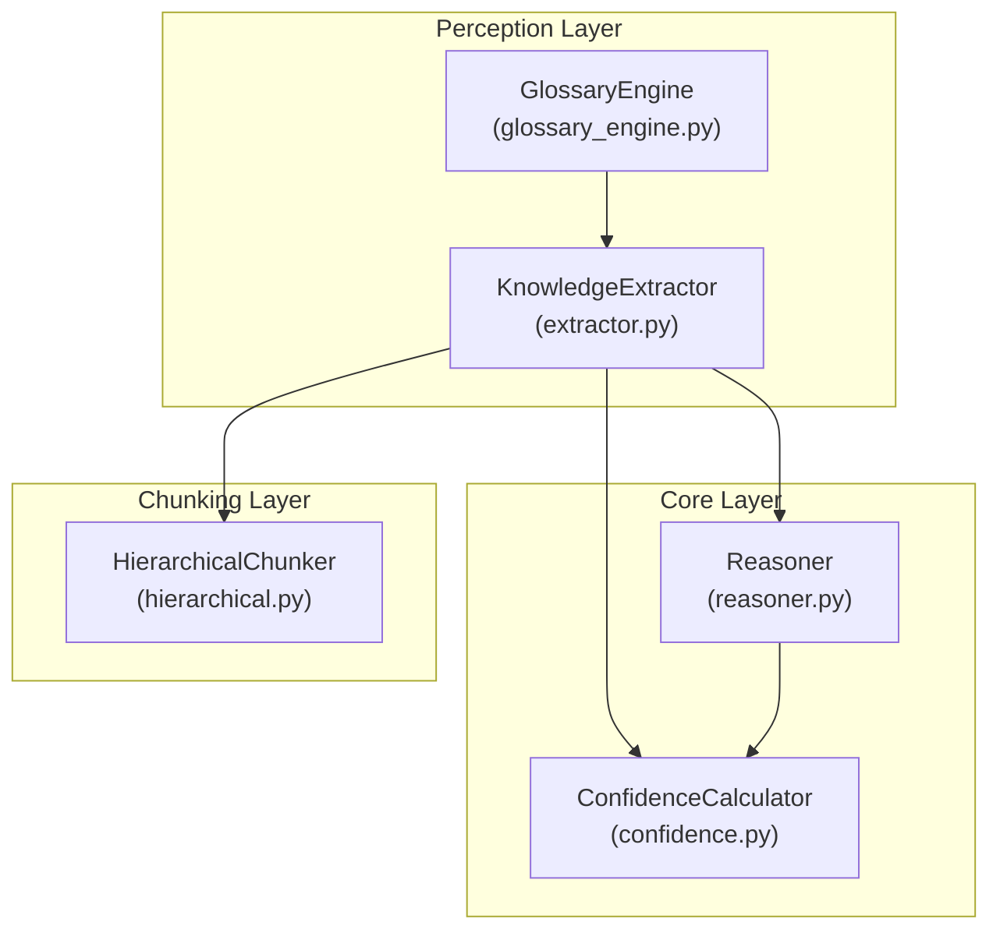
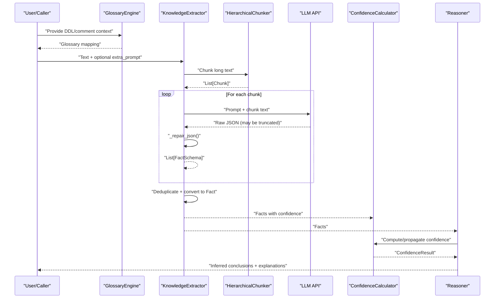
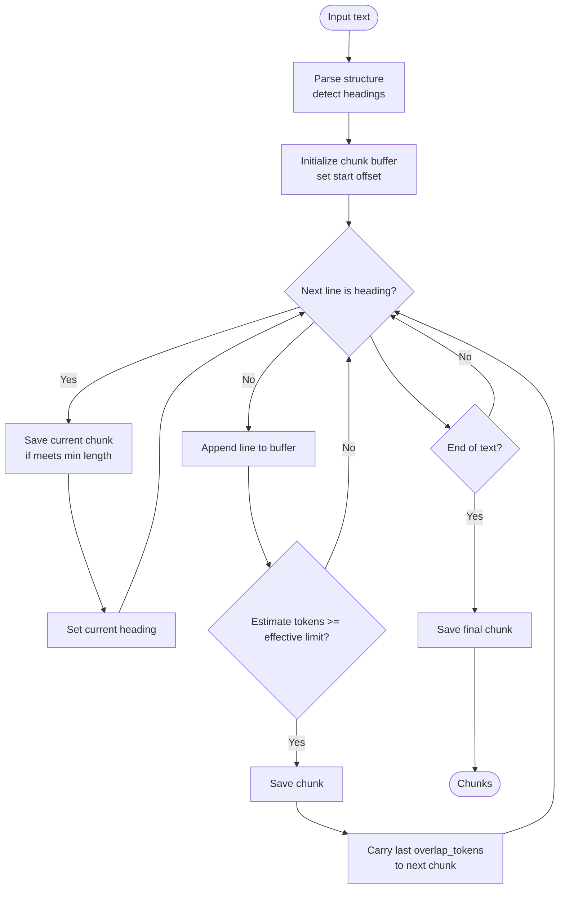
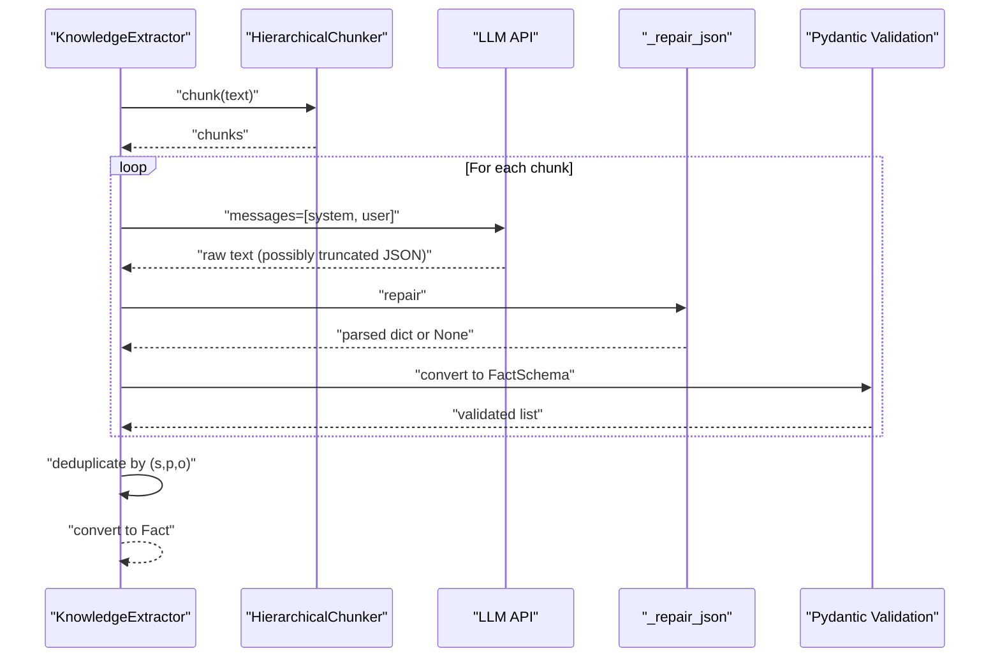
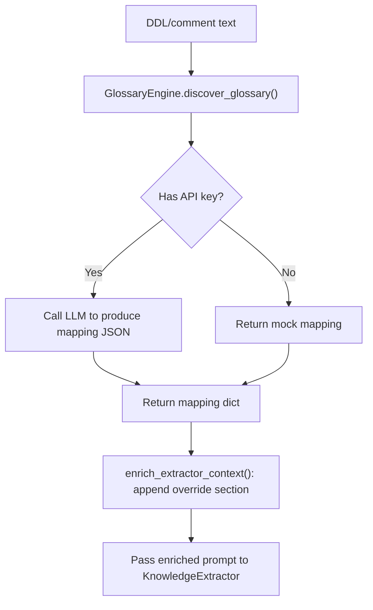
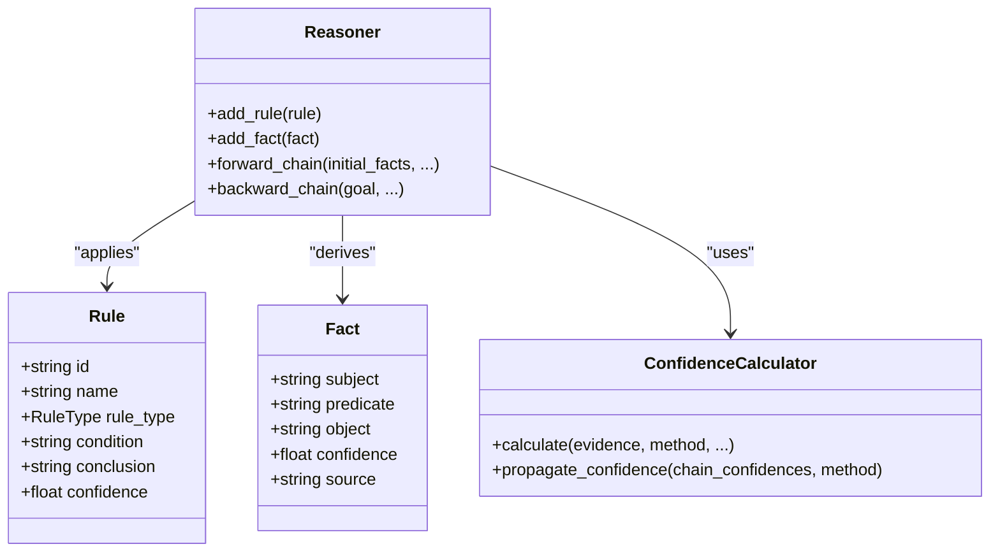
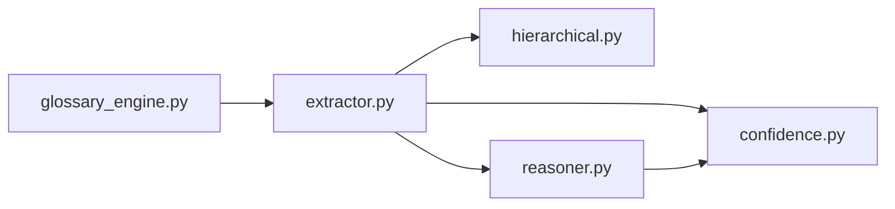

# Knowledge Extraction System

<cite>
**Referenced Files in This Document**
- [hierarchical.py](file://src/chunking/hierarchical.py)
- [extractor.py](file://src/perception/extractor.py)
- [glossary_engine.py](file://src/perception/glossary_engine.py)
- [reasoner.py](file://src/core/reasoner.py)
- [confidence.py](file://src/eval/confidence.py)
- [test_chunking.py](file://tests/test_chunking.py)
- [architecture.md](file://docs/architecture.md)
</cite>

## Table of Contents
1. [Introduction](#introduction)
2. [Project Structure](#project-structure)
3. [Core Components](#core-components)
4. [Architecture Overview](#architecture-overview)
5. [Detailed Component Analysis](#detailed-component-analysis)
6. [Dependency Analysis](#dependency-analysis)
7. [Performance Considerations](#performance-considerations)
8. [Troubleshooting Guide](#troubleshooting-guide)
9. [Conclusion](#conclusion)

## Introduction
This document describes the Knowledge Extraction System, focusing on:
- Hierarchical document chunking for long-form texts
- LLM-powered structured fact extraction with robust JSON repair
- Integration with a glossary engine for domain-specific terminology normalization
- Relationship with the reasoning engine and confidence calculation modules
- Practical configuration options, examples, and optimization strategies

The system follows a layered architecture where perception extracts structured facts from unstructured documents, and the reasoning engine applies rules and confidence propagation to derive reliable conclusions.

## Project Structure
The Knowledge Extraction System spans three primary layers:
- Perception (extraction and glossary): responsible for transforming free-text into standardized facts and normalizing domain terms
- Core (reasoning and confidence): responsible for rule-based inference and confidence aggregation
- Chunking: responsible for intelligent segmentation of long documents

**Diagram sources**
- [extractor.py:83-350](file://src/perception/extractor.py#L83-L350)
- [glossary_engine.py:9-71](file://src/perception/glossary_engine.py#L9-L71)
- [reasoner.py:145-800](file://src/core/reasoner.py#L145-L800)
- [confidence.py:32-407](file://src/eval/confidence.py#L32-L407)
- [hierarchical.py:29-256](file://src/chunking/hierarchical.py#L29-L256)

**Section sources**
- [architecture.md:24-26](file://docs/architecture.md#L24-L26)

## Core Components
- HierarchicalChunker: Parses document structure and segments text into semantically coherent chunks with overlap to preserve continuity.
- KnowledgeExtractor: Orchestrates chunking, LLM extraction per chunk, JSON repair, deduplication, and conversion to core Fact objects.
- GlossaryEngine: Discovers physical-to-business term mappings from DDL/comment sources and injects them into extraction prompts.
- Reasoner: Applies rules to facts and propagates confidence across inference steps.
- ConfidenceCalculator: Computes and aggregates confidence from multiple evidences and reasoning steps.

**Section sources**
- [hierarchical.py:29-256](file://src/chunking/hierarchical.py#L29-L256)
- [extractor.py:83-350](file://src/perception/extractor.py#L83-L350)
- [glossary_engine.py:9-71](file://src/perception/glossary_engine.py#L9-L71)
- [reasoner.py:145-800](file://src/core/reasoner.py#L145-L800)
- [confidence.py:32-407](file://src/eval/confidence.py#L32-L407)

## Architecture Overview
The extraction pipeline transforms long technical documents into a canonical set of facts, then feeds them into the reasoning engine with confidence-aware propagation.

**Diagram sources**
- [extractor.py:278-350](file://src/perception/extractor.py#L278-L350)
- [hierarchical.py:141-222](file://src/chunking/hierarchical.py#L141-L222)
- [glossary_engine.py:57-71](file://src/perception/glossary_engine.py#L57-L71)
- [reasoner.py:243-350](file://src/core/reasoner.py#L243-L350)
- [confidence.py:63-99](file://src/eval/confidence.py#L63-L99)

## Detailed Component Analysis

### Hierarchical Document Chunking
Purpose:
- Preserve semantic coherence across chunk boundaries
- Adapt to LLM context limits and maintain continuity via overlap

Key behaviors:
- Detects Markdown, HTML, and numbered headings to infer structure
- Estimates tokens for English and Chinese mixed content
- Segments content into chunks respecting effective limits
- Retains overlapping tails to avoid losing cross-boundary context

Configuration:
- max_tokens: upper bound for chunk size
- overlap_tokens: number of tokens to overlap between adjacent chunks
- llm_model: selects a context window cap; effective processing limit is ~80% of the cap

Example usage paths:
- [HierarchicalChunker initialization and limits:56-76](file://src/chunking/hierarchical.py#L56-L76)
- [Structure parsing (headings detection):86-139](file://src/chunking/hierarchical.py#L86-L139)
- [Chunk segmentation with overlap:141-222](file://src/chunking/hierarchical.py#L141-L222)
- [Paragraph fallback:224-256](file://src/chunking/hierarchical.py#L224-L256)

Validation and tests:
- [Token estimation correctness:53-69](file://tests/test_chunking.py#L53-L69)
- [Overlap behavior:97-116](file://tests/test_chunking.py#L97-L116)
- [Structure preservation:117-143](file://tests/test_chunking.py#L117-L143)

**Diagram sources**
- [hierarchical.py:141-222](file://src/chunking/hierarchical.py#L141-L222)

**Section sources**
- [hierarchical.py:29-256](file://src/chunking/hierarchical.py#L29-L256)
- [test_chunking.py:16-234](file://tests/test_chunking.py#L16-L234)

### LLM-Powered Structured Fact Extraction Pipeline
Purpose:
- Convert unstructured text into standardized RDF-like facts with confidence
- Robustly handle LLM output that may be truncated or malformed

Core stages:
- Decide whether to chunk (threshold-based)
- For each chunk: prompt engineering, LLM call, JSON repair, schema validation
- Deduplicate by (subject, predicate, object)
- Convert to core Fact objects for downstream reasoning

Prompting and schema:
- System prompt defines a core domain ontology and strict JSON output rules
- User prompt supplies the chunk text
- Pydantic FactSchema enforces canonical fields and confidence bounds

JSON repair strategies:
- Strip markdown fences
- Locate outermost braces and parse partial JSON
- Complete truncated arrays/objects when possible

Integration points:
- Uses HierarchicalChunker for segmentation
- Leverages ConfidenceCalculator for confidence propagation during reasoning
- Converts to Fact objects consumed by Reasoner

Example usage paths:
- [Extraction thresholds and chunk selection:296-314](file://src/perception/extractor.py#L296-L314)
- [Chunk extraction loop and deduplication:315-345](file://src/perception/extractor.py#L315-L345)
- [JSON repair logic:122-188](file://src/perception/extractor.py#L122-L188)
- [System/user prompts and schema:39-77](file://src/perception/extractor.py#L39-L77)

**Diagram sources**
- [extractor.py:190-350](file://src/perception/extractor.py#L190-L350)
- [hierarchical.py:141-222](file://src/chunking/hierarchical.py#L141-L222)

**Section sources**
- [extractor.py:83-350](file://src/perception/extractor.py#L83-L350)

### JSON Repair Capabilities
Repair strategies:
- Direct parse after trimming whitespace
- Remove markdown code fences
- Bracket scanning to locate balanced JSON object
- Truncated completion: close unclosed arrays/objects

Failure handling:
- Logs warning with raw length
- Returns None to skip invalid outputs

Example usage paths:
- [Repair logic:122-188](file://src/perception/extractor.py#L122-L188)

**Section sources**
- [extractor.py:122-188](file://src/perception/extractor.py#L122-L188)

### Glossary Engine Integration
Purpose:
- Normalize physical field names (e.g., P1_MIN) to business terms (e.g., “出口压力最大值”) consistently across extraction

Mechanics:
- Generates a mapping from DDL/comment text using LLM
- Enriches extraction prompt context with explicit overrides
- Keeps the process optional and falls back gracefully when API keys are unavailable

Example usage paths:
- [Discover glossary mapping:30-56](file://src/perception/glossary_engine.py#L30-L56)
- [Enrich prompt context:57-71](file://src/perception/glossary_engine.py#L57-L71)

**Diagram sources**
- [glossary_engine.py:30-71](file://src/perception/glossary_engine.py#L30-L71)
- [extractor.py:201-204](file://src/perception/extractor.py#L201-L204)

**Section sources**
- [glossary_engine.py:9-71](file://src/perception/glossary_engine.py#L9-L71)
- [extractor.py:57-71](file://src/perception/extractor.py#L57-L71)

### Relationship with Reasoning Engine and Confidence Calculation
- KnowledgeExtractor emits Fact objects with confidence scores
- Reasoner applies rules to derive new facts and propagates confidence
- ConfidenceCalculator aggregates multiple evidences and reasoning steps

Key interactions:
- Forward chain computes confidence by combining premise and rule reliabilities
- Backward chain traces support for goals and computes overall confidence
- Propagation supports multiple methods (min, arithmetic, geometric, multiplicative)

Example usage paths:
- [Forward chain with confidence propagation:243-350](file://src/core/reasoner.py#L243-L350)
- [Backward chain with confidence computation:351-438](file://src/core/reasoner.py#L351-L438)
- [Confidence calculation methods:63-99](file://src/eval/confidence.py#L63-L99)
- [Propagation across reasoning steps:222-260](file://src/eval/confidence.py#L222-L260)

**Diagram sources**
- [reasoner.py:111-180](file://src/core/reasoner.py#L111-L180)
- [confidence.py:32-99](file://src/eval/confidence.py#L32-L99)

**Section sources**
- [reasoner.py:145-438](file://src/core/reasoner.py#L145-L438)
- [confidence.py:32-260](file://src/eval/confidence.py#L32-L260)

## Dependency Analysis
- KnowledgeExtractor depends on:
  - HierarchicalChunker for segmentation
  - OpenAI client for LLM calls
  - ConfidenceCalculator for confidence propagation
  - Reasoner for downstream inference
- GlossaryEngine optionally integrates with KnowledgeExtractor via prompt enrichment
- Reasoner depends on ConfidenceCalculator for confidence aggregation

**Diagram sources**
- [extractor.py:83-121](file://src/perception/extractor.py#L83-L121)
- [hierarchical.py:29-76](file://src/chunking/hierarchical.py#L29-L76)
- [glossary_engine.py:9-29](file://src/perception/glossary_engine.py#L9-L29)
- [reasoner.py:162-174](file://src/core/reasoner.py#L162-L174)
- [confidence.py:32-62](file://src/eval/confidence.py#L32-L62)

**Section sources**
- [extractor.py:83-121](file://src/perception/extractor.py#L83-L121)
- [glossary_engine.py:9-29](file://src/perception/glossary_engine.py#L9-L29)
- [reasoner.py:162-174](file://src/core/reasoner.py#L162-L174)
- [confidence.py:32-62](file://src/eval/confidence.py#L32-L62)

## Performance Considerations
- Token estimation:
  - English: inverse of average tokens per word
  - Chinese: conservative character-based estimate
- Effective limit:
  - Derived from LLM context caps with a safety margin (~80%)
- Overlap:
  - Controls boundary continuity vs. duplication cost
- Chunk threshold:
  - Long texts are segmented; short texts avoid overhead
- Retry/backoff:
  - LLM rate-limit handling reduces failures under throttling

Optimization strategies by document type:
- Technical specs: favor hierarchical chunking; enable glossary normalization
- Procedural docs: increase overlap_tokens to preserve procedure flow
- Mixed-language: rely on token estimation; adjust max_tokens accordingly
- Short reports: bypass chunking to reduce overhead

**Section sources**
- [hierarchical.py:77-84](file://src/chunking/hierarchical.py#L77-L84)
- [hierarchical.py:73-76](file://src/chunking/hierarchical.py#L73-L76)
- [extractor.py:96-103](file://src/perception/extractor.py#L96-L103)
- [extractor.py:208-231](file://src/perception/extractor.py#L208-L231)

## Troubleshooting Guide
Common extraction issues and mitigations:
- Ambiguous entities:
  - Provide extra_prompt with explicit glossary mappings
  - Increase model temperature slightly for creativity, but keep extraction deterministic prompts
- Missing context across chunks:
  - Increase overlap_tokens to retain cross-boundary information
- Domain-specific terminology mismatches:
  - Use GlossaryEngine to discover mappings from DDL/comments
  - Inject overrides into extraction prompts
- Truncated or malformed JSON:
  - Rely on built-in _repair_json logic
  - Verify system prompt enforces strict JSON output

Operational tips:
- Monitor LLM 429 responses and leverage retry/backoff
- Validate chunk sizes against effective limits
- Deduplication prevents false positives; ensure consistent normalization

**Section sources**
- [extractor.py:122-188](file://src/perception/extractor.py#L122-L188)
- [extractor.py:208-231](file://src/perception/extractor.py#L208-L231)
- [glossary_engine.py:57-71](file://src/perception/glossary_engine.py#L57-L71)
- [hierarchical.py:190-208](file://src/chunking/hierarchical.py#L190-L208)

## Conclusion
The Knowledge Extraction System combines intelligent chunking, robust JSON repair, and domain-aware normalization to reliably transform technical documents into structured facts. Integrated with the reasoning engine and confidence calculator, it enables trustworthy inference and actionable insights. By tuning chunk sizes, prompts, and glossary mappings, teams can optimize extraction quality across diverse document types and complexity levels.