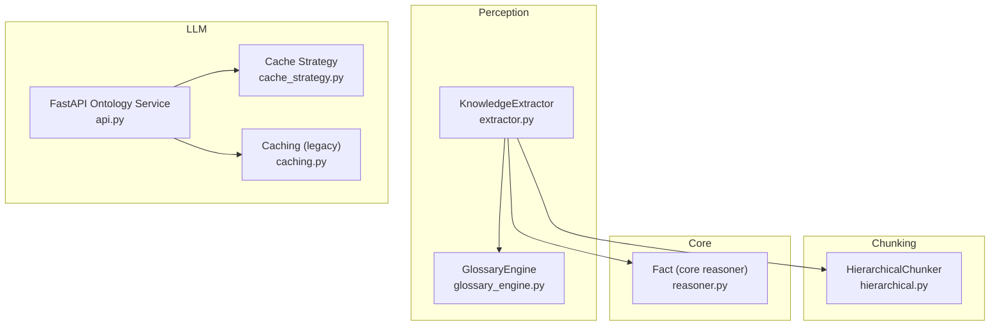
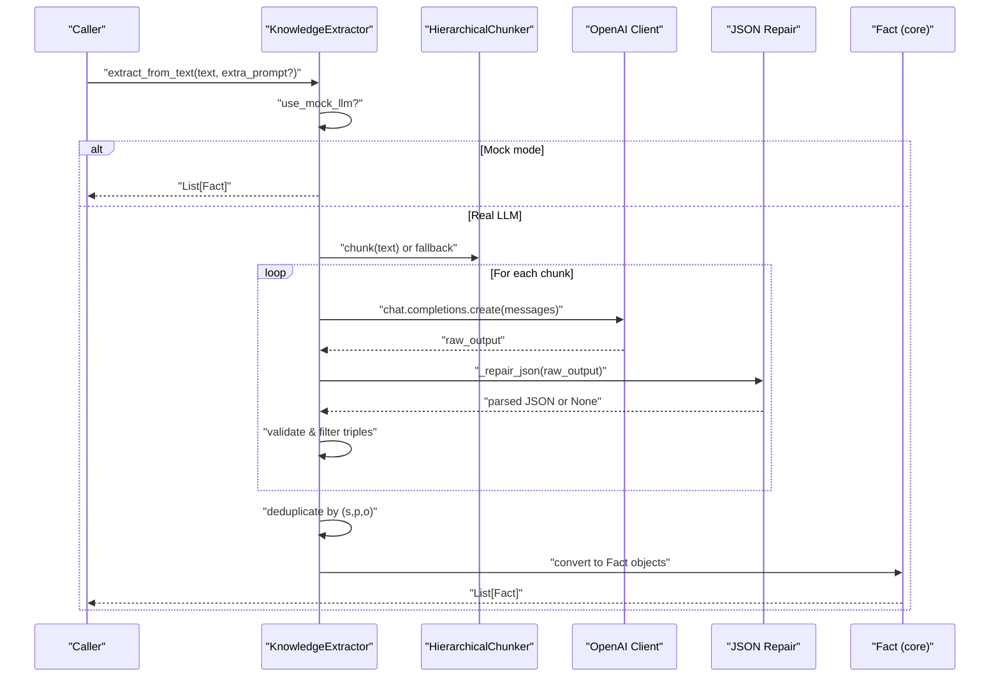
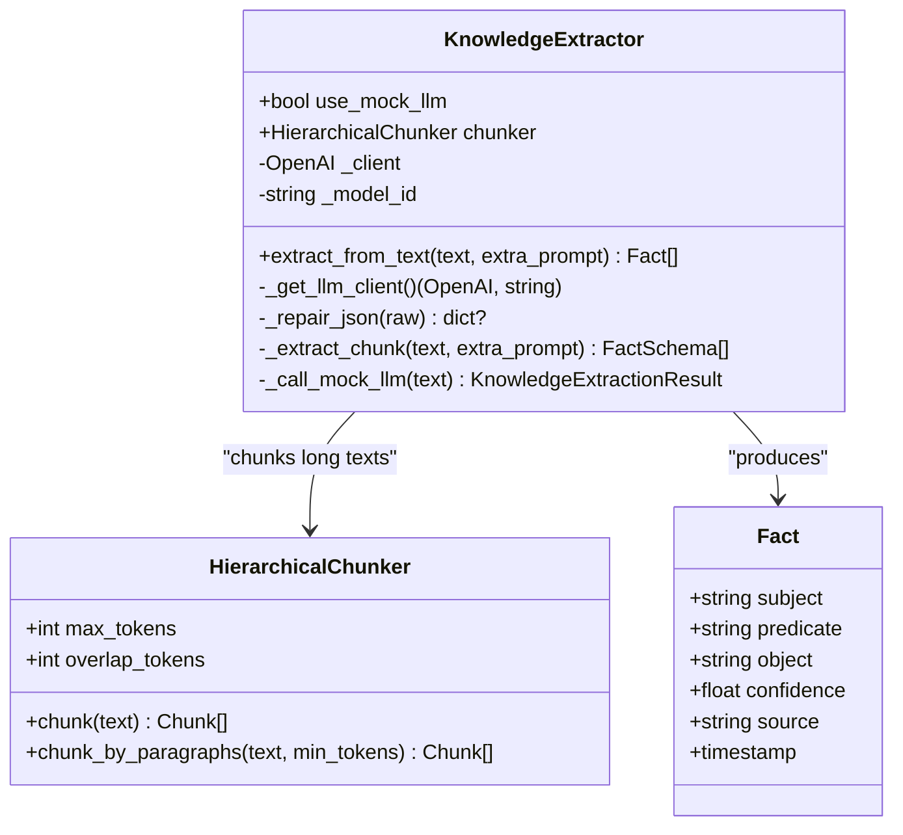
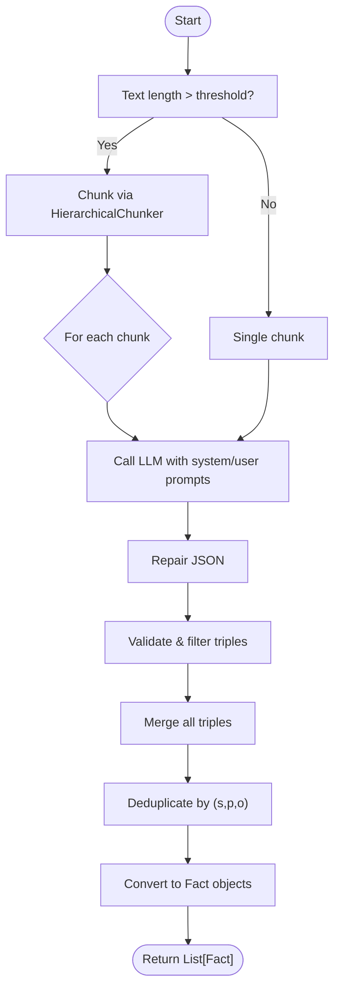
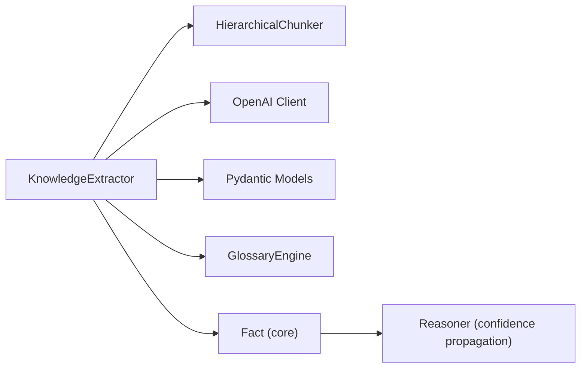

# LLM Integration and Fact Extraction

<cite>
**Referenced Files in This Document**
- [extractor.py](file://src/perception/extractor.py)
- [hierarchical.py](file://src/chunking/hierarchical.py)
- [reasoner.py](file://src/core/reasoner.py)
- [glossary_engine.py](file://src/perception/glossary_engine.py)
- [api.py](file://src/llm/api.py)
- [cache_strategy.py](file://src/llm/cache_strategy.py)
- [caching.py](file://src/llm/caching.py)
- [test_confidence.py](file://tests/test_confidence.py)
- [demo_confidence_reasoning.py](file://examples/demo_confidence_reasoning.py)
</cite>

## Table of Contents
1. [Introduction](#introduction)
2. [Project Structure](#project-structure)
3. [Core Components](#core-components)
4. [Architecture Overview](#architecture-overview)
5. [Detailed Component Analysis](#detailed-component-analysis)
6. [Dependency Analysis](#dependency-analysis)
7. [Performance Considerations](#performance-considerations)
8. [Troubleshooting Guide](#troubleshooting-guide)
9. [Conclusion](#conclusion)
10. [Appendices](#appendices)

## Introduction
This document explains the LLM integration and fact extraction pipeline implemented in the repository. It focuses on the KnowledgeExtractor class, the domain ontology schema definition embedded in prompts, structured output formatting via Pydantic models, LLM client initialization and retry handling, JSON repair for malformed outputs, confidence scoring, and the transformation from extracted facts to core Fact objects. It also covers mock LLM mode for testing, environment variable configuration, and practical troubleshooting tips.

## Project Structure
The extraction pipeline spans several modules:
- Perception: Fact extraction and glossary enrichment
- Chunking: Hierarchical document chunking for long texts
- Core: Fact representation and reasoning engine
- LLM: API server and caching strategies

**Diagram sources**
- [extractor.py:83-350](file://src/perception/extractor.py#L83-L350)
- [hierarchical.py:29-256](file://src/chunking/hierarchical.py#L29-L256)
- [reasoner.py:111-124](file://src/core/reasoner.py#L111-L124)
- [glossary_engine.py:9-71](file://src/perception/glossary_engine.py#L9-L71)
- [api.py:1-316](file://src/llm/api.py#L1-L316)
- [cache_strategy.py:1-751](file://src/llm/cache_strategy.py#L1-L751)
- [caching.py:1-502](file://src/llm/caching.py#L1-L502)

**Section sources**
- [extractor.py:1-350](file://src/perception/extractor.py#L1-L350)
- [hierarchical.py:1-256](file://src/chunking/hierarchical.py#L1-L256)
- [reasoner.py:1-819](file://src/core/reasoner.py#L1-L819)
- [glossary_engine.py:1-71](file://src/perception/glossary_engine.py#L1-L71)
- [api.py:1-316](file://src/llm/api.py#L1-L316)
- [cache_strategy.py:1-751](file://src/llm/cache_strategy.py#L1-L751)
- [caching.py:1-502](file://src/llm/caching.py#L1-L502)

## Core Components
- KnowledgeExtractor: Orchestrates extraction from long documents, handles chunking, LLM calls, JSON repair, deduplication, and conversion to core Fact objects.
- FactSchema and KnowledgeExtractionResult: Pydantic models enforcing structured JSON output and typed lists of facts.
- CORE_DOMAIN_ONTOLOGY, EXTRACTION_SYSTEM_PROMPT, EXTRACTION_USER_PROMPT: Domain-aligned schema and instruction templates guiding LLM extraction.
- HierarchicalChunker: Intelligent chunking preserving semantic boundaries and token limits.
- GlossaryEngine: Optional enrichment of extraction prompts with physical-to-business term mappings.
- LLM client initialization and retry logic: Environment-driven client setup and 429 handling.
- JSON repair: Robust parsing for truncated or fenced outputs.
- Confidence scoring: Confidence values carried through the pipeline and used downstream by the reasoning engine.

**Section sources**
- [extractor.py:18-350](file://src/perception/extractor.py#L18-L350)
- [hierarchical.py:29-256](file://src/chunking/hierarchical.py#L29-L256)
- [glossary_engine.py:9-71](file://src/perception/glossary_engine.py#L9-L71)
- [reasoner.py:111-124](file://src/core/reasoner.py#L111-L124)

## Architecture Overview
End-to-end extraction flow from raw text to structured facts:

**Diagram sources**
- [extractor.py:101-350](file://src/perception/extractor.py#L101-L350)
- [hierarchical.py:141-222](file://src/chunking/hierarchical.py#L141-L222)

## Detailed Component Analysis

### KnowledgeExtractor Class
Responsibilities:
- Initialize and lazily create an OpenAI client using environment variables.
- Split long texts into manageable chunks using HierarchicalChunker.
- Call LLM with a strict JSON schema prompt and bounded output.
- Repair truncated or fenced JSON outputs.
- Deduplicate extracted triples and convert to core Fact objects.

Key behaviors:
- Environment variables: OPENAI_API_KEY, OPENAI_BASE_URL, OPENAI_MODEL.
- Retry on rate limit (HTTP 429) with exponential backoff.
- JSON repair strategies: strip fences, locate outer braces, fix truncated arrays/objects.
- Deduplication by subject/predicate/object tuple.
- Conversion to Fact with confidence and source.

**Diagram sources**
- [extractor.py:83-350](file://src/perception/extractor.py#L83-L350)
- [hierarchical.py:29-256](file://src/chunking/hierarchical.py#L29-L256)
- [reasoner.py:111-124](file://src/core/reasoner.py#L111-L124)

**Section sources**
- [extractor.py:83-350](file://src/perception/extractor.py#L83-L350)

### Pydantic FactSchema and KnowledgeExtractionResult
- FactSchema: Enforces a strict RDF triple with confidence and source fields.
- KnowledgeExtractionResult: Wraps a list of FactSchema.

Usage:
- LLM returns a JSON object containing a "facts" array.
- The extractor validates and converts each item to FactSchema, filtering empty triples.

**Section sources**
- [extractor.py:18-36](file://src/perception/extractor.py#L18-L36)

### Domain Ontology Schema Definition and Prompts
- CORE_DOMAIN_ONTOLOGY: Defines core classes and predicates aligned with gas engineering (e.g., equipment, parameters, standards).
- EXTRACTION_SYSTEM_PROMPT: Guides the LLM to align extractions to the defined schema, enforce JSON output, and limit density.
- EXTRACTION_USER_PROMPT: Provides the text segment to extract from.

Guidelines encoded in prompts:
- Align entity names and predicates to the provided vocabulary.
- Prefer explicit numeric ranges and standards.
- Capture red-line requirements as quality_requirement triples.
- Output a single legal JSON with a "facts" array.

**Section sources**
- [extractor.py:39-76](file://src/perception/extractor.py#L39-L76)

### LLM Client Initialization and Retry Mechanisms
- Lazy initialization: Creates OpenAI client on first use.
- Environment variables:
  - OPENAI_API_KEY: Falls back to a mock key if unset or set to "mock".
  - OPENAI_BASE_URL: Defaults to a Volces endpoint if unset.
  - OPENAI_MODEL: Defaults to a specific model ID if unset.
- Retry on HTTP 429 with exponential backoff across up to three attempts.

**Section sources**
- [extractor.py:109-120](file://src/perception/extractor.py#L109-L120)
- [extractor.py:212-230](file://src/perception/extractor.py#L212-L230)

### JSON Repair Capabilities
Repair strategies:
- Strip markdown code fences.
- Locate outermost balanced braces and parse that region.
- If still failing, truncate at the last complete closing brace and append missing brackets to balance arrays/objects.
- Log warnings on failure.

**Section sources**
- [extractor.py:122-188](file://src/perception/extractor.py#L122-L188)

### Confidence Scoring and Transformation to Core Fact Objects
- Confidence is preserved from FactSchema to Fact during conversion.
- Fact carries a source field indicating extraction origin.
- Downstream reasoning engine uses confidence values for propagation and aggregation.

**Section sources**
- [extractor.py:239-260](file://src/perception/extractor.py#L239-L260)
- [reasoner.py:111-124](file://src/core/reasoner.py#L111-L124)

### Mock LLM Mode for Testing
- When use_mock_llm is enabled, the extractor bypasses the LLM and returns predefined mock facts based on simple heuristics.
- Useful for unit tests and offline development.

**Section sources**
- [extractor.py:101-108](file://src/perception/extractor.py#L101-L108)
- [extractor.py:262-276](file://src/perception/extractor.py#L262-L276)

### Environment Variable Configuration
- OPENAI_API_KEY: Required for real LLM calls; defaults to a mock key when unset or "mock".
- OPENAI_BASE_URL: Optional; defaults to a Volces endpoint.
- OPENAI_MODEL: Optional; defaults to a specific model ID.
- OPENAI_API_TYPE: Not used in the extractor; client is initialized with api_key and base_url.

**Section sources**
- [extractor.py:113-118](file://src/perception/extractor.py#L113-L118)

### Glossary Engine Integration
- GlossaryEngine discovers physical-to-business term mappings using LLM and injects them into the extraction prompt context.
- This helps align low-level identifiers (e.g., P1_MIN) to business terms (e.g., "进口压力最小值").

**Section sources**
- [glossary_engine.py:30-71](file://src/perception/glossary_engine.py#L30-L71)

### Example Extraction Workflows
- Long document extraction: The extractor detects length thresholds, chunks the text, calls the LLM per chunk, repairs JSON, merges, deduplicates, and produces Fact objects.
- Short document extraction: Direct single-call extraction with optional extra_prompt enrichment.

**Diagram sources**
- [extractor.py:278-350](file://src/perception/extractor.py#L278-L350)
- [hierarchical.py:141-222](file://src/chunking/hierarchical.py#L141-L222)

## Dependency Analysis
- KnowledgeExtractor depends on:
  - HierarchicalChunker for chunking.
  - OpenAI client for LLM calls.
  - Pydantic models for output validation.
  - GlossaryEngine for prompt enrichment.
- Fact objects are consumed by the reasoning engine for inference and confidence propagation.

**Diagram sources**
- [extractor.py:83-350](file://src/perception/extractor.py#L83-L350)
- [hierarchical.py:29-256](file://src/chunking/hierarchical.py#L29-L256)
- [glossary_engine.py:9-71](file://src/perception/glossary_engine.py#L9-L71)
- [reasoner.py:111-124](file://src/core/reasoner.py#L111-L124)

**Section sources**
- [extractor.py:83-350](file://src/perception/extractor.py#L83-L350)
- [hierarchical.py:29-256](file://src/chunking/hierarchical.py#L29-L256)
- [glossary_engine.py:9-71](file://src/perception/glossary_engine.py#L9-L71)
- [reasoner.py:111-124](file://src/core/reasoner.py#L111-L124)

## Performance Considerations
- Chunk size tuning: HierarchicalChunker estimates tokens and maintains overlap to preserve context. Adjust max_tokens and overlap_tokens for your LLM.
- Rate limiting: Built-in retries with exponential backoff mitigate 429 errors; monitor logs for frequent rate-limit events.
- JSON repair cost: Repairing truncated outputs adds CPU overhead; keep prompts concise and leverage the built-in output constraints.
- Deduplication: O(n) deduplication by triple tuples; ensure consistent normalization of subject/predicate/object strings.
- Mock mode: Use for testing to avoid external LLM calls and reduce latency.

[No sources needed since this section provides general guidance]

## Troubleshooting Guide
Common issues and resolutions:
- Empty or partial JSON output:
  - Cause: LLM truncation or markdown fences.
  - Resolution: The extractor’s JSON repair attempts to salvage outputs; verify prompt constraints and reduce input length.
- Rate limit errors (HTTP 429):
  - Cause: API throttling.
  - Resolution: Retries are automatic with exponential backoff; consider lowering request rate or increasing backoff.
- Extraction yields unrelated triples:
  - Cause: Prompt alignment issues.
  - Resolution: Tighten CORE_DOMAIN_ONTOLOGY and EXTRACTION_SYSTEM_PROMPT; use GlossaryEngine to align physical terms.
- Confidence values not propagated downstream:
  - Cause: Missing confidence handling in downstream steps.
  - Resolution: Ensure Fact objects carry confidence and that the reasoning engine uses it for propagation.

**Section sources**
- [extractor.py:122-188](file://src/perception/extractor.py#L122-L188)
- [extractor.py:212-230](file://src/perception/extractor.py#L212-L230)
- [glossary_engine.py:57-71](file://src/perception/glossary_engine.py#L57-L71)

## Conclusion
The KnowledgeExtractor integrates robust chunking, strict schema prompting, resilient JSON repair, and deduplication to reliably transform unstructured text into structured, confidence-aware facts. The system supports both real LLM calls and mock mode, is configurable via environment variables, and lays the groundwork for downstream reasoning with confidence propagation.

[No sources needed since this section summarizes without analyzing specific files]

## Appendices

### Appendix A: Environment Variables
- OPENAI_API_KEY: API key for the LLM provider; falls back to a mock key when unset or "mock".
- OPENAI_BASE_URL: Base URL for the LLM provider; defaults to a Volces endpoint.
- OPENAI_MODEL: Model identifier; defaults to a specific model ID.

**Section sources**
- [extractor.py:113-118](file://src/perception/extractor.py#L113-L118)

### Appendix B: Confidence Calculator Reference
- ConfidenceCalculator computes aggregated confidence from multiple evidences.
- Methods include weighted and multiplicative aggregation.
- Evidence carries source reliability and content.

**Section sources**
- [reasoner.py:55-74](file://src/core/reasoner.py#L55-L74)
- [test_confidence.py:27-48](file://tests/test_confidence.py#L27-L48)
- [demo_confidence_reasoning.py:19-48](file://examples/demo_confidence_reasoning.py#L19-L48)