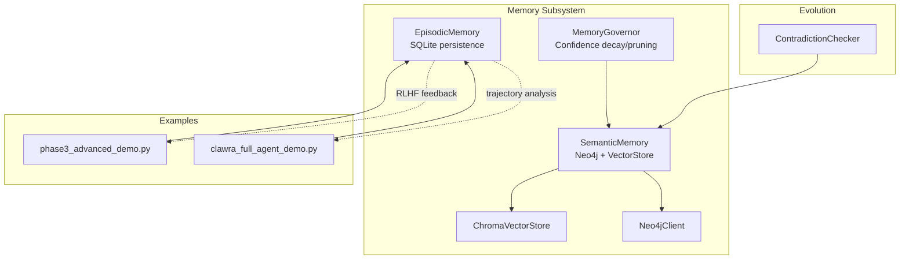
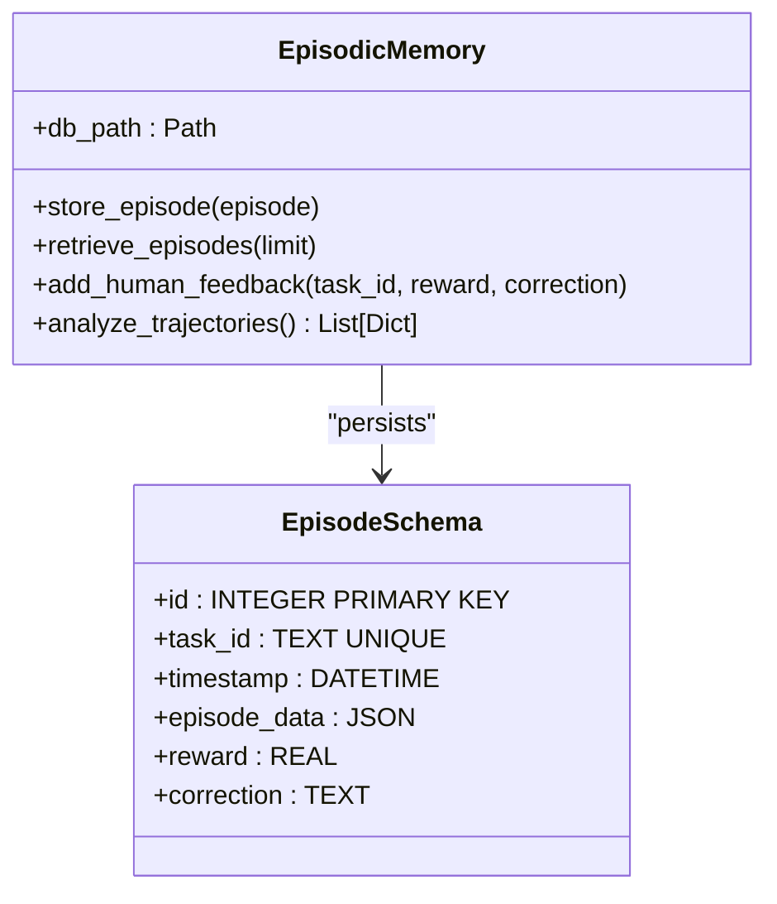
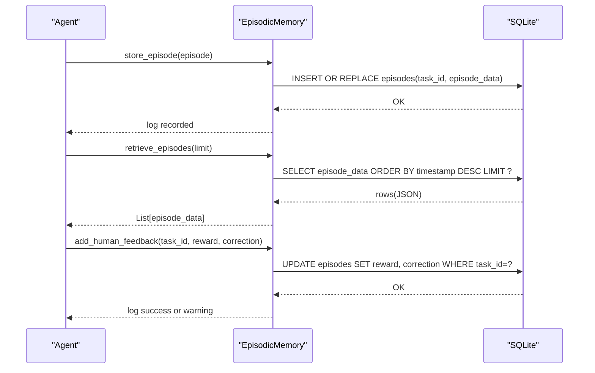
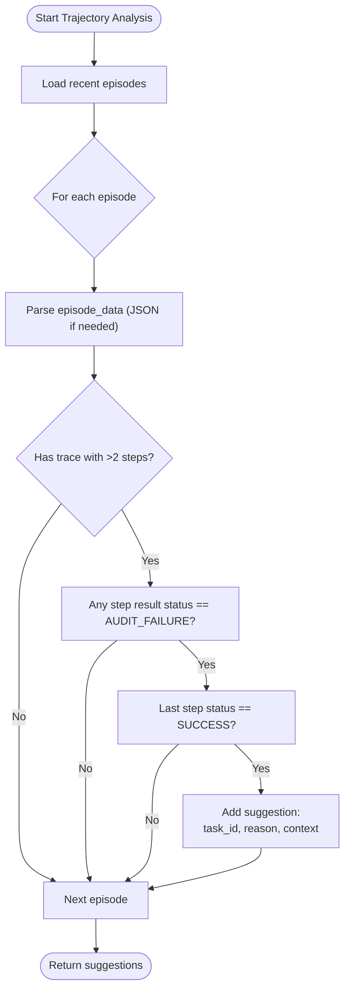
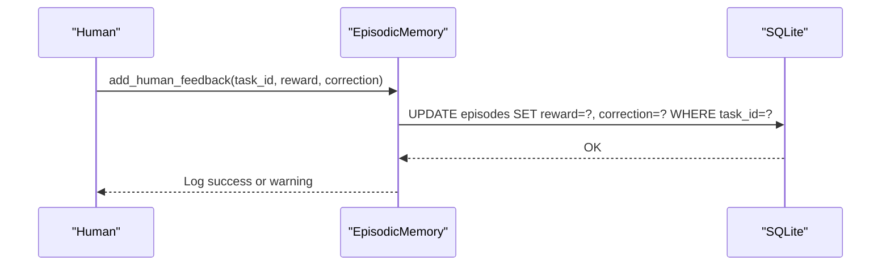
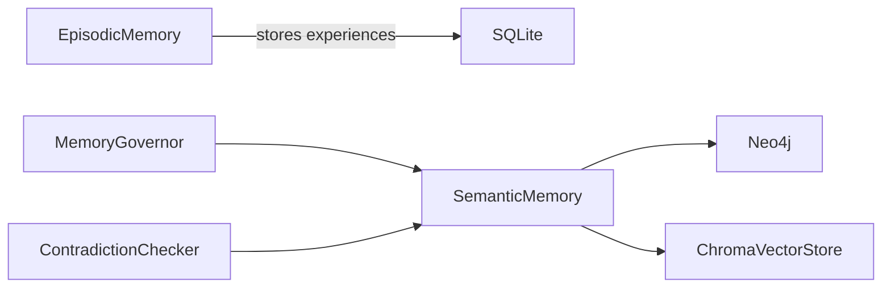
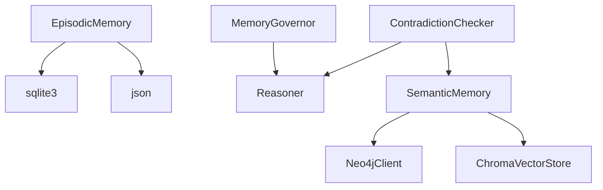

# Episodic Memory

<cite>
**Referenced Files in This Document**
- [base.py](file://src/memory/base.py)
- [__init__.py](file://src/memory/__init__.py)
- [governance.py](file://src/memory/governance.py)
- [vector_adapter.py](file://src/memory/vector_adapter.py)
- [neo4j_adapter.py](file://src/memory/neo4j_adapter.py)
- [phase3_advanced_demo.py](file://examples/phase3_advanced_demo.py)
- [clawra_full_agent_demo.py](file://examples/clawra_full_agent_demo.py)
- [self_correction.py](file://src/evolution/self_correction.py)
</cite>

## Table of Contents
1. [Introduction](#introduction)
2. [Project Structure](#project-structure)
3. [Core Components](#core-components)
4. [Architecture Overview](#architecture-overview)
5. [Detailed Component Analysis](#detailed-component-analysis)
6. [Dependency Analysis](#dependency-analysis)
7. [Performance Considerations](#performance-considerations)
8. [Troubleshooting Guide](#troubleshooting-guide)
9. [Conclusion](#conclusion)
10. [Appendices](#appendices)

## Introduction
This document describes the episodic memory system designed to capture agent experiences, decision traces, and reasoning processes. It focuses on the SQLite-based persistence layer for storing episodes, the episode data model, trajectory analysis for recognizing success patterns and failure recovery, and the integration of reinforcement learning from human feedback (RLHF). Practical examples illustrate episode storage, retrieval, human feedback incorporation, and trajectory pattern recognition. The document also covers database schema design, data lifecycle management, and future reinforcement learning applications.

## Project Structure
The episodic memory resides in the memory subsystem and integrates with the broader knowledge platform. The key files include:
- Episodic memory implementation and schema
- Public exports for memory modules
- Supporting adapters for semantic memory (vector and graph)
- Example usages demonstrating episode recording and retrieval
- Evolution components that complement episodic memory with contradiction checks and governance

**Diagram sources**
- [base.py:150-247](file://src/memory/base.py#L150-L247)
- [__init__.py:1-3](file://src/memory/__init__.py#L1-L3)
- [vector_adapter.py:31-97](file://src/memory/vector_adapter.py#L31-L97)
- [neo4j_adapter.py:130-218](file://src/memory/neo4j_adapter.py#L130-L218)
- [governance.py:6-62](file://src/memory/governance.py#L6-L62)
- [phase3_advanced_demo.py:54-70](file://examples/phase3_advanced_demo.py#L54-L70)
- [clawra_full_agent_demo.py:582-619](file://examples/clawra_full_agent_demo.py#L582-L619)
- [self_correction.py:7-90](file://src/evolution/self_correction.py#L7-L90)

**Section sources**
- [base.py:150-247](file://src/memory/base.py#L150-L247)
- [__init__.py:1-3](file://src/memory/__init__.py#L1-L3)

## Core Components
- EpisodicMemory: SQLite-backed persistence for episodes, including schema, storage, retrieval, human feedback integration, and trajectory analysis.
- SemanticMemory: Hybrid memory combining Neo4j graph storage and Chroma vector store for semantic recall and graph traversal.
- MemoryGovernor: Confidence-based governance for facts, including reinforcement and pruning to maintain knowledge health.
- ChromaVectorStore: Local vector store adapter for embedding similarity search.
- Neo4jClient: Graph database client for entity and relationship CRUD, graph traversal, inference tracing, and confidence propagation.
- Examples: Demonstrations of episode recording and retrieval in realistic agent workflows.

Key responsibilities:
- Persist agent experiences with structured episode_data and metadata (task_id, timestamps).
- Enable RLHF scoring and corrective feedback to episodes.
- Detect success/failure patterns in trajectories to propose knowledge updates.
- Support retrieval of recent episodes for analysis and downstream use.

**Section sources**
- [base.py:150-247](file://src/memory/base.py#L150-L247)
- [vector_adapter.py:31-97](file://src/memory/vector_adapter.py#L31-L97)
- [neo4j_adapter.py:130-218](file://src/memory/neo4j_adapter.py#L130-L218)
- [governance.py:6-62](file://src/memory/governance.py#L6-L62)
- [phase3_advanced_demo.py:54-70](file://examples/phase3_advanced_demo.py#L54-L70)
- [clawra_full_agent_demo.py:582-619](file://examples/clawra_full_agent_demo.py#L582-L619)

## Architecture Overview
The episodic memory system is a local SQLite store that captures agent episodes. Episodes include a unique task identifier, a timestamp, the episode payload (episode_data), a reward score, and optional human corrections. The system supports:
- Storing episodes with INSERT OR REPLACE semantics keyed by task_id.
- Retrieving recent episodes ordered by timestamp.
- Recording human feedback (reward and correction) for prior episodes.
- Analyzing trajectories to identify patterns like “failure followed by success” and suggesting knowledge updates.

**Diagram sources**
- [base.py:162-176](file://src/memory/base.py#L162-L176)
- [base.py:178-189](file://src/memory/base.py#L178-L189)
- [base.py:191-197](file://src/memory/base.py#L191-L197)
- [base.py:199-215](file://src/memory/base.py#L199-L215)
- [base.py:217-247](file://src/memory/base.py#L217-L247)

## Detailed Component Analysis

### EpisodicMemory: SQLite Persistence and Trajectory Analysis
- Schema design:
  - Unique task_id ensures deduplication and allows feedback updates by task.
  - JSON episode_data accommodates arbitrary episode payloads (e.g., trace, metrics).
  - Timestamp enables chronological ordering for recent retrieval.
  - reward and correction support RLHF integration.
- Storage:
  - Uses INSERT OR REPLACE to persist episodes keyed by task_id.
  - episode_data is serialized to JSON for storage.
- Retrieval:
  - Retrieves latest episodes by descending timestamp.
- Human feedback (RLHF):
  - Updates reward and correction for a given task_id.
  - Logs success or warning if the task is not found.
- Trajectory analysis:
  - Scans recent episodes to detect sequences ending with success after an audit failure.
  - Produces suggestions for knowledge updates based on successful corrective actions.

**Diagram sources**
- [base.py:178-189](file://src/memory/base.py#L178-L189)
- [base.py:191-197](file://src/memory/base.py#L191-L197)
- [base.py:199-215](file://src/memory/base.py#L199-L215)

Practical examples:
- Episode storage and retrieval in a basic integration demo:
  - See episode creation and persistence in [phase3_advanced_demo.py:54-65](file://examples/phase3_advanced_demo.py#L54-L65).
- Trajectory trace rendering in a full agent demo:
  - The agent’s execution results include a trace field that can be stored as part of episode_data; see [clawra_full_agent_demo.py:582-619](file://examples/clawra_full_agent_demo.py#L582-L619).

**Section sources**
- [base.py:162-176](file://src/memory/base.py#L162-L176)
- [base.py:178-189](file://src/memory/base.py#L178-L189)
- [base.py:191-197](file://src/memory/base.py#L191-L197)
- [base.py:199-215](file://src/memory/base.py#L199-L215)
- [base.py:217-247](file://src/memory/base.py#L217-L247)
- [phase3_advanced_demo.py:54-70](file://examples/phase3_advanced_demo.py#L54-L70)
- [clawra_full_agent_demo.py:582-619](file://examples/clawra_full_agent_demo.py#L582-L619)

### Trajectory Analysis Flow
The trajectory analyzer scans recent episodes and identifies patterns indicating recovery from failures to success. It extracts suggestions for knowledge updates derived from successful corrective actions.

**Diagram sources**
- [base.py:217-247](file://src/memory/base.py#L217-L247)

**Section sources**
- [base.py:217-247](file://src/memory/base.py#L217-L247)

### Reinforcement Learning from Human Feedback (RLHF)
Human feedback is integrated by updating the reward and correction fields for a given task_id. This enables:
- Uploading high-reward episodes for potential model fine-tuning.
- Capturing corrective guidance to refine policies or update knowledge.

**Diagram sources**
- [base.py:199-215](file://src/memory/base.py#L199-L215)

**Section sources**
- [base.py:199-215](file://src/memory/base.py#L199-L215)

### Integration with Semantic Memory and Governance
While EpisodicMemory persists experiences locally, SemanticMemory maintains verified knowledge in Neo4j and Chroma. MemoryGovernor applies confidence-based reinforcement and pruning to keep knowledge healthy. ContradictionChecker prevents poisoned facts from entering the knowledge base.

**Diagram sources**
- [base.py:150-247](file://src/memory/base.py#L150-L247)
- [vector_adapter.py:31-97](file://src/memory/vector_adapter.py#L31-L97)
- [neo4j_adapter.py:130-218](file://src/memory/neo4j_adapter.py#L130-L218)
- [governance.py:6-62](file://src/memory/governance.py#L6-L62)
- [self_correction.py:7-90](file://src/evolution/self_correction.py#L7-L90)

**Section sources**
- [vector_adapter.py:31-97](file://src/memory/vector_adapter.py#L31-L97)
- [neo4j_adapter.py:130-218](file://src/memory/neo4j_adapter.py#L130-L218)
- [governance.py:6-62](file://src/memory/governance.py#L6-L62)
- [self_correction.py:7-90](file://src/evolution/self_correction.py#L7-L90)

## Dependency Analysis
- EpisodicMemory depends on:
  - sqlite3 for local persistence.
  - JSON serialization for episode_data.
- SemanticMemory depends on:
  - Neo4jClient for graph operations.
  - ChromaVectorStore for vector similarity search.
- MemoryGovernor depends on Reasoner facts and applies reinforcement and pruning.
- ContradictionChecker depends on SemanticMemory connectivity and Reasoner to prevent conflicts.

**Diagram sources**
- [base.py:146-148](file://src/memory/base.py#L146-L148)
- [base.py:150-247](file://src/memory/base.py#L150-L247)
- [vector_adapter.py:31-97](file://src/memory/vector_adapter.py#L31-L97)
- [neo4j_adapter.py:130-218](file://src/memory/neo4j_adapter.py#L130-L218)
- [governance.py:6-62](file://src/memory/governance.py#L6-L62)
- [self_correction.py:7-90](file://src/evolution/self_correction.py#L7-L90)

**Section sources**
- [base.py:146-148](file://src/memory/base.py#L146-L148)
- [base.py:150-247](file://src/memory/base.py#L150-L247)
- [vector_adapter.py:31-97](file://src/memory/vector_adapter.py#L31-L97)
- [neo4j_adapter.py:130-218](file://src/memory/neo4j_adapter.py#L130-L218)
- [governance.py:6-62](file://src/memory/governance.py#L6-L62)
- [self_correction.py:7-90](file://src/evolution/self_correction.py#L7-L90)

## Performance Considerations
- SQLite scalability:
  - Suitable for local, moderate-volume episode storage.
  - Consider partitioning or offloading historical episodes for large-scale deployments.
- JSON serialization overhead:
  - Keep episode_data compact; avoid excessive nesting.
- Trajectory analysis:
  - Limit the number of retrieved episodes to balance accuracy and latency.
- Vector and graph integrations:
  - Use SemanticMemory for hybrid retrieval and graph traversal to reduce repeated computations.

[No sources needed since this section provides general guidance]

## Troubleshooting Guide
Common issues and resolutions:
- Task not found during feedback:
  - The system logs a warning when attempting to update reward/correction for a missing task_id. Verify the task_id exists in episodes.
- Episode retrieval returns empty:
  - Ensure episodes were stored with a valid task_id and that the database path is writable.
- Trajectory analysis yields no suggestions:
  - Confirm episodes include a trace with sufficient steps and include an AUDIT_FAILURE followed by SUCCESS.
- RLHF not reflected:
  - Check that add_human_feedback is invoked with the correct task_id and that the database commit succeeds.

**Section sources**
- [base.py:199-215](file://src/memory/base.py#L199-L215)
- [base.py:217-247](file://src/memory/base.py#L217-L247)

## Conclusion
The episodic memory system provides a robust, SQLite-backed mechanism for capturing agent experiences, integrating human feedback, and enabling trajectory analysis. Combined with SemanticMemory, MemoryGovernor, and ContradictionChecker, it forms a cohesive knowledge platform supporting growth, safety, and reinforcement learning applications. Future enhancements may include scaling SQLite, exporting episodes for model fine-tuning, and expanding trajectory analysis heuristics.

[No sources needed since this section summarizes without analyzing specific files]

## Appendices

### Episode Data Model
- Fields:
  - task_id: Unique identifier for the task/episode.
  - timestamp: Automatic insertion time.
  - episode_data: JSON payload containing the episode (e.g., trace, metrics).
  - reward: Numeric score from human feedback.
  - correction: Textual correction or rationale.

**Section sources**
- [base.py:162-176](file://src/memory/base.py#L162-L176)

### Practical Examples Index
- Episode storage and retrieval:
  - [phase3_advanced_demo.py:54-70](file://examples/phase3_advanced_demo.py#L54-L70)
- Trajectory trace inclusion:
  - [clawra_full_agent_demo.py:582-619](file://examples/clawra_full_agent_demo.py#L582-L619)

**Section sources**
- [phase3_advanced_demo.py:54-70](file://examples/phase3_advanced_demo.py#L54-L70)
- [clawra_full_agent_demo.py:582-619](file://examples/clawra_full_agent_demo.py#L582-L619)