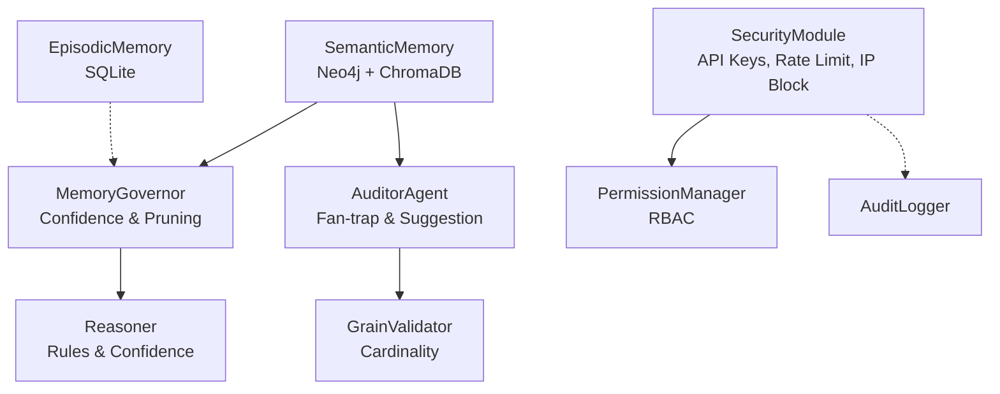
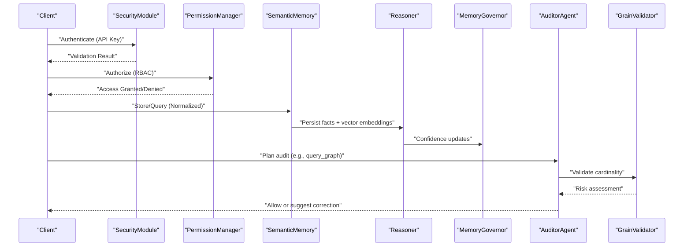
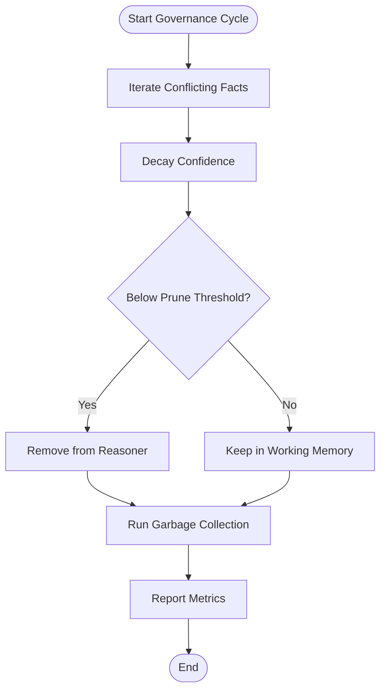
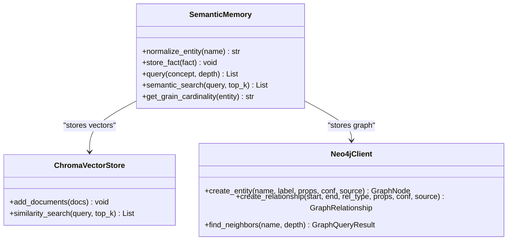
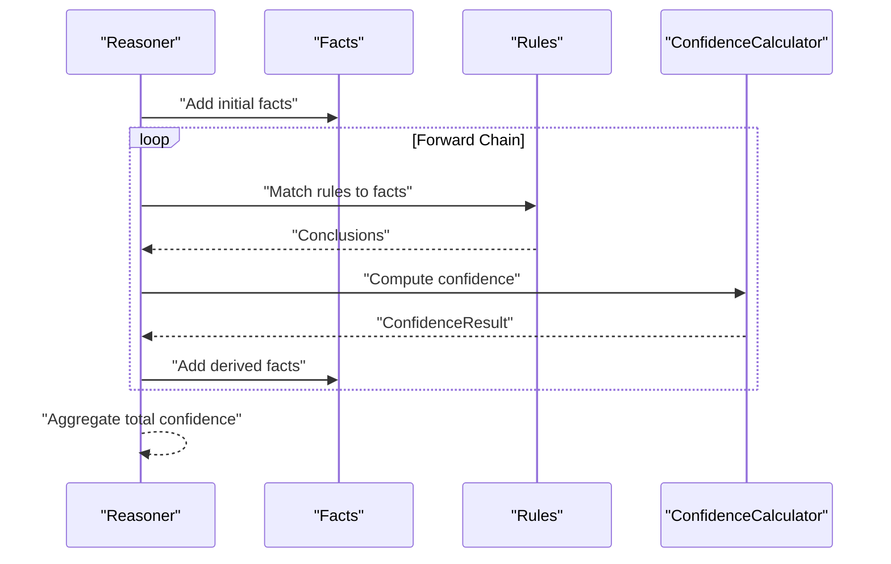
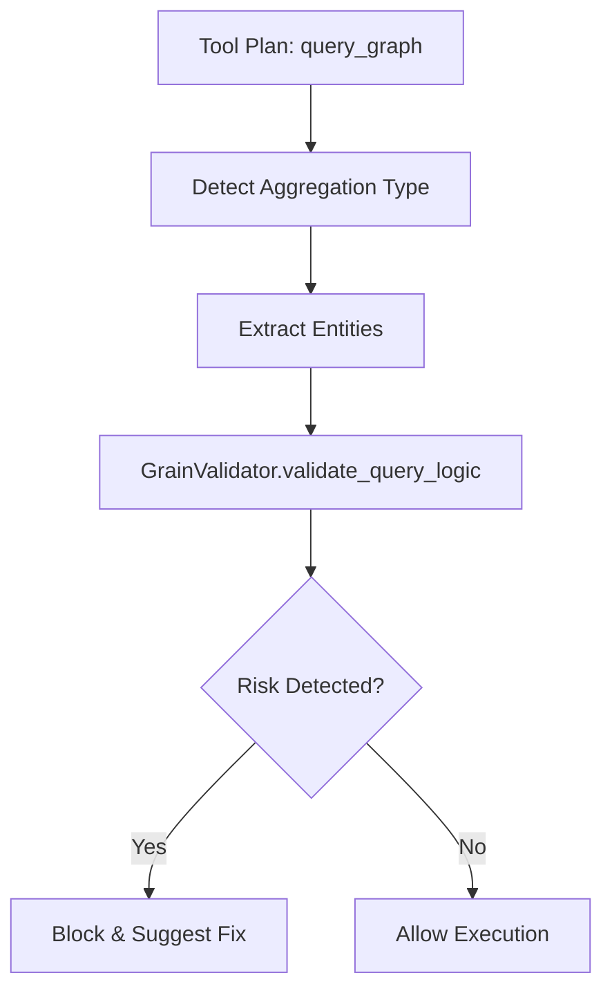
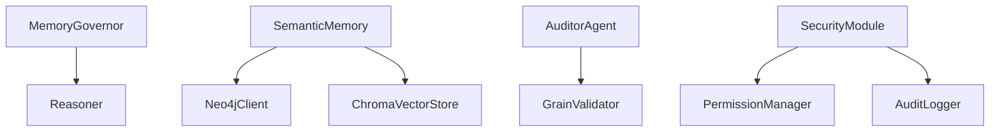

# Memory Governance

<cite>
**Referenced Files in This Document**
- [governance.py](file://src/memory/governance.py)
- [security.py](file://src/core/security.py)
- [permissions.py](file://src/core/permissions.py)
- [base.py](file://src/memory/base.py)
- [vector_adapter.py](file://src/memory/vector_adapter.py)
- [neo4j_adapter.py](file://src/memory/neo4j_adapter.py)
- [reasoner.py](file://src/core/reasoner.py)
- [auditor.py](file://src/agents/auditor.py)
- [grain_validator.py](file://src/core/ontology/grain_validator.py)
</cite>

## Table of Contents
1. [Introduction](#introduction)
2. [Project Structure](#project-structure)
3. [Core Components](#core-components)
4. [Architecture Overview](#architecture-overview)
5. [Detailed Component Analysis](#detailed-component-analysis)
6. [Dependency Analysis](#dependency-analysis)
7. [Performance Considerations](#performance-considerations)
8. [Troubleshooting Guide](#troubleshooting-guide)
9. [Conclusion](#conclusion)
10. [Appendices](#appendices)

## Introduction
This document describes the memory governance system for access control, data integrity, and policy enforcement in a hybrid knowledge platform. It explains how memory operations are governed across semantic and episodic memory, how access control and security policies are enforced, and how consistency and integrity are maintained across graph and vector stores. It also covers entity normalization, synonym resolution, grain cardinality enforcement, conflict resolution, and audit trails. Practical configuration and monitoring guidance is included, along with security and compliance considerations.

## Project Structure
The memory governance system spans several modules:
- Memory storage and retrieval: semantic memory (graph + vector), episodic memory (SQLite)
- Governance engine: memory governance for confidence decay, pruning, and reinforcement
- Security and access control: API key management, rate limiting, IP blocking, input validation, audit logging
- Permissions: role-based access control (RBAC) with fine-grained permissions
- Reasoning: rule-based inference with confidence propagation
- Auditing: auditor agent for fan-trap detection and corrective feedback
- Grain validation: graph-backed cardinality enforcement to prevent aggregation pitfalls

**Diagram sources**
- [base.py:9-144](file://src/memory/base.py#L9-L144)
- [governance.py:6-62](file://src/memory/governance.py#L6-L62)
- [reasoner.py:145-349](file://src/core/reasoner.py#L145-L349)
- [auditor.py:8-72](file://src/agents/auditor.py#L8-L72)
- [grain_validator.py:13-61](file://src/core/ontology/grain_validator.py#L13-L61)
- [security.py:21-429](file://src/core/security.py#L21-L429)
- [permissions.py:166-424](file://src/core/permissions.py#L166-L424)

**Section sources**
- [base.py:9-144](file://src/memory/base.py#L9-L144)
- [governance.py:6-62](file://src/memory/governance.py#L6-L62)
- [reasoner.py:145-349](file://src/core/reasoner.py#L145-L349)
- [auditor.py:8-72](file://src/agents/auditor.py#L8-L72)
- [grain_validator.py:13-61](file://src/core/ontology/grain_validator.py#L13-L61)
- [security.py:21-429](file://src/core/security.py#L21-L429)
- [permissions.py:166-424](file://src/core/permissions.py#L166-L424)

## Core Components
- MemoryGovernor: Implements confidence-based reinforcement and pruning to maintain knowledge quality and prevent stale or conflicting facts from dominating inference.
- SemanticMemory: Hybrid memory combining graph storage (Neo4j) and vector similarity (ChromaDB). Provides entity normalization, cardinality checks, and retrieval APIs.
- EpisodicMemory: Local SQLite persistence for agent experiences and human feedback to support self-correction and RLHF.
- Reasoner: Rule engine with forward/backward chaining and confidence propagation across derived facts.
- GrainValidator: Validates query logic against graph-defined cardinality to prevent fan-trap risks during aggregation.
- AuditorAgent: Independent agent that audits tool plans (e.g., graph queries) and blocks or suggests corrections when cardinality or other governance risks are detected.
- SecurityModule: API key management, rate limiting, IP blocking, input validation, and audit logging.
- PermissionManager: RBAC with roles, permissions, and resource ownership checks.

**Section sources**
- [governance.py:6-62](file://src/memory/governance.py#L6-L62)
- [base.py:9-144](file://src/memory/base.py#L9-L144)
- [reasoner.py:145-349](file://src/core/reasoner.py#L145-L349)
- [grain_validator.py:13-61](file://src/core/ontology/grain_validator.py#L13-L61)
- [auditor.py:8-72](file://src/agents/auditor.py#L8-L72)
- [security.py:21-429](file://src/core/security.py#L21-L429)
- [permissions.py:166-424](file://src/core/permissions.py#L166-L424)

## Architecture Overview
The governance architecture integrates memory, reasoning, auditing, and security:

**Diagram sources**
- [security.py:21-429](file://src/core/security.py#L21-L429)
- [permissions.py:166-424](file://src/core/permissions.py#L166-L424)
- [base.py:91-120](file://src/memory/base.py#L91-L120)
- [reasoner.py:224-349](file://src/core/reasoner.py#L224-L349)
- [governance.py:20-62](file://src/memory/governance.py#L20-L62)
- [auditor.py:24-65](file://src/agents/auditor.py#L24-L65)
- [grain_validator.py:24-55](file://src/core/ontology/grain_validator.py#L24-L55)

## Detailed Component Analysis

### MemoryGovernor: Confidence Reinforcement and Pruning
- Reinforces facts used by successful inference paths to strengthen reliable knowledge.
- Penalizes conflicting facts by decaying confidence and pruning low-confidence facts.
- Periodic garbage collection removes dormant facts to keep the knowledge graph healthy.

**Diagram sources**
- [governance.py:20-62](file://src/memory/governance.py#L20-L62)

**Section sources**
- [governance.py:6-62](file://src/memory/governance.py#L6-L62)

### SemanticMemory: Hybrid Storage and Normalization
- Entity normalization resolves synonyms to canonical terms before storing or querying.
- Cardinality checks infer whether an entity is granular at “1” or “N” using graph-backed logic and fallback rules.
- Stores facts in both Neo4j (logic layer) and ChromaDB (semantic layer) for precise and fuzzy retrieval.

**Diagram sources**
- [base.py:9-144](file://src/memory/base.py#L9-L144)
- [vector_adapter.py:31-97](file://src/memory/vector_adapter.py#L31-L97)
- [neo4j_adapter.py:130-774](file://src/memory/neo4j_adapter.py#L130-L774)

**Section sources**
- [base.py:9-144](file://src/memory/base.py#L9-L144)
- [vector_adapter.py:31-97](file://src/memory/vector_adapter.py#L31-L97)
- [neo4j_adapter.py:130-774](file://src/memory/neo4j_adapter.py#L130-L774)

### Reasoner: Inference with Confidence Propagation
- Supports forward and backward chaining, rule registration, and confidence propagation across derived facts.
- Prevents redundant derivations and enforces timeouts to avoid long-running inference loops.

**Diagram sources**
- [reasoner.py:243-349](file://src/core/reasoner.py#L243-L349)

**Section sources**
- [reasoner.py:145-349](file://src/core/reasoner.py#L145-L349)

### GrainValidator and AuditorAgent: Cardinality Enforcement and Audit
- GrainValidator inspects involved entities and aggregate functions to detect fan-trap risks.
- AuditorAgent audits tool plans and either allows execution or blocks with corrective suggestions.

**Diagram sources**
- [auditor.py:24-65](file://src/agents/auditor.py#L24-L65)
- [grain_validator.py:24-55](file://src/core/ontology/grain_validator.py#L24-L55)

**Section sources**
- [auditor.py:8-72](file://src/agents/auditor.py#L8-L72)
- [grain_validator.py:13-61](file://src/core/ontology/grain_validator.py#L13-L61)

### SecurityModule and PermissionManager: Access Control and Audit
- APIKeyManager generates, validates, revokes, and lists API keys with expiry and usage tracking.
- RateLimiter applies token-bucket rate limiting per identifier.
- IPBlocker manages IP-based access control and failed attempt thresholds.
- InputValidator sanitizes and validates inputs to mitigate injection risks.
- AuditLogger records authentication, authorization failures, rate limit events, and sensitive operations.
- PermissionManager defines roles, permissions, and resource ownership checks with admin bypass and caching.

```mermaid
classDiagram
class APIKeyManager {
+generate_key(user_id, permissions, expires_in_days) str
+validate_key(key) Dict
+revoke_key(key) bool
+list_keys(user_id) List
}
class RateLimiter {
+check_rate_limit(identifier) (bool, Dict)
+reset(identifier) void
}
class IPBlocker {
+block_ip(ip) void
+unblock_ip(ip) void
+is_blocked(ip) bool
+record_failed_attempt(ip) void
}
class InputValidator {
+validate_query(query) ValidationResult
+validate_uri(uri) ValidationResult
+sanitize_string(value, max_length) str
}
class AuditLogger {
+log_auth_attempt(user_id, success, ip_address, method) void
+log_authorization_failure(user_id, resource, action, ip_address) void
+log_rate_limit_exceeded(identifier, ip_address) void
+log_sensitive_operation(user_id, operation, details) void
}
class PermissionManager {
+create_role(name, description, permissions, inherits_from) Role
+assign_role(user_id, role_name) bool
+check_permission(user_id, permission, resource) bool
+require_permission(permission, resource) callable
}
```

**Diagram sources**
- [security.py:21-429](file://src/core/security.py#L21-L429)
- [permissions.py:166-424](file://src/core/permissions.py#L166-L424)

**Section sources**
- [security.py:21-429](file://src/core/security.py#L21-L429)
- [permissions.py:166-424](file://src/core/permissions.py#L166-L424)

## Dependency Analysis
- MemoryGovernor depends on Reasoner’s fact set to enforce confidence and pruning.
- SemanticMemory coordinates with Neo4jClient and ChromaVectorStore for persistence and retrieval.
- AuditorAgent relies on GrainValidator to assess cardinality risks.
- SecurityModule and PermissionManager underpin access control and auditability for all memory operations.

**Diagram sources**
- [governance.py:13-18](file://src/memory/governance.py#L13-L18)
- [base.py:22-27](file://src/memory/base.py#L22-L27)
- [auditor.py:17-22](file://src/agents/auditor.py#L17-L22)
- [grain_validator.py:21-22](file://src/core/ontology/grain_validator.py#L21-L22)
- [security.py:21-429](file://src/core/security.py#L21-L429)
- [permissions.py:166-174](file://src/core/permissions.py#L166-L174)

**Section sources**
- [governance.py:13-18](file://src/memory/governance.py#L13-L18)
- [base.py:22-27](file://src/memory/base.py#L22-L27)
- [auditor.py:17-22](file://src/agents/auditor.py#L17-L22)
- [grain_validator.py:21-22](file://src/core/ontology/grain_validator.py#L21-L22)
- [security.py:21-429](file://src/core/security.py#L21-L429)
- [permissions.py:166-174](file://src/core/permissions.py#L166-L174)

## Performance Considerations
- Inference timeouts and deduplication prevent excessive computation in the Reasoner.
- Vector similarity search limits and ChromaDB persistent client configuration impact latency and throughput.
- Garbage collection in MemoryGovernor keeps the fact base lean and improves inference speed.
- Rate limiting and IP blocking protect the system from abuse and reduce denial-of-service risks.

[No sources needed since this section provides general guidance]

## Troubleshooting Guide
- Authentication failures: Verify API key validity, expiry, and usage counts via APIKeyManager logs and AuditLogger entries.
- Authorization failures: Confirm user roles and permissions via PermissionManager and ensure resource ownership checks pass.
- Rate limit exceeded: Inspect RateLimiter metrics and adjust burst sizes or requests-per-minute as needed.
- Audit interception: Review AuditorAgent decisions and GrainValidator risk messages for corrective actions.
- Memory health: Monitor MemoryGovernor pruning and garbage collection metrics; adjust decay and prune thresholds if necessary.

**Section sources**
- [security.py:46-64](file://src/core/security.py#L46-L64)
- [permissions.py:359-381](file://src/core/permissions.py#L359-L381)
- [auditor.py:24-65](file://src/agents/auditor.py#L24-L65)
- [governance.py:47-62](file://src/memory/governance.py#L47-L62)

## Conclusion
The memory governance system ensures secure, consistent, and high-quality knowledge operations across hybrid storage. By combining confidence-based governance, robust access control, cardinality-aware auditing, and comprehensive audit trails, the platform maintains integrity and supports compliance. Policies for normalization, synonym resolution, and grain enforcement help prevent logical pitfalls and improve trustworthiness of derived knowledge.

[No sources needed since this section summarizes without analyzing specific files]

## Appendices

### Governance Policy Configuration Examples
- Confidence decay and reinforcement rates: tune MemoryGovernor parameters to balance staleness reduction and retention of useful facts.
- Pruning threshold: set a conservative threshold to avoid premature removal of facts while keeping the knowledge graph healthy.
- Cardinality enforcement: configure GrainValidator to detect fan-trap risks in aggregation-heavy queries; rely on AuditorAgent for corrective suggestions.
- Access control: define roles and permissions via PermissionManager; enforce resource ownership and admin bypass appropriately.
- Security controls: enable API key rotation, rate limiting windows, and IP blocking policies; monitor AuditLogger for suspicious activity.

**Section sources**
- [governance.py:13-18](file://src/memory/governance.py#L13-L18)
- [grain_validator.py:24-55](file://src/core/ontology/grain_validator.py#L24-L55)
- [auditor.py:24-65](file://src/agents/auditor.py#L24-L65)
- [permissions.py:166-424](file://src/core/permissions.py#L166-L424)
- [security.py:21-429](file://src/core/security.py#L21-L429)

### Compliance and Privacy Considerations
- Data minimization: restrict stored data to what is necessary; leverage normalization to reduce duplication.
- Access logging: use AuditLogger to track sensitive operations and maintain audit trails for compliance audits.
- Secure defaults: enforce strict input validation and sanitize all user-provided content.
- Retention and deletion: implement policies for API key lifecycle and memory cleanup aligned with privacy regulations.

[No sources needed since this section provides general guidance]