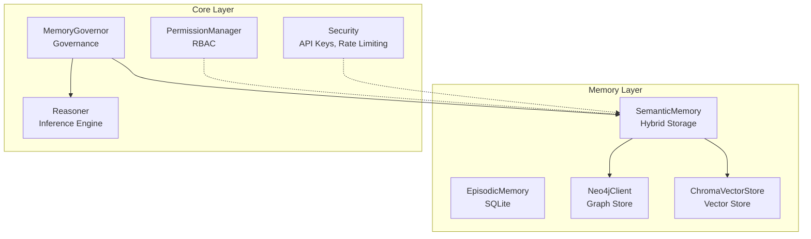
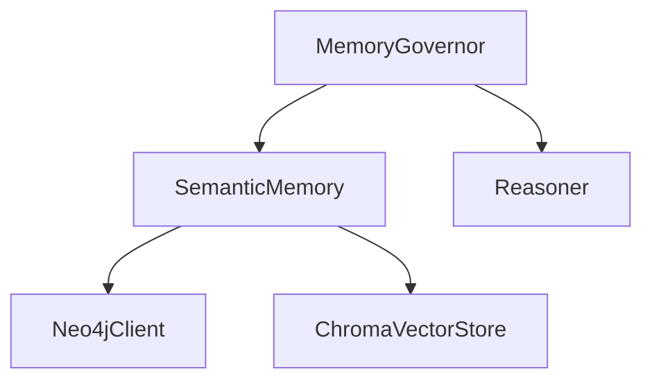
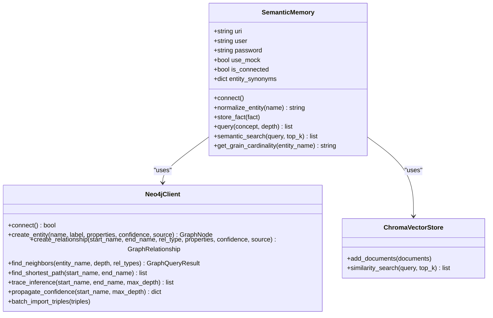
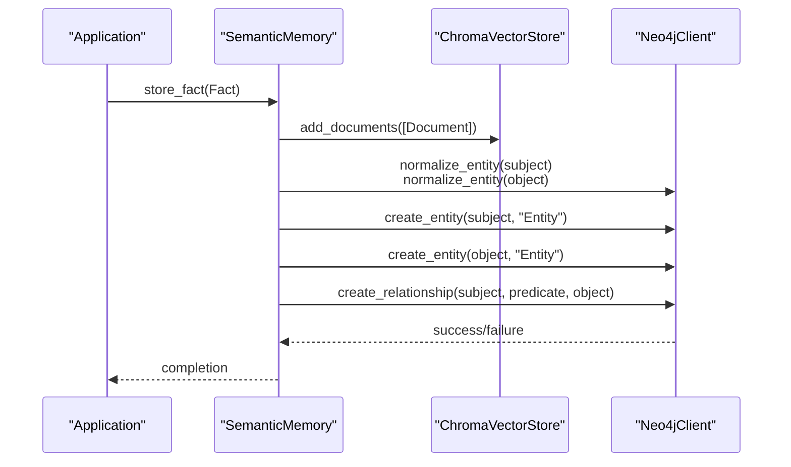
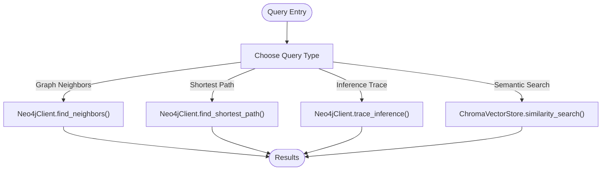
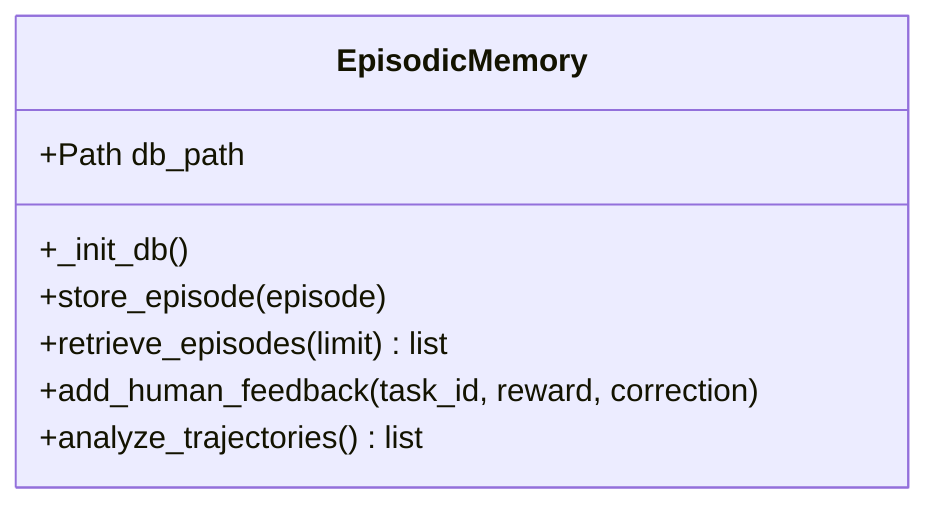
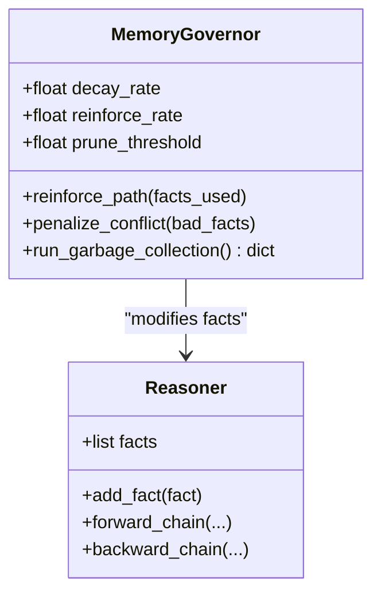
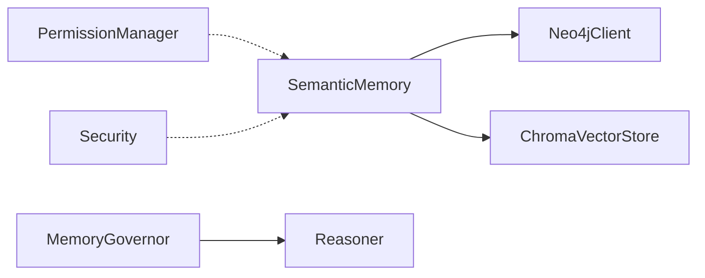

# Memory Management System

<cite>
**Referenced Files in This Document**
- [base.py](file://src/memory/base.py)
- [neo4j_adapter.py](file://src/memory/neo4j_adapter.py)
- [vector_adapter.py](file://src/memory/vector_adapter.py)
- [governance.py](file://src/memory/governance.py)
- [reasoner.py](file://src/core/reasoner.py)
- [permissions.py](file://src/core/permissions.py)
- [security.py](file://src/core/security.py)
- [architecture.md](file://docs/architecture.md)
- [test_memory.py](file://tests/test_memory.py)
- [demo_confidence_reasoning.py](file://examples/demo_confidence_reasoning.py)
</cite>

## Table of Contents
1. [Introduction](#introduction)
2. [Project Structure](#project-structure)
3. [Core Components](#core-components)
4. [Architecture Overview](#architecture-overview)
5. [Detailed Component Analysis](#detailed-component-analysis)
6. [Dependency Analysis](#dependency-analysis)
7. [Performance Considerations](#performance-considerations)
8. [Troubleshooting Guide](#troubleshooting-guide)
9. [Conclusion](#conclusion)
10. [Appendices](#appendices)

## Introduction
This document describes the memory management system with a hybrid storage architecture designed for scalable knowledge bases. It focuses on semantic memory that combines Neo4j graph storage with ChromaDB vector embeddings, and episodic memory for persistent agent experiences. It explains entity normalization, synonym mapping, and grain cardinality enforcement, and covers governance for memory access control and data integrity. It also connects episodic memory tracking with semantic memory storage, and provides performance optimization strategies, consistency guarantees, troubleshooting, and scaling guidance.

## Project Structure
The memory system resides primarily under src/memory and integrates with reasoning and governance under src/core. The architecture document outlines the layered design and the hybrid memory layer’s role.



**Diagram sources**
- [architecture.md:18-22](file://docs/architecture.md#L18-L22)
- [base.py:9-28](file://src/memory/base.py#L9-L28)
- [neo4j_adapter.py:130-178](file://src/memory/neo4j_adapter.py#L130-L178)
- [vector_adapter.py:31-44](file://src/memory/vector_adapter.py#L31-L44)
- [governance.py:6-18](file://src/memory/governance.py#L6-L18)
- [reasoner.py:145-180](file://src/core/reasoner.py#L145-L180)
- [permissions.py:166-182](file://src/core/permissions.py#L166-L182)
- [security.py:21-93](file://src/core/security.py#L21-L93)

**Section sources**
- [architecture.md:1-35](file://docs/architecture.md#L1-L35)

## Core Components
- SemanticMemory: Hybrid storage orchestrator that persists facts to both Neo4j and ChromaDB, normalizes entities, enforces grain cardinality heuristics, and supports graph traversal and vector similarity search.
- Neo4jClient: Graph database adapter providing entity and relationship CRUD, graph traversal, shortest path, inference tracing, confidence propagation, and batch import.
- ChromaVectorStore: Vector store adapter integrating ChromaDB for dense vector storage and similarity search.
- EpisodicMemory: SQLite-backed persistence for agent episodes, rewards, and human feedback, enabling trajectory reflection and future RLHF data accumulation.
- MemoryGovernor: Governance engine applying confidence-based reinforcement and pruning, garbage collection, and optional drift detection/reporting.
- Reasoner: Symbolic inference engine that works with facts and supports forward/backward chaining, confidence propagation, and rule-based reasoning.
- Permissions and Security: RBAC, API key management, rate limiting, and audit logging to secure memory operations.

**Section sources**
- [base.py:9-249](file://src/memory/base.py#L9-L249)
- [neo4j_adapter.py:130-974](file://src/memory/neo4j_adapter.py#L130-L974)
- [vector_adapter.py:31-79](file://src/memory/vector_adapter.py#L31-L79)
- [governance.py:6-62](file://src/memory/governance.py#L6-L62)
- [reasoner.py:145-800](file://src/core/reasoner.py#L145-L800)
- [permissions.py:166-464](file://src/core/permissions.py#L166-L464)
- [security.py:21-429](file://src/core/security.py#L21-L429)

## Architecture Overview
The semantic memory layer is a hybrid system:
- Graph layer (Neo4j): Stores structured facts as subject-predicate-object triples with labels and properties. Supports traversal, shortest path, and inference tracing with confidence propagation.
- Vector layer (ChromaDB): Stores dense embeddings of textual facts for semantic similarity search.
- Governance layer: Applies confidence-based reinforcement, pruning, and periodic garbage collection to maintain data quality and relevance.
- Episodic memory: Records agent episodes and human feedback in SQLite for trajectory analysis and future learning.



**Diagram sources**
- [base.py:9-28](file://src/memory/base.py#L9-L28)
- [neo4j_adapter.py:130-178](file://src/memory/neo4j_adapter.py#L130-L178)
- [vector_adapter.py:31-44](file://src/memory/vector_adapter.py#L31-L44)
- [governance.py:13-18](file://src/memory/governance.py#L13-L18)
- [reasoner.py:145-180](file://src/core/reasoner.py#L145-L180)

## Detailed Component Analysis

### SemanticMemory: Hybrid Storage Orchestration
SemanticMemory coordinates persistence and retrieval across Neo4j and ChromaDB. It:
- Normalizes entities via synonym mapping to align diverse terms to canonical forms.
- Enforces grain cardinality heuristics using keyword-based rules when graph metadata is unavailable.
- Stores facts in both stores to enable precise graph traversal and fuzzy semantic search.
- Provides graph traversal and vector similarity search APIs.



**Diagram sources**
- [base.py:9-144](file://src/memory/base.py#L9-L144)
- [neo4j_adapter.py:130-774](file://src/memory/neo4j_adapter.py#L130-L774)
- [vector_adapter.py:31-79](file://src/memory/vector_adapter.py#L31-L79)

**Section sources**
- [base.py:9-144](file://src/memory/base.py#L9-L144)

#### Entity Normalization and Synonym Mapping
- A curated synonym map aligns variants to canonical terms.
- Normalization occurs before graph creation to ensure consistent entity identity.
- Includes heuristic-based fallback for cardinality checks when graph metadata is absent.

**Section sources**
- [base.py:29-67](file://src/memory/base.py#L29-L67)
- [base.py:122-144](file://src/memory/base.py#L122-L144)

#### Grain Cardinality Enforcement
- Queries graph metadata for cardinality constraints when connected.
- Uses keyword heuristics (e.g., “Item”, “List”, “Detail”, “清单”) to infer Many-side entities when metadata is missing.
- Defaults to One-side when insufficient signals are present.

**Section sources**
- [base.py:122-144](file://src/memory/base.py#L122-L144)

#### Memory Operations and Synchronization
- Store a fact: Persist to ChromaDB (vector layer) and Neo4j (graph layer) atomically via the SemanticMemory store_fact workflow.
- Retrieve neighbors: Traverse the graph around a concept using Neo4jClient.
- Semantic search: Query ChromaDB for semantically similar facts.
- Synchronize: Both stores receive the same normalized fact content.



**Diagram sources**
- [base.py:91-110](file://src/memory/base.py#L91-L110)
- [vector_adapter.py:45-58](file://src/memory/vector_adapter.py#L45-L58)
- [neo4j_adapter.py:222-412](file://src/memory/neo4j_adapter.py#L222-L412)

**Section sources**
- [base.py:91-121](file://src/memory/base.py#L91-L121)

#### Query Patterns
- Graph traversal: Find neighbors up to a given depth for a concept.
- Shortest path: Compute shortest path between two entities.
- Inference tracing: Discover inference paths with confidence aggregation.
- Vector similarity: Retrieve semantically similar facts for contextual recall.



**Diagram sources**
- [base.py:111-121](file://src/memory/base.py#L111-L121)
- [neo4j_adapter.py:485-580](file://src/memory/neo4j_adapter.py#L485-L580)
- [neo4j_adapter.py:599-709](file://src/memory/neo4j_adapter.py#L599-L709)
- [vector_adapter.py:60-78](file://src/memory/vector_adapter.py#L60-L78)

**Section sources**
- [base.py:111-121](file://src/memory/base.py#L111-L121)
- [neo4j_adapter.py:485-709](file://src/memory/neo4j_adapter.py#L485-L709)
- [vector_adapter.py:60-78](file://src/memory/vector_adapter.py#L60-L78)

### EpisodicMemory: Persistent Agent Episodes
EpisodicMemory persists agent episodes in SQLite with JSON serialization, supports adding human feedback (rewards and corrections), and enables trajectory analysis to extract patterns and suggestions for ontology updates.



**Diagram sources**
- [base.py:150-249](file://src/memory/base.py#L150-L249)

**Section sources**
- [base.py:150-249](file://src/memory/base.py#L150-L249)

### Governance Layer: Memory Access Control and Integrity
The governance layer applies confidence-based reinforcement and pruning, periodic garbage collection, and optional drift detection/reporting. It interacts with the Reasoner’s fact set to enforce data hygiene.



**Diagram sources**
- [governance.py:6-62](file://src/memory/governance.py#L6-L62)
- [reasoner.py:145-800](file://src/core/reasoner.py#L145-L800)

**Section sources**
- [governance.py:6-62](file://src/memory/governance.py#L6-L62)
- [reasoner.py:145-800](file://src/core/reasoner.py#L145-L800)

### Security and Access Control
- RBAC: Define roles, permissions, and user-role mappings; enforce checks for read/write operations on schema, entities, relationships, triples, and inferences.
- API Keys: Generate, validate, revoke, and track usage; integrate with rate limiting and audit logging.
- Rate Limiting: Token-bucket algorithm to throttle requests per identifier.
- Audit Logging: Track authentication attempts, authorization failures, rate limit events, and sensitive operations.

```mermaid
classDiagram
class PermissionManager {
+create_role(name, description, permissions, inherits_from) Role
+assign_role(user_id, role_name) bool
+check_permission(user_id, permission, resource) bool
+get_user_permissions(user_id) Set
}
class APIKeyManager {
+generate_key(user_id, permissions, expires_in_days) string
+validate_key(key) dict
+revoke_key(key) bool
+list_keys(user_id) list
}
class RateLimiter {
+check_rate_limit(identifier) tuple
+reset(identifier)
}
class AuditLogger {
+log_auth_attempt(user_id, success, ip_address, method)
+log_authorization_failure(user_id, resource, action, ip_address)
+log_rate_limit_exceeded(identifier, ip_address)
+log_sensitive_operation(user_id, operation, details)
}
PermissionManager -.-> SemanticMemory : "enforce access"
APIKeyManager -.-> SemanticMemory : "authenticate"
RateLimiter -.-> SemanticMemory : "throttle"
AuditLogger -.-> SemanticMemory : "monitor"
```

**Diagram sources**
- [permissions.py:166-464](file://src/core/permissions.py#L166-L464)
- [security.py:21-429](file://src/core/security.py#L21-L429)
- [base.py:9-28](file://src/memory/base.py#L9-L28)

**Section sources**
- [permissions.py:166-464](file://src/core/permissions.py#L166-L464)
- [security.py:21-429](file://src/core/security.py#L21-L429)

## Dependency Analysis
- SemanticMemory depends on Neo4jClient and ChromaVectorStore for persistence and retrieval.
- MemoryGovernor depends on Reasoner’s fact set to apply reinforcement/pruning.
- Permissions and Security provide cross-cutting concerns for access control and auditing.



**Diagram sources**
- [base.py:9-28](file://src/memory/base.py#L9-L28)
- [governance.py:13-18](file://src/memory/governance.py#L13-L18)
- [permissions.py:166-182](file://src/core/permissions.py#L166-L182)
- [security.py:21-93](file://src/core/security.py#L21-L93)

**Section sources**
- [base.py:9-28](file://src/memory/base.py#L9-L28)
- [governance.py:13-18](file://src/memory/governance.py#L13-L18)
- [permissions.py:166-182](file://src/core/permissions.py#L166-L182)
- [security.py:21-93](file://src/core/security.py#L21-L93)

## Performance Considerations
- Hybrid Retrieval: Combine vector similarity search with graph traversal to reduce false positives and improve precision.
- Batch Imports: Use Neo4jClient.batch_import_triples for large-scale ingestion to minimize round-trips.
- Indexing and Caching: Leverage Neo4j indices and internal caches (node/relationship index, inference cache) to accelerate lookups.
- Confidence Propagation: Use propagate_confidence to estimate reachability confidence and prune low-confidence paths early.
- Rate Limiting: Apply rate limits to prevent overload during bulk operations.
- Garbage Collection: Periodically run MemoryGovernor.run_garbage_collection to remove stale facts below prune threshold.

[No sources needed since this section provides general guidance]

## Troubleshooting Guide
Common issues and resolutions:
- Neo4j connectivity failures: Verify credentials and URI; SemanticMemory falls back to in-memory mode when disabled.
- Missing chromadb: Ensure installation; ChromaVectorStore raises ImportError if not installed.
- Permission Denied: Confirm user roles and permissions; use require_permission decorators and PermissionManager.check_permission.
- Rate Limit Exceeded: Review RateLimiter metrics and adjust requests_per_minute/burst_size.
- Drift Detection: Use HealthReport and DriftAlert patterns to monitor and alert on semantic drift.

**Section sources**
- [base.py:47-54](file://src/memory/base.py#L47-L54)
- [vector_adapter.py:38-41](file://src/memory/vector_adapter.py#L38-L41)
- [permissions.py:359-382](file://src/core/permissions.py#L359-L382)
- [security.py:124-146](file://src/core/security.py#L124-L146)
- [test_memory.py:1-284](file://tests/test_memory.py#L1-L284)

## Conclusion
The memory management system integrates semantic memory with hybrid graph-vector storage, governed by confidence-aware policies and secured by robust access control. It supports precise graph traversal, semantic similarity search, and persistent episodic memory for agent trajectories. Governance ensures data integrity and relevance, while security and permissions protect operations. Together, these components form a scalable foundation for large-scale knowledge bases with strong consistency guarantees.

[No sources needed since this section summarizes without analyzing specific files]

## Appendices

### Example Workflows and Patterns
- Confidence-based reasoning: Demonstrates multi-evidence fusion and automatic learning from feedback.
- Episodic trajectory analysis: Extracts patterns from recent episodes to suggest ontology updates.

**Section sources**
- [demo_confidence_reasoning.py:1-185](file://examples/demo_confidence_reasoning.py#L1-L185)
- [base.py:217-247](file://src/memory/base.py#L217-L247)