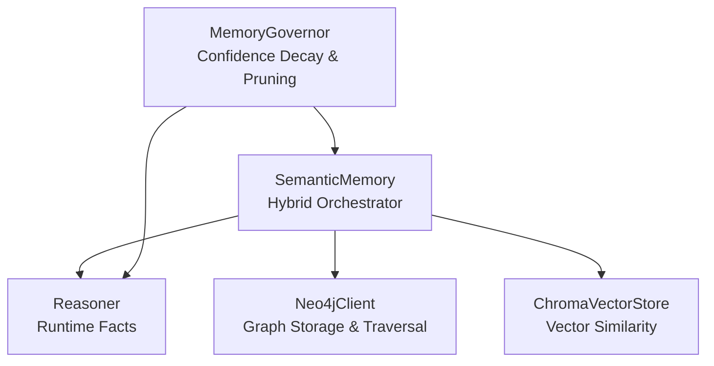
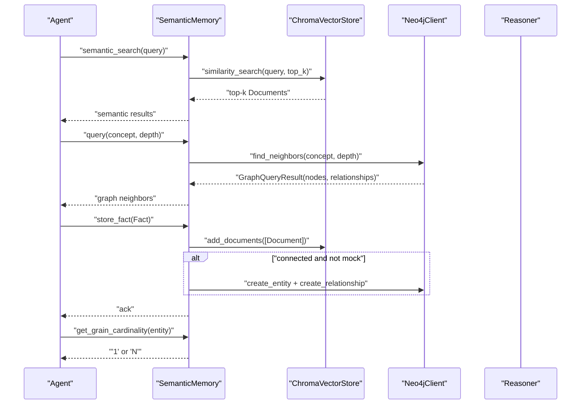
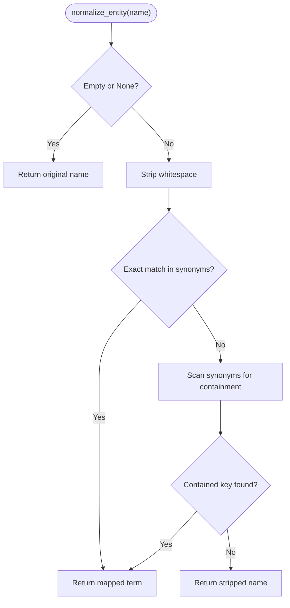
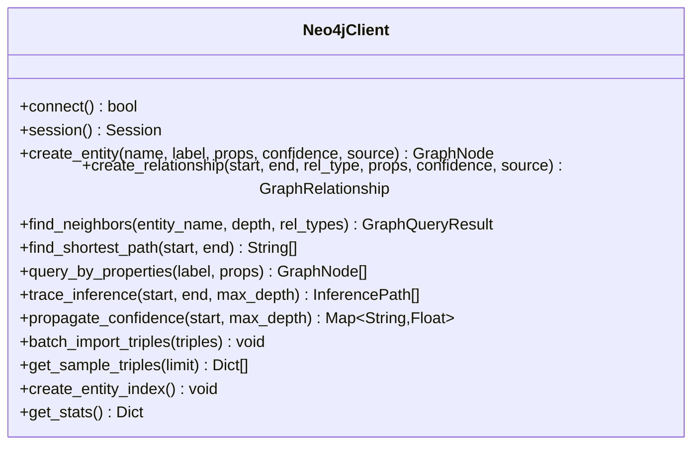
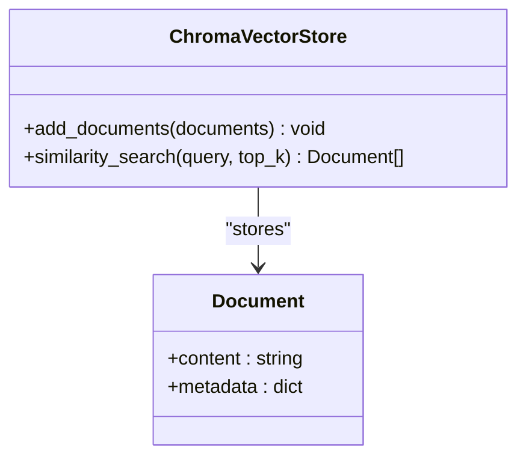
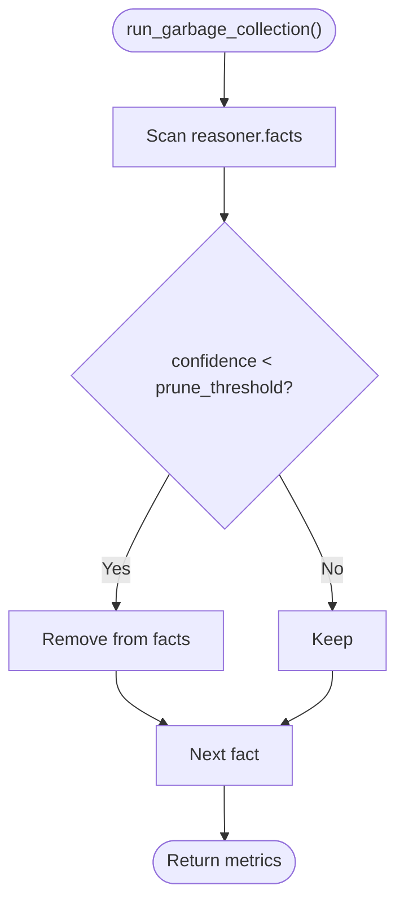
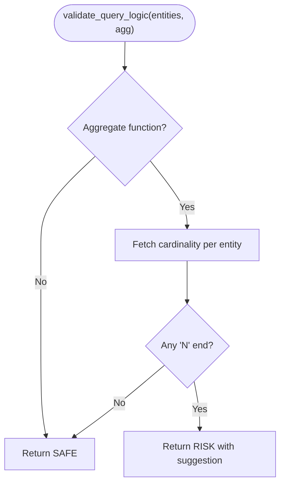
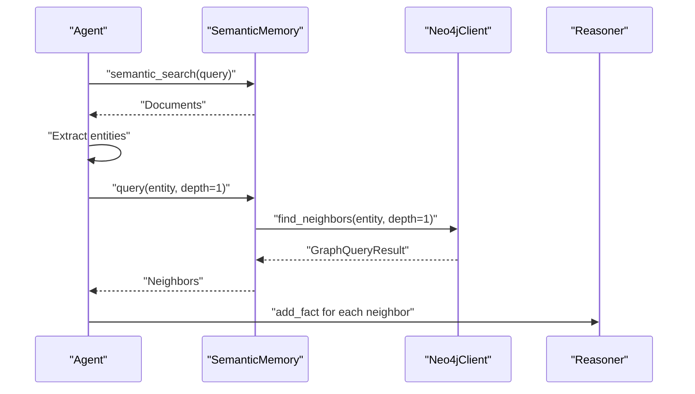
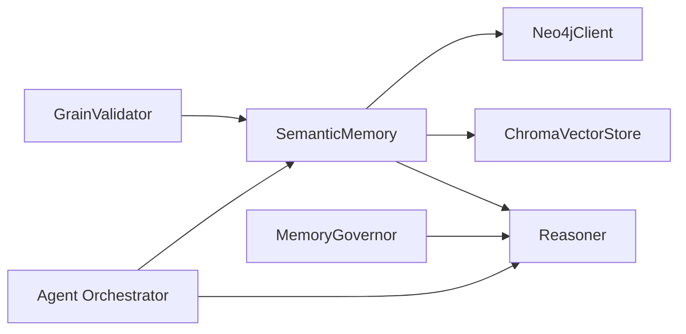

# Semantic Memory

<cite>
**Referenced Files in This Document**
- [base.py](file://src/memory/base.py)
- [neo4j_adapter.py](file://src/memory/neo4j_adapter.py)
- [vector_adapter.py](file://src/memory/vector_adapter.py)
- [reasoner.py](file://src/core/reasoner.py)
- [skills.py](file://src/core/memory/skills.py)
- [grain_validator.py](file://src/core/ontology/grain_validator.py)
- [governance.py](file://src/memory/governance.py)
- [orchestrator.py](file://src/agents/orchestrator.py)
- [PERFORMANCE.md](file://ontology-platform/PERFORMANCE.md)
</cite>

## Table of Contents
1. [Introduction](#introduction)
2. [Project Structure](#project-structure)
3. [Core Components](#core-components)
4. [Architecture Overview](#architecture-overview)
5. [Detailed Component Analysis](#detailed-component-analysis)
6. [Dependency Analysis](#dependency-analysis)
7. [Performance Considerations](#performance-considerations)
8. [Troubleshooting Guide](#troubleshooting-guide)
9. [Conclusion](#conclusion)

## Introduction
This document describes the semantic memory component that powers hybrid knowledge storage and retrieval in the platform. It integrates a Neo4j graph database for precise, structured knowledge representation with a ChromaDB vector store for semantic similarity search. Together, they enable a dual-layer memory architecture supporting both exact graph traversal and fuzzy semantic matching. The component also includes entity normalization, a grain cardinality enforcement system, connection management (including mock mode), and practical workflows for fact storage, graph traversal, and semantic search.

## Project Structure
The semantic memory spans several modules:
- Memory core: hybrid storage orchestration and normalization
- Neo4j adapter: graph CRUD, traversal, and inference support
- Vector adapter: ChromaDB-backed dense vector storage and similarity search
- Reasoner: runtime fact storage and rule-based inference
- Governance: memory health and pruning policies
- Agent integration: GraphRAG injection and semantic search orchestration
- Performance: caching and connection pooling guidance

**Diagram sources**
- [base.py:9-249](file://src/memory/base.py#L9-L249)
- [neo4j_adapter.py:130-974](file://src/memory/neo4j_adapter.py#L130-L974)
- [vector_adapter.py:31-97](file://src/memory/vector_adapter.py#L31-L97)
- [reasoner.py:145-819](file://src/core/reasoner.py#L145-L819)
- [governance.py:6-62](file://src/memory/governance.py#L6-L62)

**Section sources**
- [base.py:9-249](file://src/memory/base.py#L9-L249)
- [neo4j_adapter.py:130-974](file://src/memory/neo4j_adapter.py#L130-L974)
- [vector_adapter.py:31-97](file://src/memory/vector_adapter.py#L31-L97)
- [reasoner.py:145-819](file://src/core/reasoner.py#L145-L819)
- [governance.py:6-62](file://src/memory/governance.py#L6-L62)

## Core Components
- SemanticMemory: orchestrates hybrid storage, normalization, and retrieval; supports mock mode and connection lifecycle
- Neo4jClient: graph CRUD, traversal, inference tracing, and confidence propagation
- ChromaVectorStore: persistent vector collection with similarity search
- Reasoner: runtime fact management and rule-based inference
- MemoryGovernor: confidence-based reinforcement and pruning
- GrainValidator: graph-backed enforcement of entity relationship cardinality
- Agent integration: GraphRAG pipeline that injects graph facts into the reasoner

Key capabilities:
- Entity normalization with synonym mapping and containment-based resolution
- Dual-layer storage: graph for precise relationships; vectors for semantic recall
- Graph traversal queries and semantic similarity search
- Mock mode for development and testing without external databases
- Performance-oriented patterns: caching and connection pooling guidance

**Section sources**
- [base.py:9-249](file://src/memory/base.py#L9-L249)
- [neo4j_adapter.py:130-974](file://src/memory/neo4j_adapter.py#L130-L974)
- [vector_adapter.py:31-97](file://src/memory/vector_adapter.py#L31-L97)
- [reasoner.py:145-819](file://src/core/reasoner.py#L145-L819)
- [governance.py:6-62](file://src/memory/governance.py#L6-L62)
- [grain_validator.py:13-60](file://src/core/ontology/grain_validator.py#L13-L60)
- [orchestrator.py:261-282](file://src/agents/orchestrator.py#L261-L282)

## Architecture Overview
The semantic memory architecture couples structured and semantic layers:
- Structured layer (Neo4j): stores entities and relationships as a knowledge graph
- Semantic layer (ChromaDB): stores dense embeddings of textual facts for similarity search
- Normalization layer: aligns entity names to canonical forms
- Governance layer: maintains memory quality via confidence decay and pruning
- Agent integration: retrieves neighbors and injects them into the reasoner for GraphRAG

**Diagram sources**
- [base.py:91-144](file://src/memory/base.py#L91-L144)
- [vector_adapter.py:78-97](file://src/memory/vector_adapter.py#L78-L97)
- [neo4j_adapter.py:485-561](file://src/memory/neo4j_adapter.py#L485-L561)
- [reasoner.py:673-703](file://src/core/reasoner.py#L673-L703)

## Detailed Component Analysis

### SemanticMemory: Hybrid Orchestrator
Responsibilities:
- Initialize and manage Neo4jClient and ChromaVectorStore
- Connect/disconnect and operate in mock mode
- Normalize entities before graph persistence
- Store facts into both vector and graph layers
- Retrieve neighbors via graph traversal and similar items via semantic search
- Enforce grain cardinality constraints via a rule-based fallback

Entity normalization:
- Exact synonym mapping table
- Containment-based fallback resolution
- Strips whitespace and applies mapping consistently

Dual-layer storage:
- Vector layer: constructs a Document from the triple’s textual content and persists metadata
- Graph layer: normalizes subject/object, ensures entity existence, and creates relationships

Graph traversal and semantic search:
- Graph traversal uses Neo4jClient.find_neighbors with configurable depth
- Semantic search delegates to ChromaVectorStore.similarity_search

Grain cardinality enforcement:
- Attempts to resolve cardinality from the graph (placeholder)
- Falls back to heuristic rules (e.g., “Item/List/Detail” imply Many)

**Diagram sources**
- [base.py:55-67](file://src/memory/base.py#L55-L67)

**Section sources**
- [base.py:9-249](file://src/memory/base.py#L9-L249)

### Neo4jClient: Graph Storage and Traversal
Capabilities:
- Session-based connectivity with connection lifecycle
- Entity CRUD with label and properties
- Relationship CRUD with sanitization of relationship types
- Graph traversal (neighbors) with optional filters
- Shortest path and property-based queries
- Inference tracing and confidence propagation
- Batch import of triples
- Index creation and statistics

Mock mode behavior:
- In-memory indexing and adjacency structures for entities and relationships
- Emulates graph operations without external database

**Diagram sources**
- [neo4j_adapter.py:130-974](file://src/memory/neo4j_adapter.py#L130-L974)

**Section sources**
- [neo4j_adapter.py:130-974](file://src/memory/neo4j_adapter.py#L130-L974)

### ChromaVectorStore: Semantic Similarity Search
Capabilities:
- Persistent collection with automatic tenant/database handling
- Add documents with hashed IDs and metadata
- Similarity search returning top-k results
- Graceful fallback to in-memory client if persistent initialization fails

**Diagram sources**
- [vector_adapter.py:31-97](file://src/memory/vector_adapter.py#L31-L97)

**Section sources**
- [vector_adapter.py:31-97](file://src/memory/vector_adapter.py#L31-L97)

### Reasoner: Runtime Facts and Inference
Role in semantic memory:
- Stores facts ingested from semantic memory
- Supports query over facts and inference workflows
- Used by agents to enrich reasoning with graph-derived facts

Integration points:
- Agent orchestrator adds graph-derived facts into the reasoner after traversal

**Section sources**
- [reasoner.py:145-819](file://src/core/reasoner.py#L145-L819)
- [orchestrator.py:261-282](file://src/agents/orchestrator.py#L261-L282)

### MemoryGovernor: Confidence Decay and Pruning
- Reinforces frequently used paths by increasing confidence
- Penalizes conflicting paths by decreasing confidence
- Prunes low-confidence facts to maintain memory hygiene
- Periodic garbage collection scans and removes dead neurons

**Diagram sources**
- [governance.py:47-62](file://src/memory/governance.py#L47-L62)

**Section sources**
- [governance.py:6-62](file://src/memory/governance.py#L6-L62)

### Grain Cardinality Enforcement
- Validates potential fan-trap risks in aggregations by checking entity cardinality
- Uses semantic memory to fetch cardinality when available
- Defaults to conservative heuristics when graph-backed info is not present

**Diagram sources**
- [grain_validator.py:24-55](file://src/core/ontology/grain_validator.py#L24-L55)

**Section sources**
- [grain_validator.py:13-60](file://src/core/ontology/grain_validator.py#L13-L60)

### Agent Integration: GraphRAG Pipeline
- Agent performs semantic search to retrieve contextual documents
- Extracts entities from the query and fetches their neighbors from the graph
- Injects graph-derived facts into the reasoner for downstream reasoning

**Diagram sources**
- [orchestrator.py:261-282](file://src/agents/orchestrator.py#L261-L282)
- [base.py:111-116](file://src/memory/base.py#L111-L116)
- [neo4j_adapter.py:485-561](file://src/memory/neo4j_adapter.py#L485-L561)

**Section sources**
- [orchestrator.py:261-282](file://src/agents/orchestrator.py#L261-L282)

## Dependency Analysis
High-level dependencies:
- SemanticMemory depends on Neo4jClient and ChromaVectorStore
- Reasoner is used by agents to consume graph-derived facts
- MemoryGovernor operates on Reasoner’s facts
- GrainValidator consults SemanticMemory for cardinality

**Diagram sources**
- [base.py:9-249](file://src/memory/base.py#L9-L249)
- [neo4j_adapter.py:130-974](file://src/memory/neo4j_adapter.py#L130-L974)
- [vector_adapter.py:31-97](file://src/memory/vector_adapter.py#L31-L97)
- [reasoner.py:145-819](file://src/core/reasoner.py#L145-L819)
- [governance.py:6-62](file://src/memory/governance.py#L6-L62)
- [grain_validator.py:13-60](file://src/core/ontology/grain_validator.py#L13-L60)
- [orchestrator.py:261-282](file://src/agents/orchestrator.py#L261-L282)

**Section sources**
- [base.py:9-249](file://src/memory/base.py#L9-L249)
- [neo4j_adapter.py:130-974](file://src/memory/neo4j_adapter.py#L130-L974)
- [vector_adapter.py:31-97](file://src/memory/vector_adapter.py#L31-L97)
- [reasoner.py:145-819](file://src/core/reasoner.py#L145-L819)
- [governance.py:6-62](file://src/memory/governance.py#L6-L62)
- [grain_validator.py:13-60](file://src/core/ontology/grain_validator.py#L13-L60)
- [orchestrator.py:261-282](file://src/agents/orchestrator.py#L261-L282)

## Performance Considerations
- Caching: cache inference results and repeated queries to reduce latency
- Connection pooling: reuse sessions and avoid frequent reconnects
- Indexing: create indices on entity names and labels in Neo4j
- Batch operations: batch imports for large-scale ingestion
- Vector search limits: tune top_k and query filters to balance precision and speed
- Mock mode: use during development to avoid network overhead

[No sources needed since this section provides general guidance]

## Troubleshooting Guide
Common issues and resolutions:
- Neo4j driver not installed: the adapter logs a warning and falls back to in-memory mode
- Connection failures: SemanticMemory logs warnings and continues in mock mode
- Vector store initialization: fallback to in-memory client if persistent initialization fails
- Empty results: verify entity normalization and synonym mapping
- Cardinality mismatches: review heuristic fallback and consider adding graph-backed definitions

**Section sources**
- [neo4j_adapter.py:176-199](file://src/memory/neo4j_adapter.py#L176-L199)
- [base.py:47-54](file://src/memory/base.py#L47-L54)
- [vector_adapter.py:40-59](file://src/memory/vector_adapter.py#L40-L59)
- [base.py:122-144](file://src/memory/base.py#L122-L144)

## Conclusion
The semantic memory component provides a robust hybrid knowledge architecture combining precise graph relationships with fuzzy semantic matching. Through entity normalization, dual-layer storage, and governance mechanisms, it supports scalable, reliable knowledge management. The integration with agents enables powerful GraphRAG workflows, while performance strategies and mock mode support development and production needs alike.