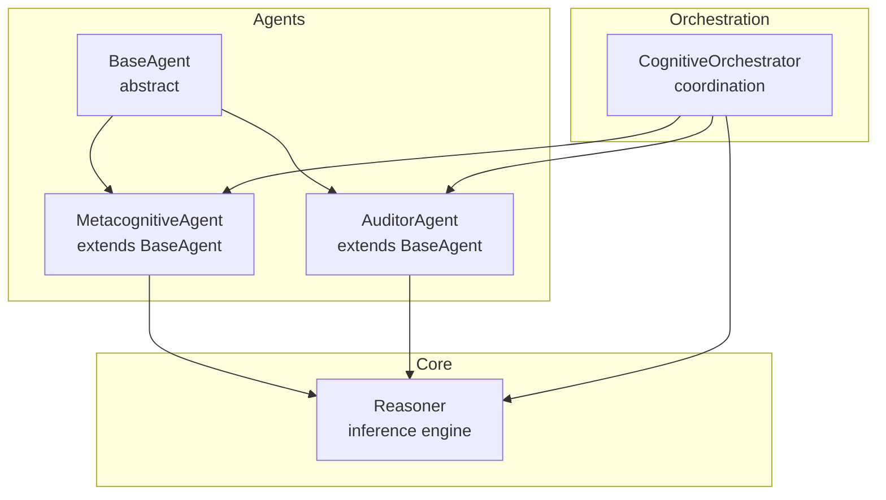
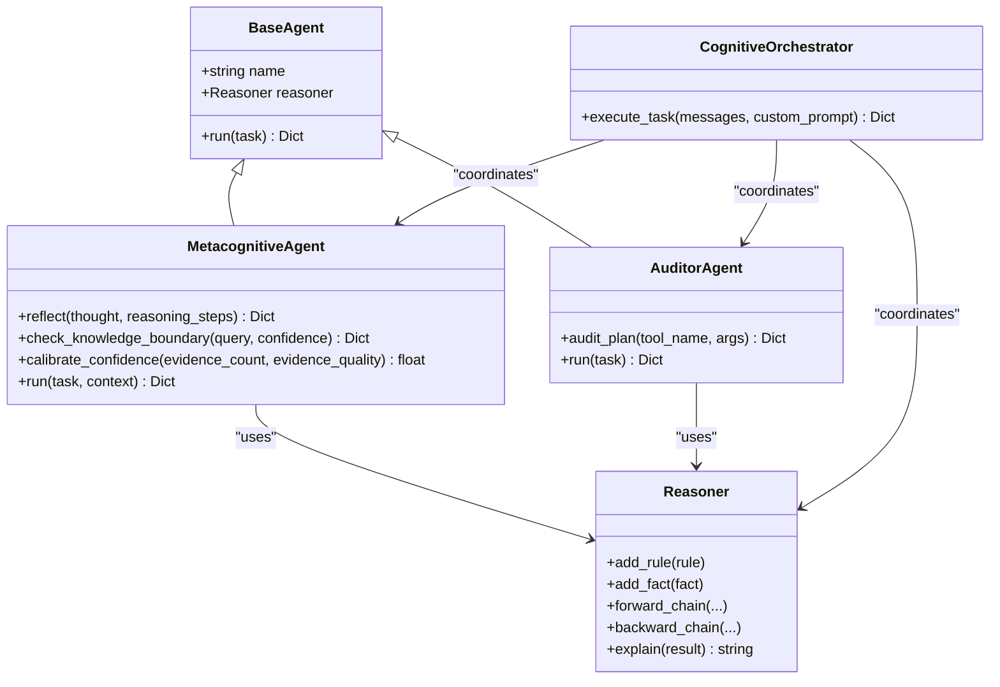
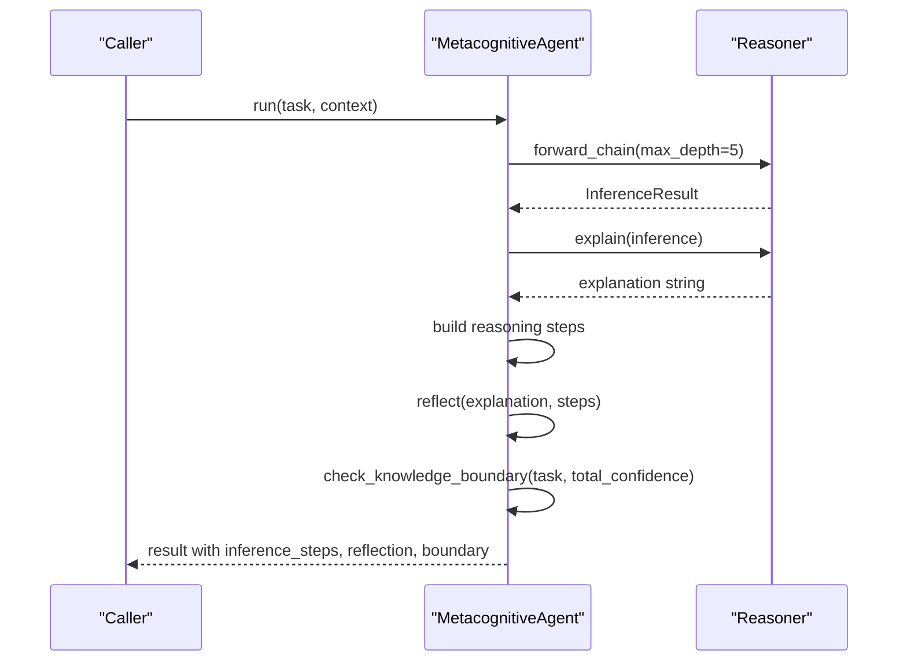
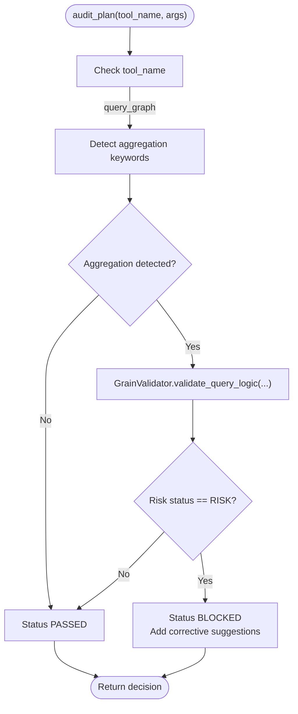
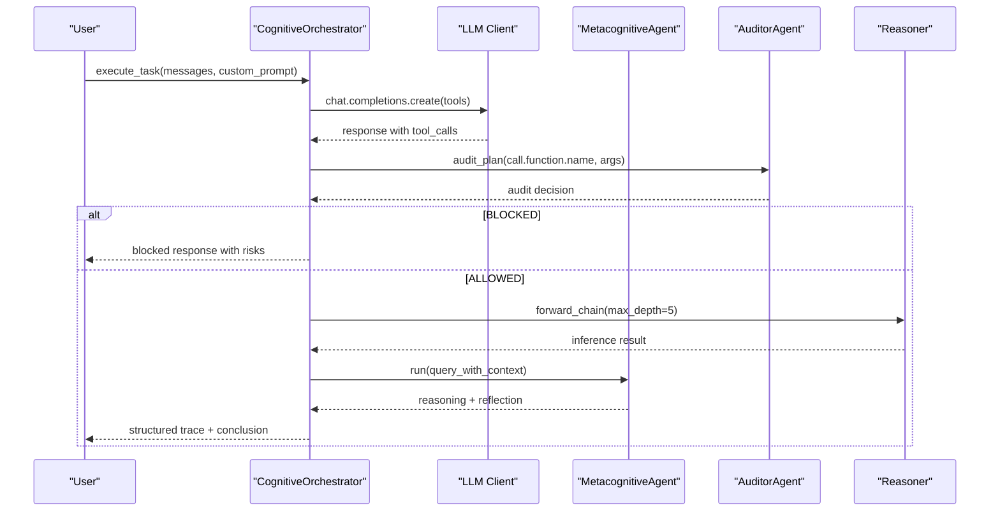
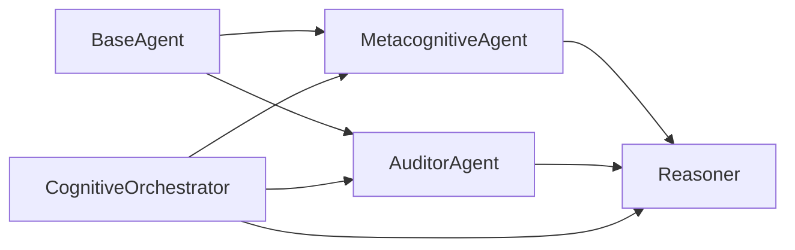

# Agent Architecture and Base Classes

<cite>
**Referenced Files in This Document**
- [base.py](file://src/agents/base.py)
- [metacognition.py](file://src/agents/metacognition.py)
- [auditor.py](file://src/agents/auditor.py)
- [orchestrator.py](file://src/agents/orchestrator.py)
- [reasoner.py](file://src/core/reasoner.py)
- [__init__.py](file://src/agents/__init__.py)
- [AGENT_GUIDE.md](file://docs/AGENT_GUIDE.md)
</cite>

## Table of Contents
1. [Introduction](#introduction)
2. [Project Structure](#project-structure)
3. [Core Components](#core-components)
4. [Architecture Overview](#architecture-overview)
5. [Detailed Component Analysis](#detailed-component-analysis)
6. [Dependency Analysis](#dependency-analysis)
7. [Performance Considerations](#performance-considerations)
8. [Troubleshooting Guide](#troubleshooting-guide)
9. [Conclusion](#conclusion)
10. [Appendices](#appendices)

## Introduction
This document explains the agent architecture foundation of the platform, focusing on the BaseAgent abstract class and its role as the foundation for all agent types. It documents the common interface patterns, abstract method structure, initialization parameters, and the relationship with the Reasoner core. It also covers architectural patterns used in the agent system, inheritance hierarchies, extension points, and guidelines for implementing custom agent types while maintaining consistency with the base architecture. Finally, it outlines the design decisions behind the abstract base class approach and its benefits for extensibility.

## Project Structure
The agent system is organized around a small set of core modules:
- Agents: BaseAgent and specialized agents (MetacognitiveAgent, AuditorAgent)
- Orchestrator: CognitiveOrchestrator coordinates agents and integrates with Reasoner and memory
- Reasoner: Core inference engine providing forward/backward chaining and confidence propagation

**Diagram sources**
- [base.py:8-20](file://src/agents/base.py#L8-L20)
- [metacognition.py:8-16](file://src/agents/metacognition.py#L8-L16)
- [auditor.py:8-23](file://src/agents/auditor.py#L8-L23)
- [orchestrator.py:23-42](file://src/agents/orchestrator.py#L23-L42)
- [reasoner.py:145-180](file://src/core/reasoner.py#L145-L180)

**Section sources**
- [base.py:1-20](file://src/agents/base.py#L1-L20)
- [__init__.py:1-5](file://src/agents/__init__.py#L1-L5)

## Core Components
- BaseAgent: An abstract base class defining the common interface for all agents. It requires a name and a Reasoner instance and exposes an asynchronous run method that subclasses must implement.
- MetacognitiveAgent: Extends BaseAgent to provide self-reflection, confidence calibration, knowledge boundary detection, and reasoning validation.
- AuditorAgent: Extends BaseAgent to provide safety auditing and dynamic admission checks integrated with semantic memory and grain validation.
- CognitiveOrchestrator: Coordinates agents and integrates with Reasoner, memory, extraction, and rule/action engines to implement a ReAct-style tool-calling loop.
- Reasoner: Provides forward/backward chaining, rule registration, confidence propagation, and explanation facilities.

Key characteristics:
- Consistent constructor signature across agents: name and reasoner.
- Uniform asynchronous run(task) interface enabling polymorphic dispatch.
- Shared dependency on Reasoner for inference and confidence computation.

**Section sources**
- [base.py:8-20](file://src/agents/base.py#L8-L20)
- [metacognition.py:8-16](file://src/agents/metacognition.py#L8-L16)
- [auditor.py:8-23](file://src/agents/auditor.py#L8-L23)
- [orchestrator.py:23-42](file://src/agents/orchestrator.py#L23-L42)
- [reasoner.py:145-180](file://src/core/reasoner.py#L145-L180)

## Architecture Overview
The agent architecture follows a neuro-symbolic design:
- Agents depend on Reasoner for logical inference and confidence scoring.
- CognitiveOrchestrator composes agents and other subsystems to form a cohesive cognitive loop.
- Specialized agents encapsulate distinct capabilities (metacognition, auditing) while sharing the same base interface.

**Diagram sources**
- [base.py:8-20](file://src/agents/base.py#L8-L20)
- [metacognition.py:8-16](file://src/agents/metacognition.py#L8-L16)
- [auditor.py:8-23](file://src/agents/auditor.py#L8-L23)
- [reasoner.py:145-180](file://src/core/reasoner.py#L145-L180)
- [orchestrator.py:23-42](file://src/agents/orchestrator.py#L23-L42)

## Detailed Component Analysis

### BaseAgent: Abstract Foundation
- Purpose: Defines a uniform interface for all agents, ensuring consistent initialization and execution semantics.
- Initialization parameters:
  - name: Human-readable identifier for the agent.
  - reasoner: Instance of the Reasoner core used for inference and confidence computation.
- Abstract method:
  - run(task): Asynchronous entry point for agent execution. Must be implemented by subclasses.
- Design rationale:
  - Enforces a minimal, consistent contract across diverse agent types.
  - Centralizes reasoning dependency, simplifying composition and testing.

Implementation highlights:
- Minimal surface area reduces boilerplate and encourages focused specialization.
- Logging and type hints improve observability and developer experience.

**Section sources**
- [base.py:8-20](file://src/agents/base.py#L8-L20)

### MetacognitiveAgent: Self-Assessment and Confidence Calibration
- Responsibilities:
  - Self-reflection: Validates reasoning steps and detects contradictions.
  - Knowledge boundary detection: Determines whether a query is within the agent’s competence.
  - Confidence calibration: Adjusts confidence scores based on evidence count and quality.
  - Execution loop: Integrates forward-chain reasoning, explanation, reflection, and boundary assessment.
- Key methods:
  - reflect(thought, reasoning_steps): Computes validity, confidence, and suggestions.
  - check_knowledge_boundary(query, confidence): Classifies confidence levels and provides recommendations.
  - calibrate_confidence(evidence_count, evidence_quality): Bayesian-inspired calibration with diminishing returns.
  - run(task, context): Orchestrates reasoning, reflection, and boundary checks.
- Relationship with Reasoner:
  - Uses forward_chain to derive conclusions and explain results.
  - Leverages confidence values from inference steps to inform reflection and boundary decisions.

**Diagram sources**
- [metacognition.py:92-133](file://src/agents/metacognition.py#L92-L133)
- [reasoner.py:243-349](file://src/core/reasoner.py#L243-L349)

**Section sources**
- [metacognition.py:8-133](file://src/agents/metacognition.py#L8-L133)
- [reasoner.py:243-349](file://src/core/reasoner.py#L243-L349)

### AuditorAgent: Safety and Dynamic Admission
- Responsibilities:
  - Audit tool plans prior to execution.
  - Detect and mitigate risks (e.g., fan-trap aggregation).
  - Provide corrective feedback and blocking decisions.
- Key methods:
  - audit_plan(tool_name, args): Performs risk assessment and returns decision and risk details.
  - run(task): Monitoring mode for lifecycle oversight.
- Integration points:
  - Uses semantic memory and grain validator to drive dynamic admission checks.
  - Shares the same Reasoner dependency pattern as other agents.

**Diagram sources**
- [auditor.py:24-65](file://src/agents/auditor.py#L24-L65)

**Section sources**
- [auditor.py:8-71](file://src/agents/auditor.py#L8-L71)

### CognitiveOrchestrator: Coordination and Control Flow
- Role: Composes agents and subsystems into a ReAct-style loop with tool-calling and auditing.
- Composition:
  - Reasoner, semantic memory, episodic memory.
  - KnowledgeExtractor, ContradictionChecker, MetacognitiveAgent, AuditorAgent.
  - GlossaryEngine, SkillRegistry, ActionRegistry, RuleEngine, MemoryGovernor.
- Execution loop:
  - Builds system prompt and messages.
  - Calls LLM with tools, captures tool calls, audits, executes, and records traces.
  - Injects graph context via neighbor queries and updates Reasoner and memory.
  - Applies memory governance post-execution.

**Diagram sources**
- [orchestrator.py:128-365](file://src/agents/orchestrator.py#L128-L365)
- [metacognition.py:92-133](file://src/agents/metacognition.py#L92-L133)
- [auditor.py:24-65](file://src/agents/auditor.py#L24-L65)
- [reasoner.py:243-349](file://src/core/reasoner.py#L243-L349)

**Section sources**
- [orchestrator.py:23-365](file://src/agents/orchestrator.py#L23-L365)
- [AGENT_GUIDE.md:1-15](file://docs/AGENT_GUIDE.md#L1-L15)

## Dependency Analysis
- Coupling:
  - Agents depend on Reasoner for inference and confidence computation.
  - CognitiveOrchestrator depends on agents, memory, extractors, and rule/action engines.
- Cohesion:
  - BaseAgent encapsulates shared concerns (identity, reasoning dependency).
  - Specialized agents encapsulate distinct capabilities (metacognition, auditing).
- Extension points:
  - New agents can subclass BaseAgent and implement run.
  - Reasoner can be extended with new rules and inference strategies.
  - Orchestrator can be extended with new tools and gating logic.

**Diagram sources**
- [base.py:8-20](file://src/agents/base.py#L8-L20)
- [metacognition.py:8-16](file://src/agents/metacognition.py#L8-L16)
- [auditor.py:8-23](file://src/agents/auditor.py#L8-L23)
- [orchestrator.py:23-42](file://src/agents/orchestrator.py#L23-L42)
- [reasoner.py:145-180](file://src/core/reasoner.py#L145-L180)

**Section sources**
- [base.py:8-20](file://src/agents/base.py#L8-L20)
- [__init__.py:1-5](file://src/agents/__init__.py#L1-L5)

## Performance Considerations
- Inference timeouts: Reasoner enforces circuit-breaker timeouts during forward/backward chaining to prevent runaway computation.
- Confidence propagation: Uses multiplicative and min-based strategies to compute overall confidence, balancing precision and robustness.
- Tool-call retries: Orchestrator implements exponential backoff for rate-limiting scenarios.
- Memory governance: Post-loop pruning removes low-confidence or stale facts to keep the knowledge graph healthy.

Best practices:
- Tune max_depth and timeout parameters according to domain complexity.
- Prefer targeted queries and graph injections to reduce unnecessary inference.
- Monitor audit decisions to avoid repeated risky operations.

**Section sources**
- [reasoner.py:272-277](file://src/core/reasoner.py#L272-L277)
- [reasoner.py:376-382](file://src/core/reasoner.py#L376-L382)
- [orchestrator.py:168-185](file://src/agents/orchestrator.py#L168-L185)

## Troubleshooting Guide
Common issues and resolutions:
- Missing OPENAI_API_KEY: Orchestrator returns an explicit error indicating the environment variable is not configured.
- Tool-call failures: Orchestrator logs exceptions and appends structured error nodes to the trace.
- Audit blocking: When risks are detected, the orchestrator returns a blocked response with risk details and corrective suggestions.
- Low confidence results: MetacognitiveAgent’s knowledge boundary detection flags queries requiring external verification or expert consultation.

Operational tips:
- Review the trace entries to understand tool usage, latency, and outcomes.
- Inspect reasoning chains to identify weak links in confidence.
- Use the explanation facility to interpret inference results.

**Section sources**
- [orchestrator.py:129-140](file://src/agents/orchestrator.py#L129-L140)
- [orchestrator.py:348-353](file://src/agents/orchestrator.py#L348-L353)
- [metacognition.py:136-172](file://src/agents/metacognition.py#L136-L172)

## Conclusion
The BaseAgent abstract class establishes a consistent, extensible foundation for the agent ecosystem. By centralizing the reasoning dependency and enforcing a uniform asynchronous interface, it enables specialized agents like MetacognitiveAgent and AuditorAgent to coexist and interoperate seamlessly. The Reasoner core provides robust inference and confidence computation, while the CognitiveOrchestrator coordinates agents and subsystems into a cohesive cognitive loop. This architecture balances modularity, testability, and scalability, offering clear extension points for future agent types and capabilities.

## Appendices

### Guidelines for Implementing Custom Agent Types
- Subclass BaseAgent and implement run(task).
- Accept name and reasoner in __init__ and delegate to super().__init__.
- Use Reasoner for inference, confidence computation, and explanations.
- Keep responsibilities focused (e.g., planning, execution, evaluation).
- Integrate with the orchestrator by exposing a run method compatible with orchestration expectations.

**Section sources**
- [base.py:8-20](file://src/agents/base.py#L8-L20)
- [metacognition.py:92-133](file://src/agents/metacognition.py#L92-L133)
- [auditor.py:67-71](file://src/agents/auditor.py#L67-L71)

### Design Decisions Behind the Abstract Base Class Approach
- Consistency: Ensures all agents share a common interface, simplifying orchestration and testing.
- Separation of concerns: Reasoner encapsulates inference; agents encapsulate behavior.
- Extensibility: New agent types can be added without changing orchestration logic.
- Observability: Logging and type hints improve traceability and developer experience.

**Section sources**
- [base.py:8-20](file://src/agents/base.py#L8-L20)
- [__init__.py:1-5](file://src/agents/__init__.py#L1-L5)