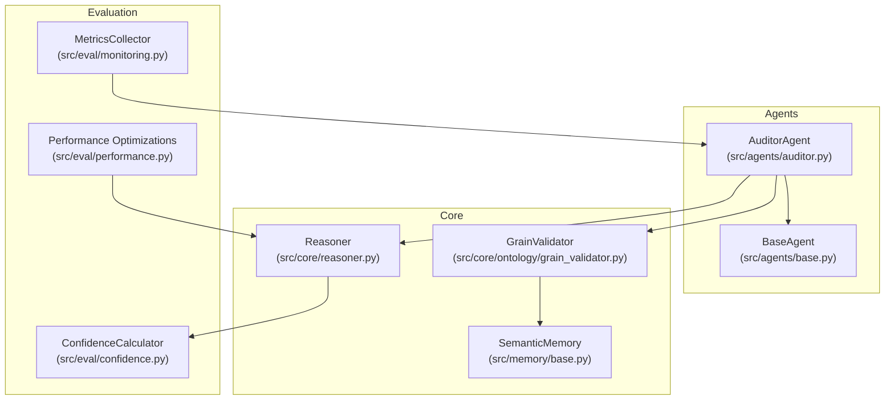
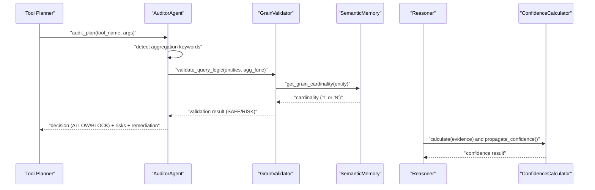
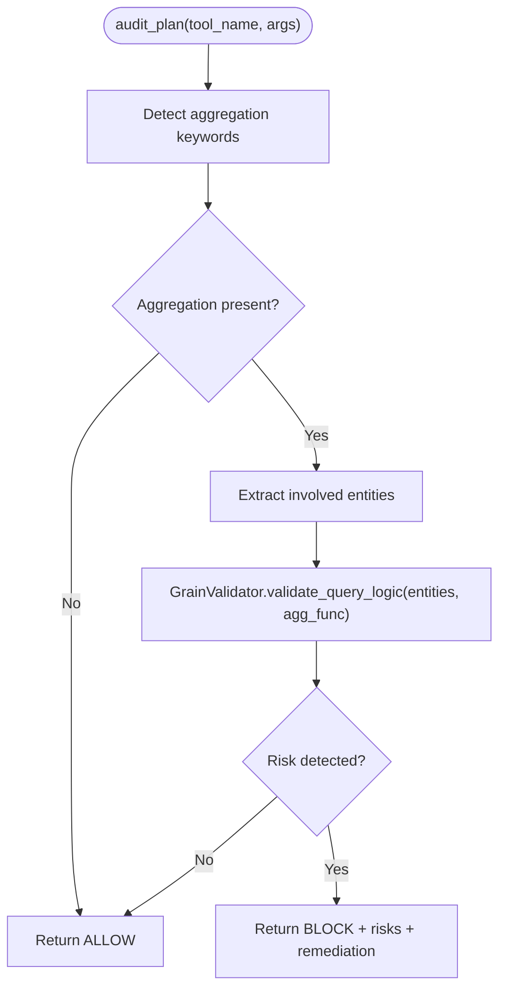
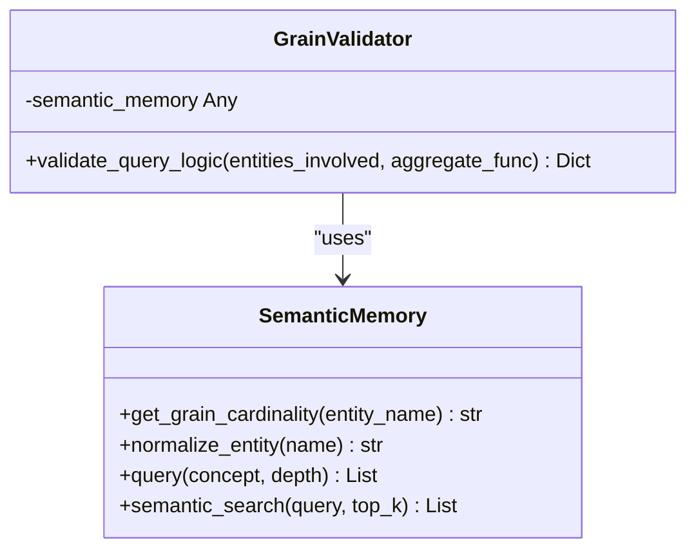
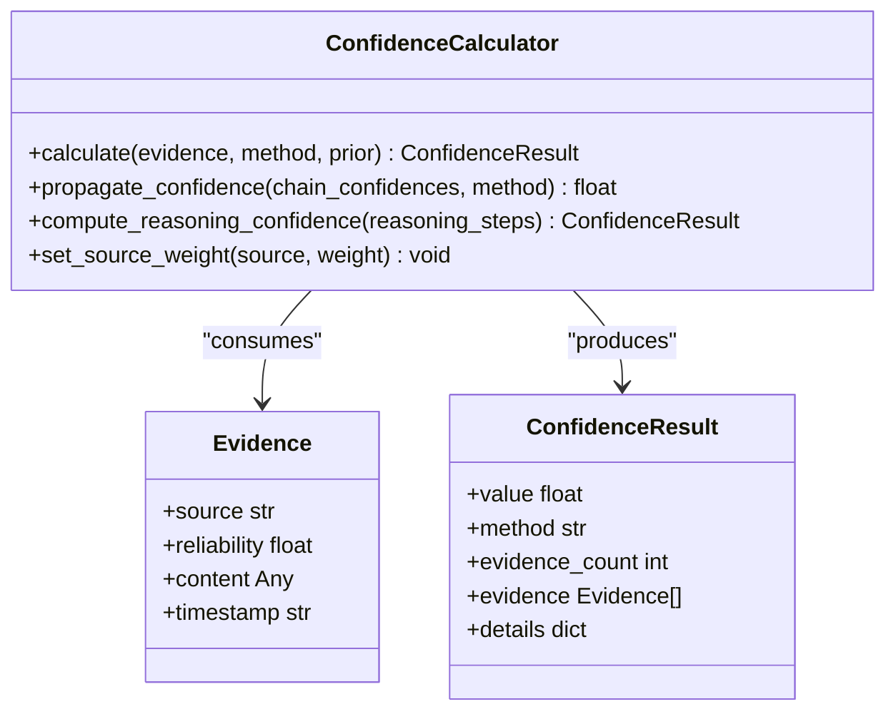
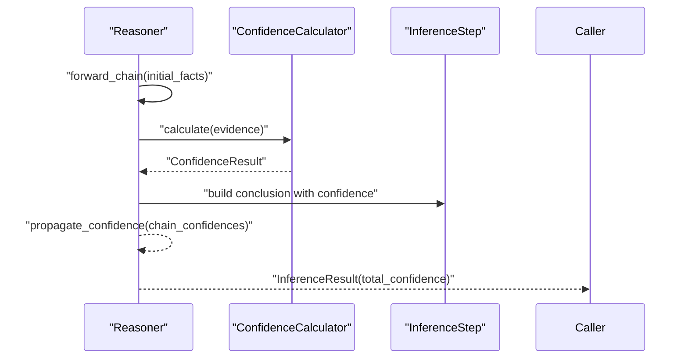
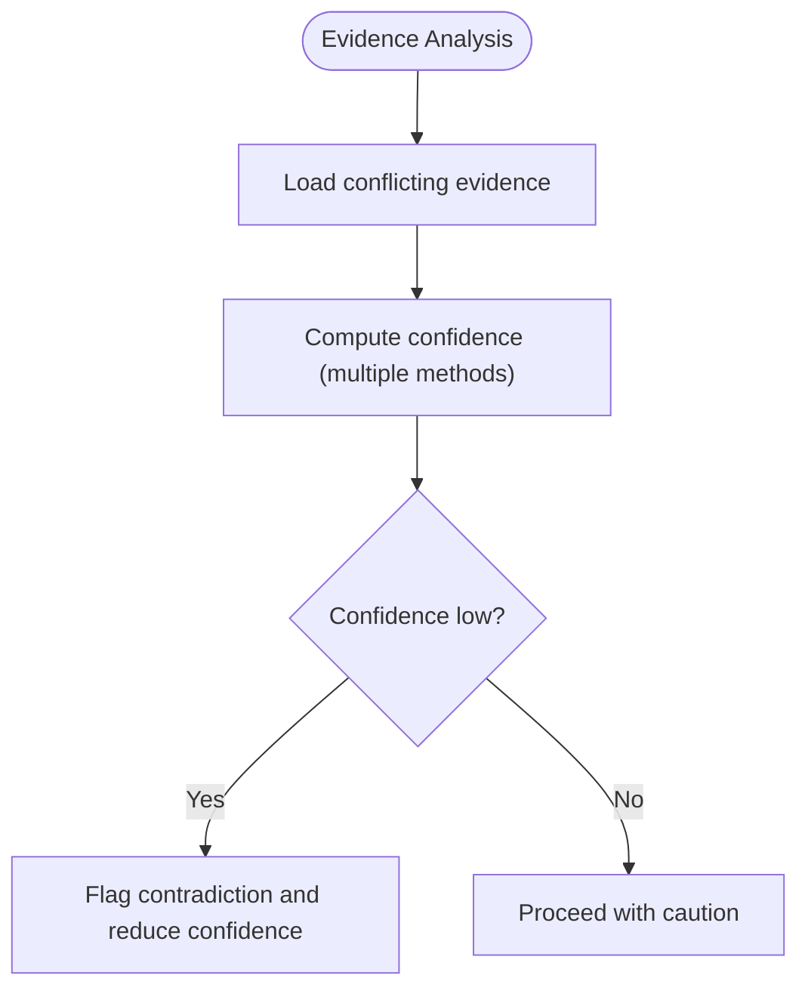
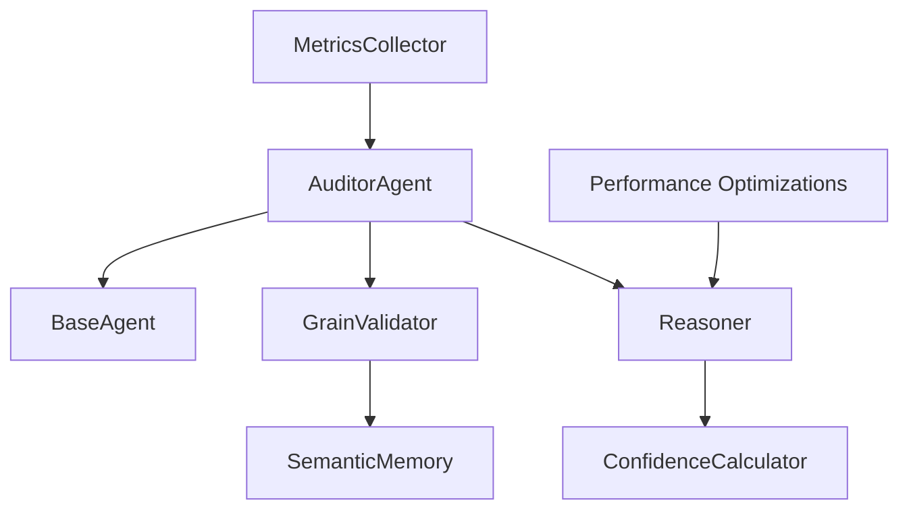

# Auditor Agent

<cite>
**Referenced Files in This Document**
- [auditor.py](file://src/agents/auditor.py)
- [base.py](file://src/agents/base.py)
- [grain_validator.py](file://src/core/ontology/grain_validator.py)
- [reasoner.py](file://src/core/reasoner.py)
- [confidence.py](file://src/eval/confidence.py)
- [monitoring.py](file://src/eval/monitoring.py)
- [performance.py](file://src/eval/performance.py)
- [demo_confidence_reasoning.py](file://examples/demo_confidence_reasoning.py)
- [test_reasoner.py](file://tests/test_reasoner.py)
- [base_memory.py](file://src/memory/base.py)
</cite>

## Table of Contents
1. [Introduction](#introduction)
2. [Project Structure](#project-structure)
3. [Core Components](#core-components)
4. [Architecture Overview](#architecture-overview)
5. [Detailed Component Analysis](#detailed-component-analysis)
6. [Dependency Analysis](#dependency-analysis)
7. [Performance Considerations](#performance-considerations)
8. [Troubleshooting Guide](#troubleshooting-guide)
9. [Conclusion](#conclusion)

## Introduction
The Auditor Agent is a quality assurance and validation component designed to operate independently from the primary reasoning pipeline. Its responsibilities include:
- Logical consistency validation via grain theory to detect and prevent “fan-trap” aggregation pitfalls in 1:N relationships.
- Evidence chain verification grounded in confidence computation to assess the trustworthiness of reasoning outcomes.
- Reasoning quality assessment by evaluating confidence propagation and detecting contradictions across evidence sources.
- Automated quality checks integrated with the confidence system and reasoning engine.
- Reporting mechanisms for violations and remediation recommendations.

The agent’s design emphasizes correctness and safety by intercepting potentially problematic operations before they execute, providing actionable feedback to improve query logic and reasoning quality.

## Project Structure
The Auditor Agent resides within the agents subsystem and collaborates with the core reasoning engine, confidence evaluation module, and semantic memory for graph-backed validations.

**Diagram sources**
- [auditor.py:1-72](file://src/agents/auditor.py#L1-L72)
- [base.py:1-20](file://src/agents/base.py#L1-L20)
- [grain_validator.py:1-61](file://src/core/ontology/grain_validator.py#L1-L61)
- [reasoner.py:1-819](file://src/core/reasoner.py#L1-L819)
- [confidence.py:1-407](file://src/eval/confidence.py#L1-L407)
- [monitoring.py:1-356](file://src/eval/monitoring.py#L1-L356)
- [performance.py:1-538](file://src/eval/performance.py#L1-L538)
- [base_memory.py:1-249](file://src/memory/base.py#L1-L249)

**Section sources**
- [auditor.py:1-72](file://src/agents/auditor.py#L1-L72)
- [base.py:1-20](file://src/agents/base.py#L1-L20)
- [grain_validator.py:1-61](file://src/core/ontology/grain_validator.py#L1-L61)
- [reasoner.py:1-819](file://src/core/reasoner.py#L1-L819)
- [confidence.py:1-407](file://src/eval/confidence.py#L1-L407)
- [monitoring.py:1-356](file://src/eval/monitoring.py#L1-L356)
- [performance.py:1-538](file://src/eval/performance.py#L1-L538)
- [base_memory.py:1-249](file://src/memory/base.py#L1-L249)

## Core Components
- AuditorAgent: Orchestrates auditing of tool plans, performs grain conflict checks, and returns decisions with risk details and remediation suggestions.
- GrainValidator: Validates query logic against graph-backed grain definitions to detect fan-trap risks in aggregations.
- SemanticMemory: Supplies graph-backed grain cardinality and supports entity normalization and retrieval.
- Reasoner: Provides rule-based inference with confidence propagation and integrates the confidence calculator.
- ConfidenceCalculator: Computes confidence from evidence using multiple methods and propagates confidence along reasoning chains.
- Monitoring and Performance: Provide metrics, health checks, and optimization utilities supporting the auditor’s operational visibility.

Key integration points:
- The auditor inspects tool execution plans and triggers grain validation when aggregation is detected.
- Confidence evaluation informs reasoning quality and helps quantify risk severity.
- Metrics and performance utilities support observability and tuning.

**Section sources**
- [auditor.py:8-72](file://src/agents/auditor.py#L8-L72)
- [grain_validator.py:13-61](file://src/core/ontology/grain_validator.py#L13-L61)
- [base_memory.py:9-144](file://src/memory/base.py#L9-L144)
- [reasoner.py:145-819](file://src/core/reasoner.py#L145-L819)
- [confidence.py:32-407](file://src/eval/confidence.py#L32-L407)
- [monitoring.py:20-356](file://src/eval/monitoring.py#L20-L356)
- [performance.py:25-538](file://src/eval/performance.py#L25-L538)

## Architecture Overview
The Auditor Agent operates as a gatekeeper alongside the reasoning engine. It monitors tool plans, validates logical consistency using graph-backed grain theory, and evaluates confidence to guide decisions.

**Diagram sources**
- [auditor.py:24-65](file://src/agents/auditor.py#L24-L65)
- [grain_validator.py:24-55](file://src/core/ontology/grain_validator.py#L24-L55)
- [base_memory.py:122-144](file://src/memory/base.py#L122-L144)
- [reasoner.py:294-349](file://src/core/reasoner.py#L294-L349)
- [confidence.py:63-297](file://src/eval/confidence.py#L63-L297)

## Detailed Component Analysis

### AuditorAgent
Responsibilities:
- Inspect tool execution plans for aggregation intent.
- Trigger grain validation for 1:N relationship chains.
- Return PASS/FAIL decisions with risk details and remediation suggestions.
- Operate in monitoring mode for lifecycle oversight.

Audit flow highlights:
- Aggregation keyword detection (SUM, AVG, COUNT).
- Entity extraction from query context.
- Graph-backed cardinality checks.
- Risk classification and corrective feedback.

**Diagram sources**
- [auditor.py:24-65](file://src/agents/auditor.py#L24-L65)
- [grain_validator.py:24-55](file://src/core/ontology/grain_validator.py#L24-L55)

**Section sources**
- [auditor.py:8-72](file://src/agents/auditor.py#L8-L72)

### GrainValidator and SemanticMemory
GrainValidator enforces logical consistency by consulting SemanticMemory for entity cardinality:
- Dynamic lookup of grain cardinality per entity.
- Risk detection when aggregating across N-end entities in 1:N chains.
- Remediation guidance to avoid fan-trap pitfalls.

SemanticMemory provides:
- Graph-backed cardinality queries with entity normalization.
- Fallback rules for open-source usability.
- Integration with vector and graph stores for hybrid retrieval.

**Diagram sources**
- [grain_validator.py:13-61](file://src/core/ontology/grain_validator.py#L13-L61)
- [base_memory.py:9-144](file://src/memory/base.py#L9-L144)

**Section sources**
- [grain_validator.py:13-61](file://src/core/ontology/grain_validator.py#L13-L61)
- [base_memory.py:122-144](file://src/memory/base.py#L122-L144)

### Confidence System Integration
The confidence system underpins reasoning quality assessment:
- Evidence-based calculation using multiple methods (weighted, Bayesian, multiplicative, Dempster–Shafer).
- Propagation along reasoning chains using conservative strategies (min) and others (arithmetic, geometric, multiplicative).
- Computation of overall confidence for inference steps and entire chains.

**Diagram sources**
- [confidence.py:32-407](file://src/eval/confidence.py#L32-L407)

**Section sources**
- [confidence.py:32-407](file://src/eval/confidence.py#L32-L407)
- [reasoner.py:294-349](file://src/core/reasoner.py#L294-L349)

### Reasoner and Quality Reporting
The Reasoner integrates confidence computation into inference:
- Forward and backward chaining with confidence propagation.
- Evidence assembly for each inference step.
- Overall confidence reporting for reasoning results.

**Diagram sources**
- [reasoner.py:243-349](file://src/core/reasoner.py#L243-L349)
- [confidence.py:222-297](file://src/eval/confidence.py#L222-L297)

**Section sources**
- [reasoner.py:145-819](file://src/core/reasoner.py#L145-L819)
- [confidence.py:222-297](file://src/eval/confidence.py#L222-L297)

### Example: Evidence Analysis and Contradiction Detection
The confidence demo illustrates how contradictory evidence lowers overall confidence, enabling the system to flag potential reasoning issues.

**Diagram sources**
- [demo_confidence_reasoning.py:57-89](file://examples/demo_confidence_reasoning.py#L57-L89)
- [confidence.py:100-221](file://src/eval/confidence.py#L100-L221)

**Section sources**
- [demo_confidence_reasoning.py:57-89](file://examples/demo_confidence_reasoning.py#L57-L89)
- [confidence.py:100-221](file://src/eval/confidence.py#L100-L221)

## Dependency Analysis
The Auditor Agent’s dependencies and interactions are summarized below.

**Diagram sources**
- [auditor.py:1-72](file://src/agents/auditor.py#L1-L72)
- [base.py:1-20](file://src/agents/base.py#L1-L20)
- [grain_validator.py:1-61](file://src/core/ontology/grain_validator.py#L1-L61)
- [base_memory.py:1-249](file://src/memory/base.py#L1-L249)
- [reasoner.py:1-819](file://src/core/reasoner.py#L1-L819)
- [confidence.py:1-407](file://src/eval/confidence.py#L1-L407)
- [monitoring.py:1-356](file://src/eval/monitoring.py#L1-L356)
- [performance.py:1-538](file://src/eval/performance.py#L1-L538)

**Section sources**
- [auditor.py:1-72](file://src/agents/auditor.py#L1-L72)
- [grain_validator.py:1-61](file://src/core/ontology/grain_validator.py#L1-L61)
- [base_memory.py:1-249](file://src/memory/base.py#L1-L249)
- [reasoner.py:1-819](file://src/core/reasoner.py#L1-L819)
- [confidence.py:1-407](file://src/eval/confidence.py#L1-L407)
- [monitoring.py:1-356](file://src/eval/monitoring.py#L1-L356)
- [performance.py:1-538](file://src/eval/performance.py#L1-L538)

## Performance Considerations
- Use caching and connection pooling to minimize latency for graph queries and inference operations.
- Apply LRU caching for repeated validation results and inference caches.
- Employ asynchronous execution and batching for throughput improvements.
- Track request durations and inference times to identify bottlenecks.

Practical tips:
- Enable query optimization and avoid expensive operations like wildcard selects.
- Limit result sizes and use pagination to control resource usage.
- Monitor cache hit rates and adjust TTL and capacity accordingly.

**Section sources**
- [performance.py:25-538](file://src/eval/performance.py#L25-L538)
- [monitoring.py:20-356](file://src/eval/monitoring.py#L20-L356)

## Troubleshooting Guide
Common issues and resolutions:
- Audit blocking due to fan-trap risk:
  - Cause: Aggregation over N-end entities in 1:N chains.
  - Resolution: Refactor query to pre-aggregate or apply DISTINCT; adjust JOIN logic.
- Low confidence in reasoning:
  - Cause: Few or contradictory evidence sources.
  - Resolution: Gather more reliable evidence; resolve conflicts; recalibrate source weights.
- Performance regressions:
  - Cause: Missing caches or unoptimized queries.
  - Resolution: Enable caching; apply query optimizer suggestions; monitor metrics.

Operational checks:
- Verify metrics endpoints and health checks for system status.
- Review inference snapshots and request logs for anomalies.
- Confirm that the semantic memory is reachable and normalized entity lookups succeed.

**Section sources**
- [auditor.py:24-65](file://src/agents/auditor.py#L24-L65)
- [grain_validator.py:24-55](file://src/core/ontology/grain_validator.py#L24-L55)
- [monitoring.py:180-356](file://src/eval/monitoring.py#L180-L356)
- [performance.py:25-538](file://src/eval/performance.py#L25-L538)

## Conclusion
The Auditor Agent ensures logical consistency and reasoning quality by integrating grain theory validation, confidence computation, and robust reporting. By operating independently of the primary reasoning pipeline, it provides proactive safeguards against fan-trap pitfalls and contradictory evidence, while offering actionable remediation guidance. Through metrics and performance optimizations, it supports continuous improvement and operational reliability.