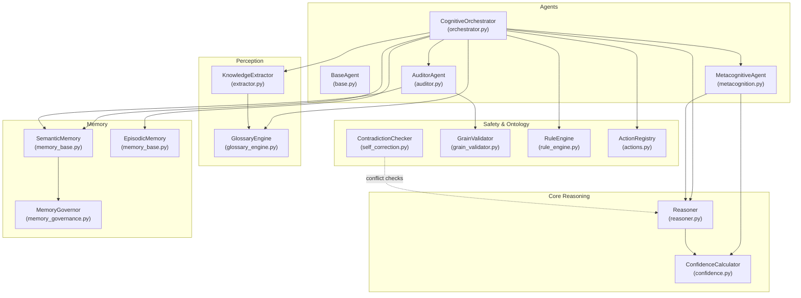
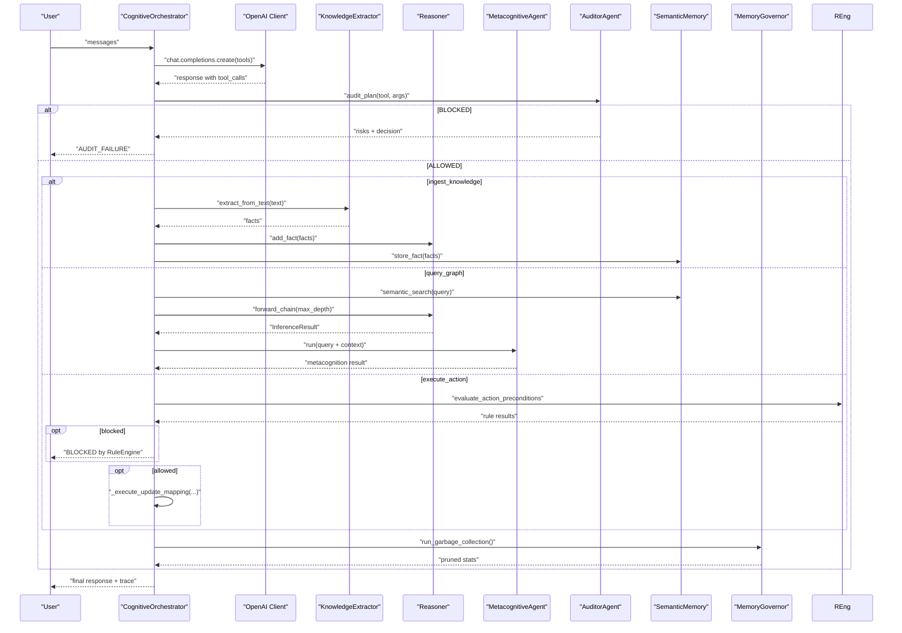
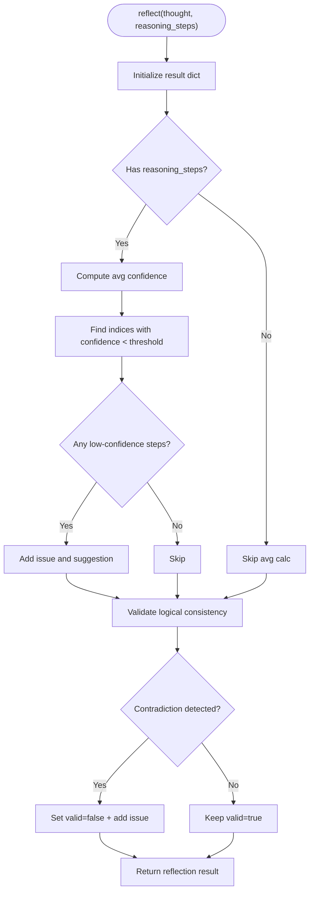
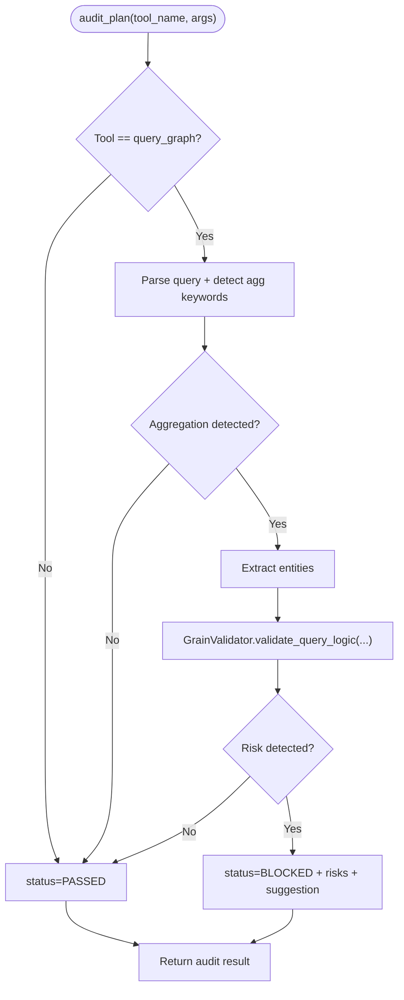
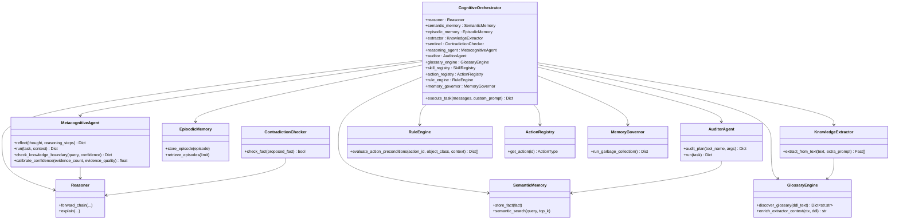
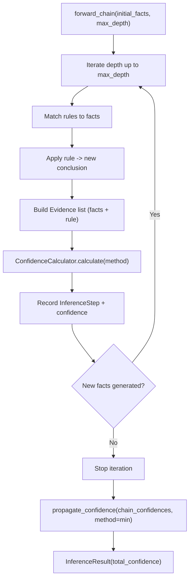
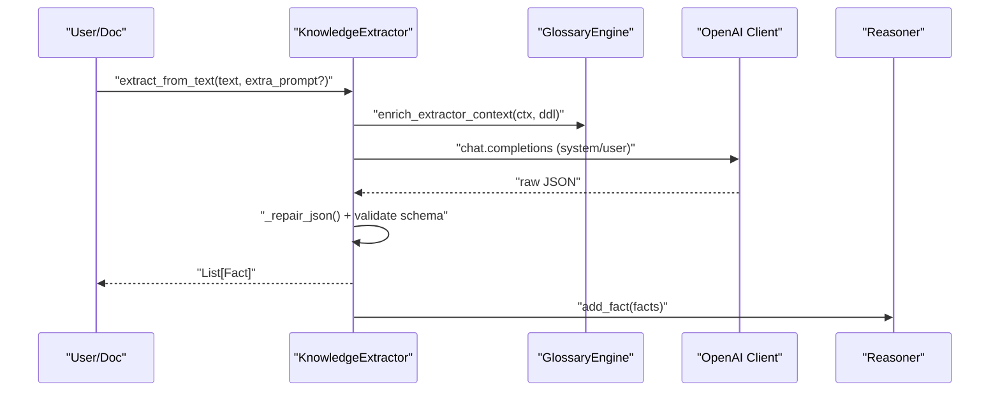
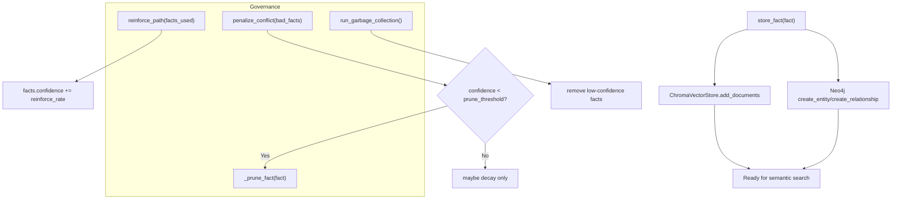
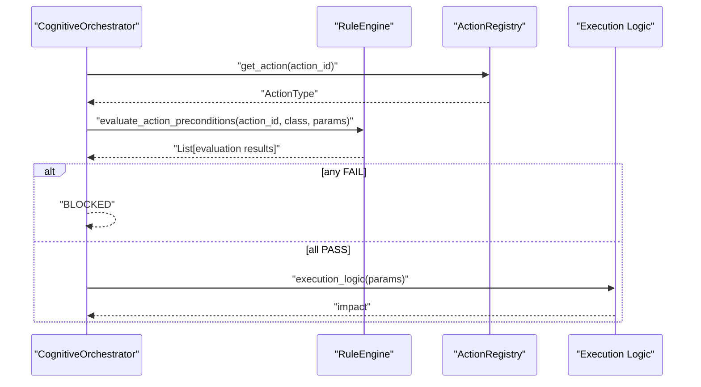
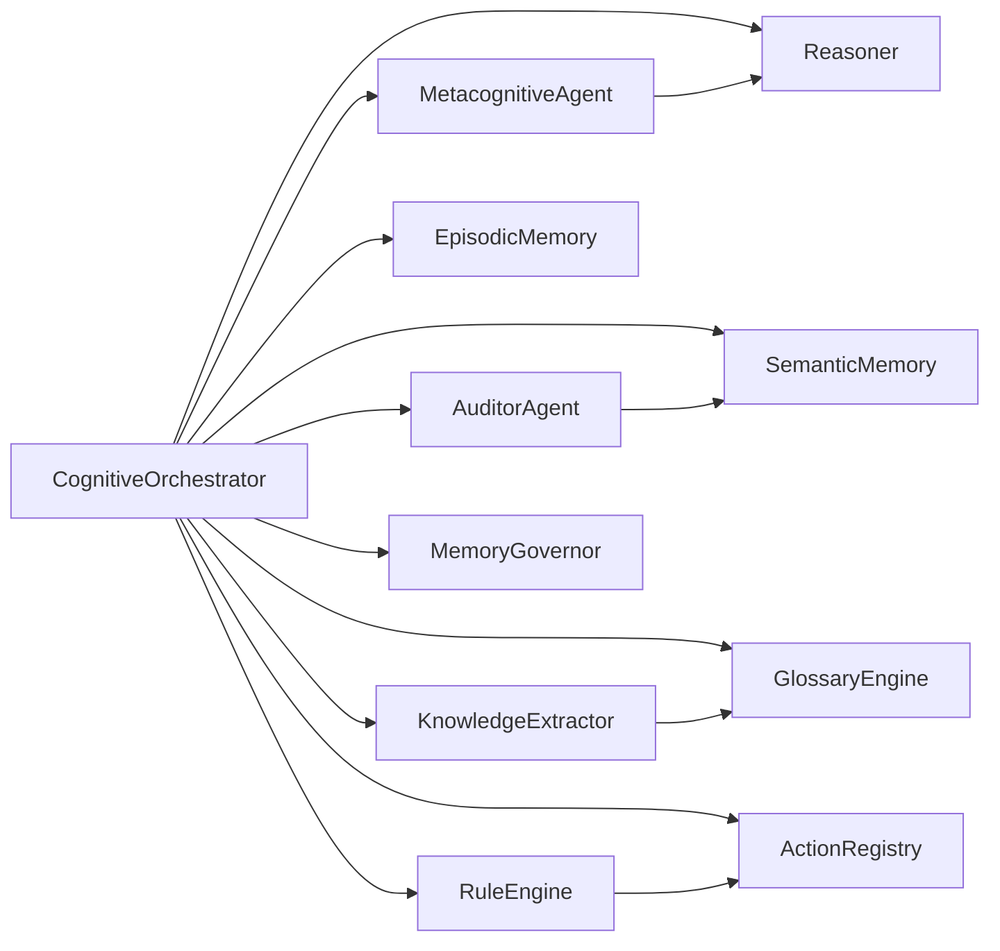

# Metacognitive Agents

<cite>
**Referenced Files in This Document**
- [metacognition.py](file://src/agents/metacognition.py)
- [orchestrator.py](file://src/agents/orchestrator.py)
- [base.py](file://src/agents/base.py)
- [auditor.py](file://src/agents/auditor.py)
- [confidence.py](file://src/eval/confidence.py)
- [reasoner.py](file://src/core/reasoner.py)
- [self_correction.py](file://src/evolution/self_correction.py)
- [glossary_engine.py](file://src/perception/glossary_engine.py)
- [memory_base.py](file://src/memory/base.py)
- [memory_governance.py](file://src/memory/governance.py)
- [rule_engine.py](file://src/core/ontology/rule_engine.py)
- [grain_validator.py](file://src/core/ontology/grain_validator.py)
- [actions.py](file://src/core/ontology/actions.py)
- [extractor.py](file://src/perception/extractor.py)
- [AGENT_GUIDE.md](file://docs/AGENT_GUIDE.md)
- [test_metacognition.py](file://tests/test_metacognition.py)
</cite>

## Table of Contents
1. [Introduction](#introduction)
2. [Project Structure](#project-structure)
3. [Core Components](#core-components)
4. [Architecture Overview](#architecture-overview)
5. [Detailed Component Analysis](#detailed-component-analysis)
6. [Dependency Analysis](#dependency-analysis)
7. [Performance Considerations](#performance-considerations)
8. [Troubleshooting Guide](#troubleshooting-guide)
9. [Conclusion](#conclusion)
10. [Appendices](#appendices)

## Introduction
This document explains the metacognitive agents system: how agents reflect on their reasoning, calibrate confidence, detect knowledge boundaries, and coordinate with the orchestrator for auditing and decision tracing. It documents the roles of specialized agents (Metacognitive Agent, Auditor Agent, Orchestrator), the integration with the reasoning engine and memory systems, and practical guidance for designing custom behaviors and extending the framework.

## Project Structure
The metacognitive system spans several modules:
- Agents: Base agent abstraction, Metacognitive Agent, Auditor Agent, and the Cognitive Orchestrator
- Reasoning and Evaluation: Reasoner, Confidence Calculator, and related evaluation utilities
- Perception and Extraction: KnowledgeExtractor and GlossaryEngine
- Memory: SemanticMemory, EpisodicMemory, and MemoryGovernor
- Ontology and Safety: RuleEngine, GrainValidator, and ActionRegistry
- Tests and Guides: Unit tests and operational guidance

**Diagram sources**
- [orchestrator.py:23-42](file://src/agents/orchestrator.py#L23-L42)
- [metacognition.py:8-133](file://src/agents/metacognition.py#L8-L133)
- [auditor.py:8-65](file://src/agents/auditor.py#L8-L65)
- [reasoner.py:145-180](file://src/core/reasoner.py#L145-L180)
- [confidence.py:32-98](file://src/eval/confidence.py#L32-L98)
- [extractor.py:83-103](file://src/perception/extractor.py#L83-L103)
- [glossary_engine.py:9-30](file://src/perception/glossary_engine.py#L9-L30)
- [memory_base.py:9-28](file://src/memory/base.py#L9-L28)
- [memory_governance.py:6-19](file://src/memory/governance.py#L6-L19)
- [self_correction.py:7-17](file://src/evolution/self_correction.py#L7-L17)
- [grain_validator.py:13-23](file://src/core/ontology/grain_validator.py#L13-L23)
- [rule_engine.py:124-139](file://src/core/ontology/rule_engine.py#L124-L139)
- [actions.py:24-28](file://src/core/ontology/actions.py#L24-L28)

**Section sources**
- [orchestrator.py:23-42](file://src/agents/orchestrator.py#L23-L42)
- [AGENT_GUIDE.md:1-15](file://docs/AGENT_GUIDE.md#L1-L15)

## Core Components
- BaseAgent: Abstraction for agent behavior with a Reasoner dependency.
- MetacognitiveAgent: Self-reflection, confidence calibration, knowledge boundary detection, and integrated reasoning pipeline.
- AuditorAgent: Independent safety monitor performing grain conflict audits and providing corrective feedback.
- CognitiveOrchestrator: Central coordinator implementing a ReAct-style tool-calling loop with auditing, decision tracing, and memory governance.
- Reasoner: Forward/backward chain inference with confidence propagation and explanation generation.
- ConfidenceCalculator: Multi-method confidence computation, propagation across reasoning steps, and calibration helpers.
- KnowledgeExtractor: Structured extraction from unstructured text with chunking and JSON repair.
- GlossaryEngine: Dynamic physical-to-business term mapping injection into extraction prompts.
- SemanticMemory and EpisodicMemory: Persistent storage and retrieval for facts and agent experiences.
- MemoryGovernor: Synaptic pruning and confidence decay to maintain a healthy knowledge graph.
- RuleEngine and GrainValidator: Deterministic math sandbox and grain theory validation to prevent fan-trap and logical conflicts.
- ActionRegistry: Declarative action types bound to rules and execution logic.

**Section sources**
- [base.py:8-19](file://src/agents/base.py#L8-L19)
- [metacognition.py:8-133](file://src/agents/metacognition.py#L8-L133)
- [auditor.py:8-65](file://src/agents/auditor.py#L8-L65)
- [orchestrator.py:23-42](file://src/agents/orchestrator.py#L23-L42)
- [reasoner.py:145-180](file://src/core/reasoner.py#L145-L180)
- [confidence.py:32-98](file://src/eval/confidence.py#L32-L98)
- [extractor.py:83-103](file://src/perception/extractor.py#L83-L103)
- [glossary_engine.py:9-30](file://src/perception/glossary_engine.py#L9-L30)
- [memory_base.py:9-28](file://src/memory/base.py#L9-L28)
- [memory_governance.py:6-19](file://src/memory/governance.py#L6-L19)
- [self_correction.py:7-17](file://src/evolution/self_correction.py#L7-L17)
- [grain_validator.py:13-23](file://src/core/ontology/grain_validator.py#L13-L23)
- [rule_engine.py:124-139](file://src/core/ontology/rule_engine.py#L124-L139)
- [actions.py:24-28](file://src/core/ontology/actions.py#L24-L28)

## Architecture Overview
The orchestrator coordinates agent behaviors and tool interactions, integrating reasoning, extraction, auditing, and memory governance. The Metacognitive Agent performs self-assessment and boundary checks, while the Auditor Agent enforces grain theory and dynamic safety gates. The system maintains quality via confidence propagation and pruning.

**Diagram sources**
- [orchestrator.py:128-365](file://src/agents/orchestrator.py#L128-L365)
- [auditor.py:24-65](file://src/agents/auditor.py#L24-L65)
- [metacognition.py:92-133](file://src/agents/metacognition.py#L92-L133)
- [reasoner.py:243-349](file://src/core/reasoner.py#L243-L349)
- [memory_governance.py:47-62](file://src/memory/governance.py#L47-L62)

## Detailed Component Analysis

### MetacognitiveAgent
Implements self-reflection, confidence calibration, and knowledge boundary detection. It:
- Reflects on thoughts and reasoning steps, computing average confidence and flagging low-confidence steps
- Detects potential contradictions via pattern matching
- Runs forward-chain reasoning, builds structured steps, and returns a comprehensive report including confidence, reflection, and boundary assessment
- Provides a Bayesian-inspired calibration function to combine evidence count and quality

**Diagram sources**
- [metacognition.py:23-70](file://src/agents/metacognition.py#L23-L70)

**Section sources**
- [metacognition.py:23-70](file://src/agents/metacognition.py#L23-L70)
- [metacognition.py:92-133](file://src/agents/metacognition.py#L92-L133)
- [metacognition.py:136-172](file://src/agents/metacognition.py#L136-L172)
- [metacognition.py:175-204](file://src/agents/metacognition.py#L175-L204)

### AuditorAgent
Independent safety agent that:
- Audits tool plans, especially query_graph for aggregation risks
- Validates grain theory to prevent fan-trap pitfalls
- Returns PASS/FAIL decisions with risk details and corrective suggestions

**Diagram sources**
- [auditor.py:24-65](file://src/agents/auditor.py#L24-L65)
- [grain_validator.py:24-55](file://src/core/ontology/grain_validator.py#L24-L55)

**Section sources**
- [auditor.py:24-65](file://src/agents/auditor.py#L24-L65)
- [grain_validator.py:24-55](file://src/core/ontology/grain_validator.py#L24-L55)

### CognitiveOrchestrator
Central nervous system that:
- Initializes Reasoner, SemanticMemory, EpisodicMemory, KnowledgeExtractor, ContradictionChecker, MetacognitiveAgent, AuditorAgent, GlossaryEngine, SkillRegistry, ActionRegistry, RuleEngine, and MemoryGovernor
- Executes ReAct loops with tool-calling, auditing, and decision tracing
- Integrates extraction, reasoning, metacognition, and action execution
- Applies memory governance post-loop

**Diagram sources**
- [orchestrator.py:23-42](file://src/agents/orchestrator.py#L23-L42)
- [metacognition.py:8-133](file://src/agents/metacognition.py#L8-L133)
- [auditor.py:8-65](file://src/agents/auditor.py#L8-L65)
- [reasoner.py:145-180](file://src/core/reasoner.py#L145-L180)
- [memory_base.py:9-28](file://src/memory/base.py#L9-L28)
- [memory_governance.py:6-19](file://src/memory/governance.py#L6-L19)
- [extractor.py:83-103](file://src/perception/extractor.py#L83-L103)
- [glossary_engine.py:9-30](file://src/perception/glossary_engine.py#L9-L30)
- [self_correction.py:7-17](file://src/evolution/self_correction.py#L7-L17)
- [rule_engine.py:124-139](file://src/core/ontology/rule_engine.py#L124-L139)
- [actions.py:24-28](file://src/core/ontology/actions.py#L24-L28)

**Section sources**
- [orchestrator.py:128-365](file://src/agents/orchestrator.py#L128-L365)

### Reasoner and Confidence Propagation
The Reasoner supports forward/backward chaining, computes per-step confidence using Evidence, and propagates confidence across reasoning chains. ConfidenceCalculator offers multiple methods (weighted, bayesian, multiplicative, Dempster-Shafer) and reasoning chain propagation.

**Diagram sources**
- [reasoner.py:243-349](file://src/core/reasoner.py#L243-L349)
- [confidence.py:222-297](file://src/eval/confidence.py#L222-L297)

**Section sources**
- [reasoner.py:243-349](file://src/core/reasoner.py#L243-L349)
- [confidence.py:32-98](file://src/eval/confidence.py#L32-L98)
- [confidence.py:222-297](file://src/eval/confidence.py#L222-L297)

### Knowledge Extraction and Glossary Mapping
KnowledgeExtractor chunks long texts, constrains LLM outputs with Pydantic schemas, repairs truncated JSON, and converts to core Fact objects. GlossaryEngine discovers physical-to-business mappings and injects them into extraction prompts.

**Diagram sources**
- [extractor.py:278-349](file://src/perception/extractor.py#L278-L349)
- [glossary_engine.py:57-70](file://src/perception/glossary_engine.py#L57-L70)

**Section sources**
- [extractor.py:83-103](file://src/perception/extractor.py#L83-L103)
- [extractor.py:278-349](file://src/perception/extractor.py#L278-L349)
- [glossary_engine.py:30-70](file://src/perception/glossary_engine.py#L30-L70)

### Memory Systems and Governance
SemanticMemory persists facts to both vector store and graph database, with entity normalization and grain cardinality hints. EpisodicMemory records agent episodes for trajectory analysis and future RLHF. MemoryGovernor applies confidence-based pruning and reinforcement.

**Diagram sources**
- [memory_base.py:91-144](file://src/memory/base.py#L91-L144)
- [memory_governance.py:20-62](file://src/memory/governance.py#L20-L62)

**Section sources**
- [memory_base.py:9-28](file://src/memory/base.py#L9-L28)
- [memory_base.py:91-144](file://src/memory/base.py#L91-L144)
- [memory_governance.py:20-62](file://src/memory/governance.py#L20-L62)

### Safety Gates and Action Execution
RuleEngine provides a safe math sandbox to evaluate business rules against action parameters. GrainValidator prevents fan-trap by validating cardinality along query paths. ActionRegistry binds actions to rules and execution logic.

**Diagram sources**
- [orchestrator.py:301-343](file://src/agents/orchestrator.py#L301-L343)
- [rule_engine.py:320-330](file://src/core/ontology/rule_engine.py#L320-L330)
- [actions.py:58-69](file://src/core/ontology/actions.py#L58-L69)

**Section sources**
- [rule_engine.py:124-139](file://src/core/ontology/rule_engine.py#L124-L139)
- [rule_engine.py:320-330](file://src/core/ontology/rule_engine.py#L320-L330)
- [grain_validator.py:24-55](file://src/core/ontology/grain_validator.py#L24-L55)
- [actions.py:58-69](file://src/core/ontology/actions.py#L58-L69)

## Dependency Analysis
- Coupling: Orchestrator composes multiple subsystems; agents depend on Reasoner and memory; extraction depends on GlossaryEngine; safety depends on SemanticMemory and RuleEngine.
- Cohesion: Each module encapsulates a focused responsibility (reasoning, extraction, auditing, memory, governance).
- External dependencies: OpenAI client, Neo4j, ChromaDB, SQLite; all wrapped behind adapters for resilience.

**Diagram sources**
- [orchestrator.py:23-42](file://src/agents/orchestrator.py#L23-L42)

**Section sources**
- [orchestrator.py:23-42](file://src/agents/orchestrator.py#L23-L42)

## Performance Considerations
- Inference timeouts: Reasoner enforces circuit-breaker limits for forward/backward chains to avoid long runs.
- Confidence propagation: Using conservative min propagation reduces optimistic drift across steps.
- Chunking and JSON repair: Extraction mitigates LLM truncation and improves throughput on long documents.
- Memory governance: Periodic pruning keeps the knowledge graph lean and responsive.
- Tool retries with exponential backoff: Orchestrator handles rate limits gracefully.

[No sources needed since this section provides general guidance]

## Troubleshooting Guide
Common issues and debugging techniques:
- OpenAI API key not configured: Orchestrator returns an explicit error instructing to set the key.
- 429 Too Many Requests: Orchestrator retries with exponential backoff; inspect logs for wait times.
- Audit interception: When AuditorAgent blocks a plan, review risk details and suggested corrections.
- RuleEngine block: Review failing rule evaluations and adjust parameters accordingly.
- Contradiction detection: Use the MetacognitiveAgent’s reflection to identify low-confidence steps and contradictions.
- Memory pruning: If facts disappear unexpectedly, check MemoryGovernor metrics and confidence thresholds.

**Section sources**
- [orchestrator.py:128-140](file://src/agents/orchestrator.py#L128-L140)
- [orchestrator.py:170-185](file://src/agents/orchestrator.py#L170-L185)
- [auditor.py:24-65](file://src/agents/auditor.py#L24-L65)
- [rule_engine.py:320-330](file://src/core/ontology/rule_engine.py#L320-L330)
- [metacognition.py:23-70](file://src/agents/metacognition.py#L23-L70)
- [memory_governance.py:47-62](file://src/memory/governance.py#L47-L62)

## Conclusion
The metacognitive agents system integrates self-reflection, confidence calibration, and knowledge boundary detection with robust auditing and decision tracing. The orchestrator acts as the cognitive central nervous system, coordinating reasoning, extraction, safety gates, and memory governance. Together, these components enable reliable, explainable, and self-evolving agent behavior grounded in a neuro-symbolic architecture.

[No sources needed since this section summarizes without analyzing specific files]

## Appendices

### Example Behavior Patterns
- Self-assessment: MetacognitiveAgent reflects on reasoning steps, flags low-confidence segments, and detects contradictions.
- Knowledge boundary: Based on confidence thresholds, the agent recommends verification or expert consultation when approaching unknowns.
- Decision tracing: Orchestrator appends structured traces for each tool call, including latency and results, enabling full auditability.

**Section sources**
- [metacognition.py:23-70](file://src/agents/metacognition.py#L23-L70)
- [metacognition.py:136-172](file://src/agents/metacognition.py#L136-L172)
- [orchestrator.py:190-240](file://src/agents/orchestrator.py#L190-L240)

### Designing Custom Agent Behaviors
Guidelines:
- Extend BaseAgent to define a new agent with a run method and integrate it into the orchestrator.
- Use Reasoner for inference and ConfidenceCalculator for quality assessment.
- Incorporate reflection and boundary checks similar to MetacognitiveAgent.
- Add safety checks via AuditorAgent or RuleEngine gating.
- Persist experiences in EpisodicMemory for trajectory analysis and RLHF.

**Section sources**
- [base.py:8-19](file://src/agents/base.py#L8-L19)
- [reasoner.py:145-180](file://src/core/reasoner.py#L145-L180)
- [confidence.py:32-98](file://src/eval/confidence.py#L32-L98)
- [orchestrator.py:23-42](file://src/agents/orchestrator.py#L23-L42)
- [memory_base.py:150-249](file://src/memory/base.py#L150-L249)

### Testing Metacognitive Capabilities
Unit tests validate:
- Reflection correctness and issue detection
- Knowledge boundary classification across confidence levels
- Confidence calibration behavior with varying evidence counts and qualities

**Section sources**
- [test_metacognition.py:21-142](file://tests/test_metacognition.py#L21-L142)