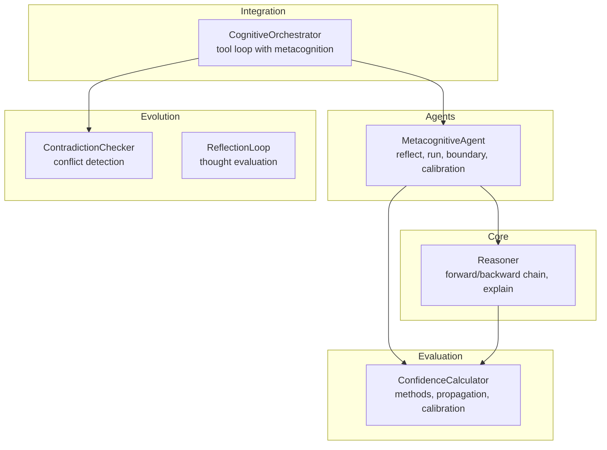
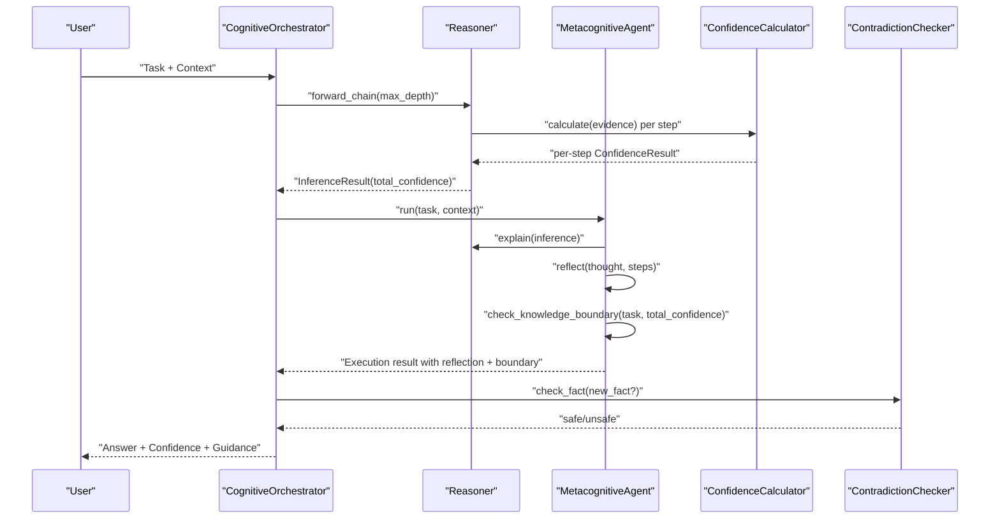
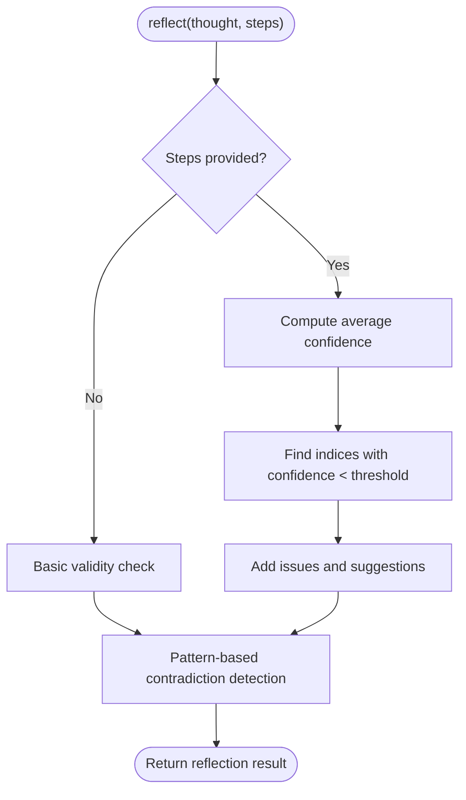
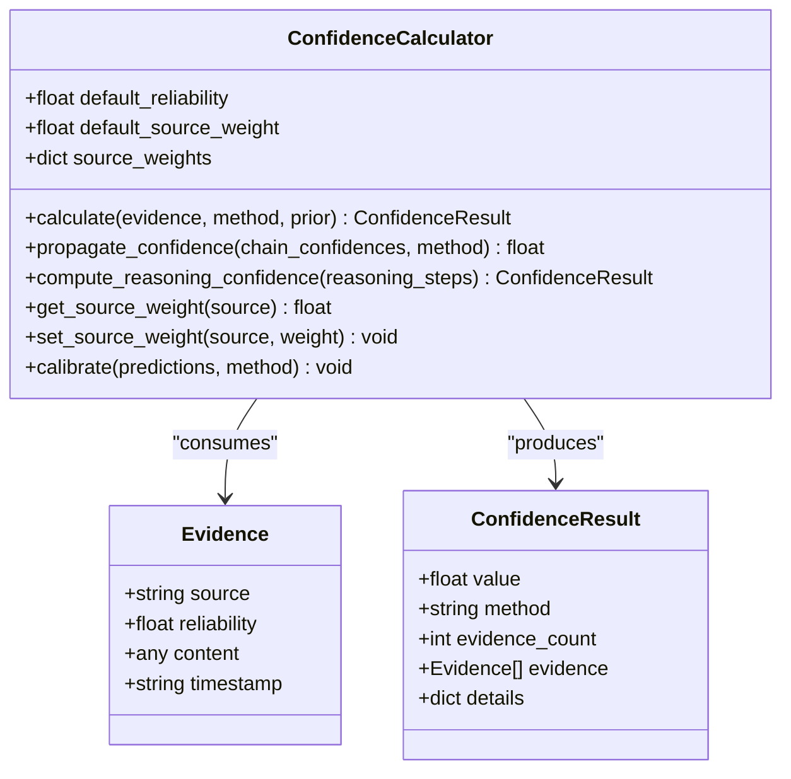
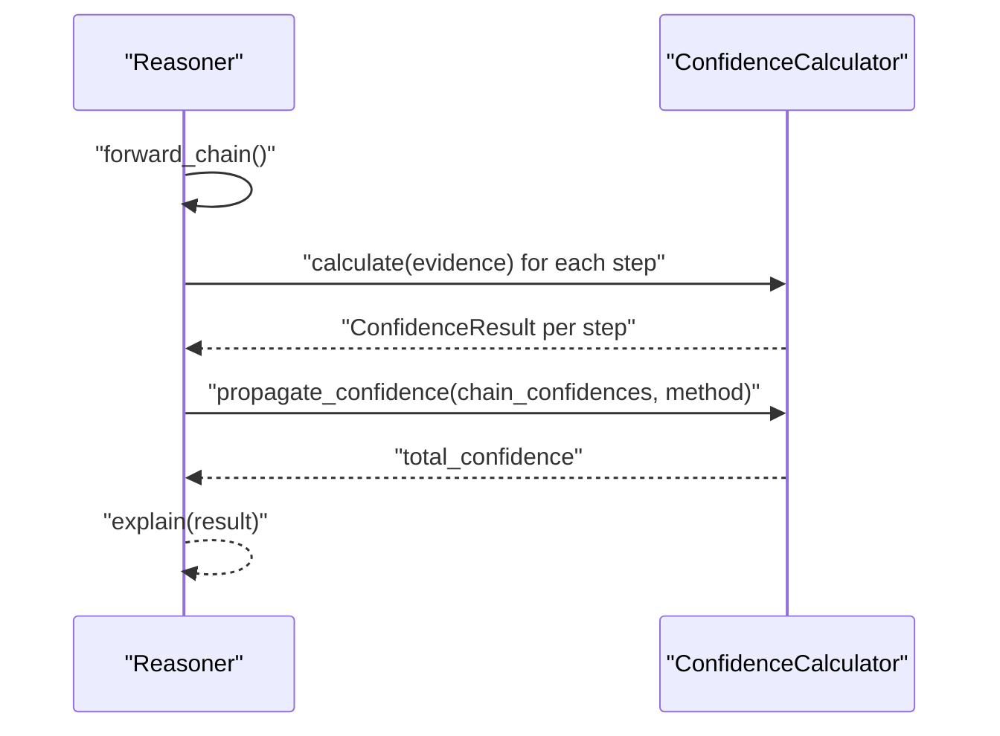
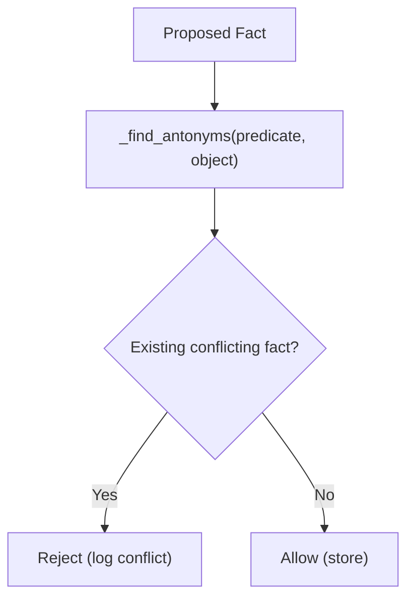
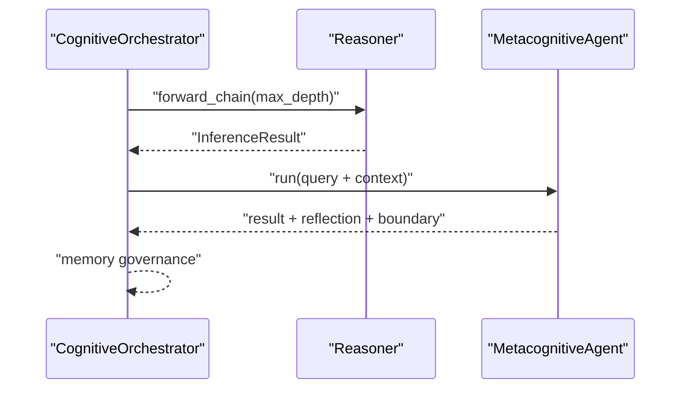
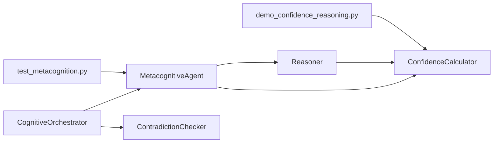

# Metacognitive Reasoning and Self-Assessment

<cite>
**Referenced Files in This Document**
- [metacognition.py](file://src/agents/metacognition.py)
- [confidence.py](file://src/eval/confidence.py)
- [reasoner.py](file://src/core/reasoner.py)
- [self_correction.py](file://src/evolution/self_correction.py)
- [orchestrator.py](file://src/agents/orchestrator.py)
- [monitoring.py](file://src/eval/monitoring.py)
- [test_metacognition.py](file://tests/test_metacognition.py)
- [demo_confidence_reasoning.py](file://examples/demo_confidence_reasoning.py)
</cite>

## Table of Contents
1. [Introduction](#introduction)
2. [Project Structure](#project-structure)
3. [Core Components](#core-components)
4. [Architecture Overview](#architecture-overview)
5. [Detailed Component Analysis](#detailed-component-analysis)
6. [Dependency Analysis](#dependency-analysis)
7. [Performance Considerations](#performance-considerations)
8. [Troubleshooting Guide](#troubleshooting-guide)
9. [Conclusion](#conclusion)

## Introduction
This document explains the metacognitive reasoning system and self-assessment capabilities implemented in the platform. It focuses on:
- Self-reflection mechanisms that validate reasoning against internal logic
- Confidence calibration algorithms grounded in evidence quality and quantity
- Knowledge boundary detection to determine when answers are reliable
- Metacognitive loops, reasoning quality evaluation, and recursive self-monitoring
- Concrete examples of reasoning patterns, self-assessment workflows, and confidence adjustment mechanisms
- The mathematical foundations of confidence propagation and integration with the confidence evaluation system

The goal is to help both technical and non-technical readers understand how the system achieves self-awareness and improves reasoning quality through explicit metacognition.

## Project Structure
The metacognitive system spans several modules:
- Agents: MetacognitiveAgent orchestrates reasoning, reflection, and boundary checks
- Evaluation: ConfidenceCalculator implements multiple confidence computation and propagation methods
- Core Reasoner: Provides forward/backward chaining, confidence propagation, and explanations
- Evolution: Safety mechanisms (ContradictionChecker) and reflective loops
- Orchestrator: Integrates metacognition into a broader cognitive loop with auditing and tool use
- Tests and demos: Validate behavior and demonstrate practical usage

**Diagram sources**
- [metacognition.py:8-21](file://src/agents/metacognition.py#L8-L21)
- [confidence.py:32-62](file://src/eval/confidence.py#L32-L62)
- [reasoner.py:145-180](file://src/core/reasoner.py#L145-L180)
- [self_correction.py:7-21](file://src/evolution/self_correction.py#L7-L21)
- [orchestrator.py:23-42](file://src/agents/orchestrator.py#L23-L42)

**Section sources**
- [metacognition.py:8-21](file://src/agents/metacognition.py#L8-L21)
- [confidence.py:32-62](file://src/eval/confidence.py#L32-L62)
- [reasoner.py:145-180](file://src/core/reasoner.py#L145-L180)
- [self_correction.py:7-21](file://src/evolution/self_correction.py#L7-L21)
- [orchestrator.py:23-42](file://src/agents/orchestrator.py#L23-L42)

## Core Components
- MetacognitiveAgent: Implements self-reflection, knowledge boundary detection, and confidence calibration. It builds structured reasoning steps from the Reasoner, validates them, and assesses confidence thresholds.
- ConfidenceCalculator: Computes confidence from multiple evidence sources using weighted averaging, Bayesian updates, multiplicative synthesis, and Dempster–Shafer theory. It propagates confidence along reasoning chains and supports calibration.
- Reasoner: Provides forward/backward chaining, computes per-step confidence, aggregates total confidence, and explains results.
- ContradictionChecker and ReflectionLoop: Enforce safety and evaluate thought traces to prevent knowledge contamination and support recursive self-monitoring.
- CognitiveOrchestrator: Integrates metacognition into a ReAct-style loop with tool use, auditing, and memory governance.

**Section sources**
- [metacognition.py:23-173](file://src/agents/metacognition.py#L23-L173)
- [confidence.py:63-260](file://src/eval/confidence.py#L63-L260)
- [reasoner.py:243-349](file://src/core/reasoner.py#L243-L349)
- [self_correction.py:46-90](file://src/evolution/self_correction.py#L46-L90)
- [orchestrator.py:128-300](file://src/agents/orchestrator.py#L128-L300)

## Architecture Overview
The metacognitive loop ties together reasoning, reflection, and boundary assessment:

**Diagram sources**
- [orchestrator.py:285-299](file://src/agents/orchestrator.py#L285-L299)
- [metacognition.py:92-133](file://src/agents/metacognition.py#L92-L133)
- [reasoner.py:243-349](file://src/core/reasoner.py#L243-L349)
- [confidence.py:63-99](file://src/eval/confidence.py#L63-L99)
- [self_correction.py:46-73](file://src/evolution/self_correction.py#L46-L73)

## Detailed Component Analysis

### MetacognitiveAgent
- Self-reflection: Aggregates per-step confidence, detects low-confidence steps, and performs simple contradiction checks on the thought text.
- Knowledge boundary detection: Classifies confidence into high/medium/low/unknown and provides recommendations.
- Confidence calibration: Uses a Bayesian-inspired formula that scales with evidence count (diminishing returns) and quality, with a base uncertainty floor and cap.

**Diagram sources**
- [metacognition.py:23-90](file://src/agents/metacognition.py#L23-L90)

**Section sources**
- [metacognition.py:23-90](file://src/agents/metacognition.py#L23-L90)
- [metacognition.py:136-172](file://src/agents/metacognition.py#L136-L172)
- [metacognition.py:175-204](file://src/agents/metacognition.py#L175-L204)

### ConfidenceCalculator
- Methods:
  - Weighted: Average of reliability scaled by source weights
  - Bayesian: Likelihood ratio update with prior
  - Multiplicative: Combined probability synthesis
  - Dempster–Shafer: Belief assignment and combination
- Propagation: Supports min, arithmetic mean, geometric mean, and multiplicative propagation along reasoning chains
- Calibration: Placeholder for external calibration methods (Platt/isotonic)

**Diagram sources**
- [confidence.py:13-30](file://src/eval/confidence.py#L13-L30)
- [confidence.py:32-334](file://src/eval/confidence.py#L32-L334)

**Section sources**
- [confidence.py:63-99](file://src/eval/confidence.py#L63-L99)
- [confidence.py:100-171](file://src/eval/confidence.py#L100-L171)
- [confidence.py:172-221](file://src/eval/confidence.py#L172-L221)
- [confidence.py:222-260](file://src/eval/confidence.py#L222-L260)
- [confidence.py:307-334](file://src/eval/confidence.py#L307-L334)

### Reasoner Integration
- Forward/backward chaining produces InferenceResult with per-step ConfidenceResult and total_confidence
- ConfidenceCalculator is embedded to compute per-step confidence and aggregate total confidence
- Explanation function renders readable summaries of the reasoning process

**Diagram sources**
- [reasoner.py:243-349](file://src/core/reasoner.py#L243-L349)
- [confidence.py:222-260](file://src/eval/confidence.py#L222-L260)

**Section sources**
- [reasoner.py:243-349](file://src/core/reasoner.py#L243-L349)
- [reasoner.py:617-642](file://src/core/reasoner.py#L617-L642)

### Safety and Recursive Monitoring
- ContradictionChecker prevents storing facts that conflict with existing knowledge by checking antonyms and enforcing mutual exclusivity
- ReflectionLoop evaluates thought traces and can be extended to deeper diagnostics

**Diagram sources**
- [self_correction.py:46-73](file://src/evolution/self_correction.py#L46-L73)

**Section sources**
- [self_correction.py:7-21](file://src/evolution/self_correction.py#L7-L21)
- [self_correction.py:46-90](file://src/evolution/self_correction.py#L46-L90)

### Integration in CognitiveOrchestrator
- The orchestrator coordinates tool use, reasoning, auditing, and memory governance
- After retrieving vector context and injecting graph neighbors, it runs MetacognitiveAgent to produce a metacognitive assessment alongside the reasoning chain

**Diagram sources**
- [orchestrator.py:261-299](file://src/agents/orchestrator.py#L261-L299)
- [metacognition.py:92-133](file://src/agents/metacognition.py#L92-L133)

**Section sources**
- [orchestrator.py:128-300](file://src/agents/orchestrator.py#L128-L300)

## Dependency Analysis
- MetacognitiveAgent depends on Reasoner for inference and explanation, and ConfidenceCalculator for confidence computations
- Reasoner embeds ConfidenceCalculator and uses it to compute per-step and total confidence
- CognitiveOrchestrator composes MetacognitiveAgent, Reasoner, and ContradictionChecker into a cohesive loop
- Tests validate reflection, boundary classification, and confidence calibration behaviors

**Diagram sources**
- [metacognition.py:8-21](file://src/agents/metacognition.py#L8-L21)
- [confidence.py:32-62](file://src/eval/confidence.py#L32-L62)
- [reasoner.py:162-174](file://src/core/reasoner.py#L162-L174)
- [orchestrator.py:23-42](file://src/agents/orchestrator.py#L23-L42)
- [test_metacognition.py:14-19](file://tests/test_metacognition.py#L14-L19)
- [demo_confidence_reasoning.py:19-20](file://examples/demo_confidence_reasoning.py#L19-L20)

**Section sources**
- [test_metacognition.py:14-19](file://tests/test_metacognition.py#L14-L19)
- [demo_confidence_reasoning.py:19-20](file://examples/demo_confidence_reasoning.py#L19-L20)

## Performance Considerations
- Reasoning depth and timeouts: Forward/backward chains include circuit-breaker timeouts to prevent excessive computation
- Confidence propagation: Using conservative propagation (min) reduces risk of over-optimistic confidence accumulation
- Evidence scaling: Diminishing returns in confidence calibration reduce overconfidence with large evidence sets
- Monitoring: Metrics collection and health checks enable operational visibility and performance tuning

**Section sources**
- [reasoner.py:274-277](file://src/core/reasoner.py#L274-L277)
- [reasoner.py:380-382](file://src/core/reasoner.py#L380-L382)
- [metacognition.py:193-203](file://src/agents/metacognition.py#L193-L203)
- [monitoring.py:118-168](file://src/eval/monitoring.py#L118-L168)

## Troubleshooting Guide
Common issues and resolutions:
- Low confidence reasoning: Review reasoning steps for missing or weak evidence; increase evidence count or improve quality
- Knowledge boundary warnings: For low or unknown confidence, seek external verification or expert consultation
- Contradictions detected: Reframe statements to avoid contradictory phrasing; validate against existing facts
- Overly confident conclusions: Use confidence propagation and boundary checks to moderate assertions

Validation references:
- Reflection tests confirm issue detection with low-confidence steps
- Boundary classification tests verify thresholds and recommendations
- Confidence calibration tests validate scaling and caps

**Section sources**
- [test_metacognition.py:21-46](file://tests/test_metacognition.py#L21-L46)
- [test_metacognition.py:71-99](file://tests/test_metacognition.py#L71-L99)
- [test_metacognition.py:101-127](file://tests/test_metacognition.py#L101-L127)

## Conclusion
The metacognitive reasoning system integrates explicit self-reflection, confidence calibration, and knowledge boundary detection into a robust reasoning pipeline. By combining:
- Pattern-based contradiction detection and structured reflection
- Evidence-driven confidence computation and propagation
- Conservative boundary classification and safety checks
- Orchestration with auditing and memory governance

The system achieves self-awareness that improves reasoning quality, reduces overconfidence, and guides users toward reliable decisions and actionable next steps.