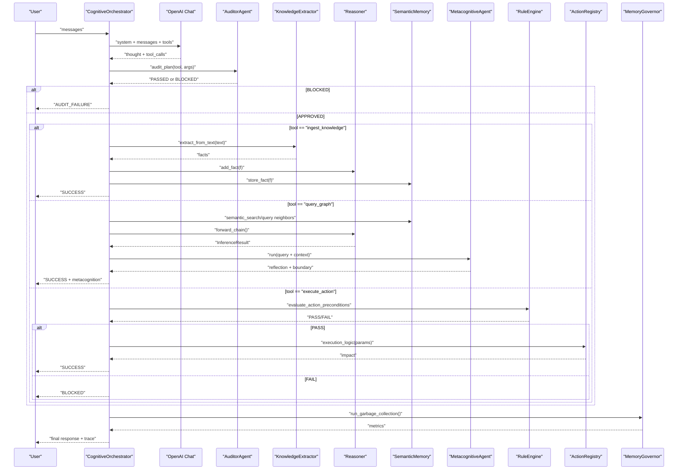
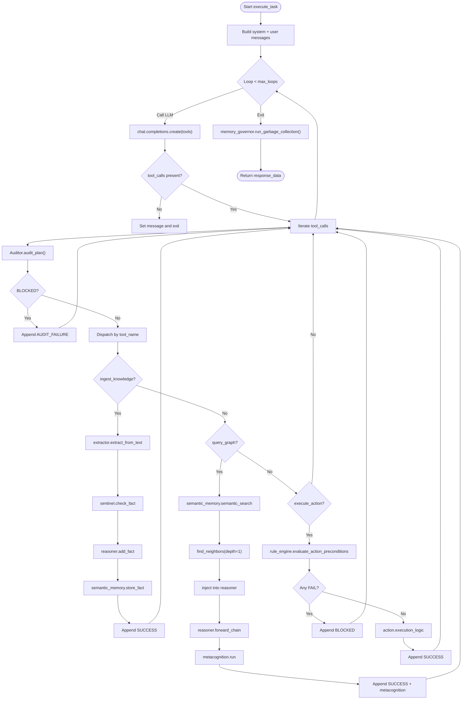
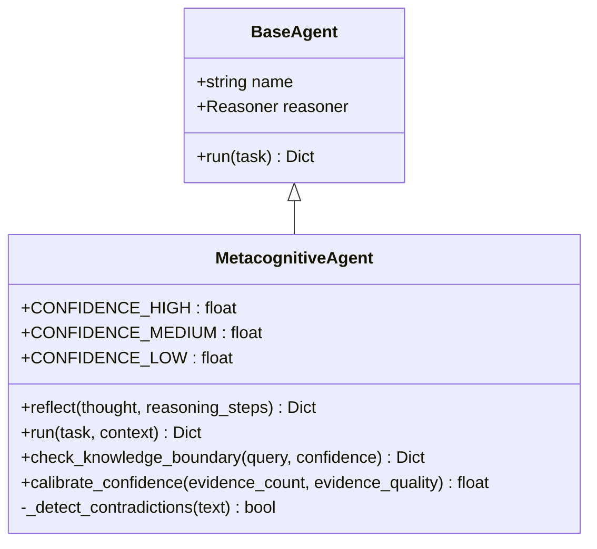
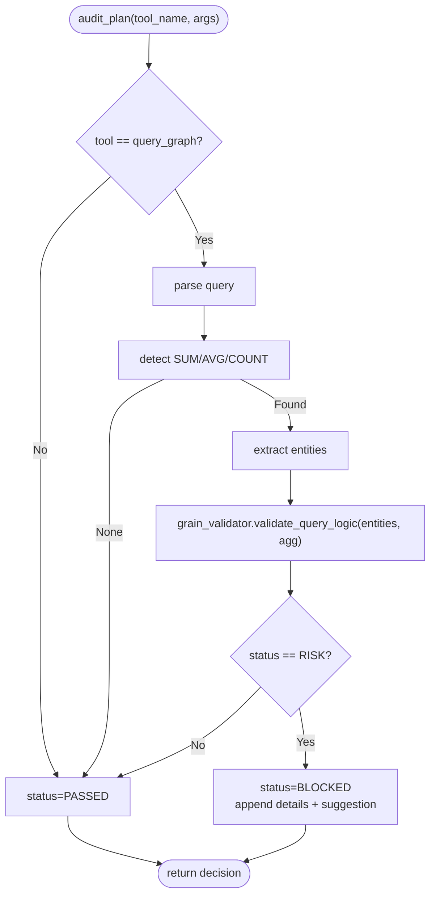
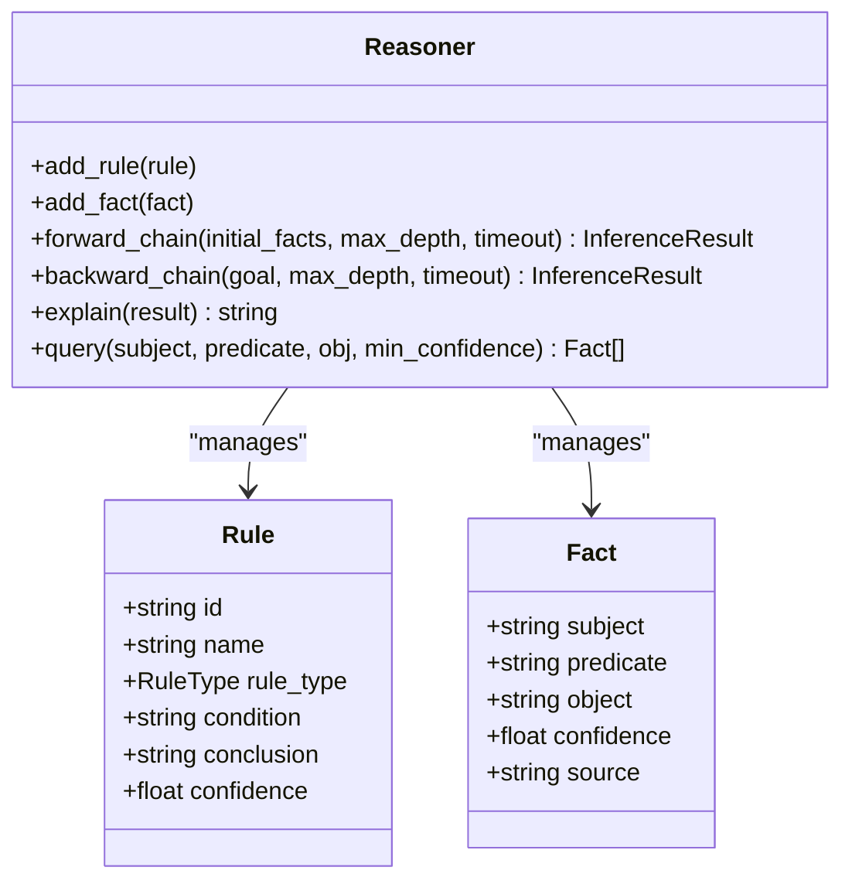
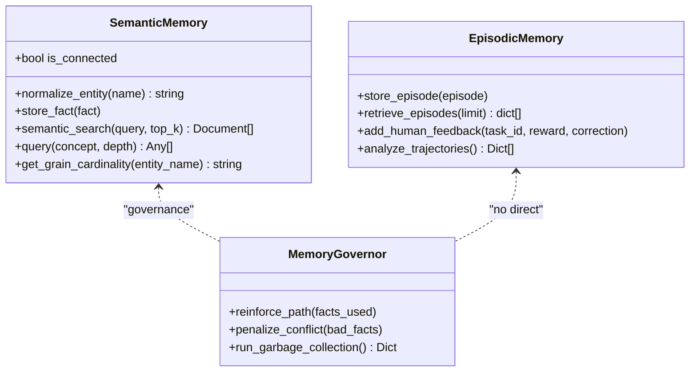
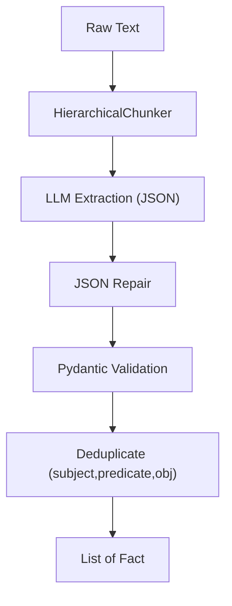
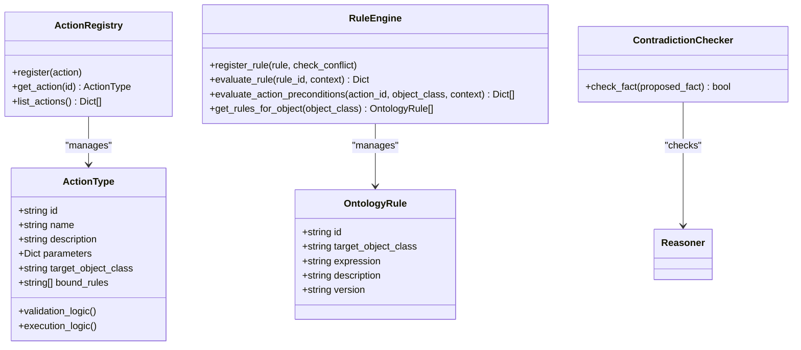

# Orchestrator Agent

<cite>
**Referenced Files in This Document**
- [orchestrator.py](file://src/agents/orchestrator.py)
- [metacognition.py](file://src/agents/metacognition.py)
- [auditor.py](file://src/agents/auditor.py)
- [base.py](file://src/agents/base.py)
- [reasoner.py](file://src/core/reasoner.py)
- [base_memory.py](file://src/memory/base.py)
- [skills.py](file://src/core/memory/skills.py)
- [governance.py](file://src/memory/governance.py)
- [extractor.py](file://src/perception/extractor.py)
- [glossary_engine.py](file://src/perception/glossary_engine.py)
- [actions.py](file://src/core/ontology/actions.py)
- [rule_engine.py](file://src/core/ontology/rule_engine.py)
- [grain_validator.py](file://src/core/ontology/grain_validator.py)
- [self_correction.py](file://src/evolution/self_correction.py)
- [demo_v3_verification.py](file://tests/demo_v3_verification.py)
</cite>

## Table of Contents
1. [Introduction](#introduction)
2. [Project Structure](#project-structure)
3. [Core Components](#core-components)
4. [Architecture Overview](#architecture-overview)
5. [Detailed Component Analysis](#detailed-component-analysis)
6. [Dependency Analysis](#dependency-analysis)
7. [Performance Considerations](#performance-considerations)
8. [Troubleshooting Guide](#troubleshooting-guide)
9. [Conclusion](#conclusion)
10. [Appendices](#appendices)

## Introduction
The Orchestrator Agent is the cognitive central nervous system of the metacognitive framework. It coordinates complex reasoning tasks, traces decisions, and maintains an audit trail across multiple specialized agents and systems. Its responsibilities include:
- Coordinating ReAct-style tool calls (knowledge ingestion, graph reasoning, and action execution)
- Enforcing safety via auditing, rule gating, and contradiction checks
- Integrating the reasoning engine for quality assessment and confidence propagation
- Managing memory systems for experience tracking and governance
- Supporting self-monitoring and performance optimization

## Project Structure
The Orchestrator Agent lives under src/agents and orchestrates collaborators from perception, memory, reasoning, and governance layers. The following diagram maps the orchestrator’s primary collaborators and their roles.

```mermaid
graph TB
Orchestrator["CognitiveOrchestrator<br/>src/agents/orchestrator.py"]
Reasoner["Reasoner<br/>src/core/reasoner.py"]
SemMem["SemanticMemory<br/>src/memory/base.py"]
EpisMem["EpisodicMemory<br/>src/memory/base.py"]
Extractor["KnowledgeExtractor<br/>src/perception/extractor.py"]
Sentinel["ContradictionChecker<br/>src/evolution/self_correction.py"]
Metacog["MetacognitiveAgent<br/>src/agents/metacognition.py"]
Auditor["AuditorAgent<br/>src/agents/auditor.py"]
Glossary["GlossaryEngine<br/>src/perception/glossary_engine.py"]
Skills["SkillRegistry<br/>src/core/memory/skills.py"]
Actions["ActionRegistry<br/>src/core/ontology/actions.py"]
Rules["RuleEngine<br/>src/core/ontology/rule_engine.py"]
Grain["GrainValidator<br/>src/core/ontology/grain_validator.py"]
Gov["MemoryGovernor<br/>src/memory/governance.py"]
Orchestrator --> Reasoner
Orchestrator --> SemMem
Orchestrator --> EpisMem
Orchestrator --> Extractor
Orchestrator --> Sentinel
Orchestrator --> Metacog
Orchestrator --> Auditor
Orchestrator --> Glossary
Orchestrator --> Skills
Orchestrator --> Actions
Orchestrator --> Rules
Orchestrator --> Grain
Orchestrator --> Gov
```

**Diagram sources**
- [orchestrator.py:23-42](file://src/agents/orchestrator.py#L23-L42)
- [reasoner.py:145-180](file://src/core/reasoner.py#L145-L180)
- [base_memory.py:9-28](file://src/memory/base.py#L9-L28)
- [extractor.py:83-104](file://src/perception/extractor.py#L83-L104)
- [self_correction.py:7-17](file://src/evolution/self_correction.py#L7-L17)
- [metacognition.py:8-16](file://src/agents/metacognition.py#L8-L16)
- [auditor.py:8-23](file://src/agents/auditor.py#L8-L23)
- [glossary_engine.py:9-29](file://src/perception/glossary_engine.py#L9-L29)
- [skills.py:23-31](file://src/core/memory/skills.py#L23-L31)
- [actions.py:24-31](file://src/core/ontology/actions.py#L24-L31)
- [rule_engine.py:124-140](file://src/core/ontology/rule_engine.py#L124-L140)
- [grain_validator.py:13-23](file://src/core/ontology/grain_validator.py#L13-L23)
- [governance.py:6-19](file://src/memory/governance.py#L6-L19)

**Section sources**
- [orchestrator.py:23-42](file://src/agents/orchestrator.py#L23-L42)

## Core Components
- CognitiveOrchestrator: Central coordinator implementing a ReAct loop with tool calls for ingestion, reasoning, and actions. It integrates safety and governance layers and produces a detailed trace for auditability.
- MetacognitiveAgent: Performs self-reflection, validates reasoning, assesses knowledge boundaries, and calibrates confidence.
- AuditorAgent: Independent safety monitor that audits tool plans, especially for query semantics and fan-trap risks.
- Reasoner: Forward/backward chaining engine with confidence propagation and explanation.
- Memory Systems: SemanticMemory (Neo4j + Chroma hybrid) and EpisodicMemory (SQLite) for persistent knowledge and experience.
- Perception: KnowledgeExtractor for structured triple extraction; GlossaryEngine for physical-to-business mapping.
- Ontology: ActionRegistry and RuleEngine for dynamic, mathematically validated actions and safety gates.
- Governance: MemoryGovernor for synaptic pruning and confidence decay.

**Section sources**
- [orchestrator.py:28-42](file://src/agents/orchestrator.py#L28-L42)
- [metacognition.py:8-16](file://src/agents/metacognition.py#L8-L16)
- [auditor.py:8-23](file://src/agents/auditor.py#L8-L23)
- [reasoner.py:145-180](file://src/core/reasoner.py#L145-L180)
- [base_memory.py:9-28](file://src/memory/base.py#L9-L28)
- [extractor.py:83-104](file://src/perception/extractor.py#L83-L104)
- [glossary_engine.py:9-29](file://src/perception/glossary_engine.py#L9-L29)
- [actions.py:24-31](file://src/core/ontology/actions.py#L24-L31)
- [rule_engine.py:124-140](file://src/core/ontology/rule_engine.py#L124-L140)
- [governance.py:6-19](file://src/memory/governance.py#L6-L19)

## Architecture Overview
The orchestrator runs a ReAct loop with explicit safety and governance:
- Input messages are augmented with a system prompt and tool schema.
- The LLM decides whether to think internally or call tools.
- For each tool call:
  - Safety audit is performed (AuditorAgent).
  - If approved, execution proceeds:
    - Ingestion: extract structured facts, validate with ContradictionChecker, add to Reasoner and SemanticMemory.
    - Reasoning: combine vector context and graph neighbors, run forward chain, then MetacognitiveAgent reflection.
    - Action: RuleEngine gating, then execution via ActionRegistry.
  - Results are appended to the trace with latency and summaries.
- After the loop, MemoryGovernor performs garbage collection and pruning.

**Diagram sources**
- [orchestrator.py:128-366](file://src/agents/orchestrator.py#L128-L366)
- [auditor.py:24-65](file://src/agents/auditor.py#L24-L65)
- [extractor.py:278-350](file://src/perception/extractor.py#L278-L350)
- [reasoner.py:243-350](file://src/core/reasoner.py#L243-L350)
- [metacognition.py:92-134](file://src/agents/metacognition.py#L92-L134)
- [rule_engine.py:320-331](file://src/core/ontology/rule_engine.py#L320-L331)
- [governance.py:47-62](file://src/memory/governance.py#L47-L62)

## Detailed Component Analysis

### CognitiveOrchestrator
- Responsibilities:
  - Manages a ReAct loop with three tools: ingest_knowledge, query_graph, execute_action.
  - Enforces safety via AuditorAgent and RuleEngine gating.
  - Integrates MetacognitiveAgent for reflective reasoning and confidence calibration.
  - Applies MemoryGovernor post-loop for pruning and reinforcement.
- Key behaviors:
  - Tool schema enforces mandatory thought_process for structured reasoning.
  - GraphRAG: combines vector similarity search with graph neighbor queries.
  - Action wiring: binds execution logic to specific action IDs.
  - Trace construction: captures tool calls, results, latency, and metacognition.

**Diagram sources**
- [orchestrator.py:128-366](file://src/agents/orchestrator.py#L128-L366)

**Section sources**
- [orchestrator.py:28-42](file://src/agents/orchestrator.py#L28-L42)
- [orchestrator.py:128-366](file://src/agents/orchestrator.py#L128-L366)

### MetacognitiveAgent
- Role: Validates reasoning, detects contradictions, reflects on confidence, and assesses knowledge boundaries.
- Confidence calibration uses a Bayesian-inspired model with diminishing returns and base uncertainty.
- Knowledge boundary detection maps confidence to thresholds and suggests corrective actions.

**Diagram sources**
- [base.py:8-20](file://src/agents/base.py#L8-L20)
- [metacognition.py:8-22](file://src/agents/metacognition.py#L8-L22)

**Section sources**
- [metacognition.py:23-71](file://src/agents/metacognition.py#L23-L71)
- [metacognition.py:92-134](file://src/agents/metacognition.py#L92-L134)
- [metacognition.py:136-173](file://src/agents/metacognition.py#L136-L173)
- [metacognition.py:175-204](file://src/agents/metacognition.py#L175-L204)

### AuditorAgent
- Role: Independent safety monitor focusing on:
  - Granular risk auditing for query_graph (fan-trap detection).
  - Providing corrective feedback and blocking risky plans.
- Detection logic scans for aggregation keywords and validates cardinality via GrainValidator.

**Diagram sources**
- [auditor.py:24-65](file://src/agents/auditor.py#L24-L65)
- [grain_validator.py:24-55](file://src/core/ontology/grain_validator.py#L24-L55)

**Section sources**
- [auditor.py:24-65](file://src/agents/auditor.py#L24-L65)
- [grain_validator.py:24-55](file://src/core/ontology/grain_validator.py#L24-L55)

### Reasoner
- Implements forward and backward chaining with confidence propagation.
- Provides explainable reasoning traces and supports rule registration and pattern matching.

**Diagram sources**
- [reasoner.py:145-180](file://src/core/reasoner.py#L145-L180)
- [reasoner.py:93-143](file://src/core/reasoner.py#L93-L143)
- [reasoner.py:111-124](file://src/core/reasoner.py#L111-L124)

**Section sources**
- [reasoner.py:243-350](file://src/core/reasoner.py#L243-L350)
- [reasoner.py:617-642](file://src/core/reasoner.py#L617-L642)

### Memory Systems
- SemanticMemory: Hybrid graph-vector store with entity normalization and graph traversal.
- EpisodicMemory: SQLite-backed persistence for episodes, rewards, and corrections.
- MemoryGovernor: Reinforcement and pruning based on confidence thresholds.

**Diagram sources**
- [base_memory.py:9-28](file://src/memory/base.py#L9-L28)
- [base_memory.py:84-144](file://src/memory/base.py#L84-L144)
- [base_memory.py:150-249](file://src/memory/base.py#L150-L249)
- [governance.py:6-62](file://src/memory/governance.py#L6-L62)

**Section sources**
- [base_memory.py:9-28](file://src/memory/base.py#L9-L28)
- [base_memory.py:84-144](file://src/memory/base.py#L84-L144)
- [base_memory.py:150-249](file://src/memory/base.py#L150-L249)
- [governance.py:6-62](file://src/memory/governance.py#L6-L62)

### Perception and Extraction
- KnowledgeExtractor: Hierarchical chunking, constrained JSON extraction, and deduplication.
- GlossaryEngine: Generates physical-to-business mappings to align extraction context.

**Diagram sources**
- [extractor.py:18-33](file://src/perception/extractor.py#L18-L33)
- [extractor.py:278-350](file://src/perception/extractor.py#L278-L350)

**Section sources**
- [extractor.py:83-104](file://src/perception/extractor.py#L83-L104)
- [extractor.py:278-350](file://src/perception/extractor.py#L278-L350)
- [glossary_engine.py:30-71](file://src/perception/glossary_engine.py#L30-L71)

### Ontology and Safety Gates
- ActionRegistry: Defines action types with parameters, target classes, and bound rules.
- RuleEngine: Secure sandbox evaluation of math/logical expressions; preconditions gating for actions.
- ContradictionChecker: Prevents knowledge poisoning by detecting conflicting facts.

**Diagram sources**
- [actions.py:7-23](file://src/core/ontology/actions.py#L7-L23)
- [actions.py:24-70](file://src/core/ontology/actions.py#L24-L70)
- [rule_engine.py:88-123](file://src/core/ontology/rule_engine.py#L88-L123)
- [rule_engine.py:124-171](file://src/core/ontology/rule_engine.py#L124-L171)
- [self_correction.py:7-17](file://src/evolution/self_correction.py#L7-L17)

**Section sources**
- [actions.py:24-70](file://src/core/ontology/actions.py#L24-L70)
- [rule_engine.py:124-171](file://src/core/ontology/rule_engine.py#L124-L171)
- [rule_engine.py:320-331](file://src/core/ontology/rule_engine.py#L320-L331)
- [self_correction.py:46-74](file://src/evolution/self_correction.py#L46-L74)

## Dependency Analysis
The orchestrator composes multiple subsystems with clear coupling and cohesion:
- Low coupling: Each collaborator is injected via constructor, enabling modular testing and replacement.
- Cohesion: The orchestrator encapsulates the ReAct loop, safety, and governance into a single control plane.
- External dependencies: OpenAI client for tool invocation; Neo4j/Chroma for memory; SQLite for episodic persistence.

```mermaid
graph TB
Orchestrator["CognitiveOrchestrator"]
Reasoner["Reasoner"]
SemMem["SemanticMemory"]
EpisMem["EpisodicMemory"]
Extractor["KnowledgeExtractor"]
Sentinel["ContradictionChecker"]
Metacog["MetacognitiveAgent"]
Auditor["AuditorAgent"]
Glossary["GlossaryEngine"]
Skills["SkillRegistry"]
Actions["ActionRegistry"]
Rules["RuleEngine"]
Grain["GrainValidator"]
Gov["MemoryGovernor"]
Orchestrator --> Reasoner
Orchestrator --> SemMem
Orchestrator --> EpisMem
Orchestrator --> Extractor
Orchestrator --> Sentinel
Orchestrator --> Metacog
Orchestrator --> Auditor
Orchestrator --> Glossary
Orchestrator --> Skills
Orchestrator --> Actions
Orchestrator --> Rules
Orchestrator --> Grain
Orchestrator --> Gov
```

**Diagram sources**
- [orchestrator.py:28-42](file://src/agents/orchestrator.py#L28-L42)

**Section sources**
- [orchestrator.py:28-42](file://src/agents/orchestrator.py#L28-L42)

## Performance Considerations
- Circuit breakers: Forward/backward chaining enforce timeouts to avoid long-running inference.
- Retries and backoff: Orchestrator and extractor handle rate limits gracefully.
- Garbage collection: Post-loop pruning removes low-confidence facts to keep reasoning lean.
- Confidence decay and reinforcement: MemoryGovernor stabilizes knowledge by strengthening reliable paths and pruning unreliable ones.
- Tool call frequency: Limit retries and exponential backoff to reduce API costs and latency spikes.

[No sources needed since this section provides general guidance]

## Troubleshooting Guide
Common issues and resolutions:
- Missing API key or mock key: Orchestrator returns an error response indicating missing configuration.
- Rate limiting (HTTP 429): Orchestrator and extractor implement exponential backoff; retry logic logs wait times and continues.
- Audit interception: When Auditor blocks a plan, the trace includes risks and suggested corrections; adjust query or parameters accordingly.
- Rule gating failure: Review RuleEngine evaluations for failing conditions and adjust inputs to meet bounds.
- Knowledge poisoning prevention: If a fact is blocked by ContradictionChecker, review predicate/object consistency and reconcile with existing facts.

**Section sources**
- [orchestrator.py:131-139](file://src/agents/orchestrator.py#L131-L139)
- [orchestrator.py:180-185](file://src/agents/orchestrator.py#L180-L185)
- [auditor.py:60-65](file://src/agents/auditor.py#L60-L65)
- [rule_engine.py:303-319](file://src/core/ontology/rule_engine.py#L303-L319)
- [self_correction.py:66-73](file://src/evolution/self_correction.py#L66-L73)

## Conclusion
The Orchestrator Agent serves as the central coordinator for complex reasoning tasks, integrating perception, reasoning, memory, and governance. Its ReAct loop, combined with safety audits, rule gating, and self-governance, ensures robust, auditable, and high-quality outcomes. The system’s modularity enables incremental enhancements, from confidence calibration to dynamic rule updates and skill reuse.

[No sources needed since this section summarizes without analyzing specific files]

## Appendices

### Example Scenarios and Decision Tracing
- Ingestion scenario: The orchestrator extracts structured facts, validates them, and stores them in both the reasoner and semantic memory, appending a trace summary.
- Reasoning scenario: The orchestrator retrieves vector context and graph neighbors, runs forward chaining, and asks the MetacognitiveAgent to reflect and assess knowledge boundaries.
- Action scenario: The orchestrator evaluates preconditions via the RuleEngine; if all pass, it executes the action and records impact.

**Section sources**
- [demo_v3_verification.py:12-44](file://tests/demo_v3_verification.py#L12-L44)
- [orchestrator.py:242-366](file://src/agents/orchestrator.py#L242-L366)