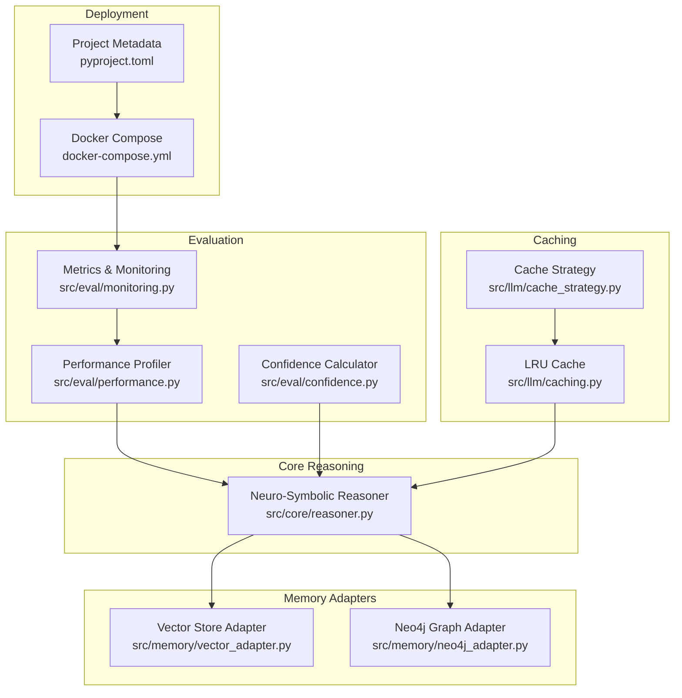
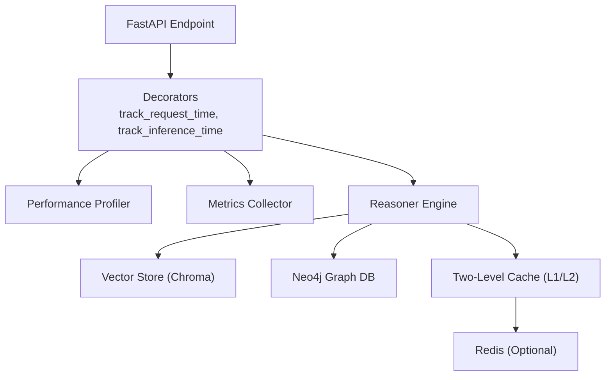
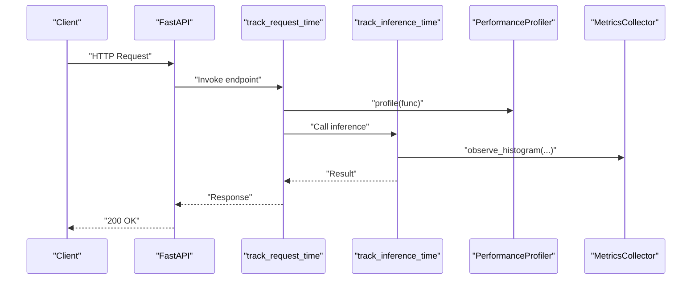
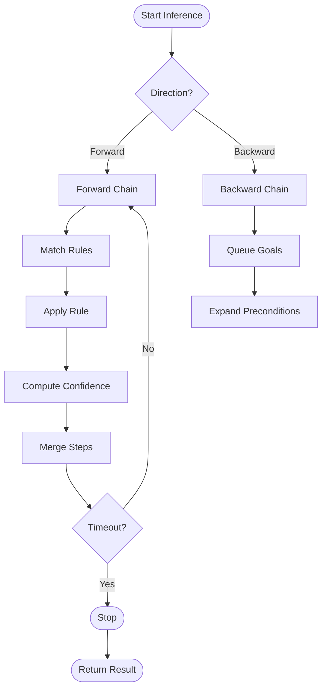
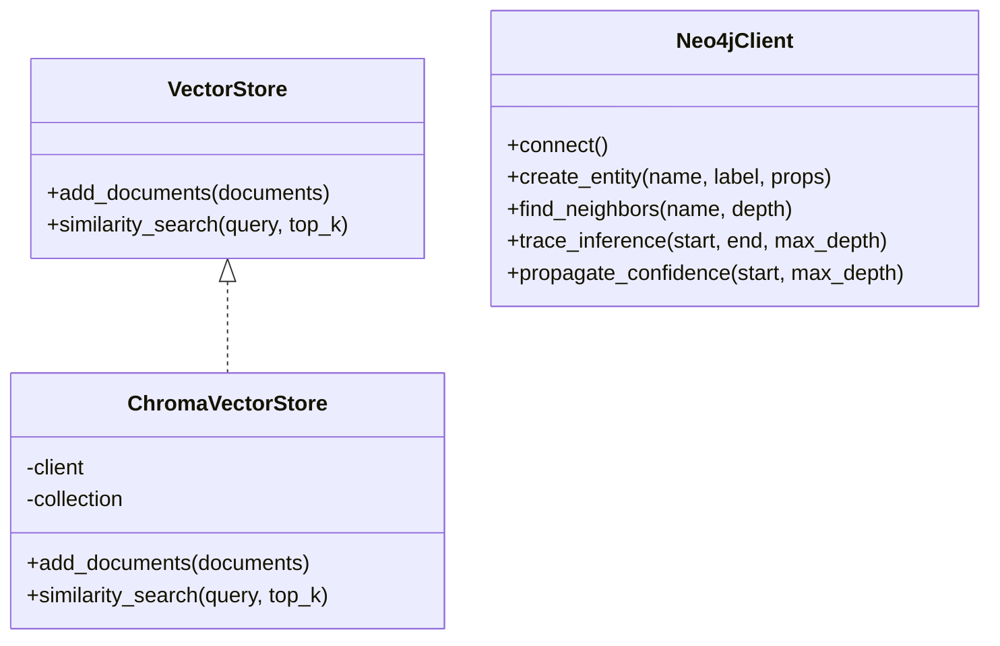
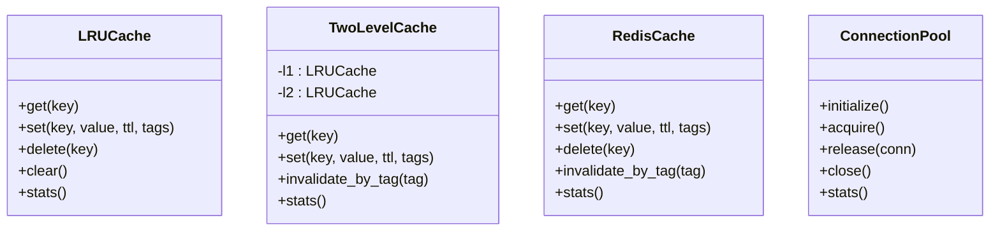
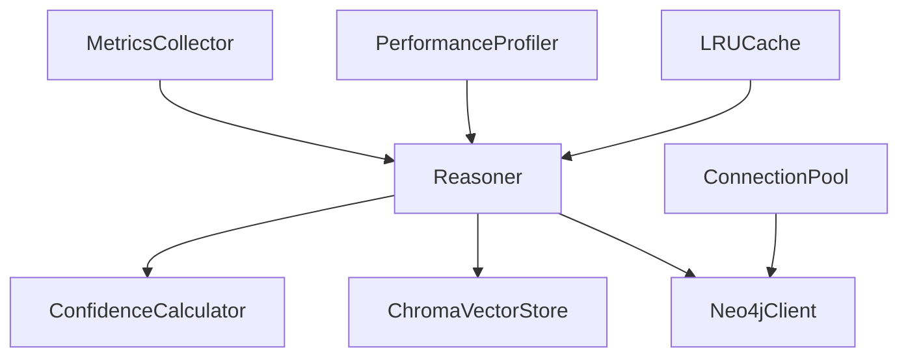

# Performance and Optimization

<cite>
**Referenced Files in This Document**
- [performance.py](file://src/eval/performance.py)
- [monitoring.py](file://src/eval/monitoring.py)
- [reasoner.py](file://src/core/reasoner.py)
- [vector_adapter.py](file://src/memory/vector_adapter.py)
- [neo4j_adapter.py](file://src/memory/neo4j_adapter.py)
- [confidence.py](file://src/eval/confidence.py)
- [caching.py](file://src/llm/caching.py)
- [cache_strategy.py](file://src/llm/cache_strategy.py)
- [docker-compose.yml](file://docker-compose.yml)
- [pyproject.toml](file://pyproject.toml)
- [OPTIMIZATION_ROADMAP.md](file://docs/OPTIMIZATION_ROADMAP.md)
</cite>

## Table of Contents
1. [Introduction](#introduction)
2. [Project Structure](#project-structure)
3. [Core Components](#core-components)
4. [Architecture Overview](#architecture-overview)
5. [Detailed Component Analysis](#detailed-component-analysis)
6. [Dependency Analysis](#dependency-analysis)
7. [Performance Considerations](#performance-considerations)
8. [Troubleshooting Guide](#troubleshooting-guide)
9. [Conclusion](#conclusion)
10. [Appendices](#appendices)

## Introduction
This document provides comprehensive performance and optimization guidance for the neuro-symbolic reasoning platform. It focuses on profiling, resource utilization, bottleneck identification, and optimization strategies for large-scale knowledge bases. It covers caching, connection pooling, async processing, query optimization, memory management, confidence computation efficiency, monitoring and observability, and horizontal/vertical scaling patterns. The content is grounded in the repository’s performance modules, reasoning engine, memory adapters, and deployment configuration.

## Project Structure
The performance-critical subsystems are organized across evaluation utilities, the reasoning engine, memory adapters, caching strategies, and deployment assets. The following diagram maps major components and their roles in performance and scalability.

**Diagram sources**
- [performance.py:375-462](file://src/eval/performance.py#L375-L462)
- [monitoring.py:20-113](file://src/eval/monitoring.py#L20-L113)
- [confidence.py:32-99](file://src/eval/confidence.py#L32-L99)
- [reasoner.py:145-180](file://src/core/reasoner.py#L145-L180)
- [vector_adapter.py:31-97](file://src/memory/vector_adapter.py#L31-L97)
- [neo4j_adapter.py:130-178](file://src/memory/neo4j_adapter.py#L130-L178)
- [caching.py:76-201](file://src/llm/caching.py#L76-L201)
- [cache_strategy.py:109-281](file://src/llm/cache_strategy.py#L109-L281)
- [docker-compose.yml:1-91](file://docker-compose.yml#L1-L91)
- [pyproject.toml:28-37](file://pyproject.toml#L28-L37)

**Section sources**
- [performance.py:1-538](file://src/eval/performance.py#L1-L538)
- [monitoring.py:1-356](file://src/eval/monitoring.py#L1-L356)
- [reasoner.py:1-819](file://src/core/reasoner.py#L1-L819)
- [vector_adapter.py:1-97](file://src/memory/vector_adapter.py#L1-L97)
- [neo4j_adapter.py:1-974](file://src/memory/neo4j_adapter.py#L1-L974)
- [caching.py:1-502](file://src/llm/caching.py#L1-L502)
- [cache_strategy.py:1-751](file://src/llm/cache_strategy.py#L1-L751)
- [docker-compose.yml:1-91](file://docker-compose.yml#L1-L91)
- [pyproject.toml:1-74](file://pyproject.toml#L1-L74)

## Core Components
- Performance Profiler: Records function timings and aggregates statistics for hotspots.
- Metrics Collector: Exposes Prometheus-compatible metrics and supports decorators for request/inference timing.
- Reasoner: Implements forward/backward chaining with timeouts, circuit breaking, and confidence propagation.
- Memory Adapters: Vector store (Chroma) and Neo4j graph adapter for scalable retrieval and traversal.
- Caching: LRU caches with TTL, two-level cache (L1/L2), and Redis-backed distributed cache.
- Monitoring: Health checks, request logging, and performance snapshots.

Key performance-relevant APIs and patterns:
- Decorators for caching and timing around inference-heavy functions.
- Async batch processing and thread-pool execution for CPU-bound tasks.
- Connection pools for external services.
- Confidence calculator supporting multiple propagation strategies.

**Section sources**
- [performance.py:375-462](file://src/eval/performance.py#L375-L462)
- [monitoring.py:20-113](file://src/eval/monitoring.py#L20-L113)
- [reasoner.py:243-438](file://src/core/reasoner.py#L243-L438)
- [vector_adapter.py:31-97](file://src/memory/vector_adapter.py#L31-L97)
- [neo4j_adapter.py:130-178](file://src/memory/neo4j_adapter.py#L130-L178)
- [caching.py:76-201](file://src/llm/caching.py#L76-L201)
- [cache_strategy.py:109-281](file://src/llm/cache_strategy.py#L109-L281)

## Architecture Overview
The system integrates a neuro-symbolic reasoning engine with vector and graph memory backends, supported by robust caching and monitoring.

**Diagram sources**
- [monitoring.py:118-168](file://src/eval/monitoring.py#L118-L168)
- [performance.py:375-462](file://src/eval/performance.py#L375-L462)
- [reasoner.py:243-438](file://src/core/reasoner.py#L243-L438)
- [vector_adapter.py:31-97](file://src/memory/vector_adapter.py#L31-L97)
- [neo4j_adapter.py:130-178](file://src/memory/neo4j_adapter.py#L130-L178)
- [caching.py:205-276](file://src/llm/caching.py#L205-L276)
- [cache_strategy.py:424-535](file://src/llm/cache_strategy.py#L424-L535)

## Detailed Component Analysis

### Performance Profiler and Metrics
- The profiler records per-function timings and exposes aggregated stats (count, total, min, max, avg).
- Metrics collector exports counters, gauges, and summaries in Prometheus format and supports decorators for request and inference timing.
- Decorators wrap endpoints and inference functions to capture latency and throughput.

**Diagram sources**
- [monitoring.py:118-168](file://src/eval/monitoring.py#L118-L168)
- [performance.py:388-462](file://src/eval/performance.py#L388-L462)

**Section sources**
- [performance.py:375-462](file://src/eval/performance.py#L375-L462)
- [monitoring.py:20-113](file://src/eval/monitoring.py#L20-L113)

### Reasoner Engine and Confidence Propagation
- Forward/backward chaining with timeouts and circuit breaking.
- Confidence propagation across inference steps using configurable methods (min, arithmetic, geometric, multiplicative).
- Predicate indexing and rule indexing to accelerate matching.

**Diagram sources**
- [reasoner.py:243-438](file://src/core/reasoner.py#L243-L438)
- [confidence.py:222-259](file://src/eval/confidence.py#L222-L259)

**Section sources**
- [reasoner.py:145-438](file://src/core/reasoner.py#L145-L438)
- [confidence.py:32-298](file://src/eval/confidence.py#L32-L298)

### Vector and Graph Memory Adapters
- Vector store adapter integrates ChromaDB for embedding similarity search with persistent client handling and fallbacks.
- Neo4j adapter supports entity CRUD, graph traversal, inference path tracing, and confidence propagation with in-memory and Neo4j modes.

**Diagram sources**
- [vector_adapter.py:19-97](file://src/memory/vector_adapter.py#L19-L97)
- [neo4j_adapter.py:130-178](file://src/memory/neo4j_adapter.py#L130-L178)

**Section sources**
- [vector_adapter.py:31-97](file://src/memory/vector_adapter.py#L31-L97)
- [neo4j_adapter.py:130-775](file://src/memory/neo4j_adapter.py#L130-L775)

### Caching Strategies and Connection Pooling
- LRU cache with TTL and eviction statistics.
- Two-level cache (L1 memory + L2 optional Redis) with promotion on hit.
- Redis-backed distributed cache with tagging and invalidation.
- Connection pool for async acquisition/release with semaphore gating.

**Diagram sources**
- [caching.py:76-201](file://src/llm/caching.py#L76-L201)
- [cache_strategy.py:109-281](file://src/llm/cache_strategy.py#L109-L281)
- [cache_strategy.py:424-535](file://src/llm/cache_strategy.py#L424-L535)
- [performance.py:182-262](file://src/eval/performance.py#L182-L262)

**Section sources**
- [caching.py:76-201](file://src/llm/caching.py#L76-L201)
- [cache_strategy.py:109-281](file://src/llm/cache_strategy.py#L109-L281)
- [performance.py:182-262](file://src/eval/performance.py#L182-L262)

## Dependency Analysis
- The reasoning engine depends on confidence computation and memory adapters for retrieval and graph traversal.
- Monitoring and profiling are orthogonal concerns that decorate and measure the core pipeline.
- Caching sits in front of expensive operations (vector search, graph queries, inference) to reduce latency and load.
- Deployment configuration defines service dependencies (OLLAMA, GraphDB, Redis) and resource limits.

**Diagram sources**
- [reasoner.py:145-180](file://src/core/reasoner.py#L145-L180)
- [confidence.py:32-99](file://src/eval/confidence.py#L32-L99)
- [vector_adapter.py:31-97](file://src/memory/vector_adapter.py#L31-L97)
- [neo4j_adapter.py:130-178](file://src/memory/neo4j_adapter.py#L130-L178)
- [monitoring.py:20-113](file://src/eval/monitoring.py#L20-L113)
- [performance.py:388-462](file://src/eval/performance.py#L388-L462)
- [caching.py:76-201](file://src/llm/caching.py#L76-L201)
- [performance.py:182-262](file://src/eval/performance.py#L182-L262)

**Section sources**
- [reasoner.py:145-180](file://src/core/reasoner.py#L145-L180)
- [monitoring.py:20-113](file://src/eval/monitoring.py#L20-L113)
- [performance.py:182-262](file://src/eval/performance.py#L182-L262)

## Performance Considerations

### Profiling and Bottleneck Identification
- Use the PerformanceProfiler to decorate hot inference functions and endpoints.
- Aggregate results by total time to identify longest-running functions.
- Combine with MetricsCollector to correlate latency with throughput and error rates.

Practical steps:
- Wrap inference entry points with the profiler decorator.
- Enable periodic dumps of top functions by total time.
- Cross-reference with Prometheus metrics for request latencies and counts.

**Section sources**
- [performance.py:388-462](file://src/eval/performance.py#L388-L462)
- [monitoring.py:118-168](file://src/eval/monitoring.py#L118-L168)

### Caching and Query Optimization
- LRU cache with TTL for repeated inference results and vector/graph queries.
- Two-level cache (L1 memory + L2 Redis) to balance freshness and persistence.
- Query optimizer inspects SQL-like queries and suggests improvements (avoid SELECT *, add LIMIT, avoid OR).

Recommendations:
- Tune cache sizes and TTLs based on workload characteristics.
- Use tags to invalidate groups of related entries.
- For vector search, pre-filter by metadata to reduce candidate sets.

**Section sources**
- [caching.py:76-201](file://src/llm/caching.py#L76-L201)
- [cache_strategy.py:109-281](file://src/llm/cache_strategy.py#L109-L281)
- [performance.py:324-373](file://src/eval/performance.py#L324-L373)

### Async and Concurrency Patterns
- Async batch processor limits concurrency and batches tasks.
- Thread pool execution for CPU-bound operations.
- Connection pool with semaphore to cap concurrent connections.

Guidelines:
- Use AsyncBatchProcessor for bulk operations.
- Run heavy computations in thread pools to avoid blocking the event loop.
- Size pools according to CPU cores and I/O characteristics.

**Section sources**
- [performance.py:290-320](file://src/eval/performance.py#L290-L320)
- [performance.py:267-285](file://src/eval/performance.py#L267-L285)
- [performance.py:182-262](file://src/eval/performance.py#L182-L262)

### Memory Management and Scalability
- Reasoner maintains working memory and deduplicates facts; circuit breaker prevents unbounded growth.
- MemoryGovernor applies confidence decay and pruning to keep knowledge bases lean.
- Vector and graph adapters support persistence and fallback modes.

Best practices:
- Monitor active facts and prune low-confidence stale facts periodically.
- Use pagination and limits in graph traversals and vector searches.
- Persist vector stores and configure retention policies.

**Section sources**
- [reasoner.py:243-350](file://src/core/reasoner.py#L243-L350)
- [neo4j_adapter.py:599-775](file://src/memory/neo4j_adapter.py#L599-L775)
- [vector_adapter.py:31-97](file://src/memory/vector_adapter.py#L31-L97)
- [governance.py:47-62](file://src/memory/governance.py#L47-L62)

### Observability and Alerting
- Prometheus metrics endpoint and health checks.
- Structured request logging with correlation IDs.
- Performance monitor computes RPS and average response time windows.

Implementation tips:
- Expose /metrics and /health endpoints in the API router.
- Define SLOs for inference latency and set alerts on quantiles.
- Log slow requests with correlation IDs for end-to-end tracing.

**Section sources**
- [monitoring.py:224-251](file://src/eval/monitoring.py#L224-L251)
- [monitoring.py:255-298](file://src/eval/monitoring.py#L255-L298)
- [monitoring.py:312-356](file://src/eval/monitoring.py#L312-L356)

### Horizontal and Vertical Scaling
- Docker Compose defines services for API, Ollama, GraphDB, and Redis.
- Vertical scaling: increase memory/GPU for Ollama and GraphDB heap.
- Horizontal scaling: deploy multiple API replicas behind a load balancer; use Redis for shared cache.

**Section sources**
- [docker-compose.yml:1-91](file://docker-compose.yml#L1-L91)

## Troubleshooting Guide

Common issues and mitigations:
- Slow inference: Enable profiling and inspect top functions; consider caching repeated results.
- High latency: Check vector search top_k and metadata filters; reduce query complexity.
- Memory pressure: Enable pruning and confidence decay; reduce max_depth and timeouts.
- Unhealthy services: Use health checks to detect Neo4j/Redis connectivity issues.

Operational checklist:
- Verify Prometheus metrics ingestion and dashboard queries.
- Confirm cache hit rate and eviction rates.
- Review request logs for correlation IDs and error patterns.

**Section sources**
- [monitoring.py:170-220](file://src/eval/monitoring.py#L170-L220)
- [performance.py:388-462](file://src/eval/performance.py#L388-L462)
- [caching.py:186-201](file://src/llm/caching.py#L186-L201)

## Conclusion
The platform provides a robust foundation for performance and scalability through profiling, metrics, caching, async concurrency, and memory governance. By tuning cache parameters, optimizing queries, enforcing timeouts, and leveraging distributed caching and graph/vector persistence, the system can scale to large knowledge bases. Continuous monitoring and alerting ensure operational reliability, while containerized deployment enables flexible horizontal and vertical scaling.

## Appendices

### Benchmarking and Regression Testing
- Establish baselines using the PerformanceProfiler on representative workloads.
- Automate metrics collection and alert thresholds to detect regressions.
- Use synthetic datasets to simulate growth and validate scaling characteristics.

**Section sources**
- [performance.py:388-462](file://src/eval/performance.py#L388-L462)
- [monitoring.py:224-251](file://src/eval/monitoring.py#L224-L251)

### Capacity Planning Guidelines
- Estimate peak RPS and latency targets; size Redis and GraphDB accordingly.
- Plan cache capacity and TTLs to balance freshness and cost.
- Monitor drift in confidence and prune stale facts proactively.

**Section sources**
- [docker-compose.yml:35-57](file://docker-compose.yml#L35-L57)
- [governance.py:47-62](file://src/memory/governance.py#L47-L62)

### Roadmap Alignment
- Short-term: Improve chunking and OWL semantics for better reasoning quality.
- Medium-term: Enhance CI/CD and integrate Multi-Relational GIN-inspired architectures.
- Long-term: Build agent memory governance dashboards and benchmark suites.

**Section sources**
- [OPTIMIZATION_ROADMAP.md:1-75](file://docs/OPTIMIZATION_ROADMAP.md#L1-L75)