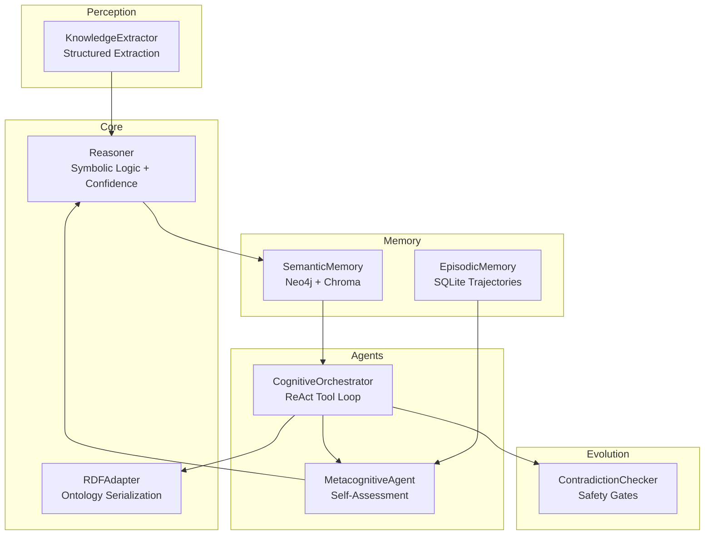
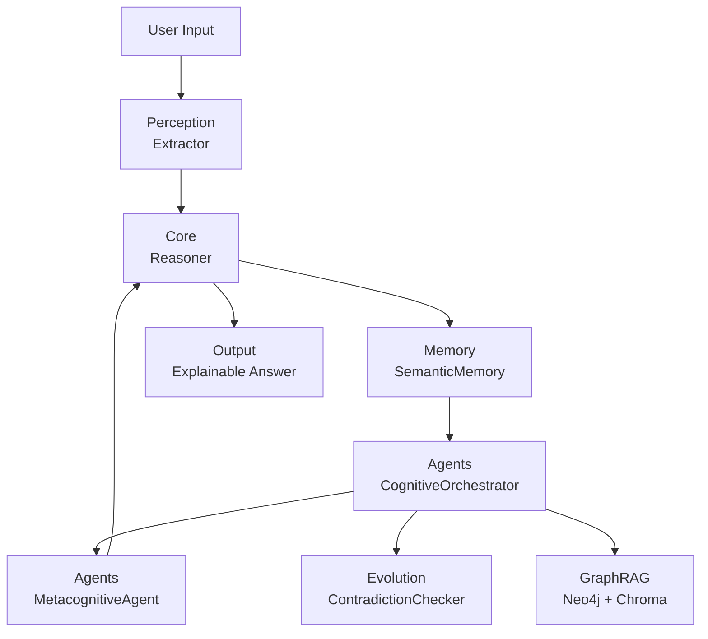
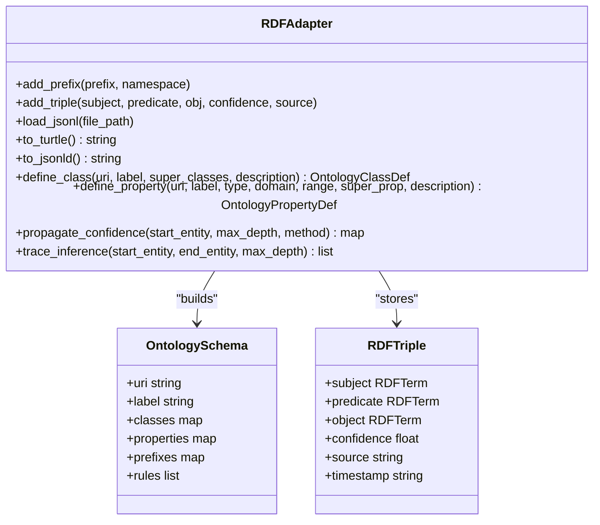
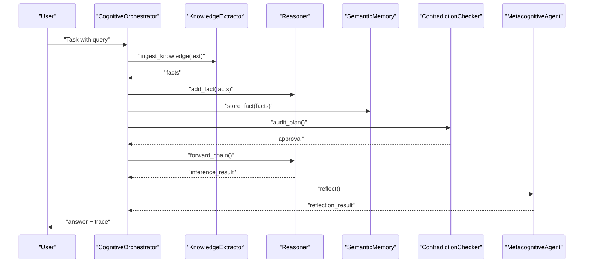
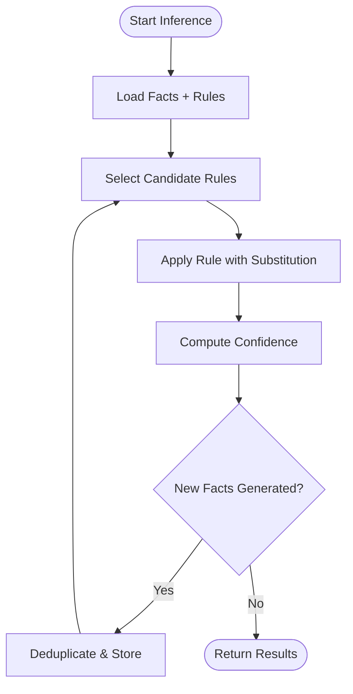
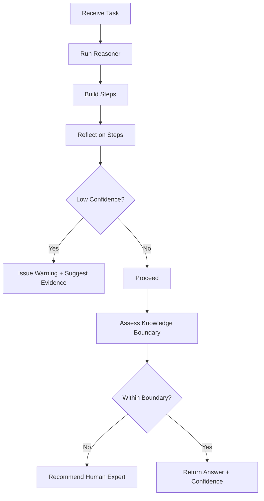
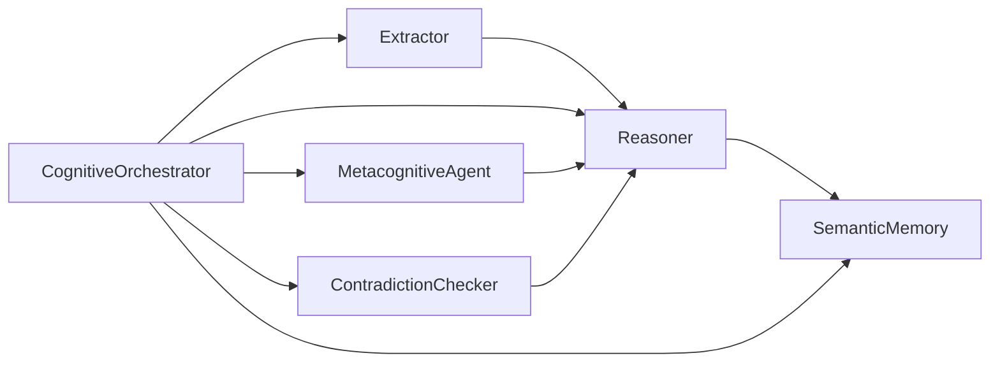

# Project Overview

<cite>
**Referenced Files in This Document**
- [docs/README.md](file://docs/README.md)
- [docs/architecture.md](file://docs/architecture.md)
- [docs/prd-v3.md](file://docs/prd-v3.md)
- [src/__init__.py](file://src/__init__.py)
- [src/core/reasoner.py](file://src/core/reasoner.py)
- [src/agents/orchestrator.py](file://src/agents/orchestrator.py)
- [src/agents/metacognition.py](file://src/agents/metacognition.py)
- [src/memory/base.py](file://src/memory/base.py)
- [src/perception/extractor.py](file://src/perception/extractor.py)
- [src/core/ontology/rdf_adapter.py](file://src/core/ontology/rdf_adapter.py)
- [src/evolution/self_correction.py](file://src/evolution/self_correction.py)
- [examples/agent_growth_demo.py](file://examples/agent_growth_demo.py)
- [examples/clawra_full_stack_demo.py](file://examples/clawra_full_stack_demo.py)
</cite>

## Table of Contents
1. [Introduction](#introduction)
2. [Project Structure](#project-structure)
3. [Core Components](#core-components)
4. [Architecture Overview](#architecture-overview)
5. [Detailed Component Analysis](#detailed-component-analysis)
6. [Dependency Analysis](#dependency-analysis)
7. [Performance Considerations](#performance-considerations)
8. [Troubleshooting Guide](#troubleshooting-guide)
9. [Conclusion](#conclusion)
10. [Appendices](#appendices)

## Introduction
Clawra: 动力学本体认知引擎 (Agent Growth SDK) is a neuro-symbolic cognitive agent framework designed to bring rigorous, deterministic reasoning to industrial and complex business scenarios. Its core philosophy is to bridge large language models with symbolic logic through:
- Dynamic Ontology: a continuously evolving knowledge graph that captures domain concepts, relationships, and constraints
- Cognitive Orchestrator: a ReAct-style agentic orchestrator that coordinates perception, reasoning, memory, and action with strict safety gates
- GraphRAG: hybrid retrieval-augmented generation that combines vector similarity with graph traversal for precise, explainable answers

Clawra achieves logical consistency and near-zero hallucination by grounding LLM outputs in structured facts, enforcing mathematical precision via a sandboxed rule engine, and maintaining explicit confidence metrics across all reasoning steps. It enables agents to learn in real-time, reason causally and logically, and express honest uncertainty—transforming agents from trained experts into growing, self-aware systems.

Practical value over traditional LLM approaches:
- Deterministic outcomes: every conclusion is traceable to facts and rules
- Zero hallucination: all claims are validated against the dynamic ontology
- Real-time learning: new concepts and rules are ingested and integrated instantly
- Explainable decisions: full reasoning chains and confidence propagation are surfaced
- Enterprise-grade safety: audits, contradictions checks, and math-safe actions

## Project Structure
The project is organized around layered cognitive capabilities:
- Perception: structured extraction of facts from unstructured text
- Core: symbolic reasoning engine with forward/backward chaining and confidence propagation
- Agents: orchestrator and metacognitive agent for reflective decision-making
- Memory: hybrid semantic memory (Neo4j + Chroma) and episodic memory for trajectory persistence
- Evolution: self-correction and knowledge distillation safeguards

**Diagram sources**
- [src/perception/extractor.py:83-350](file://src/perception/extractor.py#L83-L350)
- [src/core/reasoner.py:145-819](file://src/core/reasoner.py#L145-L819)
- [src/core/ontology/rdf_adapter.py:145-1088](file://src/core/ontology/rdf_adapter.py#L145-L1088)
- [src/agents/orchestrator.py:23-366](file://src/agents/orchestrator.py#L23-L366)
- [src/agents/metacognition.py:8-204](file://src/agents/metacognition.py#L8-L204)
- [src/memory/base.py:9-249](file://src/memory/base.py#L9-L249)
- [src/evolution/self_correction.py:7-90](file://src/evolution/self_correction.py#L7-L90)

**Section sources**
- [docs/architecture.md:1-35](file://docs/architecture.md#L1-L35)
- [docs/README.md:1-23](file://docs/README.md#L1-L23)

## Core Components
- Dynamic Ontology: JSONL-to-RDF/OWL conversion, schema modeling, and confidence-aware inference
- Cognitive Orchestrator: ReAct-style orchestration with tool-calling, GraphRAG, and safety auditing
- Reasoner: Forward/backward chaining with confidence propagation and rule indexing
- Metacognitive Agent: Self-reflection, knowledge boundary detection, and confidence calibration
- Hybrid Memory: Neo4j for graph facts, Chroma for semantic recall, SQLite for episodic trajectories
- Self-Correction: Contradiction detection and math-safe action gating

These components collectively enable:
- Structured ingestion of domain knowledge
- Deterministic, explainable reasoning
- Real-time learning and evolution
- Safe, auditable actions grounded in mathematical rules

**Section sources**
- [src/core/ontology/rdf_adapter.py:145-1088](file://src/core/ontology/rdf_adapter.py#L145-L1088)
- [src/agents/orchestrator.py:23-366](file://src/agents/orchestrator.py#L23-L366)
- [src/core/reasoner.py:145-819](file://src/core/reasoner.py#L145-L819)
- [src/agents/metacognition.py:8-204](file://src/agents/metacognition.py#L8-L204)
- [src/memory/base.py:9-249](file://src/memory/base.py#L9-L249)
- [src/evolution/self_correction.py:7-90](file://src/evolution/self_correction.py#L7-L90)

## Architecture Overview
Clawra’s architecture enforces a strict separation of concerns:
- Perception extracts structured facts from documents with schema alignment and JSON repair
- Core Reasoner performs deterministic inference with confidence propagation
- Cognitive Orchestrator coordinates tasks, enforces safety, and integrates GraphRAG
- Memory persists facts and trajectories; EpisodicMemory stores decision traces for future refinement
- Evolution ensures logical consistency and prevents unsafe actions

**Diagram sources**
- [src/perception/extractor.py:83-350](file://src/perception/extractor.py#L83-L350)
- [src/core/reasoner.py:145-819](file://src/core/reasoner.py#L145-L819)
- [src/memory/base.py:9-249](file://src/memory/base.py#L9-L249)
- [src/agents/orchestrator.py:23-366](file://src/agents/orchestrator.py#L23-L366)
- [src/evolution/self_correction.py:7-90](file://src/evolution/self_correction.py#L7-L90)

**Section sources**
- [docs/architecture.md:1-35](file://docs/architecture.md#L1-L35)

## Detailed Component Analysis

### Dynamic Ontology (RDF/OWL)
The RDF adapter converts JSONL knowledge into RDF/OWL, enabling:
- Schema definition for classes, properties, and individuals
- Serialization to Turtle/JSON-LD/N-Triples
- Confidence-aware inference and reasoning chain tracing
- In-memory confidence propagation and path tracing for explainability

**Diagram sources**
- [src/core/ontology/rdf_adapter.py:145-1088](file://src/core/ontology/rdf_adapter.py#L145-L1088)

**Section sources**
- [src/core/ontology/rdf_adapter.py:145-1088](file://src/core/ontology/rdf_adapter.py#L145-L1088)

### Cognitive Orchestrator (ReAct Tool Loop)
The orchestrator coordinates perception, reasoning, and action with safety:
- Tool definitions for knowledge ingestion, graph queries, and controlled actions
- Audit pipeline to prevent unsafe or contradictory actions
- GraphRAG integration: inject neighbors into the reasoner for precise answers
- Reflection loop to validate reasoning and prune low-quality memories

**Diagram sources**
- [src/agents/orchestrator.py:128-366](file://src/agents/orchestrator.py#L128-L366)
- [src/perception/extractor.py:278-350](file://src/perception/extractor.py#L278-L350)
- [src/core/reasoner.py:243-438](file://src/core/reasoner.py#L243-L438)
- [src/memory/base.py:91-121](file://src/memory/base.py#L91-L121)
- [src/evolution/self_correction.py:46-73](file://src/evolution/self_correction.py#L46-L73)
- [src/agents/metacognition.py:92-133](file://src/agents/metacognition.py#L92-L133)

**Section sources**
- [src/agents/orchestrator.py:23-366](file://src/agents/orchestrator.py#L23-L366)
- [src/evolution/self_correction.py:7-90](file://src/evolution/self_correction.py#L7-L90)
- [src/agents/metacognition.py:8-204](file://src/agents/metacognition.py#L8-L204)

### Reasoner (Symbolic Logic + Confidence)
The reasoner implements:
- Forward and backward chaining with rule indexing
- Pattern matching for variable-substitution rules
- Confidence calculation and propagation across inference steps
- Built-in rules for symmetry and transitivity

**Diagram sources**
- [src/core/reasoner.py:243-438](file://src/core/reasoner.py#L243-L438)
- [src/core/reasoner.py:440-560](file://src/core/reasoner.py#L440-L560)

**Section sources**
- [src/core/reasoner.py:145-819](file://src/core/reasoner.py#L145-L819)

### Metacognitive Agent (Self-Assessment + Knowledge Boundary)
The metacognitive agent:
- Reflects on reasoning steps and detects low-confidence or contradictory reasoning
- Assesses knowledge boundaries and recommends when to defer to external sources
- Calibrates confidence based on evidence quality and quantity

**Diagram sources**
- [src/agents/metacognition.py:92-172](file://src/agents/metacognition.py#L92-L172)

**Section sources**
- [src/agents/metacognition.py:8-204](file://src/agents/metacognition.py#L8-L204)

### Practical Examples Demonstrating Unique Value
- Real-time learning and integration: the growth demo shows adding new concepts, rules, and causal links, then reasoning over them with confidence propagation
- GraphRAG-powered answers: the full-stack demo demonstrates injecting graph neighbors into the reasoner and combining vector context with logical inference
- Safety-first actions: the orchestrator validates tool plans and blocks unsafe or contradictory actions before execution

**Section sources**
- [examples/agent_growth_demo.py:1-622](file://examples/agent_growth_demo.py#L1-L622)
- [examples/clawra_full_stack_demo.py:1-134](file://examples/clawra_full_stack_demo.py#L1-L134)

## Dependency Analysis
Key dependencies and relationships:
- Perception depends on extraction schemas and chunking to produce structured facts
- Reasoner depends on confidence calculators and rule sets; it interacts with memory for persistence
- Orchestrator composes extractor, reasoner, memory, auditor, and metacognitive agent
- Evolution safeguards depend on reasoner and memory to detect contradictions and enforce math-safe actions

**Diagram sources**
- [src/perception/extractor.py:83-350](file://src/perception/extractor.py#L83-L350)
- [src/core/reasoner.py:145-819](file://src/core/reasoner.py#L145-L819)
- [src/memory/base.py:9-249](file://src/memory/base.py#L9-L249)
- [src/agents/orchestrator.py:23-366](file://src/agents/orchestrator.py#L23-L366)
- [src/evolution/self_correction.py:7-90](file://src/evolution/self_correction.py#L7-L90)
- [src/agents/metacognition.py:8-204](file://src/agents/metacognition.py#L8-L204)

**Section sources**
- [src/__init__.py:1-18](file://src/__init__.py#L1-L18)

## Performance Considerations
- Asynchronous IO: orchestrator and memory operations should leverage async to handle concurrent requests
- Rule indexing: predicate-based indexing reduces rule matching cost during inference
- Confidence propagation: choose propagation method (min, arithmetic, geometric, multiplicative) based on domain risk tolerance
- GraphRAG pruning: limit injected neighbors to reduce inference overhead
- Memory governance: periodic garbage collection of low-confidence facts improves performance and accuracy

[No sources needed since this section provides general guidance]

## Troubleshooting Guide
Common issues and resolutions:
- Extraction failures: verify JSON repair logic and chunk thresholds; ensure prompt alignment with domain ontology
- Inference timeouts: adjust max depth and timeout parameters in the reasoner
- GraphRAG injection errors: confirm Neo4j connectivity and entity normalization
- Audit rejections: review rule preconditions and adjust action parameters to meet mathematical constraints
- Low confidence answers: increase evidence or refine domain prompts to improve extraction quality

**Section sources**
- [src/perception/extractor.py:122-189](file://src/perception/extractor.py#L122-L189)
- [src/core/reasoner.py:274-277](file://src/core/reasoner.py#L274-L277)
- [src/agents/orchestrator.py:268-284](file://src/agents/orchestrator.py#L268-L284)
- [src/evolution/self_correction.py:46-73](file://src/evolution/self_correction.py#L46-L73)

## Conclusion
Clawra delivers a transformative approach to cognitive agents by merging LLMs with symbolic logic, dynamic ontologies, and deterministic reasoning. Through GraphRAG, safety-gated actions, and metacognitive awareness, it eliminates hallucinations, explains decisions, and enables real-time learning—making it uniquely suited for industrial and complex business environments where correctness, traceability, and continuous growth are paramount.

[No sources needed since this section summarizes without analyzing specific files]

## Appendices

### Product Vision and Differentiation
- Vision: give every agent real growth capability—learning, reasoning, and self-awareness
- Differentiation: unlike RAG or static knowledge graphs, Clawra adds real-time learning, logical/causal reasoning, and explicit uncertainty

**Section sources**
- [docs/prd-v3.md:10-33](file://docs/prd-v3.md#L10-L33)
- [docs/prd-v3.md:190-214](file://docs/prd-v3.md#L190-L214)