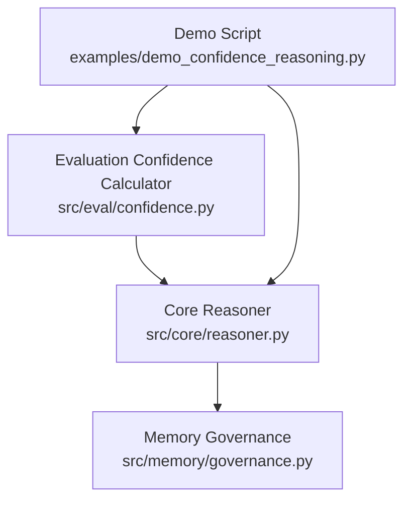
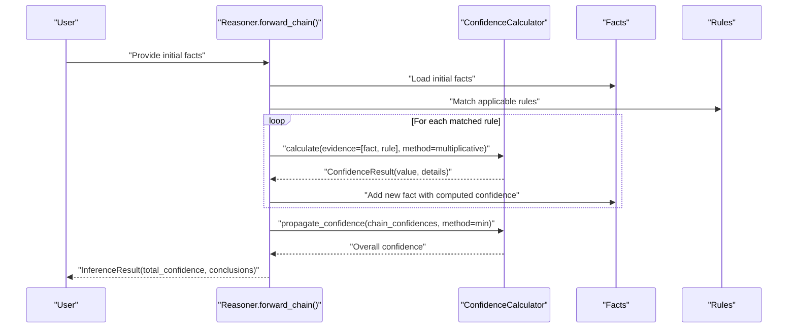
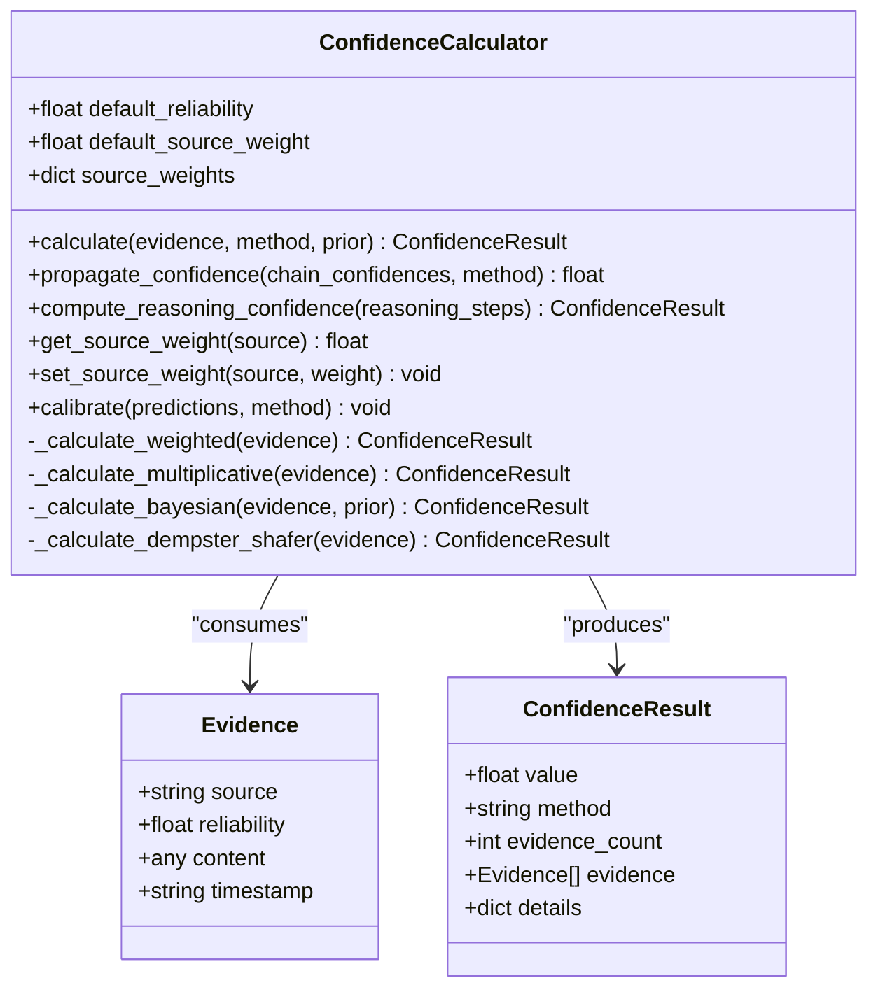
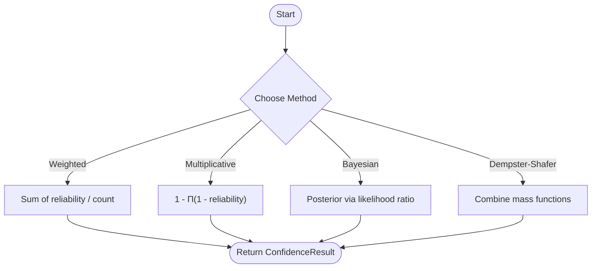
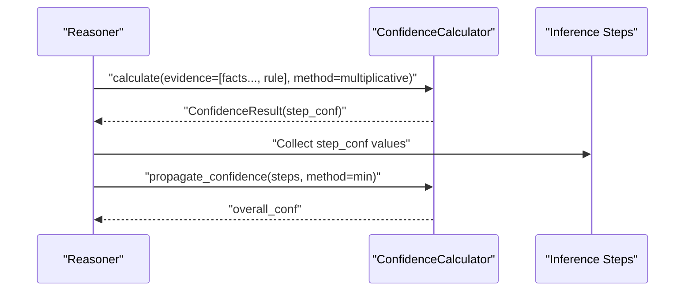
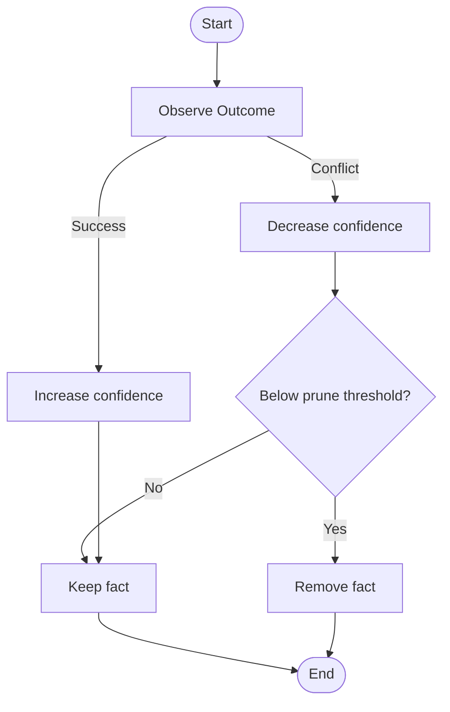
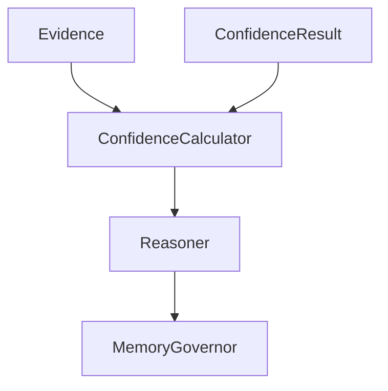

# Confidence Propagation Mechanics

<cite>
**Referenced Files in This Document**
- [confidence.py](file://src/eval/confidence.py)
- [confidence.py](file://src/confidence.py)
- [reasoner.py](file://src/core/reasoner.py)
- [governance.py](file://src/memory/governance.py)
- [demo_confidence_reasoning.py](file://examples/demo_confidence_reasoning.py)
- [test_confidence.py](file://tests/test_confidence.py)
</cite>

## Table of Contents
1. [Introduction](#introduction)
2. [Project Structure](#project-structure)
3. [Core Components](#core-components)
4. [Architecture Overview](#architecture-overview)
5. [Detailed Component Analysis](#detailed-component-analysis)
6. [Dependency Analysis](#dependency-analysis)
7. [Performance Considerations](#performance-considerations)
8. [Troubleshooting Guide](#troubleshooting-guide)
9. [Conclusion](#conclusion)

## Introduction
This document explains the confidence propagation and uncertainty management system implemented in the platform. It covers the mathematical foundations of confidence calculation, evidence aggregation algorithms, and uncertainty quantification methods. It documents multiplicative confidence combination, weighted averaging strategies, and minimum confidence propagation techniques. It also includes detailed examples of confidence computation for complex inference chains, evidence source reliability assessment, and confidence decay mechanisms. The guide addresses integration with the confidence calculator module, evidence chain construction, confidence result interpretation, edge cases, numerical stability considerations, and performance optimization for confidence calculations.

## Project Structure
The confidence propagation system spans three primary modules:
- Evaluation confidence calculator: robust multi-method confidence computation and propagation
- Core reasoner: integrates confidence into forward/backward inference chains
- Memory governance: applies confidence decay and pruning to maintain knowledge quality

**Diagram sources**
- [confidence.py:32-294](file://src/eval/confidence.py#L32-L294)
- [reasoner.py:243-349](file://src/core/reasoner.py#L243-L349)
- [governance.py:6-46](file://src/memory/governance.py#L6-L46)
- [demo_confidence_reasoning.py:19-185](file://examples/demo_confidence_reasoning.py#L19-L185)

**Section sources**
- [confidence.py:1-407](file://src/eval/confidence.py#L1-L407)
- [reasoner.py:1-819](file://src/core/reasoner.py#L1-L819)
- [governance.py:1-62](file://src/memory/governance.py#L1-L62)
- [demo_confidence_reasoning.py:1-185](file://examples/demo_confidence_reasoning.py#L1-L185)

## Core Components
- Evidence model: encapsulates a single piece of supporting data with source, reliability, and content
- ConfidenceResult: standardized result container with value, method, counts, and optional details
- ConfidenceCalculator: multi-method engine for evidence aggregation and propagation
- Reasoner: inference engine that constructs evidence chains and propagates confidence across steps
- MemoryGovernor: applies confidence decay and pruning to keep the knowledge base healthy

Key capabilities:
- Evidence aggregation via weighted averaging, multiplicative synthesis, Bayesian updating, and Dempster–Shafer fusion
- Propagation along inference chains using minimum, arithmetic mean, geometric mean, and multiplicative strategies
- Calibration hooks for post-hoc confidence adjustments
- Confidence decay and pruning to manage long-term knowledge quality

**Section sources**
- [confidence.py:13-29](file://src/eval/confidence.py#L13-L29)
- [confidence.py:32-294](file://src/eval/confidence.py#L32-L294)
- [reasoner.py:243-349](file://src/core/reasoner.py#L243-L349)
- [governance.py:6-46](file://src/memory/governance.py#L6-L46)

## Architecture Overview
The system integrates confidence computation into the reasoning pipeline. Evidence is collected from facts and rules, aggregated into a confidence score per step, and then propagated across the chain using conservative strategies to preserve uncertainty.

**Diagram sources**
- [reasoner.py:243-349](file://src/core/reasoner.py#L243-L349)
- [confidence.py:60-95](file://src/eval/confidence.py#L60-L95)
- [confidence.py:146-164](file://src/eval/confidence.py#L146-L164)

## Detailed Component Analysis

### ConfidenceCalculator: Mathematical Foundations and Methods
- Evidence aggregation methods:
  - Weighted averaging: combines reliability scores with optional source weights
  - Multiplicative synthesis: aggregates reliability using complement products
  - Bayesian updating: updates prior beliefs using likelihood ratios
  - Dempster–Shafer fusion: combines belief assignments under uncertainty
- Propagation strategies:
  - Minimum: conservative lower bound across steps
  - Arithmetic/geometric/multiplicative means: alternative propagation modes
- Source weighting: per-source reliability modifiers to reflect trustworthiness
- Calibration hooks: placeholders for post-hoc confidence recalibration

**Diagram sources**
- [confidence.py:13-29](file://src/eval/confidence.py#L13-L29)
- [confidence.py:32-294](file://src/eval/confidence.py#L32-L294)

**Section sources**
- [confidence.py:32-294](file://src/eval/confidence.py#L32-L294)

### Evidence Aggregation Algorithms
- Weighted averaging:
  - Computes a normalized weighted sum of reliability values
  - Incorporates optional per-source weights to reflect trust
- Multiplicative synthesis:
  - Aggregates reliability using complement probabilities
  - Suitable for combining independent confirmatory signals
- Bayesian updating:
  - Converts reliability to likelihood ratio and updates prior
  - Numerically clamps results to [0, 1]
- Dempster–Shafer fusion:
  - Maintains mass assignments across truth, falsehood, and unknown
  - Combines evidence using canonical combination rules

**Diagram sources**
- [confidence.py:97-164](file://src/eval/confidence.py#L97-L164)
- [confidence.py:114-144](file://src/eval/confidence.py#L114-L144)
- [confidence.py:166-217](file://src/eval/confidence.py#L166-L217)

**Section sources**
- [confidence.py:97-217](file://src/eval/confidence.py#L97-L217)

### Multiplicative Confidence Combination and Propagation
- Multiplicative combination:
  - Combines multiple evidences by aggregating complement probabilities
  - Emphasizes convergence toward certainty with strong confirmatory signals
- Propagation across inference steps:
  - Minimum propagation preserves conservativeness
  - Alternative arithmetic/geometric/multiplicative propagation available
- Integration in reasoning:
  - Forward chain builds evidence chains from facts and rules
  - Each step computes confidence, then overall confidence is propagated

**Diagram sources**
- [reasoner.py:294-349](file://src/core/reasoner.py#L294-L349)
- [confidence.py:146-164](file://src/eval/confidence.py#L146-L164)
- [confidence.py:219-256](file://src/eval/confidence.py#L219-L256)

**Section sources**
- [reasoner.py:294-349](file://src/core/reasoner.py#L294-L349)
- [confidence.py:219-256](file://src/eval/confidence.py#L219-L256)

### Uncertainty Quantification and Interpretation
- ConfidenceResult provides:
  - value: scalar confidence in [0, 1]
  - method: chosen aggregation method
  - evidence_count: number of contributing evidences
  - evidence: list of Evidence objects
  - details: optional diagnostics (e.g., prior, likelihood ratio, mass assignments)
- Interpretation guidelines:
  - High value indicates strong support across evidences
  - Low value suggests weak or conflicting evidence
  - Details help diagnose sensitivity to priors or mass distributions

**Section sources**
- [confidence.py:21-29](file://src/eval/confidence.py#L21-L29)
- [confidence.py:138-144](file://src/eval/confidence.py#L138-L144)
- [confidence.py:211-217](file://src/eval/confidence.py#L211-L217)

### Confidence Decay and Knowledge Governance
- MemoryGovernor applies:
  - Confidence decay on negative outcomes
  - Reinforcement on successful paths
  - Pruning for facts below a threshold
- Tunable parameters:
  - decay_rate: decrement per penalty
  - reinforce_rate: increment per reinforcement
  - prune_threshold: removal cutoff
- Garbage collection periodically removes low-confidence facts

**Diagram sources**
- [governance.py:20-46](file://src/memory/governance.py#L20-L46)

**Section sources**
- [governance.py:6-46](file://src/memory/governance.py#L6-L46)

### Integration with Reasoner and Evidence Chain Construction
- Forward chain:
  - Builds evidence chains from matched facts and rules
  - Creates Evidence entries for each premise and rule
  - Aggregates per-step confidence and propagates overall confidence
- Backward chain:
  - Constructs goals and preconditions
  - Aggregates confidence across derivation paths
- Result packaging:
  - InferenceResult includes conclusions, facts used, depth, and total_confidence

**Section sources**
- [reasoner.py:243-349](file://src/core/reasoner.py#L243-L349)
- [reasoner.py:351-438](file://src/core/reasoner.py#L351-L438)

### Examples and Usage Patterns
- Basic confidence computation with multiple sources
- Evidence analysis highlighting quality effects
- Business scenario evaluation with high/low confidence
- Auto-learning feedback loops adjusting source weights

**Section sources**
- [demo_confidence_reasoning.py:22-151](file://examples/demo_confidence_reasoning.py#L22-L151)

## Dependency Analysis
- ConfidenceCalculator depends on Evidence and ConfidenceResult data structures
- Reasoner composes ConfidenceCalculator to compute per-step and overall confidence
- MemoryGovernor modifies fact confidence values to enforce long-term coherence
- Tests validate core behaviors and edge cases

**Diagram sources**
- [confidence.py:13-29](file://src/eval/confidence.py#L13-L29)
- [confidence.py:32-294](file://src/eval/confidence.py#L32-L294)
- [reasoner.py:173-173](file://src/core/reasoner.py#L173-L173)
- [governance.py:13-18](file://src/memory/governance.py#L13-L18)

**Section sources**
- [test_confidence.py:8-61](file://tests/test_confidence.py#L8-L61)

## Performance Considerations
- Computational complexity:
  - Weighted averaging and multiplicative synthesis scale linearly with evidence count
  - Bayesian and Dempster–Shafer computations involve iterative combinations
- Numerical stability:
  - Clamp posteriors to [0, 1] in Bayesian updates
  - Use complement probabilities to avoid catastrophic cancellation in multiplicative synthesis
- Practical tips:
  - Prefer multiplicative combination for confirmatory signals
  - Use minimum propagation for conservative reasoning chains
  - Apply source weights judiciously to avoid overfitting to trusted sources

[No sources needed since this section provides general guidance]

## Troubleshooting Guide
Common issues and resolutions:
- Zero or invalid reliability values:
  - Ensure reliability is in [0, 1]; otherwise, aggregation may produce unexpected results
- Empty evidence lists:
  - The calculator returns zero confidence for empty inputs
- Conflicting evidence:
  - Multiplicative synthesis will decrease confidence; consider Bayesian or Dempster–Shafer fusion for nuanced handling
- Low overall confidence:
  - Review per-step confidences and propagation method; switch to arithmetic or geometric mean if conservativeness is undesired
- Memory bloat:
  - Use MemoryGovernor to decay and prune low-confidence facts

**Section sources**
- [confidence.py:79-84](file://src/eval/confidence.py#L79-L84)
- [governance.py:33-46](file://src/memory/governance.py#L33-L46)

## Conclusion
The confidence propagation system provides a principled framework for uncertainty-aware reasoning. By combining multiple evidence sources, applying robust aggregation methods, and conservatively propagating confidence across inference chains, the system yields reliable and interpretable results. Long-term knowledge quality is maintained through confidence decay and pruning. The modular design enables easy extension with additional methods and calibration strategies.