# Core Inference Algorithms

<cite>
**Referenced Files in This Document**
- [reasoner.py](file://src/core/reasoner.py)
- [rule_engine.py](file://src/core/ontology/rule_engine.py)
- [actions.py](file://src/core/ontology/actions.py)
- [auto_learn.py](file://src/core/ontology/auto_learn.py)
- [rdf_adapter.py](file://src/core/ontology/rdf_adapter.py)
- [test_reasoner.py](file://tests/test_reasoner.py)
- [test_rule_engine.py](file://tests/test_rule_engine.py)
</cite>

## Table of Contents
1. [Introduction](#introduction)
2. [Project Structure](#project-structure)
3. [Core Components](#core-components)
4. [Architecture Overview](#architecture-overview)
5. [Detailed Component Analysis](#detailed-component-analysis)
6. [Dependency Analysis](#dependency-analysis)
7. [Performance Considerations](#performance-considerations)
8. [Troubleshooting Guide](#troubleshooting-guide)
9. [Conclusion](#conclusion)
10. [Appendices](#appendices)

## Introduction
This document focuses on the core inference algorithms implemented in the platform’s rule-based reasoning subsystem. It explains forward chaining and backward chaining mechanisms, the pattern matching system for variable substitution, rule application logic, and fact derivation processes. It also covers the mathematical foundations of rule-based inference, variable unification, constraint satisfaction, and practical examples of rule patterns and inference execution. Finally, it documents circuit breaker mechanisms to prevent infinite loops and resource exhaustion, along with optimization strategies for large-scale knowledge bases and memory management during inference.

## Project Structure
The inference-related logic spans several modules:
- Rule-based reasoning engine with forward/backward chaining and confidence propagation
- Ontology rule engine with safe mathematical evaluation and conflict detection
- Action registry linking rules to executable actions
- RDF adapter enabling graph-based reasoning and inference tracing
- Active learning engine for iterative knowledge enrichment

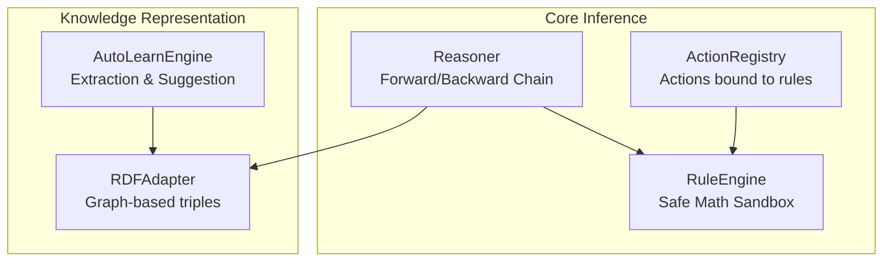

**Diagram sources**
- [reasoner.py:145-819](file://src/core/reasoner.py#L145-L819)
- [rule_engine.py:124-331](file://src/core/ontology/rule_engine.py#L124-L331)
- [actions.py:24-70](file://src/core/ontology/actions.py#L24-L70)
- [rdf_adapter.py:145-800](file://src/core/ontology/rdf_adapter.py#L145-L800)
- [auto_learn.py:77-405](file://src/core/ontology/auto_learn.py#L77-L405)

**Section sources**
- [reasoner.py:1-120](file://src/core/reasoner.py#L1-L120)
- [rule_engine.py:1-130](file://src/core/ontology/rule_engine.py#L1-L130)
- [actions.py:1-70](file://src/core/ontology/actions.py#L1-L70)
- [rdf_adapter.py:1-120](file://src/core/ontology/rdf_adapter.py#L1-L120)
- [auto_learn.py:1-120](file://src/core/ontology/auto_learn.py#L1-L120)

## Core Components
- Reasoner: Implements forward chaining, backward chaining, pattern matching, rule application, and confidence propagation. It includes built-in rules for transitivity and symmetry and supports rule indexing and caching.
- RuleEngine: Provides a safe mathematical sandbox for evaluating numeric/logical expressions against context, with conflict detection and audit trails.
- ActionRegistry: Links actions to specific rules and object classes, enabling preconditions enforcement prior to action execution.
- RDFAdapter: Converts knowledge to RDF triples, supports graph traversal, inference path tracing, and confidence propagation across edges.
- AutoLearnEngine: Extracts entities and relations from text, suggests missing knowledge, and upgrades confidence levels to grow the knowledge base iteratively.

**Section sources**
- [reasoner.py:145-819](file://src/core/reasoner.py#L145-L819)
- [rule_engine.py:124-331](file://src/core/ontology/rule_engine.py#L124-L331)
- [actions.py:24-70](file://src/core/ontology/actions.py#L24-L70)
- [rdf_adapter.py:145-800](file://src/core/ontology/rdf_adapter.py#L145-L800)
- [auto_learn.py:77-405](file://src/core/ontology/auto_learn.py#L77-L405)

## Architecture Overview
The inference pipeline integrates rule-based reasoning with graph-based knowledge representation and action gating:

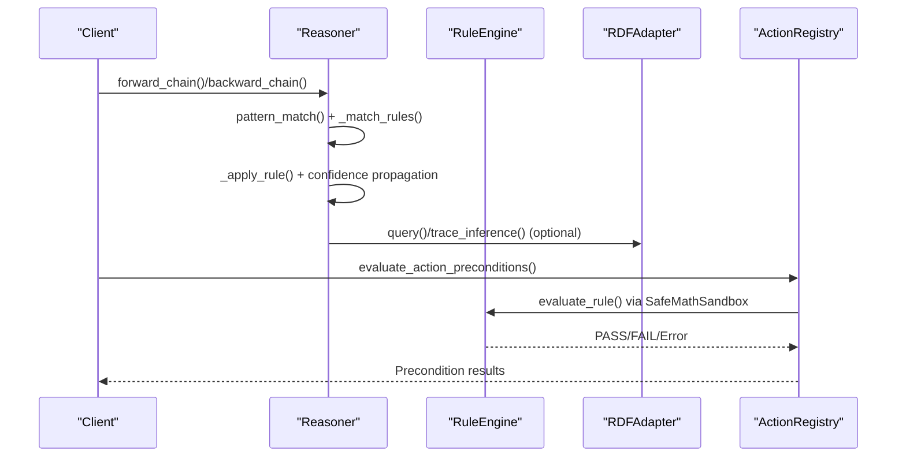

**Diagram sources**
- [reasoner.py:243-438](file://src/core/reasoner.py#L243-L438)
- [rule_engine.py:303-331](file://src/core/ontology/rule_engine.py#L303-L331)
- [actions.py:58-69](file://src/core/ontology/actions.py#L58-L69)
- [rdf_adapter.py:537-754](file://src/core/ontology/rdf_adapter.py#L537-L754)

## Detailed Component Analysis

### Forward Chaining Mechanism
Forward chaining starts from known facts and applies rules to derive new facts until no new facts can be generated or a depth/time limit is reached.

Key steps:
- Initialize working memory with initial facts
- For each iteration up to max_depth:
  - Iterate over working facts
  - Match applicable rules using pattern matching
  - Apply rule to produce conclusion fact
  - Compute confidence from rule and premise evidences
  - Record inference step and avoid duplicates
- Aggregate overall confidence across derived steps

Circuit breaker:
- Enforces a timeout per iteration to prevent runaway inference
- Logs a circuit-breaker-triggered warning when exceeded

Complexity:
- Time: O(F × R × P) per iteration, where F is number of facts, R is number of rules, P is average pattern matches per rule
- Space: O(F + D) where D is newly derived facts stored

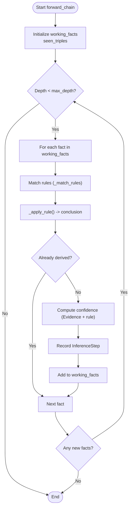

**Diagram sources**
- [reasoner.py:243-349](file://src/core/reasoner.py#L243-L349)

**Section sources**
- [reasoner.py:243-349](file://src/core/reasoner.py#L243-L349)

### Backward Chaining Mechanism
Backward chaining starts from a goal and searches for rules whose conclusions unify with the goal, then recursively proves antecedents. The implementation uses breadth-first search with a queue of (goal, depth, path).

Key steps:
- Queue holds (goal, depth, path)
- While queue not empty and under timeout:
  - Pop current goal
  - If depth exceeds max_depth, skip
  - If goal matches existing facts, record as proven
  - Else, find rules whose conclusion can unify with goal
  - For each such rule, extract antecedents and enqueue them
- Aggregate confidence across proven paths

Circuit breaker:
- Enforces a global timeout to prevent infinite recursion or large search spaces

Complexity:
- Time: O(branching_factor^depth) in worst case; bounded by max_depth and timeout
- Space: O(branching_factor × depth) for queue and path storage

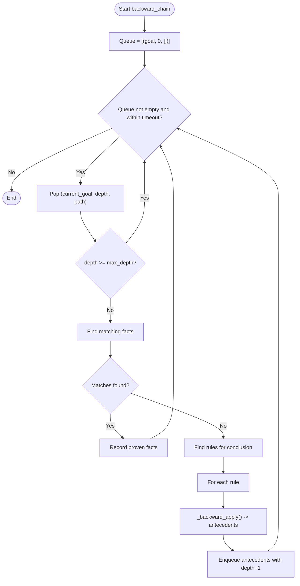

**Diagram sources**
- [reasoner.py:351-438](file://src/core/reasoner.py#L351-L438)

**Section sources**
- [reasoner.py:351-438](file://src/core/reasoner.py#L351-L438)

### Pattern Matching and Variable Unification
Pattern matching supports simple Horn-like rules with variables. The system:
- Parses rule conditions into subject/predicate/object parts
- Matches predicates exactly
- Substitutes variables with grounded values from facts
- Applies rule conclusion by replacing variables with substitutions

Unification:
- Occurs implicitly via variable-to-value mapping during pattern match
- Ensures consistent variable bindings across a rule’s condition and conclusion

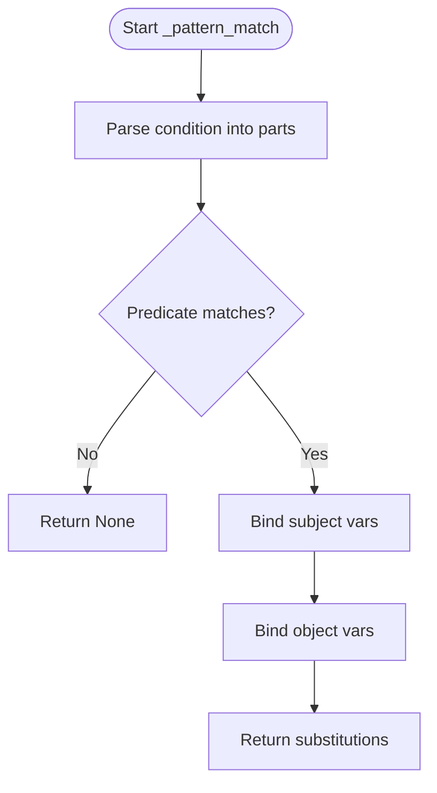

**Diagram sources**
- [reasoner.py:478-509](file://src/core/reasoner.py#L478-L509)

**Section sources**
- [reasoner.py:478-509](file://src/core/reasoner.py#L478-L509)

### Rule Application Logic and Fact Derivation
Rule application transforms matched facts into new facts according to rule type:
- Built-in transitivity: given (X,P,Y) and (Y,P,Z), derive (X,P,Z)
- Built-in symmetry: given (X,P,Y), derive (Y,P,X) for symmetric properties
- General if-then rules: replace variables in conclusion with substitutions and parse resulting triple

Confidence propagation:
- Evidence includes premise facts and the rule itself
- Confidence calculator aggregates reliability using configurable methods

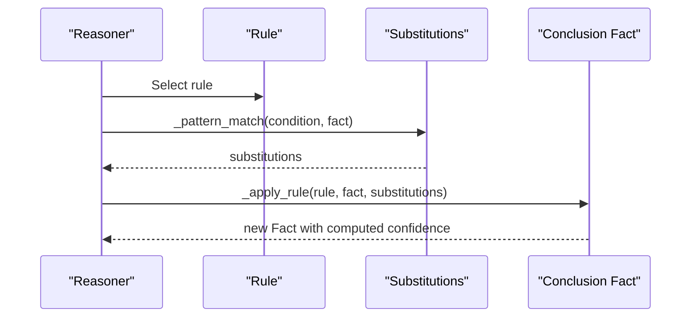

**Diagram sources**
- [reasoner.py:511-559](file://src/core/reasoner.py#L511-L559)

**Section sources**
- [reasoner.py:511-559](file://src/core/reasoner.py#L511-L559)

### Constraint Satisfaction and Mathematical Evaluation
The rule engine provides a safe sandbox for evaluating numeric/logical expressions against a context. It:
- Parses expressions using AST
- Supports arithmetic, comparison, logical, and selected math functions
- Rejects unsafe constructs (e.g., lambda)
- Detects conflicts between rules targeting the same object class by shared variables

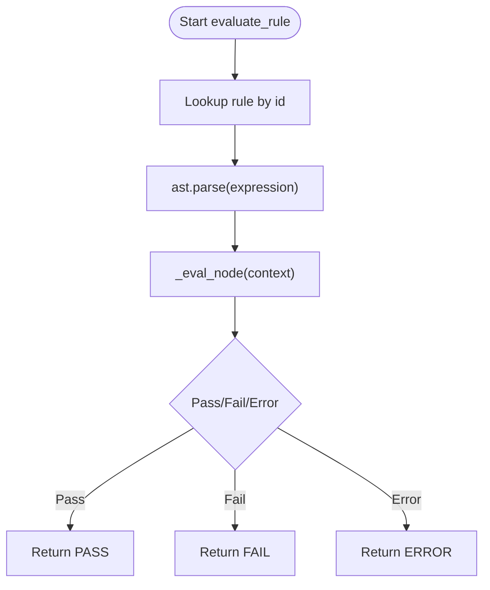

**Diagram sources**
- [rule_engine.py:32-85](file://src/core/ontology/rule_engine.py#L32-L85)
- [rule_engine.py:303-318](file://src/core/ontology/rule_engine.py#L303-L318)

**Section sources**
- [rule_engine.py:14-85](file://src/core/ontology/rule_engine.py#L14-L85)
- [rule_engine.py:303-318](file://src/core/ontology/rule_engine.py#L303-L318)

### Graph-Based Inference Tracing and Confidence Propagation
The RDF adapter enables:
- Traversing the knowledge graph to trace inference paths
- Computing path confidence by multiplying edge confidences
- Propagating confidence across reachable entities with configurable methods

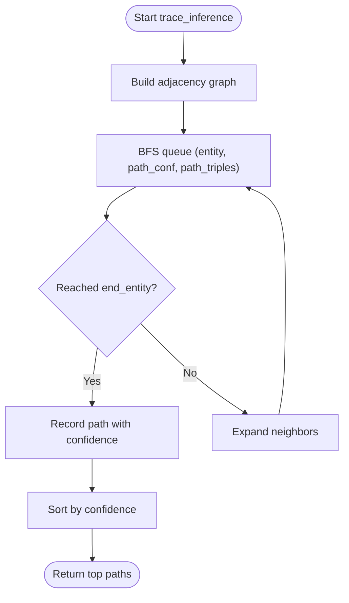

**Diagram sources**
- [rdf_adapter.py:687-754](file://src/core/ontology/rdf_adapter.py#L687-L754)

**Section sources**
- [rdf_adapter.py:617-777](file://src/core/ontology/rdf_adapter.py#L617-L777)

### Action Precondition Enforcement
Actions are linked to specific rules and object classes. Before executing an action, the system evaluates all relevant rules against the current context to ensure safety and correctness.

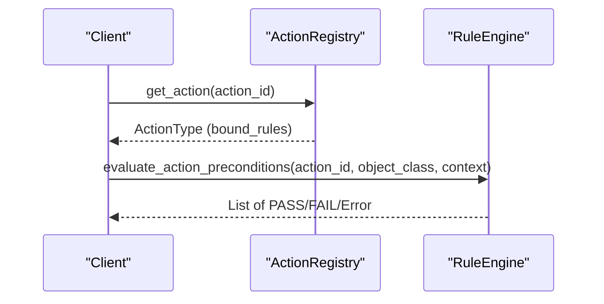

**Diagram sources**
- [actions.py:58-69](file://src/core/ontology/actions.py#L58-L69)
- [rule_engine.py:320-331](file://src/core/ontology/rule_engine.py#L320-L331)

**Section sources**
- [actions.py:24-70](file://src/core/ontology/actions.py#L24-L70)
- [rule_engine.py:320-331](file://src/core/ontology/rule_engine.py#L320-L331)

### Active Learning and Knowledge Enrichment
The active learning engine extracts entities and relations from user input, suggests missing knowledge, and upgrades confidence levels to grow the knowledge base iteratively.

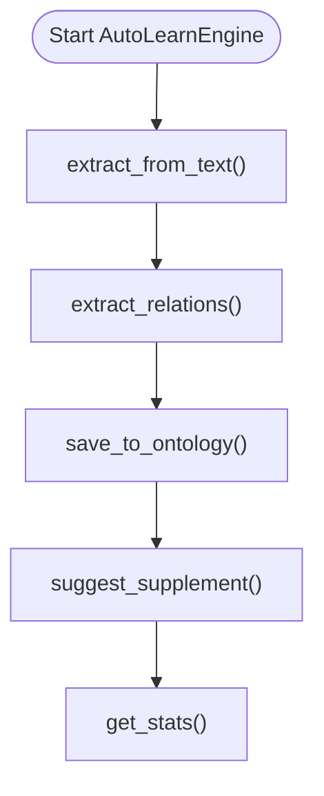

**Diagram sources**
- [auto_learn.py:191-375](file://src/core/ontology/auto_learn.py#L191-L375)

**Section sources**
- [auto_learn.py:77-405](file://src/core/ontology/auto_learn.py#L77-L405)

## Dependency Analysis
- Reasoner depends on:
  - ConfidenceCalculator for reliability aggregation
  - Built-in rules for transitivity and symmetry
  - Optional RDFAdapter for graph-based queries and tracing
- RuleEngine depends on SafeMathSandbox for expression evaluation and maintains an audit trail
- ActionRegistry depends on RuleEngine to enforce preconditions
- RDFAdapter supports graph-based reasoning and inference tracing
- AutoLearnEngine interacts with RDFAdapter to persist and query knowledge

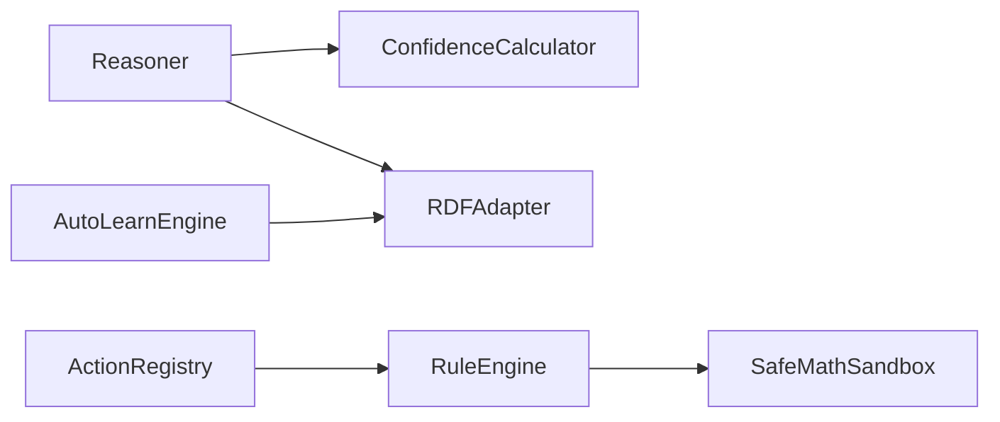

**Diagram sources**
- [reasoner.py:162-180](file://src/core/reasoner.py#L162-L180)
- [rule_engine.py:124-139](file://src/core/ontology/rule_engine.py#L124-L139)
- [actions.py:24-69](file://src/core/ontology/actions.py#L24-L69)
- [rdf_adapter.py:145-189](file://src/core/ontology/rdf_adapter.py#L145-L189)
- [auto_learn.py:127-142](file://src/core/ontology/auto_learn.py#L127-L142)

**Section sources**
- [reasoner.py:162-180](file://src/core/reasoner.py#L162-L180)
- [rule_engine.py:124-139](file://src/core/ontology/rule_engine.py#L124-L139)
- [actions.py:24-69](file://src/core/ontology/actions.py#L24-L69)
- [rdf_adapter.py:145-189](file://src/core/ontology/rdf_adapter.py#L145-L189)
- [auto_learn.py:127-142](file://src/core/ontology/auto_learn.py#L127-L142)

## Performance Considerations
- Complexity:
  - Forward chaining: O(F × R × P) per iteration; bounded by max_depth and timeout
  - Backward chaining: exponential in worst case; bounded by max_depth and timeout
  - RuleEngine evaluation: O(|expression|) via AST traversal
- Memory:
  - Working memory stores derived facts; deduplication prevents blow-up
  - Indexing by predicate improves rule matching speed
- Optimization strategies:
  - Use rule indexing and predicate-based filtering to reduce candidate rules
  - Limit max_depth and enforce timeouts to cap computation
  - Cache inference results keyed by derived triple sets
  - Prefer breadth-first search for backward chaining to find shortest paths
  - Use graph traversal with early termination when confidence thresholds are met
- Large-scale knowledge bases:
  - Partition rules by target classes and predicates
  - Batch process facts and apply rules incrementally
  - Use incremental updates to avoid recomputation
  - Employ external graph databases for scalable traversal and pathfinding

[No sources needed since this section provides general guidance]

## Troubleshooting Guide
Common issues and remedies:
- Infinite loops in backward chaining:
  - Ensure cycles are avoided by tracking visited nodes and path duplication
  - Enforce strict max_depth and timeout
- Slow forward chaining:
  - Reduce rule set or index rules by predicate
  - Limit max_depth and enable early stopping when no new facts are produced
- Rule evaluation failures:
  - Verify variable names in context match those in the expression
  - Confirm expression syntax and supported operators/functions
- Action precondition failures:
  - Inspect bound rules and adjust context values accordingly
  - Review rule history for recent changes

**Section sources**
- [reasoner.py:272-277](file://src/core/reasoner.py#L272-L277)
- [reasoner.py:376-382](file://src/core/reasoner.py#L376-L382)
- [rule_engine.py:50-55](file://src/core/ontology/rule_engine.py#L50-L55)
- [actions.py:58-69](file://src/core/ontology/actions.py#L58-L69)

## Conclusion
The platform’s inference system combines rule-based reasoning with graph-based knowledge representation and action gating. Forward and backward chaining are implemented with robust pattern matching, variable substitution, and confidence propagation. Circuit breakers and timeouts protect against infinite loops and excessive resource usage. The SafeMathSandbox ensures deterministic evaluation of numeric constraints, while the RDF adapter enables inference tracing and confidence propagation across the knowledge graph. Together, these components form a scalable, auditable, and extensible inference framework suitable for industrial applications.

[No sources needed since this section summarizes without analyzing specific files]

## Appendices

### Concrete Examples

- Rule patterns:
  - Transitivity: (X,P,Y) and (Y,P,Z) => (X,P,Z)
  - Symmetry: (X,P,Y) => (Y,P,X) for symmetric properties
  - If-then: condition pattern with variables unified against facts

- Fact matching scenarios:
  - Predicate exact match with optional variable placeholders
  - Deduplication prevents repeated derivations

- Inference step-by-step execution:
  - Pattern match yields substitutions
  - Rule application produces conclusion fact
  - Confidence aggregated from premises and rule reliability
  - Step recorded with evidence chain

**Section sources**
- [reasoner.py:183-205](file://src/core/reasoner.py#L183-L205)
- [reasoner.py:478-509](file://src/core/reasoner.py#L478-L509)
- [reasoner.py:511-559](file://src/core/reasoner.py#L511-L559)
- [test_reasoner.py:103-172](file://tests/test_reasoner.py#L103-L172)