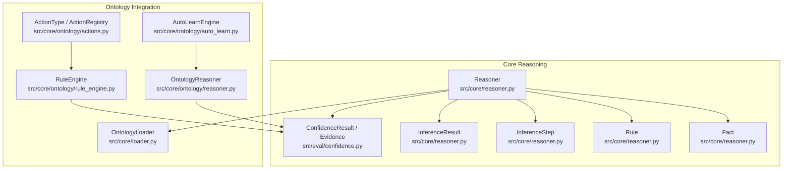
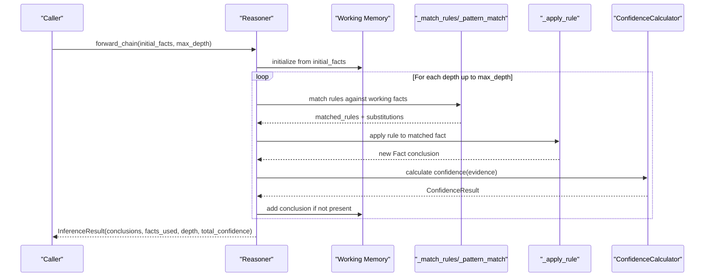
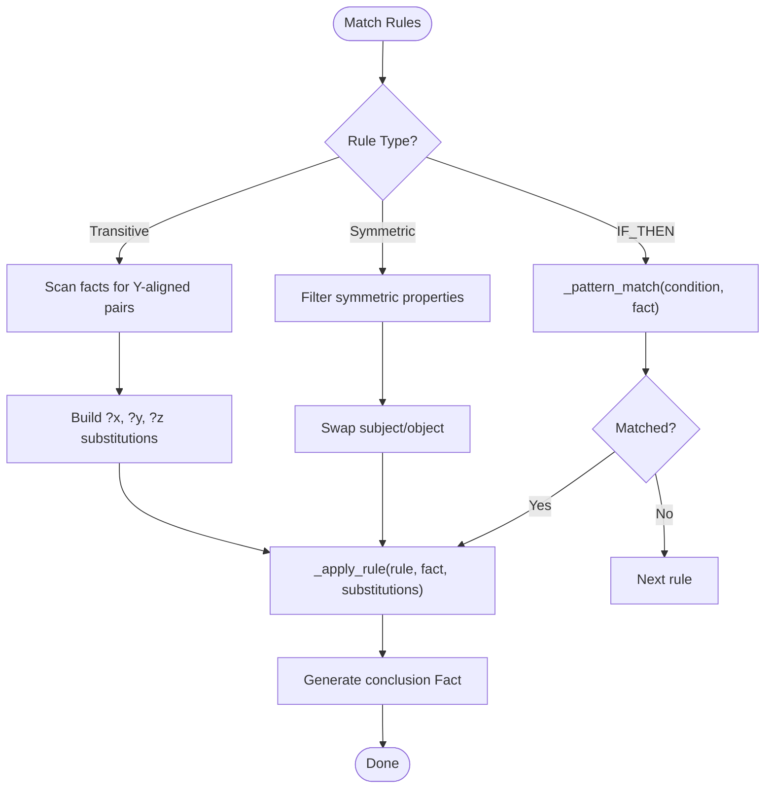
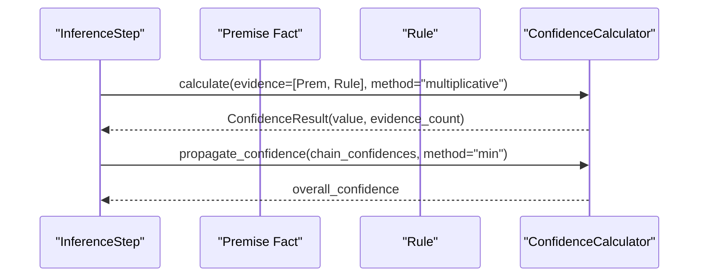
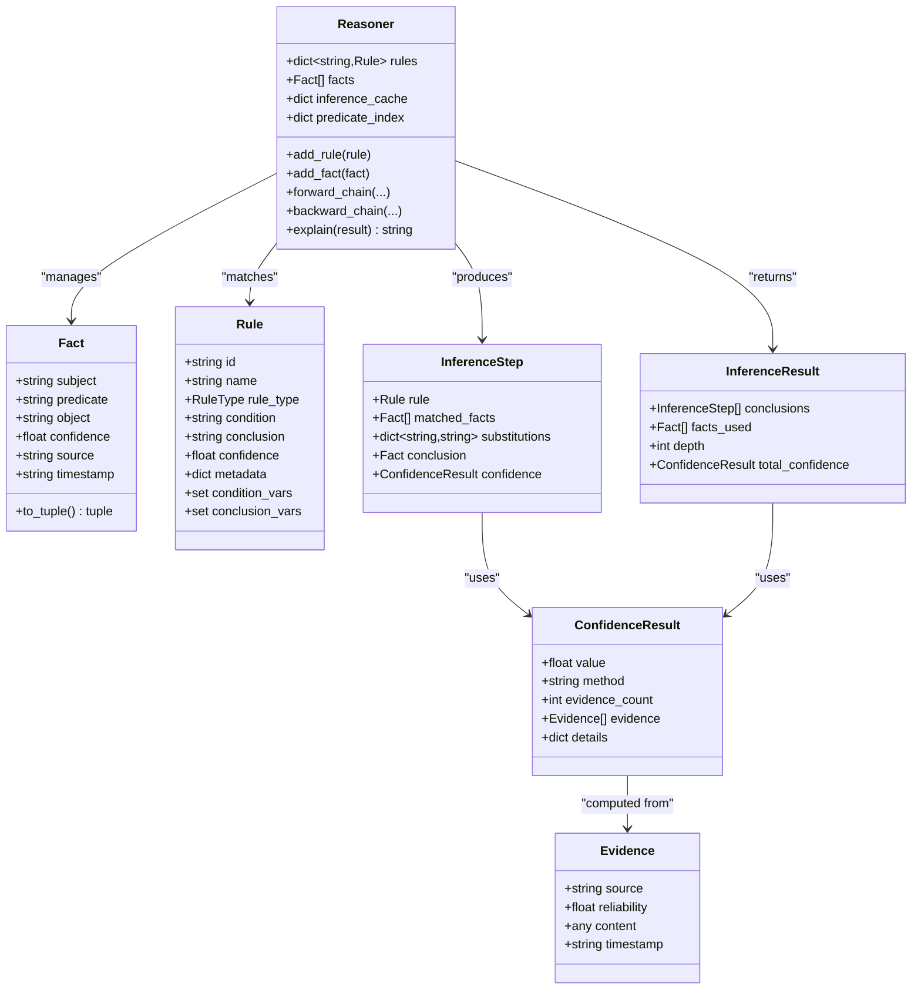
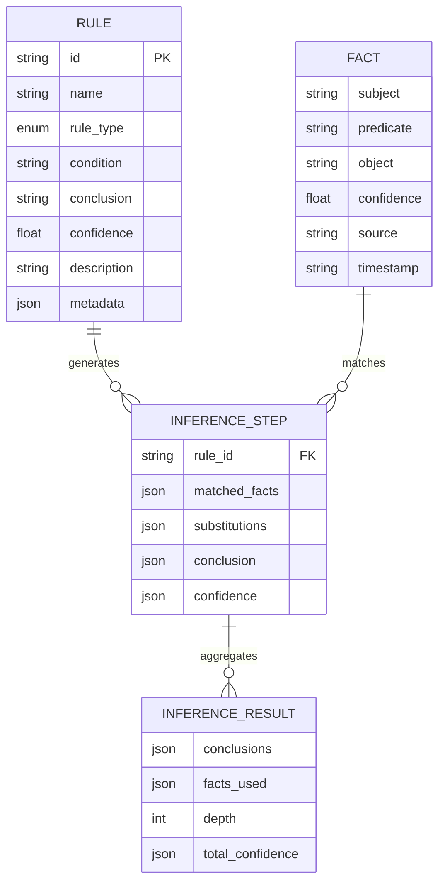

# Inference Data Structures

<cite>
**Referenced Files in This Document**
- [reasoner.py](file://src/core/reasoner.py)
- [confidence.py](file://src/eval/confidence.py)
- [loader.py](file://src/core/loader.py)
- [rule_engine.py](file://src/core/ontology/rule_engine.py)
- [actions.py](file://src/core/ontology/actions.py)
- [auto_learn.py](file://src/core/ontology/auto_learn.py)
</cite>

## Table of Contents
1. [Introduction](#introduction)
2. [Project Structure](#project-structure)
3. [Core Components](#core-components)
4. [Architecture Overview](#architecture-overview)
5. [Detailed Component Analysis](#detailed-component-analysis)
6. [Dependency Analysis](#dependency-analysis)
7. [Performance Considerations](#performance-considerations)
8. [Troubleshooting Guide](#troubleshooting-guide)
9. [Conclusion](#conclusion)
10. [Appendices](#appendices)

## Introduction
This document focuses on the core data structures used in reasoning operations: Fact, Rule, InferenceStep, and InferenceResult. It explains how facts are represented as subject-predicate-object triples, how rules encode patterns and transformations, and how inference traces are recorded. It also covers working memory management, deduplication, predicate indexing, variable substitution dictionaries, confidence propagation, and inference cache strategies. Finally, it provides usage patterns, serialization formats, memory optimization techniques, and performance/scalability considerations for large knowledge bases.

## Project Structure
The reasoning data structures are primarily defined in the core reasoner module and supported by confidence computation utilities. Additional modules integrate with the broader system for rule evaluation, action gating, and learning.

**Diagram sources**
- [reasoner.py:93-142](file://src/core/reasoner.py#L93-L142)
- [confidence.py:13-30](file://src/eval/confidence.py#L13-L30)
- [loader.py:13-41](file://src/core/loader.py#L13-L41)
- [rule_engine.py:88-123](file://src/core/ontology/rule_engine.py#L88-L123)
- [actions.py:7-23](file://src/core/ontology/actions.py#L7-L23)
- [auto_learn.py:46-75](file://src/core/ontology/auto_learn.py#L46-L75)

**Section sources**
- [reasoner.py:93-142](file://src/core/reasoner.py#L93-L142)
- [confidence.py:13-30](file://src/eval/confidence.py#L13-L30)
- [loader.py:13-41](file://src/core/loader.py#L13-L41)
- [rule_engine.py:88-123](file://src/core/ontology/rule_engine.py#L88-L123)
- [actions.py:7-23](file://src/core/ontology/actions.py#L7-L23)
- [auto_learn.py:46-75](file://src/core/ontology/auto_learn.py#L46-L75)

## Core Components
This section documents the four primary data structures used in reasoning and their roles.

- Fact
  - Purpose: Represents a ground assertion as a triple (subject, predicate, object).
  - Attributes: subject, predicate, object, confidence, source, timestamp.
  - Methods: to_tuple() for deduplication comparisons.
  - Complexity: O(1) equality checks via tuple comparison.

- Rule
  - Purpose: Encodes a pattern-matching rule with a condition and conclusion.
  - Attributes: id, name, rule_type, condition, conclusion, confidence, description, metadata.
  - Computed fields: condition_vars, conclusion_vars parsed from condition/conclusion.
  - Complexity: Variable extraction is linear in the length of the condition string.

- InferenceStep
  - Purpose: Captures a single inference step with matched facts, variable substitutions, generated conclusion, and confidence.
  - Attributes: rule, matched_facts, substitutions, conclusion, confidence.
  - Complexity: O(k) for applying substitutions to conclusion, where k is number of variables.

- InferenceResult
  - Purpose: Aggregates the outcomes of a reasoning session.
  - Attributes: conclusions (list of steps), facts_used, depth, total_confidence.
  - Complexity: Aggregation is O(n) over the number of steps.

Usage patterns:
- Add facts and rules to the Reasoner, then run forward_chain or backward_chain to produce InferenceResult.
- Serialize/deserialize rules via to_dict/from_dict for persistence and exchange.

**Section sources**
- [reasoner.py:93-142](file://src/core/reasoner.py#L93-L142)

## Architecture Overview
The reasoning pipeline integrates data structures with working memory, pattern matching, rule application, and confidence propagation.

**Diagram sources**
- [reasoner.py:243-349](file://src/core/reasoner.py#L243-L349)
- [reasoner.py:440-559](file://src/core/reasoner.py#L440-L559)
- [confidence.py:32-98](file://src/eval/confidence.py#L32-L98)

## Detailed Component Analysis

### Fact
- Internal representation: Triple (subject, predicate, object) stored as strings.
- Deduplication: Uses to_tuple() and a set of triples to avoid duplicates in working memory.
- Working memory management: Maintained as a list with a set of seen triples for O(1) duplicate checks.
- Serialization: Not provided in the code; typical JSON would serialize as an object with three keys.

Complexity and memory:
- Storage: O(1) per triple; deduplication set stores tuples of size 3.
- Lookup/deduplication: O(1) average via set membership.

Usage example patterns:
- Create Fact instances and add via add_fact(), which checks for duplicates.
- Query via query(subject, predicate, object, min_confidence) for filtering.

**Section sources**
- [reasoner.py:111-124](file://src/core/reasoner.py#L111-L124)
- [reasoner.py:224-237](file://src/core/reasoner.py#L224-L237)
- [reasoner.py:673-703](file://src/core/reasoner.py#L673-L703)

### Rule
- Structure: condition and conclusion are pattern strings supporting variables prefixed with ?.
- Variables: condition_vars and conclusion_vars computed via regex parsing.
- Built-in rules: Transitivity and Symmetry registered automatically.
- Predicate indexing: Index built during add_rule by extracting a predicate variable from the condition.

Complexity and memory:
- Variable extraction: O(n) in the length of the condition string.
- Indexing: O(1) insertion/update to predicate_index map.

Usage example patterns:
- Add rules via add_rule_from_dict() and load_rules_from_list().
- Use metadata to configure symmetric properties and other rule-specific behavior.

**Section sources**
- [reasoner.py:93-109](file://src/core/reasoner.py#L93-L109)
- [reasoner.py:181-222](file://src/core/reasoner.py#L181-L222)
- [reasoner.py:644-671](file://src/core/reasoner.py#L644-L671)

### InferenceStep
- Records a single inference application: matched facts, variable substitutions, conclusion Fact, and ConfidenceResult.
- Substitutions: dict[str, str] mapping variable names to grounded values.
- Confidence: Derived from evidence combining premise reliability and rule confidence.

Complexity:
- Applying substitutions to conclusion is O(k) where k is number of variables.

**Section sources**
- [reasoner.py:126-134](file://src/core/reasoner.py#L126-L134)
- [reasoner.py:286-321](file://src/core/reasoner.py#L286-L321)
- [reasoner.py:511-559](file://src/core/reasoner.py#L511-L559)

### InferenceResult
- Aggregates all InferenceStep instances, the facts_used, depth, and total_confidence.
- total_confidence computed by propagating individual step confidences.

Complexity:
- Overall confidence aggregation is O(n) over steps.

**Section sources**
- [reasoner.py:136-142](file://src/core/reasoner.py#L136-L142)
- [reasoner.py:331-349](file://src/core/reasoner.py#L331-L349)

### Pattern Matching and Rule Application
Pattern matching supports variables in condition patterns and applies them to generate conclusions. Special handling exists for built-in rule types (transitive, symmetric).

**Diagram sources**
- [reasoner.py:440-476](file://src/core/reasoner.py#L440-L476)
- [reasoner.py:478-509](file://src/core/reasoner.py#L478-L509)
- [reasoner.py:511-559](file://src/core/reasoner.py#L511-L559)

**Section sources**
- [reasoner.py:440-559](file://src/core/reasoner.py#L440-L559)

### Confidence Propagation and Evidence
Confidence is computed from evidence sources and rule reliability, then propagated across inference chains.

**Diagram sources**
- [reasoner.py:294-308](file://src/core/reasoner.py#L294-L308)
- [reasoner.py:331-342](file://src/core/reasoner.py#L331-L342)
- [confidence.py:32-98](file://src/eval/confidence.py#L32-L98)
- [confidence.py:222-259](file://src/eval/confidence.py#L222-L259)

**Section sources**
- [reasoner.py:294-342](file://src/core/reasoner.py#L294-L342)
- [confidence.py:32-98](file://src/eval/confidence.py#L32-L98)
- [confidence.py:222-259](file://src/eval/confidence.py#L222-L259)

### Predicate Indexing and Working Memory Management
- Predicate index: Maps predicate variables to rule IDs for efficient rule selection.
- Working memory: List of facts plus a set of seen triples to prevent duplicates.
- Deduplication: Triple-level deduplication via set membership; used_facts de-duplicates by Fact.to_tuple().

Complexity:
- Indexing: O(1) insert/update; lookup cost depends on number of candidate rules.
- Deduplication: O(1) average via set membership.

**Section sources**
- [reasoner.py:175-177](file://src/core/reasoner.py#L175-L177)
- [reasoner.py:268-270](file://src/core/reasoner.py#L268-L270)
- [reasoner.py:289-292](file://src/core/reasoner.py#L289-L292)
- [reasoner.py:322-324](file://src/core/reasoner.py#L322-L324)

### Inference Cache Strategies
- Inference cache: A defaultdict(list) keyed by rule ID storing derived facts.
- Usage: Used to avoid recomputation of conclusions for the same rule and input combination.
- Scalability note: Cache grows with number of unique rule applications; consider eviction policies for large KBs.

**Section sources**
- [reasoner.py](file://src/core/reasoner.py#L172)
- [reasoner.py:214-222](file://src/core/reasoner.py#L214-L222)

### Serialization Formats and Examples
- Rule serialization: OntologyRule provides to_dict() and from_dict() for YAML/JSON interchange.
- Rule loading/saving: RuleEngine supports loading from YAML/JSON and saving back to either format.
- Example usage: Rules loaded from a file are validated for conflicts and registered with versioning.

**Section sources**
- [rule_engine.py:88-123](file://src/core/ontology/rule_engine.py#L88-L123)
- [rule_engine.py:251-284](file://src/core/ontology/rule_engine.py#L251-L284)
- [rule_engine.py:286-298](file://src/core/ontology/rule_engine.py#L286-L298)

### Integration with Ontology and Actions
- OntologyLoader: Loads classes, properties, and individuals; used by Reasoner for OWL semantics awareness.
- OntologyReasoner: Lightweight rule-based reasoner with confidence levels and history.
- RuleEngine: Evaluates mathematical/business rules safely via a sandbox; gates actions via action registry.

**Section sources**
- [loader.py:131-207](file://src/core/loader.py#L131-L207)
- [loader.py:332-413](file://src/core/loader.py#L332-L413)
- [auto_learn.py:77-86](file://src/core/ontology/auto_learn.py#L77-L86)
- [actions.py:24-69](file://src/core/ontology/actions.py#L24-L69)
- [rule_engine.py:124-139](file://src/core/ontology/rule_engine.py#L124-L139)

## Dependency Analysis
The following diagram shows how the core reasoning data structures depend on confidence utilities and how higher-level modules integrate.

**Diagram sources**
- [reasoner.py:93-142](file://src/core/reasoner.py#L93-L142)
- [confidence.py:13-30](file://src/eval/confidence.py#L13-L30)

**Section sources**
- [reasoner.py:93-142](file://src/core/reasoner.py#L93-L142)
- [confidence.py:13-30](file://src/eval/confidence.py#L13-L30)

## Performance Considerations
- Time complexity
  - Pattern matching: O(n) per rule where n is the length of the condition string.
  - Rule application: O(k) where k is the number of variables in the conclusion.
  - Forward chaining: O(D * F * R) where D is depth, F is number of facts, R is number of applicable rules.
  - Backward chaining: BFS-like traversal; worst-case exponential in branching factor.
- Space complexity
  - Working memory: O(F) facts plus O(T) seen triples.
  - Predicate index: O(R) entries mapping to lists of rule IDs.
  - Inference cache: O(C) where C is number of cached conclusions.
- Scalability
  - Large knowledge bases: Consider indexing by predicate heads, limiting max_depth, and pruning redundant facts.
  - Confidence propagation: Keep chain_confidences minimal by early termination or beam search.

[No sources needed since this section provides general guidance]

## Troubleshooting Guide
Common issues and remedies:
- Duplicate facts not being added
  - Cause: Deduplication via seen triples.
  - Fix: Ensure distinct triples; inspect add_fact() logic and working memory set.
- Rules not firing
  - Cause: Mismatched predicates or missing variables in condition.
  - Fix: Verify condition pattern and predicate_index population; check add_rule() indexing.
- Incorrect confidence values
  - Cause: Evidence reliability or propagation method.
  - Fix: Review ConfidenceCalculator usage and propagation method selection.
- Backward chain timeouts
  - Cause: Excessive branching or lack of fact matches.
  - Fix: Increase timeout, reduce max_depth, or add more initial facts.

**Section sources**
- [reasoner.py:224-237](file://src/core/reasoner.py#L224-L237)
- [reasoner.py:274-277](file://src/core/reasoner.py#L274-L277)
- [reasoner.py:379-382](file://src/core/reasoner.py#L379-L382)
- [confidence.py:222-259](file://src/eval/confidence.py#L222-L259)

## Conclusion
The reasoning data structures provide a compact yet powerful foundation for rule-based inference. Facts as triples, pattern-based rules, explicit inference steps, and aggregated results enable transparent tracing and confidence-aware decisions. With predicate indexing, working memory deduplication, and configurable confidence propagation, the system scales to moderate-sized knowledge bases. For larger deployments, consider cache eviction, rule pruning, and structured indexing strategies.

[No sources needed since this section summarizes without analyzing specific files]

## Appendices

### Data Model Diagram

**Diagram sources**
- [reasoner.py:93-142](file://src/core/reasoner.py#L93-L142)

### Memory Optimization Techniques
- Use sets for deduplication (seen triples, used_facts).
- Limit max_depth and timeout to cap resource usage.
- Persist and reload rules via to_dict()/from_dict() to reduce in-memory overhead.
- Consider streaming large ontologies with StreamingOntologyLoader to reduce peak memory.

**Section sources**
- [reasoner.py:268-270](file://src/core/reasoner.py#L268-L270)
- [reasoner.py:274-277](file://src/core/reasoner.py#L274-L277)
- [reasoner.py:322-324](file://src/core/reasoner.py#L322-L324)
- [loader.py:43-91](file://src/core/loader.py#L43-L91)