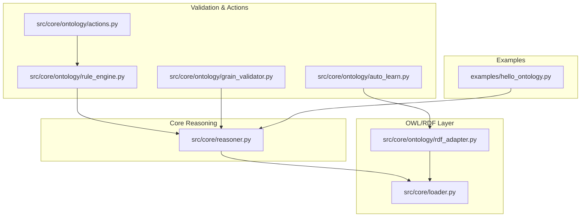
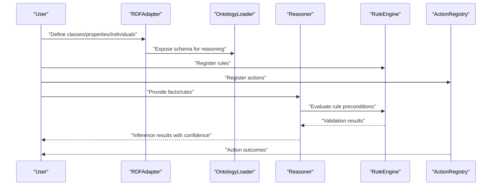
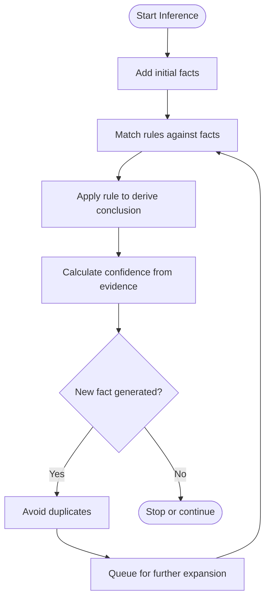
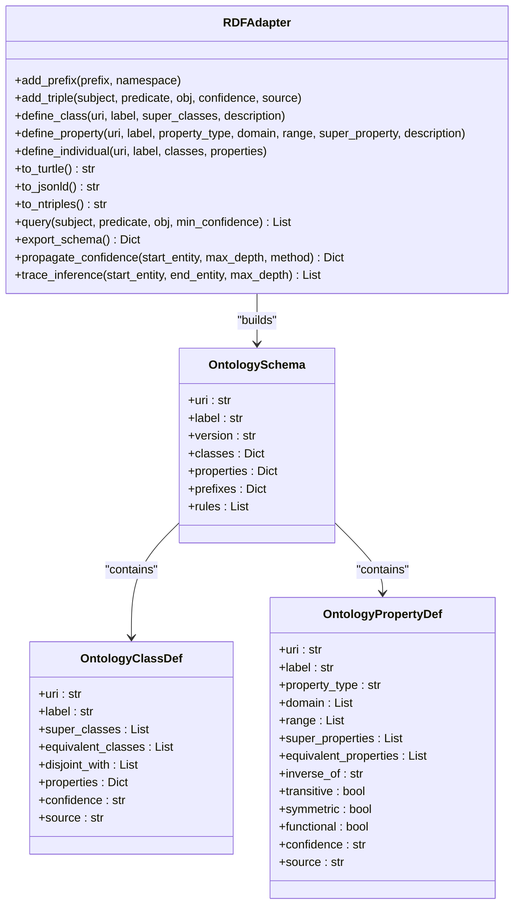
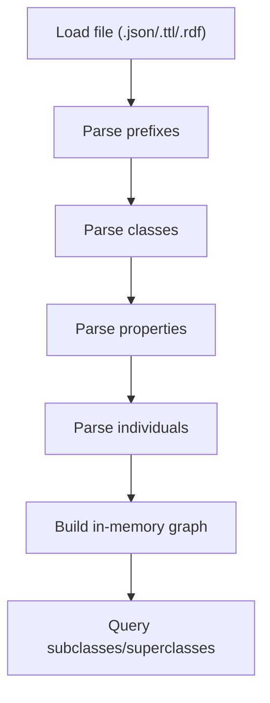
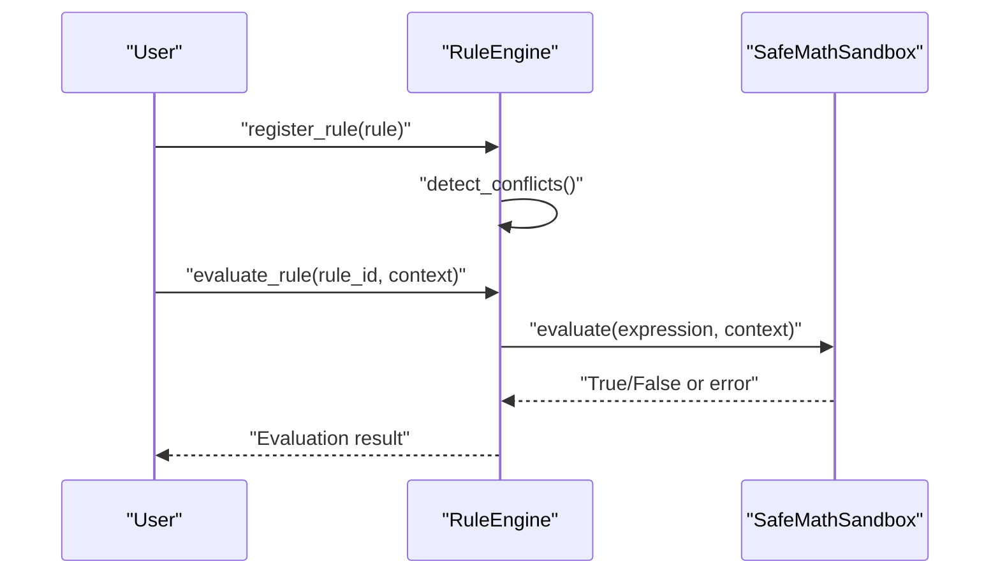
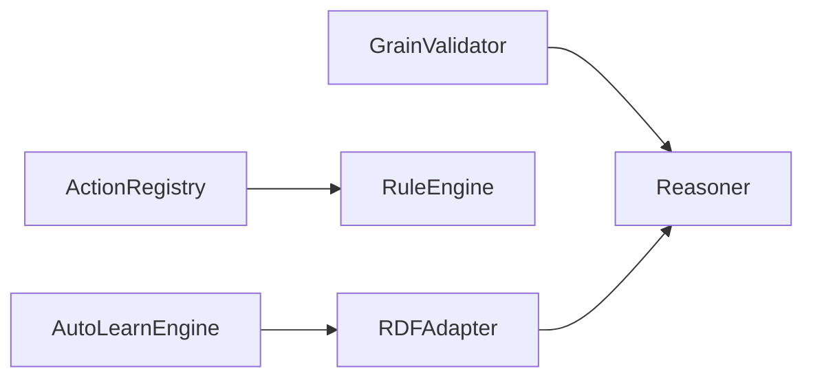
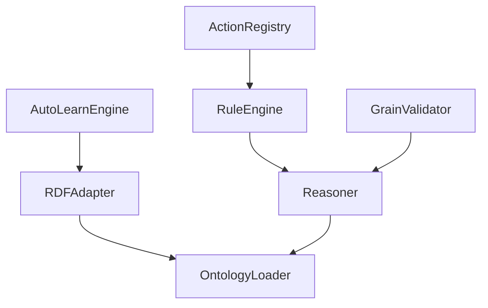

# OWL Compliance and Semantics

<cite>
**Referenced Files in This Document**
- [reasoner.py](file://src/core/reasoner.py)
- [OWL_SEMANTICS.md](file://docs/OWL_SEMANTICS.md)
- [rdf_adapter.py](file://src/core/ontology/rdf_adapter.py)
- [loader.py](file://src/core/loader.py)
- [rule_engine.py](file://src/core/ontology/rule_engine.py)
- [actions.py](file://src/core/ontology/actions.py)
- [auto_learn.py](file://src/core/ontology/auto_learn.py)
- [grain_validator.py](file://src/core/ontology/grain_validator.py)
- [hello_ontology.py](file://examples/hello_ontology.py)
</cite>

## Table of Contents
1. [Introduction](#introduction)
2. [Project Structure](#project-structure)
3. [Core Components](#core-components)
4. [Architecture Overview](#architecture-overview)
5. [Detailed Component Analysis](#detailed-component-analysis)
6. [Dependency Analysis](#dependency-analysis)
7. [Performance Considerations](#performance-considerations)
8. [Troubleshooting Guide](#troubleshooting-guide)
9. [Conclusion](#conclusion)
10. [Appendices](#appendices)

## Introduction
This document explains how the platform implements OWL compliance and semantic web standards, focusing on the Open World Assumption (OWA), RDF/OWL vocabulary usage, and reasoning capabilities. It clarifies the distinctions between OWL constraints and traditional database constraints, details the semantic interpretation of constructs such as owl:someValuesFrom and owl:allValuesFrom, and covers cardinality restrictions. Practical reasoning patterns, semantic validation processes, and integration with external ontologies are included, along with common pitfalls and best practices for maintaining semantic consistency.

## Project Structure
The platform organizes OWL-related functionality across several modules:
- Core reasoning engine supporting forward/backward inference under OWA
- RDF/OWL adapter for JSONL-to-RDF conversion and schema modeling
- Ontology loader for class/property/individual structures
- Rule engine for deterministic, mathematically grounded validations
- Action registry and auto-learning pipeline for dynamic knowledge evolution
- Grain validator to prevent fan-trap risks in aggregations

**Diagram sources**
- [reasoner.py:145-819](file://src/core/reasoner.py#L145-L819)
- [rdf_adapter.py:145-1088](file://src/core/ontology/rdf_adapter.py#L145-L1088)
- [loader.py:131-444](file://src/core/loader.py#L131-L444)
- [rule_engine.py:124-331](file://src/core/ontology/rule_engine.py#L124-L331)
- [actions.py:24-70](file://src/core/ontology/actions.py#L24-L70)
- [auto_learn.py:77-405](file://src/core/ontology/auto_learn.py#L77-L405)
- [grain_validator.py:13-61](file://src/core/ontology/grain_validator.py#L13-L61)
- [hello_ontology.py:17-144](file://examples/hello_ontology.py#L17-L144)

**Section sources**
- [reasoner.py:1-12](file://src/core/reasoner.py#L1-L12)
- [OWL_SEMANTICS.md:1-67](file://docs/OWL_SEMANTICS.md#L1-L67)
- [rdf_adapter.py:145-1088](file://src/core/ontology/rdf_adapter.py#L145-L1088)
- [loader.py:131-444](file://src/core/loader.py#L131-L444)
- [rule_engine.py:124-331](file://src/core/ontology/rule_engine.py#L124-L331)
- [actions.py:24-70](file://src/core/ontology/actions.py#L24-L70)
- [auto_learn.py:77-405](file://src/core/ontology/auto_learn.py#L77-L405)
- [grain_validator.py:13-61](file://src/core/ontology/grain_validator.py#L13-L61)
- [hello_ontology.py:17-144](file://examples/hello_ontology.py#L17-L144)

## Core Components
- Open World Reasoner: Implements forward/backward inference with confidence propagation, explicitly noting OWA semantics and constraint semantics.
- RDF Adapter: Converts JSONL to RDF triples, serializes to Turtle/JSON-LD/N-Triples, defines OWL classes/properties/individuals, and supports schema export and confidence propagation.
- Ontology Loader: Loads JSON/Turtle/placeholder RDF/XML, exposes class hierarchy queries, and expands prefixed URIs.
- Rule Engine: Executes safe, mathematically evaluated rules with conflict detection and versioning.
- Action Registry: Binds rules to actions and orchestrates validation-driven workflows.
- Auto-Learn Engine: Extracts entities/relations from text, upgrades confidence, and suggests knowledge gaps.
- Grain Validator: Prevents fan-trap risks in SQL-like aggregations by validating entity grain consistency.

**Section sources**
- [reasoner.py:145-819](file://src/core/reasoner.py#L145-L819)
- [rdf_adapter.py:145-1088](file://src/core/ontology/rdf_adapter.py#L145-L1088)
- [loader.py:131-444](file://src/core/loader.py#L131-L444)
- [rule_engine.py:124-331](file://src/core/ontology/rule_engine.py#L124-L331)
- [actions.py:24-70](file://src/core/ontology/actions.py#L24-L70)
- [auto_learn.py:77-405](file://src/core/ontology/auto_learn.py#L77-L405)
- [grain_validator.py:13-61](file://src/core/ontology/grain_validator.py#L13-L61)

## Architecture Overview
The system integrates RDF/OWL modeling with rule-based reasoning and validation. The RDF adapter builds OWL-compatible triples and schema definitions. The reasoner operates under OWA, applying rules to derive conclusions and propagate confidence. The rule engine ensures deterministic checks aligned with business constraints. Actions bind rules to executable operations. Auto-learn evolves the knowledge graph from natural language. Grain validation prevents semantic errors in aggregations.

**Diagram sources**
- [rdf_adapter.py:418-534](file://src/core/ontology/rdf_adapter.py#L418-L534)
- [loader.py:131-444](file://src/core/loader.py#L131-L444)
- [reasoner.py:145-819](file://src/core/reasoner.py#L145-L819)
- [rule_engine.py:124-331](file://src/core/ontology/rule_engine.py#L124-L331)
- [actions.py:24-70](file://src/core/ontology/actions.py#L24-L70)

## Detailed Component Analysis

### Open World Reasoner (OWA)
- Operates under OWA: unknown facts are not assumed false; constraints do not block additional values unless explicitly restricted.
- Supports forward and backward chaining with confidence propagation.
- Uses rule types (if-then, equivalence, transitive, symmetric, inverse) and variable substitution patterns.
- Provides explanations of inference steps and aggregated confidence.

**Diagram sources**
- [reasoner.py:243-350](file://src/core/reasoner.py#L243-L350)
- [reasoner.py:351-438](file://src/core/reasoner.py#L351-L438)

**Section sources**
- [reasoner.py:145-819](file://src/core/reasoner.py#L145-L819)
- [OWL_SEMANTICS.md:5-16](file://docs/OWL_SEMANTICS.md#L5-L16)

### RDF/OWL Adapter and Schema Modeling
- Converts JSONL entries into RDF triples with confidence and source metadata.
- Defines OWL classes and properties, emitting rdfs:subClassOf and rdfs:subPropertyOf triples.
- Serializes to Turtle, JSON-LD, and N-Triples; supports prefix expansion.
- Provides schema export and query utilities; includes confidence propagation and inference tracing.

**Diagram sources**
- [rdf_adapter.py:145-1088](file://src/core/ontology/rdf_adapter.py#L145-L1088)

**Section sources**
- [rdf_adapter.py:145-1088](file://src/core/ontology/rdf_adapter.py#L145-L1088)

### Ontology Loader and Class Hierarchy
- Loads JSON/Turtle/placeholder RDF/XML and exposes class hierarchy traversal.
- Expands prefixed URIs and supports subclass/superclass queries.

**Diagram sources**
- [loader.py:131-444](file://src/core/loader.py#L131-L444)

**Section sources**
- [loader.py:131-444](file://src/core/loader.py#L131-L444)

### Rule Engine and Deterministic Validation
- Safely evaluates mathematical/logical expressions via a sandboxed AST evaluator.
- Registers rules with conflict detection and versioning; supports YAML/JSON rule files.
- Evaluates rule preconditions for actions and aggregates results.

**Diagram sources**
- [rule_engine.py:124-331](file://src/core/ontology/rule_engine.py#L124-L331)

**Section sources**
- [rule_engine.py:124-331](file://src/core/ontology/rule_engine.py#L124-L331)

### Actions, Auto-Learning, and Grain Validation
- ActionRegistry binds rules to actions and orchestrates validation-driven workflows.
- AutoLearnEngine extracts entities/relations from text, upgrades confidence, and suggests missing knowledge.
- GrainValidator detects fan-trap risks in aggregations by checking entity grain cardinalities.

**Diagram sources**
- [actions.py:24-70](file://src/core/ontology/actions.py#L24-L70)
- [auto_learn.py:77-405](file://src/core/ontology/auto_learn.py#L77-L405)
- [grain_validator.py:13-61](file://src/core/ontology/grain_validator.py#L13-L61)

**Section sources**
- [actions.py:24-70](file://src/core/ontology/actions.py#L24-L70)
- [auto_learn.py:77-405](file://src/core/ontology/auto_learn.py#L77-L405)
- [grain_validator.py:13-61](file://src/core/ontology/grain_validator.py#L13-L61)

### OWL Constraints vs Database Constraints
- OWL constraints express minimal/maximal cardinalities and existence/full quantification; they do not enforce closure checks.
- Under OWA, absence of a statement does not imply falsity; additional values are permitted unless restricted by explicit axioms.
- Cardinality restrictions do not equate to uniqueness constraints; they specify lower/upper bounds.

**Section sources**
- [OWL_SEMANTICS.md:28-57](file://docs/OWL_SEMANTICS.md#L28-L57)

### Handling owl:someValuesFrom and owl:allValuesFrom
- someValuesFrom expresses existential constraints: “there exists at least one value” for a property.
- allValuesFrom expresses universal constraints: “all values satisfy a condition.”
- In practice, these constructs should be represented as OWL Restrictions and serialized as RDF triples for interoperability.

**Section sources**
- [OWL_SEMANTICS.md:48-57](file://docs/OWL_SEMANTICS.md#L48-L57)
- [rdf_adapter.py:418-534](file://src/core/ontology/rdf_adapter.py#L418-L534)

### Cardinality Restrictions
- Use min/max cardinality restrictions to bound the number of values for a property.
- These are distinct from unique constraints; multiple values may be allowed as long as they meet the bounds.

**Section sources**
- [OWL_SEMANTICS.md:37-46](file://docs/OWL_SEMANTICS.md#L37-L46)

### Semantic Interpretation of Rules, Property Assertions, and Class Hierarchies
- Rules encode domain-specific logic and are evaluated deterministically.
- Property assertions establish facts with confidence; reasoning can combine them with rules.
- Class hierarchies enable inheritance-based inference; subclass relationships are expressed via rdfs:subClassOf.

**Section sources**
- [reasoner.py:145-819](file://src/core/reasoner.py#L145-L819)
- [rdf_adapter.py:418-534](file://src/core/ontology/rdf_adapter.py#L418-L534)
- [loader.py:244-282](file://src/core/loader.py#L244-L282)

### Practical OWL-Compliant Reasoning Patterns
- Forward chaining from facts to conclusions with confidence aggregation.
- Backward chaining from goals to prerequisite facts and rules.
- Combining rule preconditions with property assertions to validate actions.
- Exporting inferred knowledge as RDF triples for downstream systems.

**Section sources**
- [reasoner.py:243-438](file://src/core/reasoner.py#L243-L438)
- [rule_engine.py:320-331](file://src/core/ontology/rule_engine.py#L320-L331)
- [rdf_adapter.py:358-416](file://src/core/ontology/rdf_adapter.py#L358-L416)

### Semantic Validation Processes
- Use the RuleEngine to validate hard constraints before executing actions.
- Employ the GrainValidator to detect fan-trap risks in aggregations.
- Leverage the AutoLearnEngine to extract and refine knowledge from natural language.

**Section sources**
- [rule_engine.py:124-331](file://src/core/ontology/rule_engine.py#L124-L331)
- [grain_validator.py:13-61](file://src/core/ontology/grain_validator.py#L13-L61)
- [auto_learn.py:77-405](file://src/core/ontology/auto_learn.py#L77-L405)

### Integration with External Ontologies
- Load external ontologies in JSON/Turtle formats and integrate them into the reasoning graph.
- Expand prefixed URIs and query class hierarchies to align with internal models.
- Serialize the integrated knowledge to standard RDF formats for exchange.

**Section sources**
- [loader.py:152-231](file://src/core/loader.py#L152-L231)
- [loader.py:284-294](file://src/core/loader.py#L284-L294)
- [rdf_adapter.py:358-416](file://src/core/ontology/rdf_adapter.py#L358-L416)

## Dependency Analysis
The following diagram highlights key dependencies among components:

**Diagram sources**
- [rdf_adapter.py:145-1088](file://src/core/ontology/rdf_adapter.py#L145-L1088)
- [loader.py:131-444](file://src/core/loader.py#L131-L444)
- [reasoner.py:145-819](file://src/core/reasoner.py#L145-L819)
- [rule_engine.py:124-331](file://src/core/ontology/rule_engine.py#L124-L331)
- [actions.py:24-70](file://src/core/ontology/actions.py#L24-L70)
- [auto_learn.py:77-405](file://src/core/ontology/auto_learn.py#L77-L405)
- [grain_validator.py:13-61](file://src/core/ontology/grain_validator.py#L13-L61)

**Section sources**
- [reasoner.py:145-819](file://src/core/reasoner.py#L145-L819)
- [rdf_adapter.py:145-1088](file://src/core/ontology/rdf_adapter.py#L145-L1088)
- [loader.py:131-444](file://src/core/loader.py#L131-L444)
- [rule_engine.py:124-331](file://src/core/ontology/rule_engine.py#L124-L331)
- [actions.py:24-70](file://src/core/ontology/actions.py#L24-L70)
- [auto_learn.py:77-405](file://src/core/ontology/auto_learn.py#L77-L405)
- [grain_validator.py:13-61](file://src/core/ontology/grain_validator.py#L13-L61)

## Performance Considerations
- Circuit breakers limit inference depth/time to avoid runaway computation during forward/backward chaining.
- Confidence propagation uses multiplicative or min-aggregation strategies; choose methods appropriate to domain semantics.
- Prefer streaming loaders for large ontologies to reduce memory footprint.
- Use rule indexing and predicate-based matching to accelerate inference.

[No sources needed since this section provides general guidance]

## Troubleshooting Guide
Common pitfalls and remedies:
- Misinterpreting OWL constraints as database constraints: remember OWA allows additional values unless explicitly restricted.
- Confusing someValuesFrom/allValuesFrom with unique constraints: use cardinality restrictions for bounds.
- Ignoring fan-trap risks: use the GrainValidator to review aggregation logic.
- Over-reliance on closed-world assumptions: ensure reasoning respects OWA semantics.

**Section sources**
- [OWL_SEMANTICS.md:5-16](file://docs/OWL_SEMANTICS.md#L5-L16)
- [OWL_SEMANTICS.md:28-57](file://docs/OWL_SEMANTICS.md#L28-L57)
- [grain_validator.py:13-61](file://src/core/ontology/grain_validator.py#L13-L61)

## Conclusion
The platform implements OWL-compliant reasoning under the Open World Assumption, integrating RDF/OWL modeling, rule-based validation, and dynamic knowledge evolution. By distinguishing OWL constraints from database constraints, correctly interpreting owl:someValuesFrom and owl:allValuesFrom, and managing cardinality restrictions, the system maintains semantic consistency while enabling robust, extensible reasoning and validation workflows.

[No sources needed since this section summarizes without analyzing specific files]

## Appendices

### Example Workflow: Basic Ontology Interaction
- Initialize the reasoner and learn basic knowledge items.
- Define rules and actions.
- Execute reasoning and validate preconditions.
- Export results and inferred triples.

**Section sources**
- [hello_ontology.py:17-144](file://examples/hello_ontology.py#L17-L144)
- [reasoner.py:145-819](file://src/core/reasoner.py#L145-L819)
- [rule_engine.py:124-331](file://src/core/ontology/rule_engine.py#L124-L331)
- [actions.py:24-70](file://src/core/ontology/actions.py#L24-L70)
- [rdf_adapter.py:358-416](file://src/core/ontology/rdf_adapter.py#L358-L416)