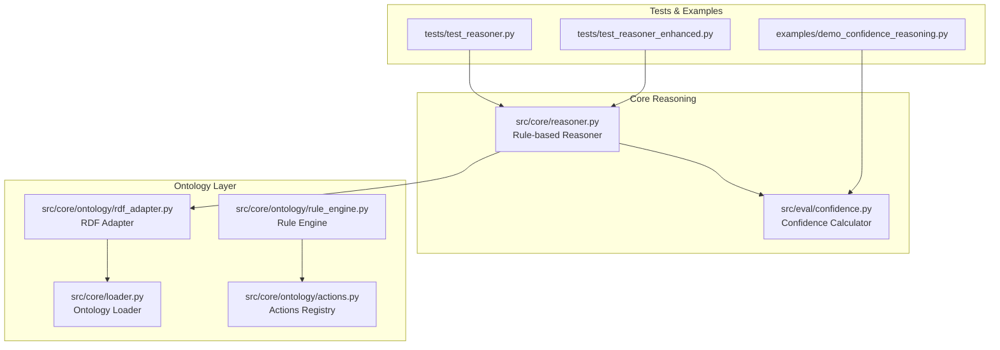
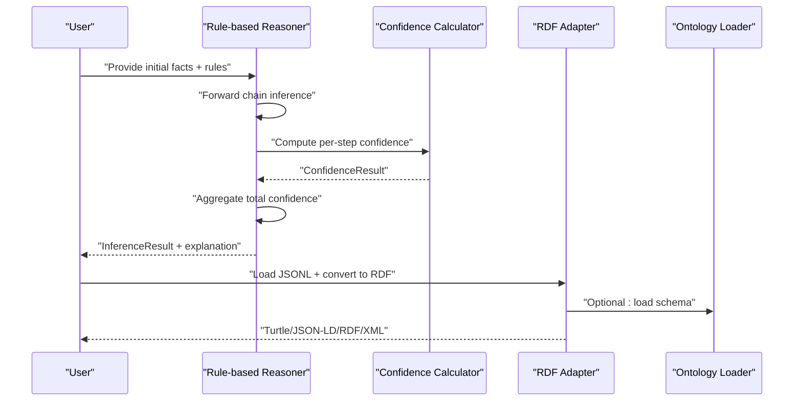
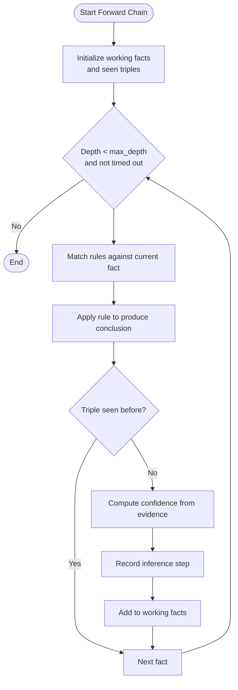
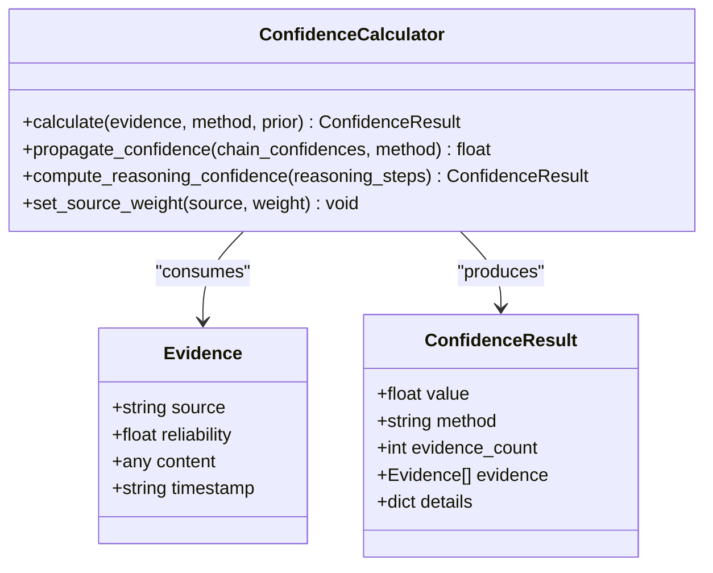
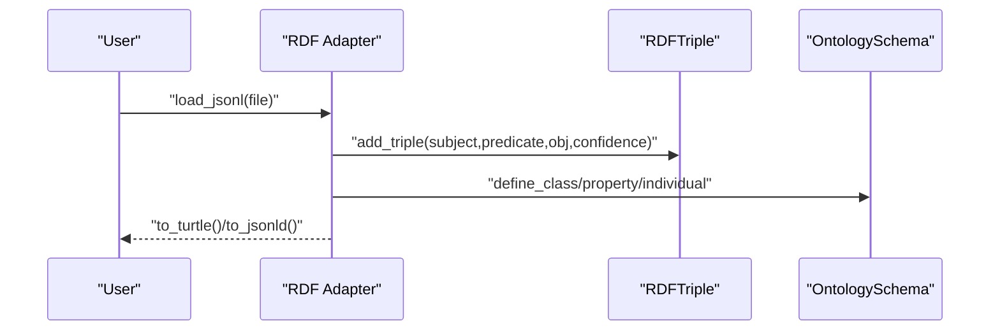
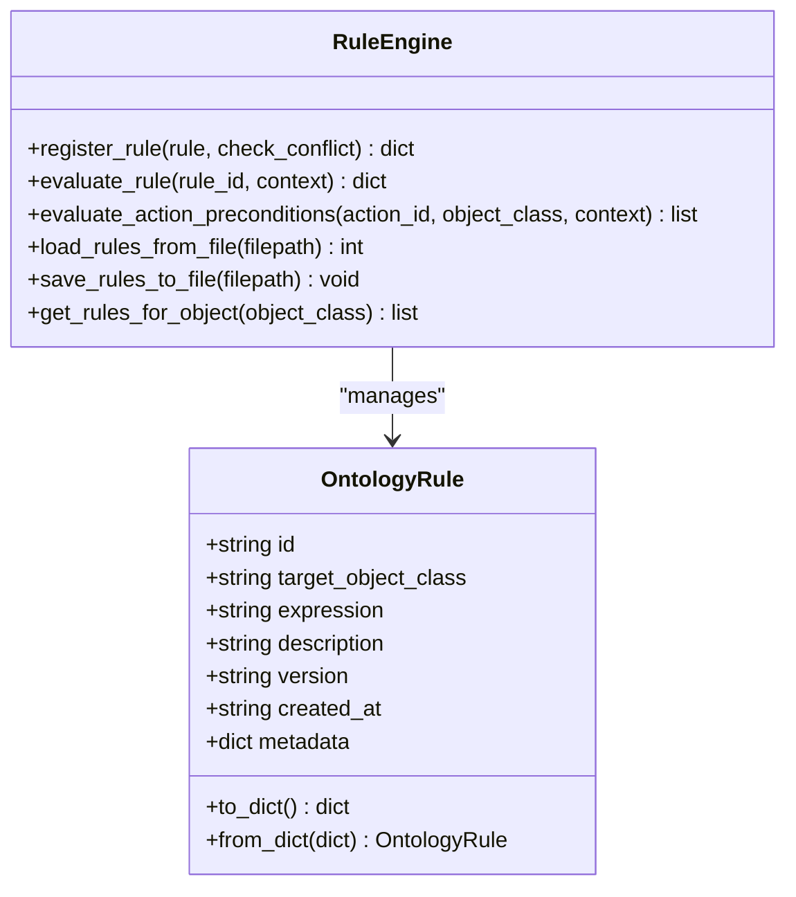
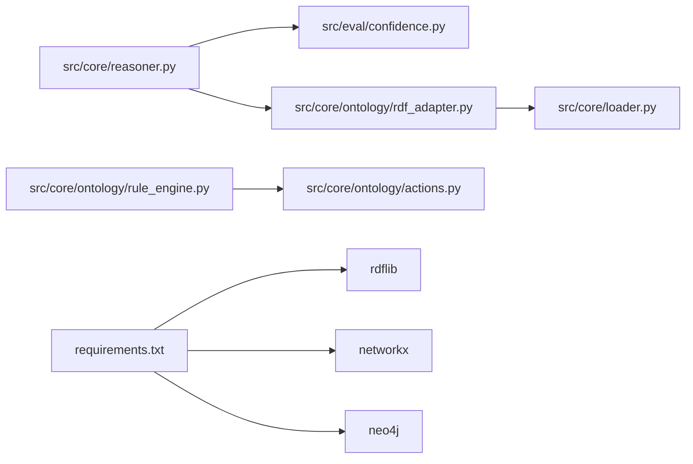

# Reasoning Engine

<cite>
**Referenced Files in This Document**
- [reasoner.py](file://src/core/reasoner.py)
- [reasoner.py](file://src/core/ontology/reasoner.py)
- [rdf_adapter.py](file://src/core/ontology/rdf_adapter.py)
- [confidence.py](file://src/eval/confidence.py)
- [loader.py](file://src/core/loader.py)
- [rule_engine.py](file://src/core/ontology/rule_engine.py)
- [actions.py](file://src/core/ontology/actions.py)
- [test_reasoner.py](file://tests/test_reasoner.py)
- [test_reasoner_enhanced.py](file://tests/test_reasoner_enhanced.py)
- [demo_confidence_reasoning.py](file://examples/demo_confidence_reasoning.py)
- [requirements.txt](file://requirements.txt)
- [README.md](file://README.md)
- [architecture.md](file://docs/architecture.md)
- [prd-v3.md](file://docs/prd-v3.md)
</cite>

## Table of Contents
1. [Introduction](#introduction)
2. [Project Structure](#project-structure)
3. [Core Components](#core-components)
4. [Architecture Overview](#architecture-overview)
5. [Detailed Component Analysis](#detailed-component-analysis)
6. [Dependency Analysis](#dependency-analysis)
7. [Performance Considerations](#performance-considerations)
8. [Troubleshooting Guide](#troubleshooting-guide)
9. [Conclusion](#conclusion)
10. [Appendices](#appendices)

## Introduction
This document describes the reasoning engine focused on OWL-compliant inference algorithms within the platform. It covers forward and backward chaining mechanisms, confidence propagation mathematics, logical closure operations, and the integration with RDFLib for semantic web standards compliance. It also documents rule-based inference, contradiction detection, evidence chain construction, the relationship between the core reasoner and the enhanced reasoning system, performance considerations for large-scale knowledge bases, and practical examples demonstrating complex reasoning scenarios and edge case handling.

## Project Structure
The reasoning engine spans several modules:
- Core rule-based reasoner supporting forward/backward chaining and confidence propagation
- Ontology adapter for RDF/OWL conversion and schema modeling
- Confidence calculator implementing multiple propagation strategies
- Ontology loader for semantic web formats
- Rule engine for deterministic mathematical validation
- Actions registry binding rules to executable actions

**Diagram sources**
- [reasoner.py:145-819](file://src/core/reasoner.py#L145-L819)
- [rdf_adapter.py:145-1088](file://src/core/ontology/rdf_adapter.py#L145-L1088)
- [confidence.py:32-407](file://src/eval/confidence.py#L32-L407)
- [loader.py:131-444](file://src/core/loader.py#L131-L444)
- [rule_engine.py:124-331](file://src/core/ontology/rule_engine.py#L124-L331)
- [actions.py:24-70](file://src/core/ontology/actions.py#L24-L70)
- [test_reasoner.py:1-200](file://tests/test_reasoner.py#L1-L200)
- [test_reasoner_enhanced.py:1-273](file://tests/test_reasoner_enhanced.py#L1-L273)
- [demo_confidence_reasoning.py:1-185](file://examples/demo_confidence_reasoning.py#L1-L185)

**Section sources**
- [README.md:55-66](file://README.md#L55-L66)
- [architecture.md:14-26](file://docs/architecture.md#L14-L26)
- [prd-v3.md:159-186](file://docs/prd-v3.md#L159-L186)

## Core Components
- Rule-based Reasoner: Implements forward and backward chaining, supports rule types (if-then, equivalence, transitive, symmetric, inverse), and computes confidence propagation across inference steps.
- Confidence Calculator: Provides multiple methods for combining evidence and propagating confidence along reasoning chains, including weighted average, Bayesian update, multiplicative synthesis, and Dempster–Shafer theory.
- RDF Adapter: Converts JSONL to RDF/OWL, serializes to Turtle/JSON-LD/N-Triples/RDF/XML, defines classes/properties/individuals, and supports confidence propagation and inference tracing.
- Ontology Loader: Loads JSON/Turtle/RDF/XML and exposes hierarchical queries and URI expansion.
- Rule Engine: Validates numeric/business rules via a safe AST sandbox, detects conflicts, and records audit trails.
- Actions Registry: Binds rules to executable actions for dynamic orchestration.

**Section sources**
- [reasoner.py:145-819](file://src/core/reasoner.py#L145-L819)
- [confidence.py:32-407](file://src/eval/confidence.py#L32-L407)
- [rdf_adapter.py:145-1088](file://src/core/ontology/rdf_adapter.py#L145-L1088)
- [loader.py:131-444](file://src/core/loader.py#L131-L444)
- [rule_engine.py:124-331](file://src/core/ontology/rule_engine.py#L124-L331)
- [actions.py:24-70](file://src/core/ontology/actions.py#L24-L70)

## Architecture Overview
The reasoning system integrates rule-based inference with semantic web standards and confidence-aware propagation. The core reasoner operates on facts and rules, while the RDF adapter ensures OWL compliance and enables serialization. The confidence calculator unifies uncertainty across sources and inference steps. The rule engine enforces deterministic constraints, and actions bind validated rules to executable operations.

**Diagram sources**
- [reasoner.py:243-438](file://src/core/reasoner.py#L243-L438)
- [confidence.py:63-297](file://src/eval/confidence.py#L63-L297)
- [rdf_adapter.py:282-416](file://src/core/ontology/rdf_adapter.py#L282-L416)
- [loader.py:152-231](file://src/core/loader.py#L152-L231)

## Detailed Component Analysis

### Rule-based Reasoner
- Forward chaining: Iteratively applies rules to derive new facts, tracks used facts, and computes confidence using evidence aggregation.
- Backward chaining: Uses BFS to search for premises that support a goal, building a proof tree with confidence aggregation.
- Pattern matching: Supports variable-based patterns for rule conditions and conclusions.
- Built-in rules: Transitivity and symmetry for relational closure.
- Confidence propagation: Combines rule confidence with premise confidence and aggregates chain-wide confidence.

**Diagram sources**
- [reasoner.py:243-349](file://src/core/reasoner.py#L243-L349)

**Section sources**
- [reasoner.py:145-819](file://src/core/reasoner.py#L145-L819)
- [test_reasoner.py:63-150](file://tests/test_reasoner.py#L63-L150)
- [test_reasoner_enhanced.py:70-174](file://tests/test_reasoner_enhanced.py#L70-L174)

### Confidence Propagation Mathematics
- Methods supported:
  - Weighted average: Evidence-weighted combination
  - Bayesian: Likelihood-based posterior update
  - Multiplicative: Product-based synthesis
  - Dempster–Shafer: Belief function combination
- Chain propagation: Aggregates per-step confidence using min/arithmetic/geometric/multiplicative methods
- Evidence model: Captures source reliability and content for transparent attribution

**Diagram sources**
- [confidence.py:13-334](file://src/eval/confidence.py#L13-L334)

**Section sources**
- [confidence.py:32-407](file://src/eval/confidence.py#L32-L407)
- [demo_confidence_reasoning.py:22-151](file://examples/demo_confidence_reasoning.py#L22-L151)

### RDF Adapter and OWL Compliance
- JSONL to RDF conversion with automatic class/property extraction
- OWL schema definition: Classes, properties, individuals, and typed triples
- Serialization: Turtle, JSON-LD, N-Triples, and RDF/XML
- Confidence propagation and inference tracing over RDF graphs
- SPARQL-like query interface with wildcards and confidence filtering

**Diagram sources**
- [rdf_adapter.py:282-416](file://src/core/ontology/rdf_adapter.py#L282-L416)
- [rdf_adapter.py:419-534](file://src/core/ontology/rdf_adapter.py#L419-L534)

**Section sources**
- [rdf_adapter.py:145-1088](file://src/core/ontology/rdf_adapter.py#L145-L1088)
- [loader.py:131-444](file://src/core/loader.py#L131-L444)

### Rule Engine and Deterministic Validation
- Safe AST sandbox evaluates numeric/logical expressions
- Conflict detection across rules targeting the same object class
- Versioning and audit trail for rule lifecycle
- Integration with actions registry for executable enforcement

**Diagram sources**
- [rule_engine.py:88-331](file://src/core/ontology/rule_engine.py#L88-L331)
- [actions.py:7-70](file://src/core/ontology/actions.py#L7-L70)

**Section sources**
- [rule_engine.py:124-331](file://src/core/ontology/rule_engine.py#L124-L331)
- [actions.py:24-70](file://src/core/ontology/actions.py#L24-L70)

### Logical Closure Operations
- Transitivity and symmetry built-in rules enable closure over relations
- Pattern matching supports variable substitution for generic rules
- Predicate indexing accelerates rule application during forward chaining

**Section sources**
- [reasoner.py:181-223](file://src/core/reasoner.py#L181-L223)
- [reasoner.py:440-476](file://src/core/reasoner.py#L440-L476)

### Integration with RDFLib
- External dependency declared for RDF/OWL processing
- Adapter provides serialization and schema modeling aligned with RDF/OWL standards
- Ontology loader supports multiple formats; adapter complements with conversion and validation

**Section sources**
- [requirements.txt:1-18](file://requirements.txt#L1-L18)
- [rdf_adapter.py:1018-1088](file://src/core/ontology/rdf_adapter.py#L1018-L1088)
- [loader.py:152-231](file://src/core/loader.py#L152-L231)

### Relationship Between Core Reasoner and Enhanced Reasoning System
- Core reasoner focuses on rule-based inference with confidence propagation
- Enhanced reasoning system extends with:
  - Advanced rule loading from dictionaries and lists
  - Timeout protection and circuit breaker behavior
  - Backward chaining with BFS and goal-driven search
  - Query filtering by subject/predicate/object and minimum confidence
  - Explanation generation for inference traces

**Section sources**
- [test_reasoner_enhanced.py:70-174](file://tests/test_reasoner_enhanced.py#L70-L174)
- [reasoner.py:351-438](file://src/core/reasoner.py#L351-L438)
- [reasoner.py:673-703](file://src/core/reasoner.py#L673-L703)

### Practical Examples and Edge Cases
- Example: Confidence-based reasoning demonstrates multi-source evidence fusion and automatic learning via source weights
- Edge cases covered by tests:
  - Empty rule sets and no matching facts
  - Timeout protection during forward chaining
  - Backward chaining with variable patterns
  - Query filtering and confidence thresholds

**Section sources**
- [demo_confidence_reasoning.py:22-151](file://examples/demo_confidence_reasoning.py#L22-L151)
- [test_reasoner.py:174-200](file://tests/test_reasoner.py#L174-L200)
- [test_reasoner_enhanced.py:101-174](file://tests/test_reasoner_enhanced.py#L101-L174)

## Dependency Analysis
- Internal dependencies:
  - Reasoner depends on ConfidenceCalculator for confidence computation
  - RDF Adapter depends on OntologyLoader for schema population
  - RuleEngine depends on actions registry for executable enforcement
- External dependencies:
  - rdflib for advanced RDF/OWL processing
  - networkx for graph algorithms (used by adapter)
  - neo4j for production graph storage (integration point)

**Diagram sources**
- [reasoner.py:162-174](file://src/core/reasoner.py#L162-L174)
- [rdf_adapter.py:145-188](file://src/core/ontology/rdf_adapter.py#L145-L188)
- [loader.py:131-151](file://src/core/loader.py#L131-L151)
- [rule_engine.py:124-139](file://src/core/ontology/rule_engine.py#L124-L139)
- [actions.py:24-29](file://src/core/ontology/actions.py#L24-L29)
- [requirements.txt:1-18](file://requirements.txt#L1-L18)

**Section sources**
- [requirements.txt:1-18](file://requirements.txt#L1-L18)
- [architecture.md:18-26](file://docs/architecture.md#L18-L26)

## Performance Considerations
- Forward chaining:
  - Use timeouts and depth limits to avoid combinatorial explosion
  - Index predicates and deduplicate triples to reduce redundant applications
- Backward chaining:
  - BFS with pruning and seen-set tracking prevents cycles and duplicates
- Confidence propagation:
  - Prefer conservative aggregation (min) for long chains to avoid over-optimistic results
- Large-scale knowledge bases:
  - Stream JSONL loading to reduce memory footprint
  - Serialize to compact formats (N-Triples) for transport and storage
  - Offload heavy graph operations to external graph databases (Neo4j) when needed

[No sources needed since this section provides general guidance]

## Troubleshooting Guide
- Symptom: No conclusions generated
  - Cause: No matching facts or rules, or all facts filtered by confidence threshold
  - Resolution: Verify rule conditions and fact predicates; lower min_confidence filter
- Symptom: Slow inference
  - Cause: Deep recursion or large rule set
  - Resolution: Increase timeout, reduce max_depth, or apply predicate indexing
- Symptom: Unexpected confidence drift
  - Cause: Multiplicative propagation amplifies small probabilities
  - Resolution: Switch to min or arithmetic propagation for chain-wide confidence
- Symptom: OWL semantics mismatch
  - Cause: Expecting closed-world assumptions or cardinality constraints
  - Resolution: Remember the engine runs under open-world assumption; use explicit rules for closure

**Section sources**
- [reasoner.py:272-277](file://src/core/reasoner.py#L272-L277)
- [reasoner.py:376-382](file://src/core/reasoner.py#L376-L382)
- [confidence.py:222-259](file://src/eval/confidence.py#L222-L259)

## Conclusion
The reasoning engine combines rule-based inference with robust confidence propagation and OWL-compliant RDF/OWL handling. It supports forward and backward chaining, logical closure, and deterministic validation via a safe rule engine. The system is designed for scalability with streaming loaders, timeouts, and modular integration points, while maintaining transparency through explanations and evidence tracking.

[No sources needed since this section summarizes without analyzing specific files]

## Appendices

### API and Data Model Highlights
- Rule types: if_then, equivalence, transitive, symmetric, inverse
- Fact and InferenceStep capture subject, predicate, object, confidence, and evidence
- ConfidenceResult encapsulates value, method, and evidence metadata
- RDFTriple supports confidence and source tracking for semantic triples

**Section sources**
- [reasoner.py:77-143](file://src/core/reasoner.py#L77-L143)
- [confidence.py:13-30](file://src/eval/confidence.py#L13-L30)
- [rdf_adapter.py:60-85](file://src/core/ontology/rdf_adapter.py#L60-L85)