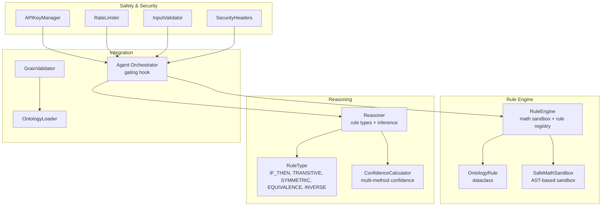
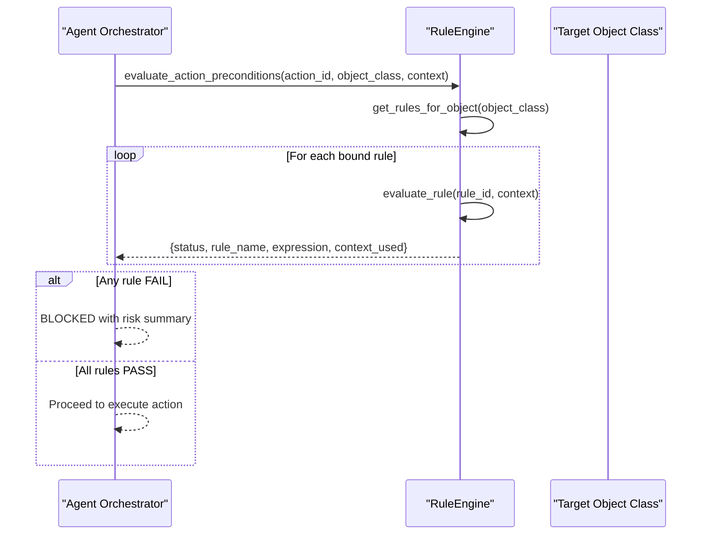
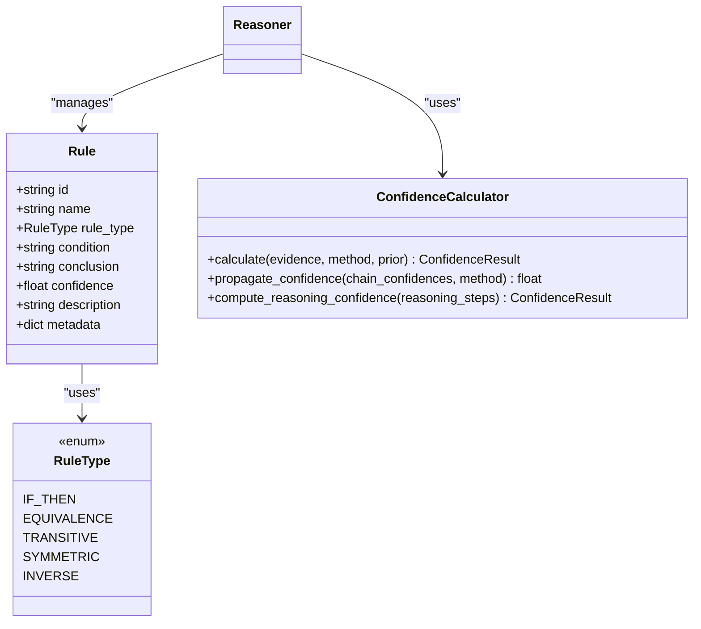
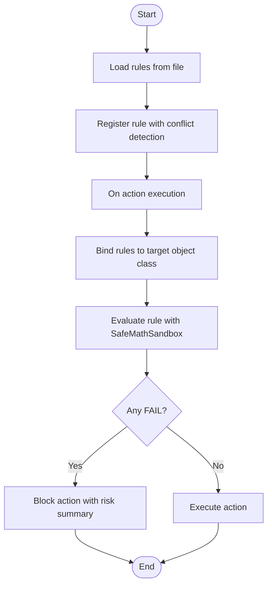
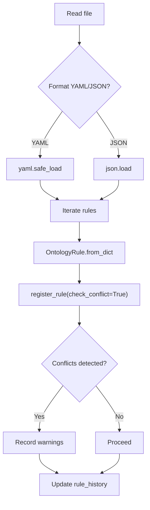
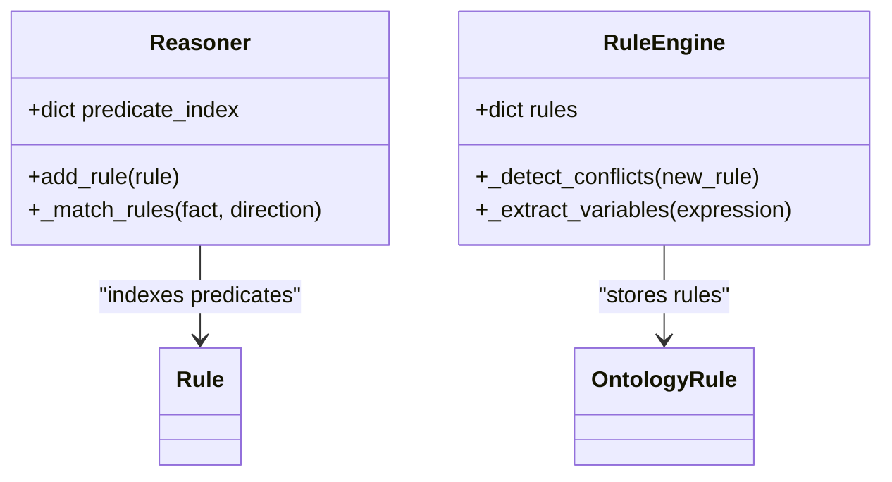
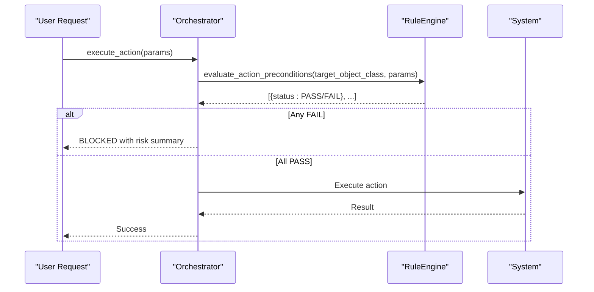
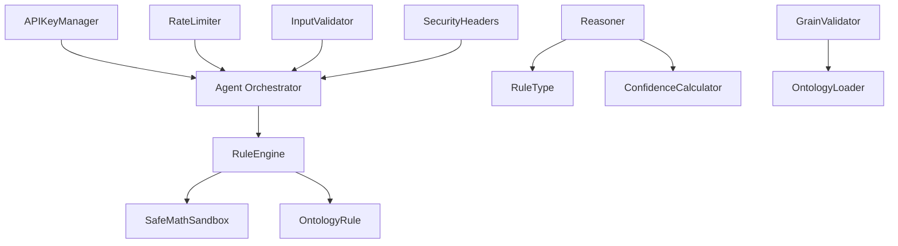

# Rule Engine System

<cite>
**Referenced Files in This Document**
- [rule_engine.py](file://src/core/ontology/rule_engine.py)
- [reasoner.py](file://src/core/reasoner.py)
- [reasoner.py](file://src/core/ontology/reasoner.py)
- [confidence.py](file://src/eval/confidence.py)
- [security.py](file://src/core/security.py)
- [grain_validator.py](file://src/core/ontology/grain_validator.py)
- [loader.py](file://src/core/loader.py)
- [orchestrator.py](file://src/agents/orchestrator.py)
- [test_rule_engine.py](file://tests/test_rule_engine.py)
- [demo_confidence_reasoning.py](file://examples/demo_confidence_reasoning.py)
</cite>

## Table of Contents
1. [Introduction](#introduction)
2. [Project Structure](#project-structure)
3. [Core Components](#core-components)
4. [Architecture Overview](#architecture-overview)
5. [Detailed Component Analysis](#detailed-component-analysis)
6. [Dependency Analysis](#dependency-analysis)
7. [Performance Considerations](#performance-considerations)
8. [Troubleshooting Guide](#troubleshooting-guide)
9. [Conclusion](#conclusion)
10. [Appendices](#appendices)

## Introduction
This document describes the rule engine system and safety validation mechanisms in the platform. It covers rule definition syntax, rule types, execution pipeline, loading and validation, indexing strategies, conflict resolution, integration with safety-critical applications, sandboxing, evidence-based validation, practical examples, testing procedures, maintenance workflows, and performance optimization. The system combines a deterministic mathematical sandbox for safety gating with a neuro-symbolic reasoning engine for broader logical inference.

## Project Structure
The rule engine system spans several modules:
- Ontology rule engine: mathematical sandbox, rule registration, conflict detection, persistence, and gating for actions.
- Neuro-symbolic reasoning engine: rule types (IF-THEN, equivalence, transitive, symmetric, inverse), forward/backward inference, confidence propagation.
- Safety and security: API key management, rate limiting, input validation, and security headers.
- Confidence evaluation: multi-method confidence calculation and propagation.
- Additional safety validations: grain theory-based fan-trap prevention.
- Integration: orchestrator integrates rule gating into action execution.

**Diagram sources**
- [rule_engine.py:124-331](file://src/core/ontology/rule_engine.py#L124-L331)
- [reasoner.py:77-84](file://src/core/reasoner.py#L77-L84)
- [reasoner.py:145-800](file://src/core/reasoner.py#L145-L800)
- [confidence.py:32-407](file://src/eval/confidence.py#L32-L407)
- [security.py:21-429](file://src/core/security.py#L21-L429)
- [loader.py:131-444](file://src/core/loader.py#L131-L444)
- [grain_validator.py:13-61](file://src/core/ontology/grain_validator.py#L13-L61)
- [orchestrator.py:301-337](file://src/agents/orchestrator.py#L301-L337)

**Section sources**
- [rule_engine.py:124-331](file://src/core/ontology/rule_engine.py#L124-L331)
- [reasoner.py:145-800](file://src/core/reasoner.py#L145-L800)
- [confidence.py:32-407](file://src/eval/confidence.py#L32-L407)
- [security.py:21-429](file://src/core/security.py#L21-L429)
- [loader.py:131-444](file://src/core/loader.py#L131-L444)
- [grain_validator.py:13-61](file://src/core/ontology/grain_validator.py#L13-L61)
- [orchestrator.py:301-337](file://src/agents/orchestrator.py#L301-L337)

## Core Components
- SafeMathSandbox: An AST-based sandbox that evaluates mathematical/logical expressions safely, supporting operators, comparisons, logical operations, and selected math functions. It enforces strict node types and variable availability.
- OntologyRule: A dataclass representing a rule bound to an ontology object class, with expression, description, versioning, timestamps, and metadata.
- RuleEngine: Manages rule lifecycle (registration, conflict detection, persistence), loads rules from YAML/JSON, and evaluates them against action contexts. It gates actions via a three-way binding: Action → Object ← Rule.
- Reasoner: Implements neuro-symbolic reasoning with rule types (IF-THEN, TRANSITIVE, SYMMETRIC, EQUIVALENCE, INVERSE), forward/backward inference, and confidence propagation.
- ConfidenceCalculator: Computes confidence from multiple evidence sources using weighted average, Bayesian, multiplicative, and Dempster-Shafer methods, and propagates confidence along inference chains.
- Security and Safety: API key management, rate limiting, input validation, and security headers protect the system; GrainValidator prevents fan-trap risks in aggregations.

**Section sources**
- [rule_engine.py:14-86](file://src/core/ontology/rule_engine.py#L14-L86)
- [rule_engine.py:88-123](file://src/core/ontology/rule_engine.py#L88-L123)
- [rule_engine.py:124-331](file://src/core/ontology/rule_engine.py#L124-L331)
- [reasoner.py:77-84](file://src/core/reasoner.py#L77-L84)
- [reasoner.py:145-800](file://src/core/reasoner.py#L145-L800)
- [confidence.py:32-407](file://src/eval/confidence.py#L32-L407)
- [security.py:21-429](file://src/core/security.py#L21-L429)
- [grain_validator.py:13-61](file://src/core/ontology/grain_validator.py#L13-L61)

## Architecture Overview
The system integrates rule gating into the agent orchestration pipeline. Before executing physical actions, the orchestrator queries the RuleEngine for all rules bound to the target object class and evaluates them against action parameters. Failures trigger a block with detailed risk summaries.

**Diagram sources**
- [orchestrator.py:301-337](file://src/agents/orchestrator.py#L301-L337)
- [rule_engine.py:320-331](file://src/core/ontology/rule_engine.py#L320-L331)

**Section sources**
- [orchestrator.py:301-337](file://src/agents/orchestrator.py#L301-L337)
- [rule_engine.py:320-331](file://src/core/ontology/rule_engine.py#L320-L331)

## Detailed Component Analysis

### Rule Definition Syntax and Types
- Syntax: Rules define expressions using variables and supported operators/comparisons/logical constructs. Variables are extracted from expressions for conflict detection.
- Types:
  - IF-THEN: Conditional → Conclusion patterns with confidence.
  - TRANSITIVE: Transitivity over predicates.
  - SYMMETRIC: Symmetric property flipping arguments.
  - EQUIVALENCE: Logical equivalence between conditions.
  - INVERSE: Inverse relationships.

**Diagram sources**
- [reasoner.py:77-84](file://src/core/reasoner.py#L77-L84)
- [reasoner.py:94-104](file://src/core/reasoner.py#L94-L104)
- [reasoner.py:145-800](file://src/core/reasoner.py#L145-L800)
- [confidence.py:32-407](file://src/eval/confidence.py#L32-L407)

**Section sources**
- [reasoner.py:77-84](file://src/core/reasoner.py#L77-L84)
- [reasoner.py:94-104](file://src/core/reasoner.py#L94-L104)
- [reasoner.py:145-800](file://src/core/reasoner.py#L145-L800)
- [confidence.py:32-407](file://src/eval/confidence.py#L32-L407)

### Rule Execution Pipeline
- Loading: Rules can be loaded from YAML/JSON files. Each rule is deserialized into an OntologyRule and registered with optional conflict detection.
- Evaluation: For a given rule, the SafeMathSandbox parses and evaluates the expression against a provided context. Results include PASS/FAIL/ERROR with details.
- Gating: The orchestrator fetches all rules bound to the target object class and evaluates them before allowing an action to proceed.

**Diagram sources**
- [rule_engine.py:251-284](file://src/core/ontology/rule_engine.py#L251-L284)
- [rule_engine.py:172-202](file://src/core/ontology/rule_engine.py#L172-L202)
- [rule_engine.py:303-318](file://src/core/ontology/rule_engine.py#L303-L318)
- [orchestrator.py:301-337](file://src/agents/orchestrator.py#L301-L337)

**Section sources**
- [rule_engine.py:251-284](file://src/core/ontology/rule_engine.py#L251-L284)
- [rule_engine.py:172-202](file://src/core/ontology/rule_engine.py#L172-L202)
- [rule_engine.py:303-318](file://src/core/ontology/rule_engine.py#L303-L318)
- [orchestrator.py:301-337](file://src/agents/orchestrator.py#L301-L337)

### Rule Loading and Validation
- File formats: YAML and JSON are supported. The loader extracts a list of rules and registers each one.
- Validation: During registration, the engine detects potential conflicts by comparing variables in expressions for the same target object class and records warnings. Versioning is tracked via rule history.

**Diagram sources**
- [rule_engine.py:251-284](file://src/core/ontology/rule_engine.py#L251-L284)
- [rule_engine.py:172-202](file://src/core/ontology/rule_engine.py#L172-L202)
- [rule_engine.py:239-249](file://src/core/ontology/rule_engine.py#L239-L249)

**Section sources**
- [rule_engine.py:251-284](file://src/core/ontology/rule_engine.py#L251-L284)
- [rule_engine.py:172-202](file://src/core/ontology/rule_engine.py#L172-L202)
- [rule_engine.py:239-249](file://src/core/ontology/rule_engine.py#L239-L249)

### Rule Indexing Strategies
- Predicate-based indexing: The neuro-symbolic Reasoner maintains a predicate index to accelerate rule lookup during inference.
- Variable extraction: The rule engine extracts variables from expressions to detect conflicts across rules targeting the same object class.

**Diagram sources**
- [reasoner.py:175-222](file://src/core/reasoner.py#L175-L222)
- [reasoner.py:440-476](file://src/core/reasoner.py#L440-L476)
- [rule_engine.py:204-237](file://src/core/ontology/rule_engine.py#L204-L237)

**Section sources**
- [reasoner.py:175-222](file://src/core/reasoner.py#L175-L222)
- [reasoner.py:440-476](file://src/core/reasoner.py#L440-L476)
- [rule_engine.py:204-237](file://src/core/ontology/rule_engine.py#L204-L237)

### Rule Conflict Resolution
- Detection: Conflicts are flagged when two rules target the same object class and share common variables in their expressions.
- Resolution: The system logs warnings during registration. Operators should review and update rules to remove overlapping constraints or adjust expressions.

**Section sources**
- [rule_engine.py:204-237](file://src/core/ontology/rule_engine.py#L204-L237)

### Integration with Safety-Critical Applications
- Action gating: The orchestrator invokes RuleEngine to validate all rules bound to the target object class before executing an action. Failures are summarized and the action is blocked.
- Safety-critical checks: Default rules enforce gas regulator safety margins, budget limits, pressure ranges, and positive quantities.

**Diagram sources**
- [orchestrator.py:301-337](file://src/agents/orchestrator.py#L301-L337)
- [rule_engine.py:320-331](file://src/core/ontology/rule_engine.py#L320-L331)

**Section sources**
- [orchestrator.py:301-337](file://src/agents/orchestrator.py#L301-L337)
- [rule_engine.py:140-170](file://src/core/ontology/rule_engine.py#L140-L170)

### Rule Sandboxing Mechanisms
- SafeMathSandbox: Uses AST parsing to evaluate expressions in a controlled environment. Only allowed operators, comparisons, logical operations, and selected math functions are supported. Undefined variables and unsupported nodes raise errors.

**Section sources**
- [rule_engine.py:14-86](file://src/core/ontology/rule_engine.py#L14-L86)

### Evidence-Based Rule Validation
- ConfidenceCalculator supports multiple methods to combine evidence from various sources and propagate confidence along inference chains. This enables robust validation of rules and reasoning outcomes.

**Section sources**
- [confidence.py:32-407](file://src/eval/confidence.py#L32-L407)

### Practical Examples
- Creating and registering rules: Use OntologyRule and register via RuleEngine. Default rules demonstrate safety constraints for GasRegulator and ProcurementProject.
- Evaluating rules: Call evaluate_rule with a rule ID and context; interpret PASS/FAIL/ERROR results.
- Testing: Unit tests cover sandbox evaluation, rule serialization, conflict detection, and file I/O.
- Confidence demos: Example script demonstrates multi-source evidence fusion and confidence propagation.

**Section sources**
- [rule_engine.py:140-170](file://src/core/ontology/rule_engine.py#L140-L170)
- [rule_engine.py:303-318](file://src/core/ontology/rule_engine.py#L303-L318)
- [test_rule_engine.py:113-246](file://tests/test_rule_engine.py#L113-L246)
- [demo_confidence_reasoning.py:22-185](file://examples/demo_confidence_reasoning.py#L22-L185)

### Rule Testing Procedures
- Sandbox tests: Verify arithmetic, comparison, logical operations, function support, and error handling.
- Rule engine tests: Validate registration, conflict detection, evaluation outcomes, rule retrieval, action preconditions, audit trail, and file I/O.

**Section sources**
- [test_rule_engine.py:12-75](file://tests/test_rule_engine.py#L12-L75)
- [test_rule_engine.py:113-296](file://tests/test_rule_engine.py#L113-L296)

### Rule Maintenance Workflows
- Versioning: Rules carry version metadata; updates are recorded in the audit trail.
- Persistence: Save/load rules to/from YAML/JSON for operational maintenance.
- Conflict review: Investigate warnings and adjust expressions to avoid overlapping constraints.

**Section sources**
- [rule_engine.py:99-122](file://src/core/ontology/rule_engine.py#L99-L122)
- [rule_engine.py:239-249](file://src/core/ontology/rule_engine.py#L239-L249)
- [rule_engine.py:286-298](file://src/core/ontology/rule_engine.py#L286-L298)

### Relationship to Broader Reasoning System
- The neuro-symbolic Reasoner complements the rule engine by providing formal rule types and inference strategies. Together they form a hybrid system: deterministic gating via rules and symbolic reasoning for broader logical derivations.

**Section sources**
- [reasoner.py:145-800](file://src/core/reasoner.py#L145-L800)
- [reasoner.py:24-104](file://src/core/ontology/reasoner.py#L24-L104)

### Dynamic Rule Modification Capabilities
- Runtime registration: New rules can be added dynamically with conflict detection and versioning.
- File-driven updates: Rules can be loaded from external files to adapt quickly to changing requirements.

**Section sources**
- [rule_engine.py:172-202](file://src/core/ontology/rule_engine.py#L172-L202)
- [rule_engine.py:251-284](file://src/core/ontology/rule_engine.py#L251-L284)

### Rule Performance Optimization
- Inference limits: The Reasoner applies timeouts and depth limits to prevent long-running inference loops.
- Caching: The Reasoner maintains an inference cache keyed by predicate to reduce repeated work.
- Efficient matching: Predicate indexing accelerates rule matching during inference.

**Section sources**
- [reasoner.py:243-350](file://src/core/reasoner.py#L243-L350)
- [reasoner.py:172-176](file://src/core/reasoner.py#L172-L176)

### Rule Debugging Techniques
- Audit trail: Track rule creation/update events with timestamps, versions, and expressions.
- Sandbox diagnostics: Inspect error messages for syntax and evaluation failures.
- Test coverage: Use unit tests to validate behavior under normal and edge cases.

**Section sources**
- [rule_engine.py:239-249](file://src/core/ontology/rule_engine.py#L239-L249)
- [rule_engine.py:317-318](file://src/core/ontology/rule_engine.py#L317-L318)
- [test_rule_engine.py:12-75](file://tests/test_rule_engine.py#L12-L75)

### Rule Documentation Standards
- Include rule ID, target object class, expression, description, version, and metadata.
- Document expected variables and units in the expression.
- Provide examples of PASS/FAIL scenarios and typical parameter ranges.

**Section sources**
- [rule_engine.py:99-122](file://src/core/ontology/rule_engine.py#L99-L122)

## Dependency Analysis
The rule engine depends on the sandbox for safe evaluation and integrates with the orchestrator for gating. The neuro-symbolic reasoning engine provides complementary rule types and confidence propagation. Security modules protect the system, while the grain validator prevents logical pitfalls in aggregations.

**Diagram sources**
- [rule_engine.py:124-331](file://src/core/ontology/rule_engine.py#L124-L331)
- [reasoner.py:77-84](file://src/core/reasoner.py#L77-L84)
- [reasoner.py:145-800](file://src/core/reasoner.py#L145-L800)
- [confidence.py:32-407](file://src/eval/confidence.py#L32-L407)
- [security.py:21-429](file://src/core/security.py#L21-L429)
- [grain_validator.py:13-61](file://src/core/ontology/grain_validator.py#L13-L61)
- [loader.py:131-444](file://src/core/loader.py#L131-L444)
- [orchestrator.py:301-337](file://src/agents/orchestrator.py#L301-L337)

**Section sources**
- [rule_engine.py:124-331](file://src/core/ontology/rule_engine.py#L124-L331)
- [reasoner.py:77-84](file://src/core/reasoner.py#L77-L84)
- [reasoner.py:145-800](file://src/core/reasoner.py#L145-L800)
- [confidence.py:32-407](file://src/eval/confidence.py#L32-L407)
- [security.py:21-429](file://src/core/security.py#L21-L429)
- [grain_validator.py:13-61](file://src/core/ontology/grain_validator.py#L13-L61)
- [loader.py:131-444](file://src/core/loader.py#L131-L444)
- [orchestrator.py:301-337](file://src/agents/orchestrator.py#L301-L337)

## Performance Considerations
- Circuit breakers: Forward/backward chaining includes timeouts to avoid excessive computation.
- Caching: Predicate-based caching reduces redundant inference work.
- Indexing: Predicate indices speed up rule matching.
- File I/O: Bulk load/save operations minimize disk overhead.

[No sources needed since this section provides general guidance]

## Troubleshooting Guide
- Rule evaluation errors: Check expression syntax and variable availability; consult sandbox error messages.
- Conflicts: Review warnings during registration and adjust expressions to eliminate shared variables for the same object class.
- Action blocked: Inspect the risk summary returned by the orchestrator to identify failing rules and their expressions.
- Security issues: Validate API keys, monitor rate limits, and sanitize inputs.

**Section sources**
- [rule_engine.py:317-318](file://src/core/ontology/rule_engine.py#L317-L318)
- [rule_engine.py:204-237](file://src/core/ontology/rule_engine.py#L204-L237)
- [orchestrator.py:315-321](file://src/agents/orchestrator.py#L315-L321)
- [security.py:46-64](file://src/core/security.py#L46-L64)

## Conclusion
The rule engine system provides a robust, deterministic safety gate using a secure mathematical sandbox, complemented by a neuro-symbolic reasoning engine for broader logical inference. It supports dynamic rule management, conflict detection, evidence-based confidence evaluation, and tight integration with the orchestrator for safety-critical action execution. With proper testing, documentation, and maintenance workflows, the system ensures reliable and auditable rule enforcement across applications.

## Appendices
- Default rules: Enforce safety margins for gas regulators, budget limits, pressure ranges, and positive quantities.
- Confidence demos: Multi-source evidence fusion and propagation examples.

**Section sources**
- [rule_engine.py:140-170](file://src/core/ontology/rule_engine.py#L140-L170)
- [demo_confidence_reasoning.py:22-185](file://examples/demo_confidence_reasoning.py#L22-L185)