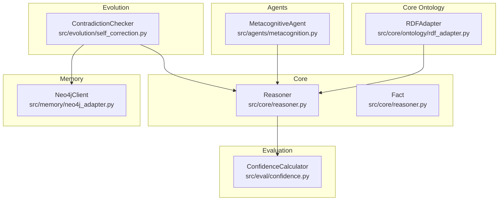
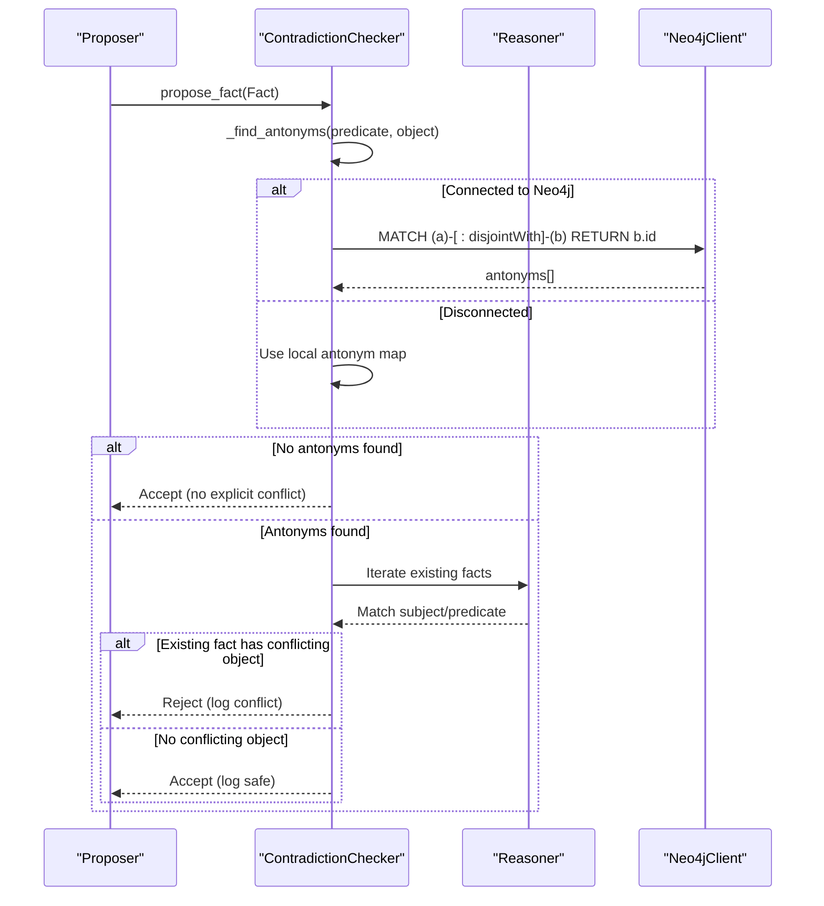
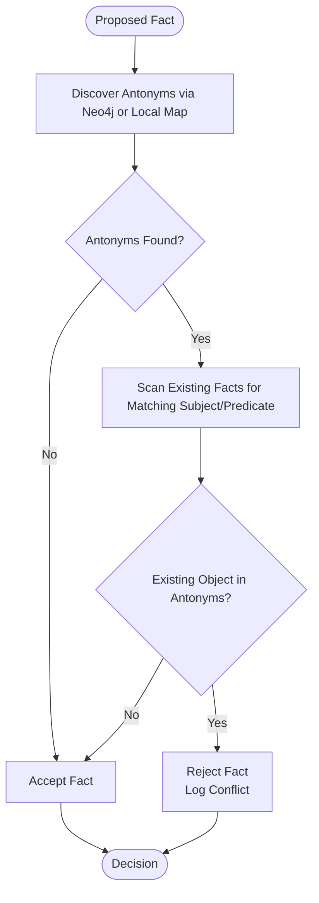
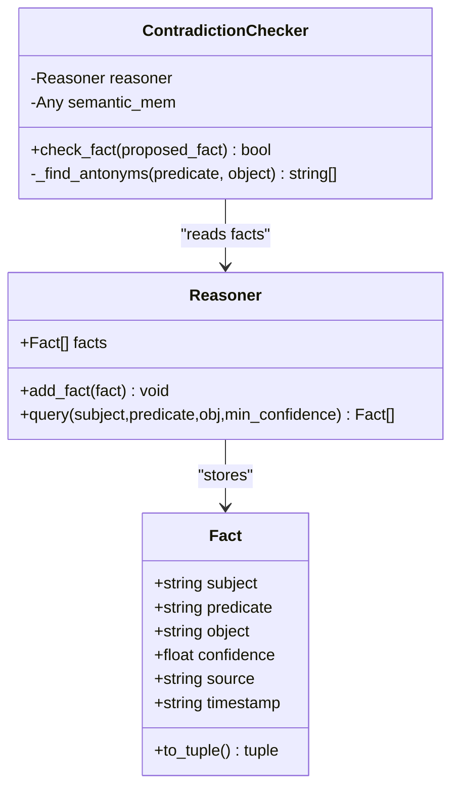
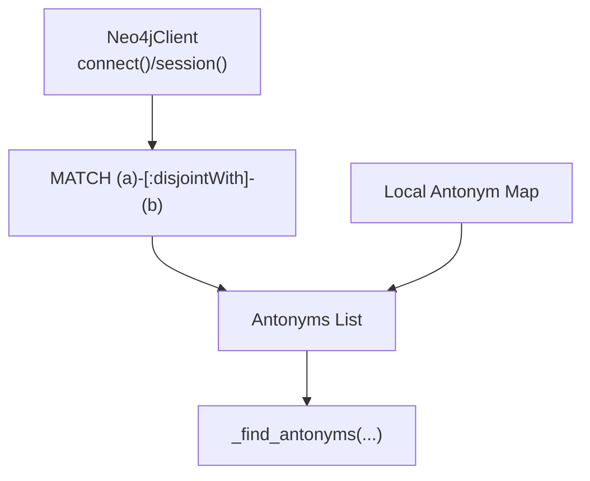
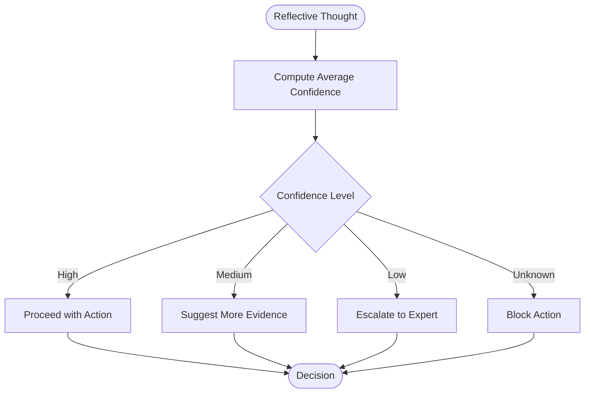
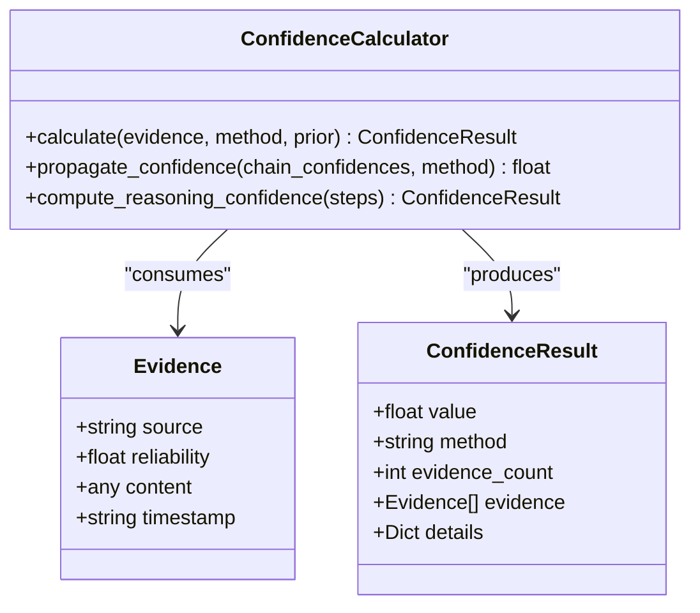
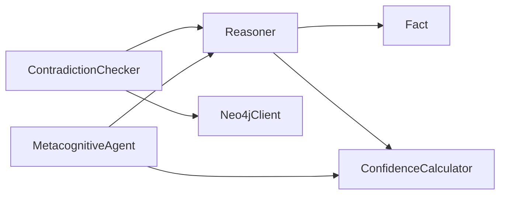

# Contradiction Detection and Prevention

<cite>
**Referenced Files in This Document**
- [self_correction.py](file://src/evolution/self_correction.py)
- [reasoner.py](file://src/core/reasoner.py)
- [neo4j_adapter.py](file://src/memory/neo4j_adapter.py)
- [metacognition.py](file://src/agents/metacognition.py)
- [confidence.py](file://src/eval/confidence.py)
- [rdf_adapter.py](file://src/core/ontology/rdf_adapter.py)
</cite>

## Table of Contents
1. [Introduction](#introduction)
2. [Project Structure](#project-structure)
3. [Core Components](#core-components)
4. [Architecture Overview](#architecture-overview)
5. [Detailed Component Analysis](#detailed-component-analysis)
6. [Dependency Analysis](#dependency-analysis)
7. [Performance Considerations](#performance-considerations)
8. [Troubleshooting Guide](#troubleshooting-guide)
9. [Conclusion](#conclusion)
10. [Appendices](#appendices)

## Introduction
This document describes the contradiction detection and prevention system designed to prevent knowledge contamination and logical inconsistencies in the platform. It focuses on the ContradictionChecker class, which validates proposed facts against existing knowledge using antonym discovery via OWL disjointWith relationships and a Neo4j-backed semantic disconnection mechanism. The document also explains the fact validation process, predicate-object pair conflict resolution, fallback mechanisms, integration with Neo4j, and the decision-making logic for safe knowledge insertion. Practical examples, threshold configurations, and the mathematical foundations linking confidence levels to conflict severity are included, along with logging and error handling mechanisms.

## Project Structure
The contradiction detection system spans several modules:
- Evolution: Contains the ContradictionChecker responsible for validating new facts and discovering antonyms.
- Core Reasoner: Provides the Fact model and inference engine used by the checker.
- Memory Neo4j Adapter: Integrates with Neo4j for semantic disconnection queries and fallbacks.
- Agents Metacognition: Applies confidence thresholds and basic contradiction detection during reflective reasoning loops.
- Evaluation Confidence: Offers mathematical foundations for confidence propagation and aggregation.
- Core Ontology RDF Adapter: Defines OWL constructs including disjointWith semantics for class-level disjunctions.

**Diagram sources**
- [self_correction.py:7-90](file://src/evolution/self_correction.py#L7-L90)
- [reasoner.py:112-124](file://src/core/reasoner.py#L112-L124)
- [neo4j_adapter.py:130-218](file://src/memory/neo4j_adapter.py#L130-L218)
- [metacognition.py:23-90](file://src/agents/metacognition.py#L23-L90)
- [confidence.py:32-297](file://src/eval/confidence.py#L32-L297)
- [rdf_adapter.py:110-143](file://src/core/ontology/rdf_adapter.py#L110-L143)

**Section sources**
- [self_correction.py:7-90](file://src/evolution/self_correction.py#L7-L90)
- [reasoner.py:112-124](file://src/core/reasoner.py#L112-L124)
- [neo4j_adapter.py:130-218](file://src/memory/neo4j_adapter.py#L130-L218)
- [metacognition.py:23-90](file://src/agents/metacognition.py#L23-L90)
- [confidence.py:32-297](file://src/eval/confidence.py#L32-L297)
- [rdf_adapter.py:110-143](file://src/core/ontology/rdf_adapter.py#L110-L143)

## Core Components
- ContradictionChecker: Validates proposed facts against existing knowledge by discovering antonyms via OWL disjointWith relationships in Neo4j and falling back to local antonym sets when disconnected. It checks for predicate-object conflicts and logs decisions.
- Reasoner and Fact: Provide the data model and inference context used by the checker to scan existing facts for conflicts.
- Neo4jClient: Enables querying disjointWith edges for semantic disconnection detection and supports fallback logic when disconnected.
- MetacognitiveAgent: Applies confidence thresholds and simple contradiction detection during reflective reasoning.
- ConfidenceCalculator: Supplies mathematical frameworks for confidence propagation and aggregation, informing conflict severity and safe insertion decisions.
- RDFAdapter: Defines OWL constructs including disjointWith at the class level, underpinning the semantic disconnection model.

**Section sources**
- [self_correction.py:7-90](file://src/evolution/self_correction.py#L7-L90)
- [reasoner.py:112-124](file://src/core/reasoner.py#L112-L124)
- [neo4j_adapter.py:130-218](file://src/memory/neo4j_adapter.py#L130-L218)
- [metacognition.py:23-90](file://src/agents/metacognition.py#L23-L90)
- [confidence.py:32-297](file://src/eval/confidence.py#L32-L297)
- [rdf_adapter.py:110-143](file://src/core/ontology/rdf_adapter.py#L110-L143)

## Architecture Overview
The system integrates three layers:
- Antonym Discovery Layer: Queries Neo4j for owl:disjointWith relationships; falls back to local antonym sets if disconnected.
- Validation Layer: Scans existing facts for predicate-object conflicts with the proposed fact’s object.
- Decision Layer: Logs and returns a safety decision indicating whether to accept or reject the proposed fact.

**Diagram sources**
- [self_correction.py:18-73](file://src/evolution/self_correction.py#L18-L73)
- [reasoner.py:224-237](file://src/core/reasoner.py#L224-L237)
- [neo4j_adapter.py:130-218](file://src/memory/neo4j_adapter.py#L130-L218)

## Detailed Component Analysis

### ContradictionChecker
- Purpose: Prevent knowledge poisoning by detecting logical conflicts before inserting new facts into semantic memory.
- Antonym Discovery:
  - Neo4j Query: Uses owl:disjointWith edges to discover mutually exclusive objects for a given predicate-object pair.
  - Fallback: Local antonym map ensures operation when disconnected (e.g., high_risk/safe/low_risk, true/false).
- Conflict Resolution:
  - Iterates existing facts to find any with identical subject and predicate but conflicting object (present in antonyms).
  - Logs detailed conflict messages and returns a safety decision.
- Safety Decision:
  - Accept if no explicit conflict is found.
  - Reject otherwise, enabling manual review or rollback.

**Diagram sources**
- [self_correction.py:18-73](file://src/evolution/self_correction.py#L18-L73)

**Section sources**
- [self_correction.py:7-90](file://src/evolution/self_correction.py#L7-L90)

### Fact Validation and Predicate-Object Pair Conflict Resolution
- Data Model: Fact encapsulates subject, predicate, object, confidence, source, and timestamp.
- Validation Logic:
  - For each proposed fact, the checker computes antonyms for the object.
  - It scans the Reasoner’s fact list for entries with the same subject and predicate.
  - If the existing object is among the antonyms, a conflict is reported and insertion is blocked.
- Logging:
  - Errors logged for detected conflicts.
  - Info logs confirm safe insertion decisions.

**Diagram sources**
- [reasoner.py:112-124](file://src/core/reasoner.py#L112-L124)
- [self_correction.py:46-73](file://src/evolution/self_correction.py#L46-L73)

**Section sources**
- [reasoner.py:112-124](file://src/core/reasoner.py#L112-L124)
- [self_correction.py:46-73](file://src/evolution/self_correction.py#L46-L73)

### Integration with Neo4j for Semantic Disconnection Detection
- Neo4jClient:
  - Provides connectivity, sessions, and graph operations.
  - Supports disjointWith queries when connected.
  - Falls back to local antonym map when disconnected.
- Owl DisjointWith Semantics:
  - RDFAdapter defines OWL constructs including disjointWith at the class level, aligning with the checker’s antonym discovery.
- Fallback Mechanism:
  - If Neo4j is unavailable or query fails, the checker uses a curated local antonym map to maintain safety.

**Diagram sources**
- [neo4j_adapter.py:130-218](file://src/memory/neo4j_adapter.py#L130-L218)
- [self_correction.py:18-44](file://src/evolution/self_correction.py#L18-L44)
- [rdf_adapter.py:110-143](file://src/core/ontology/rdf_adapter.py#L110-L143)

**Section sources**
- [neo4j_adapter.py:130-218](file://src/memory/neo4j_adapter.py#L130-L218)
- [self_correction.py:18-44](file://src/evolution/self_correction.py#L18-L44)
- [rdf_adapter.py:110-143](file://src/core/ontology/rdf_adapter.py#L110-L143)

### Practical Examples of Conflict Scenarios
- Scenario 1: Risk Classification
  - Proposed: (Subject, risk_level, high_risk)
  - Existing: (Subject, risk_level, safe)
  - Antonyms: high_risk -> [safe, low_risk]
  - Decision: Reject (conflict detected)
- Scenario 2: Boolean Assertion
  - Proposed: (Subject, is_valid, true)
  - Existing: (Subject, is_valid, false)
  - Antonyms: true -> [false]
  - Decision: Reject (conflict detected)
- Scenario 3: No Explicit Conflict
  - Proposed: (Subject, risk_level, low_risk)
  - Antonyms: low_risk -> [high_risk, safe]
  - Existing: (Subject, risk_level, medium)
  - Decision: Accept (no conflict)

Note: These examples illustrate the predicate-object conflict resolution logic without reproducing code.

**Section sources**
- [self_correction.py:38-44](file://src/evolution/self_correction.py#L38-L44)
- [self_correction.py:62-73](file://src/evolution/self_correction.py#L62-L73)

### Threshold Configurations and Decision-Making Logic
- Confidence-Based Reflection:
  - MetacognitiveAgent applies thresholds to assess reasoning soundness and knowledge boundaries.
  - Thresholds: high (≥ 0.85), medium (≥ 0.60), low (≥ 0.40), unknown (< 0.40).
  - Low-confidence reasoning triggers suggestions for additional evidence.
- Safe Insertion Decision:
  - ContradictionChecker’s decision is independent of confidence scores but informs downstream policies.
  - ConfidenceCalculator provides propagation methods (min, arithmetic, geometric, multiplicative) to quantify cumulative uncertainty across reasoning chains.

**Diagram sources**
- [metacognition.py:18-70](file://src/agents/metacognition.py#L18-L70)
- [confidence.py:222-259](file://src/eval/confidence.py#L222-L259)

**Section sources**
- [metacognition.py:18-70](file://src/agents/metacognition.py#L18-L70)
- [confidence.py:222-259](file://src/eval/confidence.py#L222-L259)

### Mathematical Foundations: Logical Consistency and Confidence Propagation
- OWL DisjointWith:
  - RDFAdapter defines disjointWith at the class level, modeling semantic disconnection.
  - ContradictionChecker leverages this semantics to derive antonyms for object validation.
- Confidence Propagation:
  - ConfidenceCalculator supports multiple propagation methods:
    - Min: conservative lower bound across steps.
    - Arithmetic/geometric: averaged propagation.
    - Multiplicative: product-based propagation.
  - These methods inform how uncertainty accumulates or degrades along inference chains, influencing safe insertion decisions indirectly.

**Diagram sources**
- [confidence.py:32-297](file://src/eval/confidence.py#L32-L297)

**Section sources**
- [rdf_adapter.py:110-143](file://src/core/ontology/rdf_adapter.py#L110-L143)
- [confidence.py:32-297](file://src/eval/confidence.py#L32-L297)

## Dependency Analysis
- ContradictionChecker depends on:
  - Reasoner for accessing existing facts.
  - Neo4jClient for semantic disconnection queries.
  - Local antonym map as fallback.
- Reasoner depends on:
  - Fact data model and ConfidenceCalculator for inference and confidence propagation.
- MetacognitiveAgent depends on:
  - Reasoner for inference and confidence computation.
  - ConfidenceCalculator for propagation and reasoning confidence.

**Diagram sources**
- [self_correction.py:14-16](file://src/evolution/self_correction.py#L14-L16)
- [reasoner.py:162-174](file://src/core/reasoner.py#L162-L174)
- [metacognition.py:23-133](file://src/agents/metacognition.py#L23-L133)
- [confidence.py:32-74](file://src/eval/confidence.py#L32-L74)

**Section sources**
- [self_correction.py:14-16](file://src/evolution/self_correction.py#L14-L16)
- [reasoner.py:162-174](file://src/core/reasoner.py#L162-L174)
- [metacognition.py:23-133](file://src/agents/metacognition.py#L23-L133)
- [confidence.py:32-74](file://src/eval/confidence.py#L32-L74)

## Performance Considerations
- Neo4j Query Efficiency:
  - Use targeted Cypher queries with appropriate indexes on Entity id and disjointWith relationships.
  - Batch or cache antonym lookups when processing multiple facts.
- Fallback Local Map:
  - Keep antonym map concise and indexed for O(1) lookup.
- Reasoner Fact Scanning:
  - Limit scanning scope by indexing facts by subject and predicate.
- Confidence Propagation:
  - Prefer min propagation for conservative estimates in high-stakes validation.
- Logging Overhead:
  - Avoid excessive logging in tight loops; batch log entries when validating bulk facts.

[No sources needed since this section provides general guidance]

## Troubleshooting Guide
- Neo4j Connection Failures:
  - Symptom: Antonym queries fail; checker falls back to local map.
  - Action: Verify Neo4j credentials, network connectivity, and driver installation.
- Missing disjointWith Edges:
  - Symptom: No antonyms discovered despite semantic disconnection expectations.
  - Action: Ensure RDFAdapter correctly defines disjointWith relationships and that Neo4j ingestion includes these triples.
- False Positives in Conflict Detection:
  - Symptom: Legitimate facts rejected due to overly broad antonym sets.
  - Action: Refine local antonym map and validate predicate-object specificity.
- Logging and Error Handling:
  - The checker logs Neo4j query errors and conflict detections; review logs to diagnose failures and adjust thresholds or antonym sets accordingly.

**Section sources**
- [self_correction.py:30-35](file://src/evolution/self_correction.py#L30-L35)
- [self_correction.py:66-70](file://src/evolution/self_correction.py#L66-L70)
- [neo4j_adapter.py:176-199](file://src/memory/neo4j_adapter.py#L176-L199)

## Conclusion
The contradiction detection system safeguards knowledge integrity by combining semantic disconnection detection via OWL disjointWith with robust validation of predicate-object pairs. The ContradictionChecker enforces safe insertion decisions, while the Reasoner and ConfidenceCalculator provide the logical and quantitative foundations for inference and uncertainty propagation. Together with Neo4j integration and fallback mechanisms, the system offers a resilient framework to prevent contamination and maintain logical consistency across evolving knowledge bases.

[No sources needed since this section summarizes without analyzing specific files]

## Appendices
- Example Cypher Query for DisjointWith:
  - MATCH (a:Entity {id: $obj})-[:disjointWith]-(b:Entity) RETURN b.id AS antonym
- Confidence Methods:
  - min, arithmetic, geometric, multiplicative propagation supported by ConfidenceCalculator.

[No sources needed since this section provides general guidance]